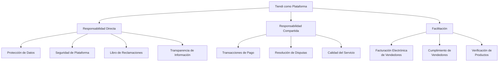
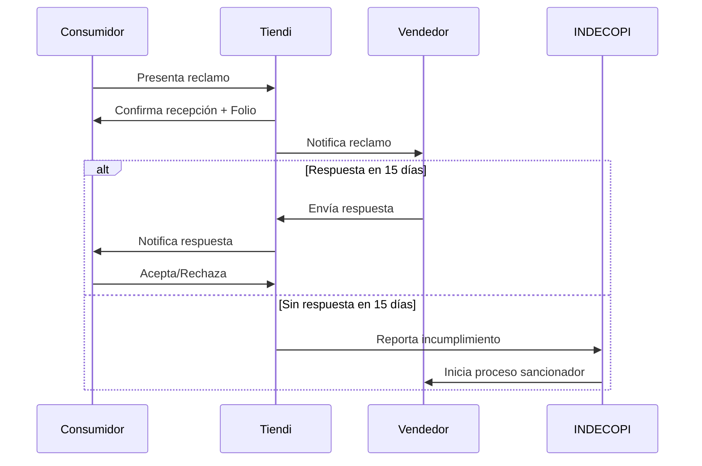

# Cumplimiento Legal y Regulatorio - Tiendi

## Tabla de Contenidos

1. [Marco Legal en Perú](#1-marco-legal-en-perú)
2. [Protección de Datos Personales](#2-protección-de-datos-personales)
3. [Protección al Consumidor](#3-protección-al-consumidor)
4. [Libro de Reclamaciones Digital](#4-libro-de-reclamaciones-digital)
5. [Facturación Electrónica](#5-facturación-electrónica)
6. [Términos y Condiciones](#6-términos-y-condiciones)
7. [Política de Privacidad](#7-política-de-privacidad)
8. [Política de Cookies](#8-política-de-cookies)
9. [Devoluciones y Reembolsos](#9-devoluciones-y-reembolsos)
10. [Propiedad Intelectual](#10-propiedad-intelectual)
11. [Compliance Checklist](#11-compliance-checklist)

---

## 1. Marco Legal en Perú

### 1.1 Leyes Principales Aplicables

| Ley | Descripción | Aplicación en Tiendi |
|-----|-------------|---------------------|
| **Ley N° 29733** | Ley de Protección de Datos Personales | Manejo de datos de usuarios, consentimiento, derechos ARCO |
| **Código de Protección y Defensa del Consumidor (Ley N° 29571)** | Derechos de consumidores | Información clara, devoluciones, libro de reclamaciones |
| **Ley de Comercio Electrónico (Ley N° 27291)** | Validez de contratos electrónicos | Contratos digitales, firmas electrónicas |
| **Ley de Delitos Informáticos (Ley N° 30096)** | Protección contra ciberdelitos | Seguridad de la información, prevención de fraude |
| **D.S. N° 002-2014-MIMP** | Libro de Reclamaciones | Implementación obligatoria del libro de reclamaciones |
| **Resolución de Superintendencia N° 155-2017/SUNAT** | Facturación Electrónica | Emisión de comprobantes electrónicos |

### 1.2 Autoridades Regulatorias

**INDECOPI** (Instituto Nacional de Defensa de la Competencia y de la Propiedad Intelectual)
- Protección al consumidor
- Defensa de la competencia
- Propiedad intelectual
- Supervisión del Libro de Reclamaciones

**Autoridad Nacional de Protección de Datos Personales (ANPDP)**
- Supervisión del cumplimiento de la Ley N° 29733
- Registro de Bancos de Datos Personales
- Sanciones por incumplimiento

**SUNAT** (Superintendencia Nacional de Aduanas y de Administración Tributaria)
- Facturación electrónica
- Obligaciones tributarias
- Emisión de comprobantes de pago

### 1.3 Obligaciones Legales de Tiendi



---

## 2. Protección de Datos Personales

### 2.1 Ley N° 29733 - Marco Normativo

**Principios Fundamentales:**

1. **Legalidad**: Recopilación y tratamiento conforme a ley
2. **Consentimiento**: Autorización expresa e informada
3. **Finalidad**: Propósitos determinados, explícitos y lícitos
4. **Proporcionalidad**: Datos adecuados y no excesivos
5. **Calidad**: Datos exactos y actualizados
6. **Seguridad**: Medidas técnicas y organizativas
7. **Disposición de Recurso**: Derecho a reclamar
8. **Nivel de Protección Adecuado**: Transferencias internacionales

### 2.2 Registro de Bancos de Datos Personales

**Obligación Legal:**
Tiendi debe registrar sus bancos de datos personales ante la ANPDP.

**Bancos de Datos a Registrar:**

```typescript
interface DataBank {
  name: string;
  purpose: string;
  data_types: string[];
  retention_period: string;
  security_measures: string[];
  transfers: boolean;
}

const dataBanks: DataBank[] = [
  {
    name: 'Clientes Tiendi',
    purpose: 'Gestión de usuarios clientes de la plataforma',
    data_types: [
      'Nombres y apellidos',
      'Email',
      'Teléfono',
      'Dirección',
      'DNI',
      'Fecha de nacimiento',
      'Historial de compras',
      'Preferencias de usuario'
    ],
    retention_period: '5 años desde última transacción',
    security_measures: [
      'Encriptación AES-256',
      'Control de acceso basado en roles',
      'Auditoría de accesos',
      'Backups cifrados'
    ],
    transfers: false
  },
  {
    name: 'Vendedores Tiendi',
    purpose: 'Gestión de usuarios vendedores de la plataforma',
    data_types: [
      'Nombres y apellidos',
      'Email',
      'Teléfono',
      'RUC',
      'Razón social',
      'Dirección comercial',
      'Datos bancarios',
      'Documentos de identidad'
    ],
    retention_period: '10 años (obligación tributaria)',
    security_measures: [
      'Encriptación AES-256',
      'Control de acceso basado en roles',
      'Auditoría de accesos',
      'Backups cifrados',
      'Segregación por tenant'
    ],
    transfers: true // Transferencia a procesadores de pago
  },
  {
    name: 'Transacciones',
    purpose: 'Registro de transacciones comerciales',
    data_types: [
      'Datos de compra',
      'Monto de transacción',
      'Método de pago',
      'Dirección de entrega',
      'Fecha y hora',
      'IP de conexión'
    ],
    retention_period: '10 años (obligación tributaria)',
    security_measures: [
      'Encriptación en tránsito y reposo',
      'Tokenización de datos de pago',
      'Auditoría completa',
      'Segregación de datos sensibles'
    ],
    transfers: true // Procesadores de pago, bancos
  }
];
```

**Proceso de Registro:**

1. Completar formulario en: https://www.minjus.gob.pe/rnpdp/
2. Incluir información de bancos de datos
3. Designar responsable de seguridad de datos
4. Pagar tasa administrativa (0.5% UIT por banco)
5. Actualizar anualmente

### 2.3 Derechos ARCO

Los usuarios tienen derecho a:

- **Acceso**: Conocer qué datos personales se tienen
- **Rectificación**: Corregir datos inexactos o incompletos
- **Cancelación**: Eliminar datos cuando corresponda
- **Oposición**: Oponerse al tratamiento de sus datos

**Implementación en Tiendi:**

```typescript
// API Endpoint para solicitudes ARCO
interface ARCORequest {
  type: 'access' | 'rectification' | 'cancellation' | 'opposition';
  user_id: string;
  reason: string;
  requested_data?: any;
}

// Ejemplo de implementación
class ARCOService {
  // Acceso: Exportar todos los datos del usuario
  async handleAccessRequest(userId: string): Promise<UserDataExport> {
    const userData = await this.collectAllUserData(userId);

    return {
      personal_info: userData.profile,
      orders: userData.orders,
      addresses: userData.addresses,
      payment_methods: this.maskSensitiveData(userData.payment_methods),
      reviews: userData.reviews,
      loyalty_points: userData.loyalty,
      preferences: userData.preferences,
      login_history: userData.login_history.slice(-10), // Últimos 10
      export_date: new Date().toISOString(),
      format: 'JSON'
    };
  }

  // Rectificación: Actualizar datos incorrectos
  async handleRectificationRequest(
    userId: string,
    corrections: Partial<UserProfile>
  ): Promise<void> {
    await this.auditLog.create({
      type: 'ARCO_RECTIFICATION',
      user_id: userId,
      changes: corrections,
      timestamp: new Date()
    });

    await this.userService.update(userId, corrections);

    // Notificar al usuario
    await this.notificationService.send({
      user_id: userId,
      type: 'arco_rectification_completed',
      message: 'Tus datos han sido actualizados correctamente'
    });
  }

  // Cancelación: Eliminar datos (derecho al olvido)
  async handleCancellationRequest(userId: string): Promise<void> {
    // Verificar si hay obligaciones pendientes
    const hasActiveOrders = await this.orderService.hasActive(userId);
    const hasDebts = await this.billingService.hasDebts(userId);

    if (hasActiveOrders || hasDebts) {
      throw new Error(
        'No se puede procesar la cancelación debido a obligaciones pendientes'
      );
    }

    // Anonimizar datos en lugar de eliminar (para mantener integridad)
    await this.userService.anonymize(userId);

    // Eliminar datos no esenciales
    await Promise.all([
      this.userService.deleteProfile(userId),
      this.addressService.deleteAll(userId),
      this.preferenceService.deleteAll(userId),
      this.deviceService.deleteAll(userId)
    ]);

    // Mantener datos transaccionales por obligación legal (10 años)
    // pero sin información personal identificable
  }

  // Oposición: Detener procesamiento específico
  async handleOppositionRequest(
    userId: string,
    oppositionType: string
  ): Promise<void> {
    switch (oppositionType) {
      case 'marketing':
        await this.preferenceService.update(userId, {
          marketing_emails: false,
          marketing_sms: false,
          marketing_push: false
        });
        break;

      case 'profiling':
        await this.preferenceService.update(userId, {
          allow_profiling: false,
          allow_personalization: false
        });
        break;

      case 'third_party_sharing':
        await this.preferenceService.update(userId, {
          share_with_partners: false
        });
        break;
    }
  }
}
```

### 2.4 Formulario de Solicitud ARCO

```html
<!-- Formulario web para solicitudes ARCO -->
<form action="/api/v1/arco/request" method="POST">
  <h2>Solicitud de Derechos ARCO</h2>

  <label>Tipo de Solicitud:</label>
  <select name="type" required>
    <option value="access">Acceso - Deseo conocer mis datos personales</option>
    <option value="rectification">Rectificación - Deseo corregir mis datos</option>
    <option value="cancellation">Cancelación - Deseo eliminar mis datos</option>
    <option value="opposition">Oposición - Me opongo al tratamiento de mis datos</option>
  </select>

  <label>Motivo de la Solicitud:</label>
  <textarea name="reason" required></textarea>

  <label>Adjuntar DNI (para verificación):</label>
  <input type="file" name="dni_copy" accept=".pdf,.jpg,.png" required>

  <p class="legal-notice">
    Tu solicitud será procesada en un plazo máximo de 10 días hábiles,
    conforme a la Ley N° 29733.
  </p>

  <button type="submit">Enviar Solicitud</button>
</form>
```

**Plazo de Respuesta:** Máximo 10 días hábiles (Ley N° 29733, Art. 25)

### 2.5 Política de Transferencia de Datos

**Transferencias Nacionales:**
- Procesadores de pago (Niubiz, Culqi)
- Servicios de mensajería (SendGrid, Twilio)
- Servicios de almacenamiento (Azure)
- Servicios de análisis (Google Analytics)

**Transferencias Internacionales:**
- Microsoft Azure (EE.UU.) - Nivel adecuado de protección
- SendGrid (EE.UU.) - Nivel adecuado de protección
- Stripe (EE.UU.) - Nivel adecuado de protección

**Cláusulas de Protección:**
```
Todos los procesadores internacionales de datos deben:
1. Cumplir con estándares equivalentes a Ley N° 29733
2. Firmar Acuerdos de Procesamiento de Datos (DPA)
3. Implementar Cláusulas Contractuales Estándar
4. Certificar cumplimiento (SOC 2, ISO 27001)
5. Notificar brechas de seguridad en 72 horas
```

---

## 3. Protección al Consumidor

### 3.1 Código de Protección y Defensa del Consumidor

**Derechos de los Consumidores (Art. 1):**

1. **Derecho a la información**: Información veraz, suficiente, apropiada y fácilmente accesible
2. **Derecho a la protección de intereses económicos**: Protección contra métodos comerciales coercitivos
3. **Derecho a elegir**: Libre elección de productos y servicios
4. **Derecho a la seguridad y salud**: Productos y servicios que no representen riesgo
5. **Derecho a la reparación**: Indemnización por daños y perjuicios
6. **Derecho a la defensa**: Mecanismos de protección administrativa y judicial

### 3.2 Información Obligatoria

**En la Plataforma Web:**

```html
<!-- Footer de la plataforma -->
<footer>
  <div class="legal-info">
    <h3>Información Legal</h3>
    <ul>
      <li><strong>Razón Social:</strong> Tiendi S.A.C.</li>
      <li><strong>RUC:</strong> 20XXXXXXXXX</li>
      <li><strong>Domicilio Fiscal:</strong> [Dirección completa]</li>
      <li><strong>Email:</strong> contacto@tiendi.pe</li>
      <li><strong>Teléfono:</strong> +51 1 XXX-XXXX</li>
      <li><strong>Horario de Atención:</strong> Lunes a Viernes 9:00 - 18:00</li>
    </ul>
  </div>

  <div class="policies">
    <a href="/terminos-y-condiciones">Términos y Condiciones</a>
    <a href="/politica-de-privacidad">Política de Privacidad</a>
    <a href="/politica-de-cookies">Política de Cookies</a>
    <a href="/politica-de-devoluciones">Política de Devoluciones</a>
    <a href="/libro-reclamaciones">Libro de Reclamaciones</a>
  </div>
</footer>
```

**En Páginas de Producto:**

```typescript
interface ProductLegalInfo {
  // Información obligatoria del producto
  name: string;                    // Nombre del producto
  description: string;             // Descripción clara
  price: number;                   // Precio total incluyendo IGV
  price_includes_tax: boolean;     // Siempre true en Perú
  unit_price?: number;             // Precio unitario si aplica
  stock_availability: boolean;     // Disponibilidad real
  delivery_time: string;           // Tiempo de entrega estimado
  warranty?: {                     // Garantía si aplica
    type: 'manufacturer' | 'seller';
    duration: string;
    terms: string;
  };
  return_policy: string;           // Política de devolución
  seller_info: {                   // Información del vendedor
    name: string;
    ruc: string;
    address: string;
    contact: string;
  };
}
```

### 3.3 Métodos Comerciales Prohibidos

**Prácticas que Tiendi debe evitar:**

1. **Publicidad engañosa**: Información falsa o que induzca a error
2. **Omisión de información relevante**: Ocultar características importantes
3. **Métodos coercitivos**: Presión indebida para comprar
4. **Discriminación**: Trato diferenciado sin justificación objetiva
5. **Cláusulas abusivas**: Términos que perjudiquen injustamente al consumidor

**Implementación de Controles:**

```typescript
// Sistema de verificación de anuncios
class AdvertisingComplianceService {
  async validateProductListing(product: Product): Promise<ValidationResult> {
    const violations: string[] = [];

    // 1. Verificar que el precio incluya IGV
    if (!product.price_includes_tax) {
      violations.push('El precio debe incluir IGV');
    }

    // 2. Verificar disponibilidad real de stock
    const actualStock = await this.inventoryService.getStock(product.id);
    if (product.stock > actualStock) {
      violations.push('Stock declarado no coincide con inventario real');
    }

    // 3. Verificar que las imágenes correspondan al producto
    if (product.images.length === 0) {
      violations.push('Producto debe tener al menos una imagen');
    }

    // 4. Verificar información completa
    const requiredFields = ['name', 'description', 'price', 'category'];
    for (const field of requiredFields) {
      if (!product[field]) {
        violations.push(`Campo obligatorio faltante: ${field}`);
      }
    }

    // 5. Verificar que no haya palabras prohibidas o engañosas
    const misleadingWords = ['gratis', 'sin costo', 'premio garantizado'];
    const hasDeceptive = misleadingWords.some(word =>
      product.description.toLowerCase().includes(word)
    );
    if (hasDeceptive) {
      violations.push('Descripción contiene términos potencialmente engañosos');
    }

    return {
      approved: violations.length === 0,
      violations
    };
  }
}
```

### 3.4 Garantías y Responsabilidad

**Garantía Implícita (Art. 102):**
- Idoneidad: El producto debe ser apto para el uso previsto
- Duración mínima: Según la naturaleza del producto

**Garantía Legal (Art. 104):**
- 7 días para productos no perecibles
- Devolución o cambio si el producto tiene defectos

**Implementación:**

```typescript
interface ReturnPolicy {
  product_id: string;
  return_window_days: number;
  conditions: string[];
  refund_method: 'original_payment' | 'store_credit';
  restocking_fee?: number;
}

class ReturnService {
  async validateReturnRequest(
    orderId: string,
    reason: string
  ): Promise<ReturnEligibility> {
    const order = await this.orderService.findById(orderId);
    const daysSincePurchase = this.calculateDays(order.created_at);

    // Garantía legal de 7 días
    const isWithinLegalWindow = daysSincePurchase <= 7;

    // Verificar condiciones del producto
    const productConditions = await this.verifyProductCondition(order);

    return {
      eligible: isWithinLegalWindow && productConditions.acceptable,
      reason: isWithinLegalWindow
        ? 'Dentro del período de garantía legal'
        : 'Fuera del período de garantía legal',
      refund_amount: order.total,
      refund_method: 'original_payment'
    };
  }
}
```

---

## 4. Libro de Reclamaciones Digital

### 4.1 Obligación Legal

**D.S. N° 002-2014-MIMP**: Establece disposiciones para la implementación del Libro de Reclamaciones.

**Obligatorio para:**
- Proveedores de productos o servicios
- Plataformas de comercio electrónico
- Tiendas físicas y virtuales

### 4.2 Implementación en Tiendi

**Base de Datos:**

```sql
CREATE TABLE libro_reclamaciones (
  id UUID PRIMARY KEY DEFAULT uuid_generate_v4(),

  -- Datos del consumidor
  consumer_name VARCHAR(255) NOT NULL,
  consumer_document_type VARCHAR(20) NOT NULL, -- DNI, CE, RUC
  consumer_document_number VARCHAR(20) NOT NULL,
  consumer_email VARCHAR(255) NOT NULL,
  consumer_phone VARCHAR(20),
  consumer_address TEXT,

  -- Datos del apoderado (si aplica)
  representative_name VARCHAR(255),
  representative_document VARCHAR(20),

  -- Tipo de reclamo
  claim_type VARCHAR(20) NOT NULL, -- 'reclamo' o 'queja'

  -- Detalle de la reclamación
  product_or_service TEXT NOT NULL,
  order_number VARCHAR(50),
  claim_amount DECIMAL(10, 2),
  claim_description TEXT NOT NULL,
  claim_request TEXT NOT NULL,

  -- Datos del proveedor
  provider_id UUID REFERENCES stores(id),
  provider_name VARCHAR(255) NOT NULL,
  provider_ruc VARCHAR(11) NOT NULL,

  -- Estado y seguimiento
  status VARCHAR(20) DEFAULT 'pending', -- pending, in_review, responded, closed
  folio_number VARCHAR(50) UNIQUE NOT NULL, -- Número de folio único

  -- Respuesta del proveedor
  provider_response TEXT,
  provider_response_date TIMESTAMP,

  -- Adjuntos
  attachments JSONB, -- URLs de documentos adjuntos

  -- Fechas
  created_at TIMESTAMP DEFAULT NOW(),
  responded_at TIMESTAMP,
  closed_at TIMESTAMP,

  -- Notificación a INDECOPI
  reported_to_indecopi BOOLEAN DEFAULT FALSE,
  indecopi_report_date TIMESTAMP
);

CREATE INDEX idx_libro_folio ON libro_reclamaciones(folio_number);
CREATE INDEX idx_libro_consumer ON libro_reclamaciones(consumer_document_number);
CREATE INDEX idx_libro_provider ON libro_reclamaciones(provider_id);
CREATE INDEX idx_libro_status ON libro_reclamaciones(status);
```

**Formulario de Libro de Reclamaciones:**

```typescript
interface LibroReclamacionesForm {
  // Identificación del consumidor
  consumer: {
    name: string;
    document_type: 'DNI' | 'CE' | 'RUC' | 'Pasaporte';
    document_number: string;
    email: string;
    phone?: string;
    address: string;
  };

  // Apoderado (opcional)
  representative?: {
    name: string;
    document_number: string;
  };

  // Tipo de solicitud
  claim_type: 'reclamo' | 'queja';

  // Detalle
  details: {
    product_or_service: string;
    order_number?: string;
    amount?: number;
    description: string;  // Detalle del reclamo
    request: string;      // Pedido del consumidor
  };

  // Adjuntos
  attachments?: File[];
}

// Reclamo vs Queja
const definitions = {
  reclamo: 'Disconformidad relacionada con los productos o servicios',
  queja: 'Disconformidad no relacionada con los productos o servicios, sino con la atención al público'
};
```

**API Endpoints:**

```typescript
// POST /api/v1/libro-reclamaciones
async createClaim(data: LibroReclamacionesForm): Promise<ClaimResponse> {
  // Generar número de folio único
  const folioNumber = await this.generateFolioNumber();

  // Crear registro
  const claim = await this.db.libro_reclamaciones.create({
    ...data,
    folio_number: folioNumber,
    status: 'pending'
  });

  // Enviar notificación al proveedor
  await this.notifyProvider(claim);

  // Enviar confirmación al consumidor
  await this.sendConfirmation(data.consumer.email, folioNumber);

  // Enviar copia a INDECOPI (si se configura)
  if (this.config.auto_report_to_indecopi) {
    await this.reportToIndecopi(claim);
  }

  return {
    success: true,
    folio_number: folioNumber,
    message: 'Su reclamo ha sido registrado exitosamente',
    estimated_response_time: '15 días hábiles'
  };
}

// Generar número de folio
async generateFolioNumber(): Promise<string> {
  const year = new Date().getFullYear();
  const count = await this.db.libro_reclamaciones
    .count({ where: { created_at: { gte: new Date(year, 0, 1) } } });

  return `LR-${year}-${String(count + 1).padStart(6, '0')}`;
  // Ejemplo: LR-2025-000123
}

// GET /api/v1/libro-reclamaciones/:folio
async getClaimStatus(folioNumber: string): Promise<ClaimStatus> {
  const claim = await this.db.libro_reclamaciones.findOne({
    where: { folio_number: folioNumber }
  });

  return {
    folio_number: claim.folio_number,
    status: claim.status,
    created_at: claim.created_at,
    provider_response: claim.provider_response,
    responded_at: claim.responded_at
  };
}
```

**Interfaz Web del Libro de Reclamaciones:**

```html
<!DOCTYPE html>
<html lang="es">
<head>
  <meta charset="UTF-8">
  <title>Libro de Reclamaciones - Tiendi</title>
</head>
<body>
  <header>
    
    <h1>Libro de Reclamaciones Virtual</h1>
  </header>

  <section class="intro">
    <p>
      Conforme a lo establecido en el Código de Protección y Defensa del Consumidor,
      esta institución cuenta con un Libro de Reclamaciones a tu disposición.
    </p>

    <div class="definitions">
      <div class="definition">
        <h3>RECLAMO</h3>
        <p>Disconformidad relacionada con los productos o servicios.</p>
      </div>
      <div class="definition">
        <h3>QUEJA</h3>
        <p>Disconformidad no relacionada a los productos o servicios,
        sino con la atención al público.</p>
      </div>
    </div>
  </section>

  <form id="libro-reclamaciones-form">
    <!-- Campos del formulario aquí -->
  </form>

  <section class="important-info">
    <h3>Información Importante</h3>
    <ul>
      <li>La formulación del reclamo no impide acudir a otras vías de solución de controversias ni es requisito previo para interponer una denuncia ante el INDECOPI.</li>
      <li>El proveedor debe dar respuesta al reclamo en un plazo no mayor a quince (15) días hábiles.</li>
      <li>Recibirás una copia de tu reclamo con el número de folio asignado.</li>
    </ul>
  </section>

  <footer>
    <p>Razón Social: Tiendi S.A.C. | RUC: 20XXXXXXXXX</p>
    <p>Dirección: [Dirección completa] | Teléfono: +51 1 XXX-XXXX</p>
  </footer>
</body>
</html>
```

### 4.3 Proceso de Atención de Reclamos



### 4.4 Plazos Legales

- **Respuesta del proveedor**: 15 días hábiles máximo
- **Conservación de registros**: 2 años mínimo
- **Notificación a INDECOPI**: Según requerimiento o denuncia

---

## 5. Facturación Electrónica

### 5.1 Marco Legal

**Resolución de Superintendencia N° 155-2017/SUNAT**:
- Obligación de emitir comprobantes electrónicos
- Aplicable a todos los contribuyentes del RUC

**Tipos de Comprobantes Electrónicos:**

1. **Factura Electrónica**: Operaciones con empresas (B2B)
2. **Boleta de Venta Electrónica**: Operaciones con consumidores finales (B2C)
3. **Nota de Crédito Electrónica**: Anulaciones, devoluciones
4. **Nota de Débito Electrónica**: Cargos adicionales

### 5.2 Integración con SUNAT

**Modelo de Responsabilidad:**

```typescript
interface BillingResponsibility {
  tiendi_role: 'facilitator';    // Tiendi facilita, no factura
  vendor_role: 'issuer';          // Vendedor es el emisor
  tiendi_obligations: string[];
  vendor_obligations: string[];
}

const billingModel: BillingResponsibility = {
  tiendi_role: 'facilitator',
  vendor_role: 'issuer',

  tiendi_obligations: [
    'Proveer herramientas de facturación electrónica',
    'Integración con OSE (Operador de Servicios Electrónicos)',
    'Capacitación a vendedores',
    'Almacenamiento de comprobantes',
    'Reportes de transacciones'
  ],

  vendor_obligations: [
    'Emitir comprobantes por cada venta',
    'Cumplir con obligaciones tributarias',
    'Declarar ingresos a SUNAT',
    'Mantener RUC activo',
    'Cumplir con plazos de emisión'
  ]
};
```

**Integración con OSE:**

```typescript
// Proveedores de Servicios Electrónicos certificados por SUNAT
type OSEProvider = 'nubefact' | 'efact' | 'sunat' | 'facturador';

class ElectronicBillingService {
  private oseClient: OSEClient;

  constructor(provider: OSEProvider) {
    this.oseClient = OSEClientFactory.create(provider);
  }

  async issueInvoice(order: Order, vendor: Vendor): Promise<Invoice> {
    // Construir documento XML según estándar SUNAT
    const invoice: SunatInvoice = {
      // Datos del emisor (vendedor)
      issuer: {
        ruc: vendor.ruc,
        business_name: vendor.business_name,
        trade_name: vendor.trade_name,
        address: vendor.fiscal_address
      },

      // Datos del comprador
      customer: {
        document_type: order.customer.document_type,
        document_number: order.customer.document_number,
        name: order.customer.name,
        email: order.customer.email
      },

      // Detalle de la factura
      items: order.items.map(item => ({
        quantity: item.quantity,
        unit: 'NIU', // Código de unidad de medida
        description: item.product.name,
        unit_price: item.unit_price,
        subtotal: item.subtotal,
        igv: item.subtotal * 0.18,
        total: item.subtotal * 1.18
      })),

      // Totales
      totals: {
        subtotal: order.pricing.subtotal,
        igv: order.pricing.subtotal * 0.18,
        total: order.pricing.total
      },

      // Metadata
      invoice_number: this.generateInvoiceNumber(vendor),
      invoice_date: new Date().toISOString(),
      currency: 'PEN',
      payment_method: order.payment.method
    };

    // Enviar a OSE para firma y envío a SUNAT
    const result = await this.oseClient.sendInvoice(invoice);

    if (result.status === 'accepted') {
      // Almacenar CDR (Constancia de Recepción)
      await this.storeCDR(result.cdr);

      // Almacenar XML y PDF
      await this.storeInvoiceFiles({
        xml: result.xml,
        pdf: result.pdf,
        cdr: result.cdr
      });

      // Enviar al cliente
      await this.sendInvoiceToCustomer(order.customer.email, {
        xml: result.xml,
        pdf: result.pdf
      });

      return {
        id: invoice.invoice_number,
        status: 'accepted',
        sunat_response: result.cdr,
        xml_url: result.xml_url,
        pdf_url: result.pdf_url
      };
    } else {
      throw new Error(`SUNAT rejected invoice: ${result.error_message}`);
    }
  }

  // Generar número de factura (Serie-Correlativo)
  generateInvoiceNumber(vendor: Vendor): string {
    const series = vendor.invoice_series || 'F001';
    const correlative = vendor.invoice_correlative + 1;

    // Actualizar correlativo del vendedor
    vendor.invoice_correlative = correlative;

    return `${series}-${String(correlative).padStart(8, '0')}`;
    // Ejemplo: F001-00000123
  }
}
```

**Estructura XML de Factura Electrónica:**

```xml
<?xml version="1.0" encoding="UTF-8"?>
<Invoice xmlns="urn:oasis:names:specification:ubl:schema:xsd:Invoice-2">
  <cbc:UBLVersionID>2.1</cbc:UBLVersionID>
  <cbc:CustomizationID>2.0</cbc:CustomizationID>
  <cbc:ID>F001-00000123</cbc:ID>
  <cbc:IssueDate>2025-11-25</cbc:IssueDate>
  <cbc:IssueTime>14:30:00</cbc:IssueTime>
  <cbc:InvoiceTypeCode listID="0101">01</cbc:InvoiceTypeCode>
  <cbc:DocumentCurrencyCode>PEN</cbc:DocumentCurrencyCode>

  <!-- Emisor (Vendedor) -->
  <cac:AccountingSupplierParty>
    <cac:Party>
      <cac:PartyIdentification>
        <cbc:ID schemeID="6">20XXXXXXXXX</cbc:ID> <!-- RUC -->
      </cac:PartyIdentification>
      <cac:PartyLegalEntity>
        <cbc:RegistrationName>BODEGA MI VECINO S.A.C.</cbc:RegistrationName>
      </cac:PartyLegalEntity>
    </cac:Party>
  </cac:AccountingSupplierParty>

  <!-- Cliente -->
  <cac:AccountingCustomerParty>
    <cac:Party>
      <cac:PartyIdentification>
        <cbc:ID schemeID="1">12345678</cbc:ID> <!-- DNI -->
      </cac:PartyIdentification>
      <cac:PartyLegalEntity>
        <cbc:RegistrationName>JUAN PEREZ GONZALES</cbc:RegistrationName>
      </cac:PartyLegalEntity>
    </cac:Party>
  </cac:AccountingCustomerParty>

  <!-- Líneas de detalle -->
  <cac:InvoiceLine>
    <cbc:ID>1</cbc:ID>
    <cbc:InvoicedQuantity unitCode="NIU">2</cbc:InvoicedQuantity>
    <cbc:LineExtensionAmount currencyID="PEN">7.00</cbc:LineExtensionAmount>
    <cac:Item>
      <cbc:Description>Coca Cola 500ml</cbc:Description>
    </cac:Item>
    <cac:Price>
      <cbc:PriceAmount currencyID="PEN">3.50</cbc:PriceAmount>
    </cac:Price>
  </cac:InvoiceLine>

  <!-- Totales -->
  <cac:LegalMonetaryTotal>
    <cbc:PayableAmount currencyID="PEN">16.00</cbc:PayableAmount>
  </cac:LegalMonetaryTotal>
</Invoice>
```

### 5.3 Herramientas para Vendedores

**Panel de Facturación:**

```typescript
// Dashboard de facturación para vendedores
interface VendorBillingDashboard {
  // Resumen del período
  period_summary: {
    total_sales: number;
    total_invoices: number;
    total_credit_notes: number;
    total_igv: number;
    period: string; // '2025-11'
  };

  // Facturas recientes
  recent_invoices: Invoice[];

  // Alertas
  alerts: {
    pending_invoices: number;
    rejected_invoices: number;
    missing_customer_data: number;
  };

  // Acciones rápidas
  quick_actions: {
    issue_invoice: boolean;
    download_monthly_report: boolean;
    view_sunat_status: boolean;
  };
}
```

---

## 6. Términos y Condiciones

### 6.1 Estructura Requerida

**Elementos Obligatorios:**

```markdown
# TÉRMINOS Y CONDICIONES DE USO - TIENDI

**Última actualización**: 25 de noviembre de 2025

## 1. ACEPTACIÓN DE LOS TÉRMINOS

Al acceder y utilizar la plataforma Tiendi, usted acepta estar sujeto a estos
Términos y Condiciones...

## 2. DEFINICIONES

- **Plataforma**: El sitio web y aplicación móvil de Tiendi
- **Usuario**: Cualquier persona que acceda a la plataforma
- **Cliente**: Usuario que realiza compras
- **Vendedor**: Usuario que ofrece productos
- **Pedido**: Solicitud de compra de productos

## 3. REGISTRO Y CUENTA DE USUARIO

3.1. Para utilizar ciertos servicios, debe crear una cuenta
3.2. Debe proporcionar información veraz y actualizada
3.3. Es responsable de mantener la confidencialidad de su contraseña
3.4. Debe tener al menos 18 años para crear una cuenta

## 4. USO DE LA PLATAFORMA

4.1. **Uso Permitido**: [Detallar usos permitidos]
4.2. **Uso Prohibido**: [Detallar usos prohibidos]

## 5. PRODUCTOS Y SERVICIOS

5.1. Tiendi actúa como intermediario entre compradores y vendedores
5.2. Los vendedores son responsables de la calidad de los productos
5.3. Los precios incluyen IGV

## 6. PROCESO DE COMPRA

6.1. Selección de productos
6.2. Revisión del carrito
6.3. Confirmación de pedido
6.4. Pago
6.5. Entrega

## 7. PAGOS Y FACTURACIÓN

7.1. Métodos de pago aceptados: [Listar métodos]
7.2. Procesamiento seguro de pagos
7.3. Emisión de comprobantes electrónicos

## 8. ENTREGA

8.1. Tiempos de entrega estimados
8.2. Responsabilidad del vendedor
8.3. Seguimiento de pedidos

## 9. DEVOLUCIONES Y REEMBOLSOS

9.1. Derecho de retracto: 7 días
9.2. Condiciones para devoluciones
9.3. Proceso de reembolso

## 10. PROPIEDAD INTELECTUAL

10.1. Todo el contenido de la plataforma es propiedad de Tiendi
10.2. Prohibido copiar, reproducir o distribuir sin autorización

## 11. PROTECCIÓN DE DATOS PERSONALES

11.1. Cumplimiento con Ley N° 29733
11.2. Ver Política de Privacidad completa

## 12. LIMITACIÓN DE RESPONSABILIDAD

12.1. Tiendi no es responsable por:
- Calidad de productos del vendedor
- Acciones de terceros
- Interrupciones del servicio

## 13. RESOLUCIÓN DE DISPUTAS

13.1. Mecanismos de mediación
13.2. Libro de Reclamaciones
13.3. Jurisdicción y ley aplicable

## 14. MODIFICACIONES

14.1. Tiendi se reserva el derecho de modificar estos términos
14.2. Notificación con 15 días de anticipación

## 15. CONTACTO

Para cualquier consulta:
- Email: legal@tiendi.pe
- Teléfono: +51 1 XXX-XXXX
- Dirección: [Dirección completa]

## 16. ACEPTACIÓN

He leído y acepto los Términos y Condiciones de Uso de Tiendi.

---

**Razón Social**: Tiendi S.A.C.
**RUC**: 20XXXXXXXXX
**Domicilio Fiscal**: [Dirección]
```

### 6.2 Cláusulas Importantes

**Cláusula de Arbitraje:**
```
RESOLUCIÓN DE CONTROVERSIAS

Las partes acuerdan que cualquier controversia derivada de estos Términos
será resuelta mediante arbitraje de derecho, de acuerdo con el Reglamento
de Arbitraje del Centro de Arbitraje de la Cámara de Comercio de Lima.

El arbitraje será:
- De derecho
- Con árbitro único
- Sede en Lima, Perú
- Idioma español

Sin perjuicio de lo anterior, el usuario conserva su derecho de acudir
a INDECOPI y otras autoridades competentes.
```

**Cláusula de Limitación de Responsabilidad:**
```
LIMITACIÓN DE RESPONSABILIDAD

Tiendi actúa como intermediario entre compradores y vendedores. En consecuencia:

1. Los vendedores son los únicos responsables de:
   - Calidad y autenticidad de los productos
   - Cumplimiento de regulaciones sanitarias
   - Emisión de comprobantes de pago
   - Atención post-venta

2. Tiendi no será responsable por:
   - Daños derivados de productos defectuosos
   - Pérdidas indirectas o lucro cesante
   - Acciones de terceros

3. La responsabilidad máxima de Tiendi estará limitada al monto de la
   transacción específica.

Estas limitaciones no aplican en casos de dolo o culpa grave de Tiendi.
```

---

## 7. Política de Privacidad

### 7.1 Contenido Obligatorio

```markdown
# POLÍTICA DE PRIVACIDAD - TIENDI

**Fecha de última actualización**: 25 de noviembre de 2025

## 1. INTRODUCCIÓN

Tiendi S.A.C. (en adelante, "Tiendi") respeta su privacidad y se compromete
a proteger sus datos personales conforme a la Ley N° 29733.

## 2. IDENTIDAD DEL RESPONSABLE

**Razón Social**: Tiendi S.A.C.
**RUC**: 20XXXXXXXXX
**Domicilio**: [Dirección completa]
**Email**: privacidad@tiendi.pe
**Teléfono**: +51 1 XXX-XXXX

## 3. DATOS QUE RECOPILAMOS

### 3.1 Datos proporcionados directamente
- Nombre y apellidos
- Email
- Teléfono
- Dirección
- DNI
- Información de pago

### 3.2 Datos recopilados automáticamente
- Dirección IP
- Cookies
- Datos de navegación
- Ubicación (si autoriza)

### 3.3 Datos de terceros
- Información de redes sociales (si conecta su cuenta)
- Datos de procesadores de pago

## 4. FINALIDAD DEL TRATAMIENTO

Utilizamos sus datos para:

4.1. **Ejecución del contrato**:
- Procesar pedidos
- Gestionar entregas
- Emitir comprobantes
- Atención al cliente

4.2. **Cumplimiento legal**:
- Facturación
- Registro contable
- Respuesta a autoridades

4.3. **Interés legítimo**:
- Prevención de fraude
- Mejora del servicio
- Análisis estadístico

4.4. **Consentimiento**:
- Marketing y publicidad
- Personalización de contenido
- Newsletters

## 5. BASE LEGAL

El tratamiento de sus datos se basa en:
- Ejecución de contrato
- Cumplimiento de obligación legal
- Consentimiento expreso
- Interés legítimo

## 6. CONSERVACIÓN DE DATOS

- **Datos transaccionales**: 10 años (obligación tributaria)
- **Datos de marketing**: Hasta revocación del consentimiento
- **Datos de navegación**: 24 meses

## 7. COMPARTIR DATOS

Sus datos pueden ser compartidos con:

7.1. **Proveedores de servicios**:
- Procesadores de pago (Niubiz, Culqi)
- Servicios de email (SendGrid)
- Servicios de mensajería (Twilio)
- Almacenamiento en la nube (Azure)

7.2. **Vendedores**:
- Datos necesarios para procesar pedido
- Solo información relacionada con la transacción

7.3. **Autoridades**:
- Cuando sea requerido por ley
- SUNAT, INDECOPI, Poder Judicial

## 8. TRANSFERENCIAS INTERNACIONALES

Algunos datos son transferidos a:
- Estados Unidos (Microsoft Azure, SendGrid)
- Unión Europea (servidores de respaldo)

Garantizamos nivel adecuado de protección mediante:
- Cláusulas contractuales estándar
- Certificaciones (SOC 2, ISO 27001)

## 9. DERECHOS DEL TITULAR

Usted tiene derecho a:

9.1. **Acceso**: Conocer qué datos tenemos
9.2. **Rectificación**: Corregir datos inexactos
9.3. **Cancelación**: Eliminar sus datos
9.4. **Oposición**: Oponerse al tratamiento

Para ejercer sus derechos:
- Email: arco@tiendi.pe
- Formulario: https://tiendi.pe/arco
- Plazo de respuesta: 10 días hábiles

## 10. SEGURIDAD

Implementamos medidas de seguridad:
- Encriptación AES-256
- Conexiones HTTPS
- Autenticación de dos factores
- Auditorías regulares
- Control de acceso basado en roles

## 11. COOKIES

Utilizamos cookies para:
- Funcionalidad del sitio
- Análisis de uso
- Personalización

Puede gestionar cookies en su navegador.
Ver nuestra [Política de Cookies](/politica-cookies)

## 12. MENORES DE EDAD

Nuestros servicios están dirigidos a mayores de 18 años.
No recopilamos intencionalmente datos de menores.

## 13. ACTUALIZACIONES

Esta política puede actualizarse periódicamente.
Le notificaremos cambios significativos.

## 14. CONTACTO

Para consultas sobre privacidad:
- Email: privacidad@tiendi.pe
- Teléfono: +51 1 XXX-XXXX
- Formulario de contacto: https://tiendi.pe/contacto

## 15. AUTORIDAD DE CONTROL

Autoridad Nacional de Protección de Datos Personales
- Web: https://www.minjus.gob.pe/rnpdp/
- Email: protecciondedatos@minjus.gob.pe

---

**Última actualización**: 25 de noviembre de 2025
```

---

## 8. Política de Cookies

### 8.1 Contenido de la Política

```markdown
# POLÍTICA DE COOKIES - TIENDI

## 1. ¿QUÉ SON LAS COOKIES?

Las cookies son pequeños archivos de texto que se almacenan en su dispositivo
cuando visita un sitio web. Nos ayudan a mejorar su experiencia.

## 2. TIPOS DE COOKIES QUE UTILIZAMOS

### 2.1 Cookies Esenciales (Obligatorias)
Necesarias para el funcionamiento básico del sitio.

| Cookie | Propósito | Duración |
|--------|-----------|----------|
| session_id | Mantener sesión activa | Sesión |
| csrf_token | Seguridad contra ataques CSRF | Sesión |
| cart_id | Identificar carrito de compras | 7 días |

### 2.2 Cookies de Rendimiento (Opcionales)
Nos ayudan a entender cómo usa el sitio.

| Cookie | Propósito | Duración |
|--------|-----------|----------|
| _ga | Google Analytics - Análisis de uso | 2 años |
| _gid | Google Analytics - Análisis de uso | 24 horas |

### 2.3 Cookies de Funcionalidad (Opcionales)
Recuerdan sus preferencias.

| Cookie | Propósito | Duración |
|--------|-----------|----------|
| lang_pref | Idioma preferido | 1 año |
| location | Ubicación guardada | 30 días |

### 2.4 Cookies de Marketing (Opcionales)
Para publicidad personalizada.

| Cookie | Propósito | Duración |
|--------|-----------|----------|
| fbp | Facebook Pixel | 90 días |
| _gcl | Google Ads Conversion | 90 días |

## 3. GESTIONAR COOKIES

Puede controlar y eliminar cookies en cualquier momento:

**Chrome**: Configuración > Privacidad y seguridad > Cookies
**Firefox**: Configuración > Privacidad y seguridad
**Safari**: Preferencias > Privacidad

O use nuestro panel de configuración:
[Configurar Cookies](#)

## 4. CONSECUENCIAS DE DESACTIVAR COOKIES

Si desactiva cookies esenciales, es posible que:
- No pueda iniciar sesión
- El carrito de compras no funcione
- Algunas funciones no estén disponibles

## 5. ACTUALIZACIONES

Esta política puede actualizarse. Consulte regularmente.

**Última actualización**: 25 de noviembre de 2025
```

### 8.2 Banner de Cookies

```typescript
// Implementación del banner de consentimiento
interface CookieConsent {
  essential: boolean;      // Siempre true, no puede desactivarse
  performance: boolean;    // Opcional
  functionality: boolean;  // Opcional
  marketing: boolean;      // Opcional
}

class CookieConsentManager {
  async showConsentBanner(): Promise<CookieConsent> {
    // Verificar si ya tiene consentimiento guardado
    const savedConsent = this.getSavedConsent();
    if (savedConsent) {
      return savedConsent;
    }

    // Mostrar banner
    return new Promise((resolve) => {
      const banner = this.createConsentBanner();
      document.body.appendChild(banner);

      // Esperar respuesta del usuario
      banner.addEventListener('submit', (e) => {
        const consent = this.getFormData(e.target as HTMLFormElement);
        this.saveConsent(consent);
        banner.remove();
        resolve(consent);
      });
    });
  }

  private createConsentBanner(): HTMLElement {
    const template = `
      <div class="cookie-consent-banner">
        <div class="cookie-consent-content">
          <h3>Usamos cookies</h3>
          <p>
            Utilizamos cookies para mejorar tu experiencia. Las cookies
            esenciales son necesarias para el funcionamiento del sitio.
          </p>

          <form id="cookie-consent-form">
            <label>
              <input type="checkbox" name="essential" checked disabled>
              Cookies esenciales (obligatorias)
            </label>

            <label>
              <input type="checkbox" name="performance" checked>
              Cookies de rendimiento
            </label>

            <label>
              <input type="checkbox" name="functionality" checked>
              Cookies de funcionalidad
            </label>

            <label>
              <input type="checkbox" name="marketing">
              Cookies de marketing
            </label>

            <div class="actions">
              <button type="button" onclick="acceptAll()">
                Aceptar Todas
              </button>
              <button type="button" onclick="rejectOptional()">
                Solo Esenciales
              </button>
              <button type="submit">
                Guardar Preferencias
              </button>
            </div>
          </form>

          <a href="/politica-cookies">Ver Política de Cookies</a>
        </div>
      </div>
    `;

    const div = document.createElement('div');
    div.innerHTML = template;
    return div.firstElementChild as HTMLElement;
  }
}
```

---

## 9. Devoluciones y Reembolsos

### 9.1 Política de Devoluciones

```markdown
# POLÍTICA DE DEVOLUCIONES Y REEMBOLSOS

## 1. DERECHO DE RETRACTO

Conforme al Código de Protección y Defensa del Consumidor, tiene derecho
a devolver productos sin expresión de causa dentro de los **7 días calendario**
siguientes a la recepción.

## 2. CONDICIONES PARA DEVOLUCIÓN

El producto debe:
- Estar en su empaque original
- No haber sido usado
- Conservar etiquetas y sellos
- Incluir todos los accesorios

## 3. PRODUCTOS NO RETORNABLES

- Productos perecibles (alimentos, bebidas)
- Productos de higiene personal abiertos
- Productos personalizados
- Productos en oferta especial (salvo defecto)

## 4. PROCESO DE DEVOLUCIÓN

4.1. Ingresar a "Mis Pedidos"
4.2. Seleccionar "Solicitar Devolución"
4.3. Indicar motivo
4.4. Coordinar recojo o envío
4.5. Esperar aprobación (3 días hábiles)
4.6. Recibir reembolso (7-10 días hábiles)

## 5. MÉTODOS DE REEMBOLSO

- Devolución al medio de pago original
- Crédito en la plataforma
- Transferencia bancaria

## 6. PRODUCTOS DEFECTUOSOS

Si el producto llega defectuoso:
- Notificar dentro de 24 horas
- Enviar fotos del defecto
- Cambio inmediato o reembolso completo
- Tiendi asume costo de envío

## 7. EXCEPCIONES

No aplica derecho de retracto en:
- Servicios ya ejecutados
- Productos perecederos
- Software descargado
- Productos personalizados

## 8. CONTACTO

Para solicitar devolución:
- Email: devoluciones@tiendi.pe
- Teléfono: +51 1 XXX-XXXX
- Chat en línea: https://tiendi.pe/chat
```

---

## 10. Propiedad Intelectual

### 10.1 Protección de Marca y Contenido

```typescript
interface IntellectualProperty {
  trademarks: string[];
  copyrights: string[];
  licenses: License[];
}

const tiendiIP: IntellectualProperty = {
  trademarks: [
    'TIENDI',
    'Logo de Tiendi',
    'Eslogan: "Tu tienda, más cerca"'
  ],

  copyrights: [
    'Código fuente de la plataforma',
    'Diseño de interfaz',
    'Contenido editorial',
    'Imágenes y gráficos',
    'Documentación'
  ],

  licenses: [
    {
      type: 'vendor_license',
      description: 'Licencia de uso de la plataforma para vendedores',
      terms: 'Uso no exclusivo, intransferible, revocable'
    },
    {
      type: 'api_license',
      description: 'Licencia de uso de API',
      terms: 'Uso comercial permitido, atribución requerida'
    }
  ]
};
```

### 10.2 Términos de Uso de Contenido

```markdown
## USO DE CONTENIDO DE TERCEROS

Los vendedores declaran que:

1. Son titulares o tienen autorización para usar:
   - Imágenes de productos
   - Descripciones
   - Marcas registradas

2. No infringen derechos de terceros:
   - Derechos de autor
   - Marcas registradas
   - Patentes

3. Indemnizarán a Tiendi por reclamaciones de terceros

## PROCEDIMIENTO DE NOTIFICACIÓN DMCA

Si cree que su contenido ha sido copiado:

1. Enviar notificación a: dmca@tiendi.pe
2. Incluir:
   - Identificación del contenido protegido
   - URL del contenido infractor
   - Declaración de buena fe
   - Firma electrónica

3. Revisaremos en 48 horas
4. Removemos contenido infractor
5. Notificamos al usuario infractor
```

---

## 11. Compliance Checklist

### 11.1 Checklist de Cumplimiento Legal

```typescript
interface ComplianceChecklist {
  category: string;
  items: ComplianceItem[];
  status: 'compliant' | 'in_progress' | 'pending';
}

const legalCompliance: ComplianceChecklist[] = [
  {
    category: 'Protección de Datos',
    status: 'compliant',
    items: [
      { task: 'Registrar bancos de datos en ANPDP', completed: true },
      { task: 'Implementar formulario ARCO', completed: true },
      { task: 'Política de privacidad publicada', completed: true },
      { task: 'Consentimiento explícito para cookies', completed: true },
      { task: 'Encriptación AES-256 implementada', completed: true },
      { task: 'Auditoría de seguridad anual', completed: true }
    ]
  },
  {
    category: 'Protección al Consumidor',
    status: 'compliant',
    items: [
      { task: 'Libro de reclamaciones digital implementado', completed: true },
      { task: 'Información de contacto visible', completed: true },
      { task: 'Términos y condiciones publicados', completed: true },
      { task: 'Política de devoluciones clara', completed: true },
      { task: 'Precios incluyen IGV', completed: true },
      { task: 'Tiempo de entrega especificado', completed: true }
    ]
  },
  {
    category: 'Facturación Electrónica',
    status: 'compliant',
    items: [
      { task: 'Integración con OSE implementada', completed: true },
      { task: 'Emisión automática de comprobantes', completed: true },
      { task: 'Almacenamiento de XML y PDF', completed: true },
      { task: 'Envío de comprobantes al cliente', completed: true },
      { task: 'Dashboard de facturación para vendedores', completed: true }
    ]
  },
  {
    category: 'Propiedad Intelectual',
    status: 'compliant',
    items: [
      { task: 'Registro de marca TIENDI en INDECOPI', completed: true },
      { task: 'Copyright en footer del sitio', completed: true },
      { task: 'Procedimiento DMCA implementado', completed: true },
      { task: 'Términos de uso de API publicados', completed: true }
    ]
  },
  {
    category: 'Seguridad',
    status: 'compliant',
    items: [
      { task: 'Certificado SSL/TLS activo', completed: true },
      { task: 'PCI-DSS compliance', completed: true },
      { task: 'Auditorías de seguridad trimestrales', completed: true },
      { task: 'Plan de respuesta a incidentes', completed: true },
      { task: 'Backup diario de datos', completed: true }
    ]
  }
];
```

### 11.2 Auditoría de Cumplimiento

```typescript
class ComplianceAuditService {
  async performAudit(): Promise<AuditReport> {
    const results = await Promise.all([
      this.auditDataProtection(),
      this.auditConsumerProtection(),
      this.auditElectronicBilling(),
      this.auditIntellectualProperty(),
      this.auditSecurity()
    ]);

    return {
      audit_date: new Date().toISOString(),
      overall_status: this.calculateOverallStatus(results),
      categories: results,
      recommendations: this.generateRecommendations(results),
      next_audit_date: this.calculateNextAuditDate()
    };
  }

  private async auditDataProtection(): Promise<CategoryAudit> {
    return {
      category: 'Protección de Datos',
      checks: [
        await this.checkDataBankRegistration(),
        await this.checkARCOImplementation(),
        await this.checkConsentMechanism(),
        await this.checkDataEncryption(),
        await this.checkDataRetention()
      ],
      compliance_score: 95
    };
  }

  // ... más auditorías
}
```

---

## Recursos Adicionales

### Contactos Legales

**Tiendi - Departamento Legal:**
- Email: legal@tiendi.pe
- Teléfono: +51 1 XXX-XXXX

**Autoridades:**
- **INDECOPI**: https://www.indecopi.gob.pe | (01) 224-7800
- **ANPDP**: https://www.minjus.gob.pe/rnpdp/ | (01) 208-4700
- **SUNAT**: https://www.sunat.gob.pe | (01) 315-0730

### Documentos de Referencia

- Ley N° 29733: https://www.minjus.gob.pe/wp-content/uploads/2013/04/LEY-29733.pdf
- Código del Consumidor: http://spij.minjus.gob.pe/content/publicaciones_oficiales/img/CODIGO-CONSUMIDOR.pdf
- Guía de Libro de Reclamaciones: https://www.indecopi.gob.pe/libro-reclamaciones

---

**Última actualización**: 2025-11-25
**Versión**: 1.0
