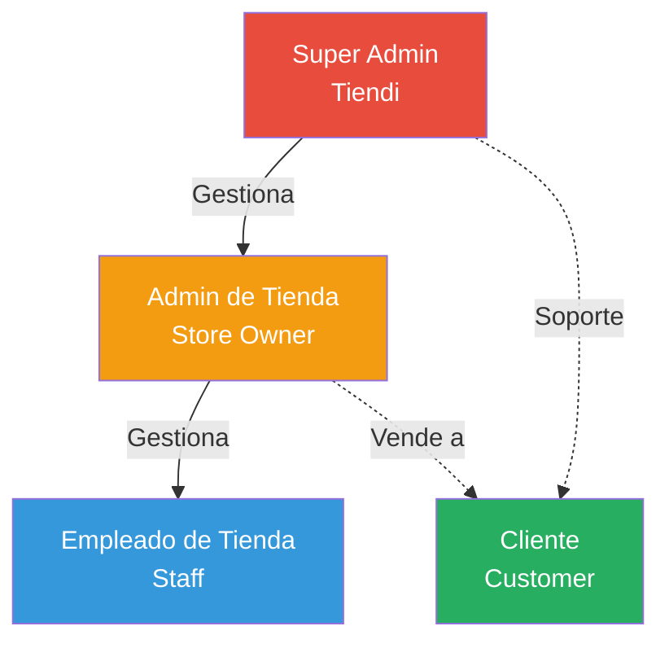
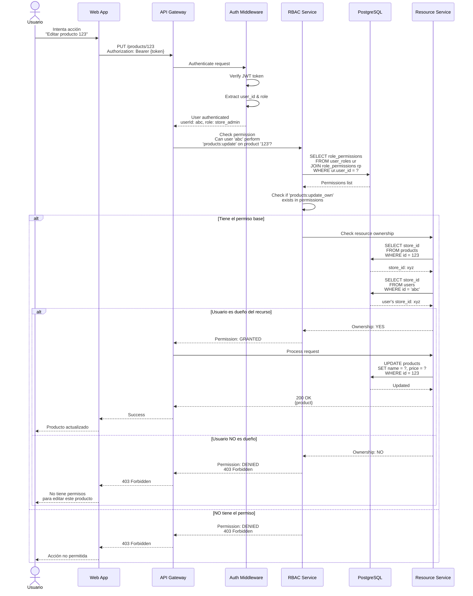
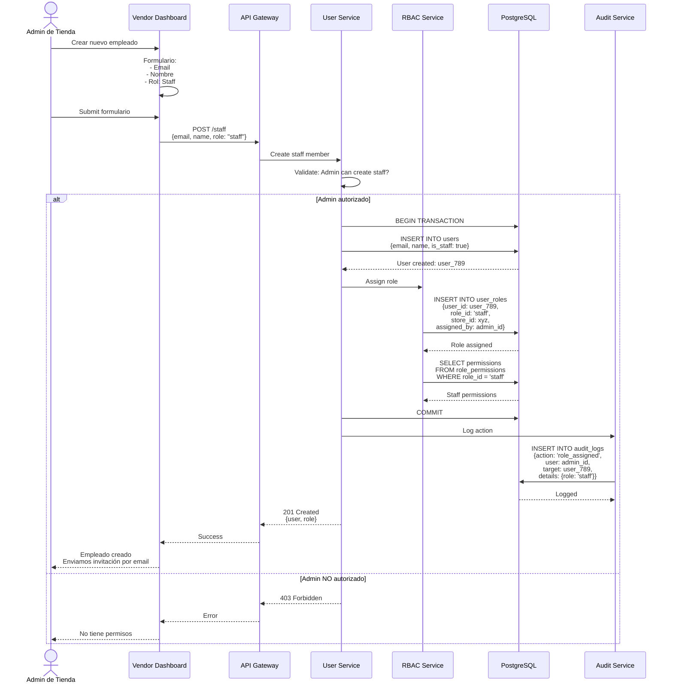

# Sistema de Roles y Permisos (RBAC) - Sistema Tiendi

Este documento describe el sistema de control de acceso basado en roles (RBAC) para Tiendi.

---

## Jerarquía de Roles



---

## Roles del Sistema

### 1. Super Admin (Tiendi Platform)

**Responsabilidades:**
- Administración completa de la plataforma
- Gestión de todas las tiendas
- Configuración del sistema
- Moderación de contenido
- Análisis global de la plataforma

**Permisos:**
```typescript
const SUPER_ADMIN_PERMISSIONS = [
  // Tiendas
  'stores:view_all',
  'stores:create',
  'stores:update_any',
  'stores:delete_any',
  'stores:approve',
  'stores:suspend',

  // Usuarios
  'users:view_all',
  'users:manage_any',
  'users:impersonate',

  // Productos
  'products:view_all',
  'products:moderate',
  'products:delete_any',

  // Pedidos
  'orders:view_all',
  'orders:refund_any',

  // Sistema
  'system:configure',
  'system:analytics',
  'system:audit_logs',

  // Comisiones
  'commissions:configure',
  'commissions:view_all',
  'commissions:process_payouts',

  // Moderación
  'moderation:manage',
  'reports:handle_all'
];
```

### 2. Admin de Tienda (Store Owner)

**Responsabilidades:**
- Gestión completa de su tienda
- Administración de productos e inventario
- Gestión de pedidos de su tienda
- Configuración de la tienda
- Gestión de empleados

**Permisos:**
```typescript
const STORE_ADMIN_PERMISSIONS = [
  // Tienda propia
  'store:view_own',
  'store:update_own',
  'store:configure',

  // Productos
  'products:view_own',
  'products:create',
  'products:update_own',
  'products:delete_own',

  // Inventario
  'inventory:view_own',
  'inventory:adjust',
  'inventory:import',

  // Pedidos
  'orders:view_own',
  'orders:update_status',
  'orders:confirm',
  'orders:reject',

  // Empleados
  'staff:view',
  'staff:create',
  'staff:update',
  'staff:delete',

  // Reportes
  'reports:view_own',
  'analytics:view_own',

  // Cupones
  'coupons:create',
  'coupons:manage_own',

  // Mensajes
  'messages:view_own',
  'messages:respond'
];
```

### 3. Empleado de Tienda (Staff)

**Responsabilidades:**
- Visualización de productos
- Gestión básica de pedidos
- Actualización de inventario
- Respuesta a mensajes de clientes

**Permisos:**
```typescript
const STAFF_PERMISSIONS = [
  // Productos (solo lectura o limitado)
  'products:view_own',
  'products:update_stock',

  // Inventario
  'inventory:view_own',
  'inventory:adjust_limited', // Solo ajustes menores

  // Pedidos
  'orders:view_own',
  'orders:update_status',
  'orders:prepare',

  // Mensajes
  'messages:view_own',
  'messages:respond',

  // Reportes (limitado)
  'reports:view_basic'
];
```

### 4. Cliente (Customer)

**Responsabilidades:**
- Realizar compras
- Gestionar su perfil
- Ver historial de pedidos
- Contactar tiendas

**Permisos:**
```typescript
const CUSTOMER_PERMISSIONS = [
  // Perfil
  'profile:view_own',
  'profile:update_own',

  // Compras
  'cart:manage_own',
  'orders:create',
  'orders:view_own',
  'orders:cancel_own', // Solo si está permitido

  // Favoritos
  'favorites:manage_own',

  // Mensajes
  'messages:send',
  'messages:view_own',

  // Valoraciones
  'reviews:create',
  'reviews:update_own',

  // Direcciones
  'addresses:manage_own'
];
```

---

## Matriz de Permisos

### Gestión de Tiendas

| Acción | Super Admin | Store Admin | Staff | Customer |
|--------|-------------|-------------|-------|----------|
| Ver todas las tiendas | ✅ | ❌ | ❌ | ❌ |
| Ver tienda propia | ✅ | ✅ | ✅ | ❌ |
| Crear tienda | ✅ | ❌ | ❌ | ❌ |
| Editar cualquier tienda | ✅ | ❌ | ❌ | ❌ |
| Editar tienda propia | ✅ | ✅ | ❌ | ❌ |
| Suspender tienda | ✅ | ❌ | ❌ | ❌ |
| Configurar tienda | ✅ | ✅ | ❌ | ❌ |

### Gestión de Productos

| Acción | Super Admin | Store Admin | Staff | Customer |
|--------|-------------|-------------|-------|----------|
| Ver todos los productos | ✅ | ❌ | ❌ | ✅ (públicos) |
| Ver productos de tienda | ✅ | ✅ | ✅ | ✅ |
| Crear producto | ✅ | ✅ | ❌ | ❌ |
| Editar cualquier producto | ✅ | ❌ | ❌ | ❌ |
| Editar producto de tienda | ✅ | ✅ | ⚠️ (solo stock) | ❌ |
| Eliminar cualquier producto | ✅ | ❌ | ❌ | ❌ |
| Eliminar producto de tienda | ✅ | ✅ | ❌ | ❌ |
| Moderar productos | ✅ | ❌ | ❌ | ❌ |

### Gestión de Pedidos

| Acción | Super Admin | Store Admin | Staff | Customer |
|--------|-------------|-------------|-------|----------|
| Ver todos los pedidos | ✅ | ❌ | ❌ | ❌ |
| Ver pedidos de tienda | ✅ | ✅ | ✅ | ❌ |
| Ver pedidos propios | ✅ | ✅ | ✅ | ✅ |
| Crear pedido | ✅ | ✅ | ✅ | ✅ |
| Confirmar pedido | ✅ | ✅ | ✅ | ❌ |
| Rechazar pedido | ✅ | ✅ | ⚠️ (limitado) | ❌ |
| Cancelar pedido (cliente) | ✅ | ✅ | ❌ | ⚠️ (propio, si permitido) |
| Cambiar estado | ✅ | ✅ | ✅ | ❌ |
| Procesar reembolso | ✅ | ⚠️ (propio) | ❌ | ❌ |

### Gestión de Inventario

| Acción | Super Admin | Store Admin | Staff | Customer |
|--------|-------------|-------------|-------|----------|
| Ver inventario global | ✅ | ❌ | ❌ | ❌ |
| Ver inventario de tienda | ✅ | ✅ | ✅ | ❌ |
| Ajustar inventario | ✅ | ✅ | ⚠️ (ajustes pequeños) | ❌ |
| Importar inventario | ✅ | ✅ | ❌ | ❌ |
| Ver historial de ajustes | ✅ | ✅ | ⚠️ (solo lectura) | ❌ |

### Gestión de Usuarios

| Acción | Super Admin | Store Admin | Staff | Customer |
|--------|-------------|-------------|-------|----------|
| Ver todos los usuarios | ✅ | ❌ | ❌ | ❌ |
| Ver empleados de tienda | ✅ | ✅ | ❌ | ❌ |
| Crear empleado | ✅ | ✅ | ❌ | ❌ |
| Editar empleado | ✅ | ✅ | ❌ | ❌ |
| Eliminar empleado | ✅ | ✅ | ❌ | ❌ |
| Asignar roles | ✅ | ⚠️ (solo staff) | ❌ | ❌ |
| Ver perfil propio | ✅ | ✅ | ✅ | ✅ |
| Editar perfil propio | ✅ | ✅ | ✅ | ✅ |

---

## Diagrama de Secuencia: Validación de Permisos



---

## Diagrama de Secuencia: Asignación de Rol



---

## Base de Datos - Tablas de RBAC

### Tabla: roles

```sql
CREATE TABLE roles (
  id VARCHAR(50) PRIMARY KEY, -- 'super_admin', 'store_admin', 'staff', 'customer'
  name VARCHAR(100) NOT NULL,
  description TEXT,
  level INTEGER NOT NULL, -- Jerarquía: 1=super, 2=admin, 3=staff, 4=customer
  is_system_role BOOLEAN DEFAULT FALSE, -- No puede ser eliminado
  created_at TIMESTAMP DEFAULT NOW()
);

-- Datos iniciales
INSERT INTO roles (id, name, description, level, is_system_role) VALUES
('super_admin', 'Super Administrador', 'Administrador de plataforma Tiendi', 1, TRUE),
('store_admin', 'Administrador de Tienda', 'Dueño/Admin de tienda', 2, TRUE),
('staff', 'Empleado', 'Empleado de tienda', 3, TRUE),
('customer', 'Cliente', 'Cliente de la plataforma', 4, TRUE);
```

### Tabla: permissions

```sql
CREATE TABLE permissions (
  id UUID PRIMARY KEY DEFAULT uuid_generate_v4(),
  code VARCHAR(100) UNIQUE NOT NULL, -- 'products:create', 'orders:view_own'
  resource VARCHAR(50) NOT NULL, -- 'products', 'orders', 'users'
  action VARCHAR(50) NOT NULL, -- 'create', 'view', 'update', 'delete'
  scope VARCHAR(50) DEFAULT 'own', -- 'own', 'all', 'store', 'none'
  description TEXT,
  created_at TIMESTAMP DEFAULT NOW()
);

-- Índice para búsquedas rápidas
CREATE INDEX idx_permissions_resource_action ON permissions(resource, action, scope);
```

### Tabla: role_permissions

```sql
CREATE TABLE role_permissions (
  role_id VARCHAR(50) NOT NULL REFERENCES roles(id),
  permission_id UUID NOT NULL REFERENCES permissions(id),
  created_at TIMESTAMP DEFAULT NOW(),
  PRIMARY KEY (role_id, permission_id)
);

-- Índice para lookup rápido de permisos por rol
CREATE INDEX idx_role_permissions_role ON role_permissions(role_id);
```

### Tabla: user_roles

```sql
CREATE TABLE user_roles (
  id UUID PRIMARY KEY DEFAULT uuid_generate_v4(),
  user_id UUID NOT NULL REFERENCES users(id),
  role_id VARCHAR(50) NOT NULL REFERENCES roles(id),
  store_id UUID REFERENCES stores(id), -- NULL para super_admin y customer
  assigned_by UUID REFERENCES users(id),
  assigned_at TIMESTAMP DEFAULT NOW(),
  expires_at TIMESTAMP, -- Para roles temporales

  CONSTRAINT check_store_requirement CHECK (
    (role_id IN ('super_admin', 'customer') AND store_id IS NULL) OR
    (role_id IN ('store_admin', 'staff') AND store_id IS NOT NULL)
  )
);

-- Un usuario puede tener múltiples roles (ej: staff en varias tiendas)
CREATE INDEX idx_user_roles_user ON user_roles(user_id);
CREATE INDEX idx_user_roles_store ON user_roles(store_id) WHERE store_id IS NOT NULL;

-- Evitar roles duplicados para mismo usuario + tienda
CREATE UNIQUE INDEX idx_user_roles_unique ON user_roles(user_id, role_id, COALESCE(store_id, '00000000-0000-0000-0000-000000000000'::UUID));
```

---

## Implementación - Middleware de Permisos

### Middleware de Autorización

```typescript
import { Request, Response, NextFunction } from 'express';

interface PermissionCheck {
  resource: string;
  action: string;
  scope?: 'own' | 'store' | 'all';
}

export function requirePermission(check: PermissionCheck) {
  return async (req: Request, res: Response, next: NextFunction) => {
    const userId = req.user?.id;
    const userRole = req.user?.role;

    if (!userId || !userRole) {
      return res.status(401).json({ error: 'Unauthorized' });
    }

    try {
      // Obtener permisos del usuario
      const permissions = await getUserPermissions(userId);

      // Verificar si tiene el permiso
      const permissionCode = `${check.resource}:${check.action}${check.scope ? '_' + check.scope : ''}`;
      const hasPermission = permissions.includes(permissionCode);

      if (!hasPermission) {
        return res.status(403).json({
          error: 'Forbidden',
          message: `Missing permission: ${permissionCode}`
        });
      }

      // Si el scope es 'own' o 'store', verificar ownership
      if (check.scope === 'own' || check.scope === 'store') {
        const resourceId = req.params.id;
        const hasOwnership = await checkOwnership(
          userId,
          check.resource,
          resourceId,
          check.scope
        );

        if (!hasOwnership) {
          return res.status(403).json({
            error: 'Forbidden',
            message: 'You do not have access to this resource'
          });
        }
      }

      // Usuario autorizado
      next();
    } catch (error) {
      console.error('Permission check error:', error);
      res.status(500).json({ error: 'Internal server error' });
    }
  };
}

// Uso en routes
router.put(
  '/products/:id',
  authenticate,
  requirePermission({
    resource: 'products',
    action: 'update',
    scope: 'own'
  }),
  updateProduct
);

router.delete(
  '/products/:id',
  authenticate,
  requirePermission({
    resource: 'products',
    action: 'delete',
    scope: 'own'
  }),
  deleteProduct
);

router.get(
  '/admin/analytics',
  authenticate,
  requirePermission({
    resource: 'analytics',
    action: 'view',
    scope: 'all'
  }),
  getGlobalAnalytics
);
```

### Servicio de RBAC

```typescript
class RBACService {
  /**
   * Obtener todos los permisos de un usuario
   */
  async getUserPermissions(userId: string): Promise<string[]> {
    // Cachear permisos por 5 minutos
    const cacheKey = `permissions:${userId}`;
    const cached = await redis.get(cacheKey);

    if (cached) {
      return JSON.parse(cached);
    }

    const result = await db.query(`
      SELECT DISTINCT p.code
      FROM user_roles ur
      JOIN role_permissions rp ON ur.role_id = rp.role_id
      JOIN permissions p ON rp.permission_id = p.id
      WHERE ur.user_id = $1
        AND (ur.expires_at IS NULL OR ur.expires_at > NOW())
    `, [userId]);

    const permissions = result.rows.map(row => row.code);

    // Cachear resultado
    await redis.setex(cacheKey, 300, JSON.stringify(permissions));

    return permissions;
  }

  /**
   * Verificar si usuario tiene permiso específico
   */
  async hasPermission(
    userId: string,
    permission: string
  ): Promise<boolean> {
    const permissions = await this.getUserPermissions(userId);
    return permissions.includes(permission);
  }

  /**
   * Verificar ownership de recurso
   */
  async checkOwnership(
    userId: string,
    resource: string,
    resourceId: string,
    scope: 'own' | 'store'
  ): Promise<boolean> {
    if (scope === 'own') {
      // Verificar que el recurso pertenece directamente al usuario
      const result = await db.query(`
        SELECT 1 FROM ${resource}
        WHERE id = $1 AND user_id = $2
      `, [resourceId, userId]);

      return result.rows.length > 0;
    }

    if (scope === 'store') {
      // Verificar que el recurso pertenece a la tienda del usuario
      const userStore = await db.query(`
        SELECT store_id FROM user_roles
        WHERE user_id = $1 AND role_id IN ('store_admin', 'staff')
      `, [userId]);

      if (userStore.rows.length === 0) {
        return false;
      }

      const storeId = userStore.rows[0].store_id;

      const result = await db.query(`
        SELECT 1 FROM ${resource}
        WHERE id = $1 AND store_id = $2
      `, [resourceId, storeId]);

      return result.rows.length > 0;
    }

    return false;
  }

  /**
   * Asignar rol a usuario
   */
  async assignRole(
    userId: string,
    roleId: string,
    storeId: string | null,
    assignedBy: string
  ): Promise<void> {
    await db.query(`
      INSERT INTO user_roles (user_id, role_id, store_id, assigned_by)
      VALUES ($1, $2, $3, $4)
    `, [userId, roleId, storeId, assignedBy]);

    // Invalidar caché de permisos
    await redis.del(`permissions:${userId}`);

    // Log de auditoría
    await auditService.log({
      action: 'role_assigned',
      userId: assignedBy,
      targetUserId: userId,
      details: { roleId, storeId }
    });
  }

  /**
   * Remover rol de usuario
   */
  async removeRole(
    userId: string,
    roleId: string,
    storeId: string | null
  ): Promise<void> {
    await db.query(`
      DELETE FROM user_roles
      WHERE user_id = $1 AND role_id = $2
        AND (store_id = $3 OR (store_id IS NULL AND $3 IS NULL))
    `, [userId, roleId, storeId]);

    // Invalidar caché
    await redis.del(`permissions:${userId}`);
  }
}

export const rbacService = new RBACService();
```

### Decoradores para Controladores

```typescript
// Decorador de permisos
export function RequirePermission(permission: string) {
  return function (
    target: any,
    propertyKey: string,
    descriptor: PropertyDescriptor
  ) {
    const originalMethod = descriptor.value;

    descriptor.value = async function (...args: any[]) {
      const req = args[0] as Request;
      const res = args[1] as Response;
      const userId = req.user?.id;

      if (!userId) {
        return res.status(401).json({ error: 'Unauthorized' });
      }

      const hasPermission = await rbacService.hasPermission(
        userId,
        permission
      );

      if (!hasPermission) {
        return res.status(403).json({
          error: 'Forbidden',
          message: `Missing permission: ${permission}`
        });
      }

      return originalMethod.apply(this, args);
    };

    return descriptor;
  };
}

// Uso en controlador
class ProductController {
  @RequirePermission('products:create')
  async createProduct(req: Request, res: Response) {
    // Lógica de creación
  }

  @RequirePermission('products:update_own')
  async updateProduct(req: Request, res: Response) {
    // Lógica de actualización
  }
}
```

---

## Tests de Permisos

```typescript
describe('RBAC System', () => {
  describe('getUserPermissions', () => {
    it('should return all permissions for store admin', async () => {
      const adminUser = await createTestUser({
        role: 'store_admin',
        storeId: 'store-123'
      });

      const permissions = await rbacService.getUserPermissions(adminUser.id);

      expect(permissions).toContain('products:create');
      expect(permissions).toContain('products:update_own');
      expect(permissions).toContain('orders:view_own');
      expect(permissions).not.toContain('stores:delete_any');
    });

    it('should return limited permissions for staff', async () => {
      const staffUser = await createTestUser({
        role: 'staff',
        storeId: 'store-123'
      });

      const permissions = await rbacService.getUserPermissions(staffUser.id);

      expect(permissions).toContain('orders:view_own');
      expect(permissions).toContain('orders:update_status');
      expect(permissions).not.toContain('products:create');
      expect(permissions).not.toContain('products:delete_own');
    });
  });

  describe('checkOwnership', () => {
    it('should allow store admin to access their store products', async () => {
      const admin = await createTestUser({ role: 'store_admin' });
      const product = await createTestProduct({ storeId: admin.storeId });

      const hasOwnership = await rbacService.checkOwnership(
        admin.id,
        'products',
        product.id,
        'store'
      );

      expect(hasOwnership).toBe(true);
    });

    it('should deny store admin access to other store products', async () => {
      const admin1 = await createTestUser({ role: 'store_admin', storeId: 'store-1' });
      const product = await createTestProduct({ storeId: 'store-2' });

      const hasOwnership = await rbacService.checkOwnership(
        admin1.id,
        'products',
        product.id,
        'store'
      );

      expect(hasOwnership).toBe(false);
    });
  });
});
```

---

## Mejores Prácticas

### ✅ DO

1. **Principio de mínimo privilegio**: Asignar solo permisos necesarios
2. **Validar en backend**: Nunca confiar solo en validación de frontend
3. **Cachear permisos**: Reducir queries a DB con caché de corta duración
4. **Auditar cambios**: Loggear todas las asignaciones/revocaciones de roles
5. **Roles temporales**: Usar `expires_at` para accesos temporales
6. **Jerarquía de roles**: Super Admin > Store Admin > Staff > Customer

### ❌ DON'T

1. **No hardcodear roles** en el código (usar DB)
2. **No permitir privilege escalation** (staff no puede crear admins)
3. **No cachear permisos por mucho tiempo** (máx 5-10 minutos)
4. **No olvidar multi-tenancy** (validar store_id siempre)
5. **No exponer detalles de permisos** en mensajes de error

---

**Fecha de creación:** 2025-11-24
**Versión:** 1.0
**Autor:** Sistema Tiendi
