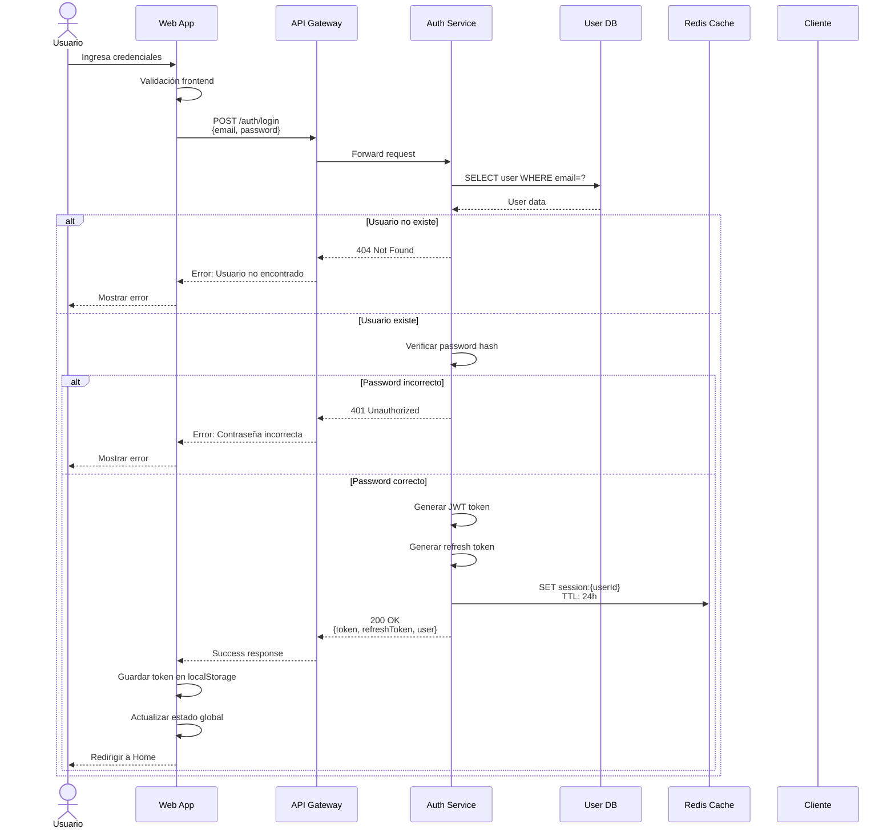
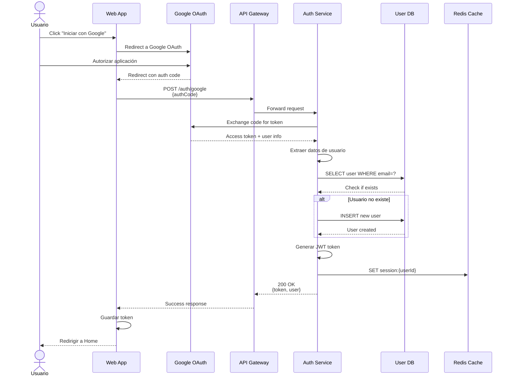
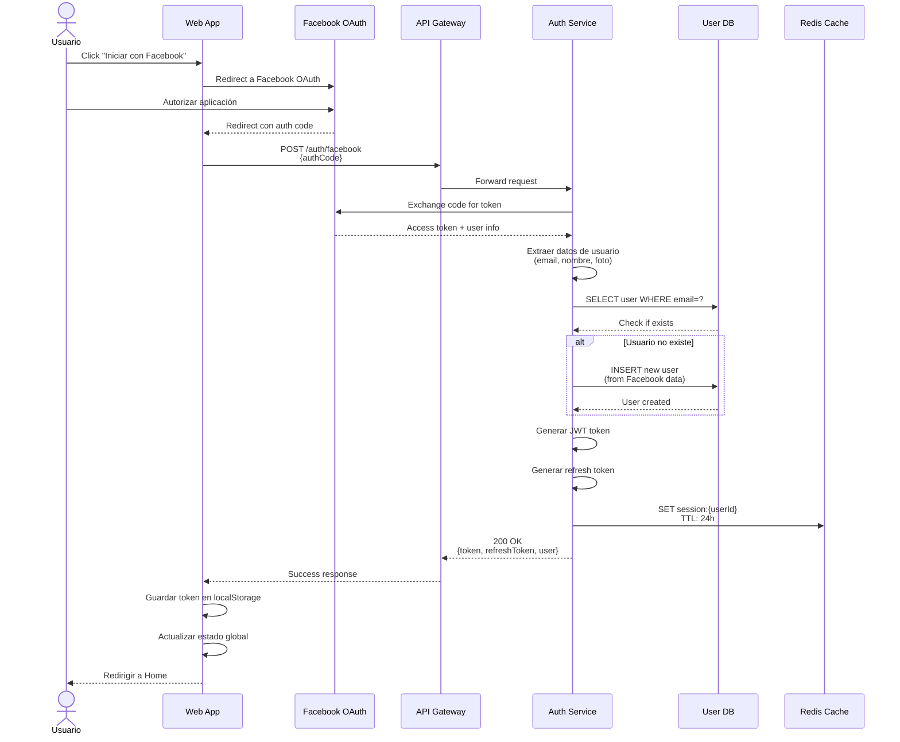
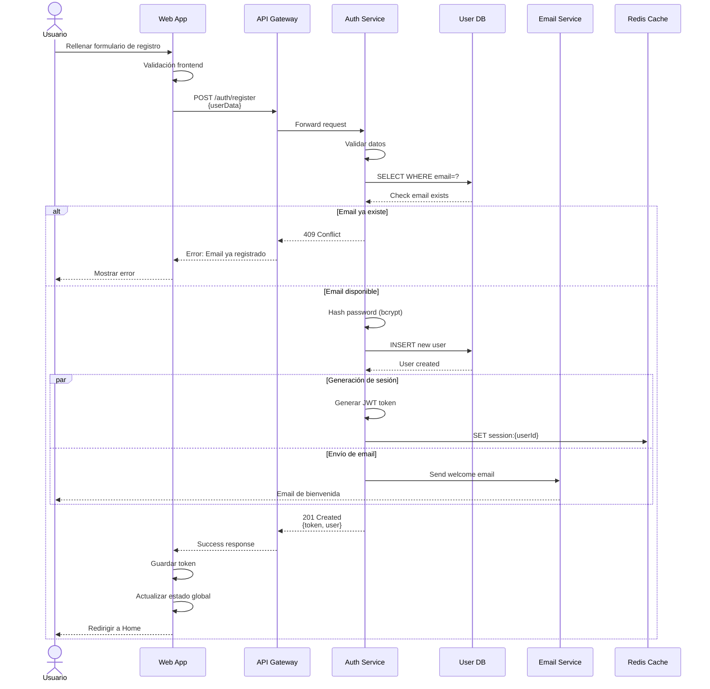
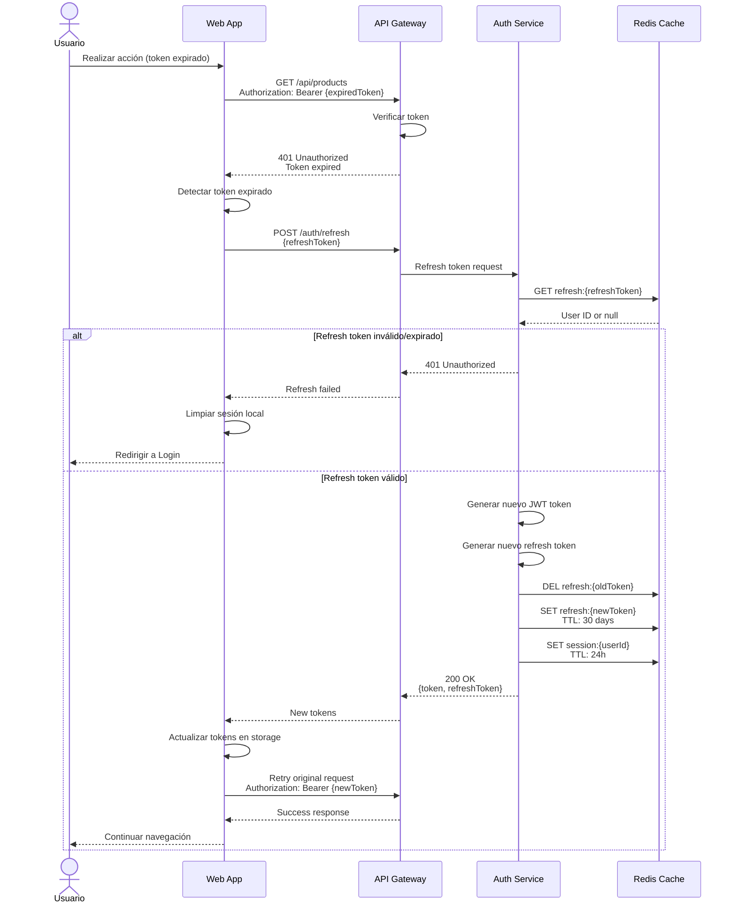
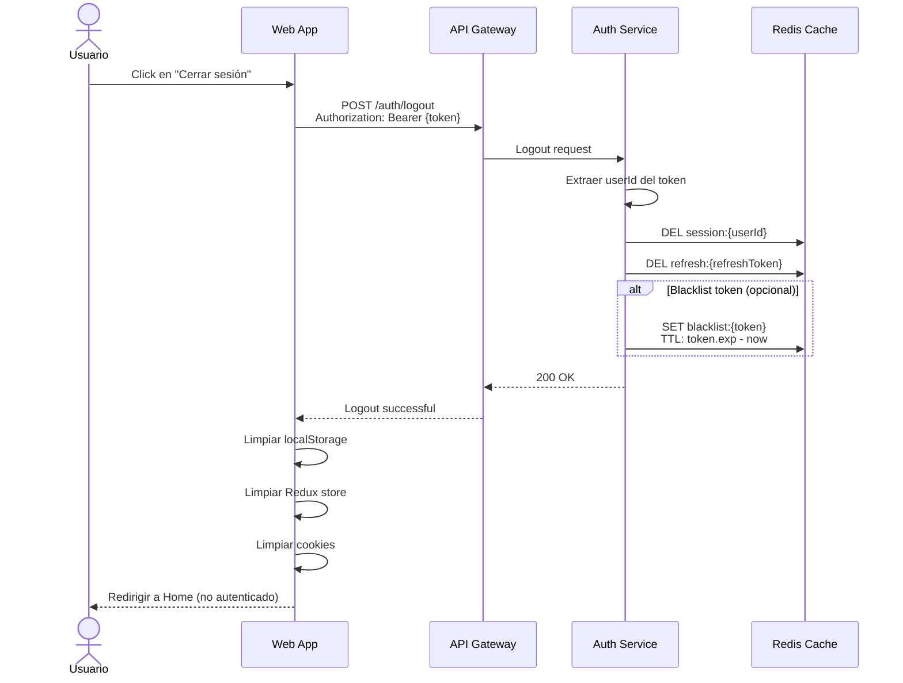
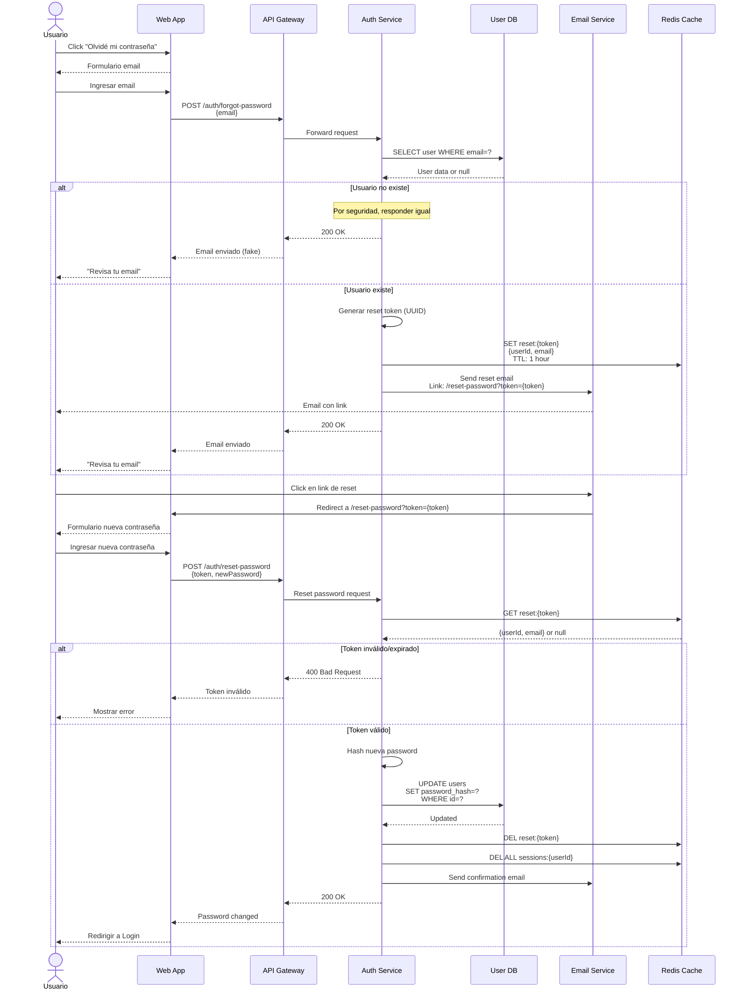
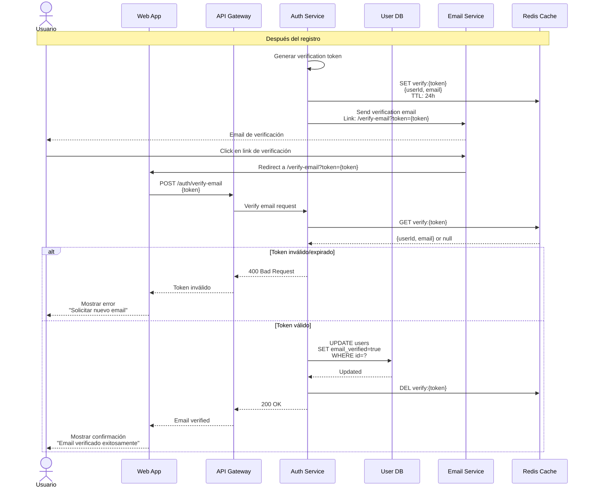

# Diagramas de Secuencia - Autenticación - Sistema Tiendi

Este documento contiene los diagramas de secuencia relacionados con la autenticación de usuarios.

---

## 1. Secuencia de Login con Email/Password



---

## 2. Secuencia de Login con Google OAuth



---

## 3. Secuencia de Login con Facebook OAuth



---

## 4. Secuencia de Registro de Usuario



---

## 5. Secuencia de Refresh Token



---

## 6. Secuencia de Logout



---

## 7. Secuencia de Recuperación de Contraseña



---

## 8. Secuencia de Verificación de Email (Opcional)



---

## Consideraciones de Seguridad

### Tokens JWT
```javascript
// Estructura del JWT payload
{
  "sub": "user-uuid-123",           // User ID
  "email": "user@example.com",
  "role": "customer",
  "iat": 1700000000,                // Issued at
  "exp": 1700086400                 // Expires (24h después)
}
```

### Password Hashing
```javascript
// Usar bcrypt con salt rounds adecuado
const bcrypt = require('bcrypt');
const saltRounds = 12;
const hashedPassword = await bcrypt.hash(password, saltRounds);
```

### Rate Limiting
```javascript
// Limitar intentos de login
// 5 intentos por IP cada 15 minutos
{
  windowMs: 15 * 60 * 1000,
  max: 5,
  message: 'Demasiados intentos de login'
}
```

### Validaciones

1. **Email**: Formato válido, dominio existente
2. **Password**:
   - Mínimo 8 caracteres
   - Al menos 1 mayúscula
   - Al menos 1 minúscula
   - Al menos 1 número
   - Al menos 1 carácter especial
3. **Nombres**: Sin caracteres especiales maliciosos
4. **Documento**: Formato válido según tipo

---

**Fecha de creación:** 2025-11-24
**Versión:** 1.0
