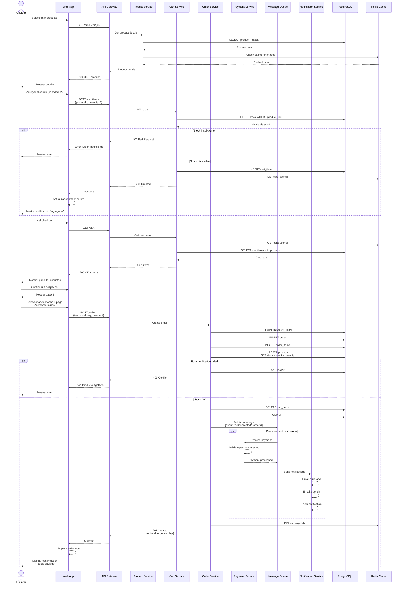
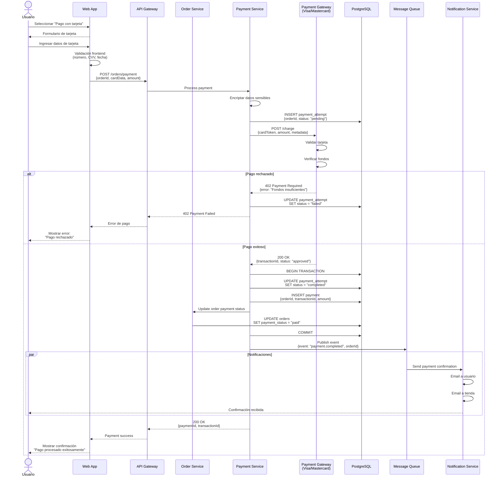
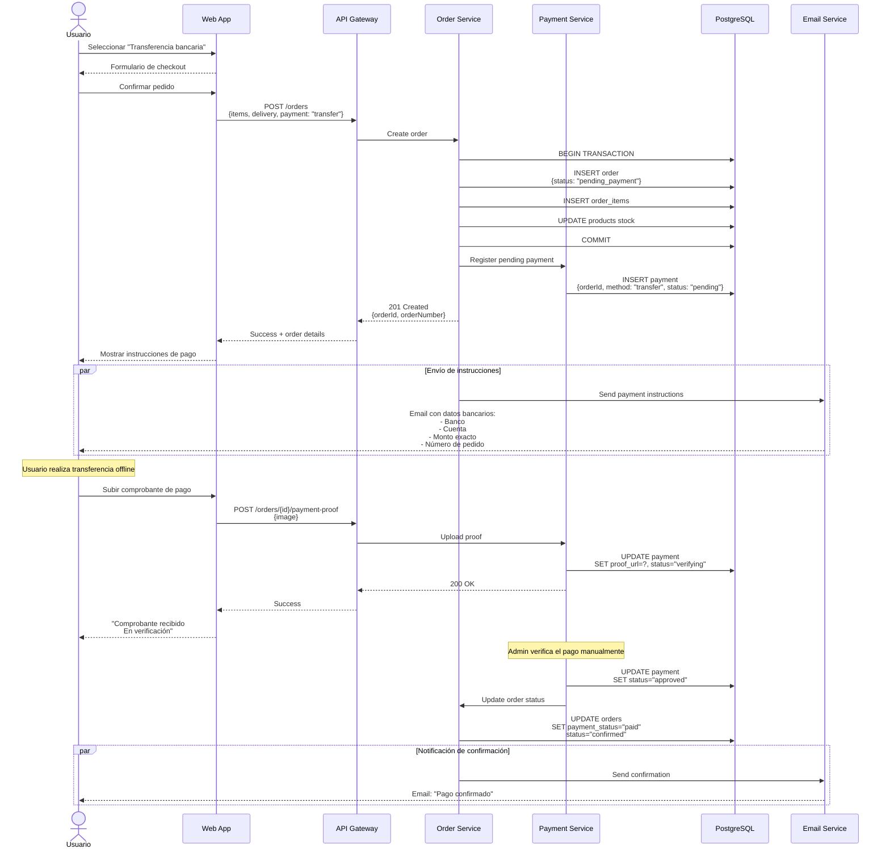
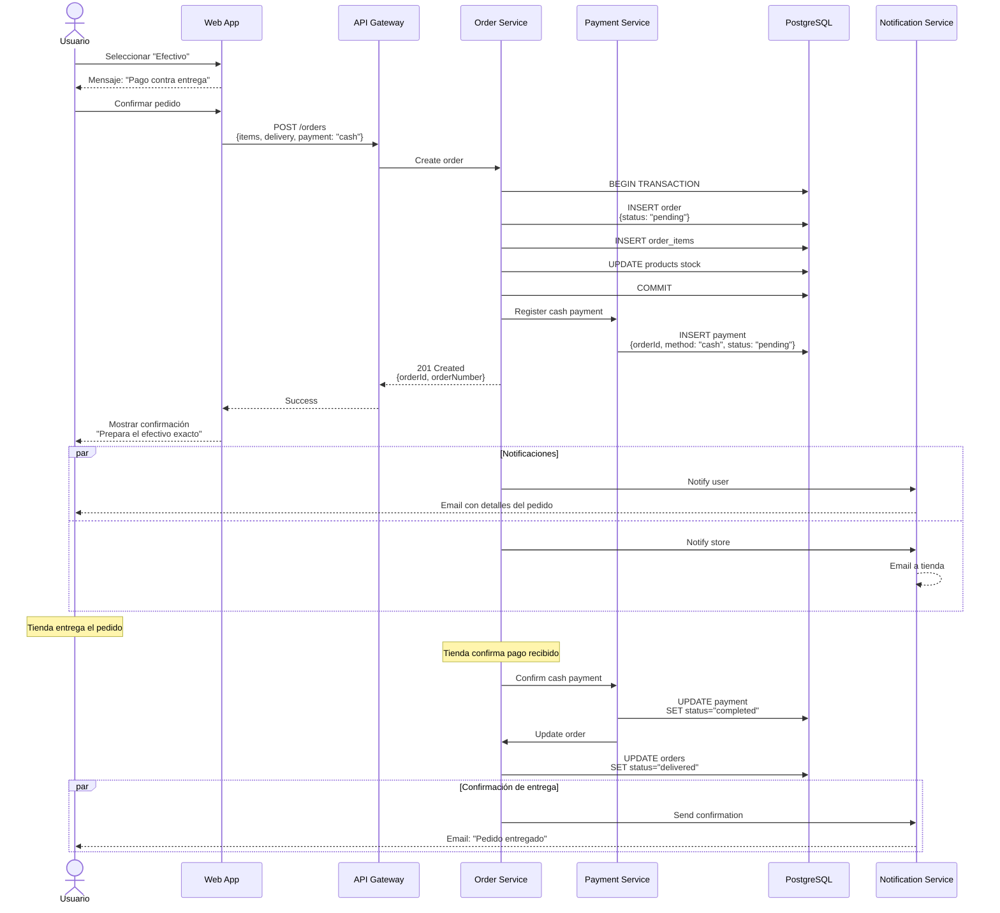
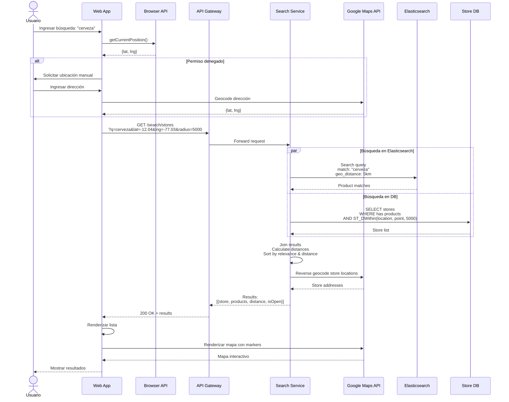
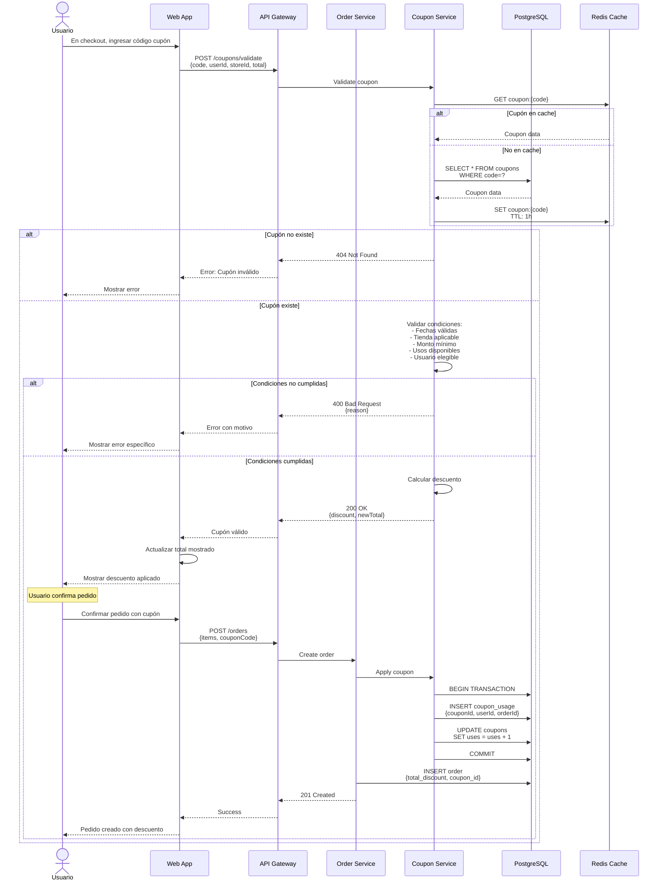
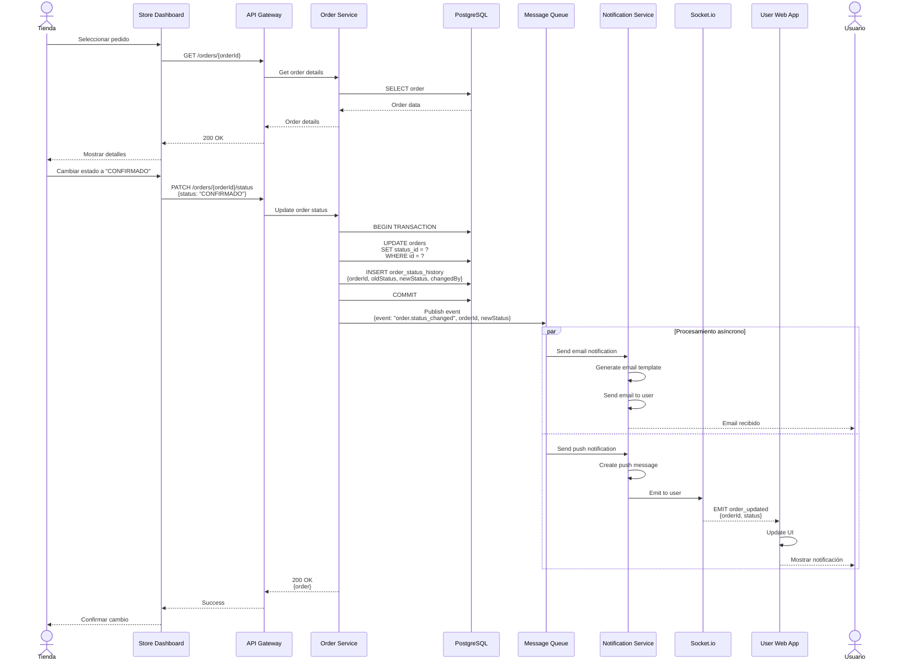
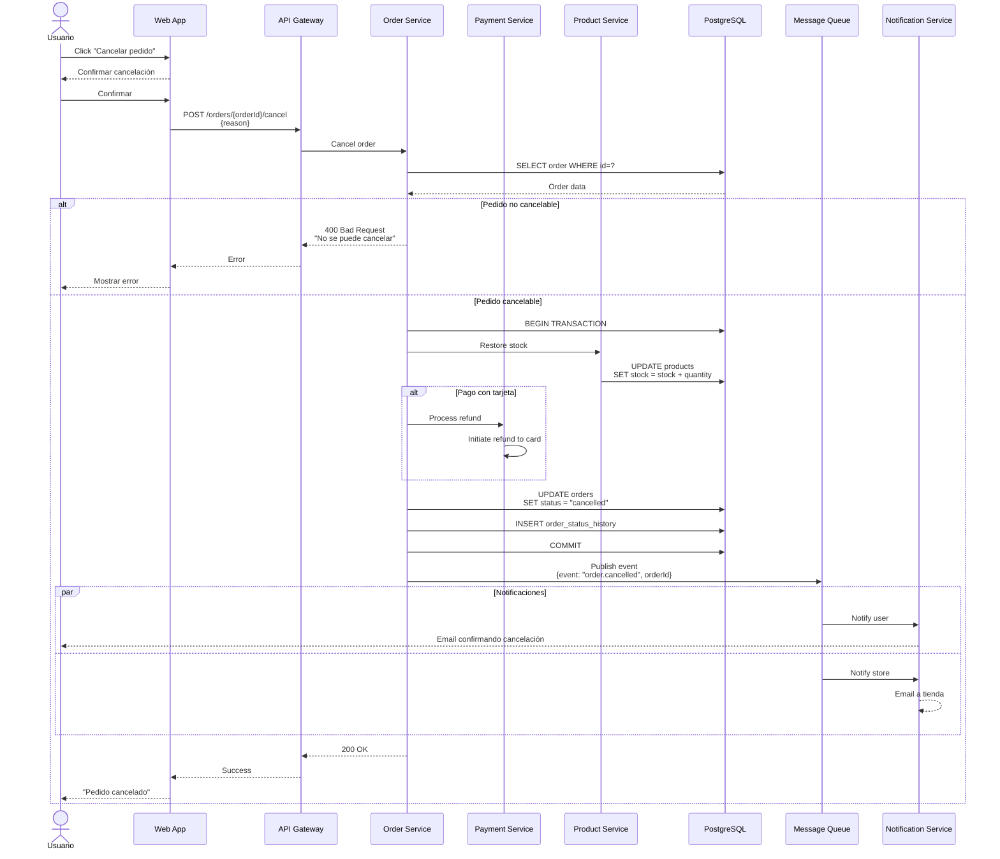

# Diagramas de Secuencia - Proceso de Compra - Sistema Tiendi

Este documento contiene los diagramas de secuencia relacionados con el proceso de compra y pago.

---

## 1. Secuencia de Proceso de Compra Completo

---

## 2. Secuencia de Integración de Pago con Tarjeta

---

## 3. Secuencia de Pago con Transferencia Bancaria

---

## 4. Secuencia de Pago en Efectivo

---

## 5. Secuencia de Búsqueda Geolocalizada con Productos

---

## 6. Secuencia de Aplicación de Cupón de Descuento

---

## 7. Secuencia de Actualización de Estado de Pedido

---

## 8. Secuencia de Cancelación de Pedido

---

**Fecha de creación:** 2025-11-24
**Versión:** 1.0
