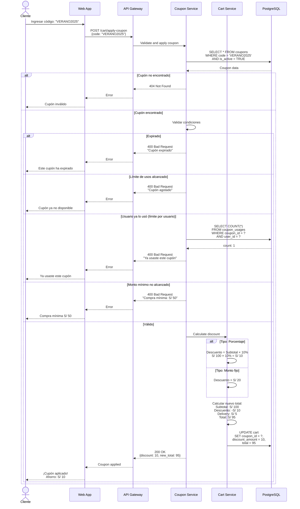
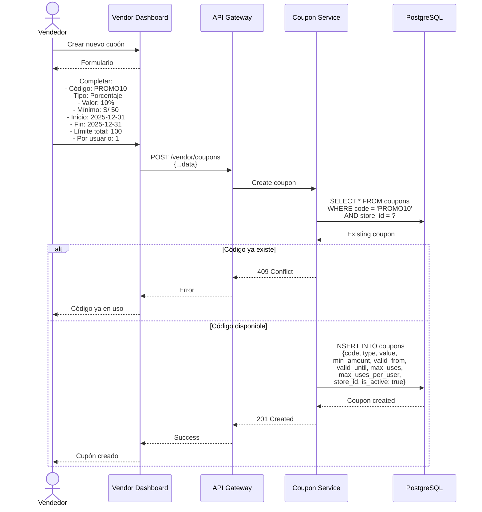

# Diagramas de Secuencia - Sistema de Cupones - Sistema Tiendi

Sistema de cupones de descuento y promociones.

---

## 1. Aplicar Cupón en Checkout



---

## 2. Crear Cupón (Vendedor)



---

## Tablas

```sql
CREATE TABLE coupons (
  id UUID PRIMARY KEY DEFAULT uuid_generate_v4(),
  store_id UUID NOT NULL REFERENCES stores(id),
  code VARCHAR(50) NOT NULL,
  type VARCHAR(20) NOT NULL, -- 'percentage', 'fixed_amount'
  value DECIMAL(10,2) NOT NULL,
  min_amount DECIMAL(10,2) DEFAULT 0,
  max_discount DECIMAL(10,2), -- Descuento máximo para porcentajes
  valid_from TIMESTAMP NOT NULL,
  valid_until TIMESTAMP NOT NULL,
  max_uses INTEGER, -- NULL = ilimitado
  max_uses_per_user INTEGER DEFAULT 1,
  current_uses INTEGER DEFAULT 0,
  applicable_to VARCHAR(20) DEFAULT 'all', -- 'all', 'specific_products', 'specific_categories'
  product_ids UUID[], -- Array de product IDs si aplica
  category_ids UUID[], -- Array de category IDs si aplica
  is_active BOOLEAN DEFAULT TRUE,
  created_by UUID REFERENCES users(id),
  created_at TIMESTAMP DEFAULT NOW(),
  updated_at TIMESTAMP DEFAULT NOW(),

  UNIQUE(store_id, code)
);

CREATE TABLE coupon_usages (
  id UUID PRIMARY KEY DEFAULT uuid_generate_v4(),
  coupon_id UUID NOT NULL REFERENCES coupons(id),
  user_id UUID NOT NULL REFERENCES users(id),
  order_id UUID NOT NULL REFERENCES orders(id),
  discount_amount DECIMAL(10,2) NOT NULL,
  used_at TIMESTAMP DEFAULT NOW()
);

CREATE INDEX idx_coupon_usages_coupon_user ON coupon_usages(coupon_id, user_id);
```

---

**Fecha de creación:** 2025-11-24
**Versión:** 1.0
