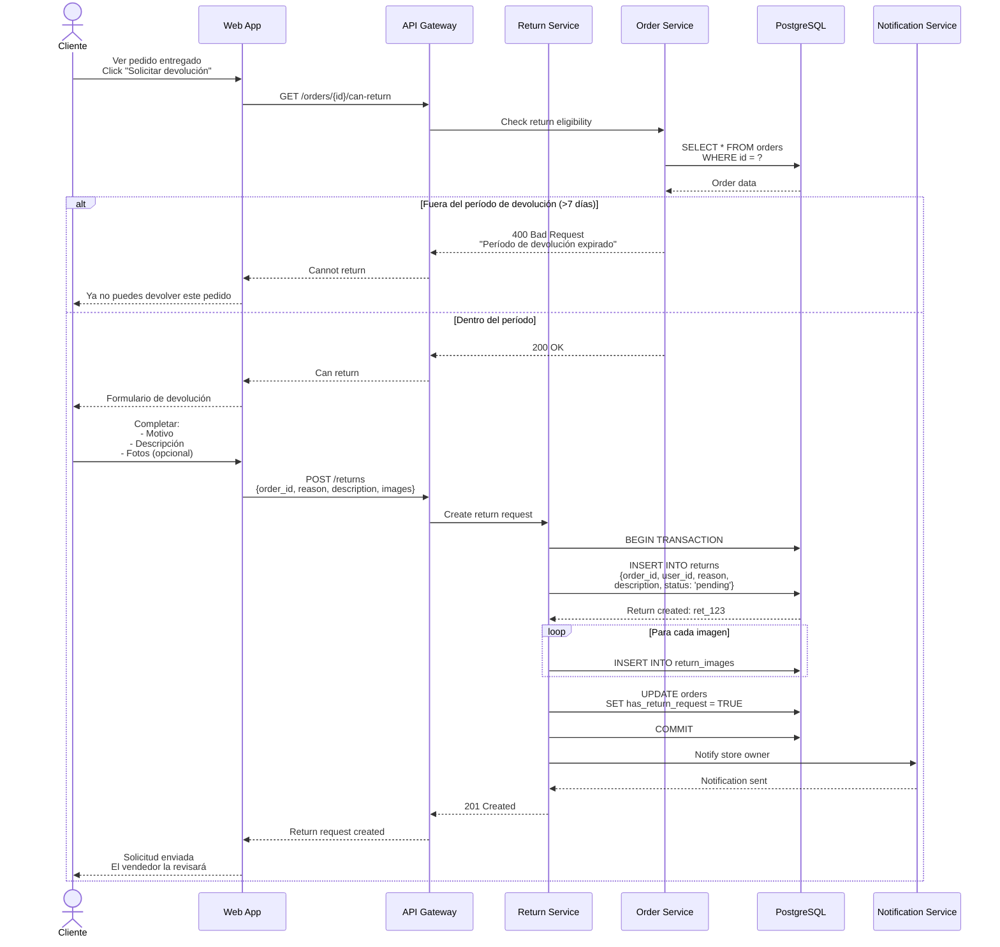
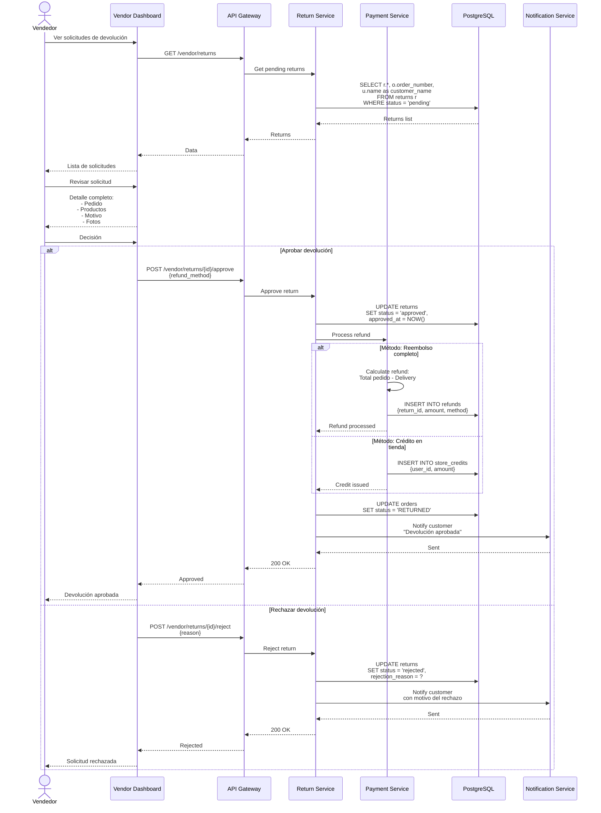
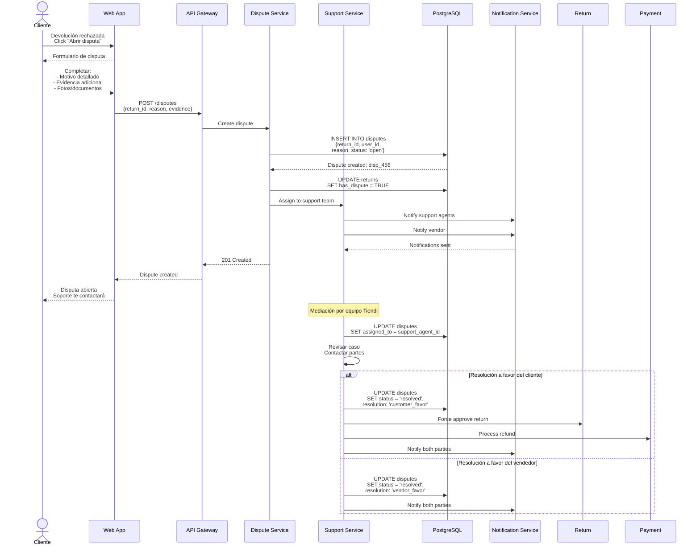

# Diagramas de Secuencia - Sistema de Devoluciones y Disputas - Sistema Tiendi

Sistema de devoluciones, reembolsos y resolución de disputas.

---

## 1. Solicitud de Devolución (Cliente)



---

## 2. Evaluación de Devolución (Vendedor)



---

## 3. Escalamiento a Disputa



---

## Tablas

```sql
CREATE TABLE returns (
  id UUID PRIMARY KEY DEFAULT uuid_generate_v4(),
  order_id UUID NOT NULL REFERENCES orders(id),
  user_id UUID NOT NULL REFERENCES users(id),
  reason VARCHAR(100) NOT NULL, -- 'defective', 'wrong_item', 'not_as_described', 'changed_mind'
  description TEXT NOT NULL,
  status VARCHAR(20) DEFAULT 'pending', -- 'pending', 'approved', 'rejected', 'completed'
  rejection_reason TEXT,
  approved_at TIMESTAMP,
  approved_by UUID REFERENCES users(id),
  rejected_at TIMESTAMP,
  has_dispute BOOLEAN DEFAULT FALSE,
  created_at TIMESTAMP DEFAULT NOW(),
  updated_at TIMESTAMP DEFAULT NOW()
);

CREATE TABLE return_images (
  id UUID PRIMARY KEY DEFAULT uuid_generate_v4(),
  return_id UUID NOT NULL REFERENCES returns(id) ON DELETE CASCADE,
  image_url TEXT NOT NULL,
  created_at TIMESTAMP DEFAULT NOW()
);

CREATE TABLE refunds (
  id UUID PRIMARY KEY DEFAULT uuid_generate_v4(),
  return_id UUID NOT NULL REFERENCES returns(id),
  order_id UUID NOT NULL REFERENCES orders(id),
  amount DECIMAL(10,2) NOT NULL,
  method VARCHAR(50) NOT NULL, -- 'original_payment', 'store_credit', 'bank_transfer'
  transaction_id VARCHAR(255),
  status VARCHAR(20) DEFAULT 'processing', -- 'processing', 'completed', 'failed'
  completed_at TIMESTAMP,
  created_at TIMESTAMP DEFAULT NOW()
);

CREATE TABLE disputes (
  id UUID PRIMARY KEY DEFAULT uuid_generate_v4(),
  return_id UUID NOT NULL REFERENCES returns(id),
  user_id UUID NOT NULL REFERENCES users(id),
  reason TEXT NOT NULL,
  status VARCHAR(20) DEFAULT 'open', -- 'open', 'in_review', 'resolved', 'closed'
  resolution VARCHAR(50), -- 'customer_favor', 'vendor_favor', 'compromise'
  assigned_to UUID REFERENCES users(id),
  resolved_at TIMESTAMP,
  resolution_notes TEXT,
  created_at TIMESTAMP DEFAULT NOW(),
  updated_at TIMESTAMP DEFAULT NOW()
);

CREATE TABLE dispute_messages (
  id UUID PRIMARY KEY DEFAULT uuid_generate_v4(),
  dispute_id UUID NOT NULL REFERENCES disputes(id),
  sender_id UUID NOT NULL REFERENCES users(id),
  sender_type VARCHAR(20) NOT NULL, -- 'customer', 'vendor', 'support'
  message TEXT NOT NULL,
  attachments JSONB,
  created_at TIMESTAMP DEFAULT NOW()
);
```

---

**Fecha de creación:** 2025-11-24
**Versión:** 1.0
