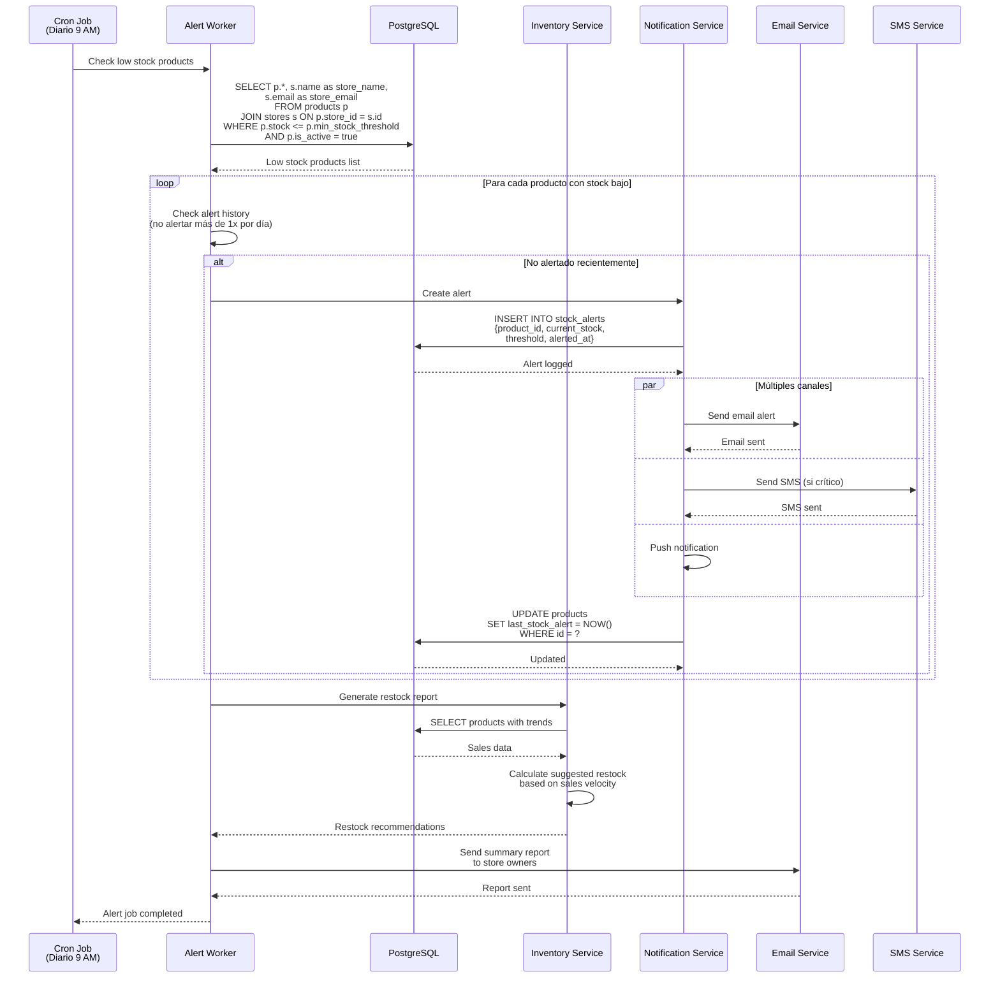

# Diagramas de Secuencia - Gestión de Inventario - Sistema Tiendi

Este documento contiene diagramas de secuencia para la gestión de inventario en tiempo real, incluyendo reservas, locks y prevención de sobreventa.

---

## 1. Agregar Producto al Carrito con Reserva de Stock


---

## 2. Liberación Automática de Stock Reservado


---

## 3. Proceso de Checkout con Confirmación de Stock


---

## 4. Prevención de Sobreventa con Lock Optimista


---

## 5. Ajuste Manual de Inventario por Vendedor


---

## 6. Cancelación de Pedido con Devolución de Stock


---

## 7. Sincronización de Stock en Tiempo Real (WebSocket)


---

## 8. Alertas de Stock Bajo



---

## 9. Importación Masiva de Inventario


---

## Tablas de Base de Datos para Inventario

### Tabla: products (ampliada)

```sql
CREATE TABLE products (
  id UUID PRIMARY KEY DEFAULT uuid_generate_v4(),
  store_id UUID NOT NULL REFERENCES stores(id),
  sku VARCHAR(100),
  name VARCHAR(255) NOT NULL,
  price DECIMAL(10,2) NOT NULL,

  -- Gestión de stock
  stock INTEGER NOT NULL DEFAULT 0,
  reserved_stock INTEGER NOT NULL DEFAULT 0,
  min_stock_threshold INTEGER DEFAULT 10,
  max_stock_capacity INTEGER,

  -- Control de versión para lock optimista
  version INTEGER NOT NULL DEFAULT 1,

  -- Alertas
  last_stock_alert TIMESTAMP,

  -- Auditoría
  created_at TIMESTAMP DEFAULT NOW(),
  updated_at TIMESTAMP DEFAULT NOW(),

  CONSTRAINT check_stock_positive CHECK (stock >= 0),
  CONSTRAINT check_reserved_valid CHECK (reserved_stock >= 0 AND reserved_stock <= stock)
);

-- Índice para queries frecuentes
CREATE INDEX idx_products_stock ON products(store_id, stock, reserved_stock);

-- Índice para alertas de stock bajo
CREATE INDEX idx_products_low_stock ON products(store_id)
WHERE stock <= min_stock_threshold AND is_active = true;
```

### Tabla: inventory_adjustments

```sql
CREATE TABLE inventory_adjustments (
  id UUID PRIMARY KEY DEFAULT uuid_generate_v4(),
  product_id UUID NOT NULL REFERENCES products(id),
  adjustment_type VARCHAR(50) NOT NULL, -- 'manual', 'order', 'return', 'correction'
  quantity_change INTEGER NOT NULL, -- Puede ser negativo
  old_stock INTEGER NOT NULL,
  new_stock INTEGER NOT NULL,
  reason TEXT,
  adjusted_by UUID REFERENCES users(id),
  created_at TIMESTAMP DEFAULT NOW()
);

CREATE INDEX idx_inventory_adjustments_product ON inventory_adjustments(product_id, created_at DESC);
```

### Tabla: stock_reservations

```sql
CREATE TABLE stock_reservations (
  id UUID PRIMARY KEY DEFAULT uuid_generate_v4(),
  user_id UUID NOT NULL REFERENCES users(id),
  product_id UUID NOT NULL REFERENCES products(id),
  quantity INTEGER NOT NULL,
  expires_at TIMESTAMP NOT NULL,
  status VARCHAR(20) DEFAULT 'active', -- 'active', 'confirmed', 'expired', 'released'
  created_at TIMESTAMP DEFAULT NOW(),

  CONSTRAINT check_quantity_positive CHECK (quantity > 0)
);

CREATE INDEX idx_stock_reservations_expires ON stock_reservations(expires_at)
WHERE status = 'active';

CREATE INDEX idx_stock_reservations_user_product ON stock_reservations(user_id, product_id);
```

### Tabla: stock_alerts

```sql
CREATE TABLE stock_alerts (
  id UUID PRIMARY KEY DEFAULT uuid_generate_v4(),
  product_id UUID NOT NULL REFERENCES products(id),
  alert_type VARCHAR(50) NOT NULL, -- 'low_stock', 'out_of_stock', 'overstocked'
  current_stock INTEGER NOT NULL,
  threshold_value INTEGER,
  alerted_at TIMESTAMP DEFAULT NOW(),
  acknowledged BOOLEAN DEFAULT FALSE,
  acknowledged_at TIMESTAMP,
  acknowledged_by UUID REFERENCES users(id)
);

CREATE INDEX idx_stock_alerts_product ON stock_alerts(product_id, alerted_at DESC);
```

---

## Triggers para Gestión Automática

### Trigger: Validar Stock en Actualización

```sql
CREATE OR REPLACE FUNCTION validate_stock_update()
RETURNS TRIGGER AS $$
BEGIN
  -- No permitir stock negativo
  IF NEW.stock < 0 THEN
    RAISE EXCEPTION 'Stock cannot be negative';
  END IF;

  -- Validar que reserved_stock no exceda stock
  IF NEW.reserved_stock > NEW.stock THEN
    RAISE EXCEPTION 'Reserved stock cannot exceed total stock';
  END IF;

  -- Incrementar versión para lock optimista
  NEW.version = OLD.version + 1;

  -- Actualizar timestamp
  NEW.updated_at = NOW();

  RETURN NEW;
END;
$$ LANGUAGE plpgsql;

CREATE TRIGGER trg_validate_stock
BEFORE UPDATE ON products
FOR EACH ROW
EXECUTE FUNCTION validate_stock_update();
```

### Trigger: Log de Ajustes de Inventario

```sql
CREATE OR REPLACE FUNCTION log_inventory_adjustment()
RETURNS TRIGGER AS $$
BEGIN
  IF NEW.stock <> OLD.stock THEN
    INSERT INTO inventory_adjustments (
      product_id,
      adjustment_type,
      quantity_change,
      old_stock,
      new_stock,
      reason
    ) VALUES (
      NEW.id,
      'automatic',
      NEW.stock - OLD.stock,
      OLD.stock,
      NEW.stock,
      'System adjustment'
    );
  END IF;

  RETURN NEW;
END;
$$ LANGUAGE plpgsql;

CREATE TRIGGER trg_log_inventory
AFTER UPDATE ON products
FOR EACH ROW
WHEN (NEW.stock IS DISTINCT FROM OLD.stock)
EXECUTE FUNCTION log_inventory_adjustment();
```

---

## Consideraciones de Performance

### Estrategias de Optimización

1. **Lock Granularidad**: Usar `SELECT FOR UPDATE SKIP LOCKED` para evitar bloqueos en productos de alta demanda
2. **Caché de Stock**: Cachear información de stock disponible con TTL corto (30 segundos)
3. **Batch Updates**: Procesar ajustes de inventario en batch cuando sea posible
4. **Índices Apropiados**: Índices en (store_id, stock, reserved_stock) para queries frecuentes
5. **Particionamiento**: Particionar tabla de inventory_adjustments por fecha

### Queries Optimizados

```sql
-- Query optimizado para check de stock
PREPARE check_stock (UUID, INTEGER) AS
SELECT
  (stock - reserved_stock) as available,
  stock,
  reserved_stock
FROM products
WHERE id = $1 AND (stock - reserved_stock) >= $2
FOR UPDATE SKIP LOCKED;

-- Query para productos con stock bajo
PREPARE low_stock_products (UUID) AS
SELECT id, name, stock, min_stock_threshold
FROM products
WHERE store_id = $1
  AND stock <= min_stock_threshold
  AND is_active = true
ORDER BY (stock::float / NULLIF(min_stock_threshold, 0)) ASC;
```

---

**Fecha de creación:** 2025-11-24
**Versión:** 1.0
**Autor:** Sistema Tiendi
