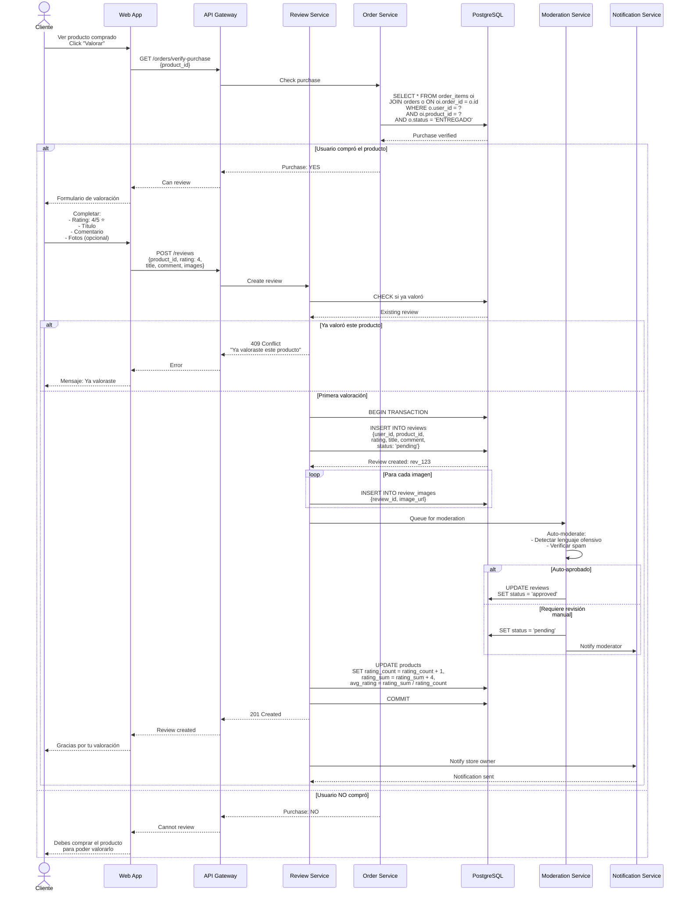
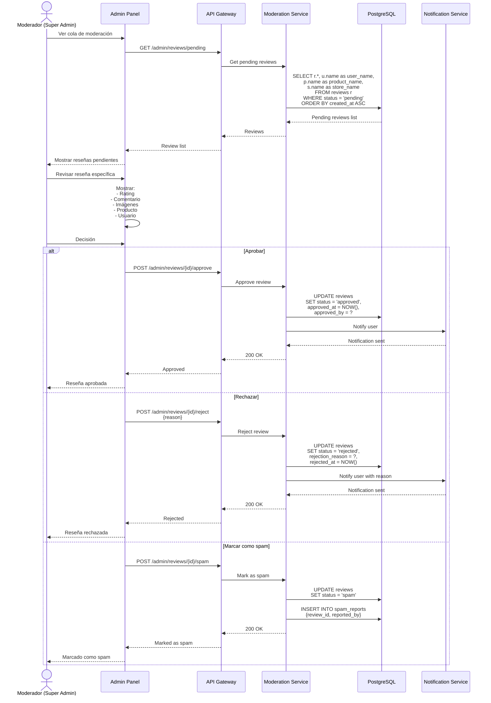
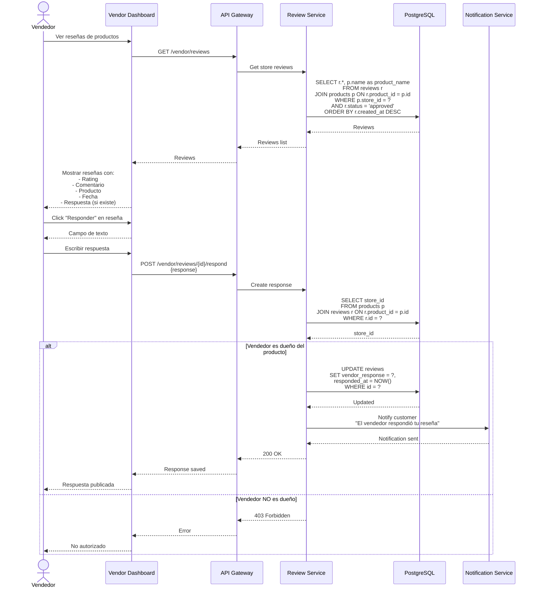
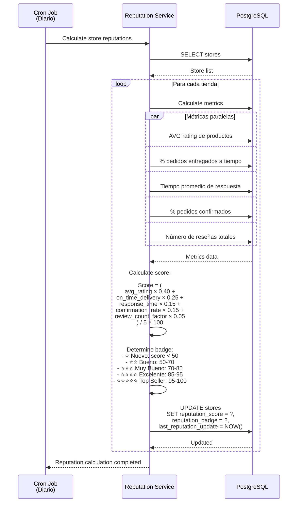

# Diagramas de Secuencia - Sistema de Valoraciones y Reseñas - Sistema Tiendi

Este documento describe el sistema de valoraciones de productos y reputación de tiendas.

---

## 1. Crear Valoración de Producto



---

## 2. Moderación de Reseñas



---

## 3. Respuesta del Vendedor a Reseña



---

## 4. Cálculo de Reputación de Tienda



---

## Tablas de Base de Datos

```sql
-- Tabla de reseñas
CREATE TABLE reviews (
  id UUID PRIMARY KEY DEFAULT uuid_generate_v4(),
  user_id UUID NOT NULL REFERENCES users(id),
  product_id UUID NOT NULL REFERENCES products(id),
  order_id UUID REFERENCES orders(id),
  rating INTEGER NOT NULL CHECK (rating BETWEEN 1 AND 5),
  title VARCHAR(255),
  comment TEXT,
  status VARCHAR(20) DEFAULT 'pending', -- 'pending', 'approved', 'rejected', 'spam'
  vendor_response TEXT,
  responded_at TIMESTAMP,
  rejection_reason TEXT,
  approved_by UUID REFERENCES users(id),
  approved_at TIMESTAMP,
  rejected_at TIMESTAMP,
  created_at TIMESTAMP DEFAULT NOW(),
  updated_at TIMESTAMP DEFAULT NOW(),

  -- Un usuario solo puede valorar un producto una vez
  UNIQUE(user_id, product_id)
);

CREATE INDEX idx_reviews_product ON reviews(product_id, status);
CREATE INDEX idx_reviews_user ON reviews(user_id);
CREATE INDEX idx_reviews_status ON reviews(status) WHERE status = 'pending';

-- Tabla de imágenes de reseñas
CREATE TABLE review_images (
  id UUID PRIMARY KEY DEFAULT uuid_generate_v4(),
  review_id UUID NOT NULL REFERENCES reviews(id) ON DELETE CASCADE,
  image_url TEXT NOT NULL,
  created_at TIMESTAMP DEFAULT NOW()
);

CREATE INDEX idx_review_images_review ON review_images(review_id);

-- Tabla de reportes de reseñas
CREATE TABLE review_reports (
  id UUID PRIMARY KEY DEFAULT uuid_generate_v4(),
  review_id UUID NOT NULL REFERENCES reviews(id),
  reported_by UUID NOT NULL REFERENCES users(id),
  reason VARCHAR(100) NOT NULL, -- 'spam', 'offensive', 'fake', 'other'
  description TEXT,
  status VARCHAR(20) DEFAULT 'pending', -- 'pending', 'reviewed', 'dismissed'
  reviewed_by UUID REFERENCES users(id),
  reviewed_at TIMESTAMP,
  created_at TIMESTAMP DEFAULT NOW()
);

CREATE INDEX idx_review_reports_review ON review_reports(review_id);
CREATE INDEX idx_review_reports_status ON review_reports(status);

-- Tabla de reputación de tiendas
CREATE TABLE store_reputation (
  store_id UUID PRIMARY KEY REFERENCES stores(id),
  reputation_score DECIMAL(5,2) DEFAULT 0, -- 0-100
  reputation_badge VARCHAR(50), -- 'new', 'good', 'very_good', 'excellent', 'top_seller'
  avg_product_rating DECIMAL(3,2),
  total_reviews INTEGER DEFAULT 0,
  on_time_delivery_rate DECIMAL(5,2),
  avg_response_time INTEGER, -- en minutos
  order_confirmation_rate DECIMAL(5,2),
  last_reputation_update TIMESTAMP,
  created_at TIMESTAMP DEFAULT NOW(),
  updated_at TIMESTAMP DEFAULT NOW()
);
```

---

**Fecha de creación:** 2025-11-24
**Versión:** 1.0
