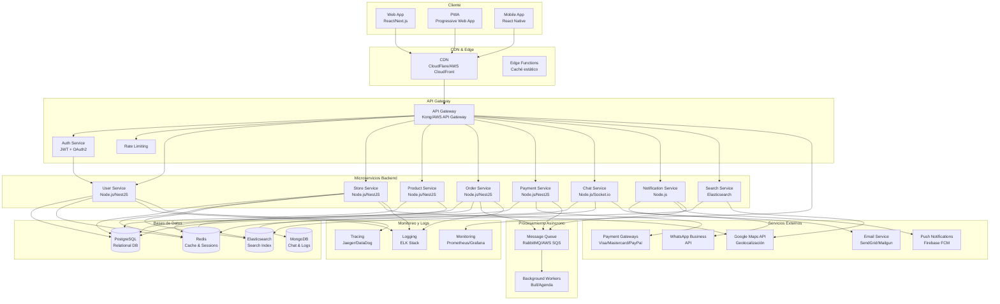

# Diagrama de Arquitectura General del Sistema - Tiendi

Este documento contiene la arquitectura general del sistema Tiendi a alto nivel.

---

## Arquitectura de Alto Nivel

---

## Descripción de Componentes

### Capa de Cliente
- **Web App**: Aplicación web principal en React/Next.js
- **PWA**: Progressive Web App para experiencia móvil
- **Mobile App**: Aplicación nativa en React Native (futuro)

### Capa de Edge
- **CDN**: Distribución de contenido estático (imágenes, CSS, JS)
- **Edge Functions**: Funciones serverless en el edge para mejor rendimiento

### API Gateway
- **Gateway**: Punto único de entrada, enrutamiento de peticiones
- **Auth Service**: Autenticación y autorización centralizada
- **Rate Limiting**: Protección contra abuso de APIs

### Microservicios
- **User Service**: Gestión de usuarios y perfiles
- **Store Service**: Gestión de tiendas y ubicaciones
- **Product Service**: Catálogo de productos
- **Order Service**: Gestión de pedidos y estados
- **Payment Service**: Procesamiento de pagos
- **Chat Service**: Mensajería en tiempo real
- **Notification Service**: Emails y notificaciones push
- **Search Service**: Búsqueda y filtrado avanzado

### Bases de Datos
- **PostgreSQL**: Datos transaccionales y relacionales
- **MongoDB**: Mensajes de chat y logs no estructurados
- **Redis**: Caché, sesiones y pub/sub
- **Elasticsearch**: Índices de búsqueda y geolocalización

### Servicios Externos
- **Google Maps API**: Mapas y geolocalización
- **WhatsApp Business**: Integración con WhatsApp
- **Email Service**: Envío de correos transaccionales
- **Payment Gateways**: Procesamiento de pagos con tarjeta
- **Firebase FCM**: Notificaciones push a dispositivos

### Procesamiento Asíncrono
- **Message Queue**: Cola de mensajes para operaciones asíncronas
- **Background Workers**: Procesamiento de tareas en segundo plano

### Monitoreo
- **Logging**: Centralización de logs (ELK Stack)
- **Monitoring**: Métricas y dashboards (Prometheus/Grafana)
- **Tracing**: Rastreo distribuido de peticiones (Jaeger/DataDog)

---

## Tecnologías Principales

### Backend
- **Framework**: Node.js con NestJS
- **Base de datos**: PostgreSQL 14+
- **Cache**: Redis 7+
- **Search**: Elasticsearch 8+
- **Message Queue**: RabbitMQ o AWS SQS
- **API**: RESTful + GraphQL (opcional)

### Frontend
- **Framework**: Next.js 14+ (App Router)
- **UI Library**: React 18+
- **State Management**: Redux Toolkit + React Query
- **Styling**: Tailwind CSS
- **Maps**: Google Maps JavaScript API

### DevOps
- **Containers**: Docker
- **Orchestration**: Kubernetes
- **CI/CD**: GitHub Actions
- **Cloud**: AWS / Azure / GCP
- **Monitoring**: Prometheus, Grafana, ELK

---

**Fecha de creación:** 2025-11-24
**Versión:** 1.0
