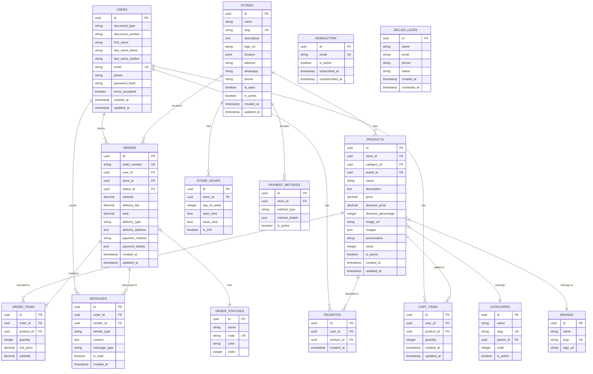

# Diagrama de Base de Datos - Sistema Tiendi

Este documento contiene el diagrama de entidad-relación (ERD) del sistema Tiendi.

---

## Diagrama Entidad-Relación (ERD)



---

## Descripción de Tablas

### USERS (Usuarios)
Almacena la información de los usuarios del sistema.

**Campos principales:**
- `id`: UUID único del usuario
- `document_type`: Tipo de documento (DNI, CE, etc.)
- `document_number`: Número de documento único
- `email`: Correo electrónico (único)
- `password_hash`: Contraseña encriptada (bcrypt)
- `terms_accepted`: Si aceptó términos y condiciones

**Índices:**
- PRIMARY KEY: `id`
- UNIQUE: `email`
- INDEX: `document_number`

---

### STORES (Tiendas)
Información de las tiendas registradas en la plataforma.

**Campos principales:**
- `id`: UUID único de la tienda
- `name`: Nombre de la tienda
- `slug`: URL amigable (única)
- `location`: Coordenadas geográficas (PostGIS POINT)
- `address`: Dirección completa
- `is_open`: Estado actual (abierto/cerrado)
- `is_active`: Si la tienda está activa en el sistema

**Índices:**
- PRIMARY KEY: `id`
- UNIQUE: `slug`
- SPATIAL INDEX: `location` (para búsquedas geoespaciales)

---

### PRODUCTS (Productos)
Catálogo de productos de cada tienda.

**Campos principales:**
- `id`: UUID único del producto
- `store_id`: Relación con la tienda
- `category_id`: Categoría del producto
- `brand_id`: Marca del producto
- `price`: Precio regular
- `discount_price`: Precio con descuento
- `discount_percentage`: Porcentaje de descuento
- `images`: Array JSON de URLs de imágenes
- `stock`: Cantidad disponible

**Índices:**
- PRIMARY KEY: `id`
- FOREIGN KEY: `store_id`, `category_id`, `brand_id`
- INDEX: `name`, `is_active`
- FULLTEXT INDEX: `name`, `description` (para búsquedas)

---

### CATEGORIES (Categorías)
Categorías de productos con soporte para jerarquía.

**Campos principales:**
- `id`: UUID único
- `name`: Nombre de la categoría
- `slug`: URL amigable
- `parent_id`: Categoría padre (para subcategorías)
- `order`: Orden de visualización

**Índices:**
- PRIMARY KEY: `id`
- UNIQUE: `slug`
- FOREIGN KEY: `parent_id` (self-reference)

---

### BRANDS (Marcas)
Marcas de productos.

**Campos principales:**
- `id`: UUID único
- `name`: Nombre de la marca
- `slug`: URL amigable
- `logo_url`: Logo de la marca

**Índices:**
- PRIMARY KEY: `id`
- UNIQUE: `slug`

---

### ORDERS (Pedidos)
Pedidos realizados por los usuarios.

**Campos principales:**
- `id`: UUID único
- `order_number`: Número de pedido legible (ej: OBI-00123)
- `user_id`: Usuario que realizó el pedido
- `store_id`: Tienda donde se realizó el pedido
- `status_id`: Estado actual del pedido
- `delivery_type`: 'pickup' o 'delivery'
- `payment_method`: 'cash', 'card', 'transfer', etc.
- `payment_details`: Información adicional del pago (JSON)

**Índices:**
- PRIMARY KEY: `id`
- UNIQUE: `order_number`
- FOREIGN KEY: `user_id`, `store_id`, `status_id`
- INDEX: `created_at`, `status_id`

---

### ORDER_ITEMS (Items de Pedido)
Productos incluidos en cada pedido.

**Campos principales:**
- `id`: UUID único
- `order_id`: Pedido al que pertenece
- `product_id`: Producto ordenado
- `quantity`: Cantidad ordenada
- `unit_price`: Precio unitario al momento del pedido
- `subtotal`: Precio total del item

**Índices:**
- PRIMARY KEY: `id`
- FOREIGN KEY: `order_id`, `product_id`

---

### ORDER_STATUSES (Estados de Pedido)
Catálogo de estados posibles de un pedido.

**Valores predefinidos:**
- `POR_ENVIAR` (rojo) - Pedido recién creado
- `CONFIRMADO` (azul) - Tienda confirmó el pedido
- `EN_CAMINO` (azul) - Pedido en ruta de entrega
- `ENTREGADO` (verde) - Pedido completado
- `RECHAZADO` (rojo) - Pedido rechazado por la tienda
- `CANCELADO` (rojo) - Pedido cancelado por el usuario

**Índices:**
- PRIMARY KEY: `id`
- UNIQUE: `code`

---

### CART_ITEMS (Items del Carrito)
Carrito temporal de compras de cada usuario.

**Campos principales:**
- `id`: UUID único
- `user_id`: Usuario dueño del carrito
- `product_id`: Producto agregado
- `quantity`: Cantidad en el carrito

**Índices:**
- PRIMARY KEY: `id`
- FOREIGN KEY: `user_id`, `product_id`
- UNIQUE: `user_id`, `product_id` (un producto por usuario)

---

### FAVORITES (Favoritos)
Productos marcados como favoritos por los usuarios.

**Campos principales:**
- `id`: UUID único
- `user_id`: Usuario
- `product_id`: Producto favorito

**Índices:**
- PRIMARY KEY: `id`
- FOREIGN KEY: `user_id`, `product_id`
- UNIQUE: `user_id`, `product_id`

---

### MESSAGES (Mensajes)
Mensajes del chat entre usuarios y tiendas.

**Campos principales:**
- `id`: UUID único
- `order_id`: Pedido sobre el que se habla
- `sender_id`: ID del remitente (user o store)
- `sender_type`: 'user' o 'store'
- `content`: Contenido del mensaje
- `message_type`: 'text', 'template', 'system'
- `is_read`: Si fue leído

**Índices:**
- PRIMARY KEY: `id`
- FOREIGN KEY: `order_id`
- INDEX: `created_at`, `is_read`

---

### STORE_HOURS (Horarios de Tienda)
Horarios de atención de cada tienda.

**Campos principales:**
- `day_of_week`: 0-6 (Domingo-Sábado)
- `open_time`: Hora de apertura
- `close_time`: Hora de cierre
- `is_24h`: Si atiende 24 horas

**Índices:**
- PRIMARY KEY: `id`
- FOREIGN KEY: `store_id`

---

### PAYMENT_METHODS (Métodos de Pago)
Métodos de pago aceptados por cada tienda.

**Campos principales:**
- `method_type`: 'cash', 'card', 'transfer', 'yape', 'plin'
- `method_details`: Información adicional (JSON)
- `is_active`: Si está activo

**Índices:**
- PRIMARY KEY: `id`
- FOREIGN KEY: `store_id`

---

### NEWSLETTER (Suscriptores)
Emails suscritos al newsletter.

**Campos principales:**
- `email`: Correo electrónico (único)
- `is_active`: Estado de suscripción
- `subscribed_at`: Fecha de suscripción
- `unsubscribed_at`: Fecha de baja

**Índices:**
- PRIMARY KEY: `id`
- UNIQUE: `email`

---

### SELLER_LEADS (Leads de Vendedores)
Información de potenciales vendedores interesados.

**Campos principales:**
- `name`: Nombre del interesado
- `email`: Correo de contacto
- `phone`: Teléfono de contacto
- `status`: 'new', 'contacted', 'qualified', 'converted'

**Índices:**
- PRIMARY KEY: `id`
- INDEX: `status`, `created_at`

---

## Consultas Optimizadas

### Búsqueda Geolocalizada
```sql
-- Buscar tiendas cercanas con productos
SELECT
    s.id,
    s.name,
    s.address,
    ST_Distance(s.location, ST_MakePoint(-77.042793, -12.046374)) as distance
FROM stores s
INNER JOIN products p ON p.store_id = s.id
WHERE
    s.is_active = true
    AND s.is_open = true
    AND p.name ILIKE '%cerveza%'
    AND ST_DWithin(
        s.location,
        ST_MakePoint(-77.042793, -12.046374)::geography,
        5000  -- 5km radius
    )
ORDER BY distance ASC
LIMIT 20;
```

### Productos con Descuento
```sql
-- Top productos con mayor descuento
SELECT
    p.*,
    b.name as brand_name,
    c.name as category_name,
    s.name as store_name
FROM products p
INNER JOIN brands b ON p.brand_id = b.id
INNER JOIN categories c ON p.category_id = c.id
INNER JOIN stores s ON p.store_id = s.id
WHERE
    p.is_active = true
    AND p.discount_percentage > 0
    AND p.stock > 0
ORDER BY p.discount_percentage DESC
LIMIT 50;
```

### Pedidos por Usuario
```sql
-- Historial de pedidos de un usuario
SELECT
    o.id,
    o.order_number,
    o.total,
    os.name as status,
    os.color as status_color,
    s.name as store_name,
    COUNT(oi.id) as total_items
FROM orders o
INNER JOIN order_statuses os ON o.status_id = os.id
INNER JOIN stores s ON o.store_id = s.id
LEFT JOIN order_items oi ON oi.order_id = o.id
WHERE o.user_id = ?
GROUP BY o.id, os.name, os.color, s.name
ORDER BY o.created_at DESC;
```

---

## Índices Recomendados

```sql
-- Geoespacial
CREATE INDEX idx_stores_location ON stores USING GIST (location);

-- Búsqueda de texto completo
CREATE INDEX idx_products_search ON products USING GIN (
    to_tsvector('spanish', name || ' ' || description)
);

-- Optimización de joins frecuentes
CREATE INDEX idx_products_store_id ON products(store_id);
CREATE INDEX idx_products_category_id ON products(category_id);
CREATE INDEX idx_orders_user_id ON orders(user_id);
CREATE INDEX idx_orders_status_id ON orders(status_id);
CREATE INDEX idx_order_items_order_id ON order_items(order_id);

-- Optimización de filtros
CREATE INDEX idx_products_active_stock ON products(is_active, stock)
    WHERE is_active = true AND stock > 0;
CREATE INDEX idx_orders_created_at ON orders(created_at DESC);
```

---

## Triggers y Funciones

### Actualizar Stock al Crear Pedido
```sql
CREATE OR REPLACE FUNCTION update_stock_on_order()
RETURNS TRIGGER AS $$
BEGIN
    UPDATE products
    SET stock = stock - NEW.quantity
    WHERE id = NEW.product_id;

    IF (SELECT stock FROM products WHERE id = NEW.product_id) < 0 THEN
        RAISE EXCEPTION 'Stock insuficiente para el producto %', NEW.product_id;
    END IF;

    RETURN NEW;
END;
$$ LANGUAGE plpgsql;

CREATE TRIGGER trg_update_stock
AFTER INSERT ON order_items
FOR EACH ROW
EXECUTE FUNCTION update_stock_on_order();
```

### Generar Número de Pedido
```sql
CREATE OR REPLACE FUNCTION generate_order_number()
RETURNS TRIGGER AS $$
BEGIN
    NEW.order_number := 'OBI-' || LPAD(nextval('order_number_seq')::TEXT, 5, '0');
    RETURN NEW;
END;
$$ LANGUAGE plpgsql;

CREATE SEQUENCE order_number_seq START 1;

CREATE TRIGGER trg_generate_order_number
BEFORE INSERT ON orders
FOR EACH ROW
EXECUTE FUNCTION generate_order_number();
```

---

**Fecha de creación:** 2025-11-24
**Versión:** 1.0
