# Diagrama de Componentes - Sistema Tiendi

Este documento contiene los diagramas de componentes que muestran la estructura modular del sistema Tiendi y las relaciones entre componentes.

---

## 1. Diagrama de Componentes - Vista General

```mermaid
graph TB
    subgraph "Cliente Layer"
        WEB_APP[Web Application<br/>Next.js]
        MOBILE_APP[Mobile App<br/>React Native]
        PWA[Progressive Web App]
    end

    subgraph "API Gateway Layer"
        API_GW[API Gateway Component]
        AUTH_MW[Authentication Middleware]
        RATE_LIM[Rate Limiter]
        LOGGER[Request Logger]
    end

    subgraph "Business Logic Layer"
        USER_SVC[User Service Component]
        STORE_SVC[Store Service Component]
        PRODUCT_SVC[Product Service Component]
        ORDER_SVC[Order Service Component]
        PAYMENT_SVC[Payment Service Component]
        CHAT_SVC[Chat Service Component]
        NOTIF_SVC[Notification Service Component]
        SEARCH_SVC[Search Service Component]
    end

    subgraph "Data Access Layer"
        USER_REPO[User Repository]
        STORE_REPO[Store Repository]
        PRODUCT_REPO[Product Repository]
        ORDER_REPO[Order Repository]
        PAYMENT_REPO[Payment Repository]
        CHAT_REPO[Chat Repository]
    end

    subgraph "Data Storage Layer"
        POSTGRES[(PostgreSQL)]
        MONGODB[(MongoDB)]
        REDIS[(Redis Cache)]
        ELASTIC[(Elasticsearch)]
    end

    subgraph "External Services Layer"
        MAPS_API[Google Maps API]
        PAYMENT_GW[Payment Gateway]
        EMAIL_SVC[Email Service]
        WHATSAPP[WhatsApp API]
        FCM[Firebase FCM]
    end

    subgraph "Infrastructure Layer"
        QUEUE[Message Queue]
        WORKER[Background Workers]
        MONITOR[Monitoring System]
        LOGS[Logging System]
    end

    %% Connections - Client to Gateway
    WEB_APP --> API_GW
    MOBILE_APP --> API_GW
    PWA --> API_GW

    %% Gateway to Middleware
    API_GW --> AUTH_MW
    API_GW --> RATE_LIM
    API_GW --> LOGGER

    %% Middleware to Services
    AUTH_MW --> USER_SVC
    AUTH_MW --> STORE_SVC
    AUTH_MW --> PRODUCT_SVC
    AUTH_MW --> ORDER_SVC
    AUTH_MW --> PAYMENT_SVC
    AUTH_MW --> CHAT_SVC
    AUTH_MW --> NOTIF_SVC
    AUTH_MW --> SEARCH_SVC

    %% Services to Repositories
    USER_SVC --> USER_REPO
    STORE_SVC --> STORE_REPO
    PRODUCT_SVC --> PRODUCT_REPO
    ORDER_SVC --> ORDER_REPO
    PAYMENT_SVC --> PAYMENT_REPO
    CHAT_SVC --> CHAT_REPO

    %% Repositories to Databases
    USER_REPO --> POSTGRES
    STORE_REPO --> POSTGRES
    PRODUCT_REPO --> POSTGRES
    ORDER_REPO --> POSTGRES
    PAYMENT_REPO --> POSTGRES
    CHAT_REPO --> MONGODB

    %% Services to Cache
    USER_SVC --> REDIS
    PRODUCT_SVC --> REDIS
    ORDER_SVC --> REDIS

    %% Services to Search
    PRODUCT_SVC --> ELASTIC
    STORE_SVC --> ELASTIC
    SEARCH_SVC --> ELASTIC

    %% Services to External APIs
    STORE_SVC --> MAPS_API
    SEARCH_SVC --> MAPS_API
    PAYMENT_SVC --> PAYMENT_GW
    NOTIF_SVC --> EMAIL_SVC
    NOTIF_SVC --> FCM
    CHAT_SVC --> WHATSAPP

    %% Services to Infrastructure
    ORDER_SVC --> QUEUE
    PAYMENT_SVC --> QUEUE
    NOTIF_SVC --> QUEUE
    QUEUE --> WORKER

    API_GW --> MONITOR
    USER_SVC --> LOGS
    ORDER_SVC --> LOGS
```

---

## 2. Componentes del Backend - User Service

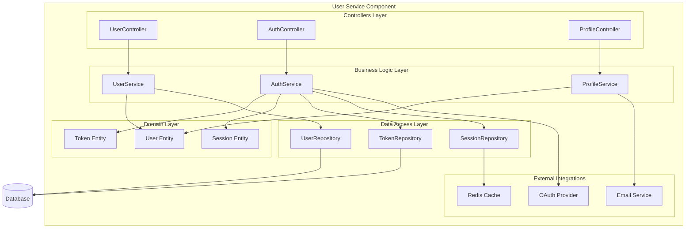

---

## 3. Componentes del Backend - Order Service

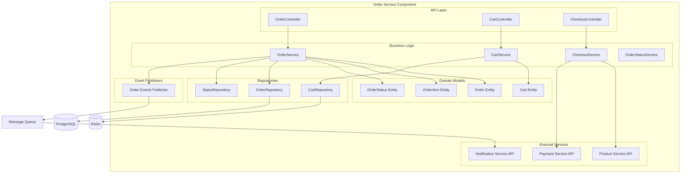

---

## 4. Componentes del Frontend - Web Application

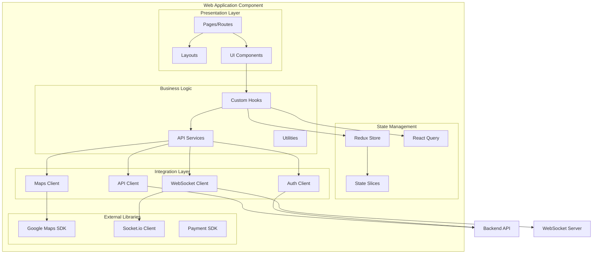

---

## 5. Componentes del Frontend - Feature Modules

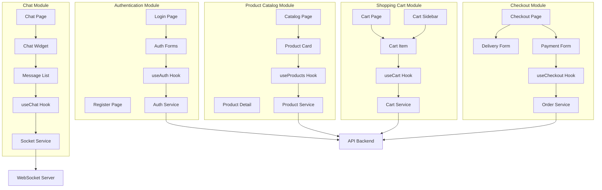

---

## 6. Componentes de Infraestructura

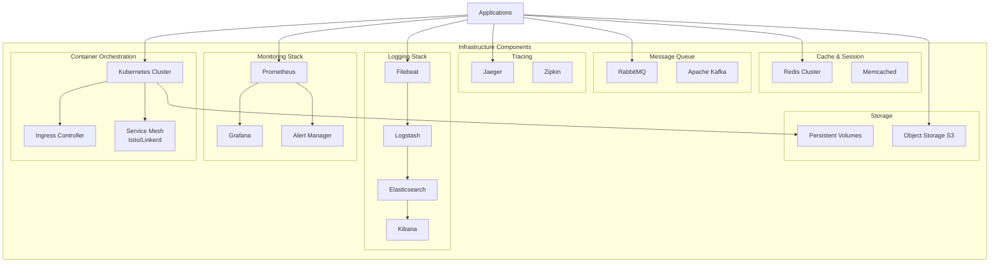

---

## 7. Componentes por Microservicio - Product Service

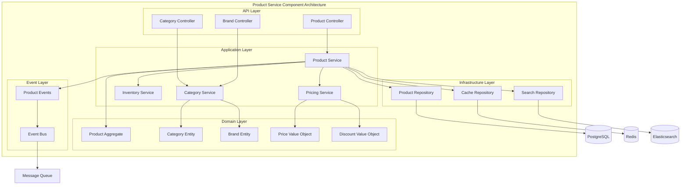

---

## 8. Componentes de Integración - Payment Service

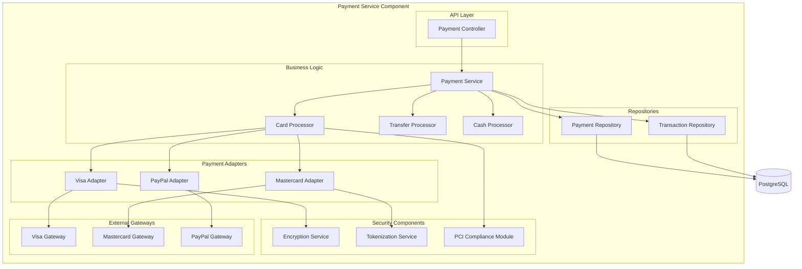

---

## 9. Componentes de Comunicación - Chat Service

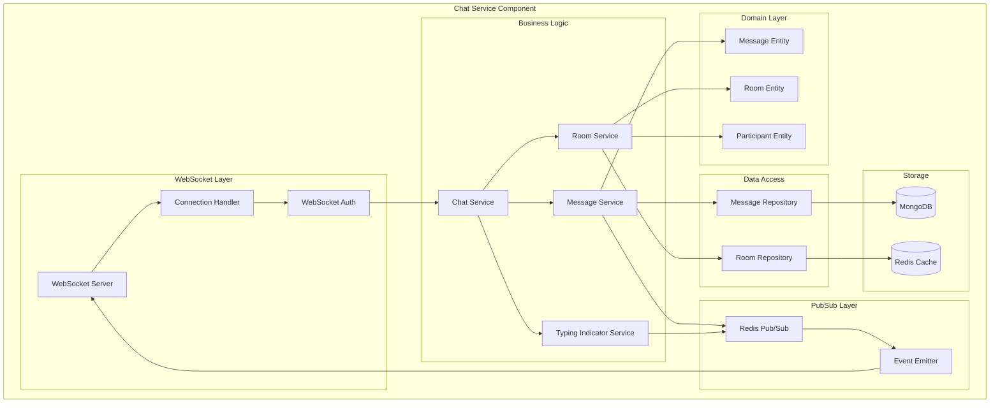

---

## 10. Componentes de Búsqueda - Search Service

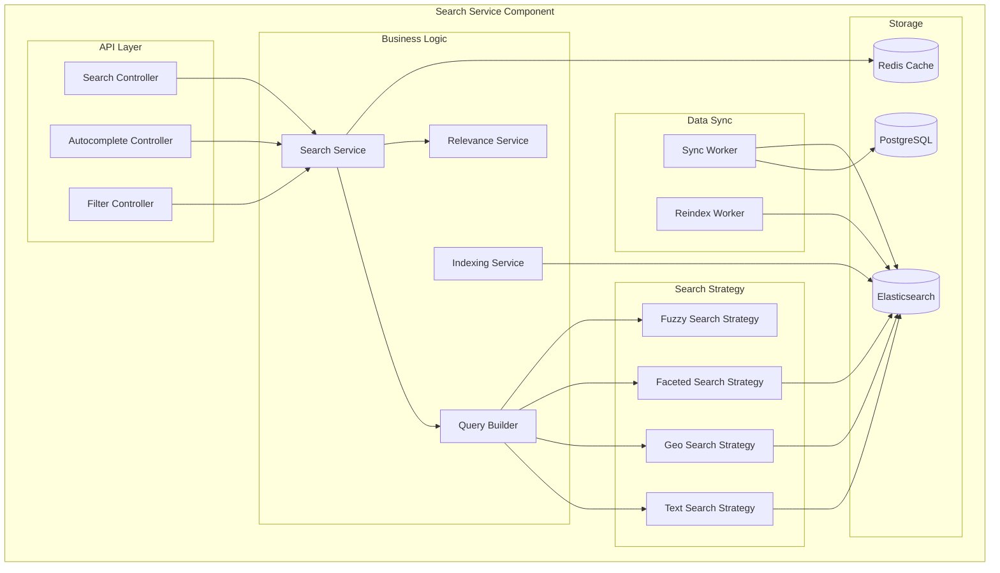

---

## 11. Componentes de Notificación - Notification Service

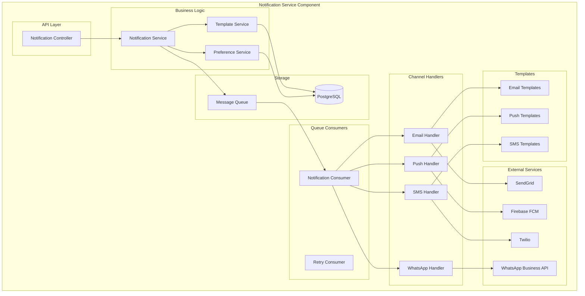

---

## 12. Diagrama C4 - Context Level

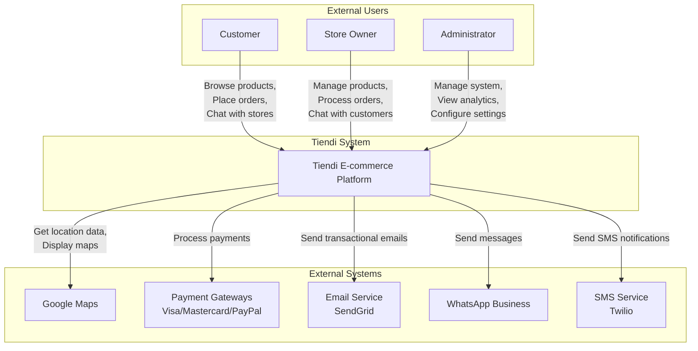

---

## 13. Diagrama de Dependencias entre Componentes

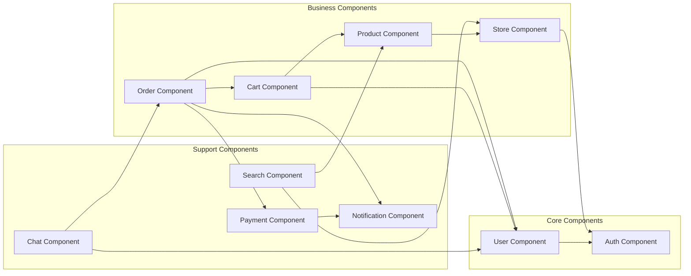

---

## Descripción de Componentes Principales

### Componentes de Negocio

#### User Component
- **Responsabilidad**: Gestión de usuarios y perfiles
- **Interfaces**: UserController, AuthController
- **Dependencias**: Auth Component, Email Service
- **Tecnologías**: NestJS, TypeORM, JWT

#### Product Component
- **Responsabilidad**: Catálogo de productos
- **Interfaces**: ProductController, CategoryController
- **Dependencias**: Store Component, Search Component
- **Tecnologías**: NestJS, TypeORM, Elasticsearch

#### Order Component
- **Responsabilidad**: Gestión de pedidos
- **Interfaces**: OrderController, CheckoutController
- **Dependencias**: Cart, Payment, Notification
- **Tecnologías**: NestJS, TypeORM, RabbitMQ

#### Payment Component
- **Responsabilidad**: Procesamiento de pagos
- **Interfaces**: PaymentController
- **Dependencias**: Payment Gateways
- **Tecnologías**: NestJS, Stripe/PayPal SDK

### Componentes de Soporte

#### Chat Component
- **Responsabilidad**: Mensajería en tiempo real
- **Interfaces**: WebSocket Server
- **Dependencias**: Order Component, User Component
- **Tecnologías**: Socket.io, MongoDB, Redis Pub/Sub

#### Search Component
- **Responsabilidad**: Búsqueda y filtrado
- **Interfaces**: SearchController
- **Dependencias**: Product, Store
- **Tecnologías**: Elasticsearch, Redis

#### Notification Component
- **Responsabilidad**: Envío de notificaciones
- **Interfaces**: NotificationController
- **Dependencias**: Email Service, FCM, Twilio
- **Tecnologías**: NestJS, Bull Queue, SendGrid

---

## Principios de Diseño de Componentes

### 1. Single Responsibility
Cada componente tiene una única responsabilidad bien definida.

### 2. Dependency Inversion
Los componentes dependen de abstracciones (interfaces), no de implementaciones concretas.

### 3. Interface Segregation
Interfaces específicas para cada cliente en lugar de una interfaz general.

### 4. Low Coupling
Minimizar dependencias entre componentes.

### 5. High Cohesion
Agrupar funcionalidad relacionada dentro del mismo componente.

### 6. Separation of Concerns
Separar responsabilidades en capas: API, Business Logic, Data Access.

---

**Fecha de creación:** 2025-11-24
**Versión:** 1.0
