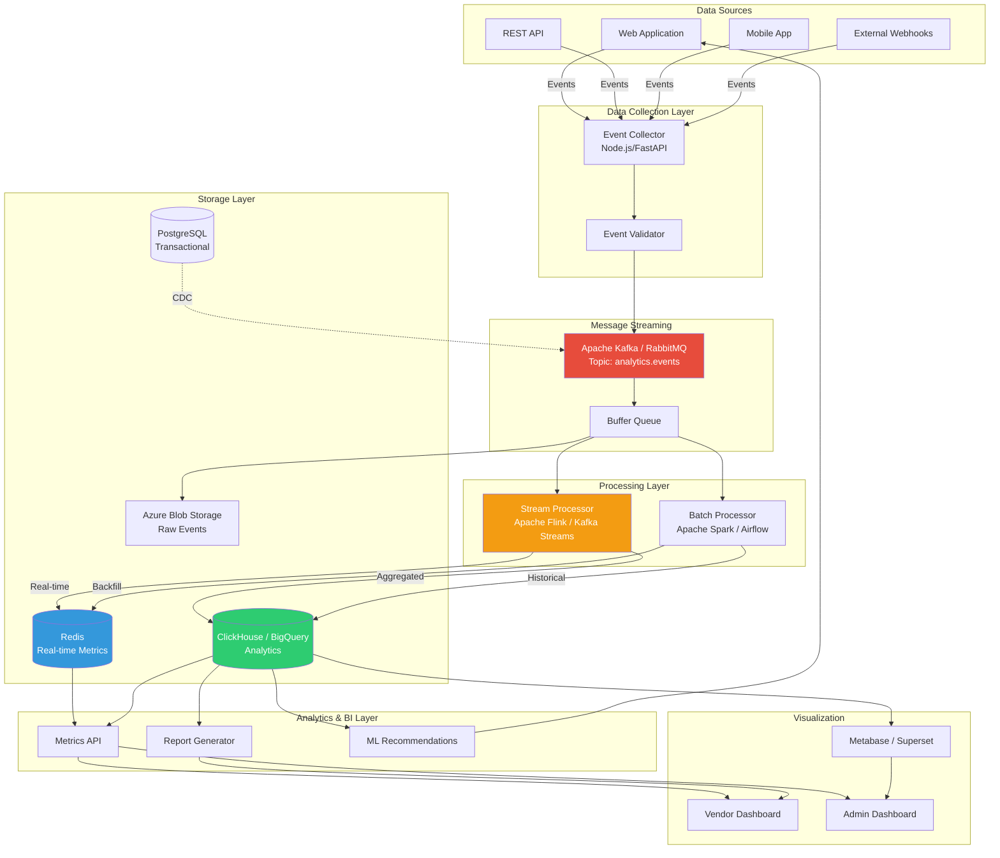
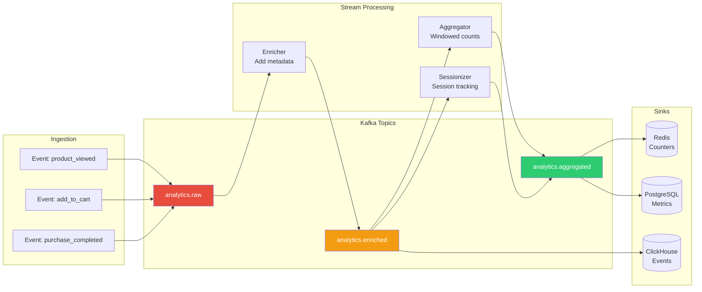
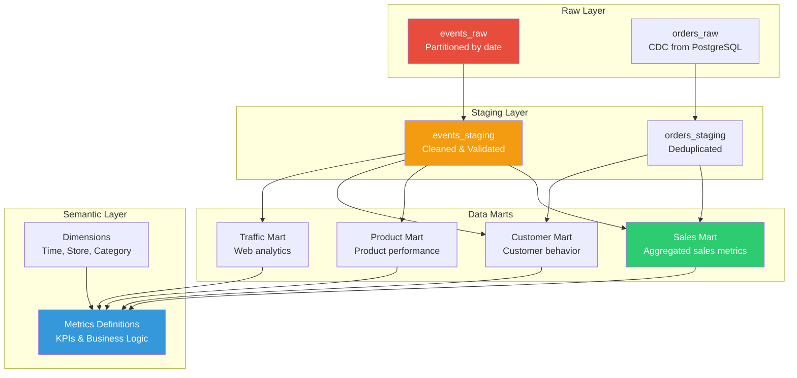
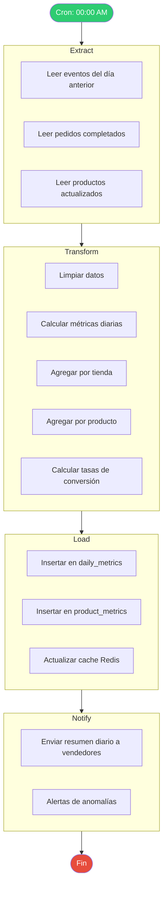

# Arquitectura de Analytics y Data Pipeline - Sistema Tiendi

Sistema de procesamiento de datos, métricas y business intelligence.

---

## Arquitectura General del Sistema de Analytics



---

## Pipeline de Datos en Tiempo Real (Streaming)



---

## Arquitectura de Data Warehouse



---

## Procesamiento Batch (ETL Diario)



---

## Stack Tecnológico Recomendado

### Opción 1: Stack Open Source (Costo Bajo)

```yaml
Data Collection:
  - Event Collector: Node.js + Express
  - Queue: RabbitMQ

Stream Processing:
  - Kafka Streams (Java)
  - o Apache Flink

Storage:
  - OLTP: PostgreSQL
  - OLAP: ClickHouse
  - Cache: Redis
  - Object Storage: Azure Blob

Batch Processing:
  - Orchestration: Apache Airflow
  - Processing: Python + Pandas
  - o dbt (data build tool)

Visualization:
  - Internal: React + Recharts
  - Admin: Metabase (open source)
```

### Opción 2: Stack Cloud-Native (Costo Alto, Menos Mantenimiento)

```yaml
Data Collection:
  - Azure Event Hubs
  - o Google Cloud Pub/Sub

Stream Processing:
  - Azure Stream Analytics
  - o Google Cloud Dataflow

Storage:
  - OLTP: Azure Database for PostgreSQL
  - OLAP: Google BigQuery
  - Cache: Azure Cache for Redis

Batch Processing:
  - Azure Data Factory
  - o Google Cloud Composer (Airflow)

Visualization:
  - Power BI
  - o Looker
```

---

## Esquema de Eventos (Event Schema)

```typescript
// Esquema base de eventos
interface BaseEvent {
  event_id: string;           // UUID
  event_type: string;         // 'page_view', 'product_click', etc.
  timestamp: string;          // ISO 8601
  session_id: string;         // Session UUID
  user_id?: string;           // UUID (optional for anonymous)

  // Context
  context: {
    ip: string;
    user_agent: string;
    referrer?: string;
    page_url: string;
    device_type: 'mobile' | 'tablet' | 'desktop';
    os: string;
    browser: string;
  };

  // Properties (event-specific)
  properties: Record<string, any>;
}

// Ejemplo: Product Viewed
interface ProductViewedEvent extends BaseEvent {
  event_type: 'product_viewed';
  properties: {
    product_id: string;
    product_name: string;
    product_price: number;
    product_category: string;
    store_id: string;
    store_name: string;
  };
}

// Ejemplo: Purchase Completed
interface PurchaseCompletedEvent extends BaseEvent {
  event_type: 'purchase_completed';
  properties: {
    order_id: string;
    store_id: string;
    total: number;
    subtotal: number;
    delivery_fee: number;
    items: Array<{
      product_id: string;
      quantity: number;
      price: number;
    }>;
    payment_method: string;
  };
}
```

---

## Métricas Clave (KPIs)

### Para Vendedores

```yaml
Ventas:
  - Total de ventas (GMV)
  - Número de pedidos
  - Ticket promedio (AOV)
  - Ventas por categoría

Productos:
  - Productos más vendidos
  - Productos con más vistas
  - Tasa de conversión por producto
  - Stock disponible vs vendido

Clientes:
  - Nuevos clientes
  - Clientes recurrentes
  - Tasa de retención
  - Valor de vida del cliente (LTV)

Tráfico:
  - Visitas a la tienda
  - Páginas vistas
  - Tasa de rebote
  - Tiempo promedio en sitio

Conversión:
  - Tasa de conversión general
  - Embudo de conversión
  - Abandono de carrito
  - Tasa de checkout completado
```

### Para Administradores (Tiendi)

```yaml
Plataforma:
  - GMV total
  - Comisiones generadas
  - Tiendas activas
  - Usuarios activos

Crecimiento:
  - Nuevas tiendas
  - Nuevos usuarios
  - Tasa de churn
  - MRR (Monthly Recurring Revenue)

Performance:
  - Latencia de APIs
  - Uptime
  - Error rate
  - Tasa de éxito de pagos
```

---

## Queries de Ejemplo en ClickHouse

```sql
-- Top productos por ventas (últimos 30 días)
SELECT
    p.name as product_name,
    s.name as store_name,
    SUM(oi.quantity) as units_sold,
    SUM(oi.subtotal) as revenue,
    COUNT(DISTINCT o.id) as orders
FROM orders o
JOIN order_items oi ON o.id = oi.order_id
JOIN products p ON oi.product_id = p.id
JOIN stores s ON o.store_id = s.id
WHERE o.created_at >= now() - INTERVAL 30 DAY
  AND o.status = 'ENTREGADO'
GROUP BY p.id, p.name, s.name
ORDER BY revenue DESC
LIMIT 100;

-- Tasa de conversión por tienda
WITH funnel AS (
    SELECT
        store_id,
        countIf(event_type = 'store_visited') as visitors,
        countIf(event_type = 'product_viewed') as product_views,
        countIf(event_type = 'add_to_cart') as add_to_carts,
        countIf(event_type = 'purchase_completed') as purchases
    FROM events
    WHERE toDate(timestamp) >= today() - 30
    GROUP BY store_id
)
SELECT
    store_id,
    visitors,
    purchases,
    (purchases / visitors) * 100 as conversion_rate,
    (add_to_carts / product_views) * 100 as add_to_cart_rate
FROM funnel
WHERE visitors > 100
ORDER BY conversion_rate DESC;

-- Cohort analysis (retención de clientes)
SELECT
    toStartOfMonth(first_purchase_date) as cohort_month,
    dateDiff('month', first_purchase_date, purchase_date) as months_since_first,
    COUNT(DISTINCT user_id) as users
FROM (
    SELECT
        user_id,
        MIN(created_at) OVER (PARTITION BY user_id) as first_purchase_date,
        created_at as purchase_date
    FROM orders
    WHERE status = 'ENTREGADO'
)
GROUP BY cohort_month, months_since_first
ORDER BY cohort_month, months_since_first;
```

---

## Consideraciones de Performance

### Particionamiento

```sql
-- Particionar eventos por fecha (ClickHouse)
CREATE TABLE events
(
    event_id UUID,
    event_type String,
    timestamp DateTime,
    user_id Nullable(UUID),
    properties String,
    ...
)
ENGINE = MergeTree()
PARTITION BY toYYYYMM(timestamp)
ORDER BY (store_id, timestamp)
TTL timestamp + INTERVAL 2 YEAR;
```

### Materialización de Vistas

```sql
-- Vista materializada para métricas diarias
CREATE MATERIALIZED VIEW daily_metrics_mv
ENGINE = SummingMergeTree()
PARTITION BY toYYYYMM(date)
ORDER BY (store_id, date)
AS SELECT
    store_id,
    toDate(timestamp) as date,
    countIf(event_type = 'product_viewed') as product_views,
    countIf(event_type = 'purchase_completed') as purchases,
    sumIf(toDecimal64(JSONExtractString(properties, 'total'), 2),
          event_type = 'purchase_completed') as revenue
FROM events
GROUP BY store_id, date;
```

---

## Costos Estimados

### Opción 1: Open Source en Azure VMs

```
- 2x VMs D4s v3 (Kafka + ClickHouse): $280/mes
- PostgreSQL Flexible Server: $150/mes
- Redis Cache: $80/mes
- Blob Storage (1TB): $20/mes
- Bandwidth: $50/mes
Total: ~$580/mes
```

### Opción 2: Cloud-Native

```
- Azure Event Hubs Standard: $200/mes
- Azure Stream Analytics: $300/mes
- BigQuery (1TB queries/mes): $250/mes
- PostgreSQL: $150/mes
- Redis: $80/mes
Total: ~$980/mes
```

---

**Fecha de creación:** 2025-01-24
**Versión:** 1.0
