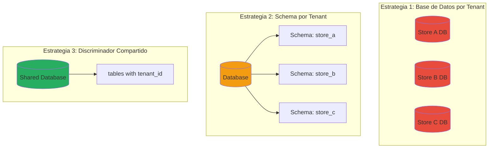
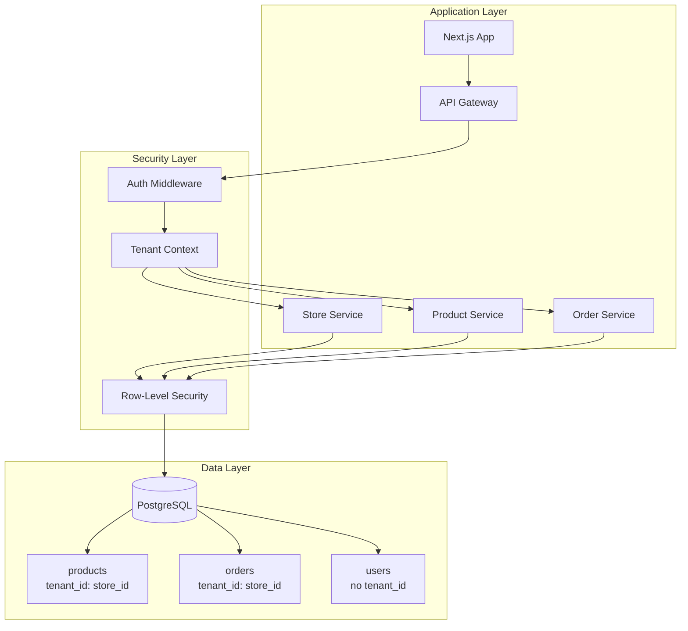
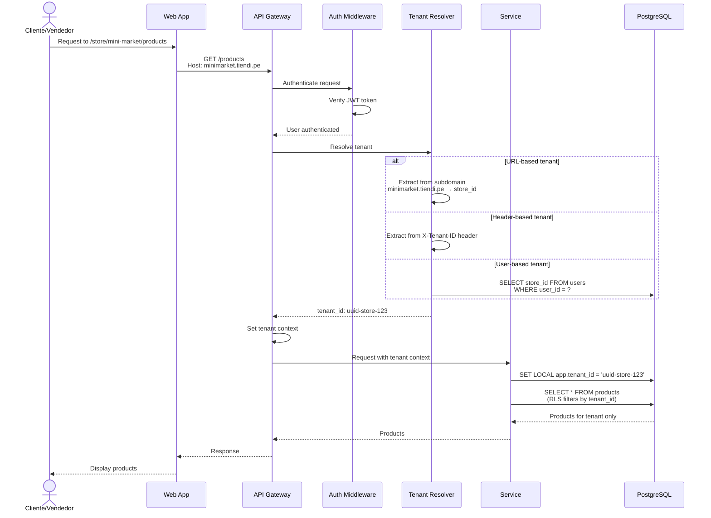
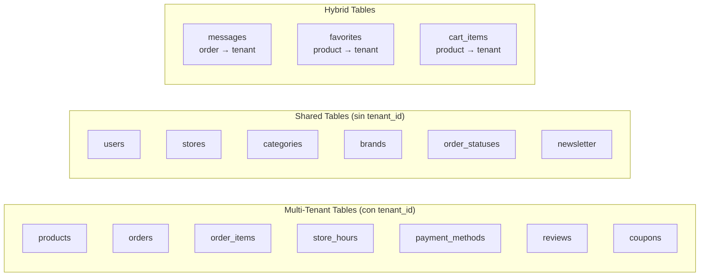
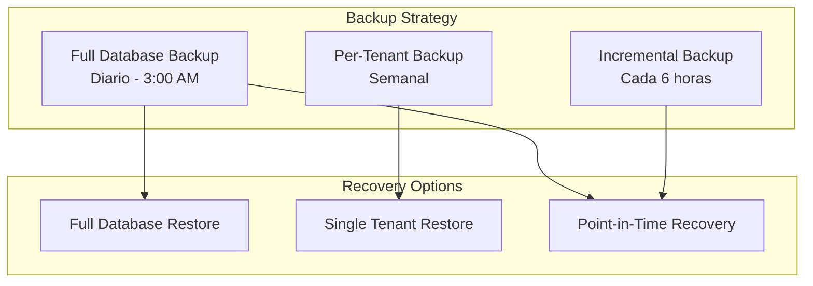

# Arquitectura Multi-Tenant - Sistema Tiendi

Este documento describe la arquitectura multi-tenant del sistema Tiendi y las estrategias de aislamiento de datos.

---

## Concepto Multi-Tenant

En Tiendi, cada **tienda** es un tenant independiente. El sistema debe garantizar:
- Aislamiento de datos entre tiendas
- Performance escalable
- Facilidad de mantenimiento
- Seguridad robusta

---

## Estrategias de Multi-Tenancy

### Comparación de Estrategias



### Comparativa

| Aspecto | DB por Tenant | Schema por Tenant | Discriminador |
|---------|---------------|-------------------|---------------|
| **Aislamiento** | ⭐⭐⭐⭐⭐ Máximo | ⭐⭐⭐⭐ Alto | ⭐⭐⭐ Medio |
| **Performance** | ⭐⭐⭐ Buena | ⭐⭐⭐⭐ Muy buena | ⭐⭐⭐⭐⭐ Excelente |
| **Costo** | ⭐⭐ Alto | ⭐⭐⭐ Medio | ⭐⭐⭐⭐⭐ Bajo |
| **Mantenimiento** | ⭐⭐ Complejo | ⭐⭐⭐ Moderado | ⭐⭐⭐⭐ Simple |
| **Escalabilidad** | ⭐⭐⭐⭐ Buena | ⭐⭐⭐⭐ Buena | ⭐⭐⭐⭐⭐ Excelente |
| **Migraciones** | ⭐⭐ Difícil | ⭐⭐⭐ Moderado | ⭐⭐⭐⭐⭐ Simple |

---

## Estrategia Recomendada: Discriminador con Row-Level Security

Para Tiendi, recomendamos **Discriminador Compartido** con PostgreSQL Row-Level Security (RLS).

### Arquitectura Implementada



---

## Identificación de Tenant

### Contexto de Request



### Métodos de Identificación

```typescript
// 1. Subdomain-based
// minimarket.tiendi.pe → tenant: minimarket
function getTenantFromSubdomain(req: Request): string {
  const host = req.headers.host;
  const subdomain = host.split('.')[0];
  return subdomain === 'www' || subdomain === 'tiendi'
    ? null
    : subdomain;
}

// 2. Path-based
// /store/minimarket/products → tenant: minimarket
function getTenantFromPath(req: Request): string {
  const match = req.url.match(/^\/store\/([^\/]+)/);
  return match ? match[1] : null;
}

// 3. Header-based (para APIs)
function getTenantFromHeader(req: Request): string {
  return req.headers['x-tenant-id'];
}

// 4. User-based (para usuarios autenticados)
async function getTenantFromUser(userId: string): Promise<string> {
  const user = await db.users.findOne({
    where: { id: userId },
    include: { store: true }
  });
  return user?.store?.id;
}
```

---

## Row-Level Security (RLS) en PostgreSQL

### Configuración de RLS

```sql
-- Habilitar RLS en tabla de productos
ALTER TABLE products ENABLE ROW LEVEL SECURITY;

-- Política de seguridad: Solo ver productos del tenant actual
CREATE POLICY tenant_isolation_policy ON products
  USING (store_id = current_setting('app.tenant_id')::uuid);

-- Política para permitir INSERT solo con tenant_id correcto
CREATE POLICY tenant_insert_policy ON products
  FOR INSERT
  WITH CHECK (store_id = current_setting('app.tenant_id')::uuid);

-- Política para permitir UPDATE solo dentro del tenant
CREATE POLICY tenant_update_policy ON products
  FOR UPDATE
  USING (store_id = current_setting('app.tenant_id')::uuid);

-- Política para permitir DELETE solo dentro del tenant
CREATE POLICY tenant_delete_policy ON products
  FOR DELETE
  USING (store_id = current_setting('app.tenant_id')::uuid);
```

### Uso en la Aplicación

```typescript
// Middleware de tenant context
export async function tenantContextMiddleware(
  req: Request,
  res: Response,
  next: NextFunction
) {
  const tenantId = await resolveTenant(req);

  if (!tenantId) {
    return res.status(400).json({
      error: 'Tenant not found'
    });
  }

  // Guardar en contexto de request
  req.tenantId = tenantId;

  // Establecer en sesión de DB
  await db.query(
    `SET LOCAL app.tenant_id = $1`,
    [tenantId]
  );

  next();
}

// Repository con tenant context
class ProductRepository {
  async findAll(): Promise<Product[]> {
    // RLS filtra automáticamente por tenant_id
    return db.products.findMany({
      where: { is_active: true }
    });
  }

  async create(data: CreateProductDto): Promise<Product> {
    // Asegurar que store_id coincide con tenant
    const tenantId = getCurrentTenant();

    return db.products.create({
      data: {
        ...data,
        store_id: tenantId // Forzar tenant actual
      }
    });
  }
}
```

---

## Tablas Multi-Tenant vs Compartidas

### Clasificación de Tablas



### Ejemplo de Schema

```sql
-- Tabla compartida (sin tenant_id)
CREATE TABLE users (
  id UUID PRIMARY KEY,
  email VARCHAR(255) UNIQUE NOT NULL,
  -- ... otros campos
  -- NO tiene tenant_id
);

-- Tabla multi-tenant (con tenant_id)
CREATE TABLE products (
  id UUID PRIMARY KEY,
  store_id UUID NOT NULL, -- Este es el tenant_id
  name VARCHAR(255) NOT NULL,
  price DECIMAL(10,2) NOT NULL,
  -- ... otros campos
  FOREIGN KEY (store_id) REFERENCES stores(id)
);

-- Habilitar RLS
ALTER TABLE products ENABLE ROW LEVEL SECURITY;

-- Política de aislamiento
CREATE POLICY tenant_isolation ON products
  USING (store_id = current_setting('app.tenant_id')::uuid);
```

---

## Queries Multi-Tenant

### Queries Seguros con RLS

```sql
-- La sesión tiene app.tenant_id establecido
SET LOCAL app.tenant_id = 'uuid-store-123';

-- Query simple - RLS filtra automáticamente
SELECT * FROM products;
-- Resultado: Solo productos de store_id = 'uuid-store-123'

-- JOIN entre multi-tenant y shared
SELECT
  p.*,
  c.name as category_name,
  b.name as brand_name
FROM products p
INNER JOIN categories c ON p.category_id = c.id
INNER JOIN brands b ON p.brand_id = b.id
WHERE p.is_active = true;
-- RLS filtra productos automáticamente

-- Aggregations por tenant
SELECT
  COUNT(*) as total_products,
  AVG(price) as avg_price
FROM products;
-- Solo cuenta productos del tenant actual
```

### Queries Cross-Tenant (Solo Admin)

```typescript
// Para super admin que necesita datos de todos los tenants
async function getAllStoresRevenue() {
  // Desactivar RLS temporalmente (requiere permisos especiales)
  await db.query('SET LOCAL row_security = OFF');

  const revenue = await db.query(`
    SELECT
      s.name as store_name,
      SUM(o.total) as total_revenue
    FROM stores s
    LEFT JOIN orders o ON o.store_id = s.id
    WHERE o.created_at >= NOW() - INTERVAL '30 days'
    GROUP BY s.id, s.name
    ORDER BY total_revenue DESC
  `);

  // Reactivar RLS
  await db.query('SET LOCAL row_security = ON');

  return revenue;
}
```

---

## Migraciones Multi-Tenant

### Sistema de Migraciones

```typescript
// Migration runner
class MigrationRunner {
  async runMigration(migration: Migration) {
    // Obtener todos los tenants
    const stores = await db.stores.findMany();

    for (const store of stores) {
      console.log(`Running migration for tenant: ${store.name}`);

      try {
        // Establecer contexto de tenant
        await db.query(
          `SET LOCAL app.tenant_id = $1`,
          [store.id]
        );

        // Ejecutar migración
        await migration.up(db);

        console.log(`✓ Migration successful for ${store.name}`);
      } catch (error) {
        console.error(`✗ Migration failed for ${store.name}:`, error);
        // Decidir si continuar o rollback
        throw error;
      }
    }
  }
}

// Ejemplo de migración
const addDiscountToProducts: Migration = {
  async up(db) {
    await db.query(`
      ALTER TABLE products
      ADD COLUMN IF NOT EXISTS discount_percentage INTEGER DEFAULT 0
    `);
  },

  async down(db) {
    await db.query(`
      ALTER TABLE products
      DROP COLUMN IF EXISTS discount_percentage
    `);
  }
};
```

---

## Backup y Recuperación por Tenant

### Estrategia de Backup



### Script de Backup por Tenant

```bash
#!/bin/bash
# backup-tenant.sh

TENANT_ID=$1
BACKUP_DIR="/backups/tenants"
TIMESTAMP=$(date +%Y%m%d_%H%M%S)

# Backup de datos del tenant
pg_dump \
  --host=localhost \
  --dbname=tiendi \
  --username=postgres \
  --format=custom \
  --file="${BACKUP_DIR}/tenant_${TENANT_ID}_${TIMESTAMP}.dump" \
  --table=products \
  --table=orders \
  --table=order_items \
  --where="store_id='${TENANT_ID}'"

echo "Backup completed: tenant_${TENANT_ID}_${TIMESTAMP}.dump"
```

### Restauración de Tenant

```bash
#!/bin/bash
# restore-tenant.sh

BACKUP_FILE=$1
TENANT_ID=$2

# Restaurar datos del tenant
pg_restore \
  --host=localhost \
  --dbname=tiendi \
  --username=postgres \
  --clean \
  --if-exists \
  "${BACKUP_FILE}"

echo "Tenant ${TENANT_ID} restored successfully"
```

---

## Monitoreo y Observabilidad

### Métricas por Tenant

```typescript
// Middleware de métricas
export function tenantMetricsMiddleware(
  req: Request,
  res: Response,
  next: NextFunction
) {
  const startTime = Date.now();
  const tenantId = req.tenantId;

  res.on('finish', () => {
    const duration = Date.now() - startTime;

    // Registrar métricas por tenant
    metrics.record({
      tenant_id: tenantId,
      endpoint: req.path,
      method: req.method,
      status_code: res.statusCode,
      duration_ms: duration,
      timestamp: new Date()
    });
  });

  next();
}

// Dashboard de métricas por tenant
async function getTenantMetrics(tenantId: string, period: string) {
  return {
    requests_total: await metrics.count({
      tenant_id: tenantId,
      period
    }),
    avg_response_time: await metrics.avg('duration_ms', {
      tenant_id: tenantId,
      period
    }),
    error_rate: await metrics.errorRate({
      tenant_id: tenantId,
      period
    }),
    active_users: await metrics.uniqueUsers({
      tenant_id: tenantId,
      period
    })
  };
}
```

---

## Seguridad Multi-Tenant

### Checklist de Seguridad

- ✅ Row-Level Security habilitado en todas las tablas multi-tenant
- ✅ Validación de tenant_id en todas las operaciones CRUD
- ✅ Tests de aislamiento de datos entre tenants
- ✅ Auditoría de acceso cross-tenant
- ✅ Rate limiting por tenant
- ✅ Validación de permisos por tenant
- ✅ Logs separados por tenant
- ✅ Encriptación de datos sensibles por tenant

### Test de Aislamiento

```typescript
// Test de aislamiento entre tenants
describe('Multi-Tenant Isolation', () => {
  it('should not allow tenant A to access tenant B data', async () => {
    // Setup
    const tenantA = await createStore({ name: 'Store A' });
    const tenantB = await createStore({ name: 'Store B' });

    const productA = await createProduct({
      store_id: tenantA.id,
      name: 'Product A'
    });

    const productB = await createProduct({
      store_id: tenantB.id,
      name: 'Product B'
    });

    // Test: Tenant A intenta acceder a datos de Tenant B
    setTenantContext(tenantA.id);

    const products = await productRepository.findAll();

    // Assertions
    expect(products).toHaveLength(1);
    expect(products[0].id).toBe(productA.id);
    expect(products).not.toContain(productB);
  });

  it('should prevent cross-tenant updates', async () => {
    setTenantContext(tenantA.id);

    // Intentar actualizar producto de otro tenant
    await expect(
      productRepository.update(productB.id, { price: 100 })
    ).rejects.toThrow('Product not found');
  });
});
```

---

## Consideraciones de Performance

### Índices para Multi-Tenant

```sql
-- Índice compuesto para queries frecuentes
CREATE INDEX idx_products_tenant_active
ON products(store_id, is_active, created_at DESC);

-- Índice parcial para productos activos
CREATE INDEX idx_products_active_only
ON products(store_id)
WHERE is_active = true;

-- Índice para búsquedas de texto por tenant
CREATE INDEX idx_products_search_tenant
ON products USING GIN(
  store_id,
  to_tsvector('spanish', name || ' ' || description)
);
```

### Caché por Tenant

```typescript
class TenantAwareCache {
  private redis: Redis;

  async get(key: string): Promise<any> {
    const tenantId = getCurrentTenant();
    const tenantKey = `tenant:${tenantId}:${key}`;

    const cached = await this.redis.get(tenantKey);
    return cached ? JSON.parse(cached) : null;
  }

  async set(
    key: string,
    value: any,
    ttl: number = 3600
  ): Promise<void> {
    const tenantId = getCurrentTenant();
    const tenantKey = `tenant:${tenantId}:${key}`;

    await this.redis.setex(
      tenantKey,
      ttl,
      JSON.stringify(value)
    );
  }

  async invalidate(key: string): Promise<void> {
    const tenantId = getCurrentTenant();
    const tenantKey = `tenant:${tenantId}:${key}`;

    await this.redis.del(tenantKey);
  }
}
```

---

## Mejores Prácticas

### ✅ DO

1. **Siempre validar tenant_id** en operaciones CRUD
2. **Usar RLS** como capa adicional de seguridad
3. **Testear aislamiento** entre tenants regularmente
4. **Monitorear performance** por tenant
5. **Logs separados** por tenant para debugging
6. **Caché con namespace** por tenant

### ❌ DON'T

1. **No confiar solo en lógica de aplicación** para aislamiento
2. **No usar tenant_id de parámetros de request** directamente
3. **No ejecutar queries sin contexto de tenant**
4. **No permitir cross-tenant queries** sin autorización explícita
5. **No compartir caché** entre tenants
6. **No hacer operaciones batch** sin considerar tenants

---

**Fecha de creación:** 2025-11-24
**Versión:** 1.0
**Autor:** Sistema Tiendi
