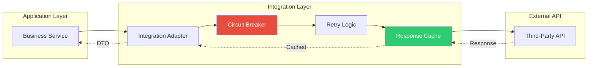
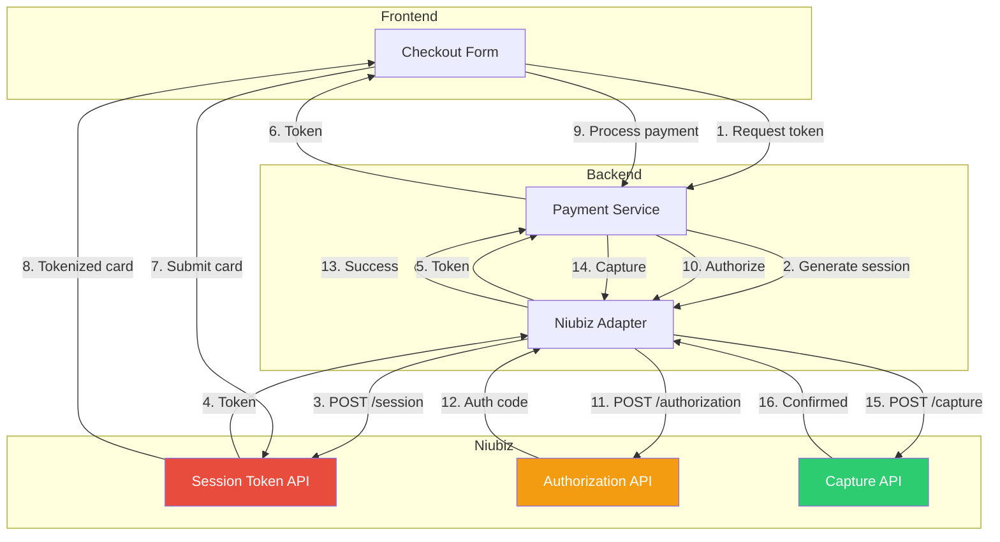
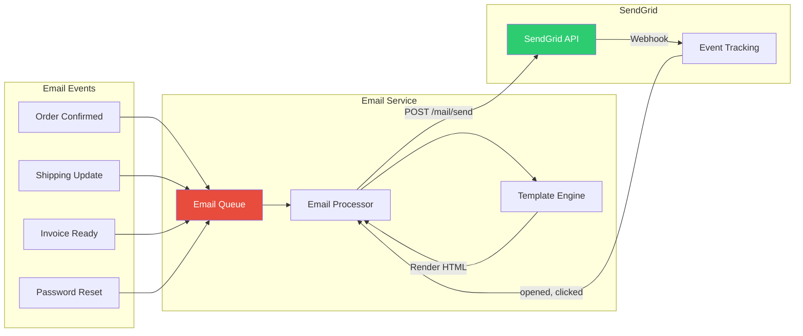

# Arquitectura de Integraciones Externas - Sistema Tiendi

Integraciones con servicios de terceros: Pagos, Mapas, Auth, SMS, Email, etc.

---

## Arquitectura General de Integraciones

```mermaid
graph TB
    subgraph "Tiendi Backend"
        API[API Gateway]
        SERVICES[Microservices]
        INTEGRATION[Integration Layer]
    end

    subgraph "Pagos"
        NIUBIZ[Niubiz<br/>Visa/Mastercard]
        CULQI[Culqi<br/>Tarjetas]
        MERCADOPAGO[MercadoPago]
        IZIPAY[Izipay]
    end

    subgraph "Geolocalización"
        GMAPS[Google Maps API<br/>Geocoding & Distance]
        PLACES[Google Places API]
    end

    subgraph "Autenticación Social"
        GOOGLE_AUTH[Google OAuth2.0]
        FACEBOOK_AUTH[Facebook Login]
    end

    subgraph "Mensajería"
        SENDGRID[SendGrid<br/>Email Transaccional]
        TWILIO[Twilio<br/>SMS]
        WHATSAPP[WhatsApp Business API]
    end

    subgraph "Logística"
        OLVA[Olva Courier]
        SHALOM[Shalom]
        URBANO[Urbano Express]
    end

    subgraph "Facturación"
        NUBEFACT[Nubefact<br/>PSE SUNAT]
        FACTUSOL[FactuSol]
    end

    subgraph "Storage & CDN"
        AZURE_BLOB[Azure Blob Storage]
        CLOUDINARY[Cloudinary<br/>Imágenes]
    end

    subgraph "Monitoring"
        SENTRY[Sentry<br/>Error Tracking]
        DATADOG[Datadog<br/>APM]
    end

    API --> INTEGRATION

    INTEGRATION --> NIUBIZ
    INTEGRATION --> CULQI
    INTEGRATION --> MERCADOPAGO
    INTEGRATION --> IZIPAY

    INTEGRATION --> GMAPS
    INTEGRATION --> PLACES

    INTEGRATION --> GOOGLE_AUTH
    INTEGRATION --> FACEBOOK_AUTH

    INTEGRATION --> SENDGRID
    INTEGRATION --> TWILIO
    INTEGRATION --> WHATSAPP

    INTEGRATION --> OLVA
    INTEGRATION --> SHALOM
    INTEGRATION --> URBANO

    INTEGRATION --> NUBEFACT
    INTEGRATION --> FACTUSOL

    SERVICES --> AZURE_BLOB
    SERVICES --> CLOUDINARY

    SERVICES --> SENTRY
    SERVICES --> DATADOG

    style INTEGRATION fill:#3498db,color:#fff
    style NIUBIZ fill:#e74c3c,color:#fff
    style GMAPS fill:#f39c12,color:#fff
    style SENDGRID fill:#2ecc71,color:#fff
```



---

## Integration Layer Pattern



---

## 1. Integración de Pagos (Niubiz)



---

## 2. Integración de Mapas (Google Maps)

```mermaid
graph TB
    subgraph "Features"
        SEARCH[Address Search]
        GEOCODE[Geocoding]
        DISTANCE[Distance Matrix]
        AUTOCOMPLETE[Autocomplete]
    end

    subgraph "Google Maps Services"
        PLACES_API[Places API]
        GEOCODING_API[Geocoding API]
        DISTANCE_API[Distance Matrix API]
    end

    subgraph "Our Backend"
        MAPS_ADAPTER[Maps Adapter]
        CACHE[Redis Cache]
    end

    SEARCH --> AUTOCOMPLETE
    AUTOCOMPLETE -->|Query| MAPS_ADAPTER
    MAPS_ADAPTER -->|Check cache| CACHE

    alt Cache hit
        CACHE -->|Cached results| MAPS_ADAPTER
    else Cache miss
        MAPS_ADAPTER -->|API call| PLACES_API
        PLACES_API -->|Results| MAPS_ADAPTER
        MAPS_ADAPTER -->|Store 24h| CACHE
    end

    GEOCODE -->|Address| MAPS_ADAPTER
    MAPS_ADAPTER -->|Check cache| CACHE
    CACHE -.->|Miss| GEOCODING_API
    GEOCODING_API -.->|{lat, lng}| MAPS_ADAPTER

    DISTANCE -->|Origin/Dest| MAPS_ADAPTER
    MAPS_ADAPTER -->|API call| DISTANCE_API
    DISTANCE_API -->|Distance in km| MAPS_ADAPTER

    style CACHE fill:#2ecc71,color:#fff
    style PLACES_API fill:#f39c12,color:#fff
```

---

## 3. Integración de Email (SendGrid)



---

## Configuración de Integraciones

```typescript
// config/integrations.ts
export const INTEGRATIONS = {
  // Pagos
  niubiz: {
    merchantId: process.env.NIUBIZ_MERCHANT_ID,
    accessKey: process.env.NIUBIZ_ACCESS_KEY,
    apiUrl: process.env.NODE_ENV === 'production'
      ? 'https://api.niubiz.com.pe'
      : 'https://sandbox.niubiz.com.pe',
    currency: 'PEN'
  },

  culqi: {
    publicKey: process.env.CULQI_PUBLIC_KEY,
    privateKey: process.env.CULQI_PRIVATE_KEY,
    apiUrl: 'https://api.culqi.com/v2'
  },

  mercadopago: {
    accessToken: process.env.MERCADOPAGO_ACCESS_TOKEN,
    publicKey: process.env.MERCADOPAGO_PUBLIC_KEY
  },

  // Mapas
  googleMaps: {
    apiKey: process.env.GOOGLE_MAPS_API_KEY,
    services: {
      places: 'https://maps.googleapis.com/maps/api/place',
      geocoding: 'https://maps.googleapis.com/maps/api/geocode',
      distanceMatrix: 'https://maps.googleapis.com/maps/api/distancematrix'
    }
  },

  // Auth Social
  google: {
    clientId: process.env.GOOGLE_CLIENT_ID,
    clientSecret: process.env.GOOGLE_CLIENT_SECRET,
    redirectUri: `${process.env.APP_URL}/auth/google/callback`
  },

  facebook: {
    appId: process.env.FACEBOOK_APP_ID,
    appSecret: process.env.FACEBOOK_APP_SECRET,
    redirectUri: `${process.env.APP_URL}/auth/facebook/callback`
  },

  // Mensajería
  sendgrid: {
    apiKey: process.env.SENDGRID_API_KEY,
    fromEmail: 'noreply@tiendi.com',
    fromName: 'Tiendi'
  },

  twilio: {
    accountSid: process.env.TWILIO_ACCOUNT_SID,
    authToken: process.env.TWILIO_AUTH_TOKEN,
    phoneNumber: process.env.TWILIO_PHONE_NUMBER
  },

  whatsapp: {
    apiKey: process.env.WHATSAPP_API_KEY,
    phoneNumberId: process.env.WHATSAPP_PHONE_ID
  },

  // Logística
  olva: {
    apiKey: process.env.OLVA_API_KEY,
    apiUrl: 'https://api.olva.pe/v1',
    accountNumber: process.env.OLVA_ACCOUNT
  },

  shalom: {
    apiKey: process.env.SHALOM_API_KEY,
    clientCode: process.env.SHALOM_CLIENT_CODE
  },

  // Facturación
  nubefact: {
    token: process.env.NUBEFACT_TOKEN,
    ruc: process.env.COMPANY_RUC
  },

  // Storage
  azureBlob: {
    connectionString: process.env.AZURE_STORAGE_CONNECTION_STRING,
    containerName: 'tiendi-uploads'
  },

  cloudinary: {
    cloudName: process.env.CLOUDINARY_CLOUD_NAME,
    apiKey: process.env.CLOUDINARY_API_KEY,
    apiSecret: process.env.CLOUDINARY_API_SECRET
  },

  // Monitoring
  sentry: {
    dsn: process.env.SENTRY_DSN,
    environment: process.env.NODE_ENV
  }
};
```

---

## Adapter Pattern para Integraciones

```typescript
// Base adapter interface
interface PaymentAdapter {
  createSession(amount: number): Promise<SessionToken>;
  authorize(token: string, amount: number): Promise<AuthResult>;
  capture(authCode: string): Promise<CaptureResult>;
  refund(transactionId: string, amount: number): Promise<RefundResult>;
}

// Niubiz adapter implementation
class NiubizAdapter implements PaymentAdapter {
  private readonly config = INTEGRATIONS.niubiz;
  private readonly httpClient: AxiosInstance;

  constructor() {
    this.httpClient = axios.create({
      baseURL: this.config.apiUrl,
      timeout: 30000,
      headers: {
        'Authorization': `Bearer ${this.config.accessKey}`,
        'Content-Type': 'application/json'
      }
    });
  }

  async createSession(amount: number): Promise<SessionToken> {
    try {
      const response = await this.httpClient.post('/api/v1/session', {
        merchantId: this.config.merchantId,
        amount: amount * 100, // Convert to cents
        currency: this.config.currency
      });

      return {
        token: response.data.sessionKey,
        expiresAt: new Date(Date.now() + 15 * 60 * 1000) // 15 min
      };
    } catch (error) {
      throw new PaymentIntegrationError('Failed to create session', error);
    }
  }

  async authorize(token: string, amount: number): Promise<AuthResult> {
    const response = await this.httpClient.post('/api/v1/authorization', {
      merchantId: this.config.merchantId,
      sessionToken: token,
      amount: amount * 100
    });

    return {
      authCode: response.data.authorizationCode,
      transactionId: response.data.transactionId,
      status: response.data.actionCode === '000' ? 'approved' : 'declined'
    };
  }

  async capture(authCode: string): Promise<CaptureResult> {
    const response = await this.httpClient.post('/api/v1/capture', {
      authorizationCode: authCode
    });

    return {
      success: response.data.captured,
      transactionId: response.data.transactionId
    };
  }

  async refund(transactionId: string, amount: number): Promise<RefundResult> {
    const response = await this.httpClient.post('/api/v1/refund', {
      transactionId,
      amount: amount * 100
    });

    return {
      success: response.data.refunded,
      refundId: response.data.refundId
    };
  }
}

// Factory pattern for payment adapters
class PaymentAdapterFactory {
  static create(provider: string): PaymentAdapter {
    switch (provider) {
      case 'niubiz':
        return new NiubizAdapter();
      case 'culqi':
        return new CulqiAdapter();
      case 'mercadopago':
        return new MercadoPagoAdapter();
      default:
        throw new Error(`Unknown payment provider: ${provider}`);
    }
  }
}
```

---

## Circuit Breaker Pattern

```typescript
// Circuit breaker para proteger integraciones
class CircuitBreaker {
  private state: 'CLOSED' | 'OPEN' | 'HALF_OPEN' = 'CLOSED';
  private failureCount = 0;
  private readonly threshold = 5;
  private readonly timeout = 60000; // 1 minute
  private nextAttempt = Date.now();

  async execute<T>(fn: () => Promise<T>): Promise<T> {
    if (this.state === 'OPEN') {
      if (Date.now() < this.nextAttempt) {
        throw new Error('Circuit breaker is OPEN');
      }
      this.state = 'HALF_OPEN';
    }

    try {
      const result = await fn();

      if (this.state === 'HALF_OPEN') {
        this.state = 'CLOSED';
        this.failureCount = 0;
      }

      return result;
    } catch (error) {
      this.failureCount++;

      if (this.failureCount >= this.threshold) {
        this.state = 'OPEN';
        this.nextAttempt = Date.now() + this.timeout;
      }

      throw error;
    }
  }
}

// Uso
const niubizCircuitBreaker = new CircuitBreaker();

async function callNiubiz() {
  return await niubizCircuitBreaker.execute(async () => {
    return await niubizAdapter.authorize(token, amount);
  });
}
```

---

## Retry Logic con Exponential Backoff

```typescript
async function retryWithBackoff<T>(
  fn: () => Promise<T>,
  maxRetries = 3,
  baseDelay = 1000
): Promise<T> {
  let lastError: Error;

  for (let attempt = 0; attempt <= maxRetries; attempt++) {
    try {
      return await fn();
    } catch (error) {
      lastError = error;

      if (attempt < maxRetries) {
        const delay = baseDelay * Math.pow(2, attempt);
        const jitter = Math.random() * 1000;

        await new Promise(resolve => setTimeout(resolve, delay + jitter));
      }
    }
  }

  throw lastError;
}

// Uso
const result = await retryWithBackoff(
  () => googleMapsAdapter.geocode(address),
  3,
  1000
);
```

---

## Rate Limiting

```typescript
// Rate limiter para APIs externas
class RateLimiter {
  private tokens: number;
  private readonly maxTokens: number;
  private readonly refillRate: number; // tokens per second
  private lastRefill: number;

  constructor(maxTokens: number, refillRate: number) {
    this.maxTokens = maxTokens;
    this.tokens = maxTokens;
    this.refillRate = refillRate;
    this.lastRefill = Date.now();
  }

  async acquire(): Promise<void> {
    this.refill();

    if (this.tokens < 1) {
      const waitTime = (1 - this.tokens) / this.refillRate * 1000;
      await new Promise(resolve => setTimeout(resolve, waitTime));
      this.refill();
    }

    this.tokens -= 1;
  }

  private refill(): void {
    const now = Date.now();
    const timePassed = (now - this.lastRefill) / 1000;
    const tokensToAdd = timePassed * this.refillRate;

    this.tokens = Math.min(this.maxTokens, this.tokens + tokensToAdd);
    this.lastRefill = now;
  }
}

// Google Maps: 50 requests per second
const googleMapsLimiter = new RateLimiter(50, 50);

async function callGoogleMaps() {
  await googleMapsLimiter.acquire();
  return await googleMapsApi.call();
}
```

---

## Webhook Verification

```typescript
// Verificar webhooks de servicios externos
class WebhookVerifier {
  // Niubiz
  static verifyNiubiz(payload: string, signature: string): boolean {
    const secret = INTEGRATIONS.niubiz.webhookSecret;
    const expectedSignature = crypto
      .createHmac('sha256', secret)
      .update(payload)
      .digest('hex');

    return crypto.timingSafeEqual(
      Buffer.from(signature),
      Buffer.from(expectedSignature)
    );
  }

  // SendGrid
  static verifySendGrid(payload: any, signature: string, timestamp: string): boolean {
    const secret = INTEGRATIONS.sendgrid.webhookSecret;
    const signedPayload = timestamp + JSON.stringify(payload);

    const expectedSignature = crypto
      .createHmac('sha256', secret)
      .update(signedPayload)
      .digest('base64');

    return signature === expectedSignature;
  }

  // Olva Courier
  static verifyOlva(payload: string, signature: string): boolean {
    const secret = INTEGRATIONS.olva.webhookSecret;
    const expectedSignature = crypto
      .createHash('sha256')
      .update(payload + secret)
      .digest('hex');

    return signature === expectedSignature;
  }
}
```

---

## Costos Mensuales Estimados

```yaml
Pagos:
  - Niubiz: Comisión por transacción (3.5% + S/ 0.50)
  - Culqi: 3.79% por transacción
  - MercadoPago: 4.99% por transacción

Geolocalización:
  - Google Maps API: $200/mes (estándar)
  - Places API: Incluido
  - Geocoding: $5 por 1000 requests

Email:
  - SendGrid: $100/mes (100K emails)
  - Backup (SMTP): $30/mes

SMS:
  - Twilio: $0.10 por SMS
  - ~1000 SMS/mes = $100/mes

WhatsApp:
  - WhatsApp Business API: $0.05 por mensaje
  - ~2000 mensajes/mes = $100/mes

Logística:
  - APIs gratuitas (costo en envíos reales)

Facturación:
  - Nubefact: $50/mes (hasta 500 comprobantes)
  - O FactuSol: $80/mes

Storage:
  - Azure Blob: $20/mes (1TB)
  - Cloudinary: $99/mes (25GB + transformaciones)

Monitoring:
  - Sentry: $26/mes (equipo)
  - Datadog: $200/mes (APM + Logs)

Total estimado: ~$1,100 - $1,500/mes
(Sin contar comisiones de pago por transacción)
```

---

**Fecha de creación:** 2025-01-24
**Versión:** 1.0
