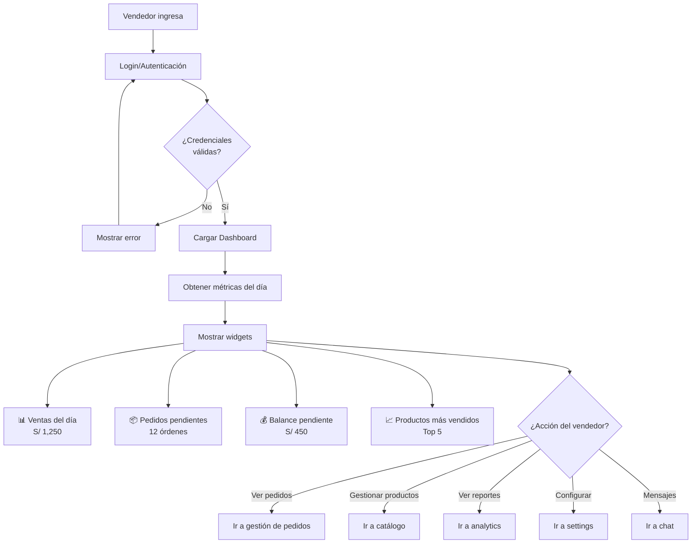
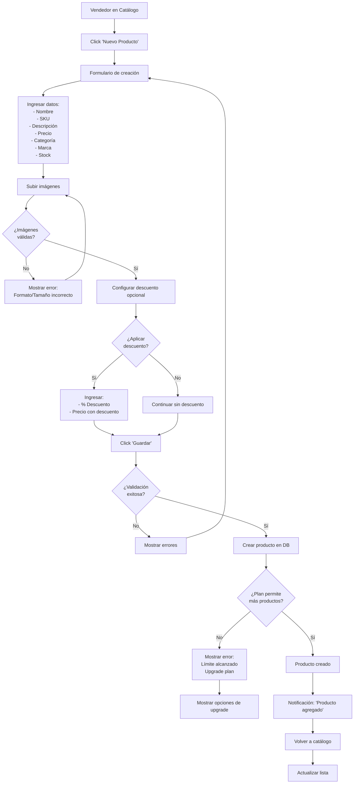
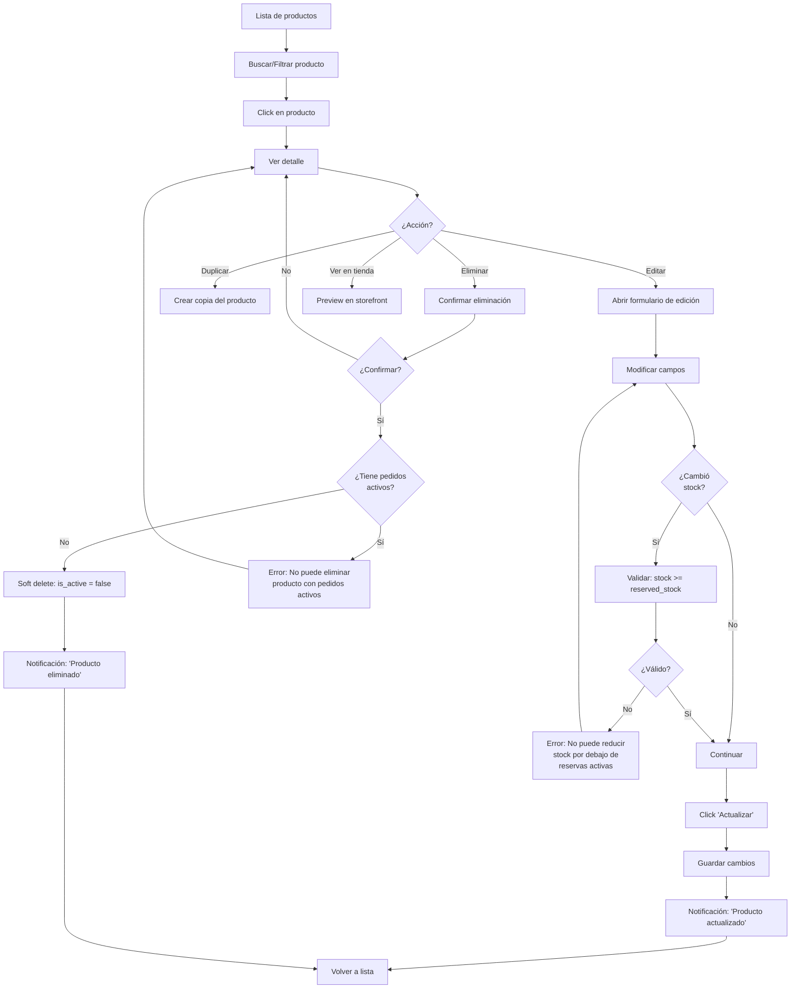
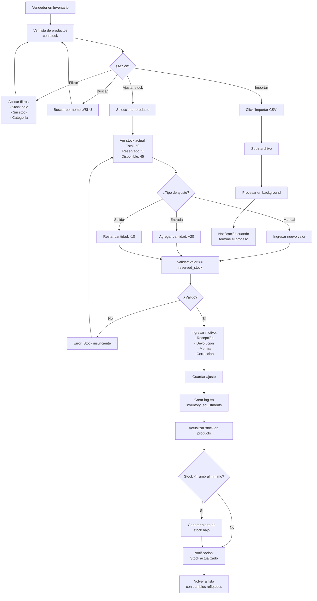
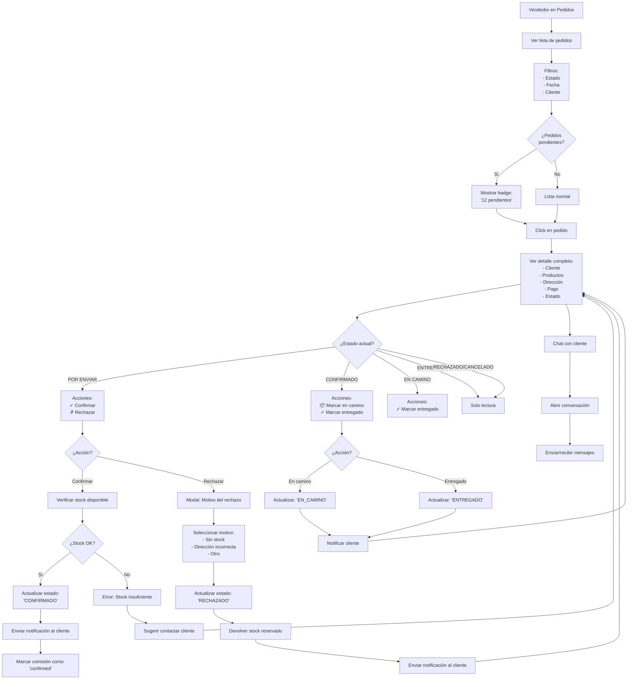
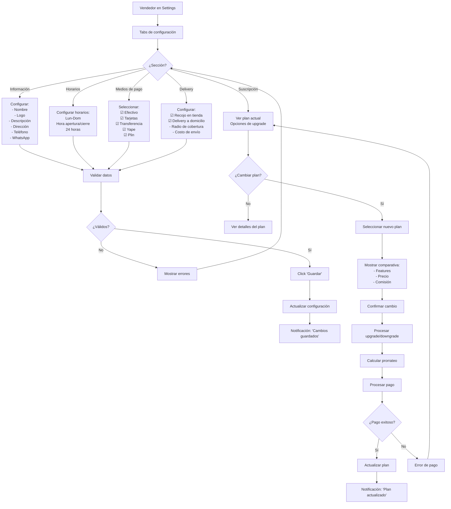
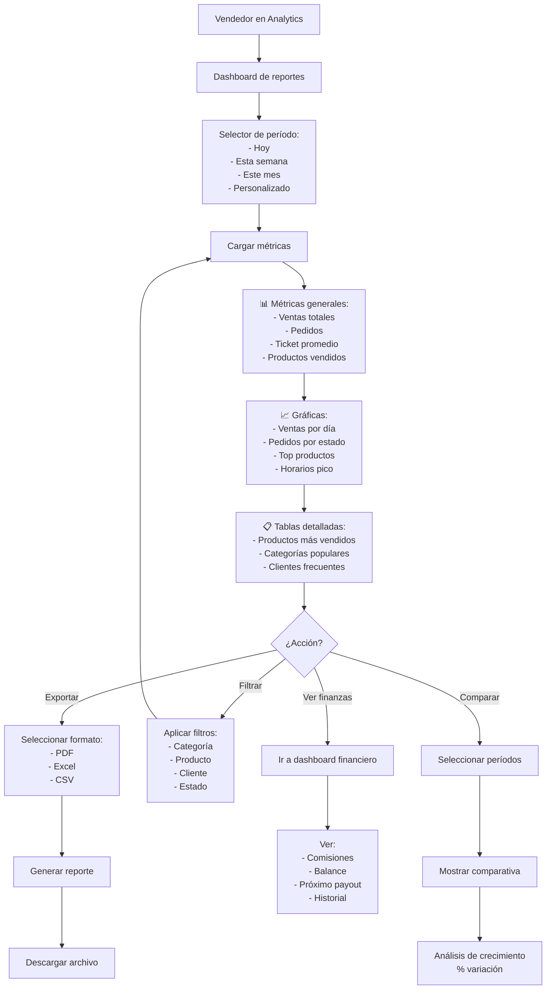
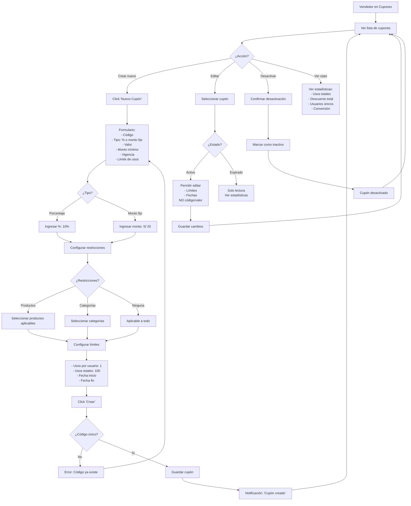
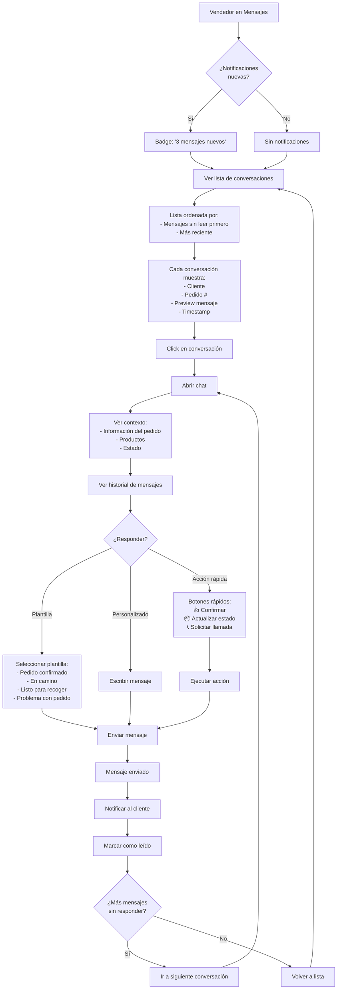
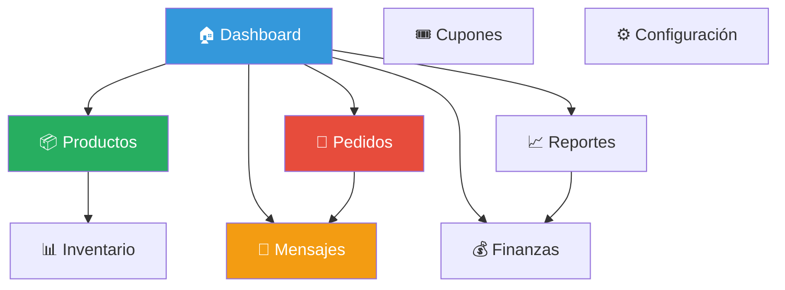

# Diagramas de Flujo - Panel de Vendedor - Sistema Tiendi

Este documento contiene los flujos de trabajo del panel de administración para vendedores.

---

## 1. Flujo de Dashboard Principal

---

## 2. Flujo de Gestión de Productos

### 2.1 Crear Producto

### 2.2 Editar Producto

---

## 3. Flujo de Gestión de Inventario

---

## 4. Flujo de Gestión de Pedidos

---

## 5. Flujo de Configuración de Tienda

---

## 6. Flujo de Reportes y Analytics

---

## 7. Flujo de Gestión de Cupones

---

## 8. Flujo de Respuesta a Mensajes

---

## Navegación General del Panel

---

**Fecha de creación:** 2025-11-24
**Versión:** 1.0
**Autor:** Sistema Tiendi
