# Diagramas de Flujo - Panel de Vendedor - Sistema Tiendi

Este documento contiene los flujos de trabajo del panel de administración para vendedores.

---

## 1. Flujo de Dashboard Principal

```mermaid
flowchart TD
    A[Vendedor ingresa] --> B[Login/Autenticación]
    B --> C{¿Credenciales<br/>válidas?}

    C -->|No| D[Mostrar error]
    D --> B

    C -->|Sí| E[Cargar Dashboard]
    E --> F[Obtener métricas del día]
    F --> G[Mostrar widgets]

    G --> H[📊 Ventas del día<br/>S/ 1,250]
    G --> I[📦 Pedidos pendientes<br/>12 órdenes]
    G --> J[💰 Balance pendiente<br/>S/ 450]
    G --> K[📈 Productos más vendidos<br/>Top 5]

    G --> L{¿Acción del vendedor?}

    L -->|Ver pedidos| M[Ir a gestión de pedidos]
    L -->|Gestionar productos| N[Ir a catálogo]
    L -->|Ver reportes| O[Ir a analytics]
    L -->|Configurar| P[Ir a settings]
    L -->|Mensajes| Q[Ir a chat]
```

---

## 2. Flujo de Gestión de Productos

### 2.1 Crear Producto

```mermaid
flowchart TD
    A[Vendedor en Catálogo] --> B[Click 'Nuevo Producto']
    B --> C[Formulario de creación]

    C --> D[Ingresar datos:<br/>- Nombre<br/>- SKU<br/>- Descripción<br/>- Precio<br/>- Categoría<br/>- Marca<br/>- Stock]

    D --> E[Subir imágenes]
    E --> F{¿Imágenes<br/>válidas?}

    F -->|No| G[Mostrar error:<br/>Formato/Tamaño incorrecto]
    G --> E

    F -->|Sí| H[Configurar descuento opcional]
    H --> I{¿Aplicar<br/>descuento?}

    I -->|Sí| J[Ingresar:<br/>- % Descuento<br/>- Precio con descuento]
    I -->|No| K[Continuar sin descuento]

    J --> L[Click 'Guardar']
    K --> L

    L --> M{¿Validación<br/>exitosa?}

    M -->|No| N[Mostrar errores]
    N --> C

    M -->|Sí| O[Crear producto en DB]
    O --> P{¿Plan permite<br/>más productos?}

    P -->|No| Q[Mostrar error:<br/>Límite alcanzado<br/>Upgrade plan]
    Q --> R[Mostrar opciones de upgrade]

    P -->|Sí| S[Producto creado]
    S --> T[Notificación: 'Producto agregado']
    T --> U[Volver a catálogo]
    U --> V[Actualizar lista]
```

### 2.2 Editar Producto

```mermaid
flowchart TD
    A[Lista de productos] --> B[Buscar/Filtrar producto]
    B --> C[Click en producto]
    C --> D[Ver detalle]

    D --> E{¿Acción?}

    E -->|Editar| F[Abrir formulario de edición]
    E -->|Duplicar| G[Crear copia del producto]
    E -->|Eliminar| H[Confirmar eliminación]
    E -->|Ver en tienda| I[Preview en storefront]

    F --> J[Modificar campos]
    J --> K{¿Cambió<br/>stock?}

    K -->|Sí| L[Validar: stock >= reserved_stock]
    K -->|No| M[Continuar]

    L --> N{¿Válido?}
    N -->|No| O[Error: No puede reducir<br/>stock por debajo de<br/>reservas activas]
    O --> J

    N -->|Sí| M

    M --> P[Click 'Actualizar']
    P --> Q[Guardar cambios]
    Q --> R[Notificación: 'Producto actualizado']
    R --> S[Volver a lista]

    H --> T{¿Confirmar?}
    T -->|No| D
    T -->|Sí| U{¿Tiene pedidos<br/>activos?}
    U -->|Sí| V[Error: No puede eliminar<br/>producto con pedidos activos]
    V --> D
    U -->|No| W[Soft delete: is_active = false]
    W --> X[Notificación: 'Producto eliminado']
    X --> S
```

---

## 3. Flujo de Gestión de Inventario

```mermaid
flowchart TD
    A[Vendedor en Inventario] --> B[Ver lista de productos<br/>con stock]

    B --> C{¿Acción?}

    C -->|Filtrar| D[Aplicar filtros:<br/>- Stock bajo<br/>- Sin stock<br/>- Categoría]
    D --> B

    C -->|Buscar| E[Buscar por nombre/SKU]
    E --> B

    C -->|Ajustar stock| F[Seleccionar producto]

    F --> G[Ver stock actual:<br/>Total: 50<br/>Reservado: 5<br/>Disponible: 45]

    G --> H{¿Tipo de ajuste?}

    H -->|Manual| I[Ingresar nuevo valor]
    H -->|Entrada| J[Agregar cantidad: +20]
    H -->|Salida| K[Restar cantidad: -10]

    I --> L[Validar: valor >= reserved_stock]
    J --> L
    K --> L

    L --> M{¿Válido?}
    M -->|No| N[Error: Stock insuficiente]
    N --> G

    M -->|Sí| O[Ingresar motivo:<br/>- Recepción<br/>- Devolución<br/>- Merma<br/>- Corrección]

    O --> P[Guardar ajuste]
    P --> Q[Crear log en<br/>inventory_adjustments]
    Q --> R[Actualizar stock en products]

    R --> S{Stock <= umbral mínimo?}
    S -->|Sí| T[Generar alerta de<br/>stock bajo]
    S -->|No| U[Notificación:<br/>'Stock actualizado']

    T --> U
    U --> V[Volver a lista<br/>con cambios reflejados]

    C -->|Importar| W[Click 'Importar CSV']
    W --> X[Subir archivo]
    X --> Y[Procesar en background]
    Y --> Z[Notificación cuando<br/>termine el proceso]
```

---

## 4. Flujo de Gestión de Pedidos

```mermaid
flowchart TD
    A[Vendedor en Pedidos] --> B[Ver lista de pedidos]

    B --> C[Filtros:<br/>- Estado<br/>- Fecha<br/>- Cliente]

    C --> D{¿Pedidos<br/>pendientes?}

    D -->|Sí| E[Mostrar badge:<br/>'12 pendientes']
    D -->|No| F[Lista normal]

    E --> G[Click en pedido]
    F --> G

    G --> H[Ver detalle completo:<br/>- Cliente<br/>- Productos<br/>- Dirección<br/>- Pago<br/>- Estado]

    H --> I{¿Estado actual?}

    I -->|POR ENVIAR| J[Acciones:<br/>✓ Confirmar<br/>✗ Rechazar]
    I -->|CONFIRMADO| K[Acciones:<br/>📦 Marcar en camino<br/>✓ Marcar entregado]
    I -->|EN CAMINO| L[Acciones:<br/>✓ Marcar entregado]
    I -->|ENTREGADO| M[Solo lectura]
    I -->|RECHAZADO/CANCELADO| M

    J --> N{¿Acción?}
    N -->|Confirmar| O[Verificar stock disponible]
    O --> P{¿Stock OK?}

    P -->|Sí| Q[Actualizar estado:<br/>'CONFIRMADO']
    Q --> R[Enviar notificación al cliente]
    R --> S[Marcar comisión como 'confirmed']

    P -->|No| T[Error: Stock insuficiente]
    T --> U[Sugerir contactar cliente]
    U --> H

    N -->|Rechazar| V[Modal: Motivo del rechazo]
    V --> W[Seleccionar motivo:<br/>- Sin stock<br/>- Dirección incorrecta<br/>- Otro]
    W --> X[Actualizar estado: 'RECHAZADO']
    X --> Y[Devolver stock reservado]
    Y --> Z[Enviar notificación al cliente]
    Z --> H

    K --> AA{¿Acción?}
    AA -->|En camino| AB[Actualizar: 'EN_CAMINO']
    AA -->|Entregado| AC[Actualizar: 'ENTREGADO']

    AB --> AD[Notificar cliente]
    AC --> AD
    AD --> H

    H --> AE[Chat con cliente]
    AE --> AF[Abrir conversación]
    AF --> AG[Enviar/recibir mensajes]
```

---

## 5. Flujo de Configuración de Tienda

```mermaid
flowchart TD
    A[Vendedor en Settings] --> B[Tabs de configuración]

    B --> C{¿Sección?}

    C -->|Información| D[Configurar:<br/>- Nombre<br/>- Logo<br/>- Descripción<br/>- Dirección<br/>- Teléfono<br/>- WhatsApp]

    C -->|Horarios| E[Configurar horarios:<br/>Lun-Dom<br/>Hora apertura/cierre<br/>24 horas]

    C -->|Medios de pago| F[Seleccionar:<br/>☑ Efectivo<br/>☑ Tarjetas<br/>☑ Transferencia<br/>☑ Yape<br/>☑ Plin]

    C -->|Delivery| G[Configurar:<br/>☑ Recojo en tienda<br/>☑ Delivery a domicilio<br/>- Radio de cobertura<br/>- Costo de envío]

    C -->|Suscripción| H[Ver plan actual<br/>Opciones de upgrade]

    D --> I[Validar datos]
    E --> I
    F --> I
    G --> I

    I --> J{¿Válidos?}
    J -->|No| K[Mostrar errores]
    K --> C

    J -->|Sí| L[Click 'Guardar']
    L --> M[Actualizar configuración]
    M --> N[Notificación: 'Cambios guardados']

    H --> O{¿Cambiar plan?}
    O -->|No| P[Ver detalles del plan]
    O -->|Sí| Q[Seleccionar nuevo plan]
    Q --> R[Mostrar comparativa:<br/>- Features<br/>- Precio<br/>- Comisión]
    R --> S[Confirmar cambio]
    S --> T[Procesar upgrade/downgrade]
    T --> U[Calcular prorrateo]
    U --> V[Procesar pago]
    V --> W{¿Pago exitoso?}
    W -->|Sí| X[Actualizar plan]
    X --> Y[Notificación: 'Plan actualizado']
    W -->|No| Z[Error de pago]
    Z --> H
```

---

## 6. Flujo de Reportes y Analytics

```mermaid
flowchart TD
    A[Vendedor en Analytics] --> B[Dashboard de reportes]

    B --> C[Selector de período:<br/>- Hoy<br/>- Esta semana<br/>- Este mes<br/>- Personalizado]

    C --> D[Cargar métricas]

    D --> E[📊 Métricas generales:<br/>- Ventas totales<br/>- Pedidos<br/>- Ticket promedio<br/>- Productos vendidos]

    E --> F[📈 Gráficas:<br/>- Ventas por día<br/>- Pedidos por estado<br/>- Top productos<br/>- Horarios pico]

    F --> G[📋 Tablas detalladas:<br/>- Productos más vendidos<br/>- Categorías populares<br/>- Clientes frecuentes]

    G --> H{¿Acción?}

    H -->|Exportar| I[Seleccionar formato:<br/>- PDF<br/>- Excel<br/>- CSV]
    I --> J[Generar reporte]
    J --> K[Descargar archivo]

    H -->|Filtrar| L[Aplicar filtros:<br/>- Categoría<br/>- Producto<br/>- Cliente<br/>- Estado]
    L --> D

    H -->|Ver finanzas| M[Ir a dashboard financiero]
    M --> N[Ver:<br/>- Comisiones<br/>- Balance<br/>- Próximo payout<br/>- Historial]

    H -->|Comparar| O[Seleccionar períodos]
    O --> P[Mostrar comparativa]
    P --> Q[Análisis de crecimiento<br/>% variación]
```

---

## 7. Flujo de Gestión de Cupones

```mermaid
flowchart TD
    A[Vendedor en Cupones] --> B[Ver lista de cupones]

    B --> C{¿Acción?}

    C -->|Crear nuevo| D[Click 'Nuevo Cupón']
    D --> E[Formulario:<br/>- Código<br/>- Tipo: % o monto fijo<br/>- Valor<br/>- Monto mínimo<br/>- Vigencia<br/>- Límite de usos]

    E --> F{¿Tipo?}
    F -->|Porcentaje| G[Ingresar %: 10%]
    F -->|Monto fijo| H[Ingresar monto: S/ 20]

    G --> I[Configurar restricciones]
    H --> I

    I --> J{¿Restricciones?}
    J -->|Productos| K[Seleccionar productos aplicables]
    J -->|Categorías| L[Seleccionar categorías]
    J -->|Ninguna| M[Aplicable a todo]

    K --> N[Configurar límites]
    L --> N
    M --> N

    N --> O[- Usos por usuario: 1<br/>- Usos totales: 100<br/>- Fecha inicio<br/>- Fecha fin]

    O --> P[Click 'Crear']
    P --> Q{¿Código único?}
    Q -->|No| R[Error: Código ya existe]
    R --> E

    Q -->|Sí| S[Guardar cupón]
    S --> T[Notificación: 'Cupón creado']
    T --> B

    C -->|Editar| U[Seleccionar cupón]
    U --> V{¿Estado?}
    V -->|Activo| W[Permitir editar<br/>- Límites<br/>- Fechas<br/>NO código/valor]
    V -->|Expirado| X[Solo lectura<br/>Ver estadísticas]

    W --> Y[Guardar cambios]
    Y --> B

    C -->|Desactivar| Z[Confirmar desactivación]
    Z --> AA[Marcar como inactivo]
    AA --> AB[Cupón desactivado]
    AB --> B

    C -->|Ver stats| AC[Ver estadísticas:<br/>- Usos totales<br/>- Descuento total<br/>- Usuarios únicos<br/>- Conversión]
```

---

## 8. Flujo de Respuesta a Mensajes

```mermaid
flowchart TD
    A[Vendedor en Mensajes] --> B{¿Notificaciones<br/>nuevas?}

    B -->|Sí| C[Badge: '3 mensajes nuevos']
    B -->|No| D[Sin notificaciones]

    C --> E[Ver lista de conversaciones]
    D --> E

    E --> F[Lista ordenada por:<br/>- Mensajes sin leer primero<br/>- Más reciente]

    F --> G[Cada conversación muestra:<br/>- Cliente<br/>- Pedido #<br/>- Preview mensaje<br/>- Timestamp]

    G --> H[Click en conversación]
    H --> I[Abrir chat]

    I --> J[Ver contexto:<br/>- Información del pedido<br/>- Productos<br/>- Estado]

    J --> K[Ver historial de mensajes]

    K --> L{¿Responder?}

    L -->|Plantilla| M[Seleccionar plantilla:<br/>- Pedido confirmado<br/>- En camino<br/>- Listo para recoger<br/>- Problema con pedido]

    L -->|Personalizado| N[Escribir mensaje]

    M --> O[Enviar mensaje]
    N --> O

    O --> P[Mensaje enviado]
    P --> Q[Notificar al cliente]
    Q --> R[Marcar como leído]

    R --> S{¿Más mensajes<br/>sin responder?}
    S -->|Sí| T[Ir a siguiente conversación]
    T --> I
    S -->|No| U[Volver a lista]
    U --> E

    L -->|Acción rápida| V[Botones rápidos:<br/>👍 Confirmar<br/>📦 Actualizar estado<br/>📞 Solicitar llamada]

    V --> W[Ejecutar acción]
    W --> O
```

---

## Navegación General del Panel

```mermaid
graph TB
    DASH[🏠 Dashboard]
    PROD[📦 Productos]
    INV[📊 Inventario]
    ORD[🛒 Pedidos]
    MSG[💬 Mensajes]
    COUP[🎟️ Cupones]
    REP[📈 Reportes]
    FIN[💰 Finanzas]
    SET[⚙️ Configuración]

    DASH --> PROD
    DASH --> ORD
    DASH --> MSG
    DASH --> REP
    DASH --> FIN

    PROD --> INV
    ORD --> MSG
    REP --> FIN

    style DASH fill:#3498db,color:#fff
    style PROD fill:#27ae60,color:#fff
    style ORD fill:#e74c3c,color:#fff
    style MSG fill:#f39c12,color:#fff
```

---

**Fecha de creación:** 2025-11-24
**Versión:** 1.0
**Autor:** Sistema Tiendi
