# Diagramas de Flujo - Sistema Tiendi

Este documento contiene los diagramas de flujo de los principales procesos del sistema Tiendi.

---

## 1. Flujo de Autenticación

### 1.1 Flujo de Login
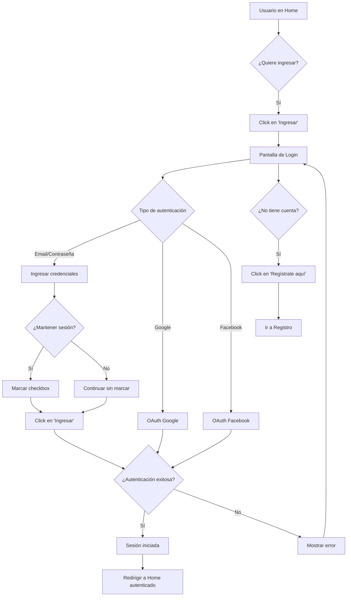

### 1.2 Flujo de Registro
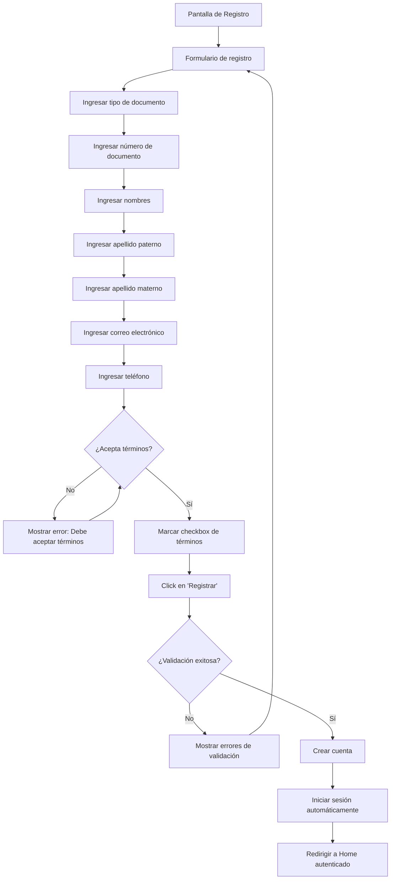

---

## 2. Flujo de Búsqueda de Tiendas

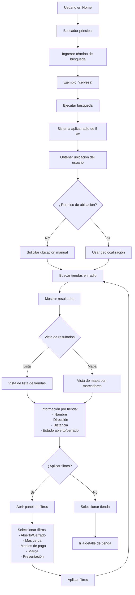

---

## 3. Flujo Completo de Compra

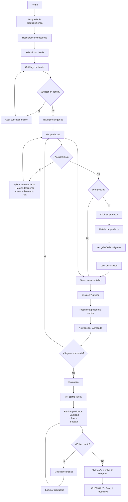

---

## 4. Flujo de Checkout

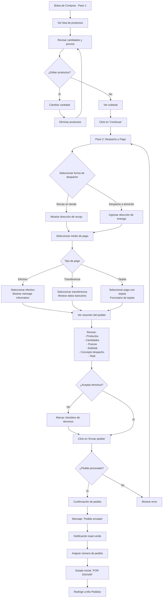

---

## 5. Flujo de Gestión de Pedidos

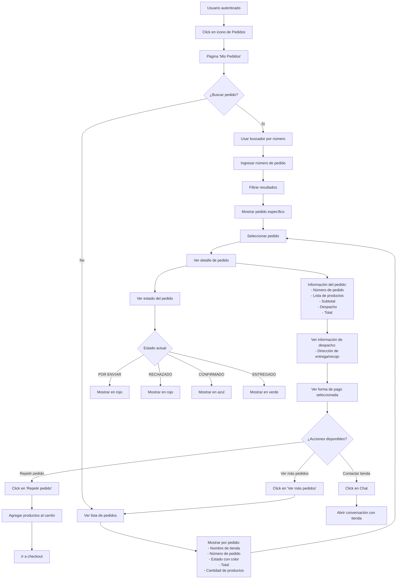

---

## 6. Flujo de Sistema de Mensajería

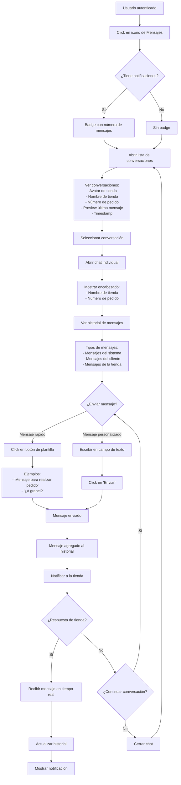

---

## 7. Flujo de Favoritos

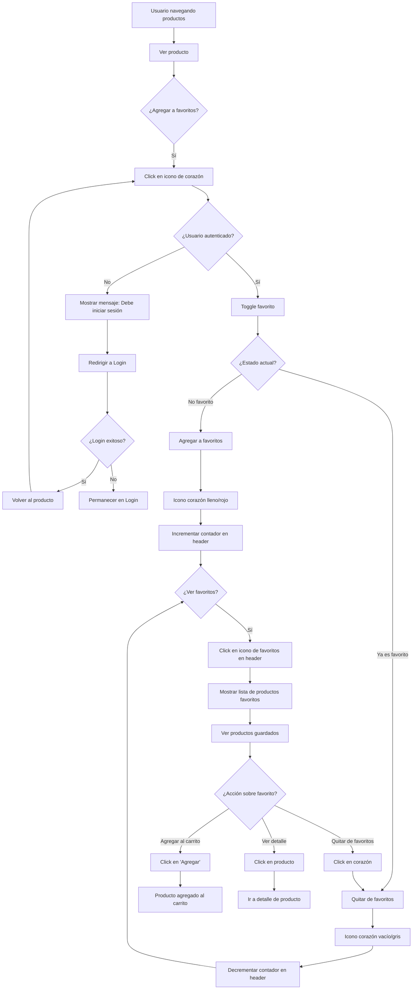

---

## 8. Flujo de Vendedor

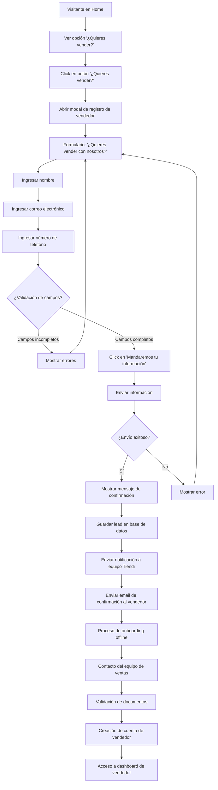

---

## 9. Flujo de Suscripción a Newsletter

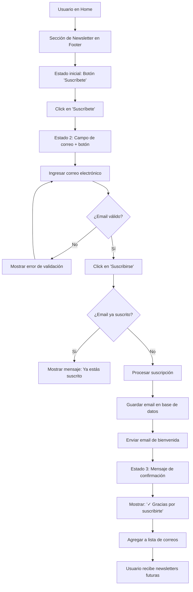

---

## 10. Flujo de Filtros y Ordenamiento

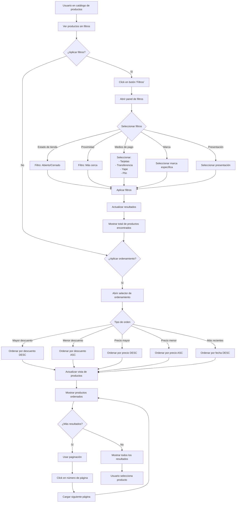

---

## Notas sobre los Diagramas

### Convenciones utilizadas:
- **Rectángulos**: Acciones o estados
- **Rombos**: Decisiones o condiciones
- **Flechas**: Flujo de navegación
- **Colores en el sistema real**:
  - 🔴 Rojo: Estados negativos (Rechazado, Por enviar)
  - 🟢 Verde: Estados positivos (Entregado, Confirmado)
  - 🔵 Azul: Estados en proceso (Confirmado)

### Aspectos técnicos a considerar:
1. **Autenticación**: Implementar OAuth 2.0 para redes sociales
2. **Geolocalización**: Usar Google Maps API o Mapbox
3. **Chat en tiempo real**: WebSockets o Firebase
4. **Notificaciones**: Sistema de push y email
5. **Estados de pedido**: Máquina de estados bien definida

### Próximos pasos sugeridos:
1. Crear diagramas de entidad-relación (ERD) para la base de datos
2. Diseñar diagramas de arquitectura del sistema
3. Crear diagramas de secuencia para APIs críticas
4. Documentar casos de uso detallados por módulo

---

**Última actualización:** 2025-11-24
**Generado a partir de:** MODULOS_SISTEMA_TIENDI.md
