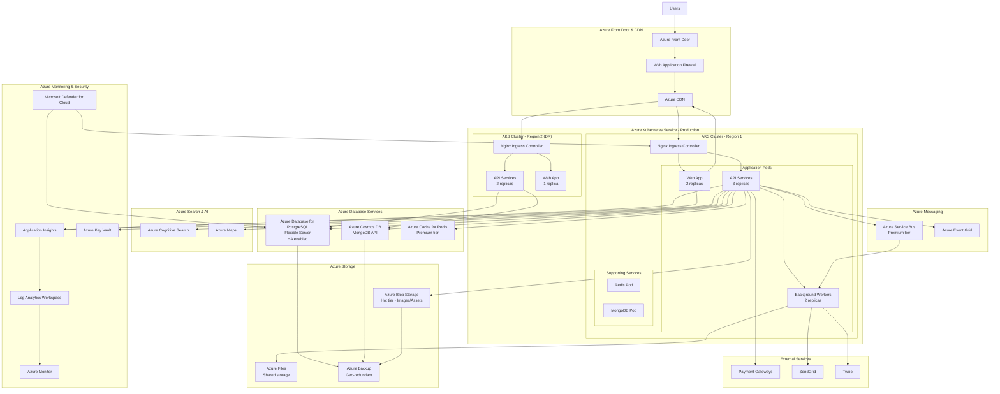
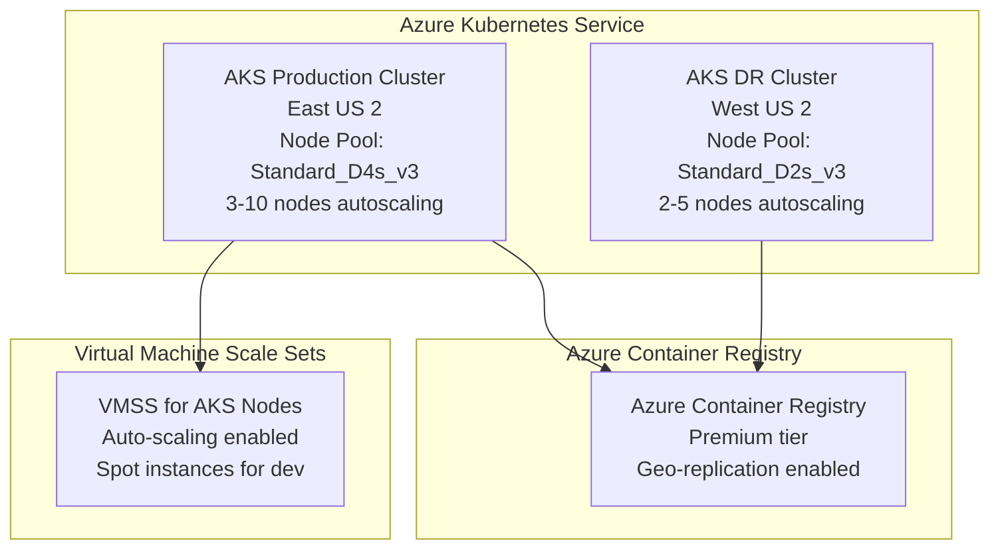
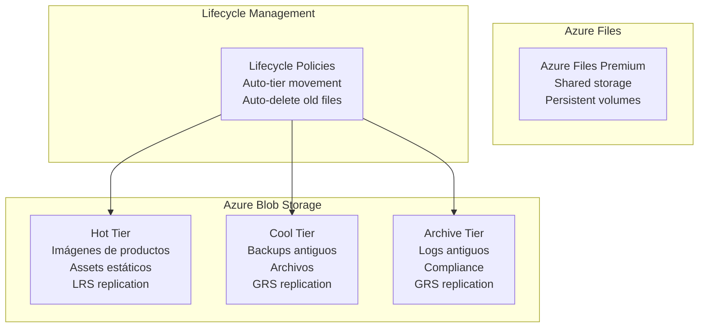
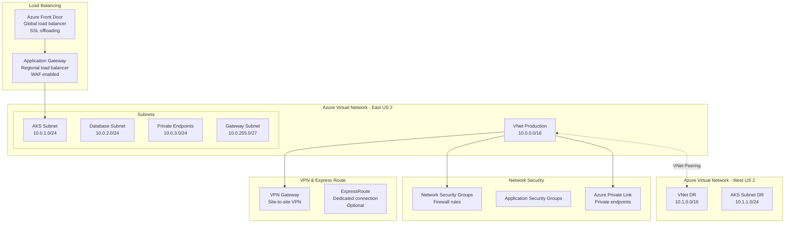
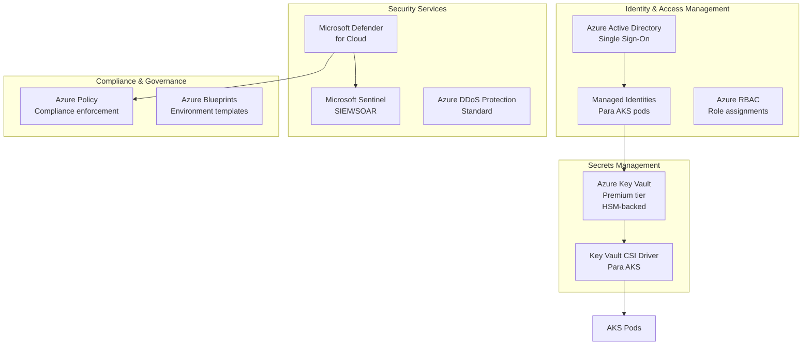
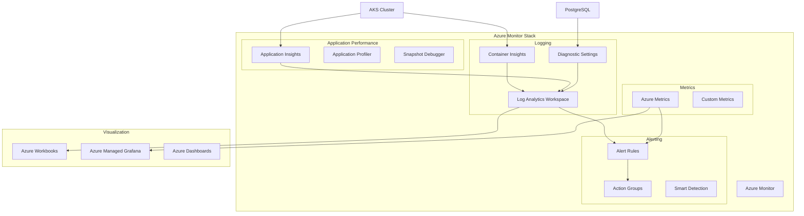
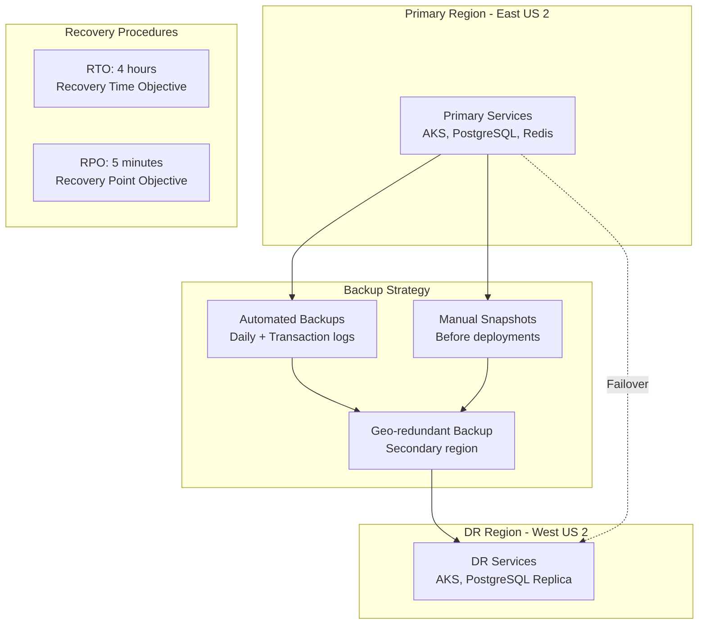
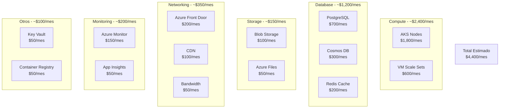

# Diagrama de Despliegue en Azure - Sistema Tiendi

Este documento describe la arquitectura de despliegue del sistema Tiendi en Microsoft Azure.

---

## 1. Arquitectura de Despliegue Completa en Azure



---

## 2. Recursos de Azure por Categoría

### 2.1 Compute (Cómputo)



**Configuración recomendada:**
- **AKS Production**: 3-10 nodos (Standard_D4s_v3: 4 vCPUs, 16 GB RAM)
- **AKS DR**: 2-5 nodos (Standard_D2s_v3: 2 vCPUs, 8 GB RAM)
- **Auto-scaling**: Habilitado en ambos clusters
- **Availability Zones**: 3 zonas para alta disponibilidad

---

### 2.2 Databases (Bases de Datos)

```mermaid
graph TB
    subgraph "Azure Database for PostgreSQL"
        POSTGRES_PRIMARY[PostgreSQL Flexible Server<br/>Primary - East US 2<br/>General Purpose<br/>4 vCores, 32 GB RAM<br/>512 GB SSD]
        POSTGRES_REPLICA[Read Replica<br/>West US 2<br/>4 vCores, 32 GB RAM]
        POSTGRES_BACKUP[Automated Backups<br/>35 days retention<br/>Geo-redundant]
    end

    subgraph "Azure Cosmos DB"
        COSMOS_MONGO[Cosmos DB - MongoDB API<br/>Multi-region writes<br/>East US 2 (Primary)<br/>West US 2 (Secondary)<br/>Autoscale: 1000-10000 RU/s]
    end

    subgraph "Azure Cache for Redis"
        REDIS_PRIMARY[Redis Premium P1<br/>Primary - East US 2<br/>6 GB cache<br/>Persistence enabled]
        REDIS_REPLICA[Redis Geo-Replica<br/>West US 2]
    end

    POSTGRES_PRIMARY -.Replication.-> POSTGRES_REPLICA
    POSTGRES_PRIMARY --> POSTGRES_BACKUP
    REDIS_PRIMARY -.Geo-replication.-> REDIS_REPLICA
```

**Configuración recomendada:**

**PostgreSQL:**
- Tier: General Purpose
- Compute: 4 vCores
- Storage: 512 GB SSD con auto-crecimiento
- Backup: 35 días, Geo-redundante
- High Availability: Zone-redundant HA

**Cosmos DB:**
- API: MongoDB
- Consistency: Session
- Multi-region: Habilitado
- Autoscale: 1000-10000 RU/s

**Redis:**
- Tier: Premium P1 (6 GB)
- Persistence: RDB + AOF
- Clustering: Habilitado
- Geo-replication: Activa

---

### 2.3 Storage (Almacenamiento)



**Configuración:**
- **Hot Tier**: Imágenes activas, LRS
- **Cool Tier**: Backups recientes (30-90 días), GRS
- **Archive Tier**: Logs históricos (>90 días), GRS
- **Azure Files Premium**: Para persistent volumes de AKS

---

### 2.4 Networking (Redes)



**Configuración de Red:**

1. **VNet Production (East US 2)**: 10.0.0.0/16
   - AKS Subnet: 10.0.1.0/24
   - Database Subnet: 10.0.2.0/24
   - Private Endpoints: 10.0.3.0/24

2. **VNet DR (West US 2)**: 10.1.0.0/16
   - AKS Subnet: 10.1.1.0/24

3. **Network Security Groups**:
   - AKS NSG: Solo tráfico HTTPS (443), interno (80)
   - DB NSG: Solo desde AKS subnet (5432 PostgreSQL, 27017 MongoDB)
   - Redis NSG: Solo desde AKS (6379)

4. **Private Endpoints**:
   - PostgreSQL Private Endpoint
   - Cosmos DB Private Endpoint
   - Redis Private Endpoint
   - Storage Account Private Endpoint
   - Key Vault Private Endpoint

---

## 3. Seguridad en Azure



**Configuración de Seguridad:**

### Azure Key Vault
```yaml
# Secrets almacenados
secrets:
  - database-connection-string
  - redis-connection-string
  - cosmos-connection-string
  - jwt-secret
  - payment-gateway-api-key
  - sendgrid-api-key
  - google-maps-api-key

# Certificados
certificates:
  - tiendi-com-ssl
  - api-tiendi-com-ssl

# Keys
encryption-keys:
  - data-encryption-key
  - backup-encryption-key
```

### Managed Identities
```bash
# Identidad para AKS
az identity create \
  --name tiendi-aks-identity \
  --resource-group tiendi-prod-rg

# Asignar permisos a Key Vault
az keyvault set-policy \
  --name tiendi-keyvault \
  --object-id <identity-id> \
  --secret-permissions get list \
  --certificate-permissions get list
```

---

## 4. Monitoreo y Observabilidad



**Configuración de Monitoreo:**

### Application Insights
```typescript
// Instrumentación en código
import { ApplicationInsights } from '@microsoft/applicationinsights-web';

const appInsights = new ApplicationInsights({
  config: {
    connectionString: process.env.APPLICATIONINSIGHTS_CONNECTION_STRING,
    enableAutoRouteTracking: true,
    enableRequestHeaderTracking: true,
    enableResponseHeaderTracking: true,
  }
});

appInsights.loadAppInsights();
appInsights.trackPageView();
```

### Alert Rules
```yaml
# Reglas de alerta críticas
alerts:
  - name: High CPU Usage
    condition: avg(cpu_percentage) > 80
    window: 5 minutes
    severity: Critical
    action: Notify DevOps team

  - name: High Memory Usage
    condition: avg(memory_percentage) > 85
    window: 5 minutes
    severity: Warning

  - name: Failed Requests
    condition: count(failed_requests) > 10
    window: 1 minute
    severity: Critical

  - name: Database Connection Pool Exhausted
    condition: available_connections < 5
    window: 2 minutes
    severity: Critical

  - name: Redis Cache Hit Rate Low
    condition: cache_hit_rate < 70
    window: 10 minutes
    severity: Warning
```

---

## 5. CI/CD Pipeline con Azure DevOps

```mermaid
graph LR
    subgraph "Source Control"
        REPO[GitHub Repository]
    end

    subgraph "Azure DevOps"
        PIPELINE[Azure Pipelines]
        ARTIFACTS[Azure Artifacts]
    end

    subgraph "Build Stage"
        BUILD[Build & Test]
        SCAN[Security Scan]
        DOCKER[Docker Build]
    end

    subgraph "Azure Container Registry"
        ACR[ACR Push]
        SCAN_ACR[Image Scan]
    end

    subgraph "Deploy Stage - Staging"
        DEPLOY_STG[Deploy to AKS Staging]
        TEST_STG[Integration Tests]
        APPROVAL[Manual Approval]
    end

    subgraph "Deploy Stage - Production"
        DEPLOY_PROD[Deploy to AKS Prod]
        SMOKE[Smoke Tests]
        MONITOR_DEPLOY[Monitor Deployment]
    end

    REPO --> PIPELINE
    PIPELINE --> BUILD
    BUILD --> SCAN
    SCAN --> DOCKER
    DOCKER --> ACR
    ACR --> SCAN_ACR
    SCAN_ACR --> DEPLOY_STG
    DEPLOY_STG --> TEST_STG
    TEST_STG --> APPROVAL
    APPROVAL --> DEPLOY_PROD
    DEPLOY_PROD --> SMOKE
    SMOKE --> MONITOR_DEPLOY
```



**Azure Pipelines YAML:**

```yaml
# azure-pipelines.yml
trigger:
  branches:
    include:
      - main
      - develop

variables:
  azureSubscription: 'tiendi-prod-service-connection'
  aksResourceGroup: 'tiendi-prod-rg'
  aksCluster: 'tiendi-aks-prod'
  acrName: 'tiendiregistry'
  imageName: 'tiendi-api'
  imageTag: '$(Build.BuildId)'

stages:
  - stage: Build
    jobs:
      - job: BuildAndTest
        pool:
          vmImage: 'ubuntu-latest'
        steps:
          - task: NodeTool@0
            inputs:
              versionSpec: '20.x'

          - script: npm ci
            displayName: 'Install dependencies'

          - script: npm run test:unit
            displayName: 'Run unit tests'

          - script: npm run lint
            displayName: 'Run linter'

          - task: SonarCloudPrepare@1
            inputs:
              SonarCloud: 'SonarCloud'
              organization: 'tiendi'
              scannerMode: 'CLI'

          - task: SonarCloudAnalyze@1

          - task: Docker@2
            displayName: 'Build Docker image'
            inputs:
              containerRegistry: '$(acrName)'
              repository: '$(imageName)'
              command: 'build'
              Dockerfile: '**/Dockerfile'
              tags: |
                $(imageTag)
                latest

          - task: Docker@2
            displayName: 'Push to ACR'
            inputs:
              containerRegistry: '$(acrName)'
              repository: '$(imageName)'
              command: 'push'
              tags: |
                $(imageTag)
                latest

          - task: AzureCLI@2
            displayName: 'Scan image with Defender'
            inputs:
              azureSubscription: '$(azureSubscription)'
              scriptType: 'bash'
              scriptLocation: 'inlineScript'
              inlineScript: |
                az acr repository show-tags \
                  --name $(acrName) \
                  --repository $(imageName)

  - stage: DeployStaging
    dependsOn: Build
    jobs:
      - deployment: DeployToStaging
        environment: 'staging'
        pool:
          vmImage: 'ubuntu-latest'
        strategy:
          runOnce:
            deploy:
              steps:
                - task: KubernetesManifest@0
                  displayName: 'Deploy to AKS Staging'
                  inputs:
                    action: 'deploy'
                    kubernetesServiceConnection: 'aks-staging'
                    namespace: 'staging'
                    manifests: |
                      k8s/deployment.yaml
                      k8s/service.yaml
                      k8s/ingress.yaml
                    containers: |
                      $(acrName).azurecr.io/$(imageName):$(imageTag)

                - script: npm run test:e2e
                  displayName: 'Run E2E tests'
                  env:
                    BASE_URL: https://staging.tiendi.com

  - stage: DeployProduction
    dependsOn: DeployStaging
    jobs:
      - deployment: DeployToProduction
        environment: 'production'
        pool:
          vmImage: 'ubuntu-latest'
        strategy:
          runOnce:
            deploy:
              steps:
                - task: KubernetesManifest@0
                  displayName: 'Deploy to AKS Production'
                  inputs:
                    action: 'deploy'
                    kubernetesServiceConnection: 'aks-production'
                    namespace: 'production'
                    manifests: |
                      k8s/deployment.yaml
                      k8s/service.yaml
                      k8s/ingress.yaml
                    containers: |
                      $(acrName).azurecr.io/$(imageName):$(imageTag)

                - task: AzureCLI@2
                  displayName: 'Run smoke tests'
                  inputs:
                    azureSubscription: '$(azureSubscription)'
                    scriptType: 'bash'
                    scriptLocation: 'inlineScript'
                    inlineScript: |
                      curl -f https://api.tiendi.com/health || exit 1
```

---

## 6. Disaster Recovery y Backup



**Estrategia de Backup:**

### PostgreSQL
```bash
# Backup automático
- Frecuencia: Diaria (retención 35 días)
- Backup incremental: Cada hora
- Geo-redundante: Habilitado
- Point-in-time restore: Sí

# Restore de ejemplo
az postgres flexible-server restore \
  --resource-group tiendi-prod-rg \
  --name tiendi-db-restored \
  --source-server tiendi-db-primary \
  --restore-time "2025-11-24T10:00:00Z"
```

### Cosmos DB
```bash
# Backup automático
- Modo: Continuous (7 días)
- Geo-redundante: Habilitado
- Restore: Point-in-time

# Restore
az cosmosdb restore \
  --resource-group tiendi-prod-rg \
  --account-name tiendi-cosmos \
  --restore-timestamp "2025-11-24T10:00:00Z" \
  --location "West US 2"
```

### Blob Storage
```bash
# Versionado habilitado
# Soft delete: 30 días
# Lifecycle policies activas
```

---

## 7. Estimación de Costos Mensuales



**Desglose Detallado:**

| Servicio | SKU/Tier | Cantidad | Costo Mensual |
|----------|----------|----------|---------------|
| **AKS Nodes** | Standard_D4s_v3 | 6 nodes avg | $1,800 |
| **PostgreSQL** | General Purpose, 4 vCores | 1 primary + 1 replica | $700 |
| **Cosmos DB** | Autoscale 1000-10000 RU/s | 1 account, 2 regions | $300 |
| **Redis Cache** | Premium P1 (6GB) | 1 primary + 1 replica | $200 |
| **Blob Storage** | Hot tier | 500 GB | $100 |
| **Azure Front Door** | Standard tier | 1 instance | $200 |
| **CDN** | Standard Microsoft | 200 GB egress | $100 |
| **Application Insights** | Standard | 10 GB ingestion | $50 |
| **Azure Monitor** | Log Analytics | 15 GB ingestion | $150 |
| **Key Vault** | Standard | 1 vault | $50 |
| **ACR** | Premium | 1 registry | $50 |
| **Bandwidth** | Egress | 500 GB | $50 |
| **TOTAL** | | | **~$4,400** |

**Optimizaciones de Costo:**
- Usar Reserved Instances para AKS (ahorro 30-50%)
- Autoscaling durante horas no pico
- Lifecycle policies para storage
- Spot instances para ambientes de desarrollo

---

## 8. Configuración de Terraform para Azure

```hcl
# main.tf
terraform {
  required_providers {
    azurerm = {
      source  = "hashicorp/azurerm"
      version = "~> 3.0"
    }
  }

  backend "azurerm" {
    resource_group_name  = "tiendi-tfstate-rg"
    storage_account_name = "tienditerraformstate"
    container_name       = "tfstate"
    key                  = "production.terraform.tfstate"
  }
}

provider "azurerm" {
  features {}
}

# Resource Group
resource "azurerm_resource_group" "tiendi_prod" {
  name     = "tiendi-prod-rg"
  location = "East US 2"

  tags = {
    Environment = "Production"
    Project     = "Tiendi"
    ManagedBy   = "Terraform"
  }
}

# AKS Cluster
resource "azurerm_kubernetes_cluster" "tiendi_aks" {
  name                = "tiendi-aks-prod"
  location            = azurerm_resource_group.tiendi_prod.location
  resource_group_name = azurerm_resource_group.tiendi_prod.name
  dns_prefix          = "tiendi-prod"
  kubernetes_version  = "1.28"

  default_node_pool {
    name                = "default"
    node_count          = 3
    vm_size             = "Standard_D4s_v3"
    enable_auto_scaling = true
    min_count           = 3
    max_count           = 10
    os_disk_size_gb     = 100
    zones               = ["1", "2", "3"]
  }

  identity {
    type = "SystemAssigned"
  }

  network_profile {
    network_plugin    = "azure"
    load_balancer_sku = "standard"
    network_policy    = "calico"
  }

  addon_profile {
    azure_policy {
      enabled = true
    }
    oms_agent {
      enabled                    = true
      log_analytics_workspace_id = azurerm_log_analytics_workspace.tiendi_logs.id
    }
  }
}

# PostgreSQL Flexible Server
resource "azurerm_postgresql_flexible_server" "tiendi_db" {
  name                   = "tiendi-db-prod"
  resource_group_name    = azurerm_resource_group.tiendi_prod.name
  location               = azurerm_resource_group.tiendi_prod.location
  version                = "14"
  administrator_login    = "tiendiadmin"
  administrator_password = data.azurerm_key_vault_secret.db_password.value

  storage_mb = 524288  # 512 GB
  sku_name   = "GP_Standard_D4s_v3"

  backup_retention_days        = 35
  geo_redundant_backup_enabled = true

  high_availability {
    mode                      = "ZoneRedundant"
    standby_availability_zone = "2"
  }
}

# Cosmos DB
resource "azurerm_cosmosdb_account" "tiendi_cosmos" {
  name                = "tiendi-cosmos-prod"
  location            = azurerm_resource_group.tiendi_prod.location
  resource_group_name = azurerm_resource_group.tiendi_prod.name
  offer_type          = "Standard"
  kind                = "MongoDB"

  consistency_policy {
    consistency_level = "Session"
  }

  geo_location {
    location          = "East US 2"
    failover_priority = 0
  }

  geo_location {
    location          = "West US 2"
    failover_priority = 1
  }

  capabilities {
    name = "EnableMongo"
  }
}

# Redis Cache
resource "azurerm_redis_cache" "tiendi_redis" {
  name                = "tiendi-redis-prod"
  location            = azurerm_resource_group.tiendi_prod.location
  resource_group_name = azurerm_resource_group.tiendi_prod.name
  capacity            = 1
  family              = "P"
  sku_name            = "Premium"
  enable_non_ssl_port = false
  minimum_tls_version = "1.2"

  redis_configuration {
    enable_authentication = true
    maxmemory_policy      = "allkeys-lru"
  }

  zones = ["1", "2", "3"]
}

# Storage Account
resource "azurerm_storage_account" "tiendi_storage" {
  name                     = "tiendistorageprod"
  resource_group_name      = azurerm_resource_group.tiendi_prod.name
  location                 = azurerm_resource_group.tiendi_prod.location
  account_tier             = "Standard"
  account_replication_type = "GRS"

  blob_properties {
    versioning_enabled = true

    delete_retention_policy {
      days = 30
    }
  }
}

# Application Insights
resource "azurerm_application_insights" "tiendi_insights" {
  name                = "tiendi-appinsights-prod"
  location            = azurerm_resource_group.tiendi_prod.location
  resource_group_name = azurerm_resource_group.tiendi_prod.name
  application_type    = "web"
  workspace_id        = azurerm_log_analytics_workspace.tiendi_logs.id
}

# Key Vault
resource "azurerm_key_vault" "tiendi_kv" {
  name                       = "tiendi-kv-prod"
  location                   = azurerm_resource_group.tiendi_prod.location
  resource_group_name        = azurerm_resource_group.tiendi_prod.name
  tenant_id                  = data.azurerm_client_config.current.tenant_id
  sku_name                   = "premium"
  soft_delete_retention_days = 90
  purge_protection_enabled   = true
}
```

---

**Fecha de creación:** 2025-11-24
**Versión:** 1.0
