# Diagramas de Secuencia - Analytics y Reportes - Sistema Tiendi

Sistema de analytics, métricas de negocio y reportes para vendedores.

---

## 1. Recolección de Eventos (Event Tracking)

```mermaid
sequenceDiagram
    actor User as Usuario
    participant Web as Web App
    participant Analytics as Analytics Service
    participant Queue as Message Queue
    participant Processor as Event Processor
    participant DW as Data Warehouse
    participant Redis as Redis Cache

    User->>Web: Acción:<br/>- Ver producto<br/>- Agregar al carrito<br/>- Completar compra

    Web->>Analytics: POST /events/track<br/>{<br/>  event: 'product_viewed',<br/>  user_id, product_id,<br/>  timestamp, metadata<br/>}

    Analytics->>Analytics: Enriquecer evento:<br/>- IP, User Agent<br/>- Session ID<br/>- Referrer

    Analytics->>Queue: Publish event<br/>to "analytics.events"

    Queue->>Processor: Consume event

    Processor->>Processor: Validar y transformar

    par Escritura paralela
        Processor->>DW: INSERT INTO events<br/>(batch every 5s)
        Processor->>Redis: INCR product_views:{id}<br/>(contador tiempo real)
    end

    Note over Processor,DW: Batch de 1000 eventos<br/>o cada 5 segundos
```



---

## 2. Dashboard de Vendedor - Métricas en Tiempo Real

```mermaid
sequenceDiagram
    actor Vendor as Vendedor
    participant Dashboard as Vendor Dashboard
    participant Gateway as API Gateway
    participant Analytics as Analytics Service
    participant Redis as Redis Cache
    participant DW as Data Warehouse

    Vendor->>Dashboard: Abrir dashboard

    Dashboard->>Gateway: GET /vendor/analytics/overview?period=today

    Gateway->>Analytics: Get real-time metrics

    par Métricas en paralelo
        Analytics->>Redis: GET store:{id}:sales:today
        Redis-->>Analytics: Total ventas hoy: S/ 1,250

        Analytics->>Redis: GET store:{id}:orders:today
        Redis-->>Analytics: Pedidos hoy: 15

        Analytics->>Redis: GET store:{id}:visitors:today
        Redis-->>Analytics: Visitas únicas hoy: 234

        Analytics->>DW: SELECT conversion_rate<br/>FROM daily_metrics<br/>WHERE date = TODAY
        DW-->>Analytics: Tasa conversión: 6.4%
    end

    Analytics-->>Gateway: {<br/>  sales_today: 1250,<br/>  orders_today: 15,<br/>  visitors: 234,<br/>  conversion_rate: 6.4,<br/>  avg_order_value: 83.33<br/>}

    Gateway-->>Dashboard: Metrics

    Dashboard-->>Vendor: Mostrar dashboard:<br/><br/>📊 Hoy:<br/>💰 Ventas: S/ 1,250<br/>📦 Pedidos: 15<br/>👥 Visitas: 234<br/>📈 Conversión: 6.4%

    Note over Vendor: Auto-refresh cada 30s
```



---

## 3. Reporte de Productos Top

```mermaid
sequenceDiagram
    actor Vendor as Vendedor
    participant Dashboard as Vendor Dashboard
    participant Gateway as API Gateway
    participant Analytics as Analytics Service
    participant DW as Data Warehouse

    Vendor->>Dashboard: Ver "Productos más vendidos"

    Dashboard->>Gateway: GET /vendor/analytics/top-products<br/>?period=last_30_days&limit=10

    Gateway->>Analytics: Get top products

    Analytics->>DW: SELECT<br/>  p.name,<br/>  SUM(oi.quantity) as units_sold,<br/>  SUM(oi.subtotal) as revenue,<br/>  COUNT(DISTINCT o.id) as orders<br/>FROM order_items oi<br/>JOIN products p ON oi.product_id = p.id<br/>JOIN orders o ON oi.order_id = o.id<br/>WHERE o.store_id = ?<br/>  AND o.created_at >= NOW() - INTERVAL '30 days'<br/>GROUP BY p.id<br/>ORDER BY revenue DESC<br/>LIMIT 10

    DW-->>Analytics: Top products data

    Analytics->>Analytics: Calcular métricas adicionales:<br/>- Porcentaje del total<br/>- Tendencia vs mes anterior

    Analytics-->>Gateway: [<br/>  {<br/>    product: "Cerveza Pilsen 6-pack",<br/>    units_sold: 245,<br/>    revenue: 3675,<br/>    orders: 156,<br/>    percentage: 18.5,<br/>    trend: "+12%"<br/>  },<br/>  ...<br/>]

    Gateway-->>Dashboard: Top products

    Dashboard-->>Vendor: Tabla de productos:<br/><br/>🥇 Cerveza Pilsen 6-pack<br/>   📦 245 unidades | 💰 S/ 3,675<br/>   📈 +12% vs mes anterior<br/><br/>🥈 Coca Cola 2L<br/>   📦 189 unidades | 💰 S/ 1,701<br/>   📉 -3% vs mes anterior
```



---

## 4. Comparativa de Períodos

```mermaid
sequenceDiagram
    actor Vendor as Vendedor
    participant Dashboard as Vendor Dashboard
    participant Gateway as API Gateway
    participant Analytics as Analytics Service
    participant DW as Data Warehouse

    Vendor->>Dashboard: Seleccionar comparativa:<br/>"Esta semana vs Semana anterior"

    Dashboard->>Gateway: GET /vendor/analytics/compare<br/>?<br/>period1=this_week&<br/>period2=last_week

    Gateway->>Analytics: Get comparative data

    Analytics->>DW: WITH current AS (<br/>  SELECT<br/>    SUM(total) as sales,<br/>    COUNT(*) as orders<br/>  FROM orders<br/>  WHERE store_id = ?<br/>    AND created_at >= date_trunc('week', NOW())<br/>),<br/>previous AS (<br/>  SELECT<br/>    SUM(total) as sales,<br/>    COUNT(*) as orders<br/>  FROM orders<br/>  WHERE store_id = ?<br/>    AND created_at >= date_trunc('week', NOW()) - INTERVAL '1 week'<br/>    AND created_at < date_trunc('week', NOW())<br/>)<br/>SELECT * FROM current, previous

    DW-->>Analytics: Comparative data

    Analytics->>Analytics: Calcular diferencias:<br/>- Sales: +15.5%<br/>- Orders: +8 pedidos<br/>- AOV: +6.8%

    Analytics-->>Gateway: {<br/>  current: {sales: 2450, orders: 28},<br/>  previous: {sales: 2120, orders: 20},<br/>  diff: {sales: "+15.5%", orders: "+40%"}<br/>}

    Gateway-->>Dashboard: Data

    Dashboard-->>Vendor: Comparativa visual:<br/><br/>Esta semana: S/ 2,450 📈 +15.5%<br/>Semana pasada: S/ 2,120<br/><br/>Pedidos: 28 📈 +40%<br/>vs 20 anteriores
```



---

## 5. Exportar Reporte (PDF/Excel)

```mermaid
sequenceDiagram
    actor Vendor as Vendedor
    participant Dashboard as Vendor Dashboard
    participant Gateway as API Gateway
    participant Report as Report Service
    participant DW as Data Warehouse
    participant Storage as Azure Blob
    participant Queue as Job Queue
    participant Email as Email Service

    Vendor->>Dashboard: Click "Exportar reporte"<br/>Seleccionar:<br/>- Formato: Excel<br/>- Período: Último mes

    Dashboard->>Gateway: POST /vendor/reports/generate<br/>{<br/>  format: 'xlsx',<br/>  period: 'last_month',<br/>  sections: ['sales', 'products', 'customers']<br/>}

    Gateway->>Report: Generate report

    alt Reporte grande (>5 min)
        Report->>Queue: Enqueue job<br/>"generate_report"
        Queue-->>Report: Job ID: job_789
        Report-->>Gateway: 202 Accepted<br/>{job_id: "job_789"}
        Gateway-->>Dashboard: Generando reporte...<br/>Te enviaremos un email

        Queue->>Report: Process job async

        Report->>DW: Ejecutar queries:<br/>- Ventas por día<br/>- Top productos<br/>- Clientes frecuentes<br/>- Métricas generales

        DW-->>Report: Data

        Report->>Report: Generar Excel:<br/>- Múltiples hojas<br/>- Gráficos<br/>- Tablas dinámicas

        Report->>Storage: Upload file<br/>reports/vendor_123/2025-01-report.xlsx

        Storage-->>Report: URL: https://...

        Report->>Email: Send email<br/>To: vendor@email.com<br/>Subject: "Reporte mensual listo"<br/>Body: "Descargar reporte"<br/>Link: {download_url}

        Email-->>Vendor: 📧 Email

        Vendor->>Vendor: Click link

        Vendor->>Storage: Download file
    else Reporte pequeño (<1 min)
        Report->>DW: Get data
        DW-->>Report: Data

        Report->>Report: Generate Excel

        Report-->>Gateway: 200 OK<br/>{download_url}

        Gateway-->>Dashboard: Download ready

        Dashboard-->>Vendor: Descargar reporte
    end
```



---

## 6. Análisis de Tráfico (Funnel de Conversión)

```mermaid
sequenceDiagram
    actor Vendor as Vendedor
    participant Dashboard as Vendor Dashboard
    participant Gateway as API Gateway
    participant Analytics as Analytics Service
    participant DW as Data Warehouse

    Vendor->>Dashboard: Ver "Embudo de conversión"

    Dashboard->>Gateway: GET /vendor/analytics/funnel<br/>?period=last_7_days

    Gateway->>Analytics: Get funnel data

    Analytics->>DW: SELECT<br/>  COUNT(DISTINCT CASE<br/>    WHEN event = 'store_visited' THEN session_id<br/>  END) as visitors,<br/>  COUNT(DISTINCT CASE<br/>    WHEN event = 'product_viewed' THEN session_id<br/>  END) as product_viewers,<br/>  COUNT(DISTINCT CASE<br/>    WHEN event = 'add_to_cart' THEN session_id<br/>  END) as added_to_cart,<br/>  COUNT(DISTINCT CASE<br/>    WHEN event = 'checkout_started' THEN session_id<br/>  END) as checkout_started,<br/>  COUNT(DISTINCT CASE<br/>    WHEN event = 'order_completed' THEN session_id<br/>  END) as purchases<br/>FROM events<br/>WHERE store_id = ?<br/>  AND created_at >= NOW() - INTERVAL '7 days'

    DW-->>Analytics: Funnel data

    Analytics->>Analytics: Calcular conversiones:<br/>Visitas: 1,250 (100%)<br/>Vieron productos: 980 (78.4%)<br/>Agregaron al carrito: 234 (18.7%)<br/>Iniciaron checkout: 156 (12.5%)<br/>Completaron compra: 89 (7.1%)

    Analytics-->>Gateway: Funnel data

    Gateway-->>Dashboard: Data

    Dashboard-->>Vendor: Embudo visual:<br/><br/>┌─────────────────┐<br/>│ 1,250 Visitas   │ 100%<br/>└────────┬────────┘<br/>         │ -21.6%<br/>┌────────▼────────┐<br/>│ 980 Vieron      │ 78.4%<br/>└────────┬────────┘<br/>         │ -76.1% 🔴 Alto abandono<br/>┌────────▼────────┐<br/>│ 234 Carrito     │ 18.7%<br/>└────────┬────────┘<br/>         │ -33.3%<br/>┌────────▼────────┐<br/>│ 156 Checkout    │ 12.5%<br/>└────────┬────────┘<br/>         │ -42.9% 🔴 Mejorar checkout<br/>┌────────▼────────┐<br/>│ 89 Compraron    │ 7.1%<br/>└─────────────────┘
```



---

## Tablas de Base de Datos

```sql
-- Tabla de eventos raw (streaming)
CREATE TABLE events (
  id UUID PRIMARY KEY DEFAULT uuid_generate_v4(),
  event_type VARCHAR(100) NOT NULL,
  user_id UUID,
  session_id UUID NOT NULL,
  store_id UUID,
  product_id UUID,
  order_id UUID,
  properties JSONB,
  user_agent TEXT,
  ip_address INET,
  referrer TEXT,
  created_at TIMESTAMP DEFAULT NOW()
);

CREATE INDEX idx_events_store_created ON events(store_id, created_at DESC);
CREATE INDEX idx_events_type ON events(event_type, created_at DESC);
CREATE INDEX idx_events_session ON events(session_id);

-- Tabla de métricas diarias (agregadas)
CREATE TABLE daily_metrics (
  id UUID PRIMARY KEY DEFAULT uuid_generate_v4(),
  store_id UUID NOT NULL REFERENCES stores(id),
  date DATE NOT NULL,

  -- Ventas
  total_sales DECIMAL(10,2) DEFAULT 0,
  total_orders INTEGER DEFAULT 0,
  avg_order_value DECIMAL(10,2) DEFAULT 0,

  -- Tráfico
  unique_visitors INTEGER DEFAULT 0,
  page_views INTEGER DEFAULT 0,
  product_views INTEGER DEFAULT 0,

  -- Conversión
  add_to_cart_count INTEGER DEFAULT 0,
  checkout_started_count INTEGER DEFAULT 0,
  conversion_rate DECIMAL(5,2) DEFAULT 0,

  -- Productos
  products_sold INTEGER DEFAULT 0,

  created_at TIMESTAMP DEFAULT NOW(),
  UNIQUE(store_id, date)
);

CREATE INDEX idx_daily_metrics_store_date ON daily_metrics(store_id, date DESC);

-- Tabla de métricas por producto
CREATE TABLE product_metrics (
  id UUID PRIMARY KEY DEFAULT uuid_generate_v4(),
  product_id UUID NOT NULL REFERENCES products(id),
  date DATE NOT NULL,

  views INTEGER DEFAULT 0,
  add_to_cart INTEGER DEFAULT 0,
  purchases INTEGER DEFAULT 0,
  revenue DECIMAL(10,2) DEFAULT 0,

  created_at TIMESTAMP DEFAULT NOW(),
  UNIQUE(product_id, date)
);

-- Tabla de reportes generados
CREATE TABLE generated_reports (
  id UUID PRIMARY KEY DEFAULT uuid_generate_v4(),
  store_id UUID NOT NULL REFERENCES stores(id),
  report_type VARCHAR(50) NOT NULL,
  period_start DATE NOT NULL,
  period_end DATE NOT NULL,
  format VARCHAR(10) NOT NULL, -- 'pdf', 'xlsx', 'csv'
  file_url TEXT,
  status VARCHAR(20) DEFAULT 'pending', -- 'pending', 'processing', 'completed', 'failed'
  requested_by UUID REFERENCES users(id),
  created_at TIMESTAMP DEFAULT NOW(),
  completed_at TIMESTAMP
);

CREATE INDEX idx_reports_store ON generated_reports(store_id, created_at DESC);
```

---

## Jobs Programados (Cron)

```typescript
// Job: Agregar métricas diarias (corre a las 00:05 AM)
async function aggregateDailyMetrics() {
  const yesterday = new Date();
  yesterday.setDate(yesterday.getDate() - 1);

  // Para cada tienda
  const stores = await db.query('SELECT id FROM stores WHERE is_active = true');

  for (const store of stores) {
    const metrics = await calculateDailyMetrics(store.id, yesterday);

    await db.query(`
      INSERT INTO daily_metrics (
        store_id, date, total_sales, total_orders,
        unique_visitors, conversion_rate
      ) VALUES ($1, $2, $3, $4, $5, $6)
      ON CONFLICT (store_id, date)
      DO UPDATE SET
        total_sales = EXCLUDED.total_sales,
        total_orders = EXCLUDED.total_orders
    `, [store.id, yesterday, metrics.sales, metrics.orders,
        metrics.visitors, metrics.conversionRate]);
  }
}

// Programar con node-cron
cron.schedule('5 0 * * *', aggregateDailyMetrics);
```

---

**Fecha de creación:** 2025-01-24
**Versión:** 1.0
