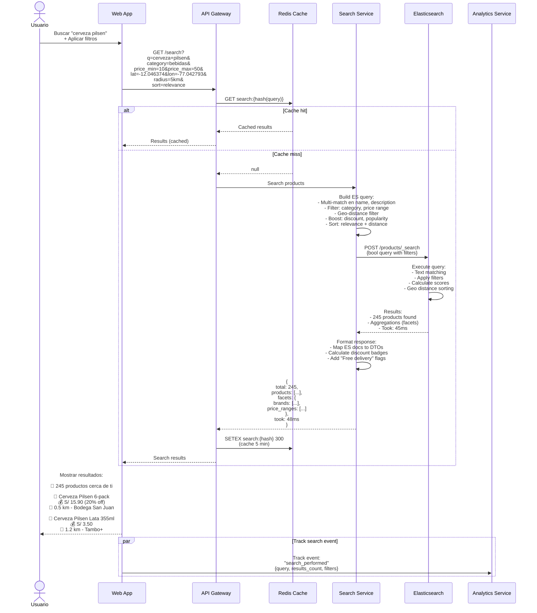
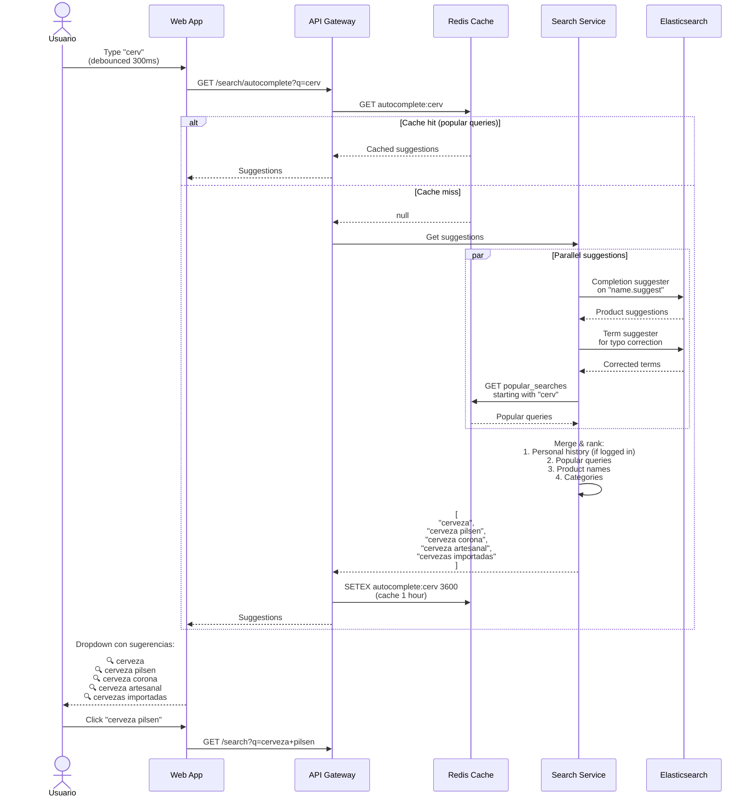
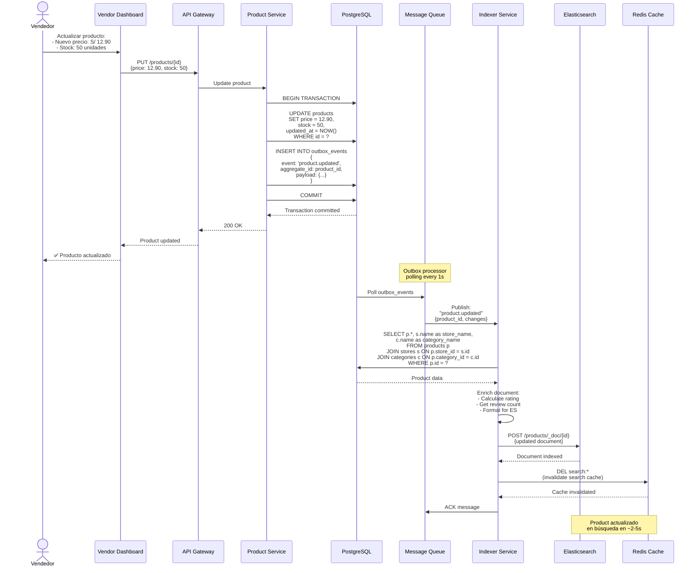
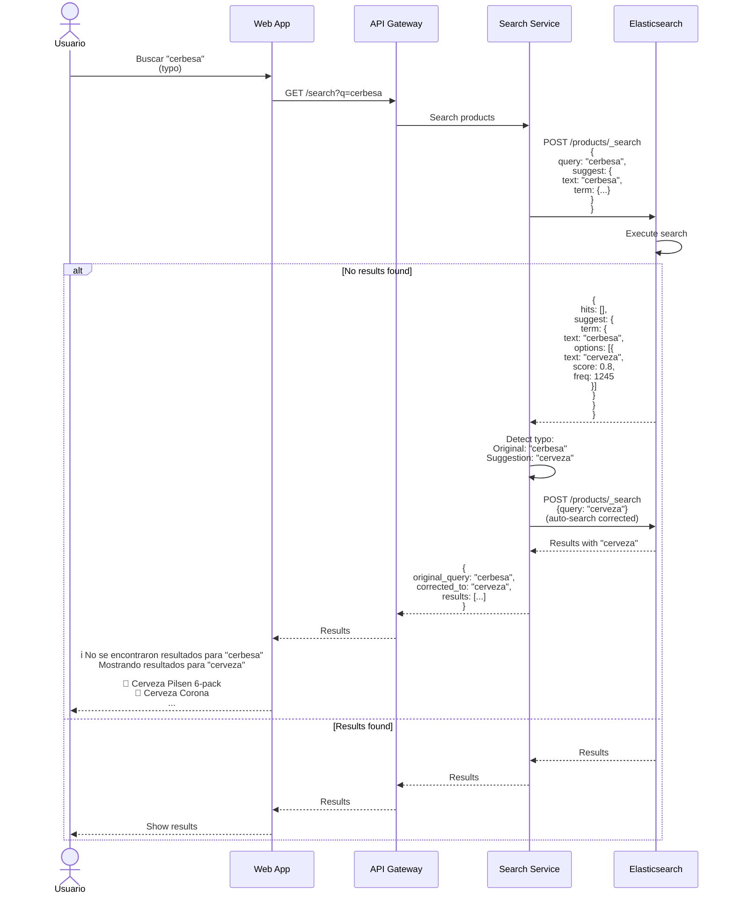
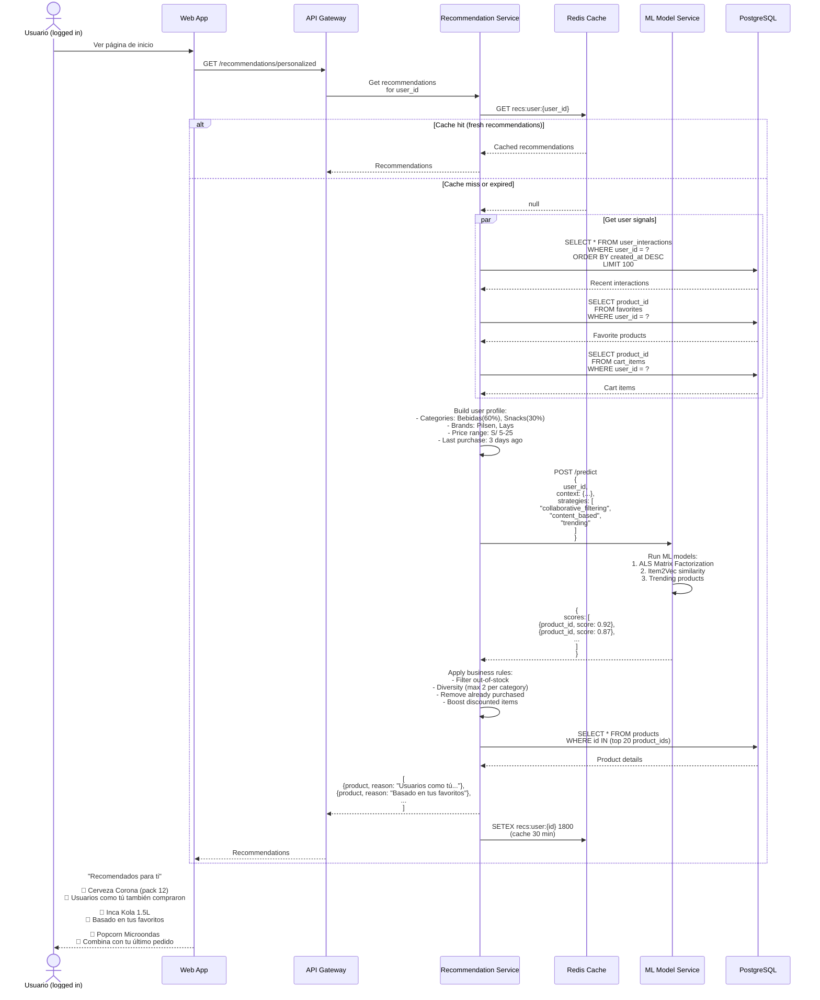
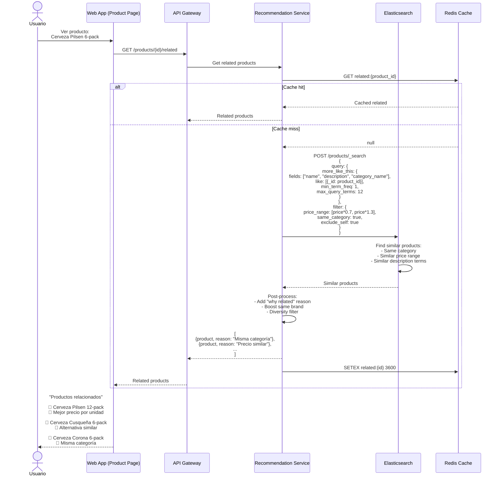
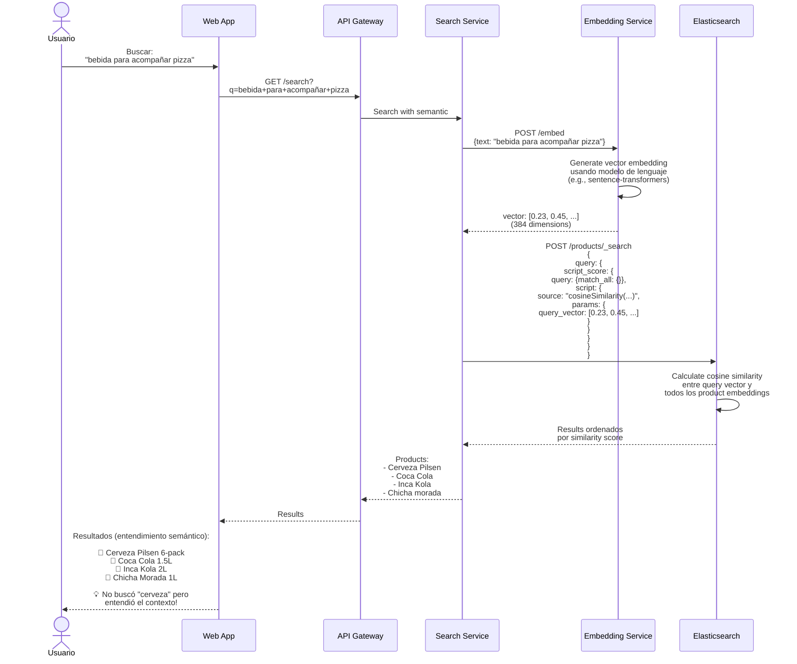

# Diagramas de Secuencia - Búsqueda y Recomendaciones - Sistema Tiendi

Sistema de búsqueda avanzada, autocomplete y recomendaciones personalizadas.

---

## 1. Búsqueda con Filtros y Geolocalización

---

## 2. Autocompletado en Tiempo Real

---

## 3. Reindexación de Producto (Sync)

---

## 4. Búsqueda con "¿Quisiste decir?"

---

## 5. Productos Recomendados (Personalizados)

---

## 6. "Productos Relacionados" (Content-Based)

---

## 7. Búsqueda Semántica (con Embeddings)

---

**Fecha de creación:** 2025-01-24
**Versión:** 1.0
