# Diagramas de Secuencia - Búsqueda y Recomendaciones - Sistema Tiendi

Sistema de búsqueda avanzada, autocomplete y recomendaciones personalizadas.

---

## 1. Búsqueda con Filtros y Geolocalización

```mermaid
sequenceDiagram
    actor User as Usuario
    participant Web as Web App
    participant Gateway as API Gateway
    participant Cache as Redis Cache
    participant Search as Search Service
    participant ES as Elasticsearch
    participant Analytics as Analytics Service

    User->>Web: Buscar "cerveza pilsen"<br/>+ Aplicar filtros

    Web->>Gateway: GET /search?<br/>q=cerveza+pilsen&<br/>category=bebidas&<br/>price_min=10&price_max=50&<br/>lat=-12.046374&lon=-77.042793&<br/>radius=5km&<br/>sort=relevance

    Gateway->>Cache: GET search:{hash(query)}

    alt Cache hit
        Cache-->>Gateway: Cached results
        Gateway-->>Web: Results (cached)
    else Cache miss
        Cache-->>Gateway: null

        Gateway->>Search: Search products

        Search->>Search: Build ES query:<br/>- Multi-match en name, description<br/>- Filter: category, price range<br/>- Geo-distance filter<br/>- Boost: discount, popularity<br/>- Sort: relevance + distance

        Search->>ES: POST /products/_search<br/>{bool query with filters}

        ES->>ES: Execute query:<br/>- Text matching<br/>- Apply filters<br/>- Calculate scores<br/>- Geo distance sorting

        ES-->>Search: Results:<br/>- 245 products found<br/>- Aggregations (facets)<br/>- Took: 45ms

        Search->>Search: Format response:<br/>- Map ES docs to DTOs<br/>- Calculate discount badges<br/>- Add "Free delivery" flags

        Search-->>Gateway: {<br/>  total: 245,<br/>  products: [...],<br/>  facets: {<br/>    brands: [...],<br/>    price_ranges: [...]<br/>  },<br/>  took: 48ms<br/>}

        Gateway->>Cache: SETEX search:{hash} 300<br/>(cache 5 min)

        Gateway-->>Web: Search results
    end

    Web-->>User: Mostrar resultados:<br/><br/>📍 245 productos cerca de ti<br/><br/>🍺 Cerveza Pilsen 6-pack<br/>💰 S/ 15.90 (20% off)<br/>📍 0.5 km - Bodega San Juan<br/><br/>🍺 Cerveza Pilsen Lata 355ml<br/>💰 S/ 3.50<br/>📍 1.2 km - Tambo+

    par Track search event
        Web->>Analytics: Track event:<br/>"search_performed"<br/>{query, results_count, filters}
    end
```

---

## 2. Autocompletado en Tiempo Real

```mermaid
sequenceDiagram
    actor User as Usuario
    participant Web as Web App
    participant Gateway as API Gateway
    participant Cache as Redis Cache
    participant Search as Search Service
    participant ES as Elasticsearch

    User->>Web: Type "cerv"<br/>(debounced 300ms)

    Web->>Gateway: GET /search/autocomplete?q=cerv

    Gateway->>Cache: GET autocomplete:cerv

    alt Cache hit (popular queries)
        Cache-->>Gateway: Cached suggestions
        Gateway-->>Web: Suggestions
    else Cache miss
        Cache-->>Gateway: null

        Gateway->>Search: Get suggestions

        par Parallel suggestions
            Search->>ES: Completion suggester<br/>on "name.suggest"
            ES-->>Search: Product suggestions

            Search->>ES: Term suggester<br/>for typo correction
            ES-->>Search: Corrected terms

            Search->>Cache: GET popular_searches<br/>starting with "cerv"
            Cache-->>Search: Popular queries
        end

        Search->>Search: Merge & rank:<br/>1. Personal history (if logged in)<br/>2. Popular queries<br/>3. Product names<br/>4. Categories

        Search-->>Gateway: [<br/>  "cerveza",<br/>  "cerveza pilsen",<br/>  "cerveza corona",<br/>  "cerveza artesanal",<br/>  "cervezas importadas"<br/>]

        Gateway->>Cache: SETEX autocomplete:cerv 3600<br/>(cache 1 hour)

        Gateway-->>Web: Suggestions
    end

    Web-->>User: Dropdown con sugerencias:<br/><br/>🔍 cerveza<br/>🔍 cerveza pilsen<br/>🔍 cerveza corona<br/>🔍 cerveza artesanal<br/>🔍 cervezas importadas

    User->>Web: Click "cerveza pilsen"

    Web->>Gateway: GET /search?q=cerveza+pilsen
```

---

## 3. Reindexación de Producto (Sync)

```mermaid
sequenceDiagram
    actor Vendor as Vendedor
    participant Dashboard as Vendor Dashboard
    participant Gateway as API Gateway
    participant Product as Product Service
    participant DB as PostgreSQL
    participant Queue as Message Queue
    participant Indexer as Indexer Service
    participant ES as Elasticsearch
    participant Cache as Redis Cache

    Vendor->>Dashboard: Actualizar producto:<br/>- Nuevo precio: S/ 12.90<br/>- Stock: 50 unidades

    Dashboard->>Gateway: PUT /products/{id}<br/>{price: 12.90, stock: 50}

    Gateway->>Product: Update product

    Product->>DB: BEGIN TRANSACTION

    Product->>DB: UPDATE products<br/>SET price = 12.90,<br/>    stock = 50,<br/>    updated_at = NOW()<br/>WHERE id = ?

    Product->>DB: INSERT INTO outbox_events<br/>{<br/>  event: 'product.updated',<br/>  aggregate_id: product_id,<br/>  payload: {...}<br/>}

    Product->>DB: COMMIT

    DB-->>Product: Transaction committed

    Product-->>Gateway: 200 OK

    Gateway-->>Dashboard: Product updated

    Dashboard-->>Vendor: ✅ Producto actualizado

    Note over Queue: Outbox processor<br/>polling every 1s

    DB->>Queue: Poll outbox_events

    Queue->>Indexer: Publish:<br/>"product.updated"<br/>{product_id, changes}

    Indexer->>DB: SELECT p.*, s.name as store_name,<br/>       c.name as category_name<br/>FROM products p<br/>JOIN stores s ON p.store_id = s.id<br/>JOIN categories c ON p.category_id = c.id<br/>WHERE p.id = ?

    DB-->>Indexer: Product data

    Indexer->>Indexer: Enrich document:<br/>- Calculate rating<br/>- Get review count<br/>- Format for ES

    Indexer->>ES: POST /products/_doc/{id}<br/>{updated document}

    ES-->>Indexer: Document indexed

    Indexer->>Cache: DEL search:*<br/>(invalidate search cache)

    Cache-->>Indexer: Cache invalidated

    Indexer->>Queue: ACK message

    Note over ES,Cache: Product actualizado<br/>en búsqueda en ~2-5s
```

---

## 4. Búsqueda con "¿Quisiste decir?"

```mermaid
sequenceDiagram
    actor User as Usuario
    participant Web as Web App
    participant Gateway as API Gateway
    participant Search as Search Service
    participant ES as Elasticsearch

    User->>Web: Buscar "cerbesa"<br/>(typo)

    Web->>Gateway: GET /search?q=cerbesa

    Gateway->>Search: Search products

    Search->>ES: POST /products/_search<br/>{<br/>  query: "cerbesa",<br/>  suggest: {<br/>    text: "cerbesa",<br/>    term: {...}<br/>  }<br/>}

    ES->>ES: Execute search

    alt No results found
        ES-->>Search: {<br/>  hits: [],<br/>  suggest: {<br/>    term: {<br/>      text: "cerbesa",<br/>      options: [{<br/>        text: "cerveza",<br/>        score: 0.8,<br/>        freq: 1245<br/>      }]<br/>    }<br/>  }<br/>}

        Search->>Search: Detect typo:<br/>Original: "cerbesa"<br/>Suggestion: "cerveza"

        Search->>ES: POST /products/_search<br/>{query: "cerveza"}<br/>(auto-search corrected)

        ES-->>Search: Results with "cerveza"

        Search-->>Gateway: {<br/>  original_query: "cerbesa",<br/>  corrected_to: "cerveza",<br/>  results: [...]<br/>}

        Gateway-->>Web: Results

        Web-->>User: ℹ️ No se encontraron resultados para "cerbesa"<br/>Mostrando resultados para "cerveza"<br/><br/>🍺 Cerveza Pilsen 6-pack<br/>🍺 Cerveza Corona<br/>...
    else Results found
        ES-->>Search: Results
        Search-->>Gateway: Results
        Gateway-->>Web: Results
        Web-->>User: Show results
    end
```

---

## 5. Productos Recomendados (Personalizados)

```mermaid
sequenceDiagram
    actor User as Usuario (logged in)
    participant Web as Web App
    participant Gateway as API Gateway
    participant Rec as Recommendation Service
    participant Cache as Redis Cache
    participant ML as ML Model Service
    participant DB as PostgreSQL

    User->>Web: Ver página de inicio

    Web->>Gateway: GET /recommendations/personalized

    Gateway->>Rec: Get recommendations<br/>for user_id

    Rec->>Cache: GET recs:user:{user_id}

    alt Cache hit (fresh recommendations)
        Cache-->>Rec: Cached recommendations
        Rec-->>Gateway: Recommendations
    else Cache miss or expired
        Cache-->>Rec: null

        par Get user signals
            Rec->>DB: SELECT * FROM user_interactions<br/>WHERE user_id = ?<br/>ORDER BY created_at DESC<br/>LIMIT 100
            DB-->>Rec: Recent interactions

            Rec->>DB: SELECT product_id<br/>FROM favorites<br/>WHERE user_id = ?
            DB-->>Rec: Favorite products

            Rec->>DB: SELECT product_id<br/>FROM cart_items<br/>WHERE user_id = ?
            DB-->>Rec: Cart items
        end

        Rec->>Rec: Build user profile:<br/>- Categories: Bebidas(60%), Snacks(30%)<br/>- Brands: Pilsen, Lays<br/>- Price range: S/ 5-25<br/>- Last purchase: 3 days ago

        Rec->>ML: POST /predict<br/>{<br/>  user_id,<br/>  context: {...},<br/>  strategies: [<br/>    "collaborative_filtering",<br/>    "content_based",<br/>    "trending"<br/>  ]<br/>}

        ML->>ML: Run ML models:<br/>1. ALS Matrix Factorization<br/>2. Item2Vec similarity<br/>3. Trending products

        ML-->>Rec: {<br/>  scores: [<br/>    {product_id, score: 0.92},<br/>    {product_id, score: 0.87},<br/>    ...<br/>  ]<br/>}

        Rec->>Rec: Apply business rules:<br/>- Filter out-of-stock<br/>- Diversity (max 2 per category)<br/>- Remove already purchased<br/>- Boost discounted items

        Rec->>DB: SELECT * FROM products<br/>WHERE id IN (top 20 product_ids)

        DB-->>Rec: Product details

        Rec-->>Gateway: [<br/>  {product, reason: "Usuarios como tú..."},<br/>  {product, reason: "Basado en tus favoritos"},<br/>  ...<br/>]

        Rec->>Cache: SETEX recs:user:{id} 1800<br/>(cache 30 min)

        Gateway-->>Web: Recommendations
    end

    Web-->>User: "Recomendados para ti"<br/><br/>🍺 Cerveza Corona (pack 12)<br/>💭 Usuarios como tú también compraron<br/><br/>🥤 Inca Kola 1.5L<br/>💭 Basado en tus favoritos<br/><br/>🍿 Popcorn Microondas<br/>💭 Combina con tu último pedido
```

---

## 6. "Productos Relacionados" (Content-Based)

```mermaid
sequenceDiagram
    actor User as Usuario
    participant Web as Web App (Product Page)
    participant Gateway as API Gateway
    participant Rec as Recommendation Service
    participant ES as Elasticsearch
    participant Cache as Redis Cache

    User->>Web: Ver producto:<br/>Cerveza Pilsen 6-pack

    Web->>Gateway: GET /products/{id}/related

    Gateway->>Rec: Get related products

    Rec->>Cache: GET related:{product_id}

    alt Cache hit
        Cache-->>Rec: Cached related
        Rec-->>Gateway: Related products
    else Cache miss
        Cache-->>Rec: null

        Rec->>ES: POST /products/_search<br/>{<br/>  query: {<br/>    more_like_this: {<br/>      fields: ["name", "description", "category_name"],<br/>      like: [{_id: product_id}],<br/>      min_term_freq: 1,<br/>      max_query_terms: 12<br/>    }<br/>  },<br/>  filter: {<br/>    price_range: [price*0.7, price*1.3],<br/>    same_category: true,<br/>    exclude_self: true<br/>  }<br/>}

        ES->>ES: Find similar products:<br/>- Same category<br/>- Similar price range<br/>- Similar description terms

        ES-->>Rec: Similar products

        Rec->>Rec: Post-process:<br/>- Add "why related" reason<br/>- Boost same brand<br/>- Diversity filter

        Rec-->>Gateway: [<br/>  {product, reason: "Misma categoría"},<br/>  {product, reason: "Precio similar"},<br/>  ...<br/>]

        Rec->>Cache: SETEX related:{id} 3600

        Gateway-->>Web: Related products
    end

    Web-->>User: "Productos relacionados"<br/><br/>🍺 Cerveza Pilsen 12-pack<br/>💭 Mejor precio por unidad<br/><br/>🍺 Cerveza Cusqueña 6-pack<br/>💭 Alternativa similar<br/><br/>🍺 Cerveza Corona 6-pack<br/>💭 Misma categoría
```

---

## 7. Búsqueda Semántica (con Embeddings)

```mermaid
sequenceDiagram
    actor User as Usuario
    participant Web as Web App
    participant Gateway as API Gateway
    participant Search as Search Service
    participant Embedding as Embedding Service
    participant ES as Elasticsearch

    User->>Web: Buscar:<br/>"bebida para acompañar pizza"

    Web->>Gateway: GET /search?<br/>q=bebida+para+acompañar+pizza

    Gateway->>Search: Search with semantic

    Search->>Embedding: POST /embed<br/>{text: "bebida para acompañar pizza"}

    Embedding->>Embedding: Generate vector embedding<br/>usando modelo de lenguaje<br/>(e.g., sentence-transformers)

    Embedding-->>Search: vector: [0.23, 0.45, ...]<br/>(384 dimensions)

    Search->>ES: POST /products/_search<br/>{<br/>  query: {<br/>    script_score: {<br/>      query: {match_all: {}},<br/>      script: {<br/>        source: "cosineSimilarity(...)",<br/>        params: {<br/>          query_vector: [0.23, 0.45, ...]<br/>        }<br/>      }<br/>    }<br/>  }<br/>}

    ES->>ES: Calculate cosine similarity<br/>entre query vector y<br/>todos los product embeddings

    ES-->>Search: Results ordenados<br/>por similarity score

    Search-->>Gateway: Products:<br/>- Cerveza Pilsen<br/>- Coca Cola<br/>- Inca Kola<br/>- Chicha morada

    Gateway-->>Web: Results

    Web-->>User: Resultados (entendimiento semántico):<br/><br/>🍺 Cerveza Pilsen 6-pack<br/>🥤 Coca Cola 1.5L<br/>🥤 Inca Kola 2L<br/>🥤 Chicha Morada 1L<br/><br/>💡 No buscó "cerveza" pero<br/>entendió el contexto!
```

---

**Fecha de creación:** 2025-01-24
**Versión:** 1.0
