# Diagramas de Secuencia - Sistema de Comisiones - Sistema Tiendi

Este documento describe el sistema de comisiones y monetización de la plataforma Tiendi.

---

## Modelo de Comisiones

### Estrategias de Monetización

```mermaid
graph LR
    subgraph "Opciones de Monetización"
        A[Comisión por<br/>Transacción<br/>5-15%]
        B[Suscripción<br/>Mensual<br/>Planes]
        C[Modelo<br/>Híbrido<br/>Sub + Comisión]
        D[Servicios<br/>Premium<br/>Destacados]
    end

    style A fill:#e74c3c
    style B fill:#3498db
    style C fill:#27ae60
    style D fill:#f39c12
```



### Modelo Recomendado: Híbrido

- **Plan Básico**: S/ 99/mes + 8% comisión
- **Plan Pro**: S/ 299/mes + 5% comisión
- **Plan Enterprise**: S/ 599/mes + 3% comisión

---

## 1. Cálculo Automático de Comisión al Crear Pedido


---

## 2. Confirmación de Comisión al Entregar Pedido


---

## 3. Proceso de Pago a Vendedores (Payout)

```mermaid
sequenceDiagram
    participant Cron as Cron Job<br/>(Semanal/Quincenal)
    participant Payout as Payout Service
    participant Commission as Commission Service
    participant Payment as Payment Gateway
    participant Bank as Bank Transfer
    participant DB as PostgreSQL
    participant Email as Email Service
    participant Notif as Notification Service

    Cron->>Payout: Process payouts

    Payout->>DB: SELECT stores WITH pending payouts

    DB->>DB: SELECT s.id, s.name, s.bank_account,<br/>SUM(c.amount) as store_earnings<br/>FROM stores s<br/>JOIN commissions c ON c.store_id = s.id<br/>WHERE c.status = 'confirmed'<br/>AND c.payout_status = 'pending'<br/>GROUP BY s.id<br/>HAVING SUM(c.amount) >= 500.00

    DB-->>Payout: Stores ready for payout:<br/>[{store_1, S/ 1,250}, {store_2, S/ 780}]

    loop Para cada tienda
        Payout->>DB: BEGIN TRANSACTION

        Payout->>DB: INSERT INTO payouts<br/>{<br/>  store_id: store_1,<br/>  amount: 1250.00,<br/>  status: 'processing',<br/>  method: 'bank_transfer'<br/>}
        DB-->>Payout: Payout created: payout_xyz

        Payout->>DB: UPDATE commissions<br/>SET payout_id = 'payout_xyz',<br/>payout_status = 'processing'<br/>WHERE store_id = store_1<br/>AND status = 'confirmed'<br/>AND payout_status = 'pending'
        DB-->>Payout: Commissions linked

        Payout->>DB: COMMIT

        Payout->>Payment: Initiate bank transfer
        Payment->>Bank: Transfer: S/ 1,250.00<br/>To: Store 1 bank account

        alt Transfer successful
            Bank-->>Payment: Transfer completed<br/>Transaction ID: TXN-789

            Payment-->>Payout: Success

            Payout->>DB: UPDATE payouts<br/>SET status = 'completed',<br/>completed_at = NOW(),<br/>transaction_id = 'TXN-789'<br/>WHERE id = 'payout_xyz'
            DB-->>Payout: Updated

            Payout->>DB: UPDATE commissions<br/>SET payout_status = 'paid'<br/>WHERE payout_id = 'payout_xyz'
            DB-->>Payout: Updated

            Payout->>Email: Send payout confirmation
            Email-->>Payout: Email sent

            Payout->>Notif: Send notification
            Notif-->>Payout: Notification sent

            Note over Payout: Payout exitoso ✓
        else Transfer failed
            Bank-->>Payment: Transfer failed<br/>Reason: Invalid account

            Payment-->>Payout: Failed

            Payout->>DB: UPDATE payouts<br/>SET status = 'failed',<br/>failed_at = NOW(),<br/>failure_reason = ?<br/>WHERE id = 'payout_xyz'
            DB-->>Payout: Updated

            Payout->>DB: UPDATE commissions<br/>SET payout_status = 'pending'<br/>WHERE payout_id = 'payout_xyz'
            DB-->>Payout: Rolled back

            Payout->>Email: Send failure notification
            Email-->>Payout: Email sent

            Note over Payout: Reintento en próximo ciclo
        end
    end

    Payout-->>Cron: Payout process completed
```



---

## 4. Dashboard Financiero del Vendedor

```mermaid
sequenceDiagram
    actor Vendor as Vendedor
    participant Web as Vendor Dashboard
    participant Gateway as API Gateway
    participant Finance as Finance Service
    participant DB as PostgreSQL

    Vendor->>Web: Ver dashboard financiero

    Web->>Gateway: GET /vendor/finances?period=month

    Gateway->>Finance: Get financial summary

    par Consultas paralelas
        Finance->>DB: Total ventas del período
        and
        Finance->>DB: Total comisiones pagadas
        and
        Finance->>DB: Balance pendiente
        and
        Finance->>DB: Próximo payout
        and
        Finance->>DB: Historial de payouts
    end

    DB-->>Finance: Datos financieros

    Finance->>Finance: Calcular métricas:<br/>- Ventas brutas: S/ 10,000<br/>- Comisiones: S/ 500 (5%)<br/>- Ingresos netos: S/ 9,500<br/>- Pendiente: S/ 450<br/>- Próximo payout: ~S/ 50 más

    Finance-->>Gateway: Financial summary

    Gateway-->>Web: Dashboard data

    Web-->>Vendor: Mostrar dashboard:<br/>📊 Ventas: S/ 10,000<br/>💰 Ingresos: S/ 9,500<br/>📈 Comisión: S/ 500 (5%)<br/>⏳ Pendiente: S/ 450<br/>🏦 Próximo payout: Viernes

    Vendor->>Web: Ver detalle de comisiones

    Web->>Gateway: GET /vendor/commissions?page=1

    Gateway->>Finance: Get commissions detail

    Finance->>DB: SELECT c.*, o.order_number,<br/>o.total, o.created_at<br/>FROM commissions c<br/>JOIN orders o ON c.order_id = o.id<br/>WHERE c.store_id = ?<br/>ORDER BY c.created_at DESC<br/>LIMIT 50

    DB-->>Finance: Commission list

    Finance-->>Gateway: Commissions

    Gateway-->>Web: Data

    Web-->>Vendor: Tabla de comisiones:<br/>| Pedido | Venta | Comisión | Estado |
```



---

## 5. Facturación de Suscripción Mensual


---

## 6. Cambio de Plan de Suscripción

```mermaid
sequenceDiagram
    actor Vendor as Vendedor
    participant Web as Vendor Dashboard
    participant Gateway as API Gateway
    participant Subscription as Subscription Service
    participant Billing as Billing Service
    participant DB as PostgreSQL

    Vendor->>Web: Cambiar plan<br/>De: Básico → Pro

    Web->>Gateway: PUT /vendor/subscription/upgrade<br/>{new_plan: 'pro'}

    Gateway->>Subscription: Upgrade subscription

    Subscription->>DB: BEGIN TRANSACTION

    Subscription->>DB: SELECT * FROM subscriptions<br/>WHERE store_id = ?
    DB-->>Subscription: current_plan: 'basico'<br/>next_billing_date: 2025-12-15

    Subscription->>DB: SELECT price FROM plans<br/>WHERE id IN ('basico', 'pro')
    DB-->>Subscription: basico: S/ 99<br/>pro: S/ 299

    Subscription->>Billing: Calculate proration

    Billing->>Billing: Días restantes: 15<br/>Días del mes: 30<br/>Plan actual: S/ 99<br/>Nuevo plan: S/ 299<br/><br/>Crédito por devolver:<br/>(99 / 30) × 15 = S/ 49.50<br/><br/>Cargo por nuevo plan:<br/>(299 / 30) × 15 = S/ 149.50<br/><br/>Cargo adicional:<br/>149.50 - 49.50 = S/ 100.00

    Billing-->>Subscription: Prorated charge: S/ 100.00

    Subscription->>DB: INSERT INTO invoices<br/>{<br/>  store_id,<br/>  amount: 100.00,<br/>  type: 'upgrade_proration',<br/>  description: 'Upgrade Básico → Pro'<br/>}
    DB-->>Subscription: Invoice created

    Subscription->>Billing: Charge payment
    Billing-->>Subscription: Payment successful

    Subscription->>DB: UPDATE subscriptions<br/>SET plan_id = 'pro',<br/>commission_rate = 5%<br/>WHERE store_id = ?

    Subscription->>DB: COMMIT

    Subscription-->>Gateway: Subscription upgraded

    Gateway-->>Web: Success

    Web-->>Vendor: Plan actualizado<br/>Nuevo plan: Pro<br/>Nueva comisión: 5%<br/>Cargo prorrateado: S/ 100.00
```



---

## Tablas de Base de Datos

### Tabla: subscription_plans

```sql
CREATE TABLE subscription_plans (
  id VARCHAR(50) PRIMARY KEY, -- 'basic', 'pro', 'enterprise'
  name VARCHAR(100) NOT NULL,
  price DECIMAL(10,2) NOT NULL,
  commission_rate DECIMAL(5,2) NOT NULL, -- 8.00, 5.00, 3.00
  features JSONB, -- Lista de features incluidas
  max_products INTEGER, -- Límite de productos
  max_orders_per_month INTEGER,
  priority_support BOOLEAN DEFAULT FALSE,
  created_at TIMESTAMP DEFAULT NOW()
);

INSERT INTO subscription_plans VALUES
('basic', 'Plan Básico', 99.00, 8.00, '{"products": 100, "support": "email"}', 100, 1000, FALSE),
('pro', 'Plan Pro', 299.00, 5.00, '{"products": 500, "support": "priority"}', 500, 5000, TRUE),
('enterprise', 'Plan Enterprise', 599.00, 3.00, '{"products": "unlimited", "support": "dedicated"}', NULL, NULL, TRUE);
```

### Tabla: subscriptions

```sql
CREATE TABLE subscriptions (
  id UUID PRIMARY KEY DEFAULT uuid_generate_v4(),
  store_id UUID NOT NULL UNIQUE REFERENCES stores(id),
  plan_id VARCHAR(50) NOT NULL REFERENCES subscription_plans(id),
  status VARCHAR(20) DEFAULT 'active', -- 'active', 'suspended', 'canceled'
  started_at TIMESTAMP DEFAULT NOW(),
  last_billing_date TIMESTAMP,
  next_billing_date TIMESTAMP NOT NULL,
  failed_payments INTEGER DEFAULT 0,
  canceled_at TIMESTAMP,
  created_at TIMESTAMP DEFAULT NOW()
);

CREATE INDEX idx_subscriptions_next_billing ON subscriptions(next_billing_date)
WHERE status = 'active';
```

### Tabla: commissions

```sql
CREATE TABLE commissions (
  id UUID PRIMARY KEY DEFAULT uuid_generate_v4(),
  order_id UUID NOT NULL REFERENCES orders(id),
  store_id UUID NOT NULL REFERENCES stores(id),
  amount DECIMAL(10,2) NOT NULL, -- Monto de comisión
  rate DECIMAL(5,2) NOT NULL, -- Porcentaje aplicado
  status VARCHAR(20) DEFAULT 'pending', -- 'pending', 'confirmed', 'canceled'
  payout_status VARCHAR(20) DEFAULT 'pending', -- 'pending', 'processing', 'paid'
  payout_id UUID REFERENCES payouts(id),
  confirmed_at TIMESTAMP,
  created_at TIMESTAMP DEFAULT NOW(),

  CONSTRAINT check_amount_positive CHECK (amount >= 0),
  CONSTRAINT check_rate_valid CHECK (rate >= 0 AND rate <= 100)
);

CREATE INDEX idx_commissions_store ON commissions(store_id, status, payout_status);
CREATE INDEX idx_commissions_payout ON commissions(payout_id) WHERE payout_id IS NOT NULL;
```

### Tabla: payouts

```sql
CREATE TABLE payouts (
  id UUID PRIMARY KEY DEFAULT uuid_generate_v4(),
  store_id UUID NOT NULL REFERENCES stores(id),
  amount DECIMAL(10,2) NOT NULL,
  status VARCHAR(20) DEFAULT 'processing', -- 'processing', 'completed', 'failed'
  method VARCHAR(50) NOT NULL, -- 'bank_transfer', 'paypal', etc.
  transaction_id VARCHAR(255),
  failure_reason TEXT,
  processing_fee DECIMAL(10,2) DEFAULT 0,
  net_amount DECIMAL(10,2) GENERATED ALWAYS AS (amount - processing_fee) STORED,
  completed_at TIMESTAMP,
  failed_at TIMESTAMP,
  created_at TIMESTAMP DEFAULT NOW(),

  CONSTRAINT check_amount_positive CHECK (amount > 0)
);

CREATE INDEX idx_payouts_store ON payouts(store_id, created_at DESC);
CREATE INDEX idx_payouts_status ON payouts(status, created_at);
```

### Tabla: invoices

```sql
CREATE TABLE invoices (
  id UUID PRIMARY KEY DEFAULT uuid_generate_v4(),
  store_id UUID NOT NULL REFERENCES stores(id),
  invoice_number VARCHAR(50) UNIQUE NOT NULL,
  amount DECIMAL(10,2) NOT NULL,
  type VARCHAR(50) NOT NULL, -- 'subscription', 'upgrade_proration', 'additional_service'
  description TEXT,
  status VARCHAR(20) DEFAULT 'pending', -- 'pending', 'paid', 'failed', 'refunded'
  transaction_id VARCHAR(255),
  failure_reason TEXT,
  paid_at TIMESTAMP,
  due_date TIMESTAMP,
  created_at TIMESTAMP DEFAULT NOW()
);

CREATE INDEX idx_invoices_store ON invoices(store_id, created_at DESC);
CREATE INDEX idx_invoices_status ON invoices(status, due_date);
```

---

## Funciones y Triggers

### Trigger: Auto-calcular comisión

```sql
CREATE OR REPLACE FUNCTION calculate_commission()
RETURNS TRIGGER AS $$
DECLARE
  commission_rate DECIMAL(5,2);
  commission_amount DECIMAL(10,2);
BEGIN
  -- Obtener tasa de comisión del plan de la tienda
  SELECT sp.commission_rate INTO commission_rate
  FROM stores s
  JOIN subscriptions sub ON sub.store_id = s.id
  JOIN subscription_plans sp ON sp.id = sub.plan_id
  WHERE s.id = NEW.store_id;

  -- Calcular comisión
  commission_amount := NEW.total * (commission_rate / 100);

  -- Insertar registro de comisión
  INSERT INTO commissions (order_id, store_id, amount, rate, status)
  VALUES (NEW.id, NEW.store_id, commission_amount, commission_rate, 'pending');

  RETURN NEW;
END;
$$ LANGUAGE plpgsql;

CREATE TRIGGER trg_calculate_commission
AFTER INSERT ON orders
FOR EACH ROW
EXECUTE FUNCTION calculate_commission();
```

---

**Fecha de creación:** 2025-11-24
**Versión:** 1.0
**Autor:** Sistema Tiendi
