# Diagramas de Secuencia - Logística y Envíos - Sistema Tiendi

Sistema de gestión de envíos, integración con transportistas y tracking.

---

## 1. Cálculo de Costo de Envío

```mermaid
sequenceDiagram
    actor Customer as Cliente
    participant Web as Web App
    participant Gateway as API Gateway
    participant Shipping as Shipping Service
    participant Maps as Google Maps API
    participant Olva as Olva API
    participant Shalom as Shalom API
    participant Cache as Redis Cache

    Customer->>Web: Checkout<br/>Ingresar dirección de entrega

    Web->>Gateway: POST /shipping/calculate<br/>{<br/>  origin: {lat, lng},<br/>  destination: {address},<br/>  items: [{weight, dimensions}],<br/>  delivery_type: 'standard'<br/>}

    Gateway->>Shipping: Calculate shipping cost

    Shipping->>Maps: Geocode address
    Maps-->>Shipping: {lat, lng}

    Shipping->>Shipping: Calculate distance:<br/>5.2 km

    Shipping->>Cache: GET shipping_rates:{courier}

    alt Cache hit
        Cache-->>Shipping: Cached rates
    else Cache miss
        par Query all couriers
            Shipping->>Olva: POST /cotizar<br/>{origin, destination, weight}
            Olva-->>Shipping: S/ 8.50

            Shipping->>Shalom: POST /quote<br/>{origin, destination, weight}
            Shalom-->>Shipping: S/ 7.90
        end

        Shipping->>Cache: SETEX rates 3600
    end

    Shipping->>Shipping: Compare options:<br/>- Olva: S/ 8.50 (2 días)<br/>- Shalom: S/ 7.90 (3 días)<br/>- Pickup: S/ 0.00

    Shipping-->>Gateway: [<br/>  {<br/>    courier: "Olva",<br/>    cost: 8.50,<br/>    estimated_days: 2<br/>  },<br/>  {<br/>    courier: "Shalom",<br/>    cost: 7.90,<br/>    estimated_days: 3<br/>  },<br/>  {<br/>    courier: "pickup",<br/>    cost: 0,<br/>    estimated_days: 0<br/>  }<br/>]

    Gateway-->>Web: Shipping options

    Web-->>Customer: Opciones de envío:<br/><br/>📦 Olva - S/ 8.50<br/>⏱️ Entrega en 2 días<br/><br/>📦 Shalom - S/ 7.90<br/>⏱️ Entrega en 3 días<br/><br/>🏪 Recoger en tienda - Gratis<br/>⏱️ Hoy mismo
```



---

## 2. Generación de Etiqueta de Envío

```mermaid
sequenceDiagram
    actor Vendor as Vendedor
    participant Dashboard as Vendor Dashboard
    participant Gateway as API Gateway
    participant Shipping as Shipping Service
    participant Olva as Olva API
    participant Storage as Azure Blob
    participant DB as PostgreSQL
    participant Email as Email Service

    Vendor->>Dashboard: Marcar pedido como "Listo para envío"

    Dashboard->>Gateway: POST /orders/{id}/prepare-shipping

    Gateway->>Shipping: Create shipment

    Shipping->>DB: SELECT * FROM orders<br/>WHERE id = ?

    DB-->>Shipping: Order details

    Shipping->>Olva: POST /crear-guia<br/>{<br/>  remitente: {store_address},<br/>  destinatario: {customer_address},<br/>  peso: 2.5kg,<br/>  dimensiones: {alto, ancho, largo},<br/>  contenido: "Productos varios",<br/>  valor_declarado: 125.00<br/>}

    Olva->>Olva: Generar guía de remisión

    Olva-->>Shipping: {<br/>  tracking_number: "OLV123456789",<br/>  label_pdf_url: "https://...",<br/>  pickup_date: "2025-01-25"<br/>}

    Shipping->>Storage: Download label PDF

    Storage-->>Shipping: PDF downloaded

    Shipping->>Storage: Upload to our storage<br/>labels/order_123/label.pdf

    Storage-->>Shipping: URL: https://...

    Shipping->>DB: INSERT INTO shipments<br/>{<br/>  order_id,<br/>  courier: "Olva",<br/>  tracking_number: "OLV123456789",<br/>  label_url,<br/>  status: "pending_pickup"<br/>}

    DB-->>Shipping: Shipment created

    Shipping-->>Gateway: {<br/>  tracking_number,<br/>  label_url,<br/>  pickup_date<br/>}

    Gateway-->>Dashboard: Shipment created

    Dashboard-->>Vendor: ✅ Guía generada:<br/><br/>📋 Tracking: OLV123456789<br/>🏷️ Descargar etiqueta<br/>📅 Recojo: 25/01/2025

    par Send notifications
        Shipping->>Email: Send to customer<br/>"Tu pedido está en camino"<br/>Tracking: OLV123456789

        Shipping->>Email: Send to vendor<br/>"Etiqueta generada"<br/>Adjuntar PDF
    end
```



---

## 3. Tracking de Paquete en Tiempo Real

```mermaid
sequenceDiagram
    actor Customer as Cliente
    participant Web as Web App
    participant Gateway as API Gateway
    participant Tracking as Tracking Service
    participant Cache as Redis Cache
    participant Olva as Olva API
    participant DB as PostgreSQL
    participant Webhook as Webhook Handler

    Customer->>Web: Ver estado del pedido

    Web->>Gateway: GET /orders/{id}/tracking

    Gateway->>Tracking: Get tracking info

    Tracking->>Cache: GET tracking:OLV123456789

    alt Cache hit (fresh)
        Cache-->>Tracking: Cached tracking data
        Tracking-->>Gateway: Tracking info
    else Cache miss or stale
        Cache-->>Tracking: null

        Tracking->>DB: SELECT tracking_number, courier<br/>FROM shipments<br/>WHERE order_id = ?

        DB-->>Tracking: Tracking: OLV123456789

        Tracking->>Olva: GET /rastreo/{tracking_number}

        Olva-->>Tracking: {<br/>  status: "en_transito",<br/>  current_location: "Lima - Centro de distribución",<br/>  estimated_delivery: "2025-01-26",<br/>  events: [<br/>    {date: "2025-01-25 08:00", status: "recogido"},<br/>    {date: "2025-01-25 14:30", status: "en_transito"},<br/>    {date: "2025-01-25 18:00", status: "hub_lima"}<br/>  ]<br/>}

        Tracking->>Cache: SETEX tracking:OLV123456789 300<br/>(cache 5 min)

        Tracking->>DB: UPDATE shipments<br/>SET status = 'en_transito',<br/>    last_location = 'Lima - Centro'

        Tracking-->>Gateway: Tracking info
    end

    Gateway-->>Web: Tracking data

    Web-->>Customer: 📦 Estado del envío:<br/><br/>🚚 En tránsito<br/>📍 Lima - Centro de distribución<br/>📅 Entrega estimada: 26/01/2025<br/><br/>Historial:<br/>✅ 25/01 08:00 - Recogido<br/>✅ 25/01 14:30 - En tránsito<br/>✅ 25/01 18:00 - Hub Lima<br/>⏳ Próximo: En reparto

    Note over Webhook,Olva: Sistema de Webhooks

    Olva->>Webhook: POST /webhooks/olva<br/>{<br/>  tracking_number: "OLV123456789",<br/>  status: "entregado",<br/>  delivered_at: "2025-01-26 10:30",<br/>  signature: "..."<br/>}

    Webhook->>Webhook: Verify signature

    Webhook->>DB: UPDATE shipments<br/>SET status = 'delivered',<br/>    delivered_at = NOW()

    Webhook->>DB: UPDATE orders<br/>SET status = 'ENTREGADO'

    Webhook->>Customer: Push notification:<br/>"¡Tu pedido fue entregado!"
```



---

## 4. Problema con Envío (Incidencia)

```mermaid
sequenceDiagram
    actor Customer as Cliente
    participant Web as Web App
    participant Gateway as API Gateway
    participant Support as Support Service
    participant Tracking as Tracking Service
    participant Olva as Olva API
    participant DB as PostgreSQL
    participant Notif as Notification Service

    Customer->>Web: Reportar problema:<br/>"No recibí mi paquete"

    Web->>Gateway: POST /orders/{id}/report-issue<br/>{<br/>  issue_type: "not_delivered",<br/>  description: "No llegó el pedido"<br/>}

    Gateway->>Support: Create support ticket

    Support->>DB: INSERT INTO support_tickets<br/>{<br/>  order_id,<br/>  type: "shipping_issue",<br/>  description,<br/>  status: "open"<br/>}

    DB-->>Support: Ticket #5678 created

    Support->>Tracking: Get shipment info

    Tracking->>Olva: GET /rastreo/{tracking_number}

    Olva-->>Tracking: {<br/>  status: "entregado",<br/>  delivered_to: "Recepción",<br/>  signature_url: "https://..."<br/>}

    Tracking-->>Support: Delivery confirmed by courier

    Support->>Notif: Notify support team

    Notif-->>Support: Team notified

    Support->>Support: Auto-assign to agent

    Support-->>Gateway: Ticket created

    Gateway-->>Web: Ticket #5678

    Web-->>Customer: ✅ Incidencia reportada<br/><br/>🎫 Ticket: #5678<br/>📞 Te contactaremos en 24h<br/><br/>Estado del courier:<br/>El paquete fue entregado en<br/>recepción el 26/01 a las 10:30

    Note over Support: Agente revisa caso

    Support->>Customer: Llamada/Chat:<br/>"¿Revisaste en recepción?"

    alt Problema resuelto
        Customer->>Support: "Sí, lo encontré"
        Support->>DB: UPDATE tickets<br/>SET status = 'resolved'
    else Realmente no llegó
        Support->>Olva: POST /reclamaciones<br/>{tracking_number, motivo}
        Olva-->>Support: Claim #CLM-789

        Support->>Support: Decidir compensación:<br/>- Reenvío<br/>- Reembolso
    end
```



---

## 5. Cambio de Dirección de Envío

```mermaid
sequenceDiagram
    actor Customer as Cliente
    participant Web as Web App
    participant Gateway as API Gateway
    participant Order as Order Service
    participant Shipping as Shipping Service
    participant Olva as Olva API
    participant DB as PostgreSQL

    Customer->>Web: Solicitar cambio de dirección

    Web->>Gateway: PUT /orders/{id}/change-address<br/>{<br/>  new_address: "Nueva dirección...",<br/>  reason: "Me mudé"<br/>}

    Gateway->>Order: Change delivery address

    Order->>DB: SELECT status FROM shipments<br/>WHERE order_id = ?

    DB-->>Order: Status: "pending_pickup"

    alt Aún no fue recogido
        Order->>Shipping: Update address

        Shipping->>Olva: PUT /actualizar-guia/{tracking}<br/>{<br/>  nuevo_destinatario: {...}<br/>}

        Olva-->>Shipping: ✅ Dirección actualizada

        Shipping->>DB: UPDATE orders<br/>SET delivery_address = ?

        Shipping->>DB: UPDATE shipments<br/>SET updated_address = true

        Shipping-->>Order: Address updated

        Order-->>Gateway: 200 OK

        Gateway-->>Web: Success

        Web-->>Customer: ✅ Dirección actualizada<br/><br/>Nueva dirección:<br/>Nueva dirección...
    else Ya fue recogido
        Order-->>Gateway: 400 Bad Request<br/>"No se puede cambiar,<br/>el paquete ya está en tránsito"

        Gateway-->>Web: Error

        Web-->>Customer: ❌ No se puede cambiar<br/><br/>El paquete ya fue recogido<br/>y está en tránsito.<br/><br/>Contacta a soporte para<br/>opciones alternativas.
    end
```



---

## Tablas de Base de Datos

```sql
-- Tabla de envíos
CREATE TABLE shipments (
  id UUID PRIMARY KEY DEFAULT uuid_generate_v4(),
  order_id UUID NOT NULL UNIQUE REFERENCES orders(id),

  -- Courier info
  courier VARCHAR(50) NOT NULL, -- 'olva', 'shalom', 'urbano', 'pickup'
  tracking_number VARCHAR(100) UNIQUE,

  -- Addresses
  origin_address JSONB NOT NULL,
  destination_address JSONB NOT NULL,

  -- Package info
  weight_kg DECIMAL(6,2),
  dimensions JSONB, -- {height, width, length}
  declared_value DECIMAL(10,2),

  -- Cost
  shipping_cost DECIMAL(8,2) NOT NULL,

  -- Status
  status VARCHAR(30) DEFAULT 'pending_pickup',
  -- 'pending_pickup', 'picked_up', 'in_transit', 'out_for_delivery',
  -- 'delivered', 'failed', 'returned'

  -- Tracking
  current_location VARCHAR(255),
  estimated_delivery_date DATE,
  delivered_at TIMESTAMP,

  -- Documents
  label_url TEXT,
  signature_url TEXT,

  -- Dates
  pickup_scheduled_date DATE,
  picked_up_at TIMESTAMP,

  created_at TIMESTAMP DEFAULT NOW(),
  updated_at TIMESTAMP DEFAULT NOW()
);

CREATE INDEX idx_shipments_order ON shipments(order_id);
CREATE INDEX idx_shipments_tracking ON shipments(tracking_number);
CREATE INDEX idx_shipments_status ON shipments(status, created_at DESC);

-- Tabla de eventos de tracking
CREATE TABLE tracking_events (
  id UUID PRIMARY KEY DEFAULT uuid_generate_v4(),
  shipment_id UUID NOT NULL REFERENCES shipments(id),

  status VARCHAR(50) NOT NULL,
  location VARCHAR(255),
  description TEXT,

  event_date TIMESTAMP NOT NULL,
  created_at TIMESTAMP DEFAULT NOW()
);

CREATE INDEX idx_tracking_events_shipment ON tracking_events(shipment_id, event_date DESC);

-- Tabla de tarifas de courier
CREATE TABLE courier_rates (
  id UUID PRIMARY KEY DEFAULT uuid_generate_v4(),
  courier VARCHAR(50) NOT NULL,

  -- Zone-based pricing
  origin_zone VARCHAR(50),
  destination_zone VARCHAR(50),

  -- Weight-based pricing
  weight_from_kg DECIMAL(6,2) NOT NULL,
  weight_to_kg DECIMAL(6,2) NOT NULL,

  -- Pricing
  base_cost DECIMAL(8,2) NOT NULL,
  cost_per_kg DECIMAL(8,2),

  -- Service level
  service_type VARCHAR(30) NOT NULL, -- 'standard', 'express', 'next_day'
  estimated_days INTEGER,

  is_active BOOLEAN DEFAULT TRUE,

  effective_from DATE NOT NULL,
  effective_until DATE,

  created_at TIMESTAMP DEFAULT NOW()
);

CREATE INDEX idx_courier_rates_lookup ON courier_rates(
  courier, origin_zone, destination_zone, service_type
) WHERE is_active = TRUE;

-- Tabla de incidencias de envío
CREATE TABLE shipping_incidents (
  id UUID PRIMARY KEY DEFAULT uuid_generate_v4(),
  shipment_id UUID NOT NULL REFERENCES shipments(id),

  incident_type VARCHAR(50) NOT NULL,
  -- 'lost', 'damaged', 'delayed', 'wrong_address', 'refused'

  description TEXT,
  reported_by_user_id UUID REFERENCES users(id),

  status VARCHAR(30) DEFAULT 'reported',
  -- 'reported', 'investigating', 'resolved', 'compensated'

  resolution TEXT,
  compensation_amount DECIMAL(8,2),

  reported_at TIMESTAMP DEFAULT NOW(),
  resolved_at TIMESTAMP
);

CREATE INDEX idx_incidents_shipment ON shipping_incidents(shipment_id);
CREATE INDEX idx_incidents_status ON shipping_incidents(status, reported_at DESC);
```

---

## Configuración de Couriers

```typescript
// Configuración de APIs de couriers
const COURIER_CONFIG = {
  olva: {
    apiUrl: 'https://api.olva.pe',
    apiKey: process.env.OLVA_API_KEY,
    accountNumber: '123456',
    pickupAddress: {
      address: 'Av. Principal 123',
      district: 'Miraflores',
      city: 'Lima',
      zipCode: '15074'
    }
  },
  shalom: {
    apiUrl: 'https://api.shalom.com.pe',
    apiKey: process.env.SHALOM_API_KEY,
    clientCode: 'TIENDI001'
  },
  urbano: {
    apiUrl: 'https://api.urbano.com.pe',
    apiKey: process.env.URBANO_API_KEY
  }
};

// Zonas de cobertura
const COVERAGE_ZONES = {
  lima_metropolitana: ['Lima', 'Callao', 'Miraflores', 'San Isidro', ...],
  lima_norte: ['Los Olivos', 'Independencia', 'Comas', ...],
  lima_sur: ['Villa El Salvador', 'Chorrillos', 'Lurín', ...],
  provincias: ['Arequipa', 'Cusco', 'Trujillo', ...]
};
```

---

## Integración con Olva Courier

```typescript
class OlvaService {
  async createShipment(order: Order): Promise<Shipment> {
    const payload = {
      remitente: {
        nombre: order.store.name,
        direccion: order.store.address,
        telefono: order.store.phone,
        distrito: order.store.district,
        provincia: order.store.city,
        departamento: order.store.region
      },
      destinatario: {
        nombre: `${order.user.firstName} ${order.user.lastName}`,
        direccion: order.deliveryAddress,
        telefono: order.user.phone,
        documento: order.user.documentNumber,
        distrito: order.deliveryDistrict,
        provincia: order.deliveryCity,
        departamento: order.deliveryRegion
      },
      paquete: {
        peso: this.calculateWeight(order.items),
        alto: 30,
        ancho: 25,
        largo: 20,
        contenido: 'Productos varios',
        valorDeclarado: order.total
      },
      tipoServicio: 'REGULAR', // o 'EXPRESS'
      pagoContraentrega: order.paymentMethod === 'cash',
      montoContraentrega: order.paymentMethod === 'cash' ? order.total : 0
    };

    const response = await axios.post(
      `${COURIER_CONFIG.olva.apiUrl}/v1/guias`,
      payload,
      {
        headers: {
          'Authorization': `Bearer ${COURIER_CONFIG.olva.apiKey}`,
          'Content-Type': 'application/json'
        }
      }
    );

    return {
      trackingNumber: response.data.numeroGuia,
      labelUrl: response.data.urlEtiqueta,
      pickupDate: response.data.fechaRecojo,
      estimatedDelivery: response.data.fechaEntregaEstimada
    };
  }

  async trackShipment(trackingNumber: string): Promise<TrackingInfo> {
    const response = await axios.get(
      `${COURIER_CONFIG.olva.apiUrl}/v1/rastreo/${trackingNumber}`,
      {
        headers: {
          'Authorization': `Bearer ${COURIER_CONFIG.olva.apiKey}`
        }
      }
    );

    return {
      status: this.mapStatus(response.data.estado),
      currentLocation: response.data.ubicacionActual,
      estimatedDelivery: response.data.fechaEntregaEstimada,
      events: response.data.eventos.map(e => ({
        date: e.fecha,
        status: this.mapStatus(e.estado),
        location: e.ubicacion,
        description: e.descripcion
      }))
    };
  }

  private mapStatus(olvaStatus: string): ShipmentStatus {
    const statusMap = {
      'REGISTRADO': 'pending_pickup',
      'RECOGIDO': 'picked_up',
      'EN_TRANSITO': 'in_transit',
      'EN_REPARTO': 'out_for_delivery',
      'ENTREGADO': 'delivered',
      'DEVUELTO': 'returned'
    };
    return statusMap[olvaStatus] || 'unknown';
  }
}
```

---

## Webhook Handler de Couriers

```typescript
// Endpoint para recibir webhooks de Olva
app.post('/webhooks/olva', async (req, res) => {
  try {
    // 1. Verificar firma
    const signature = req.headers['x-olva-signature'];
    const isValid = verifyOlvaSignature(req.body, signature);

    if (!isValid) {
      return res.status(401).json({ error: 'Invalid signature' });
    }

    // 2. Procesar evento
    const { numeroGuia, estado, fechaEvento, ubicacion } = req.body;

    // 3. Actualizar en base de datos
    await db.query(`
      UPDATE shipments
      SET status = $1,
          current_location = $2,
          updated_at = NOW()
      WHERE tracking_number = $3
    `, [mapStatus(estado), ubicacion, numeroGuia]);

    // 4. Insertar evento de tracking
    await db.query(`
      INSERT INTO tracking_events (shipment_id, status, location, event_date)
      SELECT id, $1, $2, $3
      FROM shipments
      WHERE tracking_number = $4
    `, [estado, ubicacion, fechaEvento, numeroGuia]);

    // 5. Notificar al cliente si es un evento importante
    if (['EN_REPARTO', 'ENTREGADO'].includes(estado)) {
      await notificationService.send({
        userId: shipment.order.userId,
        type: 'shipping_update',
        title: getNotificationTitle(estado),
        body: `Tu pedido está ${getStatusText(estado)}`
      });
    }

    // 6. Si fue entregado, actualizar pedido
    if (estado === 'ENTREGADO') {
      await db.query(`
        UPDATE orders
        SET status = 'ENTREGADO',
            delivered_at = NOW()
        WHERE id = (
          SELECT order_id FROM shipments WHERE tracking_number = $1
        )
      `, [numeroGuia]);
    }

    res.json({ success: true });
  } catch (error) {
    console.error('Webhook error:', error);
    res.status(500).json({ error: 'Internal error' });
  }
});
```

---

**Fecha de creación:** 2025-01-24
**Versión:** 1.0
