# Diagramas de Secuencia - Libro de Reclamaciones Digital

Este archivo contiene los diagramas de secuencia para el **Libro de Reclamaciones Digital**, un requerimiento legal obligatorio en Perú según el Código de Protección y Defensa del Consumidor (Ley N° 29571).

---

## 1. Registro de Reclamo por Cliente

```mermaid
sequenceDiagram
    participant C as Cliente
    participant F as Frontend
    participant A as API Gateway
    participant CS as Complaint Service
    participant DB as PostgreSQL
    participant S3 as AWS S3
    participant Queue as RabbitMQ
    participant NS as Notification Service
    participant ES as Email Service

    C->>F: Accede a "Libro de Reclamaciones"
    F-->>C: Muestra formulario según Ley 29571

    Note over F,C: Formulario debe incluir:<br/>- Datos del consumidor<br/>- Tipo (Reclamo/Queja)<br/>- Detalle del reclamo<br/>- Pedido específico (si aplica)<br/>- Adjuntos (opcional)

    C->>F: Completa formulario
    Note over C: Tipo de documento: DNI/CE/RUC<br/>Número de documento<br/>Nombres completos<br/>Email, Teléfono<br/>Dirección<br/>Descripción del problema

    C->>F: Adjunta evidencias (opcional)<br/>(fotos, PDFs, max 5 archivos)

    F->>F: Valida formulario según normativa
    Note over F: Validaciones obligatorias:<br/>✓ Todos los campos requeridos<br/>✓ Email válido<br/>✓ Teléfono válido (9 dígitos)<br/>✓ Descripción mínimo 20 caracteres

    F->>A: POST /api/complaints<br/>{ formData + files }

    A->>CS: createComplaint(data)

    CS->>DB: BEGIN TRANSACTION

    alt Reclamo asociado a pedido
        CS->>DB: SELECT * FROM orders WHERE id = ?<br/>AND user_id = ?

        alt Pedido existe y pertenece al usuario
            DB-->>CS: Order data
        else Pedido no encontrado
            CS-->>A: Error 404
            A-->>F: "Pedido no encontrado"
            F-->>C: Mensaje de error
        end
    end

    CS->>DB: INSERT INTO complaints<br/>(type, customer_data, details, order_id)
    DB-->>CS: { complaintId, complaint_number }

    Note over CS: Número único: HRD-2025-000001<br/>Formato: HRD-{year}-{sequential}

    alt Cliente subió archivos
        loop Por cada archivo
            CS->>S3: uploadFile(file, complaintId)
            S3-->>CS: { fileUrl, fileName }

            CS->>DB: INSERT INTO complaint_attachments<br/>(complaint_id, file_url, file_name)
        end
    end

    CS->>DB: UPDATE complaints<br/>SET status = 'pending_review'

    CS->>DB: INSERT INTO complaint_timeline<br/>(complaint_id, action: 'created')

    CS->>DB: COMMIT TRANSACTION

    CS->>Queue: Publish 'complaint.created'<br/>{ complaintId, customerId, storeId }

    CS-->>A: {
        complaintNumber: 'HRD-2025-000001',
        status: 'pending_review',
        legalDeadline: '2025-02-24' // 30 días hábiles
    }

    A-->>F: Reclamo registrado

    F-->>C: Pantalla de confirmación:<br/>━━━━━━━━━━━━━━━<br/>✅ Reclamo registrado<br/><br/>N° HRD-2025-000001<br/><br/>Plazo de respuesta:<br/>30 días hábiles<br/><br/>Recibirás copia vía email<br/>━━━━━━━━━━━━━━━

    Queue->>NS: Consume 'complaint.created'

    par Notificaciones paralelas
        NS->>ES: Enviar email al cliente
        Note over ES: Template: Copia del reclamo<br/>+ PDF con datos completos<br/>+ Número de reclamo<br/>+ Plazo legal de respuesta
    and
        NS->>ES: Notificar a la tienda
        Note over ES: Email al vendedor:<br/>"Nuevo reclamo registrado"<br/>+ Link al dashboard
    and
        NS->>ES: Notificar a Super Admin (Tiendi)
        Note over ES: Email de alerta:<br/>"Reclamo registrado en el sistema"<br/>+ Requiere seguimiento legal
    end
```

---

## 2. Tienda Responde a Reclamo

```mermaid
sequenceDiagram
    participant V as Vendedor
    participant F as Frontend (Dashboard)
    participant A as API Gateway
    participant CS as Complaint Service
    participant DB as PostgreSQL
    participant Queue as RabbitMQ
    participant NS as Notification Service

    V->>F: Accede a "Reclamos"
    F->>A: GET /api/complaints/store
    A->>CS: getStoreComplaints(storeId)

    CS->>DB: SELECT c.*, u.name, u.email<br/>FROM complaints c<br/>LEFT JOIN orders o ON c.order_id = o.id<br/>WHERE o.store_id = ?<br/>ORDER BY c.created_at DESC

    DB-->>CS: Lista de reclamos
    CS-->>A: Complaints data
    A-->>F: Lista de reclamos

    F-->>V: Muestra tabla:<br/>┌─────────┬─────────┬────────┐<br/>│ Número  │ Cliente │ Estado │<br/>├─────────┼─────────┼────────┤<br/>│ HRD-001 │ Juan P. │ 🟡 Pen │<br/>│ HRD-002 │ María L │ 🟢 Res │<br/>└─────────┴─────────┴────────┘

    V->>F: Click en reclamo HRD-001

    F->>A: GET /api/complaints/{complaintId}
    A->>CS: getComplaintDetails(complaintId, storeId)

    CS->>DB: SELECT * FROM complaints<br/>WHERE id = ? AND store_id = ?

    CS->>DB: SELECT * FROM complaint_attachments<br/>WHERE complaint_id = ?

    CS->>DB: SELECT * FROM complaint_timeline<br/>WHERE complaint_id = ?<br/>ORDER BY created_at DESC

    CS-->>A: Detalle completo del reclamo
    A-->>F: Complaint details

    F-->>V: Muestra detalle:<br/>━━━━━━━━━━━━━━━<br/>Reclamo HRD-2025-000001<br/>Tipo: Reclamo<br/>Fecha: 25/01/2025<br/><br/>Cliente: Juan Pérez<br/>DNI: 12345678<br/>Email: juan@example.com<br/>Tel: 987654321<br/><br/>Pedido: #ORD-12345<br/><br/>Detalle:<br/>"El producto llegó en mal estado..."<br/><br/>Adjuntos: 2 fotos<br/><br/>⏰ Días restantes: 28<br/>━━━━━━━━━━━━━━━

    V->>F: Escribe respuesta y propone solución
    Note over V: "Lamentamos lo ocurrido.<br/>Procederemos a:<br/>1. Reemplazo del producto<br/>2. Recojo sin costo<br/>Tiempo estimado: 3 días"

    V->>F: Click "Enviar respuesta"

    F->>A: POST /api/complaints/{id}/respond<br/>{ response, proposed_solution }

    A->>CS: respondToComplaint(complaintId, storeId, data)

    CS->>DB: SELECT status FROM complaints<br/>WHERE id = ? FOR UPDATE

    alt Reclamo aún pendiente
        CS->>DB: BEGIN TRANSACTION

        CS->>DB: UPDATE complaints<br/>SET status = 'store_responded',<br/>    store_response = ?,<br/>    responded_at = NOW()

        CS->>DB: INSERT INTO complaint_timeline<br/>(complaint_id, action: 'store_responded',<br/>details: response)

        CS->>DB: COMMIT TRANSACTION

        CS->>Queue: Publish 'complaint.store_responded'<br/>{ complaintId, storeId, customerId }

        CS-->>A: Response saved
        A-->>F: Respuesta registrada

        F-->>V: "✅ Respuesta enviada al cliente"

        Queue->>NS: Consume evento

        NS->>NS: Enviar email al cliente
        Note over NS: Notificar respuesta de la tienda<br/>+ Copia de la respuesta<br/>+ Solución propuesta<br/>+ Opción de aceptar/rechazar
    else Reclamo ya fue respondido
        CS-->>A: Error 409 Conflict
        A-->>F: "Este reclamo ya fue respondido"
        F-->>V: Mensaje de error
    end
```



---

## 3. Cliente Acepta/Rechaza Solución

```mermaid
sequenceDiagram
    participant C as Cliente
    participant F as Frontend
    participant A as API Gateway
    participant CS as Complaint Service
    participant DB as PostgreSQL
    participant Queue as RabbitMQ
    participant NS as Notification Service

    Note over C: Cliente recibe email con respuesta

    C->>F: Click en link del email<br/>"Ver respuesta del reclamo"

    F->>A: GET /api/complaints/{id}/view?token={jwt}
    A->>CS: getComplaintForCustomer(complaintId, token)

    CS->>CS: Valida JWT token
    CS->>DB: SELECT * FROM complaints WHERE id = ?
    DB-->>CS: Complaint data

    CS-->>A: Complaint details + store response
    A-->>F: Datos del reclamo

    F-->>C: Muestra reclamo y respuesta:<br/>━━━━━━━━━━━━━━━<br/>Reclamo HRD-2025-000001<br/><br/>Respuesta de la tienda:<br/>"Lamentamos lo ocurrido..."<br/><br/>Solución propuesta:<br/>✓ Reemplazo del producto<br/>✓ Recojo sin costo<br/>✓ Tiempo: 3 días<br/><br/>[Aceptar solución]<br/>[Rechazar y escalar]<br/>━━━━━━━━━━━━━━━

    alt Cliente acepta
        C->>F: Click "Aceptar solución"
        F->>A: POST /api/complaints/{id}/customer-action<br/>{ action: 'accept' }

        A->>CS: customerAction(complaintId, 'accept')

        CS->>DB: BEGIN TRANSACTION

        CS->>DB: UPDATE complaints<br/>SET status = 'resolved',<br/>    resolution_type = 'accepted',<br/>    resolved_at = NOW()

        CS->>DB: INSERT INTO complaint_timeline<br/>(complaint_id, action: 'customer_accepted')

        CS->>DB: COMMIT TRANSACTION

        CS->>Queue: Publish 'complaint.resolved'<br/>{ complaintId, resolution: 'accepted' }

        CS-->>A: Complaint resolved
        A-->>F: Respuesta guardada

        F-->>C: "✅ Has aceptado la solución.<br/>La tienda procederá según lo acordado."

        Queue->>NS: Consume evento
        NS->>NS: Notificar a la tienda
        NS->>NS: Notificar a Super Admin

    else Cliente rechaza
        C->>F: Click "Rechazar y escalar"
        F-->>C: Modal: "¿Por qué rechazas la solución?"<br/>[ Campo de texto ]

        C->>F: Escribe motivo + Click "Enviar"

        F->>A: POST /api/complaints/{id}/customer-action<br/>{ action: 'reject', reason: '...' }

        A->>CS: customerAction(complaintId, 'reject', reason)

        CS->>DB: BEGIN TRANSACTION

        CS->>DB: UPDATE complaints<br/>SET status = 'escalated',<br/>    customer_rejection_reason = ?,<br/>    escalated_at = NOW()

        CS->>DB: INSERT INTO complaint_timeline<br/>(complaint_id, action: 'customer_rejected_escalated',<br/>details: reason)

        CS->>DB: COMMIT TRANSACTION

        CS->>Queue: Publish 'complaint.escalated'<br/>{ complaintId, reason }

        CS-->>A: Complaint escalated
        A-->>F: Reclamo escalado

        F-->>C: "Tu reclamo ha sido escalado<br/>al equipo de Tiendi.<br/>Plazo de respuesta: 15 días"

        Queue->>NS: Consume evento
        NS->>NS: Alerta URGENTE a Super Admin
        NS->>NS: Notificar a la tienda
    end
```



---

## 4. Super Admin Gestiona Reclamo Escalado

```mermaid
sequenceDiagram
    participant SA as Super Admin (Tiendi)
    participant F as Frontend (Admin Panel)
    participant A as API Gateway
    participant CS as Complaint Service
    participant DB as PostgreSQL
    participant Queue as RabbitMQ
    participant NS as Notification Service

    SA->>F: Accede a "Reclamos Escalados"
    F->>A: GET /api/admin/complaints?status=escalated
    A->>CS: getEscalatedComplaints()

    CS->>DB: SELECT c.*, u.name as customer_name,<br/>       s.name as store_name<br/>FROM complaints c<br/>JOIN orders o ON c.order_id = o.id<br/>JOIN users u ON c.customer_id = u.id<br/>JOIN stores s ON o.store_id = s.id<br/>WHERE c.status = 'escalated'<br/>ORDER BY c.escalated_at ASC

    DB-->>CS: Lista de reclamos escalados
    CS-->>A: Escalated complaints
    A-->>F: Lista

    F-->>SA: Muestra dashboard:<br/>🚨 RECLAMOS ESCALADOS (3)<br/><br/>┌───────┬─────────┬──────────┐<br/>│ Núm   │ Cliente │ Días     │<br/>├───────┼─────────┼──────────┤<br/>│ HRD-1 │ Juan P. │ 🔴 2 días│<br/>│ HRD-5 │ Ana G.  │ 🟡 8 días│<br/>└───────┴─────────┴──────────┘

    SA->>F: Click en HRD-001

    F->>A: GET /api/admin/complaints/{complaintId}
    A->>CS: getComplaintFullDetails(complaintId)

    CS->>DB: SELECT * FROM complaints WHERE id = ?
    CS->>DB: SELECT * FROM complaint_timeline WHERE complaint_id = ?
    CS->>DB: SELECT * FROM complaint_attachments WHERE complaint_id = ?

    CS-->>A: Full complaint data
    A-->>F: Datos completos

    F-->>SA: Vista completa:<br/>━━━━━━━━━━━━━━━<br/>Reclamo HRD-2025-000001<br/><br/>Timeline:<br/>✓ 25/01 - Registrado<br/>✓ 26/01 - Tienda respondió<br/>✗ 27/01 - Cliente rechazó<br/>  Motivo: "Solución insuficiente"<br/><br/>📎 Evidencias del cliente<br/>📝 Respuesta de la tienda<br/>━━━━━━━━━━━━━━━

    SA->>F: Analiza caso y escribe resolución final
    Note over SA: Revisión de:<br/>- Ley del consumidor<br/>- Políticas de Tiendi<br/>- Evidencias<br/>- Antecedentes de la tienda

    SA->>F: Click "Emitir resolución final"
    F-->>SA: Modal: Formulario de resolución<br/>□ A favor del cliente<br/>□ A favor de la tienda<br/>□ Solución intermedia<br/><br/>Detalle:<br/>[Campo de texto]<br/><br/>Sanciones (si aplica):<br/>□ Advertencia a tienda<br/>□ Multa<br/>□ Suspensión temporal

    SA->>F: Completa y envía

    F->>A: POST /api/admin/complaints/{id}/resolve<br/>{ resolution, in_favor_of, sanctions }

    A->>CS: adminResolveComplaint(complaintId, data)

    CS->>DB: BEGIN TRANSACTION

    CS->>DB: UPDATE complaints<br/>SET status = 'admin_resolved',<br/>    admin_resolution = ?,<br/>    resolved_in_favor_of = ?,<br/>    admin_resolved_at = NOW(),<br/>    resolved_by_admin_id = ?

    CS->>DB: INSERT INTO complaint_timeline<br/>(complaint_id, action: 'admin_resolved',<br/>details: resolution)

    alt Se aplican sanciones
        CS->>DB: INSERT INTO store_sanctions<br/>(store_id, type, reason, complaint_id)

        alt Suspensión
            CS->>DB: UPDATE stores<br/>SET is_active = FALSE<br/>WHERE id = ?
        end
    end

    CS->>DB: COMMIT TRANSACTION

    CS->>Queue: Publish 'complaint.admin_resolved'<br/>{ complaintId, resolution }

    CS-->>A: Resolution saved
    A-->>F: Resolución registrada

    F-->>SA: "✅ Resolución emitida y notificada"

    Queue->>NS: Consume evento

    par Notificaciones
        NS->>NS: Email al cliente<br/>(Resolución final oficial)
    and
        NS->>NS: Email a la tienda<br/>(Resolución + Sanciones si aplica)
    and
        NS->>NS: Generar PDF oficial<br/>(Para registros legales)
    end
```



---

## 5. Consulta Pública de Reclamos (Transparencia)

```mermaid
sequenceDiagram
    participant U as Usuario Público
    participant F as Frontend
    participant A as API Gateway
    participant CS as Complaint Service
    participant DB as PostgreSQL
    participant Cache as Redis

    Note over U,F: Acceso público según normativa:<br/>Código de Consumo Art. 150

    U->>F: Accede a "Consultar Libro de Reclamaciones"
    F-->>U: Muestra buscador público

    U->>F: Ingresa número de reclamo: HRD-2025-000001<br/>O busca por rango de fechas

    F->>A: GET /api/complaints/public/search?q=HRD-2025-000001

    A->>CS: publicSearch(query)

    CS->>Cache: GET public:complaints:{query}

    alt Caché hit
        Cache-->>CS: Cached data
    else Caché miss
        CS->>DB: SELECT<br/>  complaint_number,<br/>  type,<br/>  status,<br/>  created_at,<br/>  responded_at,<br/>  resolved_at<br/>FROM complaints<br/>WHERE complaint_number = ?<br/>  AND privacy_public = TRUE

        Note over CS,DB: Datos anonimizados según LGPDP:<br/>✗ Sin datos personales<br/>✗ Sin detalles específicos<br/>✓ Solo estado y fechas

        DB-->>CS: Public complaint data
        CS->>Cache: SET public:complaints:{query} (TTL: 1h)
    end

    CS-->>A: Anonymized complaint data
    A-->>F: Datos públicos

    F-->>U: Resultado:<br/>━━━━━━━━━━━━━━━<br/>Reclamo: HRD-2025-000001<br/>Tipo: Reclamo<br/>Estado: Resuelto ✓<br/><br/>Fecha registro: 25/01/2025<br/>Fecha respuesta: 26/01/2025<br/>Fecha resolución: 28/01/2025<br/><br/>Tiempo de atención: 3 días<br/>(Dentro del plazo legal)<br/>━━━━━━━━━━━━━━━

    Note over F,U: Cumple con transparencia<br/>sin violar privacidad
```



---

## Esquema de Base de Datos

```sql
-- Reclamos principales
CREATE TABLE complaints (
    id UUID PRIMARY KEY DEFAULT uuid_generate_v4(),
    complaint_number VARCHAR(20) UNIQUE NOT NULL, -- HRD-2025-000001

    -- Tipo según ley
    type VARCHAR(20) NOT NULL, -- 'reclamo' o 'queja'
    -- Reclamo: Disconformidad relacionada al producto/servicio
    -- Queja: Malestar sobre la atención al público

    -- Datos del consumidor (obligatorio según Ley 29571)
    customer_id UUID REFERENCES users(id),
    customer_document_type VARCHAR(10) NOT NULL, -- DNI, CE, RUC, PASAPORTE
    customer_document_number VARCHAR(20) NOT NULL,
    customer_names VARCHAR(200) NOT NULL,
    customer_email VARCHAR(255) NOT NULL,
    customer_phone VARCHAR(20) NOT NULL,
    customer_address TEXT NOT NULL,

    -- Relación con pedido (opcional)
    order_id UUID REFERENCES orders(id),
    store_id UUID REFERENCES stores(id),

    -- Detalle del reclamo
    detail TEXT NOT NULL, -- Mínimo requerido
    requested_action TEXT, -- Qué solicita el cliente

    -- Estado
    status VARCHAR(30) DEFAULT 'pending_review',
    -- Estados: pending_review, store_responded, resolved,
    --          escalated, admin_resolved, rejected

    -- Respuestas
    store_response TEXT,
    responded_at TIMESTAMP,

    admin_resolution TEXT,
    resolved_in_favor_of VARCHAR(20), -- 'customer', 'store', 'partial'
    admin_resolved_at TIMESTAMP,
    resolved_by_admin_id UUID REFERENCES users(id),

    -- Plazos legales
    legal_deadline DATE NOT NULL, -- 30 días hábiles desde registro
    resolved_at TIMESTAMP,

    -- Escalamiento
    escalated_at TIMESTAMP,
    customer_rejection_reason TEXT,

    -- Privacidad
    privacy_public BOOLEAN DEFAULT TRUE, -- Visible en consulta pública

    -- Metadata
    created_at TIMESTAMP DEFAULT NOW(),
    updated_at TIMESTAMP DEFAULT NOW(),

    -- Constraints
    CHECK (type IN ('reclamo', 'queja')),
    CHECK (LENGTH(detail) >= 20)
);

-- Archivos adjuntos
CREATE TABLE complaint_attachments (
    id UUID PRIMARY KEY DEFAULT uuid_generate_v4(),
    complaint_id UUID NOT NULL REFERENCES complaints(id) ON DELETE CASCADE,
    file_name VARCHAR(255) NOT NULL,
    file_url TEXT NOT NULL,
    file_type VARCHAR(50), -- image/jpeg, application/pdf
    file_size_kb INTEGER,
    uploaded_at TIMESTAMP DEFAULT NOW()
);

-- Timeline de eventos
CREATE TABLE complaint_timeline (
    id UUID PRIMARY KEY DEFAULT uuid_generate_v4(),
    complaint_id UUID NOT NULL REFERENCES complaints(id) ON DELETE CASCADE,
    action VARCHAR(50) NOT NULL,
    -- Actions: created, viewed_by_store, store_responded,
    --          customer_accepted, customer_rejected_escalated,
    --          admin_reviewing, admin_resolved
    details TEXT,
    actor_id UUID REFERENCES users(id), -- Quién realizó la acción
    actor_type VARCHAR(20), -- 'customer', 'store', 'admin', 'system'
    created_at TIMESTAMP DEFAULT NOW()
);

-- Sanciones a tiendas (si aplica)
CREATE TABLE store_sanctions (
    id UUID PRIMARY KEY DEFAULT uuid_generate_v4(),
    store_id UUID NOT NULL REFERENCES stores(id),
    complaint_id UUID REFERENCES complaints(id),
    type VARCHAR(30) NOT NULL, -- 'warning', 'fine', 'suspension', 'permanent_ban'
    reason TEXT NOT NULL,
    amount DECIMAL(10,2), -- Monto de multa si aplica
    starts_at TIMESTAMP,
    ends_at TIMESTAMP, -- Para suspensiones temporales
    is_active BOOLEAN DEFAULT TRUE,
    created_by_admin_id UUID REFERENCES users(id),
    created_at TIMESTAMP DEFAULT NOW()
);

-- Índices
CREATE INDEX idx_complaints_store ON complaints(store_id, status);
CREATE INDEX idx_complaints_customer ON complaints(customer_id);
CREATE INDEX idx_complaints_number ON complaints(complaint_number);
CREATE INDEX idx_complaints_status ON complaints(status, created_at DESC);
CREATE INDEX idx_complaints_deadline ON complaints(legal_deadline) WHERE status NOT IN ('resolved', 'admin_resolved');
CREATE INDEX idx_complaint_timeline_complaint ON complaint_timeline(complaint_id, created_at DESC);

-- Secuencia para números de reclamo
CREATE SEQUENCE complaint_number_seq START 1;
```

---

## Configuración Legal (Perú)

```typescript
// config/complaints-config.ts

/**
 * Configuración según:
 * - Ley N° 29571 (Código de Protección y Defensa del Consumidor)
 * - Decreto Supremo N° 011-2011-PCM
 */
export const COMPLAINTS_CONFIG = {

  // Tipos de reclamo según normativa
  types: {
    reclamo: {
      label: 'Reclamo',
      description: 'Disconformidad relacionada a los productos o servicios',
      examples: [
        'Producto defectuoso o en mal estado',
        'Servicio no prestado correctamente',
        'Incumplimiento de oferta o publicidad',
        'Cobro indebido'
      ]
    },
    queja: {
      label: 'Queja',
      description: 'Malestar o descontento respecto a la atención al público',
      examples: [
        'Mala atención del personal',
        'Demora excesiva',
        'Trato discriminatorio',
        'Falta de información'
      ]
    }
  },

  // Plazos legales
  deadlines: {
    responseDeadlineDays: 30, // Días hábiles para responder
    escalationDeadlineDays: 15, // Días hábiles para resolver escalamiento

    // Días no hábiles (feriados nacionales Perú 2025)
    holidays: [
      '2025-01-01', // Año Nuevo
      '2025-04-17', // Jueves Santo
      '2025-04-18', // Viernes Santo
      '2025-05-01', // Día del Trabajo
      '2025-06-29', // San Pedro y San Pablo
      '2025-07-28', // Fiestas Patrias
      '2025-07-29', // Fiestas Patrias
      '2025-08-30', // Santa Rosa de Lima
      '2025-10-08', // Combate de Angamos
      '2025-11-01', // Todos los Santos
      '2025-12-08', // Inmaculada Concepción
      '2025-12-25'  // Navidad
    ]
  },

  // Campos obligatorios según Ley
  requiredFields: [
    'customer_document_type',
    'customer_document_number',
    'customer_names',
    'customer_email',
    'customer_phone',
    'customer_address',
    'type', // reclamo o queja
    'detail' // Descripción del problema
  ],

  // Validaciones
  validation: {
    detailMinLength: 20,
    detailMaxLength: 5000,
    maxAttachments: 5,
    maxAttachmentSizeMB: 5,
    allowedFileTypes: [
      'image/jpeg',
      'image/png',
      'image/webp',
      'application/pdf'
    ]
  },

  // Transparencia y privacidad
  privacy: {
    publicAccessEnabled: true, // Consulta pública permitida
    anonymizePublicData: true, // Ocultar datos personales en búsqueda pública
    retentionYears: 5 // Años de retención de registros
  },

  // Notificaciones obligatorias
  notifications: {
    emailCustomerOnCreation: true,
    emailStoreOnCreation: true,
    emailAdminOnEscalation: true,
    emailCustomerOnResolution: true,
    generatePDFCopy: true // PDF oficial para el cliente
  }
};
```

---

## Implementación - Complaint Service

```typescript
// services/complaint.service.ts
import { COMPLAINTS_CONFIG } from '../config/complaints-config';

export class ComplaintService {

  /**
   * Crea un nuevo reclamo
   */
  async createComplaint(data: ComplaintCreateDTO): Promise<Complaint> {

    // Validar campos obligatorios
    this.validateRequiredFields(data);

    // Generar número único de reclamo
    const complaintNumber = await this.generateComplaintNumber();

    // Calcular plazo legal (30 días hábiles)
    const legalDeadline = this.calculateLegalDeadline(
      new Date(),
      COMPLAINTS_CONFIG.deadlines.responseDeadlineDays
    );

    await db.query('BEGIN');

    try {
      // Insertar reclamo
      const result = await db.query(`
        INSERT INTO complaints (
          complaint_number,
          type,
          customer_id,
          customer_document_type,
          customer_document_number,
          customer_names,
          customer_email,
          customer_phone,
          customer_address,
          order_id,
          store_id,
          detail,
          requested_action,
          status,
          legal_deadline
        ) VALUES ($1, $2, $3, $4, $5, $6, $7, $8, $9, $10, $11, $12, $13, $14, $15)
        RETURNING *
      `, [
        complaintNumber,
        data.type,
        data.customerId,
        data.customerDocumentType,
        data.customerDocumentNumber,
        data.customerNames,
        data.customerEmail,
        data.customerPhone,
        data.customerAddress,
        data.orderId,
        data.storeId,
        data.detail,
        data.requestedAction,
        'pending_review',
        legalDeadline
      ]);

      const complaint = result.rows[0];

      // Guardar adjuntos si existen
      if (data.attachments && data.attachments.length > 0) {
        for (const file of data.attachments) {
          const fileUrl = await this.uploadToS3(file, complaint.id);

          await db.query(`
            INSERT INTO complaint_attachments (complaint_id, file_name, file_url, file_type, file_size_kb)
            VALUES ($1, $2, $3, $4, $5)
          `, [complaint.id, file.originalname, fileUrl, file.mimetype, Math.round(file.size / 1024)]);
        }
      }

      // Timeline: created
      await db.query(`
        INSERT INTO complaint_timeline (complaint_id, action, actor_id, actor_type)
        VALUES ($1, 'created', $2, 'customer')
      `, [complaint.id, data.customerId]);

      await db.query('COMMIT');

      // Publicar evento
      await eventBus.publish('complaint.created', {
        complaintId: complaint.id,
        complaintNumber: complaint.complaint_number,
        customerId: complaint.customer_id,
        storeId: complaint.store_id
      });

      return complaint;

    } catch (error) {
      await db.query('ROLLBACK');
      throw error;
    }
  }

  /**
   * Genera número único de reclamo
   * Formato: HRD-{YEAR}-{SEQUENTIAL}
   */
  private async generateComplaintNumber(): Promise<string> {
    const year = new Date().getFullYear();
    const sequence = await db.query('SELECT nextval(\'complaint_number_seq\')');
    const sequentialNumber = sequence.rows[0].nextval;

    return `HRD-${year}-${String(sequentialNumber).padStart(6, '0')}`;
  }

  /**
   * Calcula fecha límite considerando solo días hábiles
   */
  private calculateLegalDeadline(startDate: Date, businessDays: number): Date {
    const holidays = COMPLAINTS_CONFIG.deadlines.holidays.map(h => new Date(h));
    let currentDate = new Date(startDate);
    let daysAdded = 0;

    while (daysAdded < businessDays) {
      currentDate.setDate(currentDate.getDate() + 1);

      // Verificar si es día hábil (Lun-Vie, no feriado)
      const dayOfWeek = currentDate.getDay();
      const isWeekend = dayOfWeek === 0 || dayOfWeek === 6;
      const isHoliday = holidays.some(h =>
        h.toISOString().split('T')[0] === currentDate.toISOString().split('T')[0]
      );

      if (!isWeekend && !isHoliday) {
        daysAdded++;
      }
    }

    return currentDate;
  }

  /**
   * Tienda responde al reclamo
   */
  async respondToComplaint(
    complaintId: string,
    storeId: string,
    response: string
  ): Promise<void> {

    await db.query('BEGIN');

    try {
      // Verificar que el reclamo pertenece a la tienda
      const complaint = await db.query(`
        SELECT c.* FROM complaints c
        WHERE c.id = $1 AND c.store_id = $2
        FOR UPDATE
      `, [complaintId, storeId]);

      if (complaint.rows.length === 0) {
        throw new Error('Complaint not found or unauthorized');
      }

      if (complaint.rows[0].status !== 'pending_review') {
        throw new Error('Complaint already responded');
      }

      // Actualizar con respuesta
      await db.query(`
        UPDATE complaints
        SET status = 'store_responded',
            store_response = $1,
            responded_at = NOW(),
            updated_at = NOW()
        WHERE id = $2
      `, [response, complaintId]);

      // Timeline
      await db.query(`
        INSERT INTO complaint_timeline (complaint_id, action, details, actor_type)
        VALUES ($1, 'store_responded', $2, 'store')
      `, [complaintId, response]);

      await db.query('COMMIT');

      // Evento
      await eventBus.publish('complaint.store_responded', {
        complaintId,
        storeId,
        customerId: complaint.rows[0].customer_id
      });

    } catch (error) {
      await db.query('ROLLBACK');
      throw error;
    }
  }

  /**
   * Valida campos obligatorios según normativa
   */
  private validateRequiredFields(data: any): void {
    for (const field of COMPLAINTS_CONFIG.requiredFields) {
      if (!data[field] || data[field].trim() === '') {
        throw new Error(`Campo obligatorio faltante: ${field}`);
      }
    }

    // Validar longitud del detalle
    if (data.detail.length < COMPLAINTS_CONFIG.validation.detailMinLength) {
      throw new Error(`El detalle debe tener al menos ${COMPLAINTS_CONFIG.validation.detailMinLength} caracteres`);
    }
  }
}
```

---

## Jobs Programados

```typescript
// jobs/complaint-deadline-alerts.job.ts
import cron from 'node-cron';

/**
 * Job: Alertas de plazos próximos a vencer
 * Corre diariamente a las 8:00 AM
 */
cron.schedule('0 8 * * *', async () => {
  console.log('[Complaints] Checking approaching deadlines...');

  const today = new Date();
  const warningDate = new Date();
  warningDate.setDate(warningDate.getDate() + 5); // 5 días antes

  // Reclamos próximos a vencer
  const result = await db.query(`
    SELECT c.*, s.name as store_name, s.email as store_email
    FROM complaints c
    JOIN stores s ON c.store_id = s.id
    WHERE c.status IN ('pending_review', 'escalated')
      AND c.legal_deadline BETWEEN $1 AND $2
  `, [today, warningDate]);

  for (const complaint of result.rows) {
    const daysRemaining = Math.ceil(
      (new Date(complaint.legal_deadline).getTime() - today.getTime()) /
      (1000 * 60 * 60 * 24)
    );

    await notificationService.send({
      to: complaint.store_email,
      subject: `⚠️ Reclamo ${complaint.complaint_number} - ${daysRemaining} días restantes`,
      template: 'complaint_deadline_warning',
      data: {
        complaintNumber: complaint.complaint_number,
        daysRemaining,
        deadline: complaint.legal_deadline
      }
    });

    console.log(`[Complaints] Alert sent for ${complaint.complaint_number}`);
  }
});

/**
 * Job: Reclamos vencidos sin respuesta
 * Corre diariamente a las 9:00 AM
 */
cron.schedule('0 9 * * *', async () => {
  const today = new Date();

  const result = await db.query(`
    SELECT c.*, s.name as store_name
    FROM complaints c
    JOIN stores s ON c.store_id = s.id
    WHERE c.status = 'pending_review'
      AND c.legal_deadline < $1
  `, [today]);

  for (const complaint of result.rows) {
    // Escalar automáticamente
    await db.query(`
      UPDATE complaints
      SET status = 'escalated',
          escalated_at = NOW()
      WHERE id = $1
    `, [complaint.id]);

    // Notificar a Super Admin
    await notificationService.sendToAdmins({
      priority: 'HIGH',
      subject: `🚨 Reclamo vencido: ${complaint.complaint_number}`,
      message: `La tienda "${complaint.store_name}" no respondió dentro del plazo legal.`
    });

    console.log(`[Complaints] Auto-escalated: ${complaint.complaint_number}`);
  }
});
```

---

**Versión:** 1.0
**Fecha de creación:** 2025-01-25
**Normativa aplicable:** Ley N° 29571 - Código de Protección y Defensa del Consumidor (Perú)
**Formato:** Mermaid
