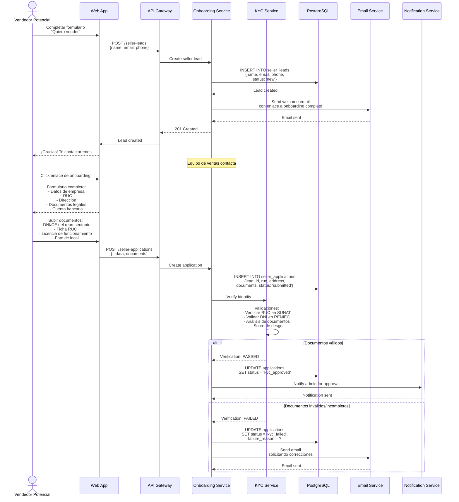
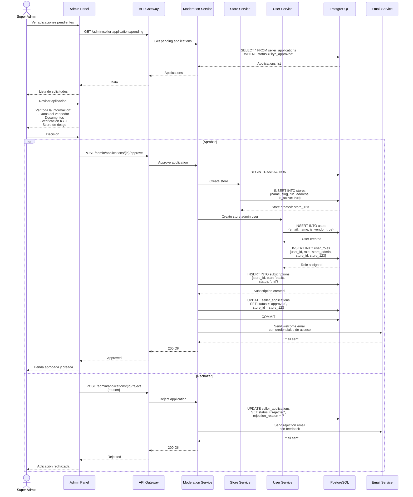
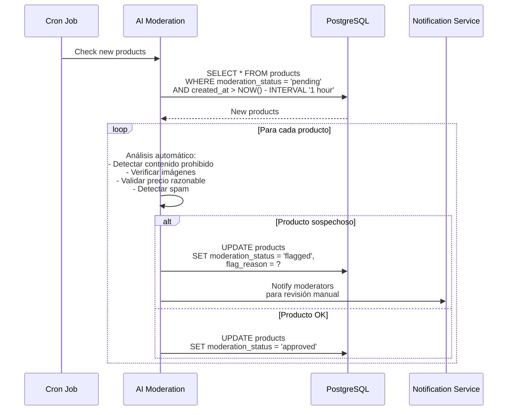
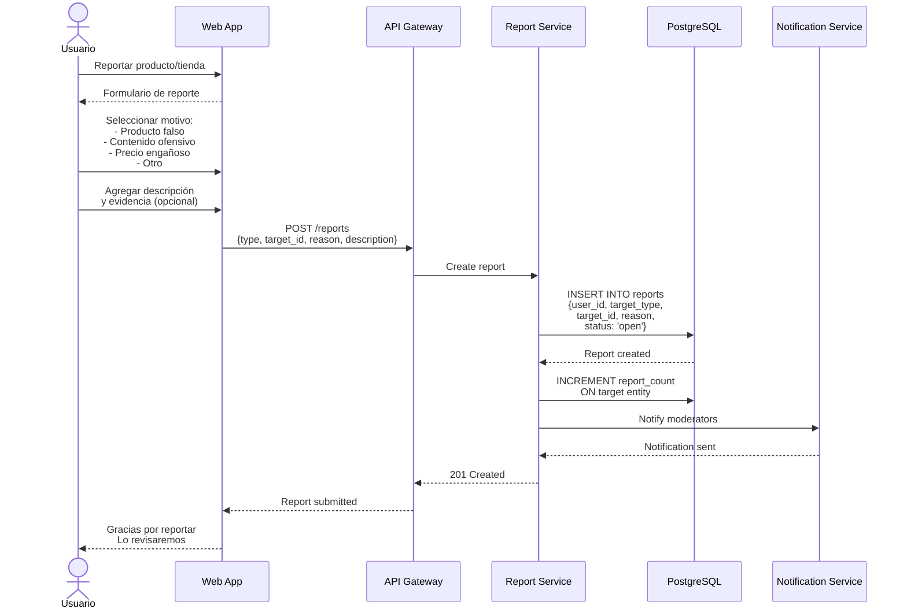
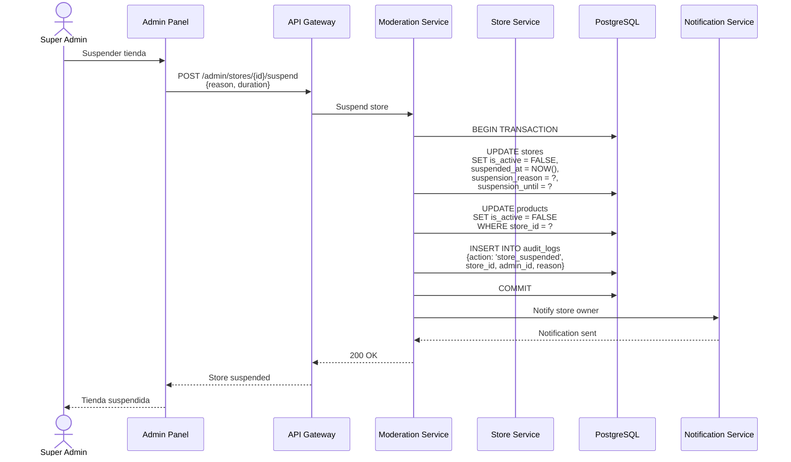

# Diagramas de Secuencia - Sistema de Moderación - Sistema Tiendi

Sistema de moderación y control de calidad de la plataforma.

---

## 1. Onboarding de Vendedor (KYC)



---

## 2. Aprobación Manual de Tienda (Super Admin)



---

## 3. Moderación de Productos



---

## 4. Sistema de Reportes



---

## 5. Suspensión de Tienda



---

## Tablas

```sql
CREATE TABLE seller_applications (
  id UUID PRIMARY KEY DEFAULT uuid_generate_v4(),
  lead_id UUID REFERENCES seller_leads(id),
  ruc VARCHAR(11) NOT NULL,
  business_name VARCHAR(255) NOT NULL,
  address TEXT NOT NULL,
  documents JSONB, -- URLs de documentos subidos
  kyc_status VARCHAR(20) DEFAULT 'pending', -- 'pending', 'approved', 'failed'
  kyc_score INTEGER,
  status VARCHAR(20) DEFAULT 'submitted', -- 'submitted', 'kyc_approved', 'approved', 'rejected'
  rejection_reason TEXT,
  store_id UUID REFERENCES stores(id),
  reviewed_by UUID REFERENCES users(id),
  reviewed_at TIMESTAMP,
  created_at TIMESTAMP DEFAULT NOW(),
  updated_at TIMESTAMP DEFAULT NOW()
);

CREATE TABLE reports (
  id UUID PRIMARY KEY DEFAULT uuid_generate_v4(),
  user_id UUID NOT NULL REFERENCES users(id),
  target_type VARCHAR(50) NOT NULL, -- 'product', 'store', 'review', 'user'
  target_id UUID NOT NULL,
  reason VARCHAR(100) NOT NULL,
  description TEXT,
  evidence JSONB, -- URLs de capturas/evidencia
  status VARCHAR(20) DEFAULT 'open', -- 'open', 'in_review', 'resolved', 'dismissed'
  reviewed_by UUID REFERENCES users(id),
  reviewed_at TIMESTAMP,
  resolution_notes TEXT,
  created_at TIMESTAMP DEFAULT NOW()
);

CREATE TABLE moderation_actions (
  id UUID PRIMARY KEY DEFAULT uuid_generate_v4(),
  target_type VARCHAR(50) NOT NULL,
  target_id UUID NOT NULL,
  action VARCHAR(50) NOT NULL, -- 'approved', 'rejected', 'flagged', 'suspended', 'deleted'
  reason TEXT,
  performed_by UUID REFERENCES users(id),
  performed_at TIMESTAMP DEFAULT NOW()
);

CREATE TABLE audit_logs (
  id UUID PRIMARY KEY DEFAULT uuid_generate_v4(),
  action VARCHAR(100) NOT NULL,
  entity_type VARCHAR(50),
  entity_id UUID,
  user_id UUID REFERENCES users(id),
  details JSONB,
  ip_address INET,
  user_agent TEXT,
  created_at TIMESTAMP DEFAULT NOW()
);

CREATE INDEX idx_audit_logs_entity ON audit_logs(entity_type, entity_id);
CREATE INDEX idx_audit_logs_user ON audit_logs(user_id, created_at DESC);
```

---

**Fecha de creación:** 2025-11-24
**Versión:** 1.0
