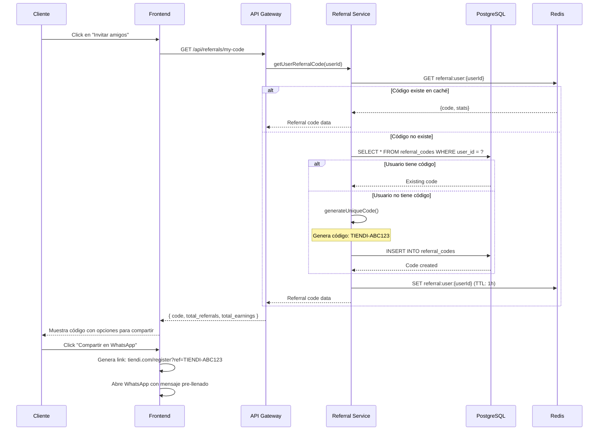
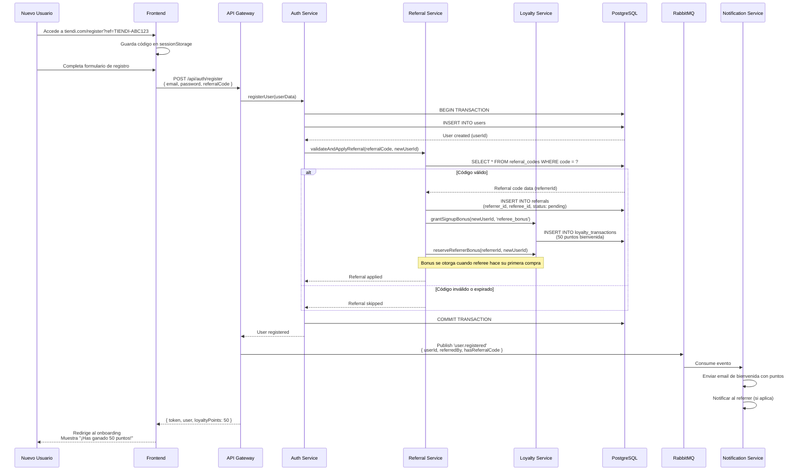
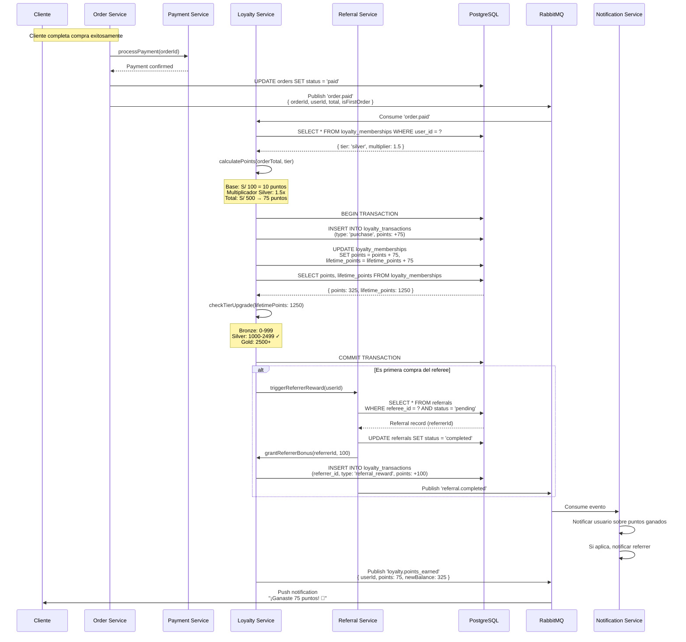
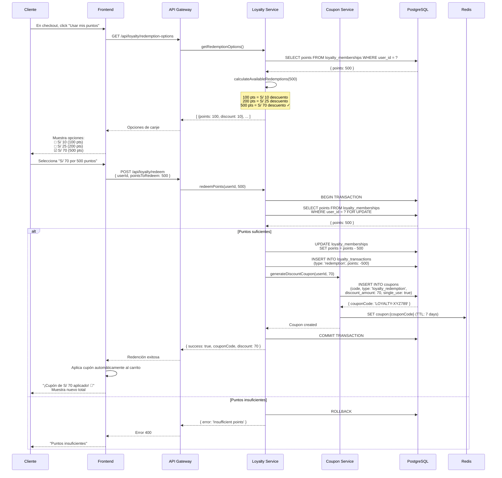
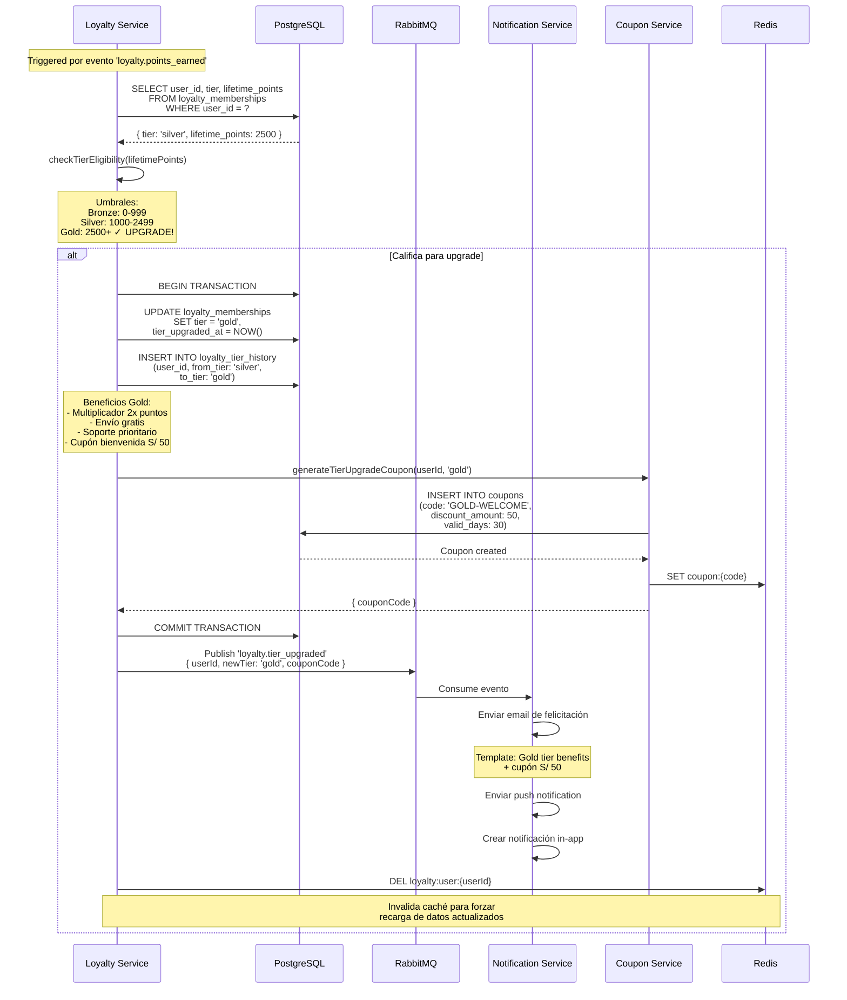

# Diagramas de Secuencia - Sistema de Referidos y Lealtad

Este archivo contiene los diagramas de secuencia para el sistema de referidos y programa de lealtad de Tiendi.

---

## 1. Generación de Código de Referido



---

## 2. Registro con Código de Referido



---

## 3. Acumulación de Puntos por Compra



---

## 4. Canje de Puntos por Descuento



---

## 5. Upgrade Automático de Nivel de Membresía



---

## 6. Dashboard de Referidos (Vendedor consulta)

```mermaid
sequenceDiagram
    participant U as Usuario
    participant F as Frontend
    participant A as API Gateway
    participant RS as Referral Service
    participant LS as Loyalty Service
    participant DB as PostgreSQL
    participant Cache as Redis

    U->>F: Accede a "Mi programa de referidos"

    F->>A: GET /api/referrals/dashboard

    A->>RS: getReferralDashboard(userId)

    RS->>Cache: GET referral:dashboard:{userId}

    alt Caché hit
        Cache-->>RS: Dashboard data
    else Caché miss
        par Queries paralelas
            RS->>DB: SELECT code, created_at<br/>FROM referral_codes<br/>WHERE user_id = ?
        and
            RS->>DB: SELECT COUNT(*) as total,<br/>SUM(CASE status='completed') as completed<br/>FROM referrals<br/>WHERE referrer_id = ?
        and
            RS->>DB: SELECT r.*, u.name, u.email<br/>FROM referrals r<br/>JOIN users u ON r.referee_id = u.id<br/>WHERE r.referrer_id = ?<br/>ORDER BY r.created_at DESC<br/>LIMIT 10
        and
            RS->>LS: getTotalReferralEarnings(userId)
            LS->>DB: SELECT SUM(points) FROM loyalty_transactions<br/>WHERE user_id = ?<br/>AND type = 'referral_reward'
        end

        RS->>RS: aggregateDashboardData()
        RS->>Cache: SET referral:dashboard:{userId} (TTL: 5min)
    end

    RS-->>A: {
        code: 'TIENDI-ABC123',
        stats: {
            totalReferrals: 15,
            completedReferrals: 12,
            pendingReferrals: 3,
            totalEarned: 1200 // puntos
        },
        recentReferrals: [...]
    }

    A-->>F: Dashboard data

    F-->>U: Muestra dashboard:<br/>┌─────────────────────┐<br/>│ Tu código: TIENDI-ABC123 │<br/>│ 📊 15 amigos invitados │<br/>│ ✅ 12 completados │<br/>│ ⏳ 3 pendientes │<br/>│ 🎁 1,200 puntos ganados │<br/>└─────────────────────┘<br/><br/>Últimos referidos:<br/>• Juan Pérez - Completado<br/>• María López - Pendiente<br/>...

    U->>F: Click "Ver historial completo"

    F->>A: GET /api/referrals/history?page=1&limit=20
    A->>RS: getReferralHistory(userId, pagination)

    RS->>DB: SELECT r.*, u.name, u.email,<br/>       r.status, r.completed_at,<br/>       lt.points as reward_points<br/>FROM referrals r<br/>JOIN users u ON r.referee_id = u.id<br/>LEFT JOIN loyalty_transactions lt<br/>  ON lt.user_id = r.referrer_id<br/>  AND lt.reference_id = r.id<br/>WHERE r.referrer_id = ?<br/>ORDER BY r.created_at DESC<br/>LIMIT 20 OFFSET 0

    DB-->>RS: Referral history
    RS-->>A: { referrals: [...], pagination: {...} }
    A-->>F: Historial completo

    F-->>U: Muestra tabla detallada con filtros
```

---

## Esquema de Base de Datos

```sql
-- Códigos de referido
CREATE TABLE referral_codes (
    id UUID PRIMARY KEY DEFAULT uuid_generate_v4(),
    user_id UUID NOT NULL REFERENCES users(id),
    code VARCHAR(20) UNIQUE NOT NULL, -- TIENDI-ABC123
    created_at TIMESTAMP DEFAULT NOW(),
    expires_at TIMESTAMP, -- NULL = nunca expira
    is_active BOOLEAN DEFAULT TRUE,
    max_uses INTEGER, -- NULL = ilimitado
    total_uses INTEGER DEFAULT 0,

    CONSTRAINT unique_user_code UNIQUE(user_id)
);

-- Registro de referidos
CREATE TABLE referrals (
    id UUID PRIMARY KEY DEFAULT uuid_generate_v4(),
    referrer_id UUID NOT NULL REFERENCES users(id), -- Quien refiere
    referee_id UUID NOT NULL REFERENCES users(id),  -- Quien fue referido
    referral_code_id UUID REFERENCES referral_codes(id),
    status VARCHAR(20) DEFAULT 'pending', -- pending, completed, expired, cancelled
    created_at TIMESTAMP DEFAULT NOW(),
    completed_at TIMESTAMP, -- Cuando referee hace su primera compra

    CONSTRAINT unique_referee UNIQUE(referee_id), -- Un usuario solo puede ser referido una vez
    CHECK (referrer_id != referee_id)
);

-- Membresías de lealtad
CREATE TABLE loyalty_memberships (
    id UUID PRIMARY KEY DEFAULT uuid_generate_v4(),
    user_id UUID NOT NULL UNIQUE REFERENCES users(id),
    tier VARCHAR(20) DEFAULT 'bronze', -- bronze, silver, gold, platinum
    points INTEGER DEFAULT 0, -- Puntos disponibles para canje
    lifetime_points INTEGER DEFAULT 0, -- Total acumulado (determina tier)
    tier_upgraded_at TIMESTAMP,
    created_at TIMESTAMP DEFAULT NOW(),
    updated_at TIMESTAMP DEFAULT NOW()
);

-- Historial de transacciones de puntos
CREATE TABLE loyalty_transactions (
    id UUID PRIMARY KEY DEFAULT uuid_generate_v4(),
    user_id UUID NOT NULL REFERENCES users(id),
    type VARCHAR(30) NOT NULL,
    -- Types: 'purchase', 'signup_bonus', 'referral_reward',
    --        'redemption', 'tier_bonus', 'expiration', 'manual_adjustment'
    points INTEGER NOT NULL, -- Puede ser negativo (redemption, expiration)
    reference_type VARCHAR(50), -- 'order', 'referral', 'coupon', etc.
    reference_id UUID,
    description TEXT,
    created_at TIMESTAMP DEFAULT NOW(),

    INDEX idx_user_created (user_id, created_at DESC)
);

-- Historial de cambios de tier
CREATE TABLE loyalty_tier_history (
    id UUID PRIMARY KEY DEFAULT uuid_generate_v4(),
    user_id UUID NOT NULL REFERENCES users(id),
    from_tier VARCHAR(20),
    to_tier VARCHAR(20) NOT NULL,
    lifetime_points_at_upgrade INTEGER,
    created_at TIMESTAMP DEFAULT NOW()
);

-- Índices para optimizar queries
CREATE INDEX idx_referrals_referrer ON referrals(referrer_id, status);
CREATE INDEX idx_referrals_referee ON referrals(referee_id);
CREATE INDEX idx_referral_codes_code ON referral_codes(code) WHERE is_active = TRUE;
CREATE INDEX idx_loyalty_transactions_user ON loyalty_transactions(user_id, created_at DESC);
```

---

## Configuración de Reglas de Lealtad

```typescript
// config/loyalty-config.ts
export const LOYALTY_CONFIG = {
  // Configuración de tiers
  tiers: {
    bronze: {
      name: 'Bronze',
      minLifetimePoints: 0,
      maxLifetimePoints: 999,
      pointsMultiplier: 1.0,
      benefits: [
        'Acumulación de puntos',
        'Descuentos exclusivos'
      ]
    },
    silver: {
      name: 'Silver',
      minLifetimePoints: 1000,
      maxLifetimePoints: 2499,
      pointsMultiplier: 1.5,
      benefits: [
        'Todas las anteriores',
        '50% más puntos por compra',
        'Acceso anticipado a ofertas'
      ]
    },
    gold: {
      name: 'Gold',
      minLifetimePoints: 2500,
      maxLifetimePoints: 4999,
      pointsMultiplier: 2.0,
      benefits: [
        'Todas las anteriores',
        'Doble puntos por compra',
        'Envío gratis en todos los pedidos',
        'Soporte prioritario'
      ]
    },
    platinum: {
      name: 'Platinum',
      minLifetimePoints: 5000,
      maxLifetimePoints: Infinity,
      pointsMultiplier: 2.5,
      benefits: [
        'Todas las anteriores',
        '2.5x puntos por compra',
        'Gerente de cuenta dedicado',
        'Eventos exclusivos'
      ]
    }
  },

  // Reglas de acumulación
  earning: {
    purchaseRatio: 10, // 10 puntos por cada S/ 100 gastados
    minimumPurchase: 10, // Compra mínima S/ 10 para ganar puntos
    signupBonus: 50, // Puntos por registrarse
    refereeBonus: 50, // Puntos para el nuevo usuario referido
    referrerBonus: 100, // Puntos para quien refiere (al completarse)
    reviewBonus: 10, // Por dejar reseña verificada
    socialShareBonus: 5 // Por compartir producto en redes
  },

  // Reglas de canje
  redemption: {
    minimumPoints: 100, // Mínimo para canjear
    conversionRate: 10, // 100 puntos = S/ 10
    options: [
      { points: 100, discount: 10 },
      { points: 200, discount: 25 },
      { points: 500, discount: 70 },
      { points: 1000, discount: 150 }
    ]
  },

  // Expiración
  expiration: {
    enabled: true,
    months: 12, // Puntos expiran después de 12 meses
    warningDays: 30 // Notificar 30 días antes
  }
};

// config/referral-config.ts
export const REFERRAL_CONFIG = {
  codePrefix: 'TIENDI',
  codeLength: 6, // ABC123
  expirationDays: null, // null = nunca expira
  maxUsesPerCode: null, // null = ilimitado

  rewards: {
    referrer: {
      points: 100,
      triggeredBy: 'referee_first_purchase'
    },
    referee: {
      points: 50,
      triggeredBy: 'signup'
    }
  },

  shareChannels: [
    'whatsapp',
    'facebook',
    'twitter',
    'email',
    'copy_link'
  ]
};
```

---

## Implementación - Loyalty Service

```typescript
// services/loyalty.service.ts
import { LOYALTY_CONFIG } from '../config/loyalty-config';

export class LoyaltyService {

  /**
   * Calcula puntos ganados por una compra
   */
  async calculatePurchasePoints(
    userId: string,
    orderTotal: number
  ): Promise<number> {
    // Obtener tier del usuario
    const membership = await db.query(
      'SELECT tier FROM loyalty_memberships WHERE user_id = $1',
      [userId]
    );

    const tier = membership.rows[0]?.tier || 'bronze';
    const multiplier = LOYALTY_CONFIG.tiers[tier].pointsMultiplier;

    // Calcular puntos base
    const basePoints = Math.floor(
      (orderTotal / 100) * LOYALTY_CONFIG.earning.purchaseRatio
    );

    // Aplicar multiplicador de tier
    const totalPoints = Math.floor(basePoints * multiplier);

    return totalPoints;
  }

  /**
   * Otorga puntos al usuario
   */
  async grantPoints(
    userId: string,
    points: number,
    type: string,
    referenceId?: string,
    description?: string
  ): Promise<void> {
    await db.query('BEGIN');

    try {
      // Actualizar balance de puntos
      await db.query(`
        UPDATE loyalty_memberships
        SET points = points + $1,
            lifetime_points = lifetime_points + $1,
            updated_at = NOW()
        WHERE user_id = $2
      `, [points, userId]);

      // Registrar transacción
      await db.query(`
        INSERT INTO loyalty_transactions
        (user_id, type, points, reference_id, description)
        VALUES ($1, $2, $3, $4, $5)
      `, [userId, type, points, referenceId, description]);

      // Verificar si califica para upgrade de tier
      await this.checkAndUpgradeTier(userId);

      await db.query('COMMIT');

      // Publicar evento
      await eventBus.publish('loyalty.points_earned', {
        userId,
        points,
        type
      });

    } catch (error) {
      await db.query('ROLLBACK');
      throw error;
    }
  }

  /**
   * Canjea puntos por descuento
   */
  async redeemPoints(
    userId: string,
    pointsToRedeem: number
  ): Promise<{ couponCode: string; discountAmount: number }> {

    // Validar opción de canje
    const option = LOYALTY_CONFIG.redemption.options.find(
      opt => opt.points === pointsToRedeem
    );

    if (!option) {
      throw new Error('Invalid redemption option');
    }

    await db.query('BEGIN');

    try {
      // Verificar balance
      const result = await db.query(`
        SELECT points FROM loyalty_memberships
        WHERE user_id = $1
        FOR UPDATE
      `, [userId]);

      const currentPoints = result.rows[0]?.points || 0;

      if (currentPoints < pointsToRedeem) {
        throw new Error('Insufficient points');
      }

      // Descontar puntos
      await db.query(`
        UPDATE loyalty_memberships
        SET points = points - $1,
            updated_at = NOW()
        WHERE user_id = $2
      `, [pointsToRedeem, userId]);

      // Registrar transacción
      await db.query(`
        INSERT INTO loyalty_transactions
        (user_id, type, points, description)
        VALUES ($1, 'redemption', $2, $3)
      `, [
        userId,
        -pointsToRedeem,
        `Canjeado por S/ ${option.discount}`
      ]);

      // Generar cupón
      const couponCode = await this.generateLoyaltyCoupon(
        userId,
        option.discount
      );

      await db.query('COMMIT');

      return {
        couponCode,
        discountAmount: option.discount
      };

    } catch (error) {
      await db.query('ROLLBACK');
      throw error;
    }
  }

  /**
   * Verifica y actualiza tier si califica
   */
  private async checkAndUpgradeTier(userId: string): Promise<void> {
    const result = await db.query(`
      SELECT tier, lifetime_points
      FROM loyalty_memberships
      WHERE user_id = $1
    `, [userId]);

    const { tier: currentTier, lifetime_points } = result.rows[0];

    // Determinar nuevo tier basado en lifetime points
    let newTier = 'bronze';
    for (const [tierName, tierConfig] of Object.entries(LOYALTY_CONFIG.tiers)) {
      if (
        lifetime_points >= tierConfig.minLifetimePoints &&
        lifetime_points <= tierConfig.maxLifetimePoints
      ) {
        newTier = tierName;
        break;
      }
    }

    // Si hay upgrade
    if (newTier !== currentTier) {
      await db.query(`
        UPDATE loyalty_memberships
        SET tier = $1,
            tier_upgraded_at = NOW()
        WHERE user_id = $2
      `, [newTier, userId]);

      // Registrar en historial
      await db.query(`
        INSERT INTO loyalty_tier_history
        (user_id, from_tier, to_tier, lifetime_points_at_upgrade)
        VALUES ($1, $2, $3, $4)
      `, [userId, currentTier, newTier, lifetime_points]);

      // Publicar evento
      await eventBus.publish('loyalty.tier_upgraded', {
        userId,
        fromTier: currentTier,
        toTier: newTier
      });
    }
  }

  /**
   * Genera cupón de descuento por canje de puntos
   */
  private async generateLoyaltyCoupon(
    userId: string,
    discountAmount: number
  ): Promise<string> {
    const code = `LOYALTY-${this.generateRandomCode()}`;

    await db.query(`
      INSERT INTO coupons (
        code,
        type,
        discount_type,
        discount_amount,
        user_id,
        usage_limit,
        expires_at
      ) VALUES ($1, 'loyalty_redemption', 'fixed', $2, $3, 1, NOW() + INTERVAL '7 days')
    `, [code, discountAmount, userId]);

    return code;
  }

  private generateRandomCode(): string {
    return Math.random().toString(36).substr(2, 9).toUpperCase();
  }
}
```

---

## Implementación - Referral Service

```typescript
// services/referral.service.ts
import { REFERRAL_CONFIG } from '../config/referral-config';

export class ReferralService {

  /**
   * Genera código único de referido para usuario
   */
  async getUserReferralCode(userId: string): Promise<string> {
    // Verificar si ya tiene código
    const existing = await db.query(
      'SELECT code FROM referral_codes WHERE user_id = $1',
      [userId]
    );

    if (existing.rows.length > 0) {
      return existing.rows[0].code;
    }

    // Generar nuevo código único
    let code: string;
    let isUnique = false;

    while (!isUnique) {
      code = this.generateCode();
      const check = await db.query(
        'SELECT id FROM referral_codes WHERE code = $1',
        [code]
      );
      isUnique = check.rows.length === 0;
    }

    // Guardar código
    await db.query(`
      INSERT INTO referral_codes (user_id, code)
      VALUES ($1, $2)
    `, [userId, code]);

    return code;
  }

  /**
   * Aplica código de referido durante registro
   */
  async applyReferralCode(
    referralCode: string,
    newUserId: string
  ): Promise<void> {
    // Validar código
    const codeData = await db.query(`
      SELECT id, user_id, max_uses, total_uses
      FROM referral_codes
      WHERE code = $1 AND is_active = TRUE
    `, [referralCode]);

    if (codeData.rows.length === 0) {
      throw new Error('Invalid referral code');
    }

    const { id: codeId, user_id: referrerId, max_uses, total_uses } = codeData.rows[0];

    // Validar límites de uso
    if (max_uses && total_uses >= max_uses) {
      throw new Error('Referral code has reached maximum uses');
    }

    await db.query('BEGIN');

    try {
      // Crear registro de referido
      await db.query(`
        INSERT INTO referrals (referrer_id, referee_id, referral_code_id, status)
        VALUES ($1, $2, $3, 'pending')
      `, [referrerId, newUserId, codeId]);

      // Incrementar contador de usos
      await db.query(`
        UPDATE referral_codes
        SET total_uses = total_uses + 1
        WHERE id = $1
      `, [codeId]);

      // Otorgar bonus de bienvenida al nuevo usuario
      await loyaltyService.grantPoints(
        newUserId,
        REFERRAL_CONFIG.rewards.referee.points,
        'signup_bonus',
        null,
        'Bono de bienvenida por registro'
      );

      await db.query('COMMIT');

    } catch (error) {
      await db.query('ROLLBACK');
      throw error;
    }
  }

  /**
   * Completa referido y otorga recompensa al referrer
   */
  async completeReferral(refereeId: string): Promise<void> {
    // Buscar referido pendiente
    const referral = await db.query(`
      SELECT id, referrer_id
      FROM referrals
      WHERE referee_id = $1 AND status = 'pending'
    `, [refereeId]);

    if (referral.rows.length === 0) {
      return; // No hay referido pendiente
    }

    const { id: referralId, referrer_id: referrerId } = referral.rows[0];

    await db.query('BEGIN');

    try {
      // Actualizar estado del referido
      await db.query(`
        UPDATE referrals
        SET status = 'completed',
            completed_at = NOW()
        WHERE id = $1
      `, [referralId]);

      // Otorgar puntos al referrer
      await loyaltyService.grantPoints(
        referrerId,
        REFERRAL_CONFIG.rewards.referrer.points,
        'referral_reward',
        referralId,
        'Recompensa por referir amigo'
      );

      await db.query('COMMIT');

      // Publicar evento
      await eventBus.publish('referral.completed', {
        referrerId,
        refereeId,
        points: REFERRAL_CONFIG.rewards.referrer.points
      });

    } catch (error) {
      await db.query('ROLLBACK');
      throw error;
    }
  }

  /**
   * Genera código único
   */
  private generateCode(): string {
    const chars = 'ABCDEFGHIJKLMNOPQRSTUVWXYZ0123456789';
    let code = REFERRAL_CONFIG.codePrefix + '-';

    for (let i = 0; i < REFERRAL_CONFIG.codeLength; i++) {
      code += chars.charAt(Math.floor(Math.random() * chars.length));
    }

    return code;
  }

  /**
   * Obtiene dashboard de referidos
   */
  async getReferralDashboard(userId: string) {
    const [codeData, stats, recentReferrals, earnings] = await Promise.all([
      // Código del usuario
      db.query('SELECT code FROM referral_codes WHERE user_id = $1', [userId]),

      // Estadísticas
      db.query(`
        SELECT
          COUNT(*) as total,
          SUM(CASE WHEN status = 'completed' THEN 1 ELSE 0 END) as completed,
          SUM(CASE WHEN status = 'pending' THEN 1 ELSE 0 END) as pending
        FROM referrals
        WHERE referrer_id = $1
      `, [userId]),

      // Últimos 10 referidos
      db.query(`
        SELECT r.*, u.name, u.email, r.status, r.created_at
        FROM referrals r
        JOIN users u ON r.referee_id = u.id
        WHERE r.referrer_id = $1
        ORDER BY r.created_at DESC
        LIMIT 10
      `, [userId]),

      // Total ganado
      db.query(`
        SELECT COALESCE(SUM(points), 0) as total
        FROM loyalty_transactions
        WHERE user_id = $1 AND type = 'referral_reward'
      `, [userId])
    ]);

    return {
      code: codeData.rows[0]?.code,
      stats: stats.rows[0],
      recentReferrals: recentReferrals.rows,
      totalEarned: parseInt(earnings.rows[0].total)
    };
  }
}
```

---

## Jobs Programados

```typescript
// jobs/loyalty-expiration.job.ts
import cron from 'node-cron';

/**
 * Job: Expirar puntos después de 12 meses
 * Corre diariamente a las 2:00 AM
 */
cron.schedule('0 2 * * *', async () => {
  console.log('[Loyalty] Running points expiration job...');

  const expirationDate = new Date();
  expirationDate.setMonth(
    expirationDate.getMonth() - LOYALTY_CONFIG.expiration.months
  );

  // Encontrar puntos a expirar
  const result = await db.query(`
    SELECT user_id, SUM(points) as expired_points
    FROM loyalty_transactions
    WHERE created_at < $1
      AND type IN ('purchase', 'signup_bonus', 'referral_reward', 'tier_bonus')
      AND id NOT IN (
        SELECT reference_id
        FROM loyalty_transactions
        WHERE type = 'expiration'
      )
    GROUP BY user_id
    HAVING SUM(points) > 0
  `, [expirationDate]);

  for (const row of result.rows) {
    const { user_id, expired_points } = row;

    await db.query('BEGIN');

    try {
      // Descontar puntos expirados
      await db.query(`
        UPDATE loyalty_memberships
        SET points = GREATEST(0, points - $1)
        WHERE user_id = $2
      `, [expired_points, user_id]);

      // Registrar expiración
      await db.query(`
        INSERT INTO loyalty_transactions
        (user_id, type, points, description)
        VALUES ($1, 'expiration', $2, 'Puntos expirados después de 12 meses')
      `, [user_id, -expired_points]);

      await db.query('COMMIT');

      // Notificar al usuario
      await notificationService.send(user_id, {
        type: 'loyalty_points_expired',
        title: 'Puntos expirados',
        message: `${expired_points} puntos han expirado`
      });

      console.log(`[Loyalty] Expired ${expired_points} points for user ${user_id}`);

    } catch (error) {
      await db.query('ROLLBACK');
      console.error('[Loyalty] Error expiring points:', error);
    }
  }
});

/**
 * Job: Advertir sobre puntos próximos a expirar
 * Corre diariamente a las 10:00 AM
 */
cron.schedule('0 10 * * *', async () => {
  const warningDate = new Date();
  warningDate.setDate(
    warningDate.getDate() - (
      LOYALTY_CONFIG.expiration.months * 30 -
      LOYALTY_CONFIG.expiration.warningDays
    )
  );

  const result = await db.query(`
    SELECT user_id, SUM(points) as expiring_points
    FROM loyalty_transactions
    WHERE created_at <= $1
      AND type IN ('purchase', 'signup_bonus', 'referral_reward')
    GROUP BY user_id
    HAVING SUM(points) > 0
  `, [warningDate]);

  for (const row of result.rows) {
    await notificationService.send(row.user_id, {
      type: 'loyalty_points_expiring_soon',
      title: '¡Tus puntos están por expirar!',
      message: `Tienes ${row.expiring_points} puntos que expirarán en ${LOYALTY_CONFIG.expiration.warningDays} días`
    });
  }
});
```

---

**Versión:** 1.0
**Fecha de creación:** 2025-01-25
**Formato:** Mermaid
