# Diagramas de Secuencia - Sistema de Soporte y Tickets

Este archivo contiene los diagramas de secuencia para el sistema de soporte técnico y tickets de Tiendi.

---

## 1. Cliente Crea Ticket de Soporte

```mermaid
sequenceDiagram
    participant C as Cliente/Vendedor
    participant F as Frontend
    participant A as API Gateway
    participant TS as Ticket Service
    participant DB as PostgreSQL
    participant AS as Assignment Service
    participant Queue as RabbitMQ
    participant NS as Notification Service
    participant Cache as Redis

    C->>F: Click "Ayuda" → "Crear ticket"
    F-->>C: Muestra formulario de ticket

    C->>F: Completa formulario
    Note over C: - Categoría<br/>- Asunto<br/>- Descripción<br/>- Prioridad sugerida<br/>- Archivos adjuntos (opcional)

    F->>F: Valida formulario localmente
    F->>A: POST /api/support/tickets<br/>{ userId, category, subject, description, files }

    A->>TS: createTicket(data)

    TS->>DB: BEGIN TRANSACTION

    TS->>TS: determineActualPriority(category, userType, keywords)
    Note over TS: Lógica de prioridad:<br/>- Palabras clave: "urgente", "no funciona"<br/>- Usuario premium → +1 prioridad<br/>- Categoría billing → Alta

    TS->>DB: INSERT INTO tickets<br/>(user_id, category, subject, description,<br/>priority, status: 'open')
    DB-->>TS: { ticketId, ticket_number: 'TKT-2025-12345' }

    alt Usuario adjuntó archivos
        loop Por cada archivo
            TS->>TS: uploadToS3(file, ticketId)
            TS->>DB: INSERT INTO ticket_attachments
        end
    end

    TS->>DB: INSERT INTO ticket_messages<br/>(ticket_id, sender_id, message: description)

    TS->>AS: assignTicketToAgent(ticketId, category, priority)

    AS->>Cache: GET agents:available:{category}

    alt Caché miss
        AS->>DB: SELECT a.* FROM agents a<br/>WHERE a.categories @> ARRAY[$1]<br/>  AND a.is_active = TRUE<br/>  AND a.current_workload < a.max_workload<br/>ORDER BY a.current_workload ASC<br/>LIMIT 1
        DB-->>AS: Best available agent
        AS->>Cache: SET agents:available:{category}
    else Caché hit
        Cache-->>AS: Agents list
    end

    AS->>DB: UPDATE tickets SET assigned_to = ?,<br/>assigned_at = NOW() WHERE id = ?

    AS->>DB: UPDATE agents SET current_workload = current_workload + 1

    AS-->>TS: Agent assigned

    TS->>DB: INSERT INTO ticket_history<br/>(ticket_id, action: 'created',<br/>details: 'Ticket creado y asignado')

    TS->>DB: COMMIT TRANSACTION

    TS->>Queue: Publish 'ticket.created'<br/>{ ticketId, userId, agentId, priority }

    TS-->>A: { ticketId, ticketNumber, assignedAgent }
    A-->>F: Ticket creado

    F-->>C: Confirmación:<br/>━━━━━━━━━━━━━━━<br/>✅ Ticket creado<br/><br/>N° TKT-2025-12345<br/>Estado: Abierto<br/>Prioridad: Media<br/>Asignado a: Juan López<br/><br/>Tiempo estimado de<br/>respuesta: 4 horas<br/>━━━━━━━━━━━━━━━

    Queue->>NS: Consume 'ticket.created'

    par Notificaciones paralelas
        NS->>C: Email de confirmación<br/>+ Número de ticket<br/>+ Enlace para seguimiento
    and
        NS->>NS: Notificar al agente asignado<br/>Push + Email
    end
```



---

## 2. Agente Responde a Ticket

```mermaid
sequenceDiagram
    participant A as Agente
    participant F as Frontend (Dashboard)
    participant API as API Gateway
    participant TS as Ticket Service
    participant DB as PostgreSQL
    participant Queue as RabbitMQ
    participant NS as Notification Service
    participant WS as WebSocket Server

    A->>F: Accede a "Mis tickets asignados"

    F->>API: GET /api/support/agent/tickets?status=open

    API->>TS: getAgentTickets(agentId, filters)

    TS->>DB: SELECT t.*, u.name as customer_name,<br/>       (SELECT COUNT(*) FROM ticket_messages<br/>        WHERE ticket_id = t.id AND is_read = FALSE) as unread_count<br/>FROM tickets t<br/>JOIN users u ON t.user_id = u.id<br/>WHERE t.assigned_to = $1<br/>  AND t.status = 'open'<br/>ORDER BY<br/>  CASE t.priority<br/>    WHEN 'critical' THEN 1<br/>    WHEN 'high' THEN 2<br/>    WHEN 'medium' THEN 3<br/>    WHEN 'low' THEN 4<br/>  END,<br/>  t.created_at ASC

    DB-->>TS: Lista de tickets
    TS-->>API: Tickets data
    API-->>F: Lista de tickets

    F-->>A: Muestra cola de trabajo:<br/>┌─────────┬───────────┬──────────┬────────┐<br/>│ Número  │ Cliente   │ Asunto   │ Prior. │<br/>├─────────┼───────────┼──────────┼────────┤<br/>│ TKT-123 │ Juan P.   │ Error... │ 🔴 Alta│<br/>│ TKT-124 │ María L.  │ Consul.. │ 🟡 Med │<br/>└─────────┴───────────┴──────────┴────────┘

    A->>F: Click en TKT-123

    F->>API: GET /api/support/tickets/{ticketId}
    API->>TS: getTicketDetails(ticketId, agentId)

    TS->>DB: SELECT * FROM tickets WHERE id = ? AND assigned_to = ?
    TS->>DB: SELECT * FROM ticket_messages<br/>WHERE ticket_id = ? ORDER BY created_at ASC
    TS->>DB: SELECT * FROM ticket_attachments WHERE ticket_id = ?
    TS->>DB: SELECT * FROM ticket_history<br/>WHERE ticket_id = ? ORDER BY created_at DESC

    TS-->>API: Full ticket details
    API-->>F: Ticket data

    F-->>A: Vista detallada del ticket<br/>con historial de mensajes

    A->>F: Marca como "En progreso"
    F->>API: PATCH /api/support/tickets/{id}/status<br/>{ status: 'in_progress' }

    API->>TS: updateTicketStatus(ticketId, 'in_progress', agentId)

    TS->>DB: UPDATE tickets SET status = 'in_progress',<br/>first_response_at = NOW() WHERE id = ?

    TS->>DB: INSERT INTO ticket_history<br/>(ticket_id, action: 'status_changed',<br/>details: 'open → in_progress')

    TS-->>API: Status updated
    API-->>F: Actualización exitosa

    A->>F: Escribe respuesta al cliente
    Note over A: "Hola Juan,<br/><br/>He revisado tu caso.<br/>El error se debe a...<br/><br/>Para solucionarlo:<br/>1. ...<br/>2. ..."

    A->>F: Click "Enviar respuesta"

    F->>API: POST /api/support/tickets/{id}/messages<br/>{ senderId, message, isInternal: false }

    API->>TS: addMessageToTicket(ticketId, agentId, message)

    TS->>DB: INSERT INTO ticket_messages<br/>(ticket_id, sender_id, sender_type: 'agent',<br/>message, is_internal: false)

    TS->>DB: UPDATE tickets SET updated_at = NOW()

    TS->>Queue: Publish 'ticket.message_added'<br/>{ ticketId, messageId, senderId: agentId }

    TS-->>API: Message sent
    API-->>F: Mensaje enviado

    F-->>A: "✅ Respuesta enviada al cliente"

    Queue->>NS: Consume evento

    par Notificaciones
        NS->>NS: Email al cliente con respuesta
    and
        NS->>WS: Push en tiempo real al cliente
        WS-->>F: Actualiza UI si cliente está conectado
    end
```



---

## 3. Cliente Responde y Continúa Conversación

```mermaid
sequenceDiagram
    participant C as Cliente
    participant F as Frontend
    participant API as API Gateway
    participant TS as Ticket Service
    participant DB as PostgreSQL
    participant WS as WebSocket Server
    participant Queue as RabbitMQ
    participant NS as Notification Service

    Note over C: Cliente recibe notificación<br/>de nueva respuesta del agente

    C->>F: Accede a "Mis tickets"
    F->>API: GET /api/support/tickets/my-tickets

    API->>TS: getUserTickets(userId)
    TS->>DB: SELECT * FROM tickets<br/>WHERE user_id = ?<br/>ORDER BY updated_at DESC
    DB-->>TS: User's tickets
    TS-->>API: Tickets list
    API-->>F: Lista de tickets

    F-->>C: Muestra tickets:<br/>• TKT-123 🟢 En progreso (1 msg nuevo)<br/>• TKT-100 ✅ Resuelto

    C->>F: Click en TKT-123

    F->>API: GET /api/support/tickets/{ticketId}
    API->>TS: getTicketDetails(ticketId, userId)

    TS->>DB: SELECT * FROM tickets WHERE id = ? AND user_id = ?
    TS->>DB: SELECT m.*, u.name as sender_name<br/>FROM ticket_messages m<br/>JOIN users u ON m.sender_id = u.id<br/>WHERE m.ticket_id = ?<br/>ORDER BY m.created_at ASC

    TS->>DB: UPDATE ticket_messages<br/>SET is_read = TRUE<br/>WHERE ticket_id = ? AND sender_type = 'agent'

    TS-->>API: Ticket details + messages
    API-->>F: Datos del ticket

    F-->>C: Vista de conversación:<br/>━━━━━━━━━━━━━━━<br/>TKT-2025-12345<br/>Estado: En progreso<br/><br/>[Tu mensaje inicial]<br/>Ayer 10:30 AM<br/><br/>[Respuesta del agente]<br/>Hoy 9:15 AM ⬅️ NUEVO<br/><br/>[Área de respuesta]<br/>━━━━━━━━━━━━━━━

    C->>F: Escribe respuesta
    Note over C: "Gracias por la ayuda.<br/>Intenté los pasos pero<br/>aún tengo el mismo problema..."

    C->>F: Click "Enviar"

    F->>WS: Connect WebSocket<br/>channel: ticket:{ticketId}

    F->>API: POST /api/support/tickets/{id}/messages<br/>{ message, senderId }

    API->>TS: addMessageToTicket(ticketId, userId, message)

    TS->>DB: INSERT INTO ticket_messages<br/>(ticket_id, sender_id, sender_type: 'customer',<br/>message, is_internal: false)

    TS->>DB: UPDATE tickets SET updated_at = NOW()

    TS->>Queue: Publish 'ticket.customer_replied'<br/>{ ticketId, userId, agentId }

    TS-->>API: Message added
    API-->>F: Mensaje enviado

    F-->>C: Mensaje aparece en la conversación

    Queue->>NS: Consume evento

    par Notificaciones al agente
        NS->>NS: Email al agente asignado
    and
        NS->>WS: Push notification al agente
        WS->>F: Actualiza dashboard del agente
        Note over F: Badge de notificación:<br/>TKT-123 (1 respuesta nueva)
    end
```



---

## 4. Escalamiento a Supervisor

```mermaid
sequenceDiagram
    participant A as Agente
    participant F as Frontend
    participant API as API Gateway
    participant TS as Ticket Service
    participant ES as Escalation Service
    participant DB as PostgreSQL
    participant Queue as RabbitMQ
    participant NS as Notification Service

    Note over A: Agente identifica caso complejo<br/>que requiere escalamiento

    A->>F: En ticket TKT-123, click "Escalar ticket"

    F-->>A: Modal: Razón de escalamiento<br/>□ Requiere aprobación de supervisor<br/>□ Problema técnico complejo<br/>□ Cliente VIP<br/>□ Fuera de mi alcance<br/><br/>[Campo de texto]<br/>[Escalar]

    A->>F: Selecciona razón + Añade detalles<br/>Click "Escalar"

    F->>API: POST /api/support/tickets/{id}/escalate<br/>{ reason, details, escalation_level }

    API->>TS: escalateTicket(ticketId, agentId, data)

    TS->>ES: processEscalation(ticketId, reason, level)

    ES->>DB: BEGIN TRANSACTION

    ES->>DB: SELECT * FROM tickets WHERE id = ?
    DB-->>ES: Ticket data

    ES->>DB: SELECT * FROM agents<br/>WHERE role = 'supervisor'<br/>  AND team = ?<br/>  AND is_active = TRUE<br/>ORDER BY current_workload ASC<br/>LIMIT 1

    DB-->>ES: Best available supervisor

    ES->>DB: INSERT INTO ticket_escalations<br/>(ticket_id, from_agent_id, to_agent_id,<br/>reason, escalation_level, status: 'pending')

    ES->>DB: UPDATE tickets<br/>SET priority = CASE<br/>  WHEN priority = 'medium' THEN 'high'<br/>  WHEN priority = 'high' THEN 'critical'<br/>  ELSE priority<br/>END,<br/>escalated = TRUE,<br/>escalated_at = NOW(),<br/>assigned_to = ? (new supervisor)

    ES->>DB: UPDATE agents<br/>SET current_workload = current_workload - 1<br/>WHERE id = ? (previous agent)

    ES->>DB: UPDATE agents<br/>SET current_workload = current_workload + 1<br/>WHERE id = ? (supervisor)

    ES->>DB: INSERT INTO ticket_history<br/>(ticket_id, action: 'escalated',<br/>details: 'Escalado a supervisor')

    ES->>DB: INSERT INTO ticket_messages<br/>(ticket_id, sender_id, sender_type: 'system',<br/>message: 'Ticket escalado a supervisor',<br/>is_internal: true)

    ES->>DB: COMMIT TRANSACTION

    ES->>Queue: Publish 'ticket.escalated'<br/>{ ticketId, fromAgent, toSupervisor, reason }

    ES-->>TS: Escalation processed
    TS-->>API: Ticket escalated
    API-->>F: Escalamiento exitoso

    F-->>A: "✅ Ticket escalado a supervisor"<br/>El supervisor Juan García fue notificado

    Queue->>NS: Consume evento

    par Notificaciones
        NS->>NS: Email URGENTE al supervisor
        Note over NS: Subject: "🚨 Ticket escalado"<br/>Prioridad: Alta
    and
        NS->>NS: Notificar al agente original
        Note over NS: Confirmación de escalamiento
    and
        NS->>NS: Registrar en dashboard de métricas
        Note over NS: Incrementar contador de escalamientos
    end
```



---

## 5. Cierre de Ticket y Encuesta de Satisfacción

```mermaid
sequenceDiagram
    participant A as Agente
    participant F as Frontend
    participant API as API Gateway
    participant TS as Ticket Service
    participant DB as PostgreSQL
    participant Queue as RabbitMQ
    participant NS as Notification Service
    participant SS as Survey Service

    Note over A: Problema resuelto

    A->>F: En ticket TKT-123, click "Marcar como resuelto"

    F-->>A: Modal de confirmación:<br/>"¿Confirmas que el problema<br/>fue resuelto?"<br/><br/>Resumen de solución:<br/>[Campo de texto obligatorio]<br/><br/>[Cancelar] [Confirmar]

    A->>F: Escribe resumen + Click "Confirmar"

    F->>API: POST /api/support/tickets/{id}/resolve<br/>{ resolution_summary, resolved_by }

    API->>TS: resolveTicket(ticketId, agentId, summary)

    TS->>DB: BEGIN TRANSACTION

    TS->>DB: SELECT * FROM tickets WHERE id = ?
    DB-->>TS: Ticket data

    TS->>TS: calculateMetrics(ticket)
    Note over TS: Métricas:<br/>- Tiempo de primera respuesta<br/>- Tiempo total de resolución<br/>- Número de mensajes<br/>- SLA compliance

    TS->>DB: UPDATE tickets<br/>SET status = 'resolved',<br/>    resolution_summary = ?,<br/>    resolved_at = NOW(),<br/>    resolved_by = ?,<br/>    time_to_first_response = ?,<br/>    time_to_resolution = ?

    TS->>DB: UPDATE agents<br/>SET current_workload = current_workload - 1,<br/>    total_resolved = total_resolved + 1<br/>WHERE id = ?

    TS->>DB: INSERT INTO ticket_history<br/>(ticket_id, action: 'resolved',<br/>details: resolution_summary)

    TS->>DB: INSERT INTO ticket_messages<br/>(ticket_id, sender_id, sender_type: 'system',<br/>message: 'Ticket marcado como resuelto',<br/>is_internal: false)

    TS->>DB: COMMIT TRANSACTION

    TS->>Queue: Publish 'ticket.resolved'<br/>{ ticketId, userId, agentId, metrics }

    TS-->>API: Ticket resolved
    API-->>F: Ticket cerrado exitosamente

    F-->>A: "✅ Ticket TKT-123 resuelto"<br/>Tiempo de resolución: 2h 15m<br/>✓ Dentro del SLA

    Queue->>NS: Consume 'ticket.resolved'

    NS->>NS: Enviar email al cliente<br/>"Tu ticket fue resuelto"

    Queue->>SS: Consume 'ticket.resolved'

    SS->>DB: INSERT INTO surveys<br/>(ticket_id, user_id, type: 'csat',<br/>status: 'pending', expires_at: NOW() + 7 days)
    DB-->>SS: { surveyId, survey_token }

    SS->>NS: sendSurveyEmail(userId, surveyToken)

    NS->>C: Email con encuesta:<br/>━━━━━━━━━━━━━━━<br/>Hola Juan,<br/><br/>Tu ticket TKT-123 fue resuelto.<br/><br/>¿Qué tan satisfecho estás<br/>con el soporte recibido?<br/><br/>😞 😐 🙂 😄 😍<br/>1   2   3  4   5<br/><br/>[Click para calificar]<br/>━━━━━━━━━━━━━━━

    Note over C: Cliente tiene 7 días para responder

    alt Cliente responde encuesta
        C->>F: Click en calificación (ej: 5 estrellas)
        F->>API: POST /api/support/surveys/{token}/respond<br/>{ rating: 5, feedback: "Excelente atención" }

        API->>SS: submitSurveyResponse(token, data)

        SS->>DB: UPDATE surveys<br/>SET status = 'completed',<br/>    rating = ?,<br/>    feedback = ?,<br/>    completed_at = NOW()

        SS->>DB: UPDATE agents<br/>SET avg_rating = (avg_rating * total_ratings + ?) / (total_ratings + 1),<br/>    total_ratings = total_ratings + 1<br/>WHERE id = ?

        SS->>Queue: Publish 'survey.completed'<br/>{ surveyId, rating, agentId }

        SS-->>API: Survey submitted
        API-->>F: "¡Gracias por tu feedback!"

        alt Rating >= 4
            Queue->>NS: Felicitar al agente
        else Rating <= 2
            Queue->>NS: Alertar a supervisor
        end
    end
```



---

## Esquema de Base de Datos

```sql
-- Tickets
CREATE TABLE tickets (
    id UUID PRIMARY KEY DEFAULT uuid_generate_v4(),
    ticket_number VARCHAR(20) UNIQUE NOT NULL, -- TKT-2025-12345

    -- Usuario que crea el ticket
    user_id UUID NOT NULL REFERENCES users(id),
    user_type VARCHAR(20) NOT NULL, -- 'customer', 'vendor'

    -- Categorización
    category VARCHAR(50) NOT NULL,
    -- Categories: technical, billing, account, product, shipping, other
    subject VARCHAR(255) NOT NULL,
    description TEXT NOT NULL,

    -- Asignación
    assigned_to UUID REFERENCES users(id), -- Agente asignado
    assigned_at TIMESTAMP,

    -- Prioridad y estado
    priority VARCHAR(20) DEFAULT 'medium',
    -- Priorities: low, medium, high, critical
    status VARCHAR(30) DEFAULT 'open',
    -- Status: open, in_progress, waiting_customer, resolved, closed

    -- Escalamiento
    escalated BOOLEAN DEFAULT FALSE,
    escalated_at TIMESTAMP,

    -- Resolución
    resolution_summary TEXT,
    resolved_at TIMESTAMP,
    resolved_by UUID REFERENCES users(id),

    -- Métricas de SLA
    first_response_at TIMESTAMP,
    time_to_first_response INTERVAL, -- Calculado: first_response_at - created_at
    time_to_resolution INTERVAL, -- Calculado: resolved_at - created_at
    sla_breached BOOLEAN DEFAULT FALSE,

    -- Metadata
    created_at TIMESTAMP DEFAULT NOW(),
    updated_at TIMESTAMP DEFAULT NOW()
);

-- Mensajes del ticket
CREATE TABLE ticket_messages (
    id UUID PRIMARY KEY DEFAULT uuid_generate_v4(),
    ticket_id UUID NOT NULL REFERENCES tickets(id) ON DELETE CASCADE,
    sender_id UUID NOT NULL REFERENCES users(id),
    sender_type VARCHAR(20) NOT NULL, -- 'customer', 'agent', 'system'
    message TEXT NOT NULL,
    is_internal BOOLEAN DEFAULT FALSE, -- Solo visible para agentes
    is_read BOOLEAN DEFAULT FALSE,
    created_at TIMESTAMP DEFAULT NOW()
);

-- Archivos adjuntos
CREATE TABLE ticket_attachments (
    id UUID PRIMARY KEY DEFAULT uuid_generate_v4(),
    ticket_id UUID NOT NULL REFERENCES tickets(id) ON DELETE CASCADE,
    message_id UUID REFERENCES ticket_messages(id),
    file_name VARCHAR(255) NOT NULL,
    file_url TEXT NOT NULL,
    file_type VARCHAR(50),
    file_size_kb INTEGER,
    uploaded_by UUID REFERENCES users(id),
    created_at TIMESTAMP DEFAULT NOW()
);

-- Historial de cambios
CREATE TABLE ticket_history (
    id UUID PRIMARY KEY DEFAULT uuid_generate_v4(),
    ticket_id UUID NOT NULL REFERENCES tickets(id) ON DELETE CASCADE,
    action VARCHAR(50) NOT NULL,
    -- Actions: created, assigned, status_changed, escalated,
    --          priority_changed, resolved, closed, reopened
    details TEXT,
    performed_by UUID REFERENCES users(id),
    created_at TIMESTAMP DEFAULT NOW()
);

-- Escalamientos
CREATE TABLE ticket_escalations (
    id UUID PRIMARY KEY DEFAULT uuid_generate_v4(),
    ticket_id UUID NOT NULL REFERENCES tickets(id),
    from_agent_id UUID REFERENCES users(id),
    to_agent_id UUID NOT NULL REFERENCES users(id),
    escalation_level INTEGER DEFAULT 1, -- 1: Supervisor, 2: Manager, 3: Director
    reason VARCHAR(100) NOT NULL,
    details TEXT,
    status VARCHAR(20) DEFAULT 'pending', -- pending, accepted, resolved
    created_at TIMESTAMP DEFAULT NOW(),
    resolved_at TIMESTAMP
);

-- Agentes de soporte
CREATE TABLE support_agents (
    id UUID PRIMARY KEY REFERENCES users(id),
    role VARCHAR(30) NOT NULL, -- 'agent', 'supervisor', 'manager'
    team VARCHAR(50), -- 'technical', 'billing', 'general'
    categories VARCHAR(50)[], -- Array de categorías que maneja
    max_workload INTEGER DEFAULT 10,
    current_workload INTEGER DEFAULT 0,
    total_resolved INTEGER DEFAULT 0,
    avg_rating DECIMAL(3,2), -- Promedio de encuestas
    total_ratings INTEGER DEFAULT 0,
    is_active BOOLEAN DEFAULT TRUE,
    created_at TIMESTAMP DEFAULT NOW()
);

-- Encuestas de satisfacción (CSAT)
CREATE TABLE surveys (
    id UUID PRIMARY KEY DEFAULT uuid_generate_v4(),
    ticket_id UUID NOT NULL REFERENCES tickets(id),
    user_id UUID NOT NULL REFERENCES users(id),
    agent_id UUID REFERENCES users(id),
    survey_token VARCHAR(100) UNIQUE NOT NULL,
    type VARCHAR(20) DEFAULT 'csat', -- csat, nps
    rating INTEGER, -- 1-5 para CSAT, 0-10 para NPS
    feedback TEXT,
    status VARCHAR(20) DEFAULT 'pending', -- pending, completed, expired
    expires_at TIMESTAMP,
    completed_at TIMESTAMP,
    created_at TIMESTAMP DEFAULT NOW()
);

-- Configuración de SLA
CREATE TABLE sla_policies (
    id UUID PRIMARY KEY DEFAULT uuid_generate_v4(),
    priority VARCHAR(20) NOT NULL,
    category VARCHAR(50),
    first_response_minutes INTEGER NOT NULL,
    resolution_hours INTEGER NOT NULL,
    is_active BOOLEAN DEFAULT TRUE
);

-- Índices
CREATE INDEX idx_tickets_user ON tickets(user_id, status);
CREATE INDEX idx_tickets_assigned ON tickets(assigned_to, status);
CREATE INDEX idx_tickets_status ON tickets(status, priority, created_at DESC);
CREATE INDEX idx_ticket_messages_ticket ON ticket_messages(ticket_id, created_at ASC);
CREATE INDEX idx_ticket_history_ticket ON ticket_history(ticket_id, created_at DESC);
CREATE INDEX idx_surveys_token ON surveys(survey_token);

-- Secuencia para números de ticket
CREATE SEQUENCE ticket_number_seq START 1;
```

---

## Configuración de SLA

```typescript
// config/sla-config.ts

/**
 * Service Level Agreement (SLA) Configuration
 */
export const SLA_CONFIG = {

  // Tiempo de primera respuesta (en minutos)
  firstResponse: {
    critical: 15,  // 15 minutos
    high: 60,      // 1 hora
    medium: 240,   // 4 horas
    low: 480       // 8 horas (1 día laboral)
  },

  // Tiempo de resolución (en horas)
  resolution: {
    critical: 4,   // 4 horas
    high: 12,      // 12 horas
    medium: 48,    // 2 días
    low: 120       // 5 días
  },

  // Horario laboral (para cálculo de SLA)
  businessHours: {
    start: 8,  // 8:00 AM
    end: 20,   // 8:00 PM
    timezone: 'America/Lima',
    workdays: [1, 2, 3, 4, 5] // Lun-Vie
  },

  // Categorías y equipos
  categories: {
    technical: {
      label: 'Soporte Técnico',
      team: 'technical',
      examples: ['Error en la aplicación', 'No puedo acceder', 'Bug']
    },
    billing: {
      label: 'Facturación y Pagos',
      team: 'billing',
      examples: ['Problema con pago', 'Factura incorrecta', 'Reembolso']
    },
    account: {
      label: 'Cuenta y Perfil',
      team: 'general',
      examples: ['Cambiar email', 'Eliminar cuenta', 'Contraseña']
    },
    product: {
      label: 'Productos y Catálogo',
      team: 'general',
      examples: ['Producto incorrecto', 'Información errónea']
    },
    shipping: {
      label: 'Envíos y Logística',
      team: 'general',
      examples: ['Pedido no llegó', 'Tracking', 'Cambio de dirección']
    },
    other: {
      label: 'Otros',
      team: 'general',
      examples: ['Consulta general', 'Sugerencia']
    }
  },

  // Escalamiento automático
  autoEscalation: {
    enabled: true,
    conditions: {
      noResponseHours: 24, // Escalar si no hay respuesta en 24h
      customerRepliesWithoutResponse: 3, // Escalar si cliente responde 3 veces sin atención
      lowRatingThreshold: 2 // Escalar si rating <= 2
    }
  }
};
```

---

## Implementación - Ticket Service

```typescript
// services/ticket.service.ts
import { SLA_CONFIG } from '../config/sla-config';

export class TicketService {

  /**
   * Crea un nuevo ticket de soporte
   */
  async createTicket(data: TicketCreateDTO): Promise<Ticket> {

    // Generar número único
    const ticketNumber = await this.generateTicketNumber();

    // Determinar prioridad real
    const priority = this.determinePriority(
      data.category,
      data.userType,
      data.description
    );

    await db.query('BEGIN');

    try {
      // Crear ticket
      const result = await db.query(`
        INSERT INTO tickets (
          ticket_number, user_id, user_type, category,
          subject, description, priority, status
        ) VALUES ($1, $2, $3, $4, $5, $6, $7, 'open')
        RETURNING *
      `, [
        ticketNumber,
        data.userId,
        data.userType,
        data.category,
        data.subject,
        data.description,
        priority
      ]);

      const ticket = result.rows[0];

      // Primer mensaje (descripción inicial)
      await db.query(`
        INSERT INTO ticket_messages (ticket_id, sender_id, sender_type, message)
        VALUES ($1, $2, 'customer', $3)
      `, [ticket.id, data.userId, data.description]);

      // Asignar agente automáticamente
      const agent = await this.assignmentService.findBestAgent(
        data.category,
        priority
      );

      if (agent) {
        await db.query(`
          UPDATE tickets
          SET assigned_to = $1, assigned_at = NOW()
          WHERE id = $2
        `, [agent.id, ticket.id]);

        await db.query(`
          UPDATE support_agents
          SET current_workload = current_workload + 1
          WHERE id = $1
        `, [agent.id]);
      }

      // Historial
      await db.query(`
        INSERT INTO ticket_history (ticket_id, action, details, performed_by)
        VALUES ($1, 'created', 'Ticket creado', $2)
      `, [ticket.id, data.userId]);

      await db.query('COMMIT');

      // Evento
      await eventBus.publish('ticket.created', {
        ticketId: ticket.id,
        ticketNumber: ticket.ticket_number,
        userId: data.userId,
        agentId: agent?.id,
        priority
      });

      return ticket;

    } catch (error) {
      await db.query('ROLLBACK');
      throw error;
    }
  }

  /**
   * Genera número único de ticket
   */
  private async generateTicketNumber(): Promise<string> {
    const year = new Date().getFullYear();
    const sequence = await db.query('SELECT nextval(\'ticket_number_seq\')');
    const seq = sequence.rows[0].nextval;

    return `TKT-${year}-${String(seq).padStart(6, '0')}`;
  }

  /**
   * Determina prioridad automática
   */
  private determinePriority(
    category: string,
    userType: string,
    description: string
  ): string {
    let priority = 'medium';

    // Palabras clave que aumentan prioridad
    const urgentKeywords = [
      'urgente', 'no funciona', 'error crítico',
      'no puedo acceder', 'perdí dinero', 'bloqueado'
    ];

    const descLower = description.toLowerCase();
    const hasUrgentKeyword = urgentKeywords.some(keyword =>
      descLower.includes(keyword)
    );

    // Lógica de prioridad
    if (category === 'billing' || hasUrgentKeyword) {
      priority = 'high';
    }

    if (userType === 'vendor' && category === 'technical') {
      priority = 'high'; // Vendedores tienen prioridad
    }

    return priority;
  }

  /**
   * Resuelve ticket
   */
  async resolveTicket(
    ticketId: string,
    agentId: string,
    summary: string
  ): Promise<void> {

    await db.query('BEGIN');

    try {
      const ticket = await db.query(`
        SELECT * FROM tickets WHERE id = $1 FOR UPDATE
      `, [ticketId]);

      if (ticket.rows.length === 0) {
        throw new Error('Ticket not found');
      }

      const ticketData = ticket.rows[0];

      // Calcular métricas
      const timeToFirstResponse = ticketData.first_response_at
        ? this.calculateTimeDiff(ticketData.created_at, ticketData.first_response_at)
        : null;

      const timeToResolution = this.calculateTimeDiff(
        ticketData.created_at,
        new Date()
      );

      // Verificar SLA
      const slaBreached = this.checkSLABreach(
        ticketData.priority,
        timeToResolution
      );

      // Actualizar ticket
      await db.query(`
        UPDATE tickets
        SET status = 'resolved',
            resolution_summary = $1,
            resolved_at = NOW(),
            resolved_by = $2,
            time_to_first_response = $3,
            time_to_resolution = $4,
            sla_breached = $5
        WHERE id = $6
      `, [
        summary,
        agentId,
        timeToFirstResponse,
        timeToResolution,
        slaBreached,
        ticketId
      ]);

      // Actualizar workload del agente
      await db.query(`
        UPDATE support_agents
        SET current_workload = GREATEST(0, current_workload - 1),
            total_resolved = total_resolved + 1
        WHERE id = $1
      `, [agentId]);

      // Historial
      await db.query(`
        INSERT INTO ticket_history (ticket_id, action, details, performed_by)
        VALUES ($1, 'resolved', $2, $3)
      `, [ticketId, summary, agentId]);

      await db.query('COMMIT');

      // Evento
      await eventBus.publish('ticket.resolved', {
        ticketId,
        userId: ticketData.user_id,
        agentId,
        timeToResolution,
        slaBreached
      });

    } catch (error) {
      await db.query('ROLLBACK');
      throw error;
    }
  }

  /**
   * Verifica si se incumplió el SLA
   */
  private checkSLABreach(priority: string, timeToResolution: string): boolean {
    const slaHours = SLA_CONFIG.resolution[priority];
    const actualHours = this.parseIntervalToHours(timeToResolution);

    return actualHours > slaHours;
  }

  private calculateTimeDiff(start: Date, end: Date): string {
    const diff = new Date(end).getTime() - new Date(start).getTime();
    const hours = Math.floor(diff / (1000 * 60 * 60));
    const minutes = Math.floor((diff % (1000 * 60 * 60)) / (1000 * 60));

    return `${hours} hours ${minutes} minutes`;
  }

  private parseIntervalToHours(interval: string): number {
    // Parse PostgreSQL interval to hours
    const match = interval.match(/(\d+) hours?/);
    return match ? parseInt(match[1]) : 0;
  }
}
```

---

## Jobs Programados

```typescript
// jobs/ticket-sla-monitor.job.ts
import cron from 'node-cron';

/**
 * Job: Monitorear tickets próximos a incumplir SLA
 * Corre cada 15 minutos
 */
cron.schedule('*/15 * * * *', async () => {
  console.log('[Tickets] Monitoring SLA compliance...');

  const now = new Date();

  // Tickets abiertos o en progreso
  const tickets = await db.query(`
    SELECT t.*, sa.name as agent_name, sa.email as agent_email
    FROM tickets t
    LEFT JOIN support_agents sa ON t.assigned_to = sa.id
    WHERE t.status IN ('open', 'in_progress')
      AND t.sla_breached = FALSE
  `);

  for (const ticket of tickets.rows) {
    const createdAt = new Date(ticket.created_at);
    const minutesSinceCreation = (now.getTime() - createdAt.getTime()) / (1000 * 60);

    const slaMinutes = SLA_CONFIG.firstResponse[ticket.priority];

    // Verificar si está próximo a incumplir (80% del tiempo transcurrido)
    if (minutesSinceCreation >= slaMinutes * 0.8 && !ticket.first_response_at) {
      await notificationService.send({
        to: ticket.agent_email,
        subject: `⚠️ SLA Alert: Ticket ${ticket.ticket_number}`,
        template: 'sla_warning',
        data: {
          ticketNumber: ticket.ticket_number,
          minutesRemaining: Math.round(slaMinutes - minutesSinceCreation)
        }
      });
    }

    // Marcar como SLA breached si ya pasó el tiempo
    if (minutesSinceCreation > slaMinutes && !ticket.first_response_at) {
      await db.query(`
        UPDATE tickets SET sla_breached = TRUE WHERE id = $1
      `, [ticket.id]);

      // Escalar automáticamente
      await escalationService.autoEscalate(ticket.id, 'sla_breach');
    }
  }
});
```

---

**Versión:** 1.0
**Fecha de creación:** 2025-01-25
**Formato:** Mermaid
