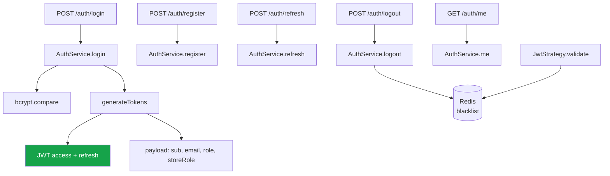
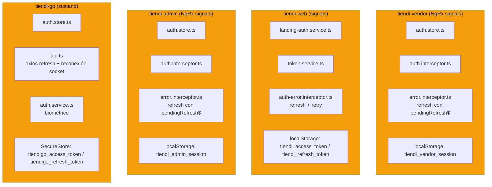
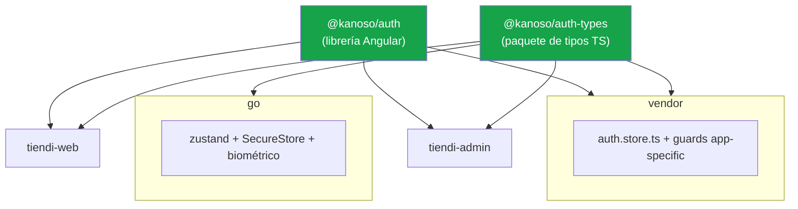

---
tags:
  - tiendi
  - autenticacion
  - arquitectura
  - jwt
  - seguridad
  - aplicaciones
aliases:
  - Autenticación Tiendi
  - Sistema de Autenticación
  - Login unificado
  - Auth vendor web go admin
---

# Autenticación — Sistema unificado (vendor · web · go · admin)

Este documento es la **fuente única de verdad** para la autenticación de la plataforma: cómo se emite un token, dónde se guarda la sesión, quién valida el acceso y dónde vive el código en cada una de las cuatro aplicaciones — `tiendi-vendor`, `tiendi-web`, `tiendi-go` y `tiendi-admin`.

> [!NOTE]
> Parte de lo descrito es **estado actual verificado contra el código** y parte es **norte de diseño** (marcado 🔲). Lo ya implementado está marcado ✅.

---

## Índice

1. [Objetivo y alcance](#1-objetivo-y-alcance)
2. [La distinción fundamental](#2-la-distinción-fundamental)
3. [Estado actual — backend (ya unificado)](#3-estado-actual--backend-ya-unificado)
4. [Estado actual — frontend (duplicado)](#4-estado-actual--frontend-duplicado)
5. [Deuda detectada](#5-deuda-detectada)
6. [La frontera que NO se unifica](#6-la-frontera-que-no-se-unifica)
7. [Diseño objetivo — tres capas](#7-diseño-objetivo--tres-capas)
8. [Precedente en el repo](#8-precedente-en-el-repo)
9. [Decisiones cerradas](#9-decisiones-cerradas)
10. [Checklist de seguimiento](#10-checklist-de-seguimiento)

---

## 1. Objetivo y alcance

### 1.1 Qué es

Autenticación es el sistema que responde dos preguntas distintas: *"¿quién sos?"* (identidad) y *"¿podés entrar acá?"* (autorización). La primera se comparte; la segunda es por aplicación.

### 1.2 Audiencias

| Audiencia | App | Rol |
|-----------|-----|-----|
| Cliente | `tiendi-web` | `CUSTOMER` |
| Vendedor | `tiendi-vendor` | `STORE_OWNER` / `EMPLOYEE` (+ `storeRole`) |
| Repartidor | `tiendi-go` | `RIDER` |
| Super Admin | `tiendi-admin` | `SUPER_ADMIN` |

---

## 2. La distinción fundamental

> [!IMPORTANT]
> **El mecanismo se comparte; la frontera de roles no.**
>
> Hay dos cosas distintas que no deben mezclarse:
> - **Mecanismo** (kernel compartido): ciclo de vida del token, refresh, storage, tipos de usuario. → **Sí, unificar.**
> - **Autorización** (límites por app): guards, login del admin, biométrico. → **No, no unificar.**

Toda decisión futura sobre auth se resuelve con esa distinción. Si una pieza responde *"¿cómo se emite/guarda/renueva un token?"* es kernel compartido. Si responde *"¿este rol puede entrar a esta pantalla?"* es frontera por app.

---

## 3. Estado actual — backend (ya unificado)

> [!NOTE]
> **El backend ya está unificado y está bien así.** No hay que tocarlo. Una sola superficie de auth sirve a las cuatro apps.



| Endpoint | Propósito |
|----------|-----------|
| `POST /auth/login` | Login por email/password (todas las apps) |
| `POST /auth/register` | Registro de cliente |
| `POST /auth/refresh` | Renovar access token con refresh token |
| `POST /auth/logout` | Blacklist del access token |
| `POST /auth/logout-all` | Logout + intención de invalidar sesiones |
| `GET /auth/me` | Datos del usuario autenticado |
| `POST /auth/forgot-password` | Reset por email (rider) |
| `POST /auth/reset-password` | Reset por token |
| `POST /auth/forgot-password/phone` | OTP por teléfono (rider) |
| `POST /auth/reset-password/phone` | Reset por OTP |

### 3.1 El token

```typescript
// auth.service.ts — generateTokens()
const payload: Record<string, unknown> = { sub: userId, email, role };
if (storeRole) payload['storeRole'] = storeRole;
```

- **Access token**: firmado con `JWT_SECRET`, expira en `JWT_EXPIRES_IN` (default `15m`, `config/env.validation.ts:24`).
- **Refresh token**: firmado con `JWT_REFRESH_SECRET`, expira en `JWT_REFRESH_EXPIRES_IN` (default `30d`, `config/env.validation.ts:26`).
- **Con `jti` (Fase 5)**: el payload del refresh token lleva `jti`, clave de la revocación selectiva y de la rotación con reuse-detection. El access token sigue sin `jti` — su invalidación es la blacklist de Redis por token completo.
- **Blacklist**: logout escribe `blacklist:{token}` en Redis con TTL = vida restante del token. `JwtStrategy.validate` lo consulta.

> [!NOTE]
> **Resuelto (Fase 5).** El refresh token lleva `jti`, se persiste hasheado (sha256) en la tabla `RefreshToken`, y `refresh()` rota: marca el token consumido y emite uno nuevo en la misma familia. Reutilizar un token consumido/revocado corta la familia completa (reuse-detection). `logout()` acepta un `refreshToken` opcional en el body y lo revoca individualmente — **los 4 frontends ya lo envían** (`@kanoso/auth@0.0.2` expuso `getRefreshToken()`; go llama a `/auth/logout` por primera vez). `logoutAll()` revoca todas las familias del usuario además del cutoff de Redis. Kill switch de admin: `POST /admin/users/:userId/revoke-sessions`.

> [!NOTE]
> **`logoutAll()` ahora revoca de verdad — mitigación implementada ([[REVOCACION_SESION]]).** Antes era idéntico a `logout()` más un `logger.log()` y no cerraba ninguna sesión ajena. Hoy escribe un cutoff de revocación en Redis (`auth:revoked_before:{userId}`) que `refresh()` y `JwtStrategy.validate()` consultan contra el `iat` del token presentado. La revocación por dispositivo y la rotación con reuse-detection siguen en la Fase 5.

### 3.2 El contexto de tienda

```typescript
// auth.service.ts — resolveStoreContext()
if (role === 'STORE_OWNER')  → busca Store por ownerId
if (role === 'EMPLOYEE')     → busca StoreEmployee ACTIVE (storeId + storeRole)
else                          → { storeId: null, storeRole: null }
```

El backend **ya modela** la jerarquía `EMPLOYEE` + `storeRole` (el empleado es un `EMPLOYEE` con un rol dentro de la tienda). Este es el dato que el frontend del vendor re-modela mal (§5).

---

## 4. Estado actual — frontend (duplicado)

Cuatro apps reimplementan el mismo mecanismo con claves de storage, shapes de usuario y lógica de refresh divergentes.



| Pieza | vendor | web | admin | go |
|-------|--------|-----|-------|----|
| Framework | Angular `^21.2.17` | Angular `^21.2.17` | Angular `^21.2.17` | **React `19.2.3`** |
| Store | `auth.store.ts` (NgRx signals) | `landing-auth.service.ts` (signals) | `auth.store.ts` (NgRx signals) | `auth.store.ts` (zustand) |
| Clave storage | `tiendi_vendor_session` | `tiendi_access_token` / `tiendi_refresh_token` | `tiendi_admin_session` | `tiendigo_access_token` / `tiendigo_refresh_token` |
| Refresh en 401 | `error.interceptor.ts` (con `pendingRefresh$`) | `auth-error.interceptor.ts` | `error.interceptor.ts` (con `pendingRefresh$`) | `api.ts` (axios + `reconnectWithToken`) |
| Guard | `vendor.guard` + `role.guard` + `onboarding.guard` | en `landing-auth` | `admin.guard` (`isSuperAdmin`) | biométrico |

`tiendi-go` es la única app no-Angular del inventario. Por eso queda **fuera de la Fase 2**: `@kanoso/auth` es una librería Angular y no puede consumirse desde React. Go entra solo en la Fase 1 (tipos), que es framework-agnóstica. El reparto completo por capas está en §0.4 — la exclusión es de diseño, no un olvido del checklist.

> [!WARNING]
> La lógica de **refresh en 401** está implementada cuatro veces: el vendor comparte un `pendingRefresh$` entre 401 concurrentes; la web reintenta el request original; go además reconecta el socket con el token nuevo. Funciona, pero un cambio de política (ej. rotación de refresh token) hay que replicarlo en cuatro lugares.
>
> El cuarto caso no es una variante: `tiendi-admin` **replica el `pendingRefresh$` del vendor de forma literal** (`core/interceptors/error.interceptor.ts:8`, misma variable a nivel de módulo, mismo comentario). Es copy-paste, no convergencia — y es el argumento más fuerte a favor de la Fase 2: el patrón ya se está propagando solo.

---

## 5. Deuda detectada

### 5.1 Roles desalineados

> [!CAUTION]
> **La desalineación de roles es la deuda más peligrosa del sistema de auth.**
>
> El backend tiene **5 roles**; el frontend del vendor tiene **7**; `tiendi-admin` define su propio tipo con **1**:

| Fuente | Roles |
|--------|-------|
| `tiendi-api/prisma/schema.prisma:14` | `SUPER_ADMIN`, `STORE_OWNER`, `EMPLOYEE`, `CUSTOMER`, `RIDER` |
| `tiendi-vendor/.../user.types.ts` | `STORE_OWNER`, `MANAGER`, `CASHIER`, `WAREHOUSE`, `EMPLOYEE`, `CUSTOMER`, `SUPER_ADMIN` |
| `tiendi-admin/.../types/admin-role.ts` | `SUPER_ADMIN` (tipo `AdminRole`, local, deliberadamente no importado) |

`MANAGER`, `CASHIER` y `WAREHOUSE` **no existen en el backend**: son valores de `storeRole` de un `EMPLOYEE`. El vendor los promueve a `Role` y hace un mapping manual en `role.guard.ts` y `auth.store.ts` (`effectiveRole`). Si mañana cambia el modelo de staff, esta divergencia va a producir permisos otorgados o denegados por error.

`tiendi-admin` diverge en la **dirección opuesta**: en vez de inflar `Role` con valores que el backend no tiene, lo achica a un subconjunto de un solo valor y lo declara como tipo propio. La decisión está escrita en el comentario del archivo — no es un olvido. Confirmarla o revertirla es el primer checkbox de §0.3, y es prerrequisito de la Fase 1.

### 5.2 Código muerto en `tiendi-web`

| Archivo | Problema |
|---------|----------|
| `core/services/auth.service.ts` | Clase vacía (`export class AuthService {}`) — **eliminado (Fase 3)** |
| `core/models/session.ts` | `UserID: number` — pero los IDs son UUID string — **eliminado (Fase 3)** |
| `session.service.ts` (`SessionInfo`) | Métodos muertos `getAudit()`/`getUserName()`/`getCodComprador()` — **eliminados (Fase 3)** |

> [!WARNING]
> **Corrección de la auditoría anterior:** las claves `HdataTiendi*` **NO están muertas**. `SessionInfo` (11 consumidores: cart, checkout, chat, orders, layout…) lee `HdataTiendiTiendaId`, `HdataTiendiTiendaSlug`, `HdataTiendiTiendaNombre`, `HdataTiendiCompradorId`, `HdataTiendiUser` y `HdataTiendiTienda`. Solo `HdataTiendiComprador` quedó sin lector y se eliminó. El resto es un sistema legacy **vivo** que requiere una migración propia, no un borrado.

### 5.3 Mapeo de usuario duplicado

> [!NOTE]
> **Resuelto (Fase 3).** Los tres shapes derivan hoy del `User` compartido de `@kanoso/auth-types`:
> el vendor mapea con su `toUser()` local a `User`; la web define `ICurrentUser extends User` (más los alias calculados `nombre`/`tieneTienda`); y `tiendi-admin` define `AdminUser = Pick<User, 'id' | 'name' | 'email' | 'role'> & { role: AdminRole }`, con `AdminRole` derivado del `Role` compartido (`Extract<Role, 'SUPER_ADMIN'>`) y su copia local de `ApiAuthResponse` eliminada (re-exporta la del paquete). Los mappers siguen siendo locales porque el paquete es solo-tipos (A2), pero todos producen el mismo shape canónico.

El `mapApiUser` (web), el bloque de mapeo en `auth.store.ts` (vendor) y el `toAdminUser` de `auth.store.ts` (admin) traducían el mismo `ApiAuthResponse` a shapes distintos. Peor: `tiendi-admin` declaraba su **propia** interfaz `ApiAuthResponse` en `core/types/auth.types.ts`, así que ni siquiera el contrato de entrada era compartido — era una copia local que podía quedar desfasada de la API sin que nada lo detectara.

### 5.4 Revocación de sesión — parcialmente resuelta

La revocación masiva (`logout-all`) quedó mitigada con [[REVOCACION_SESION]]: `logoutAll()` escribe un cutoff en Redis y `refresh()`/`JwtStrategy.validate()` lo consultan contra `iat`. Lo que **sigue** pendiente es la revocación por dispositivo y la rotación con reuse-detection (Fase 5).

| Síntoma | Estado |
|---------|--------|
| Un refresh token robado sobrevive a un `logout` de dispositivo único | ✅ Resuelto (Fase 5): `logout()` acepta `refreshToken` opcional y lo revoca en la DB |
| `logout-all` no cierra las demás sesiones | ✅ Resuelto: cutoff en Redis (`auth:revoked_before:{userId}`) + revocación de todas las familias de refresh tokens en la DB |
| No hay revocación selectiva posible | ✅ Resuelto (Fase 5): cada refresh token tiene `jti` y registro persistido; kill switch por usuario vía `POST /admin/users/:userId/revoke-sessions` |

El detalle de la mitigación está en [[REVOCACION_SESION]]; la corrección completa (rotación, `jti`, persistencia en Postgres) es la Fase 5 del checklist (§10).

---

## 6. La frontera que NO se unifica

> [!CAUTION]
> **No reusar el token del vendedor para el admin.**
>
> El back-office (`tiendi-admin`) necesita **login propio** (`POST /auth/admin/login`) que solo acepte `SUPER_ADMIN` y emita un token con ese claim. Reusar `POST /auth/login` abriría la puerta a que un token de tienda acceda a endpoints admin si un guard falla. Esto ya quedó definido en [[TIENDI_ADMIN]] §7.

Lo que se mantiene por aplicación:

| Pieza | Por qué no se unifica |
|-------|----------------------|
| `vendor.guard` / `role.guard` / `onboarding.guard` | Reglas de acceso del panel del vendedor |
| `admin.guard` | Reglas del back-office |
| Biométrico de `tiendi-go` | Depende de `expo-local-authentication` |
| `POST /auth/admin/login` | Frontera de rol, no de mecanismo |

---

## 7. Diseño objetivo — tres capas



| Capa | Qué contiene | Quién la consume |
|------|--------------|------------------|
| **1. `@kanoso/auth-types`** | `Role`, `User`, `AuthSession`, `ApiAuthResponse` — una sola fuente de verdad | Las 4 apps (incluso go, son solo types) |
| **2. `@kanoso/auth`** (Angular) | `TokenService`, interceptores (attach + refresh) — **sin store** (A3) | vendor + web + admin |
| **3. Adapter RN** | Solo importa `auth-types`; conserva zustand + SecureStore + biométrico | go |

> [!IMPORTANT]
> **No una sola librería para todo.** vendor y web son Angular 21 standalone; go es React Native + zustand + axios. Solo los **tipos** son transportables entre ecosistemas. El runtime no. La capa 3 es un adapter, no una librería compartida.

### 7.1 El beneficio real de la capa 1

Extraer `Role` a un paquete de tipos **mata la desalineación de roles de raíz**: un solo enum, consumido por backend (vía contrato de API) y frontend. El `storeRole` deja de ser promovido a `Role` en el vendor; pasa a ser un campo explícito y distinto.

---

## 8. Precedente en el repo

> [!NOTE]
> El patrón de "librería construida + file: dep" ya existe. El vendor consume:
>
> ```json
> // tiendi-vendor/package.json
> "@kanoso/chat": "file:../tiendi-web/dist/ng-chat-tiendi"
> ```
>
> No hay workspace tool (`nx.json`, `turbo.json`, `pnpm-workspace.yaml` no existen). El ecosistema actual son carpetas hermanas con dependencias `file:` sobre build outputs. `@kanoso/auth-types` y `@kanoso/auth` encajan en ese mismo patrón sin introducir infraestructura nueva.

---

## 9. Decisiones cerradas

| # | Decisión | Respuesta | Evidencia |
|---|----------|-----------|-----------|
| **A1** | ¿Introducir workspace tool (Nx/Turborepo)? | ✅ **No todavía — mantener `file:`** | No existe `nx.json`, `turbo.json`, `pnpm-workspace.yaml` ni `lerna.json` en ningún repo del ecosistema. El patrón `file:` ya está en producción (`@kanoso/chat`, §8). Un workspace tool es un proyecto en sí mismo |
| **A2** | ¿Alcance de `@kanoso/auth-types`? | ✅ **Solo tipos, cero dependencias de runtime** | Ni `tiendi-vendor` ni `tiendi-web` tienen `zod` instalado. Solo lo tienen `tiendi-api` (`^4.3.6`) y `tiendi-go` (`^4.4.3`), ya desalineados entre sí. Incluir validadores Zod agregaría una dependencia de runtime a dos apps Angular y obligaría a resolver ese skew primero |
| **A3** | ¿`@kanoso/auth` incluye el store base o solo token + interceptores? | ✅ **Solo token + interceptores** | `tiendi-web` **no tiene auth store**. Su autenticación vive en `core/services/auth.service.ts` y `features/landing/services/landing-auth.service.ts`; sus `signalStore` son de dominio (`cart`, `products`, `category`). Un store base obligaría a web a adoptar una pieza que hoy deliberadamente no tiene |
| **A4** | ¿Refresh token con rotación? | ✅ **Stateless hoy — rotación es prerrequisito de `tiendi-admin`** | `auth.service.ts:164` verifica la firma, chequea `status === 'ACTIVE'` y reemite. No hay tabla de refresh tokens, ni reuse-detection, ni lista de revocación. El payload de `generateTokens()` (`auth.service.ts:401`) no lleva `jti`, y la blacklist de Redis no cubre el refresh path (§3.1) |
| **A5** | ¿`AdminRole` se absorbe en el `Role` unificado? | ✅ **Sí — se absorbe (subconjunto `SUPER_ADMIN`)** | `SUPER_ADMIN` es uno de los 5 roles del backend (`schema.prisma:14`). Una vez que `@kanoso/auth-types` defina el `Role` alineado, `AdminRole` es redundante. El guard del admin queda `role === 'SUPER_ADMIN'` sobre el `Role` compartido, sin importar el tipo inflado del vendor |
| **A6** | ¿Dónde se publican las librerías compiladas (`auth`, `chat`)? | ✅ **GitHub Packages con scope `@kanoso`** | El scope `@tiendi` está tomado en GitHub por una cuenta ajena inactiva y el registry exige scope = owner. Rename aplicado y verificado por builds; publish automatizado con `GITHUB_TOKEN` (sin secrets). Detalle en la NOTE de §0.1 |

> [!NOTE]
> **A2 revierte la recomendación del borrador.** El borrador proponía tipos + validadores Zod apoyándose en que "el backend ya usa Zod". Es cierto del backend, pero irrelevante para el frontend: las dos apps Angular no lo tienen. La decisión también mantiene coherencia con §7 — *"Solo los tipos son transportables entre ecosistemas. El runtime no."*

> [!NOTE]
> **A3 conserva la conclusión pero corrige el argumento.** El borrador justificaba con *"NgRx signals vs signals"*, sugiriendo stacks distintos. No lo son: vendor usa `@ngrx/signals ^21.1.0` y web `^21.1.1` — la misma librería, casi la misma versión. La razón real es la ausencia de store en web, no una diferencia de stack.

> [!CAUTION]
> **A4 quedó OVERTAKEN: `tiendi-admin` ya emite tokens `SUPER_ADMIN` sin rotación.** La Fase 2 de [[TIENDI_ADMIN]] (login de Super Admin, `POST /auth/admin/login`) se implementó sin la rotación con reuse-detection que este documento marcaba como bloqueante. La mitigación acotada [[REVOCACION_SESION]] (corte por usuario en Redis comparado contra `iat`) **ya está implementada** y cubre el `logout-all` masivo. ~~La corrección completa —rotación, `jti`, persistencia en Postgres— sigue siendo la Fase 5.~~ **Fase 5 implementada** (ver checklist §10): la ventana de riesgo quedó cerrada con la rotación + reuse-detection + kill switch.

---

## 10. Checklist de seguimiento

> [!TIP]
> Las Fases 1 a 4 son independientes **entre sí** y pueden ejecutarse en paralelo por personas distintas. Todas dependen de la Fase 0. Dentro de ese conjunto, la Fase 1 (tipos) es la de mayor valor por menor costo: elimina la desalineación de roles sin tocar runtime.

### Fase 0 — Prerrequisitos de infraestructura (bloqueante)

> [!IMPORTANT]
> **Casi toda esta fase ya está cerrada.** Las cinco apps son submódulos de `kanoso/*` (§0.2), el inventario de deuda está actualizado (§0.3) y el framework de cada app está anotado (§0.4). Lo único que sigue abierto es **§0.1: el flujo de release del mecanismo `file:`**, y no es un detalle administrativo — hoy rompe el clone aislado de cualquier submódulo. Ver el CAUTION de §0.1.

#### 0.1 Decidir el mecanismo de distribución de los paquetes

`FUENTES/` **no es un monorepo**. No hay `package.json` raíz, ni `nx.json`, ni `lerna.json`, ni `pnpm-workspace.yaml`. Los paquetes `@kanoso/auth-types` (Fase 1) y `@kanoso/auth` (Fase 2) no tienen hoy infraestructura donde publicarse ni desde donde consumirse.

| Opción | Costo inicial | Costo por release | Nota |
|--------|---------------|-------------------|------|
| Workspace `pnpm`/`npm` en `FUENTES/` | Alto — reestructurar los repos y unificar su versionado | Nulo (resolución local) | Choca con que hoy cada app vive en un repo distinto (0.2) |
| Registry privado (npm / GitHub Packages) | Medio — CI de publicación + credenciales en cada consumidor | Publicar versión + bump en cada app | Es el único que sirve si los repos siguen separados |
| Dependencia `git` por tag | Bajo | Manual: tag + bump en cada app | Sin build step publicado; cada consumidor compila el fuente |

- [x] Elegir el mecanismo y registrar la decisión en §9 — **decidido en A1: `file:` deps, sin workspace tool**
- [x] Dejar creado el scaffolding y un paquete vacío **ya consumible** por al menos una app — **hecho**: `FUENTES/packages/auth-types/` (7 archivos, trackeados en el repo padre) lo consumen vendor y web
- [x] Documentar el flujo de release (quién publica, con qué versión, cómo se consume) — ver abajo
- [x] Resolver la dependencia sobre `tiendi-web/dist/` descrita abajo — **decisión A6: registry privado (GitHub Packages) con scope `@kanoso`**. Rename `@tiendi/*` → `@kanoso/*` aplicado (34 archivos entre paquetes, imports y configs; builds de web/vendor/admin verificados), workflow `publish-packages.yml` creado en `tiendi-web`, `.npmrc` sin token commitados en web/vendor/admin
  - [x] Ejecutar el primer publish desde Actions en `kanoso/tiendi-web` — **hecho**: `@kanoso/auth@0.0.1` (tag `auth-v0.0.1`) y `@kanoso/chat@0.0.1` (tag `chat-v0.0.1`) publicados a GitHub Packages. Nota de setup: el token de `gh` CLI sin scope `read:packages` da 403 al consumir; hace falta un PAT propio con ese scope en el `~/.npmrc`
  - [x] Migrar vendor/admin de `file:` sobre `dist/` a rangos semver (`^0.0.1`) y verificar un clon limpio del padre compila solo — **hecho y verificado**: vendor consume `@kanoso/auth@^0.0.1` + `@kanoso/chat@^0.0.1` del registry (admin solo usaba `auth-types`, que queda por fuente). Clon fresco del padre con `--recurse-submodules` → `npm install` → `ng build` en vendor compila sin errores. Gotcha: el primer intento falló porque el lockfile conservaba las resoluciones `file:` aunque el manifest pidiera `^0.0.1` — npm install local "funcionaba" solo porque `dist/` existía en disco; hubo que re-resolver (`npm uninstall` + `npm install pkg@^`)

##### Flujo de release con `file:` deps

> Este flujo aplica solo a `@kanoso/auth-types` (por fuente). Las librerías compiladas (`@kanoso/auth`, `@kanoso/chat`) migran a GitHub Packages — ver NOTE de A6 abajo.

No hay registry ni publish: la distribución es la carpeta hermana. `@kanoso/auth-types` declara `"types": "./src/index.ts"`, así que **no tiene build step** — los consumidores resuelven el fuente directamente.

1. Editar `packages/auth-types/src/index.ts`
2. Bump de `version` en su `package.json` (semver; es `private`, nunca se publica)
3. En cada app consumidora: `npm install` para refrescar el link/junction de `node_modules/@kanoso/auth-types`
4. Verificación: `npm run test:types` dentro del paquete (`tsc --noEmit` sobre `test/types.check.ts`, incluye el `@ts-expect-error` que impide asignar `StoreRole` a `Role`)

##### Estado real del mecanismo (verificado en disco)

La decisión A1 (`file:` deps) ya está implementada. Los `package.json` declaran:

| Consumidor | Dependencia | Apunta a | ¿Viaja en git? |
|------------|-------------|----------|----------------|
| `tiendi-vendor` | `@kanoso/auth-types` | `file:../packages/auth-types` | Sí — repo **padre** |
| `tiendi-web` | `@kanoso/auth-types` | `file:../packages/auth-types` | Sí — repo **padre** |
| `tiendi-admin` | `@kanoso/auth-types` | `file:../packages/auth-types` | Sí — repo **padre** |
| `tiendi-vendor` | `@kanoso/auth` | `file:../tiendi-web/dist/auth` → migrar a registry (A6) | **No** — en transición |
| `tiendi-vendor` | `@kanoso/chat` | `file:../tiendi-web/dist/ng-chat-tiendi` → migrar a registry (A6) | **No** — en transición |
| `tiendi-web` | `@kanoso/auth` | `file:./dist/auth` → migrar a registry (A6) | **No** — en transición |

> [!CAUTION]
> **Ningún submódulo se puede clonar y compilar por separado.** Dos problemas encadenados:
>
> 1. **Las rutas `file:` salen del submódulo.** `packages/` vive en el repo padre, no dentro de `tiendi-vendor` ni de `tiendi-web`. Un `git clone kanoso/tiendi-vendor` seguido de `npm install` falla: `../packages/auth-types` no existe. Hay que clonar el repo padre **con** `--recurse-submodules`.
> 2. **`@kanoso/auth` y `@kanoso/chat` apuntan a build output ignorado.** `tiendi-web/.gitignore:4` ignora `/dist`, y `git ls-files dist` devuelve **0**. Los directorios existen en disco local, pero no en el remoto. Incluso clonando el padre completo, `npm install` en vendor falla hasta que alguien corra el build de las librerías en `tiendi-web` primero — y ese orden no está documentado en ningún README.
>
> Esto es lo que hay que resolver antes de dar la Fase 0 por cerrada. Opciones: versionar los `dist/` de las librerías, publicarlas a un registry privado, o mover las librerías a `packages/` y consumirlas por fuente.

> [!NOTE]
> **Resolución (A6): registry privado — GitHub Packages con scope `@kanoso`.** El scope `@tiendi` no está disponible en GitHub (cuenta personal ajena, creada ~2013, sin actividad) y GitHub Packages exige que el scope coincida con el owner. Se aplicó el rename `@tiendi/*` → `@kanoso/*` en los 4 paquetes/consumidores (verificado por builds y por búsqueda del scope viejo con 0 resultados). El publish corre en `kanoso/tiendi-web` vía Actions (`publish-packages.yml`) con el `GITHUB_TOKEN` nativo — sin secrets que configurar. Para instalar localmente hace falta un PAT con `read:packages` en el `~/.npmrc` de cada desarrollador. A1 queda parcialmente overtaken: `@kanoso/auth-types` sigue consumiéndose por fuente (`file:`); solo las libs compiladas pasan por el registry.

#### 0.2 Poner `tiendi-admin` en control de versiones

Estado verificado con `git ls-files`:

| Repositorio | Mecanismo |
|-------------|-----------|
| `tiendi-api` | Submódulo (`.gitmodules`) |
| `tiendi-web` | Submódulo (`.gitmodules`) |
| `tiendi-vendor` | Submódulo (`.gitmodules`) |
| `tiendi-go` | Submódulo (`.gitmodules`) |
| `tiendi-admin` | Submódulo (`.gitmodules`) |

Las cinco apps del inventario quedaron en control de versiones, cada una en su propio repo (`kanoso/*`) y referenciadas desde `.gitmodules`. `tiendi-vendor` y `tiendi-go` pasaron de archivos planos a submódulo; `tiendi-admin` se creó como submódulo desde el inicio.

> [!NOTE]
> **Resuelto.** El mecanismo de versionado quedó unificado: las cinco apps son submódulos de `kanoso/*`.

- [x] Crear el repo remoto de `tiendi-admin` y registrarlo (submódulo, o el mecanismo que se unifique)
- [x] Decidir si `tiendi-vendor` y `tiendi-go` pasan también a submódulo, o si los cuatro van a workspace (0.1) — **decidido: los cuatro son submódulos**

#### 0.3 Incorporar `tiendi-admin` al inventario de deuda

§4 y §5.1 inventarían **tres** apps con auth duplicada. Son **cuatro**: `tiendi-admin` ya existe, ya tiene store, ambos interceptores, guard y tipos propios.

```
tiendi-admin/src/app/admin/core/types/admin-role.ts   → AdminRole
tiendi-admin/src/app/admin/core/types/auth.types.ts   → AdminUser, AdminSession, ApiAuthResponse
tiendi-admin/src/app/admin/core/auth/auth.store.ts
tiendi-admin/src/app/admin/core/auth/admin.guard.ts
tiendi-admin/src/app/admin/core/interceptors/auth.interceptor.ts
tiendi-admin/src/app/admin/core/interceptors/error.interceptor.ts
```

> [!CAUTION]
> `admin-role.ts` documenta en su propio comentario la decisión **contraria** a la Fase 1: *"Rol propio de tiendi-admin, definido localmente y NO importado del vendor."* Eso no es un olvido — es una decisión ya tomada en código que este documento nunca registró. Hay que confirmarla o revertirla **antes** de extraer `@kanoso/auth-types`, no durante.

- [x] Decidir: ¿`AdminRole` se absorbe en el `Role` unificado (es un subconjunto: hoy solo `SUPER_ADMIN`), o queda como tipo separado igual que `StoreRole` (A1)? — **decidido: se absorbe (A5)**. `SUPER_ADMIN` ya es uno de los 5 roles del backend; una vez que `Role` esté alineado, `AdminRole` es un tipo redundante
- [x] Actualizar §4 y §5.1 para inventariar las cuatro apps
- [x] Agregar las filas de `tiendi-admin` a la tabla "Archivos afectados"
- [x] Verificar si el `error.interceptor.ts` de admin ya duplica el refresh concurrente que la Fase 2 va a centralizar — **verificado: sí**, es copy-paste literal del vendor (`error.interceptor.ts:8`). Ver el WARNING de §4

#### 0.4 Registrar que `tiendi-go` no es Angular

`tiendi-go` es **React 19.2.3**. El diseño de tres capas (§7) ya lo contempla correctamente — go consume solo la capa de tipos, nunca la librería Angular — pero el documento nunca lo dice de forma explícita, y el checklist de la Fase 2 pide *"reusar la librería en vendor y web"* sin justificar la exclusión.

| App | Framework | Capa 1 (`@kanoso/auth-types`) | Capa 2 (`@kanoso/auth`, Angular) |
|-----|-----------|-------------------------------|----------------------------------|
| `tiendi-vendor` | Angular `^21.2.17` | Sí | Sí |
| `tiendi-web` | Angular `^21.2.17` | Sí | Sí |
| `tiendi-admin` | Angular `^21.2.17` | Sí | Sí |
| `tiendi-go` | **React `19.2.3`** | Sí | **No — no aplica** |

> [!NOTE]
> **Hallazgo favorable, verificado**: las tres apps Angular están en la misma versión (`^21.2.17`). Una librería Angular compartida no tiene conflicto de `peerDependencies`. No hace falta re-verificarlo.

- [x] Anotar el framework de cada app en §4 para que la exclusión de go quede explícita — **hecho**: fila `Framework` en la tabla comparativa de §4 + párrafo que justifica por qué go no entra en la Fase 2

#### Criterio de salida de la Fase 0

Los tres criterios originales están cumplidos: (a) `packages/auth-types` es instalable desde vendor y web, (b) `tiendi-admin` está pusheado en `kanoso/tiendi-admin` y se clona, (c) el destino de `AdminRole` quedó decidido en **A5** (se absorbe).

> [!IMPORTANT]
> **Las Fases 1 y 2 ya se ejecutaron** — sus checkboxes están todos en `[x]` y el código está en disco. Se hicieron mientras la Fase 0 seguía formalmente abierta, lo cual explica el agujero de `tiendi-web/dist/`: el mecanismo de distribución se resolvió sobre la marcha, sin flujo de release. Cerrar §0.1 ahora es trabajo de saneamiento, no de habilitación.

### Fase 1 — Extraer `@kanoso/auth-types`

- [x] Crear paquete `@kanoso/auth-types` con `Role`, `User`, `AuthSession`, `ApiAuthResponse`
- [x] El paquete no declara **ninguna dependencia de runtime** — solo tipos (A2)
- [x] Definir `Role` alineado al backend (5 roles) y `StoreRole` separado
- [x] Definir `User` con `storeRole` explícito (no promovido a `Role`)
- [x] Migrar `user.types.ts` del vendor al paquete (re-export + `AccessLevel` local; `role.guard`, `auth.store`, `shell/sidebar/bottom-nav/mobile-shell` y `employee.types` actualizados)
- [x] Migrar los tipos de `landing-auth.service.ts` de web al paquete (`ICurrentUser.role` usa `Role`; `IApiAuthResponse`/`IApiUser` → `ApiAuthResponse`)
- [x] Migrar los tipos de auth de go al paquete — **N/A**: go es rider-céntrico (`Rider` en `rider.types.ts`, `LoginResponse` con `rider`), no reimplementa `Role`/`User`/`ApiAuthResponse`; no hay tipos de rol que migrar
- [x] Test: el compilador no deja asignar un `StoreRole` a un `Role` (`packages/auth-types/test/types.check.ts` con `@ts-expect-error`)
- [x] Test: el build del paquete no arrastra `zod` ni ningún otro runtime (A2) — `emitDeclarationOnly`, dist solo `.d.ts`

### Fase 2 — Extraer `@kanoso/auth` (Angular)

- [x] Crear librería Angular `@kanoso/auth` con `TokenService` (store-agnostic: `TokenStorage` + `API_BASE_URL` inyectables)
- [x] Portar `auth.interceptor.ts` (attach de Bearer) a la librería
- [x] Portar `error.interceptor.ts` (refresh con `pendingRefresh$`) a la librería
- [x] Reusar la librería en **web** (`WebTokenStorage` SSR-safe + `TOKEN_STORAGE`/`API_BASE_URL` + interceptores de `@kanoso/auth`; se eliminó `TokenService` e interceptores locales)
- [x] Reusar la librería en **vendor** (`VendorTokenStorage` + `AuthStore` sin token (usa `TokenService`) + `forbiddenInterceptor` (403) + `sessionExpired$` → logout; se eliminaron los interceptores locales)
- [x] Test: refresh concurrente en 401 comparte una sola llamada (`token.service.spec.ts`, a nivel librería)
- [x] Test: la librería **no exporta store** — cada app conserva el suyo, y web sigue sin tener uno (A3)

### Fase 3 — Limpiar deuda legacy

- [x] Eliminar `auth.service.ts` vacío de web
- [x] Eliminar o migrar `session.ts` (`UserID: number` obsoleto) — eliminado + métodos muertos de `SessionInfo`
- [x] Eliminar la clave legacy `HdataTiendiComprador` (sin lector). El resto de `HdataTiendi*` sigue **vivo** vía `SessionInfo` (§5.2)
- [x] Unificar el shape de "usuario logueado" en las 3 apps — **hecho**: web `ICurrentUser extends User` (+ alias `nombre`/`tieneTienda`); admin `AdminUser` derivado de `User` con `AdminRole = Extract<Role, 'SUPER_ADMIN'>` y copia local de `ApiAuthResponse` eliminada; vendor ya usaba el `User` compartido. Build de admin y su suite (4/4) en verde; build de web compila sin errores de tipos (el fallo de *budget* de bundle es preexistente en HEAD, verificado con `git stash`)

### Fase 4 — Mantener app-specific

- [x] Verificar que los guards del vendor siguen en el vendor (no en la librería) — `vendor.guard`/`role.guard`/`onboarding.guard` siguen en `vendor/core/guards/`; `@kanoso/auth` no exporta guards
- [x] Verificar que el biométrico de go sigue en go — `src/services/auth.service.ts` (expo-local-authentication)
- [x] Registrar `POST /auth/admin/login` como frontera separada ([[TIENDI_ADMIN]] §7) — ya registrado en §6 y [[TIENDI_ADMIN]] §7

### Fase 5 — Rotación de refresh (implementada)

> [!IMPORTANT]
> **Implementada en `tiendi-api`** (2026-08-25). Verificación: 42/42 suites, 429/429 tests, build de producción limpio.
>
> ⚠️ **Pendiente operativo**: aplicar la migración a la base de datos (`npx prisma migrate dev` / `migrate deploy`) — el SQL está en `prisma/migrations/20260825120000_add_refresh_tokens/`. Los tokens emitidos ANTES del deploy no tienen `jti` ni registro en DB: `refresh()` los rechazará con "Refresh token inválido", así que cada cliente tendrá que re-loguearse una vez tras el deploy.

- [x] Backend: agregar `jti` al payload del refresh token en `issueTokens()` (ex `generateTokens()`)
- [x] Backend: persistir refresh tokens hasheados (sha256) — tabla `RefreshToken`: `id`=jti, `userId`, `familyId`, `tokenHash`, `expiresAt`, `consumedAt`, `revokedAt`
- [x] Backend: rotar en cada `POST /auth/refresh` — marca `consumedAt` y emite nuevo token en la misma familia
- [x] Backend: reuse-detection — token consumido/revocado o hash mismatch revoca toda la familia (`updateMany` por `familyId`)
- [x] Backend: revocación manual por usuario — `revokeAllSessions()` expuesto como `POST /admin/users/:userId/revoke-sessions` (guard `SUPER_ADMIN`); DB + cutoff Redis
- [x] Backend: que `refresh()` consulte la revocación antes de reemitir — lookup por jti + cutoff Redis previo
- [x] Backend: que `logoutAll()` revoque todas las familias del usuario — `updateMany({ userId, revokedAt: null })`
- [x] Bonus: `logout()` acepta `refreshToken` opcional y revoca el dispositivo (cierra el CAUTION histórico de §3.1)
- [x] Test: reusar un refresh token consumido corta la sesión entera (R2/R3/R4)
- [x] Test: revocar a un `SUPER_ADMIN` corta el acceso sin esperar la expiración (K1/K2)
- [x] Test: después de `logout-all`, el refresh token de otro dispositivo deja de emitir access tokens (integración final)

### Criterios de aceptación

- [x] Un solo `Role` (5 valores) consumido por las apps Angular — vendor (`user.types.ts` re-exporta), web (`landing-auth.service.ts`) y admin (`AdminRole = Extract<Role, ...>`); go es N/A (rider-céntrico, no define `Role`, Fase 1)
- [x] `storeRole` no se confunde con `Role` — `packages/auth-types/test/types.check.ts` con `@ts-expect-error`
- [x] Un token de vendedor no puede acceder a endpoints admin — `adminLogin()` rechaza rol distinto de `SUPER_ADMIN` en el backend (`auth.service.ts:153`, cubierto por `auth-admin-login.spec.ts`)
- [x] La lógica de refresh no está duplicada en vendor y web — ambos importan `authInterceptor`/`authErrorInterceptor` de `@kanoso/auth`
- [ ] go importa tipos compartidos sin arrastrar runtime Angular — **N/A**: Fase 1 verificó que go no reimplementa `Role`/`User`/`ApiAuthResponse`; no hay nada que importar
- [x] `@kanoso/auth-types` no agrega dependencias de runtime a ninguna app (A2) — su `package.json` solo tiene `typescript` como devDependency y resuelve tipos desde `src/`
- [x] Ningún token de `SUPER_ADMIN` se emite sin rotación con reuse-detection (A4) — **resuelto**: la Fase 5 implementó rotación + reuse-detection; el riesgo que este criterio marcaba quedó cerrado

---

## Referencias

- [[TIENDI_ADMIN]] — back-office; §7 define la frontera de login admin
- [[NOTIFICACIONES]] — sistema de notificaciones (mismo patrón de doc: estado actual + norte)
- [[FACTURACION_Y_CONTABILIDAD]] — §10 documenta la deuda de roles desalineados
- [[MODULOS_SISTEMA_TIENDI]] — roles y RBAC (conceptual)
- [[REVOCACION_SESION]] — spec de la mitigación de `logout-all` (§5.4, Fase 5)

### Archivos afectados (estado objetivo)

| Repositorio | Archivo | Cambio |
|-------------|---------|--------|
| `tiendi-vendor` | `core/types/user.types.ts` | Migrar a `@kanoso/auth-types` |
| `tiendi-vendor` | `core/services/auth.store.ts` | Importar tipos; conservar store |
| `tiendi-vendor` | `core/interceptors/*.ts` | Migrar a `@kanoso/auth` |
| `tiendi-web` | `core/services/landing-auth.service.ts`, `token.service.ts` | Migrar a `@kanoso/auth` |
| `tiendi-web` | `core/services/auth.service.ts`, `core/models/session.ts` | Eliminar |
| `tiendi-go` | `stores/auth.store.ts`, `services/auth.service.ts` | Importar `@kanoso/auth-types` |
| `tiendi-admin` | `core/types/admin-role.ts`, `core/types/auth.types.ts` | Migrados: derivan de `@kanoso/auth-types` (A5); copia local de `ApiAuthResponse` eliminada |
| `tiendi-admin` | `core/auth/auth.store.ts` | Importar tipos; conservar store |
| `tiendi-admin` | `core/interceptors/*.ts` | Migrar a `@kanoso/auth` — elimina la duplicación literal del `pendingRefresh$` |
| `tiendi-api` | `src/modules/auth/**` | Sin cambios para la unificación de tipos (ya unificado) |
| `tiendi-api` | `src/modules/auth/auth.service.ts`, `strategies/jwt.strategy.ts` | Revocación de sesión — ver [[REVOCACION_SESION]] |
