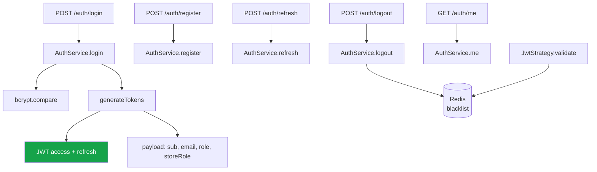
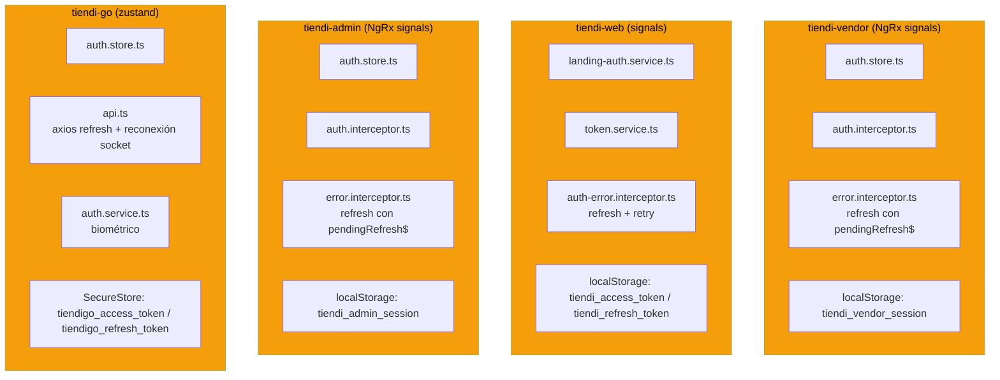
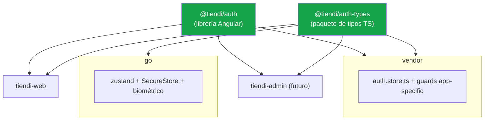

---
tags:
  - tiendi
  - autenticacion
  - arquitectura
  - jwt
  - seguridad
  - aplicaciones
aliases:
  - Autenticación Tiendi
  - Sistema de Autenticación
  - Login unificado
  - Auth vendor web go admin
---

# Autenticación — Sistema unificado (vendor · web · go · admin)

Este documento es la **fuente única de verdad** para la autenticación de la plataforma: cómo se emite un token, dónde se guarda la sesión, quién valida el acceso y dónde vive el código en cada una de las cuatro aplicaciones — `tiendi-vendor`, `tiendi-web`, `tiendi-go` y `tiendi-admin`.

> [!NOTE]
> Parte de lo descrito es **estado actual verificado contra el código** y parte es **norte de diseño** (marcado 🔲). Lo ya implementado está marcado ✅.

---

## Índice

1. [Objetivo y alcance](#1-objetivo-y-alcance)
2. [La distinción fundamental](#2-la-distinción-fundamental)
3. [Estado actual — backend (ya unificado)](#3-estado-actual--backend-ya-unificado)
4. [Estado actual — frontend (duplicado)](#4-estado-actual--frontend-duplicado)
5. [Deuda detectada](#5-deuda-detectada)
6. [La frontera que NO se unifica](#6-la-frontera-que-no-se-unifica)
7. [Diseño objetivo — tres capas](#7-diseño-objetivo--tres-capas)
8. [Precedente en el repo](#8-precedente-en-el-repo)
9. [Decisiones cerradas](#9-decisiones-cerradas)
10. [Checklist de seguimiento](#10-checklist-de-seguimiento)

---

## 1. Objetivo y alcance

### 1.1 Qué es

Autenticación es el sistema que responde dos preguntas distintas: *"¿quién sos?"* (identidad) y *"¿podés entrar acá?"* (autorización). La primera se comparte; la segunda es por aplicación.

### 1.2 Audiencias

| Audiencia | App | Rol |
|-----------|-----|-----|
| Cliente | `tiendi-web` | `CUSTOMER` |
| Vendedor | `tiendi-vendor` | `STORE_OWNER` / `EMPLOYEE` (+ `storeRole`) |
| Repartidor | `tiendi-go` | `RIDER` |
| Super Admin | `tiendi-admin` | `SUPER_ADMIN` |

---

## 2. La distinción fundamental

> [!IMPORTANT]
> **El mecanismo se comparte; la frontera de roles no.**
>
> Hay dos cosas distintas que no deben mezclarse:
> - **Mecanismo** (kernel compartido): ciclo de vida del token, refresh, storage, tipos de usuario. → **Sí, unificar.**
> - **Autorización** (límites por app): guards, login del admin, biométrico. → **No, no unificar.**

Toda decisión futura sobre auth se resuelve con esa distinción. Si una pieza responde *"¿cómo se emite/guarda/renueva un token?"* es kernel compartido. Si responde *"¿este rol puede entrar a esta pantalla?"* es frontera por app.

---

## 3. Estado actual — backend (ya unificado)

> [!NOTE]
> **El backend ya está unificado y está bien así.** No hay que tocarlo. Una sola superficie de auth sirve a las cuatro apps.



| Endpoint | Propósito |
|----------|-----------|
| `POST /auth/login` | Login por email/password (todas las apps) |
| `POST /auth/register` | Registro de cliente |
| `POST /auth/refresh` | Renovar access token con refresh token |
| `POST /auth/logout` | Blacklist del access token |
| `POST /auth/logout-all` | Logout + intención de invalidar sesiones |
| `GET /auth/me` | Datos del usuario autenticado |
| `POST /auth/forgot-password` | Reset por email (rider) |
| `POST /auth/reset-password` | Reset por token |
| `POST /auth/forgot-password/phone` | OTP por teléfono (rider) |
| `POST /auth/reset-password/phone` | Reset por OTP |

### 3.1 El token

```typescript
// auth.service.ts — generateTokens()
const payload: Record<string, unknown> = { sub: userId, email, role };
if (storeRole) payload['storeRole'] = storeRole;
```

- **Access token**: firmado con `JWT_SECRET`, expira en `JWT_EXPIRES_IN` (default `15m`, `config/env.validation.ts:24`).
- **Refresh token**: firmado con `JWT_REFRESH_SECRET`, expira en `JWT_REFRESH_EXPIRES_IN` (default `30d`, `config/env.validation.ts:26`).
- **Sin `jti`**: el payload no lleva identificador de token. No hay clave sobre la que indexar una revocación selectiva.
- **Blacklist**: logout escribe `blacklist:{token}` en Redis con TTL = vida restante del token. `JwtStrategy.validate` lo consulta.

> [!CAUTION]
> **La blacklist solo cubre el access token, y `refresh()` no la consulta.** `logout()` (`auth.service.ts:123`) blacklistea el access token de 15 min; el refresh token de 30 días queda intacto, y `refresh()` (`auth.service.ts:164`) solo verifica firma y `status`. Un refresh token robado sigue emitiendo access tokens nuevos después del logout.

> [!CAUTION]
> **`logoutAll()` no cierra las demás sesiones.** `auth.service.ts:143` hace exactamente lo mismo que `logout()` más un `logger.log()`. Su propio comentario lo admite — *"solo el access token actual puede ser blacklisted"* — pero después afirma que *"el resto de sesiones expirarán naturalmente al vencer su access token"*, y eso es falso: las otras sesiones llaman a `POST /auth/refresh` y renuevan. El endpoint promete algo que no hace.

### 3.2 El contexto de tienda

```typescript
// auth.service.ts — resolveStoreContext()
if (role === 'STORE_OWNER')  → busca Store por ownerId
if (role === 'EMPLOYEE')     → busca StoreEmployee ACTIVE (storeId + storeRole)
else                          → { storeId: null, storeRole: null }
```

El backend **ya modela** la jerarquía `EMPLOYEE` + `storeRole` (el empleado es un `EMPLOYEE` con un rol dentro de la tienda). Este es el dato que el frontend del vendor re-modela mal (§5).

---

## 4. Estado actual — frontend (duplicado)

Cuatro apps reimplementan el mismo mecanismo con claves de storage, shapes de usuario y lógica de refresh divergentes.



| Pieza | vendor | web | admin | go |
|-------|--------|-----|-------|----|
| Framework | Angular `^21.2.17` | Angular `^21.2.17` | Angular `^21.2.17` | **React `19.2.3`** |
| Store | `auth.store.ts` (NgRx signals) | `landing-auth.service.ts` (signals) | `auth.store.ts` (NgRx signals) | `auth.store.ts` (zustand) |
| Clave storage | `tiendi_vendor_session` | `tiendi_access_token` / `tiendi_refresh_token` | `tiendi_admin_session` | `tiendigo_access_token` / `tiendigo_refresh_token` |
| Refresh en 401 | `error.interceptor.ts` (con `pendingRefresh$`) | `auth-error.interceptor.ts` | `error.interceptor.ts` (con `pendingRefresh$`) | `api.ts` (axios + `reconnectWithToken`) |
| Guard | `vendor.guard` + `role.guard` + `onboarding.guard` | en `landing-auth` | `admin.guard` (`isSuperAdmin`) | biométrico |

`tiendi-go` es la única app no-Angular del inventario. Por eso queda **fuera de la Fase 2**: `@tiendi/auth` es una librería Angular y no puede consumirse desde React. Go entra solo en la Fase 1 (tipos), que es framework-agnóstica. El reparto completo por capas está en §0.4 — la exclusión es de diseño, no un olvido del checklist.

> [!WARNING]
> La lógica de **refresh en 401** está implementada cuatro veces: el vendor comparte un `pendingRefresh$` entre 401 concurrentes; la web reintenta el request original; go además reconecta el socket con el token nuevo. Funciona, pero un cambio de política (ej. rotación de refresh token) hay que replicarlo en cuatro lugares.
>
> El cuarto caso no es una variante: `tiendi-admin` **replica el `pendingRefresh$` del vendor de forma literal** (`core/interceptors/error.interceptor.ts:8`, misma variable a nivel de módulo, mismo comentario). Es copy-paste, no convergencia — y es el argumento más fuerte a favor de la Fase 2: el patrón ya se está propagando solo.

---

## 5. Deuda detectada

### 5.1 Roles desalineados

> [!CAUTION]
> **La desalineación de roles es la deuda más peligrosa del sistema de auth.**
>
> El backend tiene **5 roles**; el frontend del vendor tiene **7**; `tiendi-admin` define su propio tipo con **1**:

| Fuente | Roles |
|--------|-------|
| `tiendi-api/prisma/schema.prisma:14` | `SUPER_ADMIN`, `STORE_OWNER`, `EMPLOYEE`, `CUSTOMER`, `RIDER` |
| `tiendi-vendor/.../user.types.ts` | `STORE_OWNER`, `MANAGER`, `CASHIER`, `WAREHOUSE`, `EMPLOYEE`, `CUSTOMER`, `SUPER_ADMIN` |
| `tiendi-admin/.../types/admin-role.ts` | `SUPER_ADMIN` (tipo `AdminRole`, local, deliberadamente no importado) |

`MANAGER`, `CASHIER` y `WAREHOUSE` **no existen en el backend**: son valores de `storeRole` de un `EMPLOYEE`. El vendor los promueve a `Role` y hace un mapping manual en `role.guard.ts` y `auth.store.ts` (`effectiveRole`). Si mañana cambia el modelo de staff, esta divergencia va a producir permisos otorgados o denegados por error.

`tiendi-admin` diverge en la **dirección opuesta**: en vez de inflar `Role` con valores que el backend no tiene, lo achica a un subconjunto de un solo valor y lo declara como tipo propio. La decisión está escrita en el comentario del archivo — no es un olvido. Confirmarla o revertirla es el primer checkbox de §0.3, y es prerrequisito de la Fase 1.

### 5.2 Código muerto en `tiendi-web`

| Archivo | Problema |
|---------|----------|
| `core/services/auth.service.ts` | Clase vacía (`export class AuthService {}`) |
| `core/models/session.ts` | `UserID: number` — pero los IDs son UUID string |
| `landing-auth.service.ts` (`setSession`) | Escribe 4 claves legacy `HdataTiendiUser`, `HdataTiendiComprador`, `HdataTiendiCompradorId` sin consumidor claro |

### 5.3 Mapeo de usuario duplicado

`mapApiUser` (web), el bloque de mapeo en `auth.store.ts` (vendor), el `toAdminUser` de `auth.store.ts:45` (admin) y el `refreshProfile`/`hydrate` (go) traducen el mismo `ApiAuthResponse` a shapes distintos. Cuatro shapes de "usuario logueado" que deberían ser uno. Peor: `tiendi-admin` declara su **propia** interfaz `ApiAuthResponse` en `core/types/auth.types.ts`, así que ni siquiera el contrato de entrada es compartido — es una copia local que puede quedar desfasada de la API sin que nada lo detecte.

### 5.4 Revocación de sesión inexistente

El backend expone `POST /auth/logout` y `POST /auth/logout-all`, pero ninguno de los dos revoca la sesión. La blacklist de Redis solo cubre el access token de 15 minutos, y el refresh path no la consulta antes de reemitir.

| Síntoma | Causa |
|---------|-------|
| Un refresh token robado sobrevive al logout | `refresh()` (`auth.service.ts:164`) solo verifica firma y `status` — nunca consulta `blacklist:{token}` |
| `logout-all` no cierra las demás sesiones | `logoutAll()` (`auth.service.ts:143`) es idéntico a `logout()` más un `logger.log()`: blacklistea únicamente el access token del dispositivo que llama |
| No hay revocación selectiva posible | El payload de `generateTokens()` (`auth.service.ts:401`) no lleva `jti`, así que no hay clave sobre la que revocar |

El único kill switch real es poner al usuario en `status !== 'ACTIVE'`, que corta todas sus sesiones y también su cuenta. El detalle está en §3.1; el plan de corrección es la Fase 5 del checklist (§10).

> [!WARNING]
> Esta deuda es distinta a 5.1–5.3: no es duplicación de código frontend, es una **promesa incumplida de la API**. El mensaje de respuesta de `logout-all` — *"Las demás sesiones expirarán en breve"* — le dice al usuario que cerró sus sesiones cuando no las cerró. Un usuario que sospecha de un robo de cuenta queda comprometido hasta 30 días.

La corrección acotada de esta deuda — la que hace que `logout-all` cumpla lo que promete sin esperar a la Fase 5 completa — está especificada en [[REVOCACION_SESION]].

---

## 6. La frontera que NO se unifica

> [!CAUTION]
> **No reusar el token del vendedor para el admin.**
>
> El back-office (`tiendi-admin`) necesita **login propio** (`POST /auth/admin/login`) que solo acepte `SUPER_ADMIN` y emita un token con ese claim. Reusar `POST /auth/login` abriría la puerta a que un token de tienda acceda a endpoints admin si un guard falla. Esto ya quedó definido en [[TIENDI_ADMIN]] §7.

Lo que se mantiene por aplicación:

| Pieza | Por qué no se unifica |
|-------|----------------------|
| `vendor.guard` / `role.guard` / `onboarding.guard` | Reglas de acceso del panel del vendedor |
| `admin.guard` (futuro) | Reglas del back-office |
| Biométrico de `tiendi-go` | Depende de `expo-local-authentication` |
| `POST /auth/admin/login` | Frontera de rol, no de mecanismo |

---

## 7. Diseño objetivo — tres capas



| Capa | Qué contiene | Quién la consume |
|------|--------------|------------------|
| **1. `@tiendi/auth-types`** | `Role`, `User`, `AuthSession`, `ApiAuthResponse` — una sola fuente de verdad | Las 4 apps (incluso go, son solo types) |
| **2. `@tiendi/auth`** (Angular) | `TokenService`, interceptores (attach + refresh) — **sin store** (A3) | vendor + web + admin |
| **3. Adapter RN** | Solo importa `auth-types`; conserva zustand + SecureStore + biométrico | go |

> [!IMPORTANT]
> **No una sola librería para todo.** vendor y web son Angular 21 standalone; go es React Native + zustand + axios. Solo los **tipos** son transportables entre ecosistemas. El runtime no. La capa 3 es un adapter, no una librería compartida.

### 7.1 El beneficio real de la capa 1

Extraer `Role` a un paquete de tipos **mata la desalineación de roles de raíz**: un solo enum, consumido por backend (vía contrato de API) y frontend. El `storeRole` deja de ser promovido a `Role` en el vendor; pasa a ser un campo explícito y distinto.

---

## 8. Precedente en el repo

> [!NOTE]
> El patrón de "librería construida + file: dep" ya existe. El vendor consume:
>
> ```json
> // tiendi-vendor/package.json
> "@tiendi/chat": "file:../tiendi-web/dist/ng-chat-tiendi"
> ```
>
> No hay workspace tool (`nx.json`, `turbo.json`, `pnpm-workspace.yaml` no existen). El ecosistema actual son carpetas hermanas con dependencias `file:` sobre build outputs. `@tiendi/auth-types` y `@tiendi/auth` encajan en ese mismo patrón sin introducir infraestructura nueva.

---

## 9. Decisiones cerradas

| # | Decisión | Respuesta | Evidencia |
|---|----------|-----------|-----------|
| **A1** | ¿Introducir workspace tool (Nx/Turborepo)? | ✅ **No todavía — mantener `file:`** | No existe `nx.json`, `turbo.json`, `pnpm-workspace.yaml` ni `lerna.json` en ningún repo del ecosistema. El patrón `file:` ya está en producción (`@tiendi/chat`, §8). Un workspace tool es un proyecto en sí mismo |
| **A2** | ¿Alcance de `@tiendi/auth-types`? | ✅ **Solo tipos, cero dependencias de runtime** | Ni `tiendi-vendor` ni `tiendi-web` tienen `zod` instalado. Solo lo tienen `tiendi-api` (`^4.3.6`) y `tiendi-go` (`^4.4.3`), ya desalineados entre sí. Incluir validadores Zod agregaría una dependencia de runtime a dos apps Angular y obligaría a resolver ese skew primero |
| **A3** | ¿`@tiendi/auth` incluye el store base o solo token + interceptores? | ✅ **Solo token + interceptores** | `tiendi-web` **no tiene auth store**. Su autenticación vive en `core/services/auth.service.ts` y `features/landing/services/landing-auth.service.ts`; sus `signalStore` son de dominio (`cart`, `products`, `category`). Un store base obligaría a web a adoptar una pieza que hoy deliberadamente no tiene |
| **A4** | ¿Refresh token con rotación? | ✅ **Stateless hoy — rotación es prerrequisito de `tiendi-admin`** | `auth.service.ts:164` verifica la firma, chequea `status === 'ACTIVE'` y reemite. No hay tabla de refresh tokens, ni reuse-detection, ni lista de revocación. El payload de `generateTokens()` (`auth.service.ts:401`) no lleva `jti`, y la blacklist de Redis no cubre el refresh path (§3.1) |

> [!NOTE]
> **A2 revierte la recomendación del borrador.** El borrador proponía tipos + validadores Zod apoyándose en que "el backend ya usa Zod". Es cierto del backend, pero irrelevante para el frontend: las dos apps Angular no lo tienen. La decisión también mantiene coherencia con §7 — *"Solo los tipos son transportables entre ecosistemas. El runtime no."*

> [!NOTE]
> **A3 conserva la conclusión pero corrige el argumento.** El borrador justificaba con *"NgRx signals vs signals"*, sugiriendo stacks distintos. No lo son: vendor usa `@ngrx/signals ^21.1.0` y web `^21.1.1` — la misma librería, casi la misma versión. La razón real es la ausencia de store en web, no una diferencia de stack.

> [!CAUTION]
> **A4 deja de ser opcional cuando exista `tiendi-admin`.** Hoy un refresh token filtrado vive **30 días** (default de `JWT_REFRESH_EXPIRES_IN`) y el único kill switch real es desactivar al usuario: ni `logout` ni `logout-all` lo invalidan (§3.1). Mientras el token más peligroso sea de un `STORE_OWNER`, el radio de daño es una tienda. Un refresh token de `SUPER_ADMIN` sin revocación es la plataforma entera, durante un mes. La rotación con reuse-detection es **bloqueante para la Fase 2 de [[TIENDI_ADMIN]]** (login de Super Admin), no una mejora posterior.

---

## 10. Checklist de seguimiento

> [!TIP]
> Las Fases 1 a 4 son independientes **entre sí** y pueden ejecutarse en paralelo por personas distintas. Todas dependen de la Fase 0. Dentro de ese conjunto, la Fase 1 (tipos) es la de mayor valor por menor costo: elimina la desalineación de roles sin tocar runtime.

### Fase 0 — Prerrequisitos de infraestructura (bloqueante)

> [!IMPORTANT]
> **Ninguna fase posterior arranca sin esto.** Las Fases 1 y 2 crean paquetes compartidos que hoy no tienen dónde vivir ni cómo distribuirse, y una de las cuatro apps involucradas no está en control de versiones. No es trabajo de análisis: son cuatro decisiones y un repo que falta crear.

#### 0.1 Decidir el mecanismo de distribución de los paquetes

`FUENTES/` **no es un monorepo**. No hay `package.json` raíz, ni `nx.json`, ni `lerna.json`, ni `pnpm-workspace.yaml`. Los paquetes `@tiendi/auth-types` (Fase 1) y `@tiendi/auth` (Fase 2) no tienen hoy infraestructura donde publicarse ni desde donde consumirse.

| Opción | Costo inicial | Costo por release | Nota |
|--------|---------------|-------------------|------|
| Workspace `pnpm`/`npm` en `FUENTES/` | Alto — reestructurar los repos y unificar su versionado | Nulo (resolución local) | Choca con que hoy cada app vive en un repo distinto (0.2) |
| Registry privado (npm / GitHub Packages) | Medio — CI de publicación + credenciales en cada consumidor | Publicar versión + bump en cada app | Es el único que sirve si los repos siguen separados |
| Dependencia `git` por tag | Bajo | Manual: tag + bump en cada app | Sin build step publicado; cada consumidor compila el fuente |

- [ ] Elegir el mecanismo y registrar la decisión en §9
- [ ] Dejar creado el scaffolding y un paquete vacío **ya consumible** por al menos una app
- [ ] Documentar el flujo de release (quién publica, con qué versión, cómo se consume)

#### 0.2 Poner `tiendi-admin` en control de versiones

Estado verificado con `git ls-files`:

| Repositorio | Archivos trackeados | Mecanismo |
|-------------|---------------------|-----------|
| `tiendi-api` | — | Submódulo (`.gitmodules`) |
| `tiendi-web` | — | Submódulo (`.gitmodules`) |
| `tiendi-vendor` | 470 | Archivos planos en el repo padre |
| `tiendi-go` | 151 | Archivos planos en el repo padre |
| `tiendi-admin` | **0** | **Ninguno** |

`tiendi-admin` no es submódulo, no está trackeado como archivos planos y **tampoco figura en `.gitignore`**. Existe únicamente en el disco local de quien lo creó.

> [!WARNING]
> Otro equipo **no puede clonar** la app que este checklist le pide modificar. Además, el mecanismo de versionado es inconsistente entre repos: dos submódulos y dos árboles de archivos planos. Conviene unificarlo en esta fase, no después de haber migrado tipos.

- [ ] Crear el repo remoto de `tiendi-admin` y registrarlo (submódulo, o el mecanismo que se unifique)
- [ ] Decidir si `tiendi-vendor` y `tiendi-go` pasan también a submódulo, o si los cuatro van a workspace (0.1)

#### 0.3 Incorporar `tiendi-admin` al inventario de deuda

§4 y §5.1 inventarían **tres** apps con auth duplicada. Son **cuatro**: `tiendi-admin` ya existe, ya tiene store, ambos interceptores, guard y tipos propios.

```
tiendi-admin/src/app/admin/core/types/admin-role.ts   → AdminRole
tiendi-admin/src/app/admin/core/types/auth.types.ts   → AdminUser, AdminSession, ApiAuthResponse
tiendi-admin/src/app/admin/core/auth/auth.store.ts
tiendi-admin/src/app/admin/core/auth/admin.guard.ts
tiendi-admin/src/app/admin/core/interceptors/auth.interceptor.ts
tiendi-admin/src/app/admin/core/interceptors/error.interceptor.ts
```

> [!CAUTION]
> `admin-role.ts` documenta en su propio comentario la decisión **contraria** a la Fase 1: *"Rol propio de tiendi-admin, definido localmente y NO importado del vendor."* Eso no es un olvido — es una decisión ya tomada en código que este documento nunca registró. Hay que confirmarla o revertirla **antes** de extraer `@tiendi/auth-types`, no durante.

- [ ] Decidir: ¿`AdminRole` se absorbe en el `Role` unificado (es un subconjunto: hoy solo `SUPER_ADMIN`), o queda como tipo separado igual que `StoreRole` (A1)?
- [x] Actualizar §4 y §5.1 para inventariar las cuatro apps
- [x] Agregar las filas de `tiendi-admin` a la tabla "Archivos afectados"
- [x] Verificar si el `error.interceptor.ts` de admin ya duplica el refresh concurrente que la Fase 2 va a centralizar — **verificado: sí**, es copy-paste literal del vendor (`error.interceptor.ts:8`). Ver el WARNING de §4

#### 0.4 Registrar que `tiendi-go` no es Angular

`tiendi-go` es **React 19.2.3**. El diseño de tres capas (§7) ya lo contempla correctamente — go consume solo la capa de tipos, nunca la librería Angular — pero el documento nunca lo dice de forma explícita, y el checklist de la Fase 2 pide *"reusar la librería en vendor y web"* sin justificar la exclusión.

| App | Framework | Capa 1 (`@tiendi/auth-types`) | Capa 2 (`@tiendi/auth`, Angular) |
|-----|-----------|-------------------------------|----------------------------------|
| `tiendi-vendor` | Angular `^21.2.17` | Sí | Sí |
| `tiendi-web` | Angular `^21.2.17` | Sí | Sí |
| `tiendi-admin` | Angular `^21.2.17` | Sí | Sí |
| `tiendi-go` | **React `19.2.3`** | Sí | **No — no aplica** |

> [!NOTE]
> **Hallazgo favorable, verificado**: las tres apps Angular están en la misma versión (`^21.2.17`). Una librería Angular compartida no tiene conflicto de `peerDependencies`. No hace falta re-verificarlo.

- [x] Anotar el framework de cada app en §4 para que la exclusión de go quede explícita — **hecho**: fila `Framework` en la tabla comparativa de §4 + párrafo que justifica por qué go no entra en la Fase 2

#### Criterio de salida de la Fase 0

La Fase 1 puede abrirse cuando: (a) existe un paquete vacío instalable desde al menos una app, (b) `tiendi-admin` se puede clonar desde el remoto, (c) está decidido el destino de `AdminRole`.

### Fase 1 — Extraer `@tiendi/auth-types`

- [ ] Crear paquete `@tiendi/auth-types` con `Role`, `User`, `AuthSession`, `ApiAuthResponse`
- [ ] El paquete no declara **ninguna dependencia de runtime** — solo tipos (A2)
- [ ] Definir `Role` alineado al backend (5 roles) y `StoreRole` separado
- [ ] Definir `User` con `storeRole` explícito (no promovido a `Role`)
- [ ] Migrar `user.types.ts` del vendor al paquete
- [ ] Migrar los tipos de `landing-auth.service.ts` de web al paquete
- [ ] Migrar los tipos de auth de go al paquete
- [ ] Test: el compilador no deja asignar un `StoreRole` a un `Role`
- [ ] Test: el build del paquete no arrastra `zod` ni ningún otro runtime (A2)

### Fase 2 — Extraer `@tiendi/auth` (Angular)

- [ ] Crear librería Angular `@tiendi/auth` con `TokenService`
- [ ] Portar `auth.interceptor.ts` (attach de Bearer) a la librería
- [ ] Portar `error.interceptor.ts` (refresh con `pendingRefresh$`) a la librería
- [ ] Reusar la librería en vendor y web
- [ ] Test: refresh concurrente en 401 comparte una sola llamada (vendor y web)
- [ ] Test: la librería **no exporta store** — cada app conserva el suyo, y web sigue sin tener uno (A3)

### Fase 3 — Limpiar deuda legacy

- [ ] Eliminar `auth.service.ts` vacío de web
- [ ] Eliminar o migrar `session.ts` (`UserID: number` obsoleto)
- [ ] Eliminar las 4 claves legacy `HdataTiendi*`
- [ ] Unificar el shape de "usuario logueado" en las 3 apps

### Fase 4 — Mantener app-specific

- [ ] Verificar que los guards del vendor siguen en el vendor (no en la librería)
- [ ] Verificar que el biométrico de go sigue en go
- [ ] Registrar `POST /auth/admin/login` como frontera separada ([[TIENDI_ADMIN]] §7)

### Fase 5 — Rotación de refresh (bloqueante para `tiendi-admin`)

> [!CAUTION]
> No se arranca hoy, pero **bloquea la Fase 2 de [[TIENDI_ADMIN]]**: no se emite el primer token de `SUPER_ADMIN` sin esto (A4).

> [!NOTE]
> **Existe una mitigación previa desplegable ya**: un corte por usuario en Redis (`auth:revoked_before:{userId}`) comparado contra el `iat` del token. Hace que `logout-all` revoque de verdad, sin `jti`, sin migración y sin rotación. No reemplaza esta fase — le saca la urgencia. Spec completa en [[REVOCACION_SESION]].

- [ ] Backend: agregar `jti` al payload de `generateTokens()` — hoy no existe, y sin él no hay clave sobre la que revocar
- [ ] Backend: persistir refresh tokens (`jti`, `userId`, expiración, estado, familia)
- [ ] Backend: rotar en cada `POST /auth/refresh` e invalidar el token consumido
- [ ] Backend: reuse-detection — un token ya consumido revoca la familia completa
- [ ] Backend: revocación manual por usuario (kill switch sin desactivar la cuenta)
- [ ] Backend: que `refresh()` consulte la revocación antes de reemitir (hoy no la consulta, §3.1)
- [ ] Backend: que `logoutAll()` revoque todas las familias del usuario (hoy es un no-op, §3.1)
- [ ] Test: reusar un refresh token consumido corta la sesión entera
- [ ] Test: revocar a un `SUPER_ADMIN` corta el acceso sin esperar la expiración
- [ ] Test: después de `logout-all`, el refresh token de otro dispositivo deja de emitir access tokens

### Criterios de aceptación

- [ ] Un solo `Role` (5 valores) consumido por las 4 apps
- [ ] `storeRole` no se confunde con `Role`
- [ ] Un token de vendedor no puede acceder a endpoints admin
- [ ] La lógica de refresh no está duplicada en vendor y web
- [ ] go importa tipos compartidos sin arrastrar runtime Angular
- [ ] `@tiendi/auth-types` no agrega dependencias de runtime a ninguna app (A2)
- [ ] Ningún token de `SUPER_ADMIN` se emite antes de que exista rotación con reuse-detection (A4)

---

## Referencias

- [[TIENDI_ADMIN]] — back-office; §7 define la frontera de login admin
- [[NOTIFICACIONES]] — sistema de notificaciones (mismo patrón de doc: estado actual + norte)
- [[FACTURACION_Y_CONTABILIDAD]] — §10 documenta la deuda de roles desalineados
- [[MODULOS_SISTEMA_TIENDI]] — roles y RBAC (conceptual)
- [[REVOCACION_SESION]] — spec de la mitigación de `logout-all` (§5.4, Fase 5)

### Archivos afectados (estado objetivo)

| Repositorio | Archivo | Cambio |
|-------------|---------|--------|
| `tiendi-vendor` | `core/types/user.types.ts` | Migrar a `@tiendi/auth-types` |
| `tiendi-vendor` | `core/services/auth.store.ts` | Importar tipos; conservar store |
| `tiendi-vendor` | `core/interceptors/*.ts` | Migrar a `@tiendi/auth` |
| `tiendi-web` | `core/services/landing-auth.service.ts`, `token.service.ts` | Migrar a `@tiendi/auth` |
| `tiendi-web` | `core/services/auth.service.ts`, `core/models/session.ts` | Eliminar |
| `tiendi-go` | `stores/auth.store.ts`, `services/auth.service.ts` | Importar `@tiendi/auth-types` |
| `tiendi-admin` | `core/types/admin-role.ts`, `core/types/auth.types.ts` | Migrar a `@tiendi/auth-types` **o** mantener local — decidir en §0.3 |
| `tiendi-admin` | `core/auth/auth.store.ts` | Importar tipos; conservar store |
| `tiendi-admin` | `core/interceptors/*.ts` | Migrar a `@tiendi/auth` — elimina la duplicación literal del `pendingRefresh$` |
| `tiendi-api` | `src/modules/auth/**` | Sin cambios para la unificación de tipos (ya unificado) |
| `tiendi-api` | `src/modules/auth/auth.service.ts`, `strategies/jwt.strategy.ts` | Revocación de sesión — ver [[REVOCACION_SESION]] |
