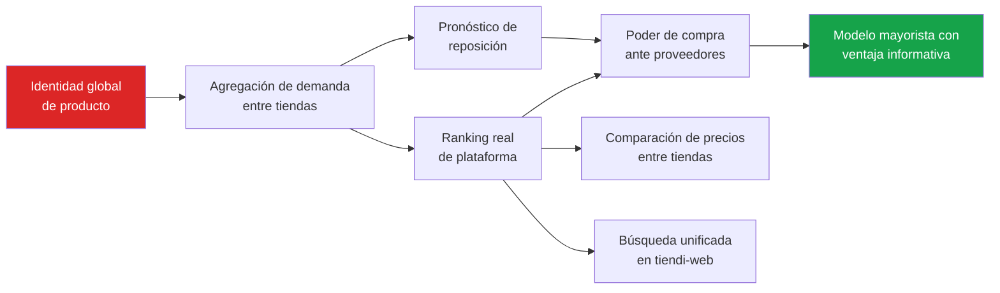
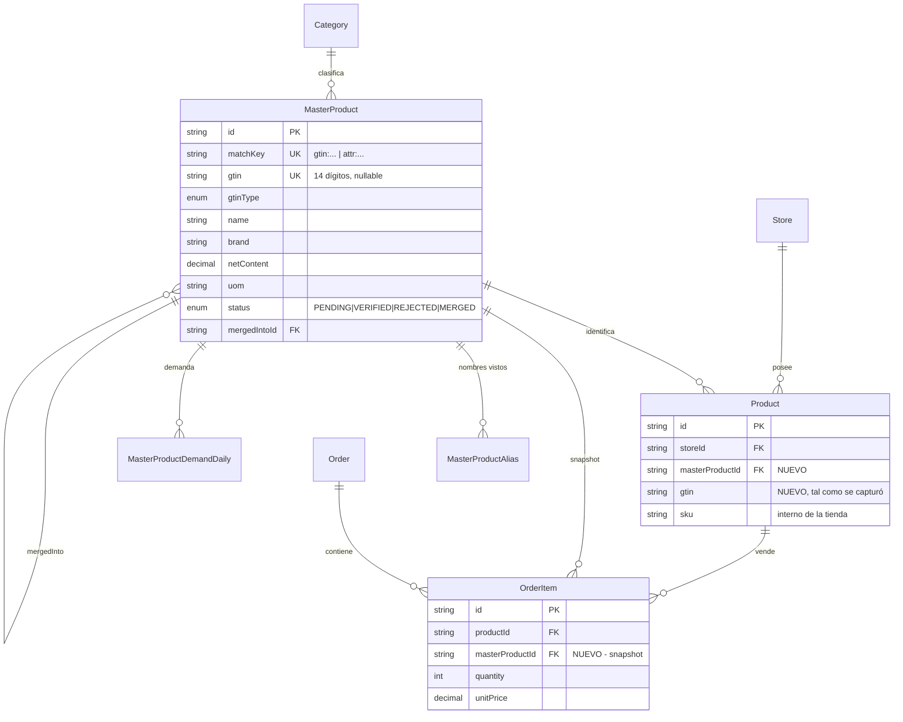
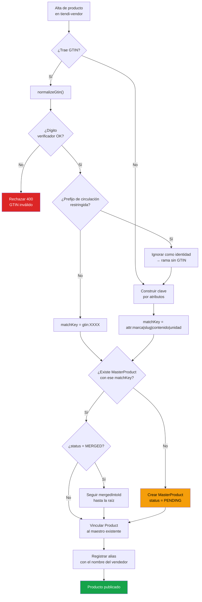
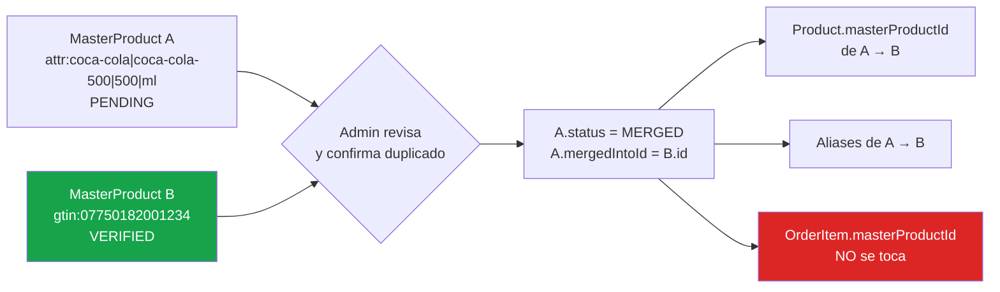
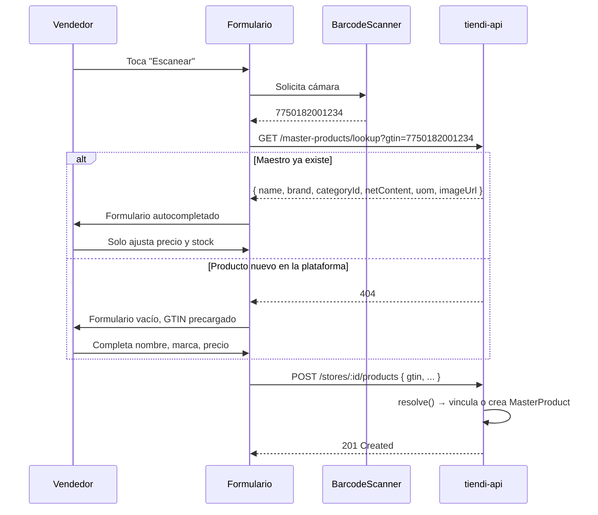
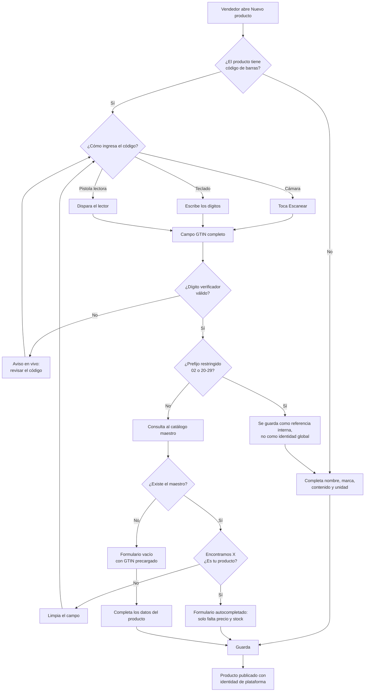
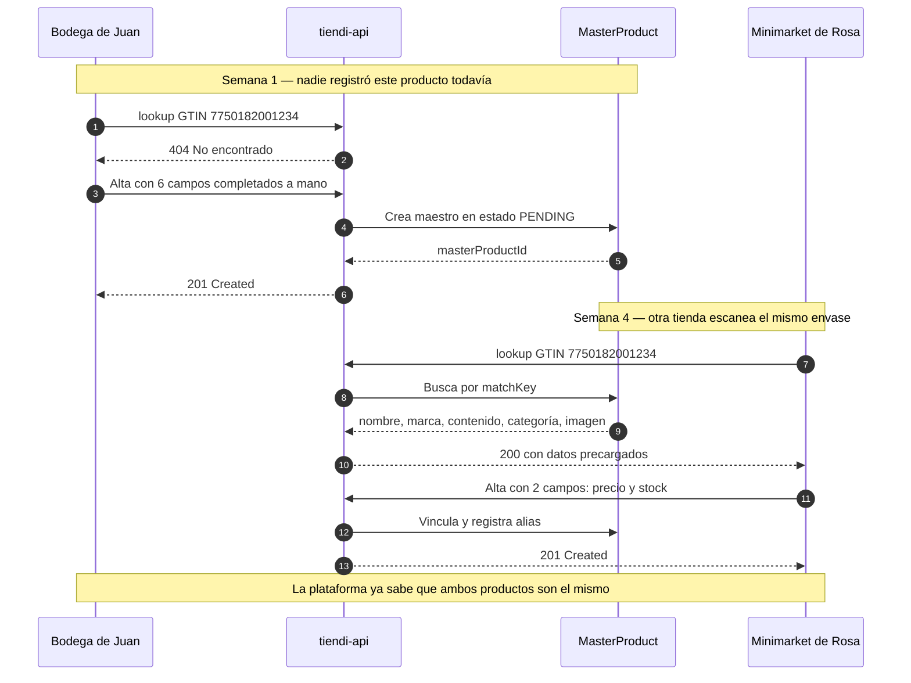
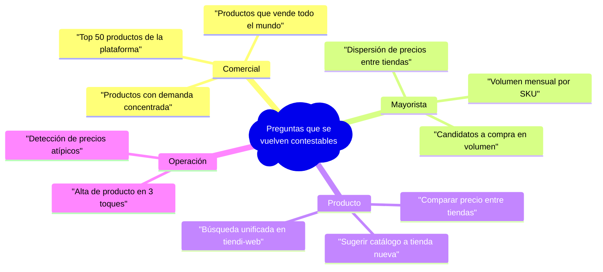
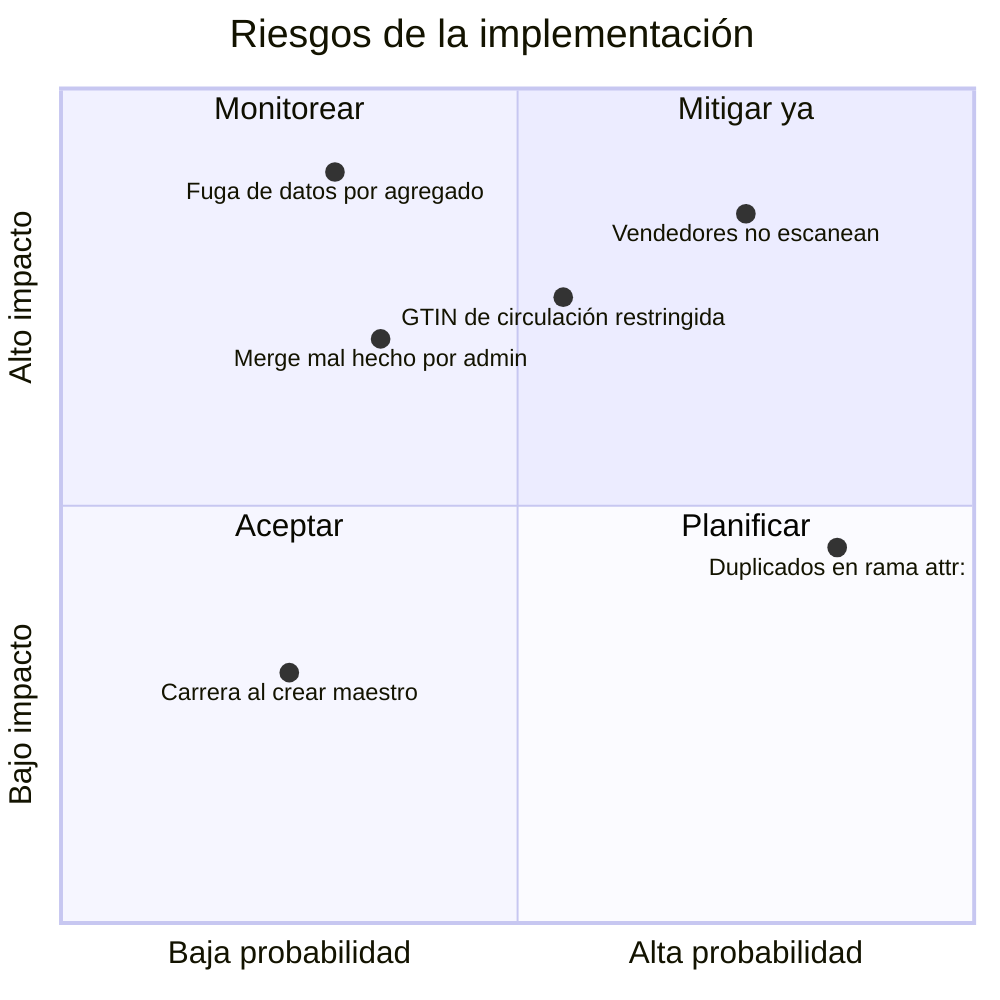

---
tags:
  - tiendi
  - catalogo-maestro
  - gtin
  - prisma
  - implementacion
  - urgente
aliases:
  - Catálogo Maestro Tiendi
  - MasterProduct GTIN
  - Implementación A1
---

# Catálogo Maestro de Productos (`MasterProduct` + GTIN)

> [!CAUTION]
> **Este documento implementa la acción A1 de [[MODELO_NEGOCIO#12.1 Acciones urgentes|MODELO_NEGOCIO §12.1]] — pendiente urgente, prioridad máxima.**
>
> Sin catálogo maestro la plataforma no puede responder *"¿qué se vende más?"*, y sin esa respuesta el modelo mayorista no tiene fundamento técnico.

> [!IMPORTANT]
> **Estado: pre-lanzamiento.** No hay tiendas activas ni productos reales en producción.
> Esto elimina la etapa más cara del proyecto: la resolución de identidad retroactiva sobre miles de productos ya cargados con nombres libres.
> **Es el momento más barato posible para hacer esto, y no vuelve.**

---

## Índice

1. [Objetivo y alcance](#1-objetivo-y-alcance)
2. [Qué es un GTIN y por qué es la clave correcta](#2-qué-es-un-gtin-y-por-qué-es-la-clave-correcta)
3. [Estado actual del código](#3-estado-actual-del-código)
4. [Modelo de datos propuesto](#4-modelo-de-datos-propuesto)
5. [Estrategia de resolución de identidad](#5-estrategia-de-resolución-de-identidad)
6. [Backend: módulo `master-catalog`](#6-backend-módulo-master-catalog)
7. [Captura en el panel del vendedor](#7-captura-en-el-panel-del-vendedor)
8. [Agregación de demanda](#8-agregación-de-demanda)
9. [Migración y despliegue](#9-migración-y-despliegue)
10. [Riesgos y decisiones abiertas](#10-riesgos-y-decisiones-abiertas)
11. [Checklist de seguimiento](#11-checklist-de-seguimiento)
12. [Glosario y referencias](#12-glosario-y-referencias)

---

## 1. Objetivo y alcance

### 1.1 El problema en una frase

Hoy `Product` pertenece a **una** tienda. Tres tiendas que venden Coca-Cola 500 ml producen tres filas sin ninguna relación entre sí. No existe un identificador compartido que permita afirmar *"estas tres filas son el mismo producto del mundo real"*.

### 1.2 Qué habilita resolverlo



### 1.3 Alcance

| Incluye | No incluye |
|---------|------------|
| Modelo de datos `MasterProduct` y relaciones | Modelos `Supplier` / `PurchaseOrder` (fase mayorista posterior) |
| Normalización y validación de GTIN | Gestión de inventario propio |
| Captura del código en el alta de producto | Precios de compra y negociación con proveedores |
| Resolución de identidad y deduplicación | Crédito de reposición a tiendas |
| Vistas de demanda agregada | Motor de recomendación |

> [!NOTE]
> El alcance está acotado a **crear la capa de identidad**. Todo lo demás del modelo mayorista se apoya sobre esto, pero no debe mezclarse en la misma entrega.

---

## 2. Qué es un GTIN y por qué es la clave correcta

### 2.1 Definición

**GTIN** (*Global Trade Item Number*) es el identificador numérico global de GS1 para artículos comerciales. Es el número impreso bajo el código de barras de cualquier producto empaquetado.

| Formato | Dígitos | Uso típico |
|---------|---------|------------|
| GTIN-8 (EAN-8) | 8 | Empaques muy pequeños |
| GTIN-12 (UPC-A) | 12 | Estados Unidos y Canadá |
| GTIN-13 (EAN-13) | 13 | **Estándar en Perú y Latinoamérica** |
| GTIN-14 (ITF-14) | 14 | Caja o embalaje de agrupación |

### 2.2 Por qué GTIN y no el `sku`

| Criterio | `sku` actual | GTIN |
|----------|--------------|------|
| Unicidad global | ✗ Ninguna, texto libre | ✓ Garantizada por GS1 |
| Compartido entre tiendas | ✗ Cada tienda inventa el suyo | ✓ Mismo número en todo el mundo |
| Verificable | ✗ Imposible | ✓ Dígito verificador módulo 10 |
| Capturable sin tipear | ✗ | ✓ Escaneo de código de barras |
| Comparable con proveedores | ✗ | ✓ Es el idioma del mayorista |

> [!TIP]
> El `sku` **no desaparece**. Sigue siendo el código interno de la tienda para su operación. Solo deja de ser candidato a identidad global, rol para el que nunca sirvió.

### 2.3 Normalización canónica

**Regla: todo GTIN se almacena normalizado a 14 dígitos, rellenado con ceros a la izquierda.**

```
EAN-13   7750182001234   →   07750182001234
UPC-A    012345678905    →   00012345678905
EAN-8    96385074        →   00000096385074
```

Así el mismo producto codificado en formatos distintos colapsa en una sola clave. Es la recomendación de GS1 para almacenamiento y matching.

### 2.4 Dígito verificador (módulo 10)

```typescript
export type GtinType = 'GTIN_8' | 'GTIN_12' | 'GTIN_13' | 'GTIN_14';

export interface NormalizedGtin {
  gtin14: string;
  type: GtinType;
}

const LENGTH_TO_TYPE: Record<number, GtinType> = {
  8: 'GTIN_8',
  12: 'GTIN_12',
  13: 'GTIN_13',
  14: 'GTIN_14',
};

/**
 * Normalizes a GTIN to its canonical 14-digit form and validates
 * the mod-10 check digit. Accepts GTIN-8, GTIN-12, GTIN-13 and GTIN-14.
 *
 * @returns The normalized GTIN, or null when the input is invalid.
 */
export function normalizeGtin(raw: string): NormalizedGtin | null {
  const digits = raw.replace(/\D/g, '');
  const type = LENGTH_TO_TYPE[digits.length];
  if (!type) return null;

  const gtin14 = digits.padStart(14, '0');
  const payload = gtin14.slice(0, 13);
  const checkDigit = Number(gtin14[13]);

  // Weights 3 and 1 alternate, starting with 3 on the rightmost payload digit.
  let sum = 0;
  for (let i = 0; i < 13; i++) {
    const weight = (13 - i) % 2 === 1 ? 3 : 1;
    sum += Number(payload[i]) * weight;
  }

  const expected = (10 - (sum % 10)) % 10;
  return expected === checkDigit ? { gtin14, type } : null;
}
```

> [!WARNING]
> **Un GTIN con dígito verificador inválido debe rechazarse en el alta.** Aceptarlo crea una identidad falsa que contamina toda la agregación y limpiarla después cuesta un orden de magnitud más que prevenirla.

### 2.5 Prefijos que NO son identidad global

| Prefijo | Significado | Tratamiento |
|---------|-------------|-------------|
| `2`, `02`, `20`–`29` | **Circulación restringida** — numeración interna de tienda (típico en balanzas de pesables) | Rechazar como identidad global; tratar como producto sin GTIN |
| `977` | Publicaciones seriadas (ISSN) | Válido, pero no es consumo masivo |
| `978`, `979` | Libros (ISBN) | Válido |
| `775` | **GS1 Perú** | Válido y esperado en producto local |

```typescript
const RESTRICTED_PREFIXES = ['02', '20', '21', '22', '23', '24', '25', '26', '27', '28', '29'];

/**
 * Restricted-circulation codes are only unique inside a single retailer.
 * They must never be promoted to a platform-wide identity.
 */
export function isRestrictedCirculation(gtin14: string): boolean {
  const ean13 = gtin14.slice(1); // drop the canonical padding digit
  return RESTRICTED_PREFIXES.some((prefix) => ean13.startsWith(prefix));
}
```

> [!CAUTION]
> El prefijo de circulación restringida es la trampa más común. Una balanza de supermercado imprime un código que *parece* EAN-13 y *pasa* la validación de dígito verificador, pero solo es único dentro de esa tienda. Si se acepta como GTIN, dos tiendas distintas terminan compartiendo la identidad de productos que no tienen nada que ver.

### 2.6 Productos que legítimamente no tienen GTIN

Fruta a granel, comida preparada, panadería, artesanías. **Son una porción real del catálogo de una bodega y no pueden quedar fuera del sistema.**

La solución es que el GTIN no sea la clave primaria, sino una **clave de matching** que lo use cuando existe y caiga a atributos cuando no:

```
matchKey = "gtin:07750182001234"
matchKey = "attr:coca-cola|gaseosa-cola|500|ML"
```

---

## 3. Estado actual del código

> [!NOTE]
> Todo lo de esta sección está verificado contra el código actual, no es supuesto.

### 3.1 `Product` es de tienda, no de plataforma

`tiendi-api/prisma/schema.prisma:206`

```prisma
model Product {
  id          String    @id @default(uuid())
  storeId     String                        // ← el producto pertenece a UNA tienda
  store       Store     @relation(fields: [storeId], references: [id])
  categoryId  String?

  name             String
  brand            String?                  // ← opcional, texto libre
  sku              String?                  // ← opcional, texto libre, sin validación
  unit             String?
  price            Decimal  @db.Decimal(10, 2)
  stock            Int      @default(0)

  @@unique([storeId, slug])                 // ← unicidad SOLO dentro de la tienda
  @@index([storeId])
}
```

**No existe ningún campo que relacione el producto de una tienda con el mismo producto en otra.**

### 3.2 El alta no captura ningún identificador global

`tiendi-api/src/modules/products/dto/create-product.dto.ts`

```typescript
export const CreateProductSchema = z.object({
  name: z.string().min(2).max(100),
  brand: z.string().optional(),
  sku: z.string().optional(),      // ← sin formato, sin validación, sin unicidad
  price: z.number().positive(),
  // ...
});
```

`tiendi-api/src/modules/products/products.service.ts:118`

```typescript
const product = await this.prisma.product.create({
  data: { ...dto, slug, storeId, price: dto.price, salePrice: dto.salePrice ?? null },
});
```

> [!TIP]
> El `...dto` significa que **cualquier campo agregado al schema Zod fluye automáticamente a Prisma**. Conveniente, pero peligroso acá: el GTIN necesita normalizarse y resolverse *antes* del spread. Hay que ser explícito y extraerlo del DTO.

### 3.3 La analítica de top productos está sin implementar

`tiendi-api/src/modules/analytics/analytics.service.ts:258`

```typescript
async getTopProducts(..._args: unknown[]) {
  this.logger.warn('getTopProducts not implemented');
  return [];
}

async getCategories(..._args: unknown[]) {
  this.logger.warn('getCategories not implemented');
  return [];
}
```

El endpoint `GET /stores/:storeId/analytics/top-products` existe, está ruteado y responde `200`, pero **siempre devuelve un array vacío**. El panel del vendedor está consumiendo un stub.

> [!WARNING]
> No solo falta la agregación de plataforma: **falta la agregación por tienda**. Esto es una oportunidad — implementar ambas sobre `masterProductId` en la misma entrega cuesta apenas más que implementar solo una.

### 3.4 El frontend ya declara un campo que el backend no tiene

`tiendi-vendor/src/app/vendor/core/types/product.types.ts`

```typescript
export interface Product {
  sku: string | null;
  barcode: string | null;      // ← NO existe en el schema de Prisma
  trackStock: boolean;         // ← tampoco existe
  variants: ProductVariant[];  // ← tampoco existe
}
```

El tipo del vendor está desincronizado con la API. `barcode` es exactamente el campo que hace falta, pero hoy es una promesa sin respaldo. Conviene reemplazarlo por `gtin`, con semántica explícita, en lugar de arrastrar el nombre ambiguo.

### 3.5 Resumen del estado

| Pieza | Existe | Comentario |
|-------|--------|------------|
| Identidad global de producto | ❌ | Núcleo del problema |
| Captura de código de barras | ❌ | Ni backend ni UI |
| Validación de GTIN | ❌ | — |
| Deduplicación entre tiendas | ❌ | — |
| Top productos **por tienda** | ⚠️ | Endpoint existe, servicio es stub |
| Top productos **de plataforma** | ❌ | Ni siquiera hay endpoint |
| `OrderItem` con identidad estable | ❌ | Solo `productId` de tienda |
| Índice `OrderItem.productId` | ❌ | Falta; hoy solo hay `@@index([orderId])` |

---

## 4. Modelo de datos propuesto

### 4.1 Diagrama de entidades



### 4.2 `MasterProduct`

```prisma
enum GtinType {
  GTIN_8
  GTIN_12
  GTIN_13
  GTIN_14
}

enum MasterProductStatus {
  PENDING   // Creado automáticamente, sin revisión humana
  VERIFIED  // Revisado por admin — datos confiables
  REJECTED  // Basura o duplicado irrecuperable, no agregar
  MERGED    // Absorbido por otro maestro; ver mergedIntoId
}

enum MasterProductSource {
  VENDOR  // Creado al alta de un producto de tienda
  ADMIN   // Creado o corregido manualmente en el panel admin
  IMPORT  // Carga masiva desde archivo
  GS1     // Enriquecido desde un catálogo externo
}

/// Identidad global de un producto del mundo real, compartida entre tiendas.
model MasterProduct {
  id String @id @default(uuid())

  /// Clave de resolución. "gtin:<14 dígitos>" cuando hay código de barras,
  /// "attr:<marca>|<slug>|<contenido>|<unidad>" cuando no lo hay.
  matchKey String @unique

  gtin     String?   @unique // Canónico a 14 dígitos
  gtinType GtinType?

  name       String
  brand      String?
  netContent Decimal? @db.Decimal(10, 3) // 500, 1.5, 250
  uom        String?                     // ML, L, G, KG, UN
  imageUrl   String?

  categoryId String?
  category   Category? @relation(fields: [categoryId], references: [id])

  status       MasterProductStatus @default(PENDING)
  source       MasterProductSource @default(VENDOR)

  /// Cuando status = MERGED, apunta al maestro que lo absorbió.
  mergedIntoId String?
  mergedInto   MasterProduct?  @relation("MasterProductMerge", fields: [mergedIntoId], references: [id])
  mergedFrom   MasterProduct[] @relation("MasterProductMerge")

  products    Product[]
  orderItems  OrderItem[]
  aliases     MasterProductAlias[]
  demandDaily MasterProductDemandDaily[]

  createdAt DateTime @default(now())
  updatedAt DateTime @updatedAt

  @@index([status])
  @@index([categoryId])
  @@index([brand])
  @@index([mergedIntoId])
}
```

> [!IMPORTANT]
> `matchKey` es `@unique` y es **la única puerta de entrada** para resolver identidad. `gtin` también es `@unique`, pero es nullable: los productos sin código de barras conviven en la misma tabla usando la variante `attr:`.

### 4.3 `MasterProductAlias`

Cada tienda escribe el nombre a su manera: *"Coca Cola 500"*, *"Gaseosa Coca-Cola 500ml"*, *"COCA COLA PERSONAL"*. Guardar esas variantes convierte el catálogo en un diccionario que mejora con el uso.

```prisma
/// Variantes de nombre observadas para un mismo producto maestro.
/// Alimenta la búsqueda difusa y la sugerencia de coincidencias.
model MasterProductAlias {
  id String @id @default(uuid())

  masterProductId String
  masterProduct   MasterProduct @relation(fields: [masterProductId], references: [id], onDelete: Cascade)

  storeId String? // Tienda donde se observó, para auditoría

  rawName        String // Tal como lo escribió el vendedor
  normalizedName String // Minúsculas, sin acentos, sin puntuación
  occurrences    Int    @default(1)

  createdAt DateTime @default(now())

  @@unique([masterProductId, normalizedName])
  @@index([normalizedName])
}
```

### 4.4 Cambios en `Product`

```prisma
model Product {
  // ... campos existentes sin cambios ...

  /// GTIN tal como lo capturó el vendedor, ya normalizado a 14 dígitos.
  /// Se mantiene en Product además de MasterProduct para auditoría del alta.
  gtin String?

  masterProductId String?
  masterProduct   MasterProduct? @relation(fields: [masterProductId], references: [id])

  // ... relaciones existentes ...

  @@unique([storeId, slug])
  @@unique([storeId, gtin]) // NUEVO: una tienda no publica dos veces el mismo GTIN
  @@index([storeId])
  @@index([categoryId])
  @@index([isActive])
  @@index([masterProductId]) // NUEVO
}
```

> [!WARNING]
> En PostgreSQL, un índice único **permite múltiples `NULL`**. `@@unique([storeId, gtin])` no bloquea que una tienda tenga muchos productos sin GTIN — exactamente el comportamiento que se necesita para pesables y comida preparada.

### 4.5 Cambios en `OrderItem`

```prisma
model OrderItem {
  // ... campos existentes sin cambios ...

  /// Snapshot de la identidad global al momento de la venta.
  /// NO se recalcula: si el maestro del Product se corrige después,
  /// el historial de ventas ya cerrado no debe cambiar retroactivamente.
  masterProductId String?
  masterProduct   MasterProduct? @relation(fields: [masterProductId], references: [id])

  @@index([orderId])
  @@index([productId])         // NUEVO: hoy no existe y ya hacía falta
  @@index([masterProductId])   // NUEVO
}
```

> [!CAUTION]
> **Esta es la decisión de diseño más importante del documento.**
>
> `OrderItem.masterProductId` es un **snapshot denormalizado**, no un dato derivable de `Product`.
>
> Si el ranking se calculara haciendo `join` a `Product.masterProductId`, cada corrección de identidad en el catálogo **reescribiría silenciosamente el historial de ventas**. Un merge de duplicados hecho en agosto cambiaría el ranking de mayo. Eso hace imposible auditar, comparar períodos o confiar en cualquier reporte.
>
> El snapshot se escribe una vez al crear la orden y no se toca más.

### 4.6 `MasterProductDemandDaily`

```prisma
/// Rollup diario de demanda agregada por producto maestro.
/// Se recalcula por job; nunca se escribe en el camino de la orden.
model MasterProductDemandDaily {
  id String @id @default(uuid())

  masterProductId String
  masterProduct   MasterProduct @relation(fields: [masterProductId], references: [id], onDelete: Cascade)

  date DateTime @db.Date

  storeCount   Int     // Tiendas distintas que lo vendieron ese día
  orderCount   Int
  unitsSold    Int
  grossRevenue Decimal @db.Decimal(12, 2)
  avgUnitPrice Decimal @db.Decimal(10, 2)

  createdAt DateTime @default(now())

  @@unique([masterProductId, date])
  @@index([date])
}
```

---

## 5. Estrategia de resolución de identidad

### 5.1 Flujo completo



### 5.2 Construcción del `matchKey`

```typescript
/**
 * Builds the deterministic resolution key for a product.
 *
 * A GTIN always wins. When it is absent or not globally unique, we fall back
 * to a normalized attribute tuple so that unbarcoded items (produce, bakery,
 * prepared food) still get a stable identity.
 */
export function buildMatchKey(input: {
  gtin14: string | null;
  brand: string | null;
  name: string;
  netContent: number | null;
  uom: string | null;
}): string {
  if (input.gtin14 && !isRestrictedCirculation(input.gtin14)) {
    return `gtin:${input.gtin14}`;
  }

  const brand = slugify(input.brand ?? 'sin-marca');
  const name = slugify(input.name);
  const content = input.netContent !== null ? String(input.netContent) : 'na';
  const uom = (input.uom ?? 'na').toLowerCase();

  return `attr:${brand}|${name}|${content}|${uom}`;
}

/** Lowercase, strip accents, keep alphanumerics, collapse to dashes. */
function slugify(value: string): string {
  return value
    .toLowerCase()
    .normalize('NFD')
    .replace(/[̀-ͯ]/g, '')
    .replace(/[^a-z0-9\s-]/g, '')
    .trim()
    .replace(/\s+/g, '-');
}
```

> [!TIP]
> `slugify` es la misma normalización que ya usa `ProductsService.generateSlug()`. Conviene extraerla a un util compartido en lugar de duplicarla.

### 5.3 Límite honesto de la rama `attr:`

> [!WARNING]
> La clave por atributos **es heurística, no identidad**. *"Palta fuerte 1 kg"* y *"Palta Hass 1kg"* generan claves distintas aunque el comprador las trate como sustitutos, y *"Pollo a la brasa 1/4"* de dos tiendas generará la misma clave siendo productos con recetas distintas.
>
> Es aceptable porque:
> 1. La categoría con GTIN — que es donde vive el consumo masivo empaquetado y donde el modelo mayorista tiene sentido — sí queda resuelta con precisión.
> 2. Los duplicados de la rama `attr:` son visibles y fusionables desde el panel admin.
> 3. La alternativa (no tener identidad para nada) es estrictamente peor.

### 5.4 Deduplicación y merge



**Reglas del merge:**

| Entidad | Acción en el merge | Razón |
|---------|--------------------|-------|
| `Product.masterProductId` | Reapuntar al maestro ganador | Es estado presente; debe reflejar la verdad actual |
| `MasterProductAlias` | Mover al ganador | Enriquece el diccionario |
| `MasterProductDemandDaily` | Recalcular desde cero | Es un derivado; se regenera |
| `OrderItem.masterProductId` | **No tocar** | Es historia; reescribirla invalida todo reporte pasado |
| `MasterProduct` perdedor | `status = MERGED`, conservar la fila | Permite auditoría y evita romper FKs |

> [!NOTE]
> El maestro perdedor **nunca se borra**. Se marca `MERGED` y se conserva, para que cualquier referencia histórica siga resolviendo y quede trazabilidad de la decisión.

### 5.5 Resolución de cadenas de merge

Un maestro fusionado puede a su vez haber sido fusionado. La resolución debe seguir la cadena hasta la raíz, con tope de profundidad para no colgarse ante un ciclo por error de datos:

```typescript
private async resolveRoot(masterId: string, maxHops = 10): Promise<string> {
  let currentId = masterId;

  for (let hop = 0; hop < maxHops; hop++) {
    const current = await this.prisma.masterProduct.findUniqueOrThrow({
      where: { id: currentId },
      select: { id: true, status: true, mergedIntoId: true },
    });

    if (current.status !== 'MERGED' || !current.mergedIntoId) {
      return current.id;
    }
    currentId = current.mergedIntoId;
  }

  throw new Error(`Merge chain too deep or cyclic for master product ${masterId}`);
}
```

---

## 6. Backend: módulo `master-catalog`

### 6.1 Estructura de archivos

```
tiendi-api/src/modules/master-catalog/
├── master-catalog.module.ts
├── master-catalog.controller.ts      # Endpoints admin: listar, verificar, fusionar
├── master-catalog.service.ts         # Resolución, merge, búsqueda
├── demand.service.ts                 # Agregación de demanda
├── demand.controller.ts              # Endpoints de ranking
├── dto/
│   ├── resolve-master-product.dto.ts
│   ├── merge-master-products.dto.ts
│   └── query-demand.dto.ts
└── utils/
    ├── gtin.util.ts                  # normalizeGtin, isRestrictedCirculation
    ├── gtin.util.spec.ts
    ├── match-key.util.ts             # buildMatchKey, slugify
    └── match-key.util.spec.ts
```

### 6.2 Servicio de resolución

```typescript
@Injectable()
export class MasterCatalogService {
  private readonly logger = new Logger(MasterCatalogService.name);

  constructor(private readonly prisma: PrismaService) {}

  /**
   * Resolves (or creates) the master product for a store product being
   * created or updated. Idempotent: calling it twice with the same input
   * returns the same master product id.
   */
  async resolve(input: ResolveMasterProductInput): Promise<MasterProduct> {
    const normalized = input.gtin ? normalizeGtin(input.gtin) : null;

    if (input.gtin && !normalized) {
      throw new BadRequestException('The provided barcode is not a valid GTIN.');
    }

    const usableGtin =
      normalized && !isRestrictedCirculation(normalized.gtin14) ? normalized : null;

    const matchKey = buildMatchKey({
      gtin14: usableGtin?.gtin14 ?? null,
      brand: input.brand ?? null,
      name: input.name,
      netContent: input.netContent ?? null,
      uom: input.uom ?? null,
    });

    const existing = await this.prisma.masterProduct.findUnique({ where: { matchKey } });

    if (existing) {
      const rootId = await this.resolveRoot(existing.id);
      const root = await this.prisma.masterProduct.findUniqueOrThrow({ where: { id: rootId } });
      await this.recordAlias(root.id, input.storeId, input.name);
      return root;
    }

    const created = await this.prisma.masterProduct.create({
      data: {
        matchKey,
        gtin: usableGtin?.gtin14 ?? null,
        gtinType: usableGtin?.type ?? null,
        name: input.name,
        brand: input.brand ?? null,
        netContent: input.netContent ?? null,
        uom: input.uom ?? null,
        categoryId: input.categoryId ?? null,
        status: 'PENDING',
        source: 'VENDOR',
      },
    });

    await this.recordAlias(created.id, input.storeId, input.name);
    this.logger.log(`Created master product ${created.id} with matchKey ${matchKey}`);

    return created;
  }

  /** Records the store-specific name variant, or bumps its counter. */
  private async recordAlias(masterProductId: string, storeId: string, rawName: string) {
    const normalizedName = slugify(rawName);

    await this.prisma.masterProductAlias.upsert({
      where: { masterProductId_normalizedName: { masterProductId, normalizedName } },
      create: { masterProductId, storeId, rawName, normalizedName },
      update: { occurrences: { increment: 1 } },
    });
  }
}
```

> [!IMPORTANT]
> **Condición de carrera:** dos vendedores dando de alta el mismo producto en el mismo instante pueden pasar ambos por el `findUnique` sin encontrar nada e intentar crear el mismo `matchKey`.
>
> El `@unique` de la base lo impide, pero hay que capturar el `P2002` de Prisma y reintentar la lectura, en lugar de propagar un 500 al vendedor:

```typescript
try {
  return await this.prisma.masterProduct.create({ data: { matchKey, /* ... */ } });
} catch (error) {
  if (error instanceof Prisma.PrismaClientKnownRequestError && error.code === 'P2002') {
    // Lost the race; the concurrent writer already created it.
    return this.prisma.masterProduct.findUniqueOrThrow({ where: { matchKey } });
  }
  throw error;
}
```

### 6.3 Punto exacto de integración en `ProductsService`

`products.service.ts:98` — **el GTIN debe extraerse del DTO antes del spread**:

```typescript
async create(storeId: string, dto: CreateProductDto, user: AuthUser) {
  const store = await this.findStoreOrFail(storeId);
  this.assertStoreAccess(store, user);

  const slug = this.generateSlug(dto.name);

  // Extract identity fields so they do not fall through the spread untouched.
  const { gtin, netContent, uom, ...productData } = dto;

  const master = await this.masterCatalog.resolve({
    storeId,
    gtin: gtin ?? null,
    name: dto.name,
    brand: dto.brand ?? null,
    netContent: netContent ?? null,
    uom: uom ?? null,
    categoryId: dto.categoryId ?? null,
  });

  const product = await this.prisma.product.create({
    data: {
      ...productData,
      slug,
      storeId,
      price: dto.price,
      salePrice: dto.salePrice ?? null,
      gtin: master.gtin,
      masterProductId: master.id,
    },
  });

  return product;
}
```

> [!WARNING]
> `update()` (línea 134) tiene el mismo patrón de spread. Si el vendedor cambia el GTIN o el nombre, hay que **volver a resolver** la identidad. Omitir esto deja productos apuntando a un maestro equivocado de forma silenciosa.

### 6.4 Extensión del DTO

```typescript
export const CreateProductSchema = z.object({
  // ... campos existentes ...

  /**
   * Barcode as captured by the vendor. Accepts EAN-8, UPC-A, EAN-13 or ITF-14
   * with or without separators; normalization and validation happen server-side.
   */
  gtin: z
    .string()
    .trim()
    .regex(/^[\d\s-]{8,20}$/, 'The barcode must contain only digits, spaces or dashes.')
    .optional(),

  /** Net content of the package, e.g. 500 for a 500 ml bottle. */
  netContent: z.number().positive().optional(),

  /** Unit of measure for netContent. */
  uom: z.enum(['ML', 'L', 'G', 'KG', 'UN']).optional(),
});
```

### 6.5 Endpoints nuevos

| Método | Ruta | Rol | Propósito |
|--------|------|-----|-----------|
| `GET` | `/master-products` | Admin | Listar con filtro por `status`, `brand`, búsqueda por nombre |
| `GET` | `/master-products/:id` | Admin | Detalle con productos vinculados y aliases |
| `GET` | `/master-products/lookup?gtin=` | Vendor | Autocompletar el alta tras escanear |
| `PATCH` | `/master-products/:id` | Admin | Corregir nombre, marca, categoría, contenido |
| `POST` | `/master-products/:id/verify` | Admin | `PENDING` → `VERIFIED` |
| `POST` | `/master-products/merge` | Admin | Fusionar duplicados |
| `GET` | `/master-products/duplicates` | Admin | Candidatos a fusión por similitud de nombre |

> [!TIP]
> `GET /master-products/lookup?gtin=` es la pieza de mayor impacto en la experiencia del vendedor: escanea, y el formulario se autocompleta con nombre, marca y categoría que otra tienda ya cargó. **Cada tienda que se suma hace más rápida el alta para la siguiente.** Ese efecto de red es el argumento real para que el vendedor escanee.

---

## 7. Captura en el panel del vendedor

### 7.1 Puntos de inserción ya identificados

| Archivo | Línea | Cambio |
|---------|-------|--------|
| `product-form-info.component.html` | 90–95 | Agregar campo GTIN con botón de escaneo junto al `sku` |
| `product-form-info.component.ts` | 37 | `gtin: ['']` en el `FormGroup` |
| `product-form-info.component.ts` | 70 | `gtin: p.gtin ?? ''` al precargar |
| `product-form.page.ts` | 79 | `gtin: data.gtin ?? ''` |
| `products.store.ts` | 26, 88, 172, 198 | Interfaz, mapper, payload de create, payload de patch |
| `product.types.ts` | — | Reemplazar `barcode` por `gtin`, alinear con la API |
| `product-list-table.component.html` | 59 | Mostrar GTIN junto al SKU |

### 7.2 Escaneo con la cámara

```typescript
/**
 * Barcode scanning with progressive enhancement:
 * the native BarcodeDetector when available, ZXing as the fallback.
 */
@Injectable({ providedIn: 'root' })
export class BarcodeScannerService {
  async isSupported(): Promise<boolean> {
    return 'BarcodeDetector' in window || this.canLoadZxing();
  }

  async scanFromVideo(video: HTMLVideoElement): Promise<string | null> {
    if ('BarcodeDetector' in window) {
      const detector = new (window as any).BarcodeDetector({
        formats: ['ean_13', 'ean_8', 'upc_a', 'upc_e', 'itf'],
      });
      const [first] = await detector.detect(video);
      return first?.rawValue ?? null;
    }

    const { BrowserMultiFormatReader } = await import('@zxing/browser');
    const reader = new BrowserMultiFormatReader();
    const result = await reader.decodeOnceFromVideoElement(video);
    return result?.getText() ?? null;
  }
}
```

| Entorno | Soporte `BarcodeDetector` | Camino |
|---------|---------------------------|--------|
| Chrome / Edge Android | ✓ Nativo | Directo, sin peso extra |
| Chrome desktop | ✓ Nativo (según plataforma) | Directo |
| Safari iOS | ✗ | Fallback `@zxing/browser` |
| Firefox | ✗ | Fallback `@zxing/browser` |

> [!IMPORTANT]
> El `import()` dinámico de `@zxing/browser` es deliberado: la librería pesa cientos de kilobytes y **no debe entrar al bundle inicial**. Solo se carga si el navegador no trae detector nativo y el vendedor efectivamente abre el escáner.
>
> Esto es coherente con el trabajo de `perf(tiendi-vendor): lazy-load charts and posthog to shrink initial bundle` ya hecho en el repo.

### 7.3 Flujo de alta con escaneo



### 7.4 Grado de obligatoriedad

> [!CAUTION]
> **No hacer el GTIN obligatorio.** Rompería el alta de pesables, panadería y comida preparada, y empujaría al vendedor a inventar códigos para poder guardar — que es exactamente el dato basura que se busca evitar.

Enfoque recomendado, en este orden:

1. **Fase 1 — opcional con incentivo.** El escaneo autocompleta el formulario. El vendedor lo usa porque le ahorra trabajo, no porque se lo exijan.
2. **Fase 2 — señal de completitud.** Indicador de "catálogo verificado" en el panel, visible en el perfil de tienda.
3. **Fase 3 — requisito para beneficios.** Solo productos con GTIN entran al programa mayorista. La exigencia llega cuando ya hay algo concreto a cambio.

### 7.5 Flujo operativo del alta de un producto

El principio de diseño de toda esta sección es uno solo:

> [!IMPORTANT]
> **El vendedor nunca se entera de que existe un catálogo maestro.** Da de alta un producto igual que siempre; lo único que cambia es que a veces el formulario se llena solo. Toda la resolución de identidad ocurre en el servidor, invisible para él. Si el vendedor necesita entender el modelo para usarlo, el diseño falló.

#### 7.5.1 Tres rutas de entrada del GTIN

El escaneo con cámara descrito en §7.2 es **una forma de llenar el campo, no la única**. El campo `gtin` es un input de texto normal y admite tres rutas equivalentes:

| Ruta | Cómo funciona | Requiere desarrollo |
|------|---------------|---------------------|
| **Cámara del celular** | Botón "Escanear" junto al campo, `BarcodeDetector` nativo con respaldo en ZXing (§7.2) | Sí — servicio de escaneo |
| **Teclado** | El vendedor escribe los 13 dígitos directamente en el campo | No — es el input base |
| **Pistola lectora USB o Bluetooth** | El lector se comporta como un teclado: emite los dígitos y un `Enter` | No — funciona sola |

> [!TIP]
> La pistola lectora es la ruta que suele olvidarse y **no cuesta nada soportarla**. Para el navegador es indistinguible de alguien tecleando muy rápido. Muchas bodegas ya tienen una en el mostrador; el único requisito es que el campo `gtin` acepte texto y que el `Enter` no envíe el formulario de forma prematura.

Consecuencia de diseño para `product-form-info.component.ts`: interceptar el `keydown.enter` sobre el campo `gtin` para que dispare la validación y la consulta al maestro, **no** el submit del formulario.

#### 7.5.2 Validación en vivo y confirmación de coincidencia

Cuando el código llega por cámara, el lector ya lo validó ópticamente. Cuando llega **tecleado**, la única red de seguridad es el dígito verificador de §2.4.

Capacidad real del módulo 10 de GS1:

| Tipo de error de tipeo | ¿Lo detecta? |
|------------------------|--------------|
| Un dígito equivocado en cualquier posición | Siempre |
| Dos dígitos adyacentes intercambiados | Casi siempre |
| Intercambio de dígitos que difieren en 5 (`0`↔`5`, `1`↔`6`, `2`↔`7`, `3`↔`8`, `4`↔`9`) | **No** — punto ciego del algoritmo |

Por eso la validación debe correr **en el navegador mientras el vendedor escribe**, no al guardar. El aviso aparece al completar el dígito 13, no después de llenar el resto del formulario.

> [!WARNING]
> **Riesgo del ingreso manual.** Si el vendedor teclea mal y el dígito verificador pasa por casualidad, su producto queda vinculado al `MasterProduct` equivocado — su gaseosa cuenta como agua mineral en la analítica agregada de §8. Es poco probable, pero silencioso y permanente.

Mitigación obligatoria: cuando el GTIN encuentra un maestro existente, **mostrar qué producto se encontró antes de guardar**.

```text
Encontramos: Agua San Luis 625 ml
¿Es tu producto?               [ Sí ]  [ No, corregir ]
```

Si el vendedor responde que no, se limpia el campo y vuelve a empezar. Un click evita un dato sucio irreversible.

#### 7.5.3 Flujo completo desde la tienda

A diferencia del diagrama de §5.1, que describe el **algoritmo del servidor**, este describe lo que el vendedor efectivamente vive:



#### 7.5.4 Los siete casos que enfrenta una tienda

| # | Situación | Qué hace el vendedor | Qué hace el servidor | `matchKey` resultante |
|---|-----------|----------------------|----------------------|------------------------|
| **A** | GTIN válido, el maestro ya existe | Escanea o teclea, confirma la coincidencia, pone precio y stock | Vincula al maestro y registra el alias del nombre | `gtin:<14 dígitos>` |
| **B** | GTIN válido, nuevo en la plataforma | Escanea o teclea, completa todos los datos | Crea el `MasterProduct` en estado `PENDING` | `gtin:<14 dígitos>` |
| **C** | Producto sin código: pesable, panadería, comida preparada | Deja el campo vacío y completa marca, contenido y unidad | Construye la clave por atributos (§5.2) | `attr:<marca>\|<slug>\|<contenido>\|<uom>` |
| **D** | Código de circulación restringida (`02`, `20`–`29`) | Escanea normalmente, sin notar diferencia | Guarda el código como referencia interna de la tienda y **descarta** su uso como identidad global (§2.5) | `attr:...` |
| **E** | Dígito verificador inválido | Ve el aviso en vivo; corrige o continúa sin código | No consulta el maestro hasta que el código sea válido | — |
| **F** | El vendedor rechaza la coincidencia propuesta | Responde "No, corregir" | Limpia el campo, no vincula nada | — |
| **G** | Edita un producto ya publicado y cambia el GTIN | Corrige el código en el formulario de edición | **Re-resuelve la identidad** en `update()` (§6.3) y revincula | Nueva clave |

> [!NOTE]
> El caso **G** es el que más se olvida al implementar. Si `update()` no vuelve a resolver, el producto queda apuntando al maestro anterior y la corrección del vendedor no tiene ningún efecto sobre la analítica.

#### 7.5.5 El efecto de red: por qué la segunda tienda es la que importa

La primera tienda que registra un producto **no gana nada** — al contrario, hace el trabajo completo. El valor aparece a partir de la segunda. Ser honesto con este costo de arranque es lo que permite planificar la fase 1 correctamente.



| | Primera tienda | Segunda tienda en adelante |
|---|---|---|
| Campos que completa a mano | 6 | 2 |
| Beneficio inmediato | Ninguno | Ahorro de tiempo visible |
| Efecto en la plataforma | Nace el maestro | Se agrega demanda comparable |

Esto es exactamente lo que hoy no se puede lograr: sin identidad compartida, la Coca-Cola de Juan y la de Rosa son dos productos sin relación, y la pregunta que origina el modelo mayorista —*"¿qué se vende más en la plataforma?"*— sigue sin respuesta.

---

## 8. Agregación de demanda

### 8.1 Escritura del snapshot en la orden

En `OrdersService.create()`, al armar los `OrderItem`, copiar la identidad vigente del producto:

```typescript
const items = cartItems.map((item) => ({
  productId: item.product.id,
  // Frozen at sale time: later catalog corrections must not rewrite history.
  masterProductId: item.product.masterProductId,
  quantity: item.quantity,
  unitPrice: item.product.price,
  subtotal: item.product.price.mul(item.quantity),
}));
```

### 8.2 Ranking por tienda — reemplazo del stub

```typescript
/** Top selling products for a single store, based on delivered orders. */
async getTopProducts(storeId: string, from: Date, to: Date, limit = 10) {
  const grouped = await this.prisma.orderItem.groupBy({
    by: ['productId'],
    where: {
      order: {
        storeId,
        status: 'DELIVERED',
        createdAt: { gte: from, lte: to },
      },
    },
    _sum: { quantity: true, subtotal: true },
    _count: { _all: true },
    orderBy: { _sum: { quantity: 'desc' } },
    take: limit,
  });

  const products = await this.prisma.product.findMany({
    where: { id: { in: grouped.map((g) => g.productId) } },
    select: { id: true, name: true, images: true, masterProductId: true },
  });

  const byId = new Map(products.map((p) => [p.id, p]));

  return grouped.map((g) => ({
    product: byId.get(g.productId) ?? null,
    unitsSold: g._sum.quantity ?? 0,
    revenue: g._sum.subtotal ?? 0,
    orderCount: g._count._all,
  }));
}
```

> [!NOTE]
> `status: 'DELIVERED'` es deliberado. Contar órdenes `PENDING` o `REJECTED` como demanda infla el ranking con pedidos que nunca se concretaron. La demanda real es la que se entregó.

### 8.3 Ranking de plataforma con k-anonimato

`groupBy` de Prisma no soporta `COUNT(DISTINCT ...)`, así que el conteo de tiendas distintas requiere SQL crudo:

```typescript
/**
 * Platform-wide demand ranking.
 *
 * Results are suppressed when fewer than `minStores` distinct stores sold the
 * item, so that an aggregate never reveals a single store's private sales.
 */
async getPlatformDemand(from: Date, to: Date, limit = 50, minStores = 3) {
  return this.prisma.$queryRaw<PlatformDemandRow[]>`
    SELECT
      mp.id                              AS "masterProductId",
      mp.name                            AS "name",
      mp.brand                           AS "brand",
      mp.gtin                            AS "gtin",
      COUNT(DISTINCT o."storeId")::int   AS "storeCount",
      COUNT(DISTINCT o.id)::int          AS "orderCount",
      SUM(oi.quantity)::int              AS "unitsSold",
      SUM(oi.subtotal)                   AS "grossRevenue",
      AVG(oi."unitPrice")                AS "avgUnitPrice"
    FROM "OrderItem" oi
    JOIN "Order" o           ON o.id = oi."orderId"
    JOIN "MasterProduct" mp  ON mp.id = oi."masterProductId"
    WHERE o.status = 'DELIVERED'
      AND o."createdAt" BETWEEN ${from} AND ${to}
      AND oi."masterProductId" IS NOT NULL
    GROUP BY mp.id, mp.name, mp.brand, mp.gtin
    HAVING COUNT(DISTINCT o."storeId") >= ${minStores}
    ORDER BY SUM(oi.quantity) DESC
    LIMIT ${limit}
  `;
}
```

> [!CAUTION]
> **El `HAVING COUNT(DISTINCT storeId) >= minStores` no es opcional.**
>
> Sin ese umbral, un agregado "de plataforma" sobre un producto que vende una sola tienda **es literalmente el reporte de ventas privado de esa tienda**. Publicarlo —o usarlo para negociar con un proveedor— expone información que el vendedor nunca aceptó compartir.
>
> Esto conecta directamente con la decisión abierta **D5** de [[MODELO_NEGOCIO#12.2 Decisiones abiertas|MODELO_NEGOCIO §12.2]] sobre política de uso de datos.

### 8.4 Job de rollup diario

```typescript
@Injectable()
export class DemandRollupService {
  private readonly logger = new Logger(DemandRollupService.name);

  constructor(
    private readonly prisma: PrismaService,
    @InjectQueue('demand-rollup') private readonly queue: Queue,
  ) {}

  /** Enqueues yesterday's rollup. Runs at 03:15 local time. */
  @Cron('15 3 * * *')
  async scheduleDailyRollup() {
    const yesterday = subDays(startOfDay(new Date()), 1);
    await this.queue.add('rollup', { date: yesterday.toISOString() });
  }
}
```

> [!TIP]
> Ya existe infraestructura de BullMQ y `@nestjs/schedule` en el proyecto. No hace falta introducir nada nuevo, solo una cola más.
>
> El rollup debe ser **idempotente** (`upsert` sobre `@@unique([masterProductId, date])`) para poder recalcular un día concreto tras un merge sin duplicar filas.

### 8.5 Lo que se puede responder al terminar



---

## 9. Migración y despliegue

### 9.1 Comando

```bash
cd tiendi-api
npx prisma migrate dev --name add_master_product_catalog
```

Convención del repo: `YYYYMMDDHHMMSS_snake_case`. La última migración es `20260817071057_add_no_rider_status`.

### 9.2 Orden de despliegue

```mermaid
gantt
    title Secuencia de despliegue
    dateFormat X
    axisFormat %s

    section Base de datos
    Migración (campos nullable)       :done, m1, 0, 1

    section Backend
    Módulo master-catalog + utils     :b1, 1, 2
    Integración en ProductsService    :b2, after b1, 1
    Snapshot en OrdersService         :b3, after b2, 1
    Endpoints admin                   :b4, after b3, 1
    Agregación y rollup               :b5, after b4, 2

    section Frontend
    Campo GTIN en vendor              :f1, after b2, 1
    Escaneo con cámara                :f2, after f1, 2
    Panel admin de catálogo           :f3, after b4, 2
```



> [!IMPORTANT]
> **Todos los campos nuevos son nullable.** La migración es compatible hacia atrás: se puede desplegar la base antes que el código sin romper nada, y el backend viejo sigue funcionando mientras se despliega el nuevo.

### 9.3 Sin backfill

> [!NOTE]
> Al estar en pre-lanzamiento no hay datos de producción que migrar.
>
> Si existieran productos en un entorno de desarrollo o demo, la vía correcta es un script que recorra `Product` llamando a `MasterCatalogService.resolve()` con los datos disponibles — no un `UPDATE` masivo. El resultado tendría muchos maestros `PENDING` en la rama `attr:`, que es exactamente el trabajo manual que se está evitando al hacerlo ahora.

### 9.4 Consideración de rendimiento

Cada alta de producto suma dos consultas (`findUnique` sobre `matchKey` + `upsert` del alias). Es despreciable: el alta de producto no es un camino caliente y ocurre una vez por producto, no por venta.

El camino de la orden **no cambia su costo**: `masterProductId` ya viene cargado en el objeto `Product` que se lee para armar el carrito.

---

## 10. Riesgos y decisiones abiertas

### 10.1 Matriz de riesgos



### 10.2 Detalle y mitigación

| Riesgo | Impacto | Mitigación |
|--------|---------|------------|
| **Los vendedores no escanean** | El catálogo maestro queda vacío y todo el esfuerzo es inútil | Autocompletado que ahorre tiempo real en el alta; medir tasa de captura desde el día uno; escalar exigencia por fases (§7.4) |
| **Duplicados en la rama `attr:`** | Ranking fragmentado en productos sin código | Panel de candidatos a fusión ordenado por volumen; solo importa fusionar lo que vende |
| **Códigos de circulación restringida** | Identidades falsas compartidas entre tiendas sin relación | Rechazo por prefijo en `buildMatchKey` (§2.5) — implementado desde el inicio, no después |
| **Merge incorrecto** | Dos productos distintos se vuelven uno | Merge solo para rol admin; maestro perdedor se conserva con `mergedIntoId`, nunca se borra; `OrderItem` intacto |
| **Carrera al crear maestro** | Error 500 al vendedor | `@unique` en base + captura de `P2002` con reintento de lectura (§6.2) |
| **Fuga de datos por agregado** | Exponer ventas privadas de una tienda | `HAVING COUNT(DISTINCT storeId) >= 3` obligatorio (§8.3); definir política antes de exponer cualquier vista |

### 10.3 Decisiones que hay que tomar

| # | Decisión | Opciones | Recomendación |
|---|----------|----------|---------------|
| **C1** | Umbral de k-anonimato | 3 / 5 / 10 tiendas | **3 para uso interno**, 5 si alguna vista se hace pública |
| **C2** | ¿Quién verifica los `PENDING`? | Admin manual / automático por volumen / nadie al inicio | **Nadie al inicio.** Verificar solo cuando el maestro supere un umbral de ventas — verificar catálogo muerto es trabajo desperdiciado |
| **C3** | ¿Enriquecer desde catálogo GS1 externo? | Sí desde el inicio / después / nunca | **Después.** Primero medir cuánto del catálogo real llega con GTIN; el costo de licencia no se justifica sin ese dato |
| **C4** | ¿Exponer el ranking de plataforma a los vendedores? | Sí / No / Solo agregados de categoría | **Depende de D5** de MODELO_NEGOCIO. No exponer nada hasta que la política de datos esté escrita |
| **C5** | ¿Imagen del maestro visible en tiendi-web? | Sí / No | **Sí**, como fallback cuando la tienda no sube foto. Mejora la vitrina sin costo para el vendedor |

> [!WARNING]
> **C4 no es una decisión técnica.** Es una decisión de política de datos con implicancias contractuales frente a los vendedores. Implementar la agregación técnica es correcto y necesario; **exponerla** requiere que los términos de servicio digan explícitamente qué hace la plataforma con los datos de venta.

---

## 11. Checklist de seguimiento

> [!TIP]
> Cada fase es desplegable de forma independiente. Las fases 1 y 2 ya entregan valor por sí solas: dejan de crearse productos sin identidad, que es el sangrado que hay que cortar primero.

### Fase 0 — Decisiones previas

- [x] Confirmar el nombre del campo en la API: `gtin` (recomendado) vs. `barcode` (nombre actual huérfano en el vendor)
- [x] Definir umbral de k-anonimato **C1** (recomendado: 3)
- [x] Confirmar que `netContent` + `uom` reemplazan o conviven con el campo `unit` existente en `Product`
- [x] Decidir si `MasterProduct.categoryId` reutiliza `Category` (global, ya existe) o necesita taxonomía propia
- [x] Registrar la decisión sobre exposición de datos **C4** o marcarla explícitamente como bloqueada por D5

### Fase 1 — Utilidades y validación *(sin cambios de base de datos)*

- [x] `utils/gtin.util.ts`: `normalizeGtin()` con validación módulo 10
- [x] `utils/gtin.util.ts`: `isRestrictedCirculation()` para prefijos 02 y 20–29
- [x] `utils/match-key.util.ts`: `buildMatchKey()` con ramas `gtin:` y `attr:`
- [x] Extraer `slugify()` a util compartido y reutilizarlo en `ProductsService.generateSlug()`
- [x] Tests unitarios de `normalizeGtin`: EAN-8, UPC-A, EAN-13, ITF-14 válidos
- [x] Tests unitarios de `normalizeGtin`: dígito verificador inválido, longitud inválida, no numérico
- [x] Tests unitarios de `isRestrictedCirculation` para cada prefijo del rango
- [x] Tests unitarios de `buildMatchKey`: con GTIN, sin GTIN, con GTIN restringido
- [x] Verificar cobertura de casos límite: GTIN con espacios, guiones, ceros a la izquierda

### Fase 2 — Modelo de datos

- [x] Enums `GtinType`, `MasterProductStatus`, `MasterProductSource` en `schema.prisma`
- [x] Modelo `MasterProduct` con `matchKey @unique` y `gtin @unique`
- [x] Autorrelación `mergedInto` / `mergedFrom`
- [x] Modelo `MasterProductAlias` con `@@unique([masterProductId, normalizedName])`
- [x] Modelo `MasterProductDemandDaily` con `@@unique([masterProductId, date])`
- [x] `Product.gtin` y `Product.masterProductId` (ambos nullable)
- [x] `@@unique([storeId, gtin])` y `@@index([masterProductId])` en `Product`
- [x] `OrderItem.masterProductId` (nullable)
- [x] `@@index([productId])` y `@@index([masterProductId])` en `OrderItem`
- [x] Ejecutar `npx prisma migrate dev --name add_master_product_catalog`
- [x] Verificar que la migración generada no contiene ninguna columna `NOT NULL` sin default
- [x] Actualizar `prisma/seed.ts` con maestros de ejemplo con GTIN real

### Fase 3 — Servicio de resolución

- [x] Crear `master-catalog.module.ts` y registrarlo en `app.module.ts`
- [x] `MasterCatalogService.resolve()` con resolución idempotente
- [x] `resolveRoot()` con seguimiento de cadena de merge y tope de profundidad
- [x] `recordAlias()` con `upsert` e incremento de `occurrences`
- [x] Manejo de `P2002` con reintento de lectura ante carrera
- [x] Agregar `gtin`, `netContent`, `uom` al `CreateProductSchema`
- [x] Agregar los mismos campos al `UpdateProductSchema`
- [x] Integrar `resolve()` en `ProductsService.create()` **antes** del spread del DTO
- [x] Integrar re-resolución en `ProductsService.update()` cuando cambie GTIN o nombre
- [x] Tests de integración: dos tiendas con el mismo GTIN → un solo `MasterProduct`
- [x] Tests de integración: dos tiendas con nombres distintos y mismo GTIN → un maestro, dos aliases
- [x] Tests de integración: producto sin GTIN → maestro con `matchKey` `attr:`
- [x] Tests de integración: GTIN de circulación restringida → cae a rama `attr:`
- [x] Tests de integración: GTIN inválido → `400 Bad Request`

### Fase 4 — Captura en tiendi-vendor

- [x] Alinear `product.types.ts` con la API real (reemplazar `barcode` por `gtin`)
- [x] Eliminar de `product.types.ts` los campos inexistentes o marcarlos como pendientes
- [x] Campo GTIN en `product-form-info.component.html` junto al SKU
- [x] `gtin: ['']` en el `FormGroup` de `product-form-info.component.ts`
- [x] Precarga `gtin: p.gtin ?? ''` al editar
- [x] Interceptar `keydown.enter` en el campo GTIN: dispara validación y consulta al maestro, **no** el submit del formulario (habilita pistola lectora USB/Bluetooth — §7.5.1)
- [x] Validación del dígito verificador **en vivo** mientras el vendedor escribe, con aviso al completar el dígito 13 (no al guardar — §7.5.2)
- [x] Actualizar `products.store.ts`: interfaz, mapper, payload de create, payload de patch
- [x] `BarcodeScannerService` con `BarcodeDetector` nativo
- [x] Fallback a `@zxing/browser` mediante `import()` dinámico
- [x] Verificar que `@zxing/browser` **no** aparece en el bundle inicial (`npm run build -- --stats-json`)
- [x] Manejo de permiso de cámara denegado con mensaje claro
- [x] Llamada a `GET /master-products/lookup?gtin=` tras escanear
- [x] Autocompletado del formulario cuando el maestro existe
- [x] Confirmación de coincidencia antes de guardar: mostrar el producto encontrado con opción "No, corregir" que limpia el campo (§7.5.2, caso F)
- [x] Mostrar GTIN en `product-list-table.component.html`
- [ ] Probar en Chrome Android (nativo) y Safari iOS (fallback)

### Fase 5 — Agregación de demanda

- [x] Escribir `masterProductId` al crear `OrderItem` en `OrdersService`
- [x] Verificar que el snapshot **no** se recalcula en ninguna actualización de orden
- [x] Implementar `AnalyticsService.getTopProducts()` reemplazando el stub
- [x] Implementar `AnalyticsService.getCategories()` reemplazando el stub
- [x] `DemandService.getPlatformDemand()` con `HAVING COUNT(DISTINCT storeId)`
- [x] Cola BullMQ `demand-rollup` con procesador idempotente
- [x] Cron `@Cron('15 3 * * *')` para el rollup del día anterior
- [x] Comando manual para recalcular un rango de fechas tras un merge
- [x] Test: el ranking solo cuenta órdenes `DELIVERED`
- [x] Test: productos vendidos por menos de `minStores` tiendas quedan excluidos
- [x] Test: el rollup ejecutado dos veces sobre el mismo día no duplica filas

### Fase 6 — Panel de administración

- [x] `GET /master-products` con filtros por estado, marca y búsqueda (`MasterCatalogService.listForAdmin` + `MasterProductsController.list`, guard `Role.SUPER_ADMIN`, 21/21 tests en verde)
- [x] `GET /master-products/:id` con productos vinculados y aliases (`MasterCatalogService.getDetailForAdmin` + `MasterProductsController.detail`, guard `Role.SUPER_ADMIN`, 7/7 tests en verde)
- [x] `GET /master-products/lookup?gtin=` para el vendedor (adelantado a Fase 4 como prerequisito del formulario de alta — `master-products.controller.ts` + `MasterCatalogService.findByGtin`, 42/42 tests en verde)
- [x] `PATCH /master-products/:id` para corrección de datos (`MasterCatalogService.updateForAdmin` + `MasterProductsController.update`, guard `Role.SUPER_ADMIN`, 9/9 tests en verde)
- [x] `POST /master-products/:id/verify` (`MasterCatalogService.verify` + `MasterProductsController.verify`, guard `Role.SUPER_ADMIN`, 11/11 tests en verde)
- [x] `POST /master-products/merge` con reapunte de `Product` y aliases (`MasterCatalogService.merge` + `MasterProductsController.merge`, guard `Role.SUPER_ADMIN`, 30/30 tests de servicio y 13/13 de controller en verde)
- [x] Verificar que el merge **no** modifica ningún `OrderItem` (test explícito "no modifica ningún OrderItem" en `master-catalog.service.spec.ts`)
- [x] `GET /master-products/duplicates` ordenado por volumen de ventas (`MasterCatalogService.findDuplicates` agrupa por slug de nombre y ordena por `totalUnitsSold` descendente; `MasterProductsController.duplicates`, guard `Role.SUPER_ADMIN`, 33/33 tests de servicio y 15/15 de controller en verde)
- [x] Guard de rol admin en todos los endpoints de escritura (`update`, `verify` y `merge` cubiertos por `expectAdminGuarded()`)
- [x] Test: merge en cadena resuelve a la raíz correcta (`master-catalog.service.spec.ts` — "merge en cadena: resuelve la raíz correcta de winner y loser antes de fusionar")
- [x] Test: merge cíclico lanza error en vez de colgarse (`master-catalog.service.spec.ts` — "merge cíclico: lanza error en vez de colgarse")

### Fase 7 — Observabilidad y cierre

- [x] Métrica: porcentaje de productos nuevos con GTIN válido
- [x] Métrica: cantidad de `MasterProduct` en estado `PENDING`
- [x] Métrica: tasa de aciertos del `lookup` (autocompletados / escaneos)
- [x] Alerta si el porcentaje de captura de GTIN cae por debajo del objetivo (60%)
- [x] Documentar los endpoints nuevos en el Swagger existente
- [x] Actualizar `MODELO_NEGOCIO.md` §8 y §12.1 marcando A1 como resuelto
- [x] Registrar en Engram la decisión de diseño del snapshot en `OrderItem`

### Criterios de aceptación

- [x] Dos tiendas dando de alta el mismo producto empaquetado producen **un solo** `MasterProduct`
- [x] El ranking de plataforma devuelve resultados reales, no un array vacío
- [x] El ranking por tienda funciona (hoy es un stub)
- [x] Un producto sin código de barras se puede dar de alta sin fricción
- [x] Un GTIN inválido se rechaza con un mensaje comprensible para el vendedor
- [x] Un código de circulación restringida no crea identidad compartida entre tiendas
- [x] Fusionar dos maestros no altera ningún reporte de ventas histórico
- [x] Ningún agregado expone las ventas de una sola tienda

---

## 12. Glosario y referencias

### 12.1 Glosario

| Término | Definición |
|---------|-----------|
| **GTIN** | *Global Trade Item Number*. Identificador global de GS1 para artículos comerciales |
| **EAN-13** | Formato GTIN de 13 dígitos, estándar en Perú y Latinoamérica |
| **UPC-A** | Formato GTIN de 12 dígitos, estándar en Estados Unidos y Canadá |
| **ITF-14** | Formato GTIN de 14 dígitos para cajas y embalajes de agrupación |
| **GS1** | Organización que administra el estándar de códigos de barras. Prefijo 775 = Perú |
| **Circulación restringida** | Rango de códigos (02, 20–29) reservado para numeración interna de un comercio; no es único globalmente |
| **Dígito verificador** | Último dígito del GTIN, calculado por módulo 10 sobre los anteriores |
| **`matchKey`** | Clave determinista de resolución de identidad: `gtin:...` o `attr:...` |
| **Alias** | Variante de nombre observada en una tienda para un mismo producto maestro |
| **Merge** | Fusión de dos maestros duplicados; el perdedor queda `MERGED` apuntando al ganador |
| **Snapshot denormalizado** | Copia de un valor congelada en el momento de la transacción, que no se recalcula |
| **k-anonimato** | Umbral mínimo de entidades distintas requerido antes de publicar un agregado |
| **Rollup** | Precálculo periódico de un agregado para evitar recalcularlo en cada consulta |
| **Idempotente** | Operación que produce el mismo resultado ejecutándose una o muchas veces |

### 12.2 Referencias internas

- [[MODELO_NEGOCIO]] — §8 brecha técnica del modelo mayorista, §12.1 acción A1
- [[FLUJO_DINERO]] — diseño objetivo del flujo de dinero y cálculo de comisión
- [[COSTOS_ESTIMADOS]] — estimación de infraestructura

### 12.3 Archivos afectados

| Repositorio | Archivo | Cambio |
|-------------|---------|--------|
| `tiendi-api` | `prisma/schema.prisma` | 3 modelos, 3 enums, campos en `Product` y `OrderItem` |
| `tiendi-api` | `src/modules/master-catalog/**` | Módulo nuevo |
| `tiendi-api` | `src/modules/products/products.service.ts` | Integración de `resolve()` en `create` y `update` |
| `tiendi-api` | `src/modules/products/dto/create-product.dto.ts` | Campos `gtin`, `netContent`, `uom` |
| `tiendi-api` | `src/modules/orders/orders.service.ts` | Snapshot de `masterProductId` |
| `tiendi-api` | `src/modules/analytics/analytics.service.ts` | Reemplazo de stubs |
| `tiendi-vendor` | `core/types/product.types.ts` | Alineación con la API |
| `tiendi-vendor` | `products/product-form-info.component.*` | Campo GTIN y escáner |
| `tiendi-vendor` | `core/stores/products.store.ts` | Interfaz y payloads |
| `tiendi-vendor` | `core/services/barcode-scanner.service.ts` | Servicio nuevo |

### 12.4 Referencias externas

- GS1 General Specifications — estructura y cálculo del dígito verificador GTIN
- GS1 Perú — asignación de prefijos de empresa
- MDN Web Docs — `BarcodeDetector` API
- `@zxing/browser` — decodificación de códigos de barras como fallback
