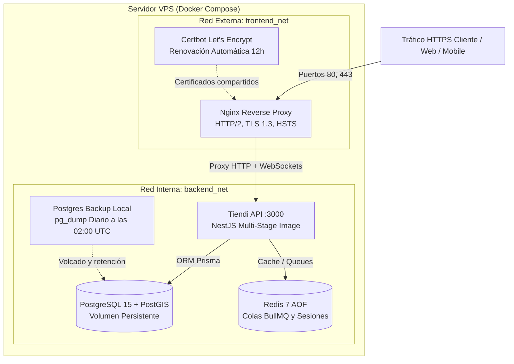

# Tiendi API — Guía de Despliegue en Staging y Producción (Fase 14)

Guía completa de arquitectura, aprovisionamiento de infraestructura, configuración de dominios, SSL con Let's Encrypt, variables de entorno y despliegue continuo (CD) con Docker Compose y GitHub Actions.

---

## 1. Arquitectura de Despliegue



---

## 2. Dominios y Estrategia de Entornos

| Entorno | Dominio | Propósito | Rama Git |
|---|---|---|---|
| **Staging** | `staging-api.tiendi.pe` | Pruebas de integración, QA y homologación con Culqi Test | `master` / `main` |
| **Producción** | `api.tiendi.pe` | Operación en vivo, pasarela Culqi Live, emails reales | Tags `vX.Y.Z` / Release |

---

## 3. Aprovisionamiento del Servidor VPS

Requisitos mínimos recomendados (VPS en DigitalOcean, Hetzner, AWS EC2 o Linode):
- **CPU**: 2 vCPUs
- **RAM**: 4 GB (mínimo 2 GB con Swap configurado)
- **Disco**: 40 GB NVMe / SSD
- **Sistema Operativo**: Ubuntu 22.04 LTS o 24.04 LTS

### 3.1. Instalación de Docker y Docker Compose
```bash
# Actualizar el sistema
sudo apt update && sudo apt upgrade -y

# Instalar dependencias
sudo apt install -y ca-certificates curl gnupg lsb-release ufw

# Instalar Docker Engine
sudo install -m 0755 -d /etc/apt/keyrings
curl -fsSL https://download.docker.com/linux/ubuntu/gpg | sudo gpg --dearmor -o /etc/apt/keyrings/docker.gpg
sudo chmod a+r /etc/apt/keyrings/docker.gpg

echo "deb [arch=$(dpkg --print-architecture) signed-by=/etc/apt/keyrings/docker.gpg] https://download.docker.com/linux/ubuntu $(lsb_release -cs) stable" | sudo tee /etc/apt/sources.list.d/docker.list > /dev/null

sudo apt update
sudo apt install -y docker-ce docker-ce-cli containerd.io docker-buildx-plugin docker-compose-plugin

# Agregar usuario al grupo docker
sudo usermod -aG docker $USER
newgrp docker
```

### 3.2. Configuración de Seguridad y Firewall (UFW)
```bash
sudo ufw default deny incoming
sudo ufw default allow outgoing
sudo ufw allow 22/tcp    # SSH
sudo ufw allow 80/tcp    # HTTP (Let's Encrypt challenge y redirect)
sudo ufw allow 443/tcp   # HTTPS (Tráfico seguro)
sudo ufw enable
```

---

## 4. Configuración de Dominio y SSL con Let's Encrypt

### 4.1. Configuración de Registros DNS
En tu proveedor de DNS (Cloudflare, GoDaddy, Route53):
- Crear un registro **A** apuntando `api.tiendi.pe` a la IP pública del servidor VPS.
- Crear un registro **A** apuntando `staging-api.tiendi.pe` a la IP pública del servidor VPS (o de staging).

### 4.2. Bootstrap Inicial de Certificados SSL
Dado que Nginx no puede iniciar si los archivos de certificado no existen todavía, se provee el script de inicialización:

```bash
cd /opt/tiendi/FUENTES/tiendi-api
chmod +x scripts/init-letsencrypt.sh
./scripts/init-letsencrypt.sh
```

El script:
1. Crea certificados temporales autofirmados para que Nginx arranque.
2. Inicia Nginx para exponer la ruta `/.well-known/acme-challenge/`.
3. Invoca `certbot certonly` contra los servidores de Let's Encrypt.
4. Sustituye los certificados temporales por los certificados definitivos firmados.
5. Recarga Nginx con HTTPS habilitado.

---

## 5. Gestión de Variables de Entorno

En el servidor, copiar la plantilla de producción:
```bash
cp .env.production.example .env.production
chmod 600 .env.production
nano .env.production
```

### Generación de Secretos Criptográficos
Ejecutar en la terminal para obtener llaves de alta entropía:
```bash
# Para JWT_SECRET
openssl rand -hex 32

# Para JWT_REFRESH_SECRET
openssl rand -hex 32

# Para contraseñas de Base de Datos y Redis
openssl rand -hex 24
```

---

## 6. Pipeline de Despliegue Continuo (CD) con GitHub Actions

El flujo automatizado está configurado en `.github/workflows/cd.yml`:

1. **Gatekeeper de Calidad**:
   - Compilación de paquetes compartidos (`@kanoso/telemetry`).
   - Linting estricto con ESLint.
   - Generación de cliente Prisma.
   - Compilación limpia de TypeScript.
   - Ejecución de la suite completa de tests unitarios e integración.

2. **Empaquetado de Contenedor**:
   - Compilación multi-stage (`Dockerfile`).
   - Publicación de la imagen en **GitHub Container Registry (`ghcr.io`)** con tags `:staging` y `:${{ github.sha }}`.

3. **Despliegue Desatendido en Staging**:
   - Conexión vía SSH al VPS de Staging.
   - Descarga de la nueva imagen de Docker.
   - Ejecución de migraciones automáticas (`npx prisma migrate deploy`).
   - Actualización del contenedor de la API sin interrumpir la base de datos (`up -d --no-deps api`).
   - Health check activo a `/health` con 10 reintentos automáticos.

### 6.1. Secretos Requeridos en GitHub Repository Settings
En `Settings > Secrets and variables > Actions`:

| Secreto | Descripción |
|---|---|
| `STAGING_SSH_HOST` | IP pública o hostname del VPS de Staging |
| `STAGING_SSH_USER` | Usuario SSH con permisos Docker (ej: `deploy` o `ubuntu`) |
| `STAGING_SSH_KEY` | Clave privada SSH (formato PEM / Ed25519) |
| `STAGING_SSH_PORT` | Puerto SSH (por defecto `22`) |
| `STAGING_DATABASE_URL` | URL de conexión PostgreSQL para ejecutar migraciones |

---

## 7. Operaciones y Runbook de Mantenimiento

### 7.1. Iniciar o Reiniciar Todos los Servicios
```bash
docker compose -f docker-compose.prod.yml up -d
```

### 7.2. Ejecutar Migraciones de Prisma Manualmente
```bash
docker compose -f docker-compose.prod.yml run --rm api npx prisma migrate deploy
```

### 7.3. Ver Logs en Tiempo Real
```bash
# Ver logs de la API
docker logs -f tiendi-api

# Ver logs del proxy Nginx
docker logs -f tiendi-nginx

# Ver logs de la base de datos
docker logs -f tiendi-postgres
```

### 7.4. Monitoreo de Salud
```bash
curl -I https://api.tiendi.pe/health
# Debe retornar HTTP/2 200 OK con { "status": "ok" }
```

### 7.5. Procedimiento de Rollback Inmediato
Si un despliegue presenta problemas en producción:
```bash
# 1. Regresar a la imagen anterior por SHA
docker compose -f docker-compose.prod.yml up -d --no-deps api:SHA_ANTERIOR

# 2. Verificar estado de la base de datos
docker compose -f docker-compose.prod.yml run --rm api npx prisma migrate status

# 3. Validar health check
curl -f https://api.tiendi.pe/health
```
