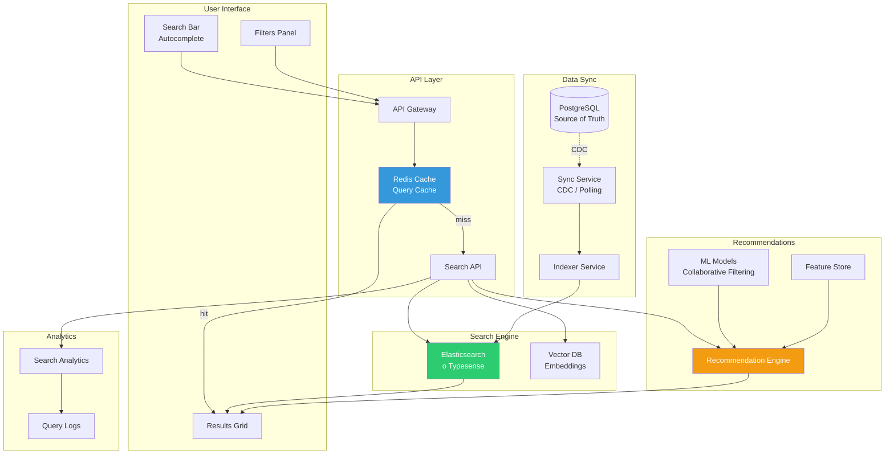
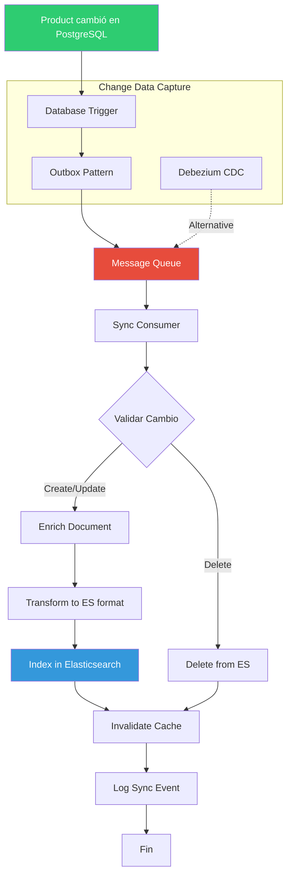

# Arquitectura de Búsqueda y Recomendaciones - Sistema Tiendi

Sistema de búsqueda avanzada, filtros, autocompletado y recomendaciones inteligentes.

---

## Arquitectura General del Sistema de Búsqueda



---

## Índice de Elasticsearch (Schema)

```json
{
  "mappings": {
    "properties": {
      "product_id": { "type": "keyword" },
      "name": {
        "type": "text",
        "analyzer": "spanish",
        "fields": {
          "keyword": { "type": "keyword" },
          "suggest": {
            "type": "completion",
            "analyzer": "simple"
          }
        }
      },
      "description": {
        "type": "text",
        "analyzer": "spanish"
      },
      "category_id": { "type": "keyword" },
      "category_name": {
        "type": "text",
        "fields": { "keyword": { "type": "keyword" } }
      },
      "brand_id": { "type": "keyword" },
      "brand_name": {
        "type": "text",
        "fields": { "keyword": { "type": "keyword" } }
      },
      "store_id": { "type": "keyword" },
      "store_name": {
        "type": "text",
        "fields": { "keyword": { "type": "keyword" } }
      },
      "price": { "type": "float" },
      "discount_price": { "type": "float" },
      "discount_percentage": { "type": "integer" },
      "stock": { "type": "integer" },
      "is_active": { "type": "boolean" },
      "location": { "type": "geo_point" },
      "images": { "type": "keyword" },
      "rating": { "type": "float" },
      "review_count": { "type": "integer" },
      "sales_count": { "type": "integer" },
      "created_at": { "type": "date" },
      "updated_at": { "type": "date" },
      "tags": { "type": "keyword" },

      // Para búsqueda semántica
      "embedding_vector": {
        "type": "dense_vector",
        "dims": 384,
        "index": true,
        "similarity": "cosine"
      }
    }
  },
  "settings": {
    "analysis": {
      "analyzer": {
        "spanish": {
          "tokenizer": "standard",
          "filter": ["lowercase", "spanish_stop", "spanish_stemmer"]
        }
      },
      "filter": {
        "spanish_stop": {
          "type": "stop",
          "stopwords": "_spanish_"
        },
        "spanish_stemmer": {
          "type": "stemmer",
          "language": "spanish"
        }
      }
    },
    "index": {
      "number_of_shards": 3,
      "number_of_replicas": 1
    }
  }
}
```

---

## Pipeline de Sincronización (PostgreSQL → Elasticsearch)



---

## Búsqueda Multi-criterio

```mermaid
graph LR
    subgraph "Query Builder"
        Q[User Query:<br/>"cerveza pilsen"]
        F[Filters:<br/>- Categoría: Bebidas<br/>- Precio: 10-50<br/>- Radio: 5km]
        S[Sort:<br/>- Relevancia<br/>- Precio<br/>- Distancia]
    end

    subgraph "Elasticsearch Query"
        BOOL[Bool Query]
        MUST[Must Clauses]
        FILTER[Filter Clauses]
        SHOULD[Should Clauses]
        SCORE[Score Calculation]
    end

    subgraph "Score Factors"
        TEXT_MATCH[Text Match<br/>Score: 1.0]
        FRESHNESS[Freshness Boost<br/>Score: 0.3]
        POPULARITY[Popularity Boost<br/>Score: 0.5]
        DISTANCE[Distance Decay<br/>Score: 0.4]
        DISCOUNT[Discount Boost<br/>Score: 0.2]
    end

    Q --> BOOL
    F --> BOOL
    S --> BOOL

    BOOL --> MUST
    BOOL --> FILTER
    BOOL --> SHOULD

    MUST --> TEXT_MATCH
    SHOULD --> FRESHNESS
    SHOULD --> POPULARITY
    SHOULD --> DISTANCE
    SHOULD --> DISCOUNT

    TEXT_MATCH --> SCORE
    FRESHNESS --> SCORE
    POPULARITY --> SCORE
    DISTANCE --> SCORE
    DISCOUNT --> SCORE

    style SCORE fill:#2ecc71,color:#fff
```

---

## Sistema de Autocompletado

```mermaid
graph TB
    subgraph "Input"
        USER[User types: "cerv"]
    end

    subgraph "Suggest Layer"
        TRIE[Prefix Trie<br/>Redis]
        ES_SUGGEST[ES Completion Suggester]
        HISTORY[User Search History<br/>Personalized]
    end

    subgraph "Ranking"
        RANK[Ranking Algorithm]
        POPULAR[Popular Queries]
        RECENT[Recent Searches]
        PERSONAL[Personal History]
    end

    subgraph "Results"
        SUGGESTIONS[Suggestions:<br/>1. cerveza<br/>2. cerveza pilsen<br/>3. cerveza corona<br/>4. cerveza artesanal<br/>5. cervezas importadas]
    end

    USER --> TRIE
    USER --> ES_SUGGEST
    USER --> HISTORY

    TRIE --> RANK
    ES_SUGGEST --> RANK
    HISTORY --> RANK

    POPULAR --> RANK
    RECENT --> RANK
    PERSONAL --> RANK

    RANK --> SUGGESTIONS

    style TRIE fill:#3498db,color:#fff
    style RANK fill:#f39c12,color:#fff
    style SUGGESTIONS fill:#2ecc71,color:#fff
```

---

## Sistema de Recomendaciones

```mermaid
graph TB
    subgraph "Input Signals"
        VIEWED[Products Viewed]
        PURCHASED[Products Purchased]
        CART[Cart Items]
        FAVORITES[Favorites]
    end

    subgraph "Recommendation Strategies"
        COLLAB[Collaborative Filtering<br/>"Users like you bought..."]
        CONTENT[Content-Based<br/>"Similar products..."]
        POPULAR[Popularity-Based<br/>"Trending now..."]
        CONTEXT[Context-Aware<br/>Time, Location, Device]
    end

    subgraph "ML Models"
        ALS[ALS Matrix Factorization]
        ITEM2VEC[Item2Vec Embeddings]
        DNN[Deep Neural Network]
    end

    subgraph "Ranking & Filtering"
        COMBINE[Combine Strategies]
        DIVERSITY[Diversity Filter]
        BUSINESS[Business Rules]
        PERSONALIZE[Personalization Layer]
    end

    subgraph "Output"
        RECS[Recommended Products]
    end

    VIEWED --> COLLAB
    PURCHASED --> COLLAB
    CART --> CONTENT
    FAVORITES --> CONTENT

    COLLAB --> ALS
    CONTENT --> ITEM2VEC
    POPULAR --> DNN
    CONTEXT --> DNN

    ALS --> COMBINE
    ITEM2VEC --> COMBINE
    DNN --> COMBINE

    COMBINE --> DIVERSITY
    DIVERSITY --> BUSINESS
    BUSINESS --> PERSONALIZE

    PERSONALIZE --> RECS

    style ALS fill:#e74c3c,color:#fff
    style COMBINE fill:#f39c12,color:#fff
    style RECS fill:#2ecc71,color:#fff
```

---

## Query DSL de Ejemplo (Elasticsearch)

### Búsqueda con Filtros y Geolocalización

```json
{
  "query": {
    "bool": {
      "must": [
        {
          "multi_match": {
            "query": "cerveza pilsen",
            "fields": ["name^3", "description", "brand_name^2", "category_name"],
            "type": "best_fields",
            "fuzziness": "AUTO"
          }
        }
      ],
      "filter": [
        { "term": { "is_active": true } },
        { "range": { "stock": { "gt": 0 } } },
        { "range": { "price": { "gte": 10, "lte": 50 } } },
        { "term": { "category_id": "cat_bebidas" } },
        {
          "geo_distance": {
            "distance": "5km",
            "location": {
              "lat": -12.046374,
              "lon": -77.042793
            }
          }
        }
      ],
      "should": [
        {
          "function_score": {
            "functions": [
              {
                "gauss": {
                  "created_at": {
                    "origin": "now",
                    "scale": "30d",
                    "decay": 0.5
                  }
                },
                "weight": 0.3
              },
              {
                "field_value_factor": {
                  "field": "sales_count",
                  "modifier": "log1p",
                  "factor": 0.5
                }
              },
              {
                "filter": { "range": { "discount_percentage": { "gt": 0 } } },
                "weight": 0.2
              }
            ],
            "boost_mode": "multiply"
          }
        }
      ]
    }
  },
  "sort": [
    "_score",
    {
      "_geo_distance": {
        "location": {
          "lat": -12.046374,
          "lon": -77.042793
        },
        "order": "asc",
        "unit": "km"
      }
    }
  ],
  "size": 20,
  "from": 0
}
```

### Autocompletado con Suggestions

```json
{
  "suggest": {
    "product-suggest": {
      "prefix": "cerv",
      "completion": {
        "field": "name.suggest",
        "size": 5,
        "skip_duplicates": true,
        "fuzzy": {
          "fuzziness": "AUTO"
        }
      }
    }
  },
  "_source": ["product_id", "name", "price", "image_url"]
}
```

### Búsqueda Semántica con Vectors

```json
{
  "query": {
    "script_score": {
      "query": {
        "bool": {
          "filter": [
            { "term": { "is_active": true } },
            { "range": { "stock": { "gt": 0 } } }
          ]
        }
      },
      "script": {
        "source": "cosineSimilarity(params.query_vector, 'embedding_vector') + 1.0",
        "params": {
          "query_vector": [0.23, 0.45, 0.12, ...]
        }
      }
    }
  }
}
```

---

## Stack Tecnológico Recomendado

### Opción 1: Elasticsearch (Más Popular)

```yaml
Search Engine:
  - Elasticsearch 8.x
  - Kibana (admin UI)

Pros:
  - Ecosistema maduro
  - Gran comunidad
  - Muchas integraciones
  - Vector search incluido

Cons:
  - Alto consumo de memoria
  - Caro en la nube
  - Complejidad operacional

Costo estimado:
  - Self-hosted: 3 nodes × $150/mes = $450/mes
  - Elastic Cloud: $800/mes
```

### Opción 2: Typesense (Ligero y Rápido)

```yaml
Search Engine:
  - Typesense Cloud o Self-hosted

Pros:
  - Muy rápido (<50ms)
  - Fácil de configurar
  - Bajo consumo de recursos
  - Typo-tolerance excelente
  - Más barato

Cons:
  - Menos features avanzadas
  - Comunidad más pequeña
  - Menos integraciones

Costo estimado:
  - Self-hosted: 1 VM × $80/mes = $80/mes
  - Typesense Cloud: $150/mes
```

### Opción 3: Algolia (SaaS Premium)

```yaml
Search Engine:
  - Algolia (completamente managed)

Pros:
  - Extremadamente rápido
  - Cero mantenimiento
  - UI components listos
  - Analytics incluidos

Cons:
  - Muy caro
  - Vendor lock-in
  - Limitado control

Costo estimado:
  - Grow Plan: $1/mes por 1000 searches
  - ~10K searches/día = $300/mes
```

---

## Implementación de Sync Service

```typescript
// Sync service con Outbox pattern
class ProductSyncService {
  async syncProductToElasticsearch(productId: string) {
    // 1. Obtener datos completos del producto
    const product = await this.getProductWithRelations(productId);

    if (!product) {
      // Si fue eliminado, borrar de ES
      await this.elasticsearchClient.delete({
        index: 'products',
        id: productId
      });
      return;
    }

    // 2. Enriquecer con datos calculados
    const enriched = {
      ...product,
      rating: await this.calculateAverageRating(productId),
      review_count: await this.getReviewCount(productId),
      sales_count: await this.getSalesCount(productId)
    };

    // 3. Generar embedding para búsqueda semántica
    if (this.mlEnabled) {
      enriched.embedding_vector = await this.generateEmbedding(
        `${product.name} ${product.description}`
      );
    }

    // 4. Indexar en Elasticsearch
    await this.elasticsearchClient.index({
      index: 'products',
      id: productId,
      document: enriched
    });

    // 5. Invalidar cache
    await this.cacheService.invalidate(`search:*`);
  }

  private async getProductWithRelations(productId: string) {
    return await db.query(`
      SELECT
        p.*,
        c.name as category_name,
        b.name as brand_name,
        s.name as store_name,
        s.location
      FROM products p
      JOIN categories c ON p.category_id = c.id
      JOIN brands b ON p.brand_id = b.id
      JOIN stores s ON p.store_id = s.id
      WHERE p.id = $1
    `, [productId]);
  }
}
```

---

## Consideraciones de Performance

### Caché de Búsquedas

```typescript
// Cache layer para queries frecuentes
async function searchProducts(query: SearchQuery) {
  const cacheKey = `search:${hashQuery(query)}`;

  // Intentar desde cache
  const cached = await redis.get(cacheKey);
  if (cached) {
    return JSON.parse(cached);
  }

  // Buscar en Elasticsearch
  const results = await elasticsearch.search(query);

  // Guardar en cache (5 minutos)
  await redis.setex(cacheKey, 300, JSON.stringify(results));

  return results;
}
```

### Índices Parciales

```json
// Índice solo para productos activos (más rápido)
{
  "settings": {
    "index": {
      "routing": {
        "allocation": {
          "include": {
            "_tier_preference": "data_hot"
          }
        }
      }
    }
  }
}
```

---

**Fecha de creación:** 2025-01-24
**Versión:** 1.0
