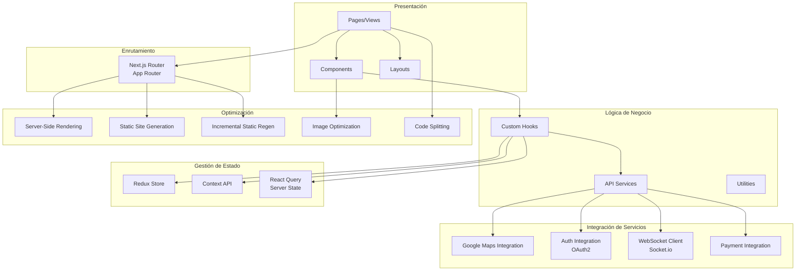

# Diagrama de Arquitectura Frontend - Tiendi

Este documento describe la arquitectura del frontend del sistema Tiendi.

---

## Arquitectura de Componentes Frontend



---

## Estructura de Carpetas

```
src/
├── app/                          # Next.js App Router
│   ├── (auth)/                   # Grupo de rutas autenticadas
│   │   ├── login/
│   │   └── register/
│   ├── (shop)/                   # Grupo de rutas de tienda
│   │   ├── search/
│   │   ├── store/[id]/
│   │   ├── product/[id]/
│   │   └── checkout/
│   ├── (account)/                # Grupo de rutas de cuenta
│   │   ├── orders/
│   │   ├── favorites/
│   │   └── messages/
│   ├── layout.tsx                # Layout raíz
│   └── page.tsx                  # Home page
│
├── components/                   # Componentes reutilizables
│   ├── ui/                       # Componentes UI base
│   │   ├── Button/
│   │   ├── Input/
│   │   ├── Card/
│   │   └── Modal/
│   ├── features/                 # Componentes de funcionalidad
│   │   ├── ProductCard/
│   │   ├── CartSidebar/
│   │   ├── StoreCard/
│   │   └── ChatWidget/
│   └── layout/                   # Componentes de layout
│       ├── Header/
│       ├── Footer/
│       └── Sidebar/
│
├── hooks/                        # Custom hooks
│   ├── useAuth.ts
│   ├── useCart.ts
│   ├── useGeolocation.ts
│   ├── useSocket.ts
│   └── useDebounce.ts
│
├── services/                     # Servicios de API
│   ├── api/
│   │   ├── auth.service.ts
│   │   ├── products.service.ts
│   │   ├── orders.service.ts
│   │   └── stores.service.ts
│   ├── socket/
│   │   └── chat.service.ts
│   └── external/
│       ├── maps.service.ts
│       └── payment.service.ts
│
├── store/                        # Redux store
│   ├── slices/
│   │   ├── authSlice.ts
│   │   ├── cartSlice.ts
│   │   ├── uiSlice.ts
│   │   └── favoritesSlice.ts
│   ├── hooks.ts
│   └── store.ts
│
├── lib/                          # Utilidades y helpers
│   ├── validators/
│   ├── formatters/
│   ├── constants/
│   └── utils.ts
│
├── types/                        # TypeScript types
│   ├── user.types.ts
│   ├── product.types.ts
│   ├── order.types.ts
│   └── api.types.ts
│
└── styles/                       # Estilos globales
    ├── globals.css
    └── tailwind.css
```

---

## Gestión de Estado

### Estado Global (Redux)
- **Auth**: Usuario autenticado, token, permisos
- **Cart**: Items del carrito, cantidades, subtotal
- **UI**: Modales, sidebars, notificaciones
- **Favorites**: Productos favoritos

### Estado del Servidor (React Query)
- **Products**: Catálogo de productos
- **Stores**: Listado de tiendas
- **Orders**: Pedidos del usuario
- **Search**: Resultados de búsqueda

### Estado Local (useState, useReducer)
- Formularios
- Estados temporales de UI
- Filtros y ordenamiento

---

## Estrategias de Rendering

### Server-Side Rendering (SSR)
- Páginas de detalle de producto (SEO)
- Páginas de tienda (SEO)
- Resultados de búsqueda (contenido dinámico)

### Static Site Generation (SSG)
- Landing page
- Páginas de información (Términos, Privacidad)
- Páginas de ayuda

### Incremental Static Regeneration (ISR)
- Listado de categorías
- Productos destacados
- Promociones

### Client-Side Rendering (CSR)
- Dashboard de usuario
- Carrito de compras
- Chat en tiempo real
- Área de cuenta

---

## Optimizaciones

### Performance
1. **Code Splitting**: Carga dinámica de componentes
2. **Lazy Loading**: Imágenes y componentes bajo demanda
3. **Image Optimization**: Next.js Image component
4. **Font Optimization**: Google Fonts optimizadas
5. **Bundle Analysis**: Análisis regular del tamaño del bundle

### Caché
1. **Service Worker**: Cache de assets estáticos (PWA)
2. **React Query Cache**: Cache de datos del servidor
3. **Redux Persist**: Persistencia de estado (carrito, favoritos)
4. **HTTP Cache**: Headers de caché apropiados

### SEO
1. **Meta Tags**: Dinámicos por página
2. **Open Graph**: Para compartir en redes sociales
3. **Structured Data**: JSON-LD para productos y tiendas
4. **Sitemap**: Generación automática
5. **Robots.txt**: Configuración de crawlers

---

## Integraciones Principales

### Google Maps
```typescript
// Ejemplo de integración
import { Loader } from '@googlemaps/js-api-loader';

const loader = new Loader({
  apiKey: process.env.NEXT_PUBLIC_GOOGLE_MAPS_API_KEY,
  version: 'weekly',
  libraries: ['places', 'geometry']
});

const google = await loader.load();
const map = new google.maps.Map(mapRef.current, {
  center: { lat: -12.046374, lng: -77.042793 },
  zoom: 14
});
```

### Socket.io (Chat)
```typescript
// Ejemplo de integración
import { io } from 'socket.io-client';

const socket = io(process.env.NEXT_PUBLIC_SOCKET_URL, {
  auth: { token: authToken }
});

socket.on('connect', () => {
  socket.emit('join_room', { orderId });
});

socket.on('new_message', (message) => {
  // Actualizar UI
});
```

### OAuth2 (Google/Facebook)
```typescript
// Ejemplo con NextAuth.js
import { signIn } from 'next-auth/react';

const handleGoogleLogin = async () => {
  await signIn('google', { callbackUrl: '/' });
};
```

---

## Componentes Principales

### ProductCard
- Imagen del producto
- Nombre y marca
- Precio con descuento
- Botón agregar al carrito
- Icono de favorito

### CartSidebar
- Lista de productos en carrito
- Control de cantidad
- Subtotal
- Botón checkout

### StoreCard
- Logo de la tienda
- Nombre y dirección
- Distancia
- Estado (abierto/cerrado)
- Botón ver tienda

### ChatWidget
- Lista de conversaciones
- Chat individual
- Input de mensaje
- Indicador de escritura

---

## Progressive Web App (PWA)

### Características
- **Instalable**: Puede instalarse como app nativa
- **Offline**: Funcionalidad básica sin conexión
- **Push Notifications**: Notificaciones de pedidos
- **Add to Home Screen**: Acceso rápido

### Service Worker
```javascript
// Estrategia de caché
workbox.routing.registerRoute(
  /^https:\/\/api\.tiendi\.com/,
  new workbox.strategies.NetworkFirst({
    cacheName: 'api-cache',
    networkTimeoutSeconds: 3
  })
);

workbox.routing.registerRoute(
  /\.(?:png|jpg|jpeg|svg|webp)$/,
  new workbox.strategies.CacheFirst({
    cacheName: 'images-cache'
  })
);
```

---

## Seguridad Frontend

### Medidas Implementadas
1. **XSS Prevention**: Sanitización de inputs
2. **CSRF Protection**: Tokens CSRF en formularios
3. **Content Security Policy**: Headers CSP
4. **HTTPS Only**: Forzar HTTPS
5. **Secure Storage**: Tokens en httpOnly cookies
6. **Input Validation**: Validación en cliente y servidor

---

**Fecha de creación:** 2025-11-24
**Versión:** 1.0
