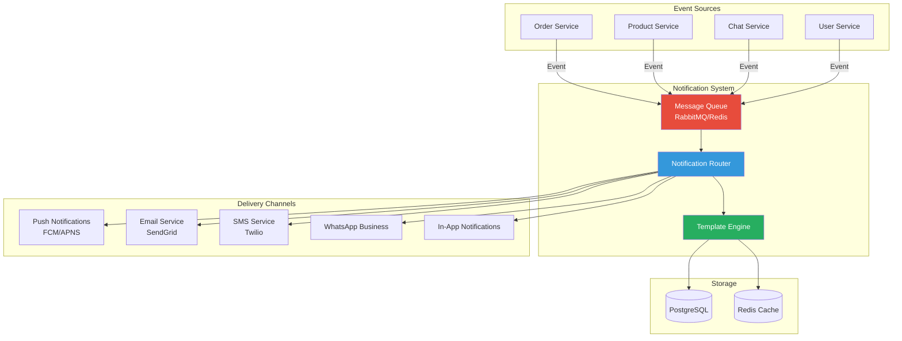
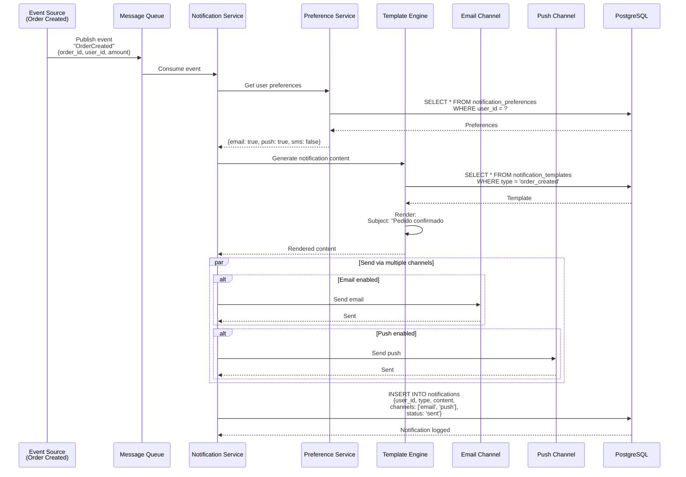
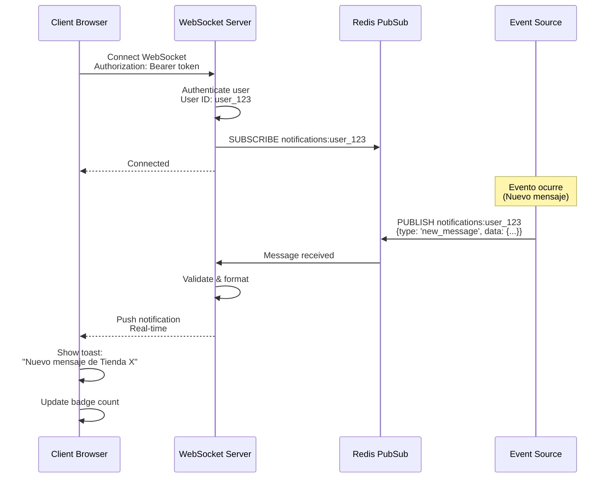

# Arquitectura de Sistema de Notificaciones - Sistema Tiendi

Sistema de notificaciones multi-canal para Tiendi.

---

## Arquitectura General



---

## Tipos de Notificaciones

### 1. Notificaciones Transaccionales



---

## 2. Notificaciones de Marketing

```mermaid
sequenceDiagram
    actor Admin as Marketing Team
    participant Dashboard as Admin Panel
    participant Campaign as Campaign Service
    participant Segment as Segmentation Service
    participant Queue as Job Queue
    participant Notif as Notification Service
    participant DB as PostgreSQL

    Admin->>Dashboard: Crear campaña<br/>"Black Friday Sale"

    Dashboard->>Campaign: Create campaign

    Campaign->>Segment: Define audience<br/>- Clientes activos últimos 30 días<br/>- Han comprado categoría X<br/>- No han comprado en 7 días

    Segment->>DB: SELECT users matching criteria

    DB-->>Segment: 1,245 users

    Segment-->>Campaign: Audience: 1,245 users

    Campaign->>DB: INSERT INTO campaigns<br/>{name, message, audience_count,<br/>scheduled_at, status: 'scheduled'}

    Campaign->>Queue: Schedule send job

    Note over Queue: Scheduled for 8:00 AM

    Queue->>Notif: Process campaign

    Notif->>DB: Get audience list

    loop Send in batches of 100
        Notif->>Notif: Personalize message<br/>per user

        Notif->>Notif: Send notifications<br/>respecting rate limits

        Notif->>DB: UPDATE campaign stats
    end

    Notif-->>Campaign: Campaign sent
```



---

## 3. Notificaciones en Tiempo Real (WebSocket)



---

## Gestión de Preferencias de Usuario

```mermaid
sequenceDiagram
    actor User as Usuario
    participant Web as Web App
    participant Gateway as API Gateway
    participant Pref as Preference Service
    participant DB as PostgreSQL

    User->>Web: Ir a Configuración<br/>de Notificaciones

    Web->>Gateway: GET /user/notification-preferences

    Gateway->>Pref: Get preferences

    Pref->>DB: SELECT * FROM notification_preferences<br/>WHERE user_id = ?

    DB-->>Pref: Current preferences

    Pref-->>Gateway: Preferences

    Gateway-->>Web: Data

    Web-->>User: Mostrar configuración:<br/><br/>📧 Email:<br/>  ☑ Pedidos<br/>  ☑ Promociones<br/>  ☐ Newsletter<br/><br/>📱 Push:<br/>  ☑ Pedidos<br/>  ☑ Mensajes<br/>  ☐ Promociones<br/><br/>📲 SMS:<br/>  ☐ Todo desactivado

    User->>Web: Modificar preferencias

    Web->>Gateway: PUT /user/notification-preferences<br/>{email_orders: true,<br/>push_promotions: false, ...}

    Gateway->>Pref: Update preferences

    Pref->>DB: UPDATE notification_preferences<br/>SET ...

    DB-->>Pref: Updated

    Pref-->>Gateway: Success

    Gateway-->>Web: Updated

    Web-->>User: Preferencias guardadas
```



---

## Tablas de Base de Datos

```sql
-- Tabla de notificaciones
CREATE TABLE notifications (
  id UUID PRIMARY KEY DEFAULT uuid_generate_v4(),
  user_id UUID NOT NULL REFERENCES users(id),
  type VARCHAR(50) NOT NULL, -- 'order_created', 'order_delivered', 'new_message', etc.
  title VARCHAR(255) NOT NULL,
  message TEXT NOT NULL,
  data JSONB, -- Datos adicionales
  channels VARCHAR(20)[], -- ['email', 'push', 'sms']
  status VARCHAR(20) DEFAULT 'sent', -- 'sent', 'failed', 'read'
  read_at TIMESTAMP,
  sent_at TIMESTAMP DEFAULT NOW(),
  created_at TIMESTAMP DEFAULT NOW()
);

CREATE INDEX idx_notifications_user ON notifications(user_id, created_at DESC);
CREATE INDEX idx_notifications_unread ON notifications(user_id) WHERE read_at IS NULL;

-- Tabla de preferencias de notificaciones
CREATE TABLE notification_preferences (
  user_id UUID PRIMARY KEY REFERENCES users(id),

  -- Email
  email_orders BOOLEAN DEFAULT TRUE,
  email_messages BOOLEAN DEFAULT TRUE,
  email_promotions BOOLEAN DEFAULT TRUE,
  email_newsletter BOOLEAN DEFAULT FALSE,

  -- Push
  push_orders BOOLEAN DEFAULT TRUE,
  push_messages BOOLEAN DEFAULT TRUE,
  push_promotions BOOLEAN DEFAULT FALSE,

  -- SMS
  sms_orders BOOLEAN DEFAULT FALSE,
  sms_delivery BOOLEAN DEFAULT FALSE,

  -- WhatsApp
  whatsapp_orders BOOLEAN DEFAULT FALSE,

  -- Horarios
  quiet_hours_enabled BOOLEAN DEFAULT FALSE,
  quiet_hours_start TIME, -- ej: 22:00
  quiet_hours_end TIME, -- ej: 08:00

  updated_at TIMESTAMP DEFAULT NOW()
);

-- Tabla de templates de notificaciones
CREATE TABLE notification_templates (
  id UUID PRIMARY KEY DEFAULT uuid_generate_v4(),
  type VARCHAR(50) UNIQUE NOT NULL,
  name VARCHAR(100) NOT NULL,
  channel VARCHAR(20) NOT NULL, -- 'email', 'push', 'sms'
  subject_template TEXT, -- Para email
  body_template TEXT NOT NULL,
  variables JSONB, -- Lista de variables disponibles
  is_active BOOLEAN DEFAULT TRUE,
  created_at TIMESTAMP DEFAULT NOW(),
  updated_at TIMESTAMP DEFAULT NOW()
);

-- Tabla de campañas de marketing
CREATE TABLE notification_campaigns (
  id UUID PRIMARY KEY DEFAULT uuid_generate_v4(),
  name VARCHAR(255) NOT NULL,
  message TEXT NOT NULL,
  channels VARCHAR(20)[] NOT NULL,
  audience_criteria JSONB, -- Criterios de segmentación
  audience_count INTEGER,
  scheduled_at TIMESTAMP,
  sent_at TIMESTAMP,
  status VARCHAR(20) DEFAULT 'draft', -- 'draft', 'scheduled', 'sending', 'sent', 'failed'
  sent_count INTEGER DEFAULT 0,
  failed_count INTEGER DEFAULT 0,
  open_rate DECIMAL(5,2),
  click_rate DECIMAL(5,2),
  created_by UUID REFERENCES users(id),
  created_at TIMESTAMP DEFAULT NOW()
);

-- Tabla de tokens de dispositivos (para push)
CREATE TABLE device_tokens (
  id UUID PRIMARY KEY DEFAULT uuid_generate_v4(),
  user_id UUID NOT NULL REFERENCES users(id),
  token TEXT NOT NULL UNIQUE,
  platform VARCHAR(20) NOT NULL, -- 'ios', 'android', 'web'
  device_info JSONB,
  is_active BOOLEAN DEFAULT TRUE,
  last_used_at TIMESTAMP DEFAULT NOW(),
  created_at TIMESTAMP DEFAULT NOW()
);

CREATE INDEX idx_device_tokens_user ON device_tokens(user_id) WHERE is_active = TRUE;
```

---

## Eventos de Notificación

### Lista de Eventos

```typescript
enum NotificationType {
  // Pedidos
  ORDER_CREATED = 'order_created',
  ORDER_CONFIRMED = 'order_confirmed',
  ORDER_IN_TRANSIT = 'order_in_transit',
  ORDER_DELIVERED = 'order_delivered',
  ORDER_CANCELED = 'order_canceled',

  // Mensajes
  NEW_MESSAGE = 'new_message',

  // Productos
  PRODUCT_BACK_IN_STOCK = 'product_back_in_stock',
  PRICE_DROP = 'price_drop',
  FAVORITE_ON_SALE = 'favorite_on_sale',

  // Vendedor
  NEW_ORDER_VENDOR = 'new_order_vendor',
  LOW_STOCK_ALERT = 'low_stock_alert',
  PAYOUT_PROCESSED = 'payout_processed',
  REVIEW_RECEIVED = 'review_received',

  // Marketing
  PROMOTION_AVAILABLE = 'promotion_available',
  CART_ABANDONED = 'cart_abandoned',
  REORDER_REMINDER = 'reorder_reminder',

  // Sistema
  PASSWORD_RESET = 'password_reset',
  EMAIL_VERIFICATION = 'email_verification',
  ACCOUNT_SUSPENDED = 'account_suspended'
}
```

---

## Implementación de Servicio

```typescript
class NotificationService {
  async send(notification: NotificationRequest): Promise<void> {
    // 1. Verificar preferencias del usuario
    const preferences = await this.getPreferences(notification.userId);

    // 2. Filtrar canales según preferencias
    const enabledChannels = this.filterChannels(
      notification.channels,
      preferences,
      notification.type
    );

    // 3. Verificar quiet hours
    if (this.isQuietHours(preferences)) {
      if (!notification.urgent) {
        await this.scheduleForLater(notification);
        return;
      }
    }

    // 4. Renderizar templates
    const content = await this.renderTemplate(
      notification.type,
      notification.data
    );

    // 5. Enviar por cada canal
    const results = await Promise.allSettled(
      enabledChannels.map(channel =>
        this.sendViaChannel(channel, content, notification.userId)
      )
    );

    // 6. Log resultado
    await this.logNotification(notification, results);
  }

  private async sendViaChannel(
    channel: Channel,
    content: Content,
    userId: string
  ): Promise<void> {
    switch (channel) {
      case 'email':
        return this.emailService.send(content);
      case 'push':
        return this.pushService.send(content, userId);
      case 'sms':
        return this.smsService.send(content);
      case 'whatsapp':
        return this.whatsappService.send(content);
    }
  }
}
```

---

**Fecha de creación:** 2025-11-24
**Versión:** 1.0
