# Diagrama de Arquitectura - SEO y Marketing Digital

Este archivo contiene la arquitectura para SEO técnico y herramientas de marketing digital de Tiendi.

---

## 1. Arquitectura General de SEO y Marketing


---

## 2. Sistema de URLs Amigables (SEO-Friendly)

```mermaid
graph LR
    subgraph "URL Structure"
        StoreURL["/tienda/{slug}"]
        ProductURL["/producto/{slug}"]
        CategoryURL["/categoria/{slug}"]
        SearchURL["/buscar?q={query}"]
        CityURL["/tiendas/{ciudad}"]
    end

    subgraph "Slug Generation"
        Input[Product/Store Name]
        Normalize[Normalize Text]
        Transliterate[Remove Accents]
        UniqueCheck[Check Uniqueness]
        AddSuffix[Add Suffix if Duplicate]
    end

    subgraph "Examples"
        Ex1["'Tienda Don José' →<br/>'tienda-don-jose'"]
        Ex2["'Cerveza Cusqueña 620ml' →<br/>'cerveza-cusquena-620ml'"]
        Ex3["'Panadería San Martín' →<br/>'panaderia-san-martin'"]
    end

    Input --> Normalize
    Normalize --> Transliterate
    Transliterate --> UniqueCheck
    UniqueCheck -->|Exists| AddSuffix
    UniqueCheck -->|Unique| Done[Save Slug]
    AddSuffix --> Done
```



**Implementación:**

```typescript
// services/seo/slug.service.ts

export class SlugService {

  /**
   * Genera slug SEO-friendly
   */
  generateSlug(text: string, type: 'product' | 'store' | 'category'): string {
    let slug = text
      .toLowerCase()
      .trim()
      // Reemplazar caracteres especiales
      .normalize('NFD')
      .replace(/[\u0300-\u036f]/g, '') // Quitar acentos
      .replace(/[^\w\s-]/g, '') // Quitar caracteres especiales
      .replace(/\s+/g, '-') // Espacios a guiones
      .replace(/-+/g, '-') // Múltiples guiones a uno solo
      .replace(/^-+|-+$/g, ''); // Quitar guiones al inicio/fin

    // Limitar longitud
    slug = slug.substring(0, 100);

    return slug;
  }

  /**
   * Asegura que el slug sea único
   */
  async ensureUnique(
    slug: string,
    type: 'product' | 'store' | 'category',
    excludeId?: string
  ): Promise<string> {

    const table = `${type}s`;
    let uniqueSlug = slug;
    let suffix = 1;

    while (true) {
      const exists = await db.query(`
        SELECT id FROM ${table}
        WHERE slug = $1
        ${excludeId ? 'AND id != $2' : ''}
      `, excludeId ? [uniqueSlug, excludeId] : [uniqueSlug]);

      if (exists.rows.length === 0) {
        break;
      }

      uniqueSlug = `${slug}-${suffix}`;
      suffix++;
    }

    return uniqueSlug;
  }

  /**
   * Actualiza slug si el nombre cambió
   */
  async updateSlugIfNeeded(
    id: string,
    newName: string,
    type: 'product' | 'store'
  ): Promise<string> {

    const table = `${type}s`;

    // Obtener slug actual
    const current = await db.query(`
      SELECT slug FROM ${table} WHERE id = $1
    `, [id]);

    const currentSlug = current.rows[0]?.slug;
    const newSlug = this.generateSlug(newName, type);

    // Si el slug cambiaría
    if (currentSlug !== newSlug) {
      const uniqueSlug = await this.ensureUnique(newSlug, type, id);

      await db.query(`
        UPDATE ${table} SET slug = $1 WHERE id = $2
      `, [uniqueSlug, id]);

      // Crear redirect 301 desde slug antiguo
      await this.createRedirect(currentSlug, uniqueSlug, type);

      return uniqueSlug;
    }

    return currentSlug;
  }

  /**
   * Crea redirect permanente (301)
   */
  private async createRedirect(
    fromSlug: string,
    toSlug: string,
    type: string
  ): Promise<void> {
    await db.query(`
      INSERT INTO seo_redirects (from_path, to_path, type, status_code)
      VALUES ($1, $2, $3, 301)
      ON CONFLICT (from_path) DO UPDATE
      SET to_path = $2, updated_at = NOW()
    `, [`/${type}/${fromSlug}`, `/${type}/${toSlug}`, type]);
  }
}
```

---

## 3. Meta Tags Dinámicos por Página


**Implementación Next.js:**

```typescript
// lib/seo/meta-generator.ts

interface MetaConfig {
  title: string;
  description: string;
  canonical?: string;
  image?: string;
  type?: 'website' | 'product' | 'article';
  price?: number;
  currency?: string;
}

export class MetaGenerator {

  /**
   * Genera meta tags para producto
   */
  generateProductMeta(product: Product, store: Store): MetaConfig {
    return {
      title: `${product.name} - ${store.name} | Tiendi`,
      description: this.truncate(
        product.description || `Compra ${product.name} en ${store.name}. ${product.brand ? `Marca: ${product.brand}.` : ''} Envío a domicilio en Perú.`,
        160
      ),
      canonical: `${process.env.NEXT_PUBLIC_BASE_URL}/producto/${product.slug}`,
      image: product.images?.[0]?.url || '/default-product.jpg',
      type: 'product',
      price: product.price,
      currency: 'PEN'
    };
  }

  /**
   * Genera meta tags para tienda
   */
  generateStoreMeta(store: Store): MetaConfig {
    return {
      title: `${store.name} - Tienda online | Tiendi`,
      description: this.truncate(
        store.description || `Compra en ${store.name}. ${store.categories?.join(', ')}. Envío a domicilio en ${store.city}.`,
        160
      ),
      canonical: `${process.env.NEXT_PUBLIC_BASE_URL}/tienda/${store.slug}`,
      image: store.logo_url || '/default-store.jpg',
      type: 'website'
    };
  }

  /**
   * Trunca texto a longitud específica
   */
  private truncate(text: string, maxLength: number): string {
    if (text.length <= maxLength) return text;
    return text.substring(0, maxLength - 3) + '...';
  }
}

// pages/producto/[slug].tsx (Next.js)
import { Metadata } from 'next';

export async function generateMetadata({ params }): Promise<Metadata> {
  const product = await getProductBySlug(params.slug);
  const store = await getStore(product.store_id);

  const meta = metaGenerator.generateProductMeta(product, store);

  return {
    title: meta.title,
    description: meta.description,
    alternates: {
      canonical: meta.canonical
    },
    openGraph: {
      title: meta.title,
      description: meta.description,
      url: meta.canonical,
      siteName: 'Tiendi',
      images: [
        {
          url: meta.image,
          width: 1200,
          height: 630,
          alt: product.name
        }
      ],
      locale: 'es_PE',
      type: 'product'
    },
    twitter: {
      card: 'summary_large_image',
      title: meta.title,
      description: meta.description,
      images: [meta.image]
    }
  };
}
```

---

## 4. Schema.org Structured Data (JSON-LD)

```typescript
// lib/seo/schema-generator.ts

export class SchemaGenerator {

  /**
   * Schema para Producto
   */
  generateProductSchema(product: Product, store: Store) {
    return {
      '@context': 'https://schema.org',
      '@type': 'Product',
      name: product.name,
      description: product.description,
      image: product.images?.map(img => img.url) || [],
      brand: {
        '@type': 'Brand',
        name: product.brand || store.name
      },
      offers: {
        '@type': 'Offer',
        url: `${process.env.NEXT_PUBLIC_BASE_URL}/producto/${product.slug}`,
        priceCurrency: 'PEN',
        price: product.price,
        availability: product.stock > 0
          ? 'https://schema.org/InStock'
          : 'https://schema.org/OutOfStock',
        seller: {
          '@type': 'Organization',
          name: store.name
        }
      },
      aggregateRating: product.avg_rating ? {
        '@type': 'AggregateRating',
        ratingValue: product.avg_rating,
        reviewCount: product.review_count,
        bestRating: 5,
        worstRating: 1
      } : undefined
    };
  }

  /**
   * Schema para LocalBusiness (Tienda)
   */
  generateStoreSchema(store: Store) {
    return {
      '@context': 'https://schema.org',
      '@type': 'LocalBusiness',
      '@id': `${process.env.NEXT_PUBLIC_BASE_URL}/tienda/${store.slug}`,
      name: store.name,
      description: store.description,
      image: store.logo_url,
      url: `${process.env.NEXT_PUBLIC_BASE_URL}/tienda/${store.slug}`,
      telephone: store.phone,
      email: store.email,
      address: {
        '@type': 'PostalAddress',
        streetAddress: store.address,
        addressLocality: store.city,
        addressRegion: store.region,
        addressCountry: 'PE'
      },
      geo: store.latitude && store.longitude ? {
        '@type': 'GeoCoordinates',
        latitude: store.latitude,
        longitude: store.longitude
      } : undefined,
      openingHoursSpecification: store.hours ? this.parseHoursToSchema(store.hours) : undefined,
      aggregateRating: store.avg_rating ? {
        '@type': 'AggregateRating',
        ratingValue: store.avg_rating,
        reviewCount: store.review_count,
        bestRating: 5
      } : undefined,
      priceRange: store.price_range || '$$'
    };
  }

  /**
   * Schema para Review (Reseña)
   */
  generateReviewSchema(review: Review, product: Product) {
    return {
      '@context': 'https://schema.org',
      '@type': 'Review',
      itemReviewed: {
        '@type': 'Product',
        name: product.name,
        image: product.images?.[0]?.url
      },
      author: {
        '@type': 'Person',
        name: review.user_name
      },
      reviewRating: {
        '@type': 'Rating',
        ratingValue: review.rating,
        bestRating: 5,
        worstRating: 1
      },
      reviewBody: review.comment,
      datePublished: review.created_at
    };
  }

  /**
   * Schema para Breadcrumb
   */
  generateBreadcrumbSchema(items: Array<{ name: string; url: string }>) {
    return {
      '@context': 'https://schema.org',
      '@type': 'BreadcrumbList',
      itemListElement: items.map((item, index) => ({
        '@type': 'ListItem',
        position: index + 1,
        name: item.name,
        item: item.url
      }))
    };
  }

  private parseHoursToSchema(hours: any) {
    // Convertir horarios a formato Schema.org OpeningHoursSpecification
    // Ejemplo simplificado
    return {
      '@type': 'OpeningHoursSpecification',
      dayOfWeek: ['Monday', 'Tuesday', 'Wednesday', 'Thursday', 'Friday', 'Saturday', 'Sunday'],
      opens: '08:00',
      closes: '20:00'
    };
  }
}

// Uso en página Next.js
export default function ProductPage({ product, store }) {
  const schema = schemaGenerator.generateProductSchema(product, store);

  return (
    <>
      <script
        type="application/ld+json"
        dangerouslySetInnerHTML={{ __html: JSON.stringify(schema) }}
      />
      {/* Contenido de la página */}
    </>
  );
}
```

---

## 5. Sitemap XML Dinámico

```typescript
// pages/api/sitemap.xml.ts (Next.js API Route)

export default async function handler(req, res) {

  const baseUrl = process.env.NEXT_PUBLIC_BASE_URL;

  // Consultar todas las URLs del sitio
  const [stores, products, categories] = await Promise.all([
    db.query('SELECT slug, updated_at FROM stores WHERE is_active = TRUE'),
    db.query('SELECT slug, updated_at FROM products WHERE is_active = TRUE LIMIT 50000'),
    db.query('SELECT slug, updated_at FROM categories')
  ]);

  // Generar XML
  const sitemap = `<?xml version="1.0" encoding="UTF-8"?>
<urlset xmlns="http://www.sitemaps.org/schemas/sitemap/0.9">
  <url>
    <loc>${baseUrl}</loc>
    <lastmod>${new Date().toISOString()}</lastmod>
    <changefreq>daily</changefreq>
    <priority>1.0</priority>
  </url>

  ${stores.rows.map(store => `
  <url>
    <loc>${baseUrl}/tienda/${store.slug}</loc>
    <lastmod>${new Date(store.updated_at).toISOString()}</lastmod>
    <changefreq>weekly</changefreq>
    <priority>0.8</priority>
  </url>
  `).join('')}

  ${products.rows.map(product => `
  <url>
    <loc>${baseUrl}/producto/${product.slug}</loc>
    <lastmod>${new Date(product.updated_at).toISOString()}</lastmod>
    <changefreq>weekly</changefreq>
    <priority>0.7</priority>
  </url>
  `).join('')}

  ${categories.rows.map(cat => `
  <url>
    <loc>${baseUrl}/categoria/${cat.slug}</loc>
    <lastmod>${new Date(cat.updated_at).toISOString()}</lastmod>
    <changefreq>monthly</changefreq>
    <priority>0.6</priority>
  </url>
  `).join('')}
</urlset>`;

  res.setHeader('Content-Type', 'text/xml');
  res.setHeader('Cache-Control', 's-maxage=86400, stale-while-revalidate');
  res.status(200).send(sitemap);
}
```

---

## 6. Email Marketing y Automation


**Implementación:**

```typescript
// services/email-marketing.service.ts

export class EmailMarketingService {

  /**
   * Envía email de carrito abandonado
   * Triggered 24h después de agregar productos sin checkout
   */
  async sendAbandonedCartEmail(userId: string): Promise<void> {

    // Obtener carrito del usuario
    const cart = await db.query(`
      SELECT c.*, p.name, p.price, p.images, s.name as store_name
      FROM cart_items c
      JOIN products p ON c.product_id = p.id
      JOIN stores s ON p.store_id = s.id
      WHERE c.user_id = $1
        AND c.created_at < NOW() - INTERVAL '24 hours'
        AND NOT EXISTS (
          SELECT 1 FROM orders o
          WHERE o.user_id = c.user_id
            AND o.created_at > c.created_at
        )
    `, [userId]);

    if (cart.rows.length === 0) return;

    const user = await this.getUser(userId);

    const total = cart.rows.reduce((sum, item) => sum + item.price * item.quantity, 0);

    // Generar cupón de descuento especial (10%)
    const coupon = await this.generateDiscountCoupon(userId, 10);

    // UTM parameters para tracking
    const utmParams = new URLSearchParams({
      utm_source: 'email',
      utm_medium: 'abandoned_cart',
      utm_campaign: 'cart_recovery',
      utm_content: coupon.code
    });

    const checkoutUrl = `${process.env.NEXT_PUBLIC_BASE_URL}/checkout?${utmParams}`;

    await this.sendEmail({
      to: user.email,
      template: 'abandoned_cart',
      subject: `${user.name}, dejaste ${cart.rows.length} productos en tu carrito 🛒`,
      data: {
        userName: user.name,
        cartItems: cart.rows,
        total,
        couponCode: coupon.code,
        discountPercentage: 10,
        checkoutUrl
      },
      trackingData: {
        userId,
        campaignType: 'abandoned_cart',
        couponId: coupon.id
      }
    });
  }

  /**
   * Envía newsletter segmentado
   */
  async sendNewsletterCampaign(campaignId: string): Promise<void> {

    const campaign = await db.query(`
      SELECT * FROM email_campaigns WHERE id = $1
    `, [campaignId]);

    if (campaign.rows.length === 0) {
      throw new Error('Campaign not found');
    }

    const campaignData = campaign.rows[0];

    // Obtener segmento de usuarios
    const users = await this.getUserSegment(campaignData.segment_criteria);

    // A/B Testing: dividir usuarios en variantes
    const variants = await this.getABTestVariants(campaignId);

    for (const user of users) {
      // Asignar variante aleatoriamente
      const variant = this.assignVariant(user.id, variants);

      const utmParams = new URLSearchParams({
        utm_source: 'email',
        utm_medium: 'newsletter',
        utm_campaign: campaignData.name,
        utm_content: variant.name
      });

      await emailQueue.add('send_newsletter', {
        userId: user.id,
        email: user.email,
        template: variant.template,
        subject: variant.subject,
        data: {
          ...campaignData.data,
          userName: user.name,
          unsubscribeUrl: this.generateUnsubscribeUrl(user.id),
          trackingPixel: this.generateTrackingPixel(campaignId, user.id)
        },
        utmParams: utmParams.toString()
      });
    }
  }

  /**
   * Tracking de apertura de email (pixel invisible)
   */
  generateTrackingPixel(campaignId: string, userId: string): string {
    const token = this.encryptTrackingData({ campaignId, userId });
    return `${process.env.API_URL}/track/email/open?t=${token}`;
  }

  /**
   * Segmenta usuarios basado en criterios
   */
  private async getUserSegment(criteria: any): Promise<User[]> {
    // Ejemplo: Usuarios que no han comprado en 30 días
    const query = `
      SELECT DISTINCT u.*
      FROM users u
      WHERE u.subscribed_to_newsletter = TRUE
        AND NOT EXISTS (
          SELECT 1 FROM orders o
          WHERE o.user_id = u.id
            AND o.created_at > NOW() - INTERVAL '30 days'
        )
    `;

    const result = await db.query(query);
    return result.rows;
  }

  /**
   * Asigna variante de A/B test
   */
  private assignVariant(userId: string, variants: any[]): any {
    // Distribución 50/50 basada en hash del userId
    const hash = this.hashUserId(userId);
    const index = hash % variants.length;
    return variants[index];
  }
}
```

---

## 7. Píxeles de Conversión y Tracking

```typescript
// lib/tracking/pixel-manager.ts

export class PixelManager {

  /**
   * Facebook Pixel - Track Purchase
   */
  trackFacebookPurchase(order: Order): void {
    if (typeof window !== 'undefined' && window.fbq) {
      window.fbq('track', 'Purchase', {
        value: order.total,
        currency: 'PEN',
        content_ids: order.items.map(item => item.product_id),
        content_type: 'product',
        num_items: order.items.length
      });
    }
  }

  /**
   * Facebook Pixel - Track AddToCart
   */
  trackFacebookAddToCart(product: Product, quantity: number): void {
    if (typeof window !== 'undefined' && window.fbq) {
      window.fbq('track', 'AddToCart', {
        content_ids: [product.id],
        content_name: product.name,
        content_type: 'product',
        value: product.price * quantity,
        currency: 'PEN'
      });
    }
  }

  /**
   * Google Ads - Track Conversion
   */
  trackGoogleAdsConversion(order: Order): void {
    if (typeof window !== 'undefined' && window.gtag) {
      window.gtag('event', 'conversion', {
        send_to: 'AW-CONVERSION_ID/CONVERSION_LABEL',
        value: order.total,
        currency: 'PEN',
        transaction_id: order.id
      });
    }
  }

  /**
   * Google Analytics 4 - Track Purchase
   */
  trackGA4Purchase(order: Order): void {
    if (typeof window !== 'undefined' && window.gtag) {
      window.gtag('event', 'purchase', {
        transaction_id: order.id,
        value: order.total,
        currency: 'PEN',
        tax: 0,
        shipping: order.shipping_cost,
        items: order.items.map(item => ({
          item_id: item.product_id,
          item_name: item.product_name,
          price: item.price,
          quantity: item.quantity
        }))
      });
    }
  }

  /**
   * Track Event Genérico
   */
  trackEvent(eventName: string, properties: Record<string, any>): void {
    // Google Analytics 4
    if (typeof window !== 'undefined' && window.gtag) {
      window.gtag('event', eventName, properties);
    }

    // Facebook Pixel
    if (typeof window !== 'undefined' && window.fbq) {
      window.fbq('trackCustom', eventName, properties);
    }

    // Enviar a backend para análisis interno
    fetch('/api/analytics/track', {
      method: 'POST',
      headers: { 'Content-Type': 'application/json' },
      body: JSON.stringify({ event: eventName, properties })
    });
  }
}

// components/GoogleTagManager.tsx
export function GoogleTagManager() {
  const GTM_ID = process.env.NEXT_PUBLIC_GTM_ID;

  return (
    <>
      <script
        dangerouslySetInnerHTML={{
          __html: `
            (function(w,d,s,l,i){w[l]=w[l]||[];w[l].push({'gtm.start':
            new Date().getTime(),event:'gtm.js'});var f=d.getElementsByTagName(s)[0],
            j=d.createElement(s),dl=l!='dataLayer'?'&l='+l:'';j.async=true;j.src=
            'https://www.googletagmanager.com/gtm.js?id='+i+dl;f.parentNode.insertBefore(j,f);
            })(window,document,'script','dataLayer','${GTM_ID}');
          `
        }}
      />
    </>
  );
}
```

---

## 8. Landing Pages Dinámicas

```typescript
// pages/promo/[slug].tsx (Next.js)

/**
 * Landing page dinámica para campañas de marketing
 * Ejemplo: /promo/verano-2025
 */

export async function getStaticProps({ params }) {
  const campaign = await db.query(`
    SELECT * FROM landing_pages WHERE slug = $1 AND is_active = TRUE
  `, [params.slug]);

  if (campaign.rows.length === 0) {
    return { notFound: true };
  }

  const page = campaign.rows[0];

  // Productos destacados en la campaña
  const products = await db.query(`
    SELECT p.*, s.name as store_name
    FROM products p
    JOIN stores s ON p.store_id = s.id
    WHERE p.id = ANY($1)
  `, [page.featured_product_ids]);

  return {
    props: {
      page,
      products: products.rows
    },
    revalidate: 3600 // ISR: Regenerar cada hora
  };
}

export default function LandingPage({ page, products }) {

  useEffect(() => {
    // Track landing page view
    pixelManager.trackEvent('ViewLandingPage', {
      campaignName: page.name,
      campaignId: page.id
    });
  }, []);

  return (
    <>
      <Head>
        <title>{page.meta_title} | Tiendi</title>
        <meta name="description" content={page.meta_description} />
        <meta name="robots" content={page.seo_index ? 'index,follow' : 'noindex,nofollow'} />
      </Head>

      <div className="landing-page">
        {/* Hero Section */}
        <section className="hero" style={{ backgroundColor: page.hero_bg_color }}>
          <h1>{page.hero_title}</h1>
          <p>{page.hero_subtitle}</p>
          <CTAButton href="#products" utmCampaign={page.slug}>
            {page.cta_text}
          </CTAButton>
        </section>

        {/* Products Section */}
        <section id="products" className="products">
          <h2>Productos en Oferta</h2>
          <ProductGrid products={products} />
        </section>

        {/* Testimonials */}
        {page.show_testimonials && (
          <section className="testimonials">
            <Testimonials />
          </section>
        )}

        {/* Final CTA */}
        <section className="final-cta">
          <CTAButton href="/register" utmCampaign={page.slug}>
            Registrarme Ahora
          </CTAButton>
        </section>
      </div>
    </>
  );
}
```

---

## Esquema de Base de Datos

```sql
-- URLs amigables y redirects
CREATE TABLE seo_redirects (
    id UUID PRIMARY KEY DEFAULT uuid_generate_v4(),
    from_path VARCHAR(500) UNIQUE NOT NULL,
    to_path VARCHAR(500) NOT NULL,
    status_code INTEGER DEFAULT 301, -- 301: Permanent, 302: Temporary
    type VARCHAR(50), -- 'product', 'store', 'category', 'manual'
    hit_count INTEGER DEFAULT 0,
    created_at TIMESTAMP DEFAULT NOW(),
    updated_at TIMESTAMP DEFAULT NOW()
);

-- Campañas de email marketing
CREATE TABLE email_campaigns (
    id UUID PRIMARY KEY DEFAULT uuid_generate_v4(),
    name VARCHAR(255) NOT NULL,
    type VARCHAR(30) NOT NULL, -- 'newsletter', 'promotional', 'transactional'
    subject_line VARCHAR(255) NOT NULL,
    template VARCHAR(100) NOT NULL,
    segment_criteria JSONB, -- Criterios de segmentación
    status VARCHAR(20) DEFAULT 'draft', -- draft, scheduled, sending, sent, paused
    scheduled_at TIMESTAMP,
    sent_at TIMESTAMP,
    total_recipients INTEGER,
    total_opens INTEGER DEFAULT 0,
    total_clicks INTEGER DEFAULT 0,
    total_conversions INTEGER DEFAULT 0,
    created_by UUID REFERENCES users(id),
    created_at TIMESTAMP DEFAULT NOW()
);

-- A/B Testing para campañas
CREATE TABLE email_ab_variants (
    id UUID PRIMARY KEY DEFAULT uuid_generate_v4(),
    campaign_id UUID NOT NULL REFERENCES email_campaigns(id),
    variant_name VARCHAR(50) NOT NULL, -- 'A', 'B', 'C'
    subject_line VARCHAR(255) NOT NULL,
    template VARCHAR(100),
    weight DECIMAL(3,2) DEFAULT 0.50, -- 0.50 = 50% de usuarios
    total_sent INTEGER DEFAULT 0,
    total_opens INTEGER DEFAULT 0,
    total_clicks INTEGER DEFAULT 0,
    total_conversions INTEGER DEFAULT 0,
    created_at TIMESTAMP DEFAULT NOW()
);

-- Tracking de emails
CREATE TABLE email_tracking (
    id UUID PRIMARY KEY DEFAULT uuid_generate_v4(),
    campaign_id UUID REFERENCES email_campaigns(id),
    variant_id UUID REFERENCES email_ab_variants(id),
    user_id UUID REFERENCES users(id),
    email VARCHAR(255) NOT NULL,
    event_type VARCHAR(20) NOT NULL, -- 'sent', 'delivered', 'opened', 'clicked', 'bounced', 'unsubscribed'
    event_data JSONB,
    ip_address INET,
    user_agent TEXT,
    created_at TIMESTAMP DEFAULT NOW()
);

-- UTM Tracking
CREATE TABLE utm_tracking (
    id UUID PRIMARY KEY DEFAULT uuid_generate_v4(),
    session_id VARCHAR(100),
    user_id UUID REFERENCES users(id),
    utm_source VARCHAR(100), -- 'email', 'facebook', 'google'
    utm_medium VARCHAR(100), -- 'cpc', 'newsletter', 'social'
    utm_campaign VARCHAR(100),
    utm_content VARCHAR(100),
    utm_term VARCHAR(100),
    landing_page VARCHAR(500),
    referrer VARCHAR(500),
    converted BOOLEAN DEFAULT FALSE,
    conversion_value DECIMAL(10,2),
    created_at TIMESTAMP DEFAULT NOW()
);

-- Landing pages dinámicas
CREATE TABLE landing_pages (
    id UUID PRIMARY KEY DEFAULT uuid_generate_v4(),
    slug VARCHAR(100) UNIQUE NOT NULL,
    name VARCHAR(255) NOT NULL,
    meta_title VARCHAR(255),
    meta_description TEXT,
    seo_index BOOLEAN DEFAULT TRUE,
    hero_title VARCHAR(255),
    hero_subtitle TEXT,
    hero_bg_color VARCHAR(20),
    cta_text VARCHAR(100),
    featured_product_ids UUID[],
    show_testimonials BOOLEAN DEFAULT TRUE,
    is_active BOOLEAN DEFAULT TRUE,
    created_at TIMESTAMP DEFAULT NOW(),
    updated_at TIMESTAMP DEFAULT NOW()
);

-- Índices
CREATE INDEX idx_seo_redirects_from ON seo_redirects(from_path);
CREATE INDEX idx_email_campaigns_status ON email_campaigns(status, scheduled_at);
CREATE INDEX idx_email_tracking_campaign ON email_tracking(campaign_id, event_type);
CREATE INDEX idx_utm_tracking_campaign ON utm_tracking(utm_campaign, utm_source);
CREATE INDEX idx_landing_pages_slug ON landing_pages(slug) WHERE is_active = TRUE;
```

---

## Configuración de SEO

```typescript
// config/seo-config.ts

export const SEO_CONFIG = {

  // Configuración global
  siteName: 'Tiendi',
  siteUrl: process.env.NEXT_PUBLIC_BASE_URL,
  defaultTitle: 'Tiendi - Encuentra tiendas locales cerca de ti',
  defaultDescription: 'Compra en tiendas locales con envío a domicilio. Encuentra productos de minimarkets, bodegas y tiendas cerca de ti en Perú.',
  defaultImage: '/og-image.jpg',
  twitterHandle: '@TiendiPeru',

  // Robots.txt
  robots: {
    allow: [
      '/',
      '/tienda/*',
      '/producto/*',
      '/categoria/*',
      '/buscar'
    ],
    disallow: [
      '/api/*',
      '/admin/*',
      '/dashboard/*',
      '/checkout',
      '/mi-cuenta/*'
    ],
    sitemap: `${process.env.NEXT_PUBLIC_BASE_URL}/sitemap.xml`
  },

  // JSON-LD Organization
  organization: {
    '@context': 'https://schema.org',
    '@type': 'Organization',
    name: 'Tiendi',
    url: process.env.NEXT_PUBLIC_BASE_URL,
    logo: `${process.env.NEXT_PUBLIC_BASE_URL}/logo.png`,
    sameAs: [
      'https://facebook.com/TiendiPeru',
      'https://twitter.com/TiendiPeru',
      'https://instagram.com/TiendiPeru'
    ],
    contactPoint: {
      '@type': 'ContactPoint',
      telephone: '+51-1-234-5678',
      contactType: 'customer service',
      areaServed: 'PE',
      availableLanguage: 'Spanish'
    }
  }
};
```

---

**Versión:** 1.0
**Fecha de creación:** 2025-01-25
**Formato:** Mermaid + TypeScript
