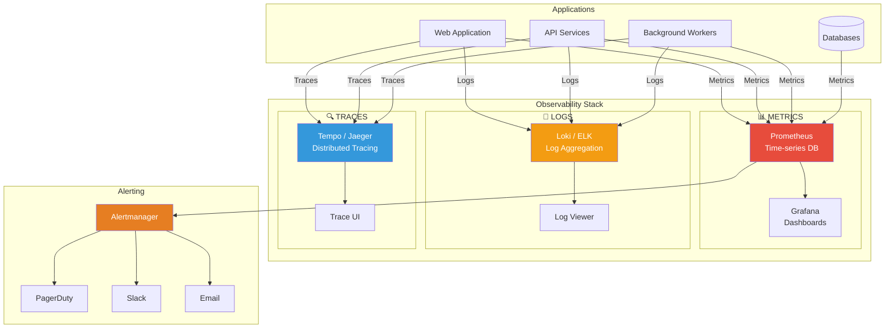
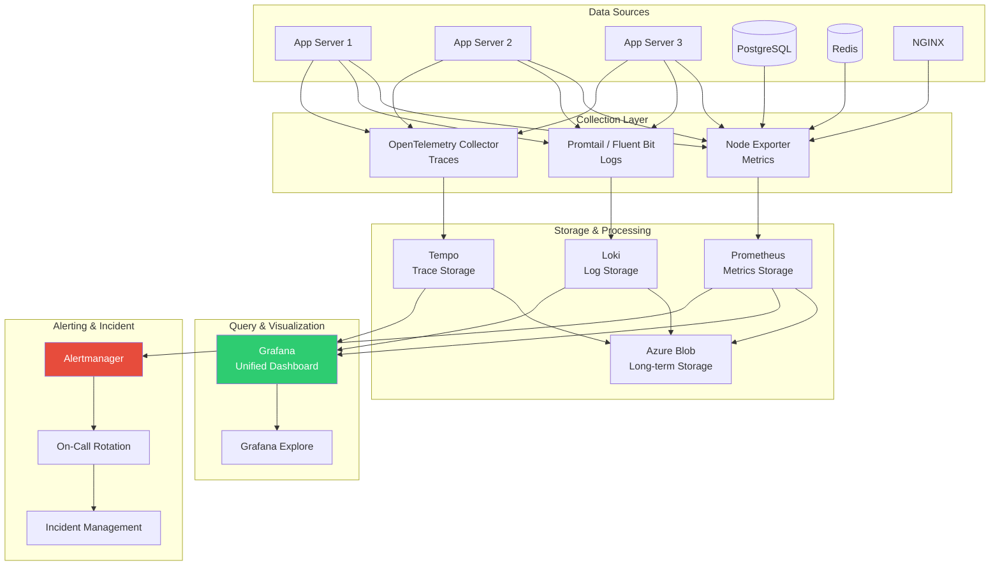
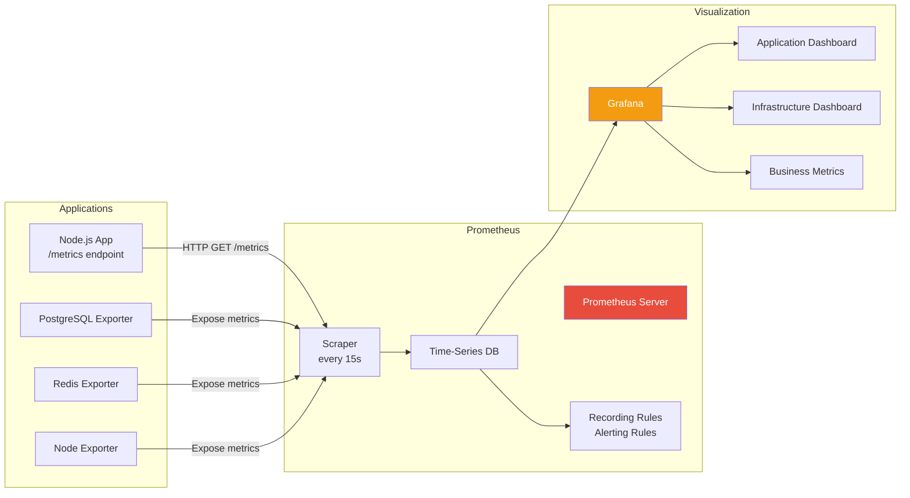
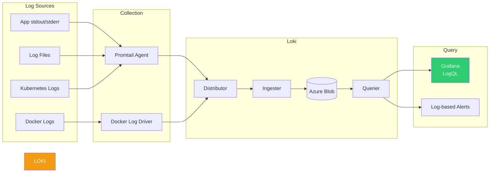
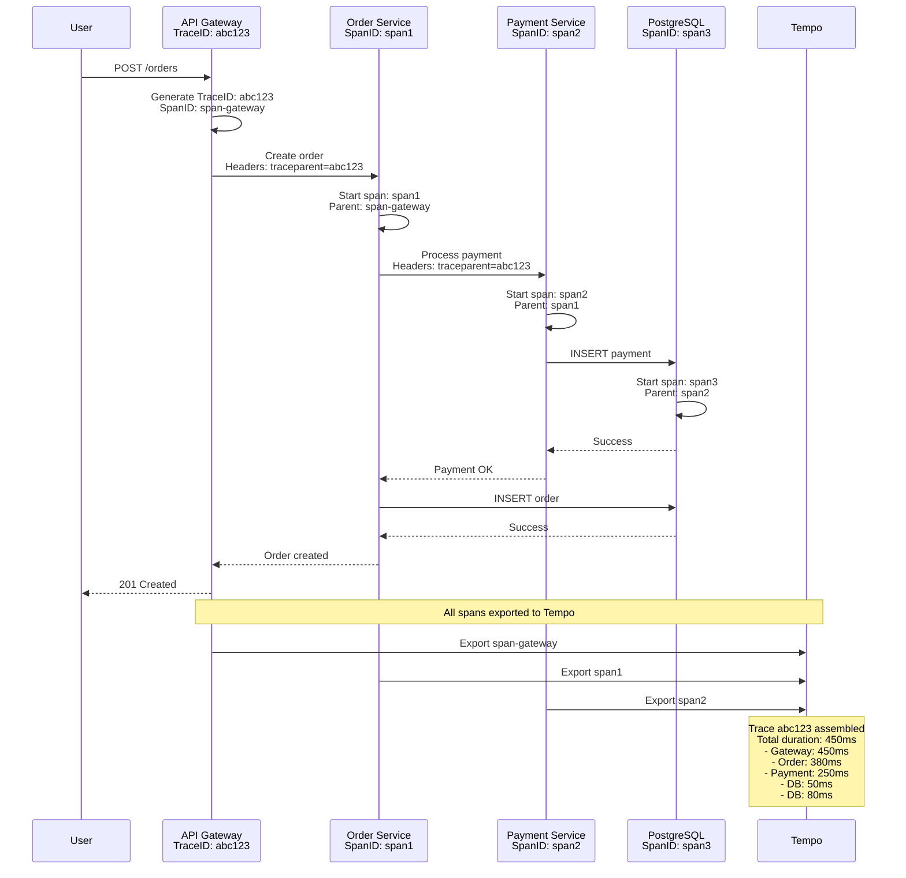

# Arquitectura de Observabilidad - Sistema Tiendi

Sistema de monitoreo, logs, métricas, trazas distribuidas y alertas.

---

## Los 3 Pilares de Observabilidad



---

## Arquitectura Completa de Observabilidad



---

## Stack de Métricas (Prometheus + Grafana)



---

## Stack de Logs (Loki)



---

## Distributed Tracing (Tempo / Jaeger)



---

## Métricas Clave (Golden Signals)

### RED Method (Requests, Errors, Duration)

```yaml
Requests (Rate):
  - http_requests_total
  - rate(http_requests_total[5m])

Errors (Error Rate):
  - http_requests_failed_total
  - rate(http_requests_failed_total[5m]) / rate(http_requests_total[5m])

Duration (Latency):
  - http_request_duration_seconds
  - histogram_quantile(0.95, http_request_duration_seconds)
```

### USE Method (Utilization, Saturation, Errors)

```yaml
Utilization:
  - node_cpu_seconds_total
  - node_memory_usage_bytes / node_memory_total_bytes

Saturation:
  - node_load1 / node_cpu_count
  - rate(node_disk_io_time_seconds_total[5m])

Errors:
  - node_network_transmit_errs_total
  - node_filesystem_readonly
```

---

## Dashboards de Grafana

### Dashboard 1: Application Overview

```yaml
Panels:
  - Request Rate (req/s)
  - Error Rate (%)
  - P95 Latency (ms)
  - Active Users
  - Database Connections
  - Cache Hit Rate
  - Queue Length
  - Background Job Success Rate

Queries:
  - rate(http_requests_total[5m])
  - rate(http_errors_total[5m]) / rate(http_requests_total[5m]) * 100
  - histogram_quantile(0.95, http_request_duration_seconds_bucket[5m])
```

### Dashboard 2: Infrastructure

```yaml
Panels:
  - CPU Usage per Node
  - Memory Usage per Node
  - Disk I/O
  - Network Traffic
  - Pod Status (Kubernetes)
  - Node Health

Queries:
  - 100 - (avg by (instance) (rate(node_cpu_seconds_total{mode="idle"}[5m])) * 100)
  - (node_memory_MemTotal_bytes - node_memory_MemAvailable_bytes) / node_memory_MemTotal_bytes * 100
```

### Dashboard 3: Business Metrics

```yaml
Panels:
  - GMV (Gross Merchandise Value)
  - Orders per Minute
  - Conversion Rate
  - Payment Success Rate
  - Average Order Value
  - Active Stores
  - Revenue per Store

Queries:
  - sum(rate(orders_total_amount[5m])) * 60
  - rate(orders_completed_total[1m]) * 60
  - rate(orders_completed_total[5m]) / rate(store_visits_total[5m]) * 100
```

---

## Alertas Críticas

### Configuración de Alertmanager

```yaml
# alertmanager.yml
global:
  resolve_timeout: 5m
  slack_api_url: 'https://hooks.slack.com/services/...'

route:
  group_by: ['alertname', 'cluster', 'service']
  group_wait: 10s
  group_interval: 10s
  repeat_interval: 12h
  receiver: 'default'
  routes:
    - match:
        severity: critical
      receiver: 'pagerduty'
      continue: true
    - match:
        severity: warning
      receiver: 'slack'

receivers:
  - name: 'default'
    email_configs:
      - to: 'team@tiendi.com'

  - name: 'pagerduty'
    pagerduty_configs:
      - service_key: '<key>'

  - name: 'slack'
    slack_configs:
      - channel: '#alerts'
        title: 'Alert: {{ .GroupLabels.alertname }}'
        text: '{{ range .Alerts }}{{ .Annotations.description }}{{ end }}'
```

### Reglas de Alerta (Prometheus)

```yaml
# alerts.yml
groups:
  - name: application
    interval: 30s
    rules:
      # Alta tasa de errores
      - alert: HighErrorRate
        expr: |
          rate(http_errors_total[5m]) / rate(http_requests_total[5m]) > 0.05
        for: 5m
        labels:
          severity: critical
        annotations:
          summary: "Alta tasa de errores: {{ $value }}%"
          description: "El servicio {{ $labels.service }} tiene más de 5% de errores"

      # Latencia alta
      - alert: HighLatency
        expr: |
          histogram_quantile(0.95,
            rate(http_request_duration_seconds_bucket[5m])
          ) > 1
        for: 10m
        labels:
          severity: warning
        annotations:
          summary: "P95 latency > 1s"
          description: "Latencia P95: {{ $value }}s"

      # Base de datos lenta
      - alert: SlowDatabaseQueries
        expr: |
          rate(postgres_slow_queries_total[5m]) > 10
        for: 5m
        labels:
          severity: warning
        annotations:
          summary: "Queries lentas detectadas"

      # Baja tasa de éxito de pagos
      - alert: LowPaymentSuccessRate
        expr: |
          rate(payment_success_total[10m]) / rate(payment_attempts_total[10m]) < 0.95
        for: 15m
        labels:
          severity: critical
        annotations:
          summary: "Tasa de éxito de pagos < 95%"
          description: "Solo {{ $value }}% de pagos exitosos"

  - name: infrastructure
    rules:
      # CPU alta
      - alert: HighCPUUsage
        expr: |
          100 - (avg by (instance) (rate(node_cpu_seconds_total{mode="idle"}[5m])) * 100) > 80
        for: 10m
        labels:
          severity: warning
        annotations:
          summary: "CPU > 80% en {{ $labels.instance }}"

      # Memoria alta
      - alert: HighMemoryUsage
        expr: |
          (node_memory_MemTotal_bytes - node_memory_MemAvailable_bytes)
          / node_memory_MemTotal_bytes * 100 > 90
        for: 5m
        labels:
          severity: critical
        annotations:
          summary: "Memoria > 90% en {{ $labels.instance }}"

      # Disco lleno
      - alert: DiskSpaceLow
        expr: |
          (node_filesystem_avail_bytes / node_filesystem_size_bytes) * 100 < 10
        for: 5m
        labels:
          severity: critical
        annotations:
          summary: "Disco < 10% libre en {{ $labels.instance }}"

      # Servicio caído
      - alert: ServiceDown
        expr: up == 0
        for: 2m
        labels:
          severity: critical
        annotations:
          summary: "Servicio {{ $labels.job }} está DOWN"
```

---

## Instrumentación de Aplicaciones

### Node.js + Express

```typescript
import express from 'express';
import promClient from 'prom-client';
import { trace, context, SpanStatusCode } from '@opentelemetry/api';

const app = express();

// Configurar Prometheus
const register = new promClient.Registry();
promClient.collectDefaultMetrics({ register });

// Métricas custom
const httpRequestDuration = new promClient.Histogram({
  name: 'http_request_duration_seconds',
  help: 'Duration of HTTP requests in seconds',
  labelNames: ['method', 'route', 'status_code'],
  buckets: [0.01, 0.05, 0.1, 0.5, 1, 2, 5]
});

const httpRequestsTotal = new promClient.Counter({
  name: 'http_requests_total',
  help: 'Total number of HTTP requests',
  labelNames: ['method', 'route', 'status_code']
});

register.registerMetric(httpRequestDuration);
register.registerMetric(httpRequestsTotal);

// Middleware de métricas
app.use((req, res, next) => {
  const start = Date.now();

  // Crear span para tracing
  const tracer = trace.getTracer('tiendi-api');
  const span = tracer.startSpan(`${req.method} ${req.path}`);

  span.setAttributes({
    'http.method': req.method,
    'http.url': req.url,
    'http.user_agent': req.get('user-agent')
  });

  res.on('finish', () => {
    const duration = (Date.now() - start) / 1000;

    // Registrar métricas
    httpRequestDuration.observe(
      { method: req.method, route: req.route?.path || req.path, status_code: res.statusCode },
      duration
    );

    httpRequestsTotal.inc({
      method: req.method,
      route: req.route?.path || req.path,
      status_code: res.statusCode
    });

    // Finalizar span
    span.setAttributes({
      'http.status_code': res.statusCode
    });

    if (res.statusCode >= 500) {
      span.setStatus({ code: SpanStatusCode.ERROR });
    }

    span.end();
  });

  next();
});

// Endpoint de métricas para Prometheus
app.get('/metrics', async (req, res) => {
  res.set('Content-Type', register.contentType);
  res.end(await register.metrics());
});

// Endpoint de health check
app.get('/health', (req, res) => {
  res.json({
    status: 'healthy',
    uptime: process.uptime(),
    timestamp: Date.now()
  });
});

// Logs estructurados
import winston from 'winston';

const logger = winston.createLogger({
  level: 'info',
  format: winston.format.json(),
  defaultMeta: { service: 'tiendi-api' },
  transports: [
    new winston.transports.Console({
      format: winston.format.combine(
        winston.format.timestamp(),
        winston.format.json()
      )
    })
  ]
});

app.use((req, res, next) => {
  logger.info('Request received', {
    method: req.method,
    path: req.path,
    ip: req.ip,
    user_id: req.user?.id
  });
  next();
});
```

---

## LogQL Queries (Loki)

```logql
# Buscar errores en los últimos 5 minutos
{app="tiendi-api"} |= "error" | json | line_format "{{.timestamp}} {{.level}} {{.message}}"

# Contar errores por servicio
sum by (service) (count_over_time({app="tiendi-api"} |= "error" [5m]))

# Latencia P95 de queries SQL
quantile_over_time(0.95,
  {app="tiendi-api"}
  | json
  | line_format "{{.query_duration}}"
  | unwrap query_duration [5m]
)

# Errores 500 agrupados por endpoint
{app="tiendi-api"}
  |= "status_code=500"
  | json
  | line_format "{{.endpoint}}"
  | count by (endpoint)

# Logs de un usuario específico
{app="tiendi-api"}
  | json
  | user_id="user_123"
  | line_format "{{.timestamp}} {{.level}} {{.message}}"
```

---

## PromQL Queries (Prometheus)

```promql
# Tasa de requests por segundo
rate(http_requests_total[5m])

# Error rate (últimos 5 min)
rate(http_errors_total[5m]) / rate(http_requests_total[5m]) * 100

# Latencia P95
histogram_quantile(0.95, rate(http_request_duration_seconds_bucket[5m]))

# Throughput por endpoint
sum by (route) (rate(http_requests_total[5m]))

# CPU usage por pod
sum by (pod) (rate(container_cpu_usage_seconds_total[5m])) * 100

# Memoria usada
(node_memory_MemTotal_bytes - node_memory_MemAvailable_bytes) / 1024 / 1024 / 1024

# Queries lentas en PostgreSQL (>1s)
rate(postgres_query_duration_seconds_bucket{le="1"}[5m])

# Redis cache hit rate
rate(redis_keyspace_hits_total[5m]) /
  (rate(redis_keyspace_hits_total[5m]) + rate(redis_keyspace_misses_total[5m])) * 100
```

---

## SLOs (Service Level Objectives)

```yaml
SLO: Availability
  Objective: 99.9% uptime
  Error Budget: 0.1% = 43 minutes/month
  Measurement: rate(http_requests_total{status_code!~"5.."}[30d]) / rate(http_requests_total[30d])

SLO: Latency
  Objective: P95 < 500ms
  Error Budget: 5% of requests > 500ms
  Measurement: histogram_quantile(0.95, http_request_duration_seconds_bucket[30d])

SLO: Payment Success Rate
  Objective: 99.5% success rate
  Error Budget: 0.5% failures
  Measurement: rate(payment_success_total[30d]) / rate(payment_attempts_total[30d])
```

---

## Costos Estimados

### Opción 1: Self-Hosted (VMs en Azure)

```
- VM para Prometheus (D2s v3): $70/mes
- VM para Loki (D4s v3): $140/mes
- VM para Tempo (D2s v3): $70/mes
- VM para Grafana (B2s): $40/mes
- Azure Blob Storage (500GB): $10/mes
Total: ~$330/mes
```

### Opción 2: Managed Services

```
- Grafana Cloud (Pro): $299/mes
  - Incluye: Prometheus, Loki, Tempo, Grafana
  - 50GB logs, 10K series, 50GB traces
- Azure Monitor: $200/mes
Total: ~$499/mes
```

---

**Fecha de creación:** 2025-01-24
**Versión:** 1.0
