# Flujos Adicionales - Sistema Tiendi

Diagramas de secuencia detallados para funcionalidades complementarias del sistema.

**Fecha:** 2025-11-25
**Versión:** 1.0

---

## Tabla de Contenidos

1. [Flujo de Valoraciones y Reviews](#1-flujo-de-valoraciones-y-reviews)
2. [Flujo de Cupones y Promociones](#2-flujo-de-cupones-y-promociones)
3. [Flujo de Devoluciones](#3-flujo-de-devoluciones)
4. [Flujo de Facturación Electrónica SUNAT](#4-flujo-de-facturación-electrónica-sunat)

---

## 1. Flujo de Valoraciones y Reviews

### 1.1 Diagrama de Secuencia

```mermaid
sequenceDiagram
    actor Customer as Cliente
    actor Vendor as Vendedor
    participant Web as Web App
    participant API as API Gateway
    participant Review as Review Service
    participant Order as Order Service
    participant Store as Store Service
    participant Notif as Notification Service
    participant Upload as Azure Blob Storage
    participant DB as PostgreSQL

    Note over Customer,DB: FASE 1: SOLICITAR VALORACIÓN

    Note over Order: Pedido entregado

    Order->>Notif: Evento: order_delivered<br/>{order_id, customer_id}

    Notif->>Customer: 📧 Email:<br/>"¿Cómo estuvo tu pedido?"<br/>Link: /orders/:id/review

    par Recordatorio después de 24h
        Notif->>Customer: 📱 Push:<br/>"Valora tu compra"
    end

    Note over Customer,DB: FASE 2: CREAR VALORACIÓN

    Customer->>Web: 1. Click "Dejar valoración"<br/>/orders/:id/review

    Web->>API: GET /orders/:id
    API->>Order: Validar orden
    Order->>DB: SELECT * FROM orders<br/>WHERE id = ? AND customer_id = ?

    DB-->>Order: Orden encontrada
    Order->>Order: Verificar:<br/>- Estado = 'entregado'<br/>- No tiene review

    alt Ya tiene valoración
        Order-->>API: 400 Error
        API-->>Web: "Ya valoraste este pedido"
        Web-->>Customer: Mensaje de error
    else Puede valorar
        Order-->>API: Orden válida
        API-->>Web: 200 OK
        Web-->>Customer: Formulario de valoración
    end

    Customer->>Web: 2. Completa valoración:<br/>⭐⭐⭐⭐⭐ (5 estrellas)<br/>Comentario: "Excelente servicio"

    Customer->>Web: 3. Sube fotos (opcional)<br/>3 imágenes

    loop Por cada imagen
        Web->>API: POST /upload/review-image
        API->>Upload: Subir a Azure Blob
        Upload-->>API: URL imagen
        API-->>Web: URL
    end

    Web->>API: POST /reviews<br/>{<br/>  order_id,<br/>  store_id,<br/>  rating: 5,<br/>  comment: "...",<br/>  images: [...]<br/>}

    API->>Review: Crear valoración

    rect rgb(240, 248, 255)
        Note over Review,DB: Transacción Atómica
        Review->>DB: BEGIN TRANSACTION

        Review->>DB: INSERT INTO reviews<br/>(order_id, store_id,<br/>customer_id, rating,<br/>comment, status: 'pending')
        DB-->>Review: review_id: 123

        Review->>DB: INSERT INTO review_images<br/>VALUES (...)
        DB-->>Review: Imágenes guardadas

        Review->>DB: UPDATE orders<br/>SET has_review = true
        DB-->>Review: Actualizado

        Review->>DB: COMMIT
    end

    Review->>Notif: Evento: new_review
    Notif->>Vendor: 🔔 "Nueva valoración recibida"

    Review-->>API: Valoración creada
    API-->>Web: 201 Created
    Web-->>Customer: "✅ Gracias por tu valoración!"

    Note over Customer,DB: FASE 3: MODERACIÓN (Automática)

    Review->>Review: Análisis de contenido

    alt Contenido apropiado
        Review->>DB: UPDATE reviews<br/>SET status = 'approved',<br/>published_at = NOW()
        DB-->>Review: Aprobado

        Review->>Store: Actualizar promedio
        Store->>DB: SELECT AVG(rating)<br/>FROM reviews<br/>WHERE store_id = ?<br/>AND status = 'approved'
        DB-->>Store: avg_rating: 4.5

        Store->>DB: UPDATE stores<br/>SET rating = 4.5,<br/>total_reviews = total_reviews + 1
        DB-->>Store: Actualizado

    else Contenido inapropiado
        Review->>DB: UPDATE reviews<br/>SET status = 'flagged',<br/>flagged_reason = 'profanity'
        DB-->>Review: Marcado para revisión

        Review->>Notif: Alerta a admin
        Notif->>Notif: 📧 "Review necesita moderación"
    end

    Note over Customer,DB: FASE 4: RESPUESTA DEL VENDEDOR

    Vendor->>Web: 4. Ver valoraciones<br/>/vendor/reviews

    Web->>API: GET /vendor/reviews
    API->>Review: Listar reviews
    Review->>DB: SELECT reviews<br/>JOIN users<br/>WHERE store_id = ?<br/>ORDER BY created_at DESC
    DB-->>Review: Lista de reviews
    Review-->>API: Reviews
    API-->>Web: 200 OK
    Web-->>Vendor: Muestra valoraciones

    Vendor->>Web: 5. Responder valoración<br/>Review #123

    Vendor->>Web: Escribe respuesta:<br/>"¡Gracias por tu preferencia!"

    Web->>API: POST /reviews/:id/response<br/>{response: "..."}

    API->>Review: Agregar respuesta
    Review->>DB: UPDATE reviews<br/>SET vendor_response = ?,<br/>responded_at = NOW()
    DB-->>Review: Actualizado

    Review->>Notif: Evento: review_response
    Notif->>Customer: 📱 "El vendedor respondió<br/>tu valoración"

    Review-->>API: Respuesta guardada
    API-->>Web: 200 OK
    Web-->>Vendor: "Respuesta publicada"

    Note over Customer,DB: FASE 5: REPORTAR VALORACIÓN

    alt Cliente reporta review falsa
        Customer->>Web: Reportar review
        Web->>API: POST /reviews/:id/report<br/>{reason: 'fake'}
        API->>Review: Crear reporte
        Review->>DB: INSERT INTO review_reports
        DB-->>Review: Reporte creado
        Review->>Notif: Alerta a admin
        Review-->>API: Reportado
        API-->>Web: 200 OK
        Web-->>Customer: "Reporte enviado"
    end

    Note over Customer,DB: ✅ VALORACIÓN COMPLETADA
```



### 1.2 Endpoints de API

```typescript
// Crear valoración
POST /api/v1/reviews
Body: {
  order_id: string,
  store_id: string,
  rating: number, // 1-5
  comment: string,
  images?: string[]
}

// Listar valoraciones de tienda
GET /api/v1/stores/:id/reviews?page={n}&sort={rating|date}

// Obtener una valoración
GET /api/v1/reviews/:id

// Responder valoración (vendedor)
POST /api/v1/reviews/:id/response
Body: { response: string }

// Reportar valoración
POST /api/v1/reviews/:id/report
Body: { reason: string }

// Valoraciones del vendedor
GET /api/v1/vendor/reviews?status={all|pending|approved}
```

### 1.3 Reglas de Negocio

- Solo clientes con pedidos entregados pueden valorar
- Una valoración por pedido
- Rating de 1 a 5 estrellas
- Comentario opcional (máximo 500 caracteres)
- Hasta 5 imágenes por valoración
- Moderación automática de contenido
- Vendedor puede responder una vez
- Rating promedio se actualiza en tiempo real

---

## 2. Flujo de Cupones y Promociones

### 2.1 Diagrama de Secuencia

```mermaid
sequenceDiagram
    actor Customer as Cliente
    actor Vendor as Vendedor
    participant Web as Web App
    participant API as API Gateway
    participant Coupon as Coupon Service
    participant Order as Order Service
    participant DB as PostgreSQL
    participant Redis as Redis Cache
    participant Notif as Notification Service

    Note over Customer,Notif: FASE 1: CREAR CUPÓN (Vendedor)

    Vendor->>Web: 1. Dashboard vendedor<br/>/vendor/coupons/new

    Vendor->>Web: 2. Completa formulario:<br/>- Código: "VERANO2025"<br/>- Tipo: Porcentaje<br/>- Descuento: 20%<br/>- Mínimo de compra: S/ 50<br/>- Fecha inicio/fin<br/>- Usos máximos: 100

    Web->>Web: Validación frontend

    Web->>API: POST /coupons<br/>{<br/>  store_id,<br/>  code: "VERANO2025",<br/>  type: "percentage",<br/>  value: 20,<br/>  min_purchase: 50,<br/>  start_date,<br/>  end_date,<br/>  max_uses: 100<br/>}

    API->>Coupon: Crear cupón

    Coupon->>DB: SELECT * FROM coupons<br/>WHERE store_id = ?<br/>AND code = ?

    alt Código ya existe
        DB-->>Coupon: Cupón encontrado
        Coupon-->>API: 409 Conflict
        API-->>Web: "Código ya existe"
        Web-->>Vendor: Error, elegir otro código
    else Código disponible
        Coupon->>DB: INSERT INTO coupons<br/>(store_id, code, type,<br/>value, min_purchase,<br/>start_date, end_date,<br/>max_uses, status: 'active')
        DB-->>Coupon: coupon_id: 123

        Coupon->>Redis: Cache cupón<br/>key: "coupon:VERANO2025"<br/>ttl: 1 hour
        Redis-->>Coupon: Cached

        Coupon-->>API: Cupón creado
        API-->>Web: 201 Created
        Web-->>Vendor: "✅ Cupón creado exitosamente"
    end

    Note over Customer,Notif: FASE 2: COMPARTIR CUPÓN

    Vendor->>Web: 3. Click "Compartir cupón"

    Web-->>Vendor: Opciones:<br/>- Copiar código<br/>- Compartir en redes sociales<br/>- Enviar por email a clientes

    alt Enviar por email
        Vendor->>Web: Seleccionar clientes
        Web->>API: POST /coupons/:id/send-email<br/>{customer_ids: [...]}
        API->>Coupon: Enviar cupones
        Coupon->>Notif: Enviar emails masivos

        loop Por cada cliente
            Notif->>Customer: 📧 Email:<br/>"¡Cupón especial para ti!<br/>VERANO2025 - 20% OFF"
        end

        Coupon-->>API: Enviado
        API-->>Web: 200 OK
        Web-->>Vendor: "Cupones enviados a 50 clientes"
    end

    Note over Customer,Notif: FASE 3: APLICAR CUPÓN (Checkout)

    Customer->>Web: 4. Checkout con carrito<br/>Total: S/ 75.00

    Web-->>Customer: Formulario de pago<br/>+ Campo "Código de descuento"

    Customer->>Web: 5. Ingresa código:<br/>"VERANO2025"

    Web->>API: POST /coupons/validate<br/>{<br/>  code: "VERANO2025",<br/>  store_id,<br/>  cart_total: 75.00,<br/>  user_id<br/>}

    API->>Coupon: Validar cupón

    Coupon->>Redis: GET "coupon:VERANO2025"

    alt Cache hit
        Redis-->>Coupon: Cupón en cache
    else Cache miss
        Coupon->>DB: SELECT * FROM coupons<br/>WHERE code = ?<br/>AND store_id = ?
        DB-->>Coupon: Cupón encontrado
        Coupon->>Redis: Cache cupón
    end

    Coupon->>Coupon: Validaciones:

    alt Cupón inválido
        Coupon-->>API: 400 Error<br/>{error: "Cupón inválido"}
        API-->>Web: Error
        Web-->>Customer: "❌ Cupón no válido"

    else Cupón expirado
        Coupon-->>API: 400 Error<br/>{error: "Cupón expirado"}
        API-->>Web: Error
        Web-->>Customer: "❌ Cupón expirado"

    else Monto mínimo no alcanzado
        Coupon-->>API: 400 Error<br/>{error: "Compra mínima: S/ 50"}
        API-->>Web: Error
        Web-->>Customer: "❌ Compra mínima no alcanzada"

    else Ya usó el cupón
        Coupon->>DB: SELECT * FROM coupon_usages<br/>WHERE coupon_id = ?<br/>AND user_id = ?
        DB-->>Coupon: Ya usado
        Coupon-->>API: 400 Error<br/>{error: "Ya usaste este cupón"}
        API-->>Web: Error
        Web-->>Customer: "❌ Ya usaste este cupón"

    else Cupón agotado
        Coupon->>DB: SELECT COUNT(*)<br/>FROM coupon_usages<br/>WHERE coupon_id = ?
        DB-->>Coupon: uses_count: 100
        Coupon-->>API: 400 Error<br/>{error: "Cupón agotado"}
        API-->>Web: Error
        Web-->>Customer: "❌ Cupón agotado"

    else Cupón válido
        Coupon->>Coupon: Calcular descuento:<br/>S/ 75.00 * 20% = S/ 15.00<br/>Nuevo total: S/ 60.00

        Coupon-->>API: 200 OK<br/>{<br/>  valid: true,<br/>  discount: 15.00,<br/>  new_total: 60.00<br/>}
        API-->>Web: Descuento aplicado
        Web-->>Customer: "✅ Cupón aplicado!<br/>Descuento: -S/ 15.00<br/>Total: S/ 60.00"
    end

    Note over Customer,Notif: FASE 4: CREAR ORDEN CON CUPÓN

    Customer->>Web: 6. Confirmar compra

    Web->>API: POST /orders<br/>{<br/>  cart_id,<br/>  coupon_code: "VERANO2025",<br/>  delivery_address,<br/>  payment_method<br/>}

    API->>Order: Crear orden

    rect rgb(240, 248, 255)
        Note over Order,DB: Transacción Atómica
        Order->>DB: BEGIN TRANSACTION

        Order->>Coupon: Re-validar cupón
        Coupon->>Coupon: Verificar disponibilidad

        alt Cupón aún válido
            Order->>DB: INSERT INTO orders<br/>(user_id, store_id,<br/>subtotal: 75.00,<br/>discount: 15.00,<br/>total: 60.00,<br/>coupon_id)
            DB-->>Order: order_id: 456

            Order->>DB: INSERT INTO order_items<br/>FROM cart_items
            DB-->>Order: Items insertados

            Order->>DB: INSERT INTO coupon_usages<br/>(coupon_id, user_id,<br/>order_id, discount: 15.00)
            DB-->>Order: Uso registrado

            Order->>DB: UPDATE coupons<br/>SET current_uses = current_uses + 1<br/>WHERE id = coupon_id
            DB-->>Order: Contador actualizado

            Order->>DB: COMMIT
        else Cupón ya no válido
            Order->>DB: ROLLBACK
            Order-->>API: Error
        end
    end

    Order-->>API: Orden creada
    API-->>Web: 201 Created
    Web-->>Customer: Orden confirmada con descuento

    Note over Customer,Notif: FASE 5: ESTADÍSTICAS DE CUPÓN

    Vendor->>Web: 7. Ver estadísticas<br/>/vendor/coupons/:id/stats

    Web->>API: GET /coupons/:id/stats

    API->>Coupon: Obtener estadísticas
    Coupon->>DB: SELECT<br/>  COUNT(*) as total_uses,<br/>  SUM(discount) as total_discount,<br/>  AVG(discount) as avg_discount<br/>FROM coupon_usages<br/>WHERE coupon_id = ?

    DB-->>Coupon: Estadísticas
    Coupon-->>API: Stats
    API-->>Web: 200 OK

    Web-->>Vendor: Dashboard con:<br/>- Usos: 45/100<br/>- Descuento total: S/ 675<br/>- Ahorro promedio: S/ 15<br/>- Conversión: 25%

    Note over Customer,Notif: ✅ CUPÓN COMPLETADO
```



### 2.2 Endpoints de API

```typescript
// Crear cupón (vendedor)
POST /api/v1/coupons
Body: {
  code: string,
  type: 'percentage' | 'fixed',
  value: number,
  min_purchase?: number,
  max_discount?: number,
  start_date: Date,
  end_date: Date,
  max_uses?: number,
  max_uses_per_user?: number
}

// Validar cupón
POST /api/v1/coupons/validate
Body: {
  code: string,
  store_id: string,
  cart_total: number,
  user_id: string
}

// Listar cupones de tienda
GET /api/v1/vendor/coupons?status={active|expired|all}

// Estadísticas de cupón
GET /api/v1/coupons/:id/stats

// Desactivar cupón
DELETE /api/v1/coupons/:id

// Enviar cupones por email
POST /api/v1/coupons/:id/send-email
Body: { customer_ids: string[] }
```

### 2.3 Tipos de Cupones

| Tipo | Descripción | Ejemplo |
|------|-------------|---------|
| **Porcentaje** | Descuento porcentual | 20% OFF |
| **Monto fijo** | Descuento fijo | S/ 10 OFF |
| **Envío gratis** | Sin costo de delivery | FREE SHIPPING |
| **2x1** | Producto gratis | BUY1GET1 |

---

## 3. Flujo de Devoluciones

### 3.1 Diagrama de Secuencia

```mermaid
sequenceDiagram
    actor Customer as Cliente
    actor Vendor as Vendedor
    actor Admin as Admin
    participant Web as Web App
    participant API as API Gateway
    participant Return as Return Service
    participant Order as Order Service
    participant Payment as Payment Service
    participant Notif as Notification Service
    participant Upload as Azure Blob Storage
    participant DB as PostgreSQL

    Note over Customer,DB: FASE 1: SOLICITAR DEVOLUCIÓN

    Customer->>Web: 1. Ver pedido entregado<br/>/orders/:id

    Web->>API: GET /orders/:id
    API->>Order: Obtener orden
    Order->>DB: SELECT * FROM orders
    DB-->>Order: Orden
    Order-->>API: Datos
    API-->>Web: 200 OK

    Web-->>Customer: Detalles del pedido<br/>+ Botón "Solicitar devolución"

    alt Fuera del plazo (> 7 días)
        Web-->>Customer: Botón deshabilitado<br/>"Plazo de devolución expirado"
    else Dentro del plazo
        Customer->>Web: 2. Click "Solicitar devolución"

        Web-->>Customer: Formulario:<br/>- Motivo de devolución<br/>- Productos a devolver<br/>- Fotos de evidencia

        Customer->>Web: 3. Completa:<br/>Motivo: "Producto defectuoso"<br/>Producto: Cerveza 6 pack<br/>Sube 3 fotos

        loop Por cada foto
            Web->>API: POST /upload/return-image
            API->>Upload: Subir a Azure Blob
            Upload-->>API: URL
            API-->>Web: URL
        end

        Web->>API: POST /returns<br/>{<br/>  order_id,<br/>  items: [{product_id, qty}],<br/>  reason: "defective",<br/>  description: "...",<br/>  images: [...]<br/>}

        API->>Return: Crear solicitud

        rect rgb(255, 245, 245)
            Note over Return,DB: Crear Devolución
            Return->>DB: BEGIN TRANSACTION

            Return->>DB: INSERT INTO returns<br/>(order_id, customer_id,<br/>status: 'pending',<br/>reason, description)
            DB-->>Return: return_id: 789

            Return->>DB: INSERT INTO return_items<br/>VALUES (...)
            DB-->>Return: Items guardados

            Return->>DB: INSERT INTO return_images<br/>VALUES (...)
            DB-->>Return: Imágenes guardadas

            Return->>DB: UPDATE orders<br/>SET has_return = true
            DB-->>Return: Actualizado

            Return->>DB: COMMIT
        end

        Return->>Notif: Evento: return_created
        Notif->>Vendor: 🔔 "Solicitud de devolución"<br/>Order #OBI-00123
        Notif->>Customer: 📧 "Solicitud recibida"

        Return-->>API: Devolución creada
        API-->>Web: 201 Created
        Web-->>Customer: "✅ Solicitud enviada<br/>ID: DEV-00789"
    end

    Note over Customer,DB: FASE 2: REVISIÓN POR VENDEDOR

    Vendor->>Web: 4. Dashboard vendedor<br/>/vendor/returns

    Web->>API: GET /vendor/returns?status=pending
    API->>Return: Listar devoluciones
    Return->>DB: SELECT returns<br/>JOIN orders<br/>JOIN return_items<br/>WHERE store_id = ?<br/>AND status = 'pending'
    DB-->>Return: Lista
    Return-->>API: Devoluciones
    API-->>Web: 200 OK
    Web-->>Vendor: Muestra solicitudes pendientes

    Vendor->>Web: 5. Click en devolución #DEV-00789

    Web->>API: GET /returns/:id
    API->>Return: Obtener detalles
    Return->>DB: SELECT returns<br/>JOIN return_items<br/>JOIN return_images
    DB-->>Return: Detalles completos
    Return-->>API: Datos
    API-->>Web: 200 OK

    Web-->>Vendor: Muestra:<br/>- Cliente<br/>- Motivo<br/>- Productos<br/>- Fotos evidencia<br/>- Botones: [Aprobar] [Rechazar]

    alt Vendedor aprueba
        Vendor->>Web: 6. Click "Aprobar devolución"

        Web->>API: PUT /returns/:id/approve<br/>{<br/>  refund_method: 'original',<br/>  instructions: "Devolver<br/>  producto a tienda"<br/>}

        API->>Return: Aprobar devolución

        Return->>DB: UPDATE returns<br/>SET status = 'approved',<br/>refund_method = 'original',<br/>approved_at = NOW()
        DB-->>Return: Actualizado

        Return->>Notif: Evento: return_approved
        Notif->>Customer: 📧 "Devolución aprobada"<br/>Instrucciones para devolver

        Return-->>API: Aprobado
        API-->>Web: 200 OK
        Web-->>Vendor: "Devolución aprobada"

    else Vendedor rechaza
        Vendor->>Web: Click "Rechazar"<br/>Razón: "Producto en buen estado"

        Web->>API: PUT /returns/:id/reject<br/>{reason: "..."}

        API->>Return: Rechazar
        Return->>DB: UPDATE returns<br/>SET status = 'rejected',<br/>rejection_reason = ?
        DB-->>Return: Actualizado

        Return->>Notif: Evento: return_rejected
        Notif->>Customer: 📧 "Devolución rechazada"<br/>Razón: "..."

        Return-->>API: Rechazado
        API-->>Web: 200 OK
        Web-->>Vendor: "Devolución rechazada"
    end

    Note over Customer,DB: FASE 3: CLIENTE DEVUELVE PRODUCTO

    alt Devolución aprobada
        Customer->>Customer: Devuelve producto<br/>a la tienda física

        Vendor->>Web: 7. Confirmar recepción<br/>del producto

        Web->>API: PUT /returns/:id/confirm-receipt

        API->>Return: Confirmar recepción
        Return->>DB: UPDATE returns<br/>SET status = 'received',<br/>received_at = NOW()
        DB-->>Return: Actualizado

        Return->>Notif: Evento: return_received
        Notif->>Customer: 📧 "Producto recibido<br/>Procesando reembolso"

        Return-->>API: Confirmado
        API-->>Web: 200 OK
        Web-->>Vendor: "Producto recibido"
    end

    Note over Customer,DB: FASE 4: PROCESAR REEMBOLSO

    Vendor->>Web: 8. Iniciar reembolso

    Web->>API: POST /returns/:id/refund

    API->>Return: Procesar reembolso

    Return->>Order: Obtener info de pago original
    Order->>DB: SELECT payment_method,<br/>transaction_id<br/>FROM orders
    DB-->>Order: Info de pago
    Order-->>Return: Datos de pago

    alt Pago con tarjeta
        Return->>Payment: Iniciar reembolso
        Payment->>Payment: POST to Niubiz/Culqi<br/>Refund API
        Payment-->>Return: Reembolso procesado<br/>refund_id: xyz

        Return->>DB: INSERT INTO refunds<br/>(return_id, amount,<br/>method: 'card',<br/>status: 'completed',<br/>refund_id)
        DB-->>Return: Guardado

    else Pago en efectivo
        Return->>DB: INSERT INTO refunds<br/>(return_id, amount,<br/>method: 'manual',<br/>status: 'pending',<br/>notes: 'Devolver en tienda')
        DB-->>Return: Guardado
    end

    Return->>DB: UPDATE returns<br/>SET status = 'refunded',<br/>refunded_at = NOW()
    DB-->>Return: Actualizado

    Return->>DB: UPDATE products<br/>SET stock = stock + qty<br/>WHERE id IN (return_items)
    DB-->>Return: Stock restaurado

    Return->>Notif: Evento: return_refunded
    Notif->>Customer: 📧 "Reembolso procesado"<br/>Método: Tarjeta original<br/>Tiempo: 5-7 días hábiles

    Return-->>API: Reembolsado
    API-->>Web: 200 OK
    Web-->>Vendor: "✅ Reembolso completado"

    Note over Customer,DB: FASE 5: DISPUTAS (Si hay conflicto)

    alt Cliente no está de acuerdo con rechazo
        Customer->>Web: 9. Apelar decisión

        Web->>API: POST /returns/:id/dispute<br/>{reason: "Producto sí<br/>estaba defectuoso"}

        API->>Return: Crear disputa
        Return->>DB: INSERT INTO disputes<br/>(return_id, status: 'open')
        DB-->>Return: dispute_id: 999

        Return->>DB: UPDATE returns<br/>SET status = 'disputed'
        DB-->>Return: Actualizado

        Return->>Notif: Alerta a admin
        Notif->>Admin: 🚨 "Nueva disputa<br/>requiere mediación"

        Return-->>API: Disputa creada
        API-->>Web: 201 Created
        Web-->>Customer: "Disputa enviada al equipo"

        Admin->>Admin: Revisar evidencia<br/>de ambas partes

        Admin->>API: PUT /disputes/:id/resolve<br/>{resolution: 'favor_customer'}

        API->>Return: Resolver disputa
        Return->>DB: UPDATE disputes<br/>SET status = 'resolved',<br/>resolution = ?
        DB-->>Return: Resuelto

        Return->>Notif: Notificar resultado
        Notif->>Customer: 📧 Resolución
        Notif->>Vendor: 📧 Resolución

        Return-->>API: Disputa resuelta
    end

    Note over Customer,DB: ✅ DEVOLUCIÓN COMPLETADA
```



### 3.2 Endpoints de API

```typescript
// Crear solicitud de devolución
POST /api/v1/returns
Body: {
  order_id: string,
  items: {
    product_id: string,
    quantity: number,
    reason: string
  }[],
  reason: string,
  description: string,
  images?: string[]
}

// Listar devoluciones (vendedor)
GET /api/v1/vendor/returns?status={pending|approved|rejected}

// Obtener devolución
GET /api/v1/returns/:id

// Aprobar/Rechazar devolución (vendedor)
PUT /api/v1/returns/:id/approve
PUT /api/v1/returns/:id/reject
Body: { reason?: string }

// Confirmar recepción del producto
PUT /api/v1/returns/:id/confirm-receipt

// Procesar reembolso
POST /api/v1/returns/:id/refund

// Crear disputa
POST /api/v1/returns/:id/dispute
Body: { reason: string }
```

### 3.3 Estados de Devolución

```
pending → approved → received → refunded
            ↓
         rejected → disputed → resolved
```

### 3.4 Políticas de Devolución

- **Plazo:** 7 días desde la entrega
- **Condición:** Producto sin usar y en empaque original
- **Reembolso:** Método de pago original
- **Tiempo:** 5-7 días hábiles para tarjetas
- **Excepciones:** Productos perecibles no aceptan devolución

---

## 4. Flujo de Facturación Electrónica SUNAT

### 4.1 Diagrama de Secuencia

```mermaid
sequenceDiagram
    actor Customer as Cliente
    actor Vendor as Vendedor
    participant Web as Web App
    participant API as API Gateway
    participant Order as Order Service
    participant Invoice as Invoice Service
    participant Nubefact as Nubefact PSE
    participant SUNAT as SUNAT
    participant Storage as Azure Blob Storage
    participant Email as Email Service
    participant DB as PostgreSQL

    Note over Customer,DB: FASE 1: SOLICITAR COMPROBANTE

    Customer->>Web: 1. Checkout - Paso de pago

    Web-->>Customer: Formulario:<br/>¿Necesita comprobante?<br/>⚪ No necesito<br/>⚪ Boleta<br/>⚪ Factura

    alt Cliente solicita factura
        Customer->>Web: Selecciona "Factura"

        Web-->>Customer: Formulario fiscal:<br/>- RUC (requerido)<br/>- Razón Social<br/>- Dirección Fiscal

        Customer->>Web: 2. Completa datos:<br/>RUC: 20123456789<br/>Razón Social: "EMPRESA SAC"<br/>Dirección: "Av. Principal 123"

        Web->>Web: Validar RUC (11 dígitos)

        Web->>API: POST /orders<br/>{<br/>  ...,<br/>  invoice_required: true,<br/>  invoice_type: 'factura',<br/>  tax_info: {<br/>    ruc: "20123456789",<br/>    business_name: "EMPRESA SAC",<br/>    address: "..."<br/>  }<br/>}

    else Cliente solicita boleta
        Customer->>Web: Selecciona "Boleta"

        Web-->>Customer: Datos personales:<br/>- DNI<br/>- Nombres completos

        Web->>API: POST /orders<br/>{<br/>  ...,<br/>  invoice_required: true,<br/>  invoice_type: 'boleta',<br/>  tax_info: {<br/>    document: dni,<br/>    name: "..."<br/>  }<br/>}

    else No necesita comprobante
        Web->>API: POST /orders<br/>{invoice_required: false}
    end

    API->>Order: Crear orden
    Order->>DB: INSERT INTO orders<br/>(..., invoice_required,<br/>invoice_type, tax_info)
    DB-->>Order: order_id: 123

    Order-->>API: Orden creada
    API-->>Web: 201 Created
    Web-->>Customer: Orden confirmada

    Note over Customer,DB: FASE 2: GENERAR COMPROBANTE (Automático)

    alt Comprobante solicitado
        Order->>Invoice: Evento: generate_invoice<br/>{order_id: 123}

        Invoice->>DB: SELECT orders<br/>JOIN order_items<br/>JOIN products<br/>WHERE id = 123
        DB-->>Invoice: Datos completos de orden

        Invoice->>Invoice: Calcular totales:<br/>- Subtotal (base imponible)<br/>- IGV 18%<br/>- Total

        Invoice->>Invoice: Preparar datos para SUNAT:<br/>- Serie y correlativo<br/>- Tipo de comprobante<br/>- Datos del emisor (tienda)<br/>- Datos del receptor (cliente)<br/>- Detalle de items<br/>- Totales

        rect rgb(240, 255, 240)
            Note over Invoice,SUNAT: Emisión SUNAT

            Invoice->>Nubefact: POST /api/v1/invoice<br/>{<br/>  tipo_comprobante: "01",<br/>  serie: "F001",<br/>  numero: "00000123",<br/>  cliente: {<br/>    ruc: "20123456789",<br/>    razon_social: "...",<br/>    direccion: "..."<br/>  },<br/>  items: [...],<br/>  totales: {...}<br/>}

            Nubefact->>Nubefact: Validar datos

            alt Datos válidos
                Nubefact->>SUNAT: Enviar comprobante<br/>electrónico (XML)

                SUNAT->>SUNAT: Validar comprobante

                alt SUNAT acepta
                    SUNAT-->>Nubefact: CDR (Constancia<br/>de Recepción)<br/>Estado: Aceptado

                    Nubefact->>Nubefact: Generar PDF<br/>con código QR

                    Nubefact-->>Invoice: 200 OK<br/>{<br/>  success: true,<br/>  serie: "F001",<br/>  numero: "00000123",<br/>  pdf_url: "...",<br/>  xml_url: "...",<br/>  cdr_url: "..."<br/>}

                    Invoice->>Storage: Guardar archivos<br/>PDF, XML, CDR
                    Storage-->>Invoice: URLs guardadas

                    Invoice->>DB: INSERT INTO invoices<br/>(order_id, type: 'factura',<br/>serie: 'F001',<br/>numero: '00000123',<br/>pdf_url, xml_url,<br/>status: 'emitted',<br/>sunat_response)
                    DB-->>Invoice: invoice_id: 456

                    Invoice->>DB: UPDATE orders<br/>SET invoice_id = 456,<br/>invoice_status = 'emitted'
                    DB-->>Invoice: Actualizado

                    Invoice->>Email: Enviar comprobante
                    Email->>Customer: 📧 Email:<br/>"Tu factura electrónica"<br/>Adjunto: F001-00000123.pdf

                    Invoice->>Invoice: ✅ Comprobante emitido

                else SUNAT rechaza
                    SUNAT-->>Nubefact: Error:<br/>"RUC no válido"

                    Nubefact-->>Invoice: 400 Error<br/>{error: "RUC inválido"}

                    Invoice->>DB: INSERT INTO invoices<br/>(status: 'failed',<br/>error_message)
                    DB-->>Invoice: Guardado

                    Invoice->>DB: UPDATE orders<br/>SET invoice_status = 'failed'
                    DB-->>Invoice: Actualizado

                    Invoice->>Invoice: ⚠️ Notificar error
                    Invoice->>Vendor: 🔔 "Error al emitir<br/>factura #123"
                end

            else Datos inválidos
                Nubefact-->>Invoice: 400 Error<br/>{error: "Datos incompletos"}
                Invoice->>Invoice: Registrar error
            end
        end
    end

    Note over Customer,DB: FASE 3: CLIENTE DESCARGA COMPROBANTE

    Customer->>Web: 3. Ver pedido<br/>/orders/:id

    Web->>API: GET /orders/:id
    API->>Order: Obtener orden con factura
    Order->>DB: SELECT orders<br/>LEFT JOIN invoices
    DB-->>Order: Orden + Factura
    Order-->>API: Datos
    API-->>Web: 200 OK

    Web-->>Customer: Muestra pedido<br/>+ Botón "Descargar Factura"

    Customer->>Web: Click "Descargar Factura"

    Web->>API: GET /invoices/:id/download

    API->>Invoice: Obtener PDF
    Invoice->>DB: SELECT pdf_url<br/>FROM invoices
    DB-->>Invoice: URL del PDF
    Invoice->>Storage: Obtener archivo
    Storage-->>Invoice: PDF file
    Invoice-->>API: PDF
    API-->>Web: PDF file
    Web-->>Customer: Descarga<br/>F001-00000123.pdf

    Note over Customer,DB: FASE 4: NOTA DE CRÉDITO (Anulación)

    alt Necesita anular factura
        Vendor->>Web: 4. Dashboard vendedor<br/>/vendor/invoices

        Vendor->>Web: Seleccionar factura<br/>Click "Emitir nota de crédito"

        Web-->>Vendor: Formulario:<br/>- Motivo de anulación<br/>- Descripción

        Vendor->>Web: Motivo: "Anulación de venta"

        Web->>API: POST /invoices/:id/credit-note<br/>{<br/>  reason: "Anulación",<br/>  description: "..."<br/>}

        API->>Invoice: Emitir nota de crédito

        Invoice->>Nubefact: POST /api/v1/credit-note<br/>{<br/>  factura_afectada: "F001-00000123",<br/>  tipo_nota: "07",<br/>  motivo: "01",<br/>  descripcion: "..."<br/>}

        Nubefact->>SUNAT: Enviar nota de crédito

        SUNAT-->>Nubefact: CDR Aceptado

        Nubefact-->>Invoice: 200 OK<br/>{<br/>  serie: "FC01",<br/>  numero: "00000001",<br/>  pdf_url: "..."<br/>}

        Invoice->>DB: INSERT INTO credit_notes<br/>(invoice_id, serie, numero,<br/>pdf_url, status: 'emitted')
        DB-->>Invoice: Guardado

        Invoice->>DB: UPDATE invoices<br/>SET status = 'cancelled'
        DB-->>Invoice: Actualizado

        Invoice->>Email: Enviar nota
        Email->>Customer: 📧 "Nota de crédito"<br/>Adjunto: FC01-00000001.pdf

        Invoice-->>API: Nota emitida
        API-->>Web: 200 OK
        Web-->>Vendor: "✅ Nota de crédito emitida"
    end

    Note over Customer,DB: FASE 5: REPORTES SUNAT

    Vendor->>Web: 5. Ver reportes SUNAT<br/>/vendor/sunat-reports

    Web->>API: GET /vendor/invoices/summary<br/>?from=2025-01-01&to=2025-01-31

    API->>Invoice: Generar reporte
    Invoice->>DB: SELECT<br/>  COUNT(*) as total_invoices,<br/>  SUM(total) as total_sales,<br/>  tipo_comprobante,<br/>  status<br/>FROM invoices<br/>WHERE store_id = ?<br/>AND DATE >= ?<br/>GROUP BY tipo_comprobante, status

    DB-->>Invoice: Resumen
    Invoice-->>API: Datos
    API-->>Web: 200 OK

    Web-->>Vendor: Dashboard con:<br/>- Facturas emitidas: 150<br/>- Boletas emitidas: 300<br/>- Notas de crédito: 5<br/>- Total ventas: S/ 45,000<br/>- Botón: "Descargar Excel"

    Note over Customer,DB: ✅ FACTURACIÓN COMPLETADA
```



### 4.2 Endpoints de API

```typescript
// Emitir comprobante (automático al crear orden)
// Se activa por evento interno cuando order.invoice_required = true

// Obtener factura
GET /api/v1/invoices/:id

// Descargar PDF
GET /api/v1/invoices/:id/download

// Listar facturas (vendedor)
GET /api/v1/vendor/invoices?from={date}&to={date}&type={factura|boleta}

// Emitir nota de crédito
POST /api/v1/invoices/:id/credit-note
Body: {
  reason: string,
  description: string
}

// Resumen SUNAT
GET /api/v1/vendor/invoices/summary?from={date}&to={date}

// Reenviar factura por email
POST /api/v1/invoices/:id/resend
```

### 4.3 Tipos de Comprobantes SUNAT

| Código | Tipo | Uso |
|--------|------|-----|
| **01** | Factura | Para empresas con RUC |
| **03** | Boleta de Venta | Para personas naturales |
| **07** | Nota de Crédito | Anulación o corrección |
| **08** | Nota de Débito | Incremento de valor |

### 4.4 Estructura de Factura

```typescript
interface Invoice {
  // Identificación
  tipo_comprobante: '01' | '03', // Factura o Boleta
  serie: string,                  // F001, B001
  numero: string,                 // 00000123

  // Emisor (Tienda)
  emisor: {
    ruc: string,
    razon_social: string,
    direccion: string,
  },

  // Receptor (Cliente)
  cliente: {
    tipo_documento: '6' | '1',    // RUC o DNI
    numero_documento: string,
    razon_social: string,         // o nombres
    direccion?: string,
  },

  // Detalle
  items: {
    codigo: string,
    descripcion: string,
    cantidad: number,
    valor_unitario: number,      // Sin IGV
    precio_unitario: number,     // Con IGV
    subtotal: number,
    igv: number,
    total: number,
  }[],

  // Totales
  totales: {
    gravada: number,             // Base imponible
    igv: number,                 // 18%
    total: number,
  },

  // Fechas
  fecha_emision: Date,
  fecha_vencimiento?: Date,

  // SUNAT
  hash: string,                  // Hash para QR
  pdf_url: string,
  xml_url: string,
  cdr_url: string,              // Constancia de SUNAT
}
```

### 4.5 Configuración de Nubefact

```typescript
// .env
NUBEFACT_API_URL=https://api.nubefact.com/api/v1
NUBEFACT_TOKEN=your_token_here
NUBEFACT_RUC=20XXXXXXXXX

// Tienda config
STORE_BUSINESS_NAME=Mi Tienda SAC
STORE_ADDRESS=Av. Principal 123, Lima
STORE_EMAIL=ventas@mitienda.com
```

---

## Resumen de Flujos

| Flujo | Complejidad | Tiempo Promedio | Participantes |
|-------|-------------|-----------------|---------------|
| **Valoraciones** | Media | 2-3 minutos | Cliente, Vendedor |
| **Cupones** | Media | 30 segundos | Cliente, Vendedor |
| **Devoluciones** | Alta | 3-7 días | Cliente, Vendedor, Admin |
| **Facturación** | Alta | 10-30 segundos | Cliente, SUNAT, Nubefact |

---

## 5. Flujo de Compra Completo (Cliente)

### 5.1 Diagrama de Secuencia

El siguiente diagrama muestra el flujo completo de compra desde que el usuario entra a la plataforma hasta la confirmación del pedido:

```mermaid
sequenceDiagram
    actor User as Cliente
    participant Web as Web App<br/>(Next.js)
    participant API as API Gateway
    participant Auth as Auth Service
    participant Store as Store Service
    participant Product as Product Service
    participant Search as Search Service
    participant Cart as Cart Service
    participant Order as Order Service
    participant Payment as Payment Service
    participant Notif as Notification Service
    participant DB as PostgreSQL
    participant Redis as Redis Cache
    participant Maps as Google Maps API
    participant PayGW as Niubiz/Culqi

    Note over User,PayGW: FASE 1: BÚSQUEDA GEOLOCALIZADA

    User->>Web: 1. Accede a Home<br/>https://tiendi.pe
    Web->>Web: Solicitar ubicación del navegador
    Web-->>User: Prompt: "Permitir ubicación"
    User->>Web: Acepta ubicación
    Web->>Web: navigator.geolocation<br/>lat: -12.046, lng: -77.042

    Web->>API: GET /stores/nearby<br/>?lat=-12.046&lng=-77.042&radius=5km
    API->>Store: Buscar tiendas cercanas
    Store->>Redis: Verificar cache<br/>key: "stores:nearby:lat:lng"

    alt Cache hit
        Redis-->>Store: Tiendas en cache
    else Cache miss
        Store->>Maps: Distance Matrix API<br/>Calcular distancias
        Maps-->>Store: Distancias calculadas
        Store->>DB: SELECT * FROM stores<br/>WHERE ST_DWithin(location,<br/>ST_Point(lng,lat), 5000)
        DB-->>Store: Lista de tiendas
        Store->>Redis: Cache resultado (5 min)
    end

    Store-->>API: Lista de 15 tiendas cercanas
    API-->>Web: 200 OK<br/>[{id, name, address,<br/>distance, is_open}]
    Web-->>User: Muestra mapa con marcadores<br/>+ Lista de tiendas

    Note over User,PayGW: FASE 2: SELECCIÓN DE TIENDA

    User->>Web: 2. Click en tienda<br/>"MiniMarket Express"
    Web->>API: GET /stores/:slug/mini-market-express
    API->>Store: Obtener detalles tienda
    Store->>Redis: Cache tienda

    alt Cache hit
        Redis-->>Store: Datos de tienda
    else Cache miss
        Store->>DB: SELECT * FROM stores<br/>WHERE slug = 'mini-market-express'
        DB-->>Store: Datos completos
        Store->>Redis: Cache (30 min)
    end

    Store-->>API: Datos de tienda
    API-->>Web: 200 OK<br/>{id, name, logo, hours,<br/>payment_methods, delivery}
    Web-->>User: Muestra página de tienda<br/>con información

    Note over User,PayGW: FASE 3: NAVEGACIÓN DE CATÁLOGO

    User->>Web: 3. Ver productos
    Web->>API: GET /stores/:id/products<br/>?category=bebidas&page=1
    API->>Product: Buscar productos
    Product->>Redis: Cache productos

    alt Cache hit
        Redis-->>Product: Productos en cache
    else Cache miss
        Product->>DB: SELECT * FROM products<br/>WHERE store_id = ? AND is_active = true<br/>ORDER BY created_at DESC
        DB-->>Product: Lista productos
        Product->>Redis: Cache (10 min)
    end

    Product-->>API: Lista de productos
    API-->>Web: 200 OK<br/>[{id, name, price,<br/>discount, image, stock}]
    Web-->>User: Muestra catálogo<br/>con filtros y búsqueda

    User->>Web: 4. Buscar producto específico<br/>"cerveza pilsen"
    Web->>API: GET /search<br/>?q=cerveza pilsen&store_id=123
    API->>Search: Búsqueda full-text
    Search->>Search: Elasticsearch query<br/>match: "cerveza pilsen"
    Search-->>API: Resultados rankeados
    API-->>Web: 200 OK + resultados
    Web-->>User: Muestra resultados ordenados<br/>por relevancia

    Note over User,PayGW: FASE 4: AGREGAR AL CARRITO

    User->>Web: 5. Click "Agregar al carrito"<br/>Producto: Pilsen 6 pack

    alt Usuario autenticado
        Web->>API: POST /cart/items<br/>{product_id, quantity: 2}
        API->>Auth: Verificar token JWT
        Auth-->>API: Token válido, user_id: abc
        API->>Cart: Agregar item
        Cart->>DB: INSERT INTO cart_items<br/>(user_id, product_id, quantity)<br/>ON CONFLICT UPDATE quantity
        DB-->>Cart: Item agregado
        Cart->>Redis: Invalidar cache carrito
        Cart-->>API: Carrito actualizado
        API-->>Web: 200 OK<br/>{cart_total, items_count}
    else Usuario no autenticado
        Web->>Web: Guardar en localStorage
        Web-->>User: Item guardado localmente
    end

    Web-->>User: Actualiza badge carrito (2 items)

    User->>Web: Agregar más productos...
    Note over User,Web: (Repite proceso)

    Note over User,PayGW: FASE 5: CHECKOUT

    User->>Web: 6. Click "Ir a checkout"
    Web->>Web: Verificar autenticación

    alt No autenticado
        Web-->>User: Redirige a /login
        User->>Web: Login/Register
        Web->>API: POST /auth/login<br/>{email, password}
        API->>Auth: Validar credenciales
        Auth->>DB: SELECT * FROM users<br/>WHERE email = ?
        DB-->>Auth: Usuario encontrado
        Auth->>Auth: bcrypt.compare(password)
        Auth->>Auth: Generar JWT tokens<br/>access + refresh
        Auth-->>API: Tokens generados
        API-->>Web: 200 OK<br/>{access_token, refresh_token}
        Web->>Web: Guardar tokens
        Note over Web: Migrar carrito de localStorage a servidor
    end

    Web->>API: GET /cart
    API->>Cart: Obtener carrito completo
    Cart->>DB: SELECT cart_items<br/>JOIN products<br/>WHERE user_id = ?
    DB-->>Cart: Items con detalles
    Cart->>Cart: Calcular totales<br/>subtotal + delivery
    Cart-->>API: Carrito completo
    API-->>Web: 200 OK<br/>{items[], subtotal, delivery, total}
    Web-->>User: Muestra resumen de compra

    User->>Web: 7. Ingresar dirección entrega
    Web->>Maps: Autocomplete API<br/>"Av. Arequipa 123..."
    Maps-->>Web: Sugerencias de direcciones
    User->>Web: Selecciona dirección
    Web->>Maps: Geocoding API<br/>Dirección → coordenadas
    Maps-->>Web: {lat, lng}
    Web->>Web: Guardar dirección entrega

    User->>Web: 8. Seleccionar método de pago<br/>Opción: Tarjeta de crédito

    Note over User,PayGW: FASE 6: PROCESAMIENTO DE PAGO

    Web->>API: POST /payments/session<br/>{amount: 50.00, currency: 'PEN'}
    API->>Payment: Crear sesión de pago
    Payment->>PayGW: POST /session<br/>Niubiz Session API
    PayGW-->>Payment: Session token<br/>expires in 15min
    Payment-->>API: Token de sesión
    API-->>Web: 200 OK<br/>{session_token, expires_at}

    Web->>Web: Cargar Niubiz SDK
    Web->>PayGW: 9. Usuario ingresa datos tarjeta<br/>en iframe seguro (PCI-DSS)
    PayGW->>PayGW: Validar tarjeta
    PayGW->>PayGW: Tokenizar tarjeta
    PayGW-->>Web: Card token (no expone datos)

    Web->>API: POST /orders<br/>{cart_id, delivery_address,<br/>payment_method: 'card',<br/>card_token: 'tok_xxx'}

    API->>Order: Crear orden

    rect rgb(240, 240, 240)
        Note over Order,DB: TRANSACCIÓN ATÓMICA
        Order->>DB: BEGIN TRANSACTION

        Order->>DB: INSERT INTO orders<br/>(user_id, store_id,<br/>total, status: 'pending')
        DB-->>Order: order_id: 123

        Order->>DB: INSERT INTO order_items<br/>FROM cart_items
        DB-->>Order: Items copiados

        Order->>DB: UPDATE products<br/>SET stock = stock - quantity

        alt Stock insuficiente
            DB-->>Order: Error: stock < 0
            Order->>DB: ROLLBACK
            Order-->>API: 400 Error<br/>"Stock insuficiente"
            API-->>Web: Error
            Web-->>User: Mensaje: "Producto sin stock"
        else Stock OK
            Order->>DB: COMMIT TRANSACTION
        end
    end

    Order->>Payment: Procesar pago
    Payment->>PayGW: POST /authorization<br/>{card_token, amount}

    alt Pago aprobado
        PayGW-->>Payment: Authorization code<br/>status: approved
        Payment->>DB: UPDATE orders<br/>SET status = 'confirmed',<br/>payment_status = 'paid'

        Payment->>PayGW: POST /capture<br/>{auth_code}
        PayGW-->>Payment: Captura confirmada

        Payment->>Order: Pago exitoso
        Order->>DB: UPDATE orders<br/>SET order_number = 'OBI-00123'

        Order->>Notif: Evento: order_created
        Notif->>Notif: Encolar notificaciones<br/>Email + Push

        Order-->>API: Orden creada
        API-->>Web: 201 Created<br/>{order_id, order_number,<br/>status: 'confirmed'}

        Web-->>User: Redirige a confirmación<br/>/orders/123/success

    else Pago rechazado
        PayGW-->>Payment: Declined<br/>reason: "Fondos insuficientes"
        Payment->>DB: UPDATE orders<br/>SET status = 'failed',<br/>payment_status = 'declined'
        Payment-->>API: 402 Payment Failed
        API-->>Web: Error de pago
        Web-->>User: Mensaje error + opciones<br/>(Reintentar / Otro método)
    end

    Note over User,PayGW: FASE 7: CONFIRMACIÓN

    par Notificaciones paralelas
        Notif->>User: 📧 Email: "Pedido confirmado"<br/>#OBI-00123
        Notif->>User: 📱 Push: "Tu pedido está en camino"
        Notif->>Store: 🔔 Notificación vendedor<br/>"Nuevo pedido recibido"
    end

    User->>Web: 10. Ver detalles del pedido
    Web->>API: GET /orders/123
    API->>Order: Obtener orden
    Order->>DB: SELECT orders<br/>JOIN order_items<br/>JOIN products<br/>WHERE id = 123
    DB-->>Order: Orden completa
    Order-->>API: Detalles
    API-->>Web: 200 OK<br/>{order_number, status,<br/>items, total, tracking}
    Web-->>User: Muestra resumen completo<br/>+ Botón "Rastrear pedido"

    Note over User,PayGW: ✅ COMPRA COMPLETADA
```



### 5.2 Resumen del Flujo

| Fase | Pasos | Tiempo Estimado | Servicios Involucrados |
|------|-------|-----------------|------------------------|
| **1. Búsqueda Geolocalizada** | 1-2 | 500ms | Store Service, Google Maps, Redis |
| **2. Selección de Tienda** | 3 | 200ms | Store Service, Redis |
| **3. Navegación de Catálogo** | 4-5 | 300ms | Product Service, Search Service, Redis |
| **4. Agregar al Carrito** | 6-7 | 100ms | Cart Service, PostgreSQL |
| **5. Checkout** | 8-9 | 500ms | Auth Service, Cart Service, Google Maps |
| **6. Procesamiento de Pago** | 10-11 | 3-5s | Payment Service, Order Service, Niubiz/Culqi |
| **7. Confirmación** | 12 | 200ms | Notification Service |
| **TOTAL** | - | **5-7 segundos** | - |

### 5.3 Endpoints de API

```typescript
// 1. Búsqueda de tiendas cercanas
GET /api/v1/stores/nearby?lat={lat}&lng={lng}&radius={km}

// 2. Detalles de tienda
GET /api/v1/stores/:slug

// 3. Productos de tienda
GET /api/v1/stores/:id/products?category={cat}&page={n}

// 4. Búsqueda de productos
GET /api/v1/search?q={query}&store_id={id}

// 5. Carrito - Agregar item
POST /api/v1/cart/items
Body: { product_id: string, quantity: number }

// 6. Carrito - Obtener
GET /api/v1/cart

// 7. Crear sesión de pago
POST /api/v1/payments/session
Body: { amount: number, currency: string }

// 8. Crear orden
POST /api/v1/orders
Body: {
  cart_id: string,
  delivery_address: object,
  delivery_type: 'pickup' | 'delivery',
  payment_method: string,
  card_token?: string
}

// 9. Obtener orden
GET /api/v1/orders/:id
```

### 5.4 Validaciones Importantes

1. **Stock disponible:** Verificar antes de crear orden
2. **Precio actual:** Usar precio al momento del pedido, no del carrito
3. **Horario de tienda:** Verificar que esté abierta
4. **Zona de entrega:** Validar que la dirección esté en cobertura
5. **Monto mínimo:** Validar si la tienda tiene monto mínimo
6. **Autenticación:** JWT válido en checkout

### 5.5 Casos de Error

| Error | Código | Mensaje | Acción |
|-------|--------|---------|--------|
| Stock insuficiente | 400 | "Producto sin stock" | Actualizar carrito |
| Tienda cerrada | 400 | "Tienda cerrada" | Mostrar horarios |
| Fuera de cobertura | 400 | "Dirección fuera de zona" | Solicitar otra dirección |
| Pago rechazado | 402 | "Pago no autorizado" | Reintentar o cambiar método |
| Token expirado | 401 | "Sesión expirada" | Redirigir a login |

---

## 6. Flujo de Gestión de Vendedor

### 6.1 Diagrama de Secuencia

El siguiente diagrama muestra el flujo completo desde que un vendedor se registra hasta que gestiona sus pedidos:

```mermaid
sequenceDiagram
    actor Vendor as Vendedor
    participant Web as Web App
    participant API as API Gateway
    participant Auth as Auth Service
    participant Store as Store Service
    participant Product as Product Service
    participant Order as Order Service
    participant Notif as Notification Service
    participant Upload as Azure Blob Storage
    participant DB as PostgreSQL
    participant Admin as Admin Panel

    Note over Vendor,Admin: FASE 1: REGISTRO DE TIENDA

    Vendor->>Web: 1. Click "Vender en Tiendi"<br/>Landing Page
    Web-->>Vendor: Formulario de registro

    Vendor->>Web: 2. Completa formulario<br/>- Nombre tienda<br/>- RUC/DNI<br/>- Email<br/>- Teléfono<br/>- Dirección

    Web->>Web: Validación frontend<br/>Zod schema

    Web->>API: POST /seller-leads<br/>{name, email, phone,<br/>business_type, document}

    API->>Store: Crear lead de vendedor
    Store->>DB: INSERT INTO seller_leads<br/>(name, email, status: 'new')
    DB-->>Store: Lead creado, id: 123

    Store->>Notif: Evento: new_seller_lead
    Notif->>Admin: 📧 Email al equipo<br/>"Nuevo vendedor interesado"
    Notif->>Vendor: 📧 Email bienvenida<br/>"Recibimos tu solicitud"

    Store-->>API: Lead registrado
    API-->>Web: 201 Created
    Web-->>Vendor: "¡Solicitud recibida!<br/>Te contactaremos pronto"

    Note over Vendor,Admin: FASE 2: VERIFICACIÓN (Admin)

    Admin->>API: GET /admin/seller-leads
    API->>Store: Listar leads pendientes
    Store->>DB: SELECT * FROM seller_leads<br/>WHERE status = 'new'
    DB-->>Store: Lista de leads
    Store-->>API: Leads
    API-->>Admin: Lista para revisar

    Admin->>API: POST /admin/seller-leads/:id/approve<br/>{approved: true}
    API->>Store: Aprobar lead

    rect rgb(240, 248, 255)
        Note over Store,DB: Proceso de Aprobación
        Store->>DB: BEGIN TRANSACTION

        Store->>DB: INSERT INTO users<br/>(email, role: 'store_owner')
        DB-->>Store: user_id: abc

        Store->>DB: INSERT INTO stores<br/>(owner_id, name, slug,<br/>status: 'pending_setup')
        DB-->>Store: store_id: xyz

        Store->>DB: UPDATE seller_leads<br/>SET status = 'approved'

        Store->>DB: COMMIT
    end

    Store->>Auth: Generar credenciales temporales
    Auth->>Auth: Crear password temporal
    Auth-->>Store: Password generado

    Store->>Notif: Evento: seller_approved
    Notif->>Vendor: 📧 Email con credenciales<br/>"¡Aprobado! Configura tu tienda"<br/>Link: /vendor/setup?token=xxx

    Note over Vendor,Admin: FASE 3: CONFIGURACIÓN DE TIENDA

    Vendor->>Web: 3. Click link de setup
    Web->>API: POST /auth/setup-password<br/>{token, new_password}
    API->>Auth: Validar token y crear password
    Auth->>DB: UPDATE users<br/>SET password_hash = bcrypt(password)
    Auth-->>API: Password creado
    API-->>Web: Login automático

    Web-->>Vendor: Redirige a /vendor/setup

    Vendor->>Web: 4. Wizard de configuración<br/>Paso 1: Información básica

    Vendor->>Web: Completa:<br/>- Logo de tienda<br/>- Descripción<br/>- Categorías<br/>- Horarios de atención

    Web->>API: POST /upload/logo<br/>multipart/form-data
    API->>Upload: Subir imagen a Azure Blob
    Upload-->>API: URL: https://cdn.../logo.jpg
    API-->>Web: Logo URL

    Web->>API: PUT /stores/:id/settings<br/>{logo_url, description,<br/>categories, hours}
    API->>Store: Actualizar configuración
    Store->>DB: UPDATE stores<br/>SET logo_url = ?, description = ?
    Store->>DB: INSERT INTO store_hours<br/>VALUES (...)
    DB-->>Store: Configuración guardada
    Store-->>API: Tienda configurada
    API-->>Web: 200 OK

    Vendor->>Web: Paso 2: Métodos de pago

    Vendor->>Web: Selecciona:<br/>✓ Efectivo<br/>✓ Yape<br/>✓ Tarjetas (Niubiz)

    Web->>API: POST /stores/:id/payment-methods<br/>{methods: ['cash', 'yape', 'card']}
    API->>Store: Configurar métodos
    Store->>DB: INSERT INTO payment_methods<br/>VALUES (...)
    DB-->>Store: Métodos guardados
    Store-->>API: Configurado
    API-->>Web: 200 OK

    Vendor->>Web: Paso 3: Ubicación y entrega

    Web->>Web: Google Maps<br/>Seleccionar ubicación
    Vendor->>Web: Marca ubicación en mapa
    Web->>Web: Obtener coordenadas<br/>lat, lng

    Vendor->>Web: Configura:<br/>- Radio de entrega: 5km<br/>- Costo de envío: S/ 5.00<br/>- Mínimo para delivery: S/ 20

    Web->>API: PUT /stores/:id/delivery<br/>{location, radius,<br/>delivery_fee, minimum}
    API->>Store: Guardar configuración
    Store->>DB: UPDATE stores<br/>SET location = ST_Point(lng,lat),<br/>delivery_radius = 5000
    DB-->>Store: Guardado
    Store-->>API: OK
    API-->>Web: 200 OK

    Store->>DB: UPDATE stores<br/>SET status = 'active'

    Web-->>Vendor: ✅ "¡Tienda configurada!<br/>Ahora agrega productos"

    Note over Vendor,Admin: FASE 4: AGREGAR PRODUCTOS

    Vendor->>Web: 5. Dashboard Vendedor<br/>/vendor/products/new

    Vendor->>Web: Completa formulario producto:<br/>- Nombre: "Cerveza Pilsen 6 pack"<br/>- Categoría: Bebidas<br/>- Marca: Pilsen<br/>- Precio: S/ 25.00<br/>- Stock: 50

    Vendor->>Web: Sube imágenes (3 fotos)

    loop Por cada imagen
        Web->>API: POST /upload/product-image
        API->>Upload: Subir a Azure Blob
        Upload-->>API: URL imagen
        API-->>Web: URL
    end

    Web->>API: POST /products<br/>{store_id, name, category_id,<br/>price, stock, images: [...]}

    API->>Product: Crear producto
    Product->>DB: INSERT INTO products<br/>(store_id, name, price,<br/>stock, images)
    DB-->>Product: product_id: 456

    Product->>Search: Indexar en Elasticsearch
    Search->>Search: Index document<br/>para búsqueda full-text
    Search-->>Product: Indexado

    Product-->>API: Producto creado
    API-->>Web: 201 Created<br/>{product_id, slug}

    Web-->>Vendor: "✅ Producto publicado"

    Vendor->>Web: Agregar más productos...
    Note over Vendor,Web: (Repite proceso)

    Note over Vendor,Admin: FASE 5: RECIBIR PEDIDOS

    Note over Order: Cliente realiza un pedido

    Order->>Notif: Evento: new_order_for_vendor<br/>{order_id, store_id, total}

    par Notificaciones al vendedor
        Notif->>Vendor: 📱 Push Notification<br/>"Nuevo pedido #OBI-00123"
        Notif->>Vendor: 📧 Email<br/>"Pedido recibido - S/ 50.00"
        Notif->>Vendor: 🔔 In-app notification
    end

    Vendor->>Web: 6. Abre dashboard<br/>/vendor/orders

    Web->>API: GET /vendor/orders<br/>?status=pending
    API->>Order: Buscar pedidos pendientes
    Order->>DB: SELECT * FROM orders<br/>WHERE store_id = ?<br/>AND status = 'por_enviar'<br/>ORDER BY created_at DESC
    DB-->>Order: Lista de pedidos
    Order-->>API: Pedidos
    API-->>Web: 200 OK + lista

    Web-->>Vendor: Muestra pedidos pendientes<br/>con sonido de alerta

    Vendor->>Web: 7. Click en pedido #OBI-00123

    Web->>API: GET /orders/:id
    API->>Order: Obtener detalles
    Order->>DB: SELECT orders<br/>JOIN order_items<br/>JOIN products<br/>WHERE id = ?
    DB-->>Order: Orden completa
    Order-->>API: Detalles
    API-->>Web: 200 OK

    Web-->>Vendor: Muestra:<br/>- Productos (qty, precio)<br/>- Total: S/ 50.00<br/>- Cliente: Juan Pérez<br/>- Dirección entrega<br/>- Método pago: Efectivo<br/>- Botones: [Confirmar] [Rechazar]

    Note over Vendor,Admin: FASE 6: GESTIONAR PEDIDO

    alt Pedido Aceptado
        Vendor->>Web: 8. Click "Confirmar pedido"

        Web->>API: PUT /orders/:id/confirm

        API->>Order: Confirmar pedido
        Order->>DB: UPDATE orders<br/>SET status = 'confirmado',<br/>confirmed_at = NOW()
        DB-->>Order: Actualizado

        Order->>Notif: Evento: order_confirmed
        Notif->>Notif: Cliente recibe:<br/>📧 Email + 📱 Push<br/>"Pedido confirmado"

        Order-->>API: Confirmado
        API-->>Web: 200 OK

        Web-->>Vendor: "Pedido confirmado"

        Note over Vendor: Vendedor prepara pedido

        Vendor->>Web: 9. Pedido listo<br/>Click "Marcar en camino"

        Web->>API: PUT /orders/:id/dispatch

        API->>Order: Actualizar estado
        Order->>DB: UPDATE orders<br/>SET status = 'en_camino',<br/>dispatched_at = NOW()
        DB-->>Order: Actualizado

        Order->>Notif: Evento: order_dispatched
        Notif->>Notif: Cliente recibe:<br/>"Tu pedido está en camino"

        Order-->>API: Despachado
        API-->>Web: 200 OK

        Web-->>Vendor: "Pedido en camino"

        Note over Vendor: Cliente recibe pedido

        Vendor->>Web: 10. Confirmar entrega<br/>Click "Marcar como entregado"

        Web->>API: PUT /orders/:id/complete

        API->>Order: Completar pedido
        Order->>DB: UPDATE orders<br/>SET status = 'entregado',<br/>delivered_at = NOW()
        DB-->>Order: Actualizado

        Order->>Notif: Evento: order_delivered
        Notif->>Notif: Cliente recibe:<br/>"Pedido entregado - Califícanos"

        Order-->>API: Completado
        API-->>Web: 200 OK

        Web-->>Vendor: "✅ Pedido completado"

    else Pedido Rechazado
        Vendor->>Web: Click "Rechazar pedido"<br/>Razón: "Sin stock"

        Web->>API: PUT /orders/:id/reject<br/>{reason: "Sin stock"}

        API->>Order: Rechazar pedido
        Order->>DB: UPDATE orders<br/>SET status = 'rechazado',<br/>rejection_reason = ?
        DB-->>Order: Actualizado

        Order->>Notif: Evento: order_rejected
        Notif->>Notif: Cliente recibe:<br/>"Pedido rechazado: Sin stock"

        Order-->>API: Rechazado
        API-->>Web: 200 OK

        Web-->>Vendor: "Pedido rechazado"
    end

    Note over Vendor,Admin: FASE 7: ANALYTICS Y REPORTES

    Vendor->>Web: 11. Ver estadísticas<br/>/vendor/analytics

    Web->>API: GET /vendor/analytics<br/>?period=last_30_days

    API->>Order: Calcular métricas
    Order->>DB: SELECT<br/>  COUNT(*) as total_orders,<br/>  SUM(total) as revenue,<br/>  AVG(total) as avg_order<br/>FROM orders<br/>WHERE store_id = ?<br/>AND created_at >= NOW() - 30 days

    DB-->>Order: Métricas
    Order-->>API: Estadísticas
    API-->>Web: 200 OK

    Web-->>Vendor: Dashboard con:<br/>- Ventas: S/ 5,000<br/>- Pedidos: 85<br/>- Ticket promedio: S/ 58<br/>- Productos más vendidos<br/>- Gráfico de ventas

    Note over Vendor,Admin: ✅ GESTIÓN COMPLETA
```



### 6.2 Resumen del Flujo de Vendedor

| Fase | Duración | Responsable | Estado |
|------|----------|-------------|--------|
| **1. Registro** | 5 minutos | Vendedor | Inmediato |
| **2. Verificación** | 1-2 días | Admin | Manual |
| **3. Configuración** | 15-20 minutos | Vendedor | Guiado |
| **4. Agregar Productos** | 5 min/producto | Vendedor | Continuo |
| **5. Recibir Pedidos** | Tiempo real | Sistema | Automático |
| **6. Gestionar Pedidos** | Varía | Vendedor | Por pedido |
| **7. Analytics** | Instantáneo | Sistema | Tiempo real |

### 6.3 Endpoints de API del Vendedor

```typescript
// Registro
POST /api/v1/seller-leads
Body: { name, email, phone, business_type, document }

// Configuración de tienda
PUT /api/v1/stores/:id/settings
PUT /api/v1/stores/:id/delivery
POST /api/v1/stores/:id/payment-methods

// Productos
POST /api/v1/products
PUT /api/v1/products/:id
DELETE /api/v1/products/:id
POST /api/v1/upload/product-image

// Pedidos
GET /api/v1/vendor/orders?status={status}
GET /api/v1/orders/:id
PUT /api/v1/orders/:id/confirm
PUT /api/v1/orders/:id/dispatch
PUT /api/v1/orders/:id/complete
PUT /api/v1/orders/:id/reject

// Analytics
GET /api/v1/vendor/analytics?period={period}
GET /api/v1/vendor/reports/sales?from={date}&to={date}
```

### 6.4 Estados de Pedido (Vendedor)

```
por_enviar → confirmado → en_camino → entregado
                    ↓
                rechazado
```

---

## 7. Flujo de Chat en Tiempo Real

### 7.1 Diagrama de Secuencia

```mermaid
sequenceDiagram
    actor Customer as Cliente
    actor Vendor as Vendedor
    participant WebC as Web App<br/>(Cliente)
    participant WebV as Web App<br/>(Vendedor)
    participant WS as WebSocket Server<br/>(Socket.io)
    participant Chat as Chat Service
    participant DB as MongoDB
    participant Notif as Notification Service

    Note over Customer,Notif: INICIAR CHAT

    Customer->>WebC: 1. Click "Consultar" en pedido<br/>Order #OBI-00123

    WebC->>WS: Connect WebSocket<br/>socket.connect()<br/>Auth: Bearer token

    WS->>WS: Validar JWT
    WS->>WS: Extract user_id

    WS-->>WebC: Connected<br/>socket_id: abc123

    WebC->>WS: Emit: join_room<br/>{order_id: 'OBI-00123'}

    WS->>Chat: Usuario unido a sala
    Chat->>DB: db.messages.find(<br/>{order_id: 'OBI-00123'})<br/>.sort({created_at: 1})

    DB-->>Chat: Mensajes anteriores (10)
    Chat-->>WS: Historial
    WS-->>WebC: Mensajes previos

    WebC-->>Customer: Muestra historial del chat

    Note over Customer,Notif: ENVIAR MENSAJE

    Customer->>WebC: 2. Escribe mensaje:<br/>"¿A qué hora llega?"

    WebC->>WS: Emit: send_message<br/>{order_id, content, type: 'text'}

    WS->>Chat: Procesar mensaje
    Chat->>DB: db.messages.insertOne({<br/>  order_id,<br/>  sender_id: user_id,<br/>  sender_type: 'customer',<br/>  content,<br/>  created_at: new Date()<br/>})

    DB-->>Chat: Message saved, _id: msg123

    Chat->>WS: Mensaje guardado

    par Broadcast a participantes
        WS-->>WebC: Emit: new_message<br/>{id, content, sender, timestamp}
        WS-->>WebV: Emit: new_message<br/>(si vendedor está online)
    end

    WebC-->>Customer: Muestra mensaje enviado ✓✓

    Note over Customer,Notif: VENDEDOR RESPONDE

    alt Vendedor online
        WebV-->>Vendor: 🔔 Notificación in-app<br/>"Nuevo mensaje de cliente"

        Vendor->>WebV: 3. Escribe respuesta:<br/>"Aproximadamente en 20 min"

        WebV->>WS: Emit: send_message<br/>{order_id, content}

        WS->>Chat: Procesar mensaje
        Chat->>DB: db.messages.insertOne(...)
        DB-->>Chat: Guardado

        par Broadcast
            WS-->>WebV: new_message (confirmación)
            WS-->>WebC: new_message
        end

        WebC-->>Customer: 🔔 Nuevo mensaje<br/>"Aproximadamente en 20 min"

    else Vendedor offline
        WS->>Notif: Evento: new_message_offline
        Notif->>Vendor: 📧 Email notification<br/>"Tienes un nuevo mensaje"
        Notif->>Vendor: 📱 Push notification
    end

    Note over Customer,Notif: MARCAR COMO LEÍDO

    Vendor->>WebV: 4. Abre chat

    WebV->>WS: Emit: mark_as_read<br/>{order_id}

    WS->>Chat: Marcar mensajes
    Chat->>DB: db.messages.updateMany(<br/>{order_id, sender_type: 'customer'},<br/>{$set: {is_read: true}}<br/>)

    DB-->>Chat: Actualizado
    Chat-->>WS: Marcado

    WS-->>WebC: Emit: messages_read

    WebC-->>Customer: Muestra ✓✓ azul (leído)

    Note over Customer,Notif: ✅ CHAT EN TIEMPO REAL
```



### 7.2 Características del Chat

- **Tiempo real:** WebSocket con Socket.io
- **Persistencia:** MongoDB para mensajes
- **Estados:** Enviado (✓), Entregado (✓✓), Leído (✓✓ azul)
- **Notificaciones:** Push cuando usuario offline
- **Salas:** Una sala por pedido (order_id)

---

## Resumen General de Flujos

| Flujo | Complejidad | Tiempo Promedio | Participantes |
|-------|-------------|-----------------|---------------|
| **Compra Cliente** | Alta | 5-7 minutos | Cliente, Sistema, Pasarela |
| **Gestión Vendedor** | Alta | Continuo | Vendedor, Admin, Sistema |
| **Chat Real-Time** | Media | Instantáneo | Cliente, Vendedor |
| **Valoraciones** | Media | 2-3 minutos | Cliente, Vendedor |
| **Cupones** | Media | 30 segundos | Cliente, Vendedor |
| **Devoluciones** | Alta | 3-7 días | Cliente, Vendedor, Admin |
| **Facturación** | Alta | 10-30 segundos | Cliente, SUNAT, Nubefact |
| **Notificaciones** | Media | ~500ms | Sistema, Proveedores |

---

## 8. Flujo de Sistema de Notificaciones

### 8.1 Diagrama de Secuencia Completo

El siguiente diagrama muestra el flujo completo desde que ocurre un evento hasta que se envía la notificación al usuario:

```mermaid
sequenceDiagram
    participant ES as Event Source<br/>(Order Service)
    participant MQ as Message Queue<br/>(Redis/RabbitMQ)
    participant NR as Notification Router
    participant PS as Preference Service
    participant TS as Template Service
    participant DB as PostgreSQL
    participant EC as Email Channel<br/>(SendGrid)
    participant PC as Push Channel<br/>(FCM)
    participant SC as SMS Channel<br/>(Twilio)
    participant WC as WhatsApp Channel<br/>(Twilio)

    Note over ES: Evento: Pedido Creado<br/>order_id: 123<br/>user_id: abc<br/>amount: 50.00

    ES->>MQ: Publicar evento<br/>{type: "order_created",<br/>payload: {...}}

    MQ->>NR: Consumir evento

    Note over NR: 1. Validar evento

    NR->>PS: Obtener preferencias<br/>user_id: abc

    PS->>DB: SELECT * FROM<br/>notification_preferences<br/>WHERE user_id = 'abc'

    DB-->>PS: Retorna preferencias<br/>{email_orders: true,<br/>push_orders: true,<br/>sms_orders: false}

    PS-->>NR: Preferencias del usuario

    Note over NR: 2. Filtrar canales<br/>activos:<br/>✓ Email<br/>✓ Push<br/>✗ SMS

    alt Horario silencioso activo
        NR->>NR: Verificar quiet hours<br/>22:00 - 08:00
        alt Es horario silencioso Y no es urgente
            NR->>DB: Programar para más tarde
            DB-->>NR: Notificación programada
        end
    end

    NR->>TS: Renderizar notificación<br/>type: "order_created"<br/>data: {order_id, amount}

    TS->>DB: SELECT * FROM<br/>notification_templates<br/>WHERE type = 'order_created'

    DB-->>TS: Template:<br/>Título: "Pedido #{order_number}"<br/>Cuerpo: "Tu pedido por S/ {amount}..."

    TS->>TS: Reemplazar variables:<br/>{order_number} → "OBI-00123"<br/>{amount} → "50.00"

    TS-->>NR: Contenido renderizado<br/>Título: "Pedido #OBI-00123"<br/>Cuerpo: "Tu pedido por S/ 50.00..."

    par Envío paralelo por múltiples canales
        NR->>EC: Enviar email
        activate EC
        EC->>EC: Formato HTML<br/>Agregar header/footer
        EC-->>NR: Email enviado ✓<br/>message_id: msg_123
        deactivate EC

        NR->>PC: Enviar push notification
        activate PC
        PC->>PC: Buscar device tokens<br/>del usuario
        PC->>PC: Enviar a FCM
        PC-->>NR: Push enviado ✓<br/>3 dispositivos
        deactivate PC
    end

    Note over NR: 3. Registrar resultado

    NR->>DB: INSERT INTO notifications<br/>(user_id, type, title,<br/>message, channels,<br/>status, sent_at)

    DB-->>NR: Notificación guardada<br/>notification_id: xyz

    Note over NR: 4. Métricas y logging

    NR->>NR: Incrementar contador:<br/>notifications_sent_total{<br/>type="order_created",<br/>channel="email"<br/>} +1

    NR->>NR: Log: "Notification sent<br/>successfully"

    Note over ES,WC: Proceso completado en ~500ms
```



### 8.2 Explicación del Flujo

**1. Event Source (Origen del Evento)**
- Un servicio (ej: Order Service) genera un evento cuando ocurre algo importante
- Ejemplo: "order_created" con datos del pedido

**2. Message Queue (Cola de Mensajes)**
- El evento se publica en una cola (Redis o RabbitMQ)
- Desacopla el origen del evento del sistema de notificaciones
- Garantiza que no se pierdan notificaciones

**3. Notification Router (Enrutador de Notificaciones)**
- Consume el evento de la cola
- Valida el formato y datos del evento
- Coordina todo el proceso de envío

**4. Preference Service (Servicio de Preferencias)**
- Consulta las preferencias del usuario en la base de datos
- Determina qué canales tiene habilitados
- Verifica horarios silenciosos (quiet hours)

**5. Filtrado de Canales**
- Solo procesa los canales que el usuario tiene activos
- Ejemplo: Si el usuario desactivó SMS, no se envía por ese canal

**6. Template Service (Servicio de Templates)**
- Busca el template apropiado según el tipo de notificación
- Reemplaza variables con datos reales
- Genera el contenido personalizado

**7. Envío Multi-Canal (Paralelo)**
- Se envía simultáneamente por todos los canales activos
- Cada canal tiene su propia lógica de formato y envío
- Si un canal falla, los otros continúan

**8. Registro en Base de Datos**
- Guarda la notificación enviada para historial
- Permite al usuario ver sus notificaciones pasadas
- Útil para auditoría y debugging

**9. Métricas y Logging**
- Registra métricas para monitoreo (Prometheus)
- Genera logs para debugging
- Permite detectar problemas de entrega

### 8.3 Tiempos de Procesamiento

| Etapa | Tiempo Promedio |
|-------|-----------------|
| Publicar a queue | ~5ms |
| Obtener preferencias | ~10ms |
| Renderizar template | ~20ms |
| Enviar email (SendGrid) | ~200ms |
| Enviar push (FCM) | ~100ms |
| Enviar SMS (Twilio) | ~300ms |
| Guardar en DB | ~15ms |
| **TOTAL** | **~500ms** |

### 8.4 Manejo de Errores

Si un canal falla (ej: SendGrid está caído):
- Los otros canales continúan funcionando
- El error se registra pero no bloquea el proceso
- Se puede reintentar el envío más tarde
- El usuario recibe la notificación por los canales disponibles

### 8.5 Tipos de Notificaciones

```typescript
enum NotificationType {
  // Pedidos
  ORDER_CREATED = 'order_created',
  ORDER_CONFIRMED = 'order_confirmed',
  ORDER_IN_TRANSIT = 'order_in_transit',
  ORDER_DELIVERED = 'order_delivered',
  ORDER_CANCELED = 'order_canceled',

  // Mensajes
  NEW_MESSAGE = 'new_message',

  // Productos
  PRODUCT_BACK_IN_STOCK = 'product_back_in_stock',
  PRICE_DROP = 'price_drop',
  FAVORITE_ON_SALE = 'favorite_on_sale',

  // Vendedor
  NEW_ORDER_VENDOR = 'new_order_vendor',
  LOW_STOCK_ALERT = 'low_stock_alert',
  PAYOUT_PROCESSED = 'payout_processed',
  REVIEW_RECEIVED = 'review_received',

  // Marketing
  PROMOTION_AVAILABLE = 'promotion_available',
  CART_ABANDONED = 'cart_abandoned',
  REORDER_REMINDER = 'reorder_reminder',

  // Sistema
  PASSWORD_RESET = 'password_reset',
  EMAIL_VERIFICATION = 'email_verification',
  ACCOUNT_SUSPENDED = 'account_suspended'
}
```

### 8.6 Gestión de Preferencias de Usuario

```sql
CREATE TABLE notification_preferences (
  user_id UUID PRIMARY KEY,

  -- Email
  email_orders BOOLEAN DEFAULT TRUE,
  email_messages BOOLEAN DEFAULT TRUE,
  email_promotions BOOLEAN DEFAULT TRUE,
  email_newsletter BOOLEAN DEFAULT FALSE,

  -- Push
  push_orders BOOLEAN DEFAULT TRUE,
  push_messages BOOLEAN DEFAULT TRUE,
  push_promotions BOOLEAN DEFAULT FALSE,

  -- SMS
  sms_orders BOOLEAN DEFAULT FALSE,
  sms_delivery BOOLEAN DEFAULT FALSE,

  -- WhatsApp
  whatsapp_orders BOOLEAN DEFAULT FALSE,

  -- Horarios silenciosos
  quiet_hours_enabled BOOLEAN DEFAULT FALSE,
  quiet_hours_start TIME, -- ej: 22:00
  quiet_hours_end TIME,   -- ej: 08:00

  updated_at TIMESTAMP DEFAULT NOW()
);
```

### 8.7 Canales de Notificación

| Canal | Proveedor | Uso | Costo Aproximado |
|-------|-----------|-----|------------------|
| **Email** | SendGrid | Transaccional y marketing | $0.0006/email |
| **Push** | Firebase FCM | Notificaciones app móvil | Gratis |
| **SMS** | Twilio | Verificación y urgentes | $0.04/SMS (Perú) |
| **WhatsApp** | Twilio Business API | Confirmaciones y soporte | $0.005/mensaje |

---

**Fecha de creación:** 2025-11-25
**Versión:** 1.2
**Última actualización:** 2025-11-25 - Agregados flujos de compra, vendedor, chat y notificaciones
**Autor:** Sistema Tiendi - Arquitectura Técnica
