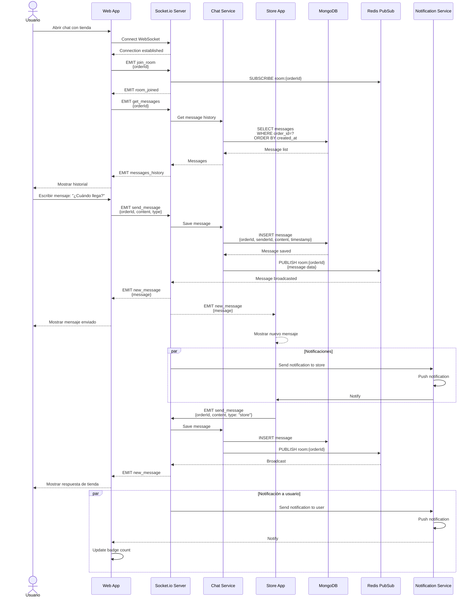
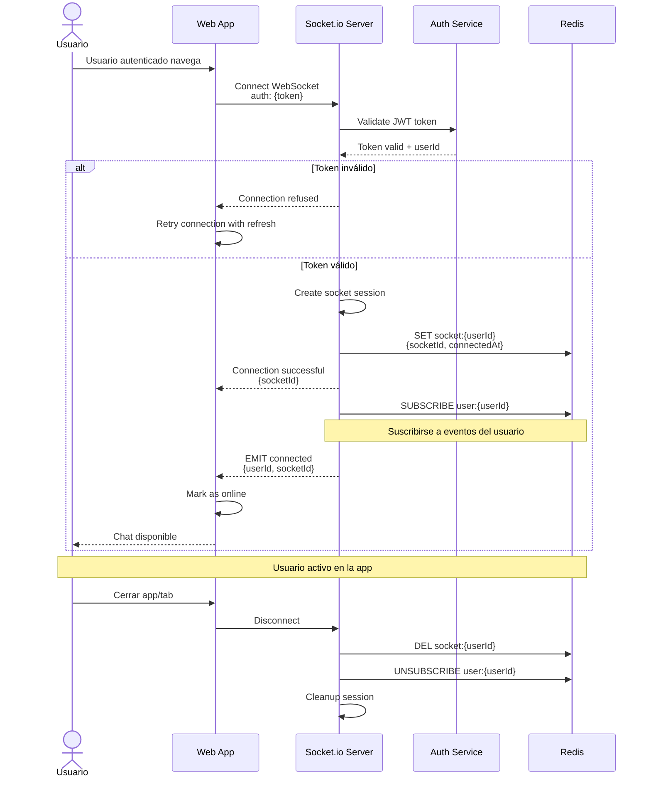
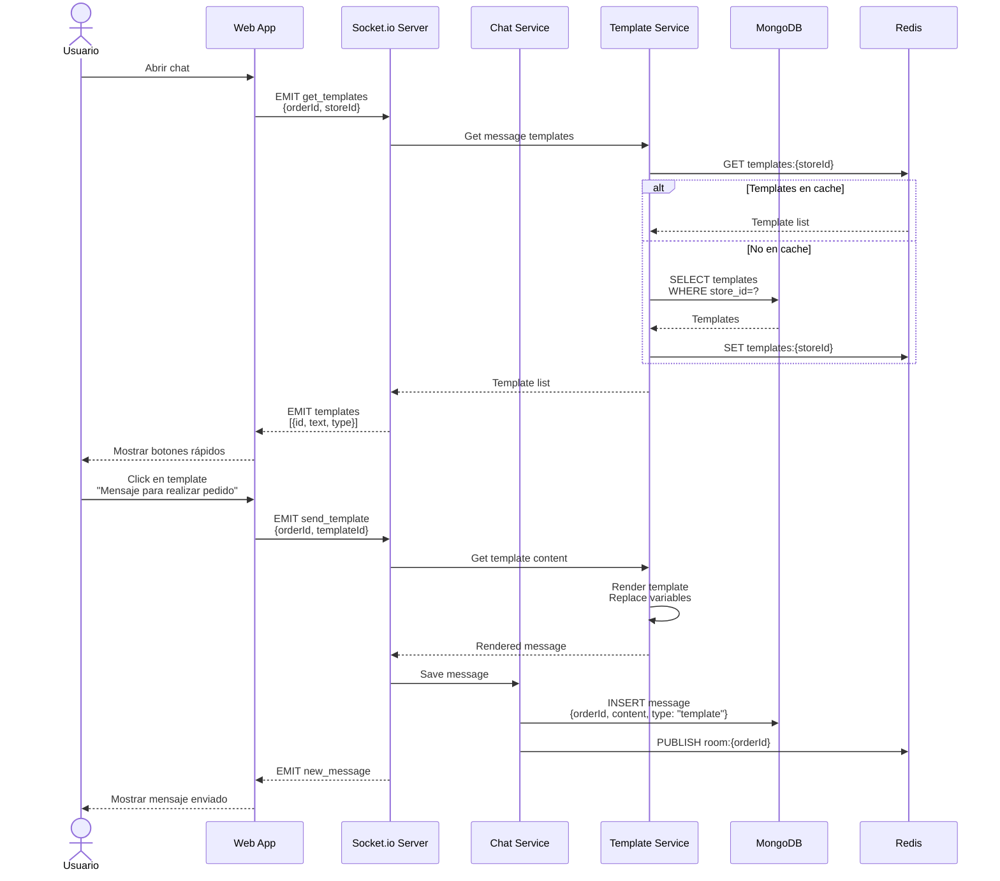
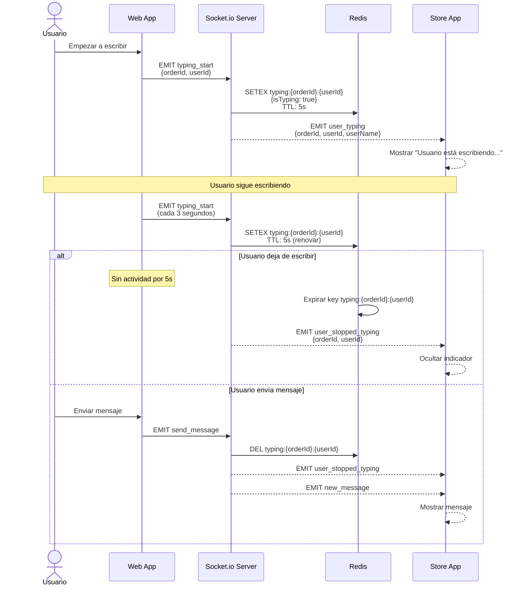
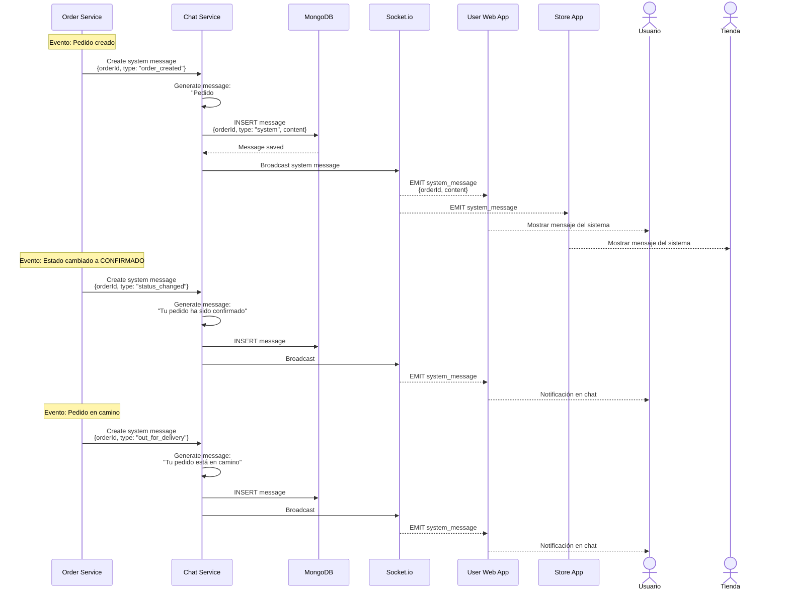
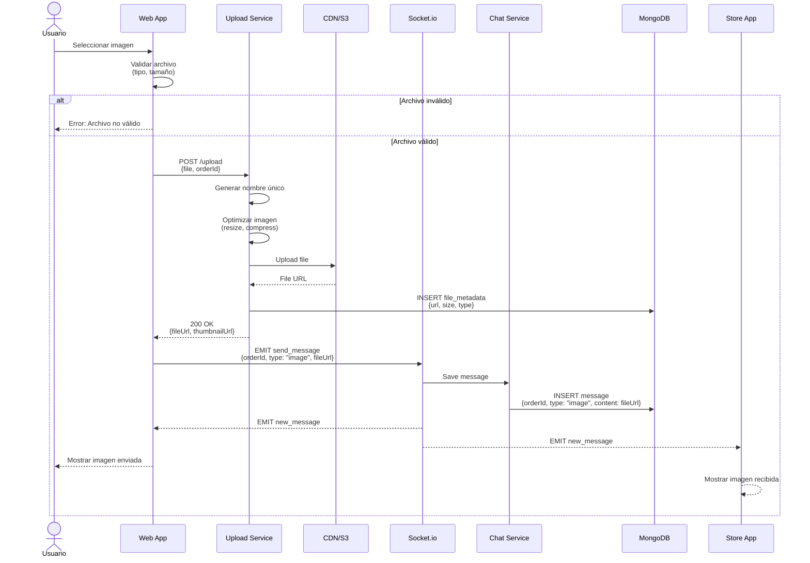
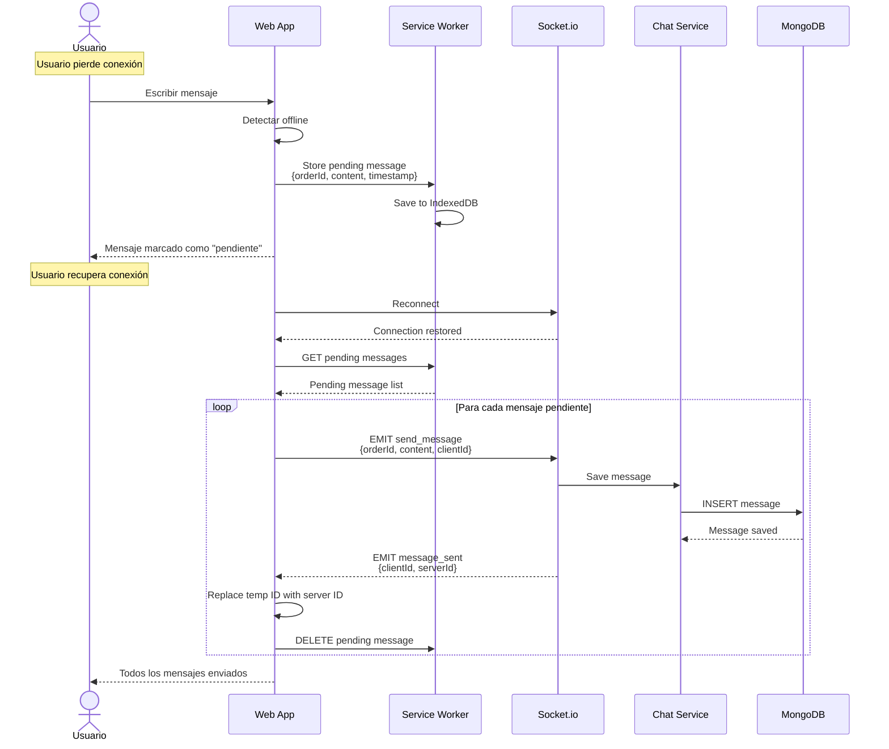
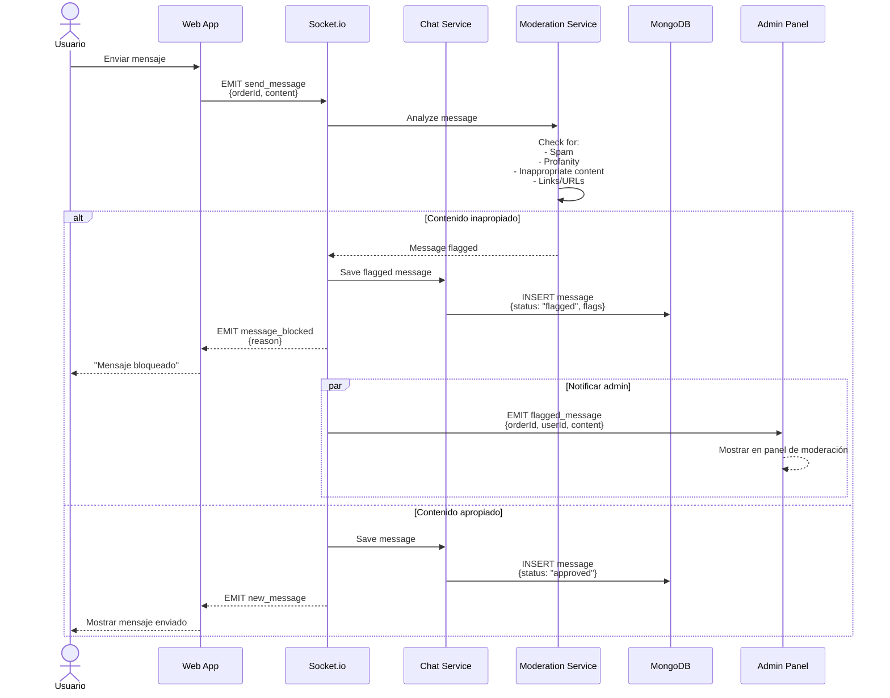
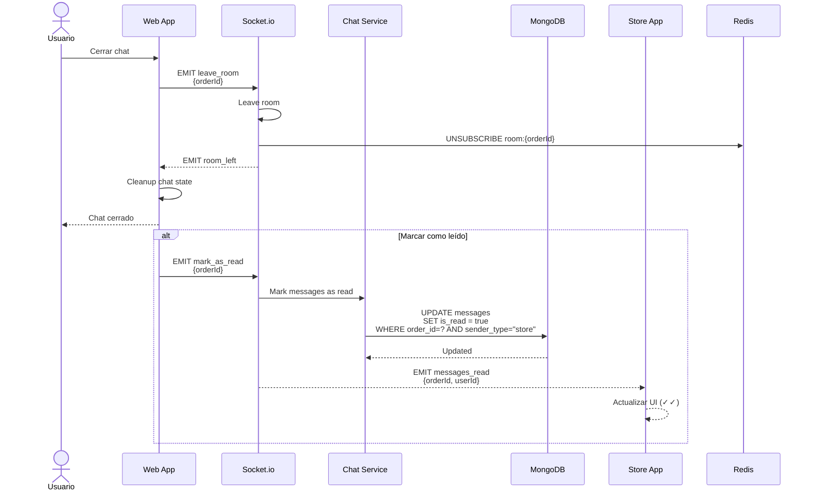
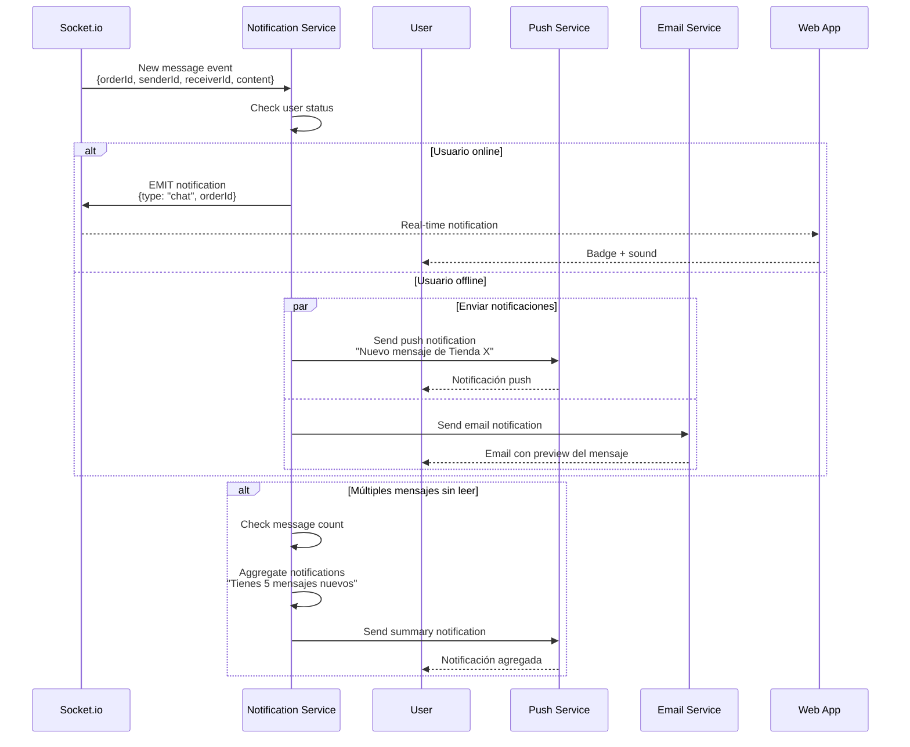

# Diagramas de Secuencia - Sistema de Chat - Sistema Tiendi

Este documento contiene los diagramas de secuencia relacionados con el sistema de mensajería y chat en tiempo real.

---

## 1. Secuencia de Chat en Tiempo Real



---

## 2. Secuencia de Conexión WebSocket



---

## 3. Secuencia de Mensajes con Plantillas



---

## 4. Secuencia de Indicador de Escritura (Typing Indicator)



---

## 5. Secuencia de Mensajes del Sistema



---

## 6. Secuencia de Envío de Archivo/Imagen en Chat



---

## 7. Secuencia de Sincronización de Mensajes Offline



---

## 8. Secuencia de Moderación de Mensajes



---

## 9. Secuencia de Cierre de Conversación



---

## 10. Secuencia de Notificaciones de Chat



---

## Consideraciones Técnicas

### WebSocket Connection Options
```javascript
// Cliente
const socket = io('wss://api.tiendi.com', {
  auth: { token: jwtToken },
  reconnection: true,
  reconnectionDelay: 1000,
  reconnectionAttempts: 5,
  transports: ['websocket', 'polling']
});
```

### Redis PubSub Channels
```javascript
// Canales de Redis
- room:{orderId}          // Mensajes de una conversación específica
- user:{userId}           // Eventos personales del usuario
- store:{storeId}         // Eventos de la tienda
- typing:{orderId}        // Indicadores de escritura
- broadcast               // Mensajes globales
```

### MongoDB Schema - Messages
```javascript
{
  _id: ObjectId,
  orderId: UUID,
  senderId: UUID,
  senderType: 'user' | 'store' | 'system',
  content: String,
  messageType: 'text' | 'image' | 'template' | 'system',
  fileUrl: String (optional),
  isRead: Boolean,
  isFlagged: Boolean,
  createdAt: DateTime,
  metadata: {
    clientId: String,
    editedAt: DateTime,
    deletedAt: DateTime
  }
}
```

### Rate Limiting
```javascript
// Límites por tipo de operación
{
  sendMessage: '10 per minute',
  uploadFile: '5 per minute',
  typing: '1 per 3 seconds'
}
```

---

**Fecha de creación:** 2025-11-24
**Versión:** 1.0
