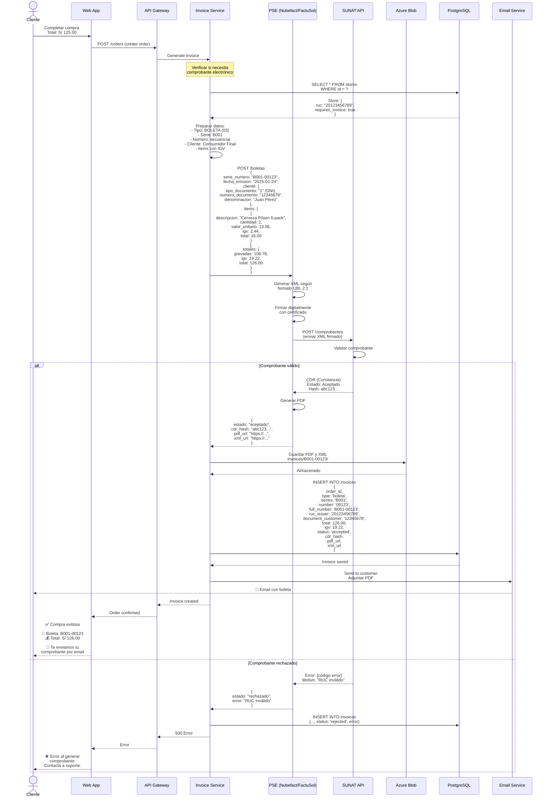
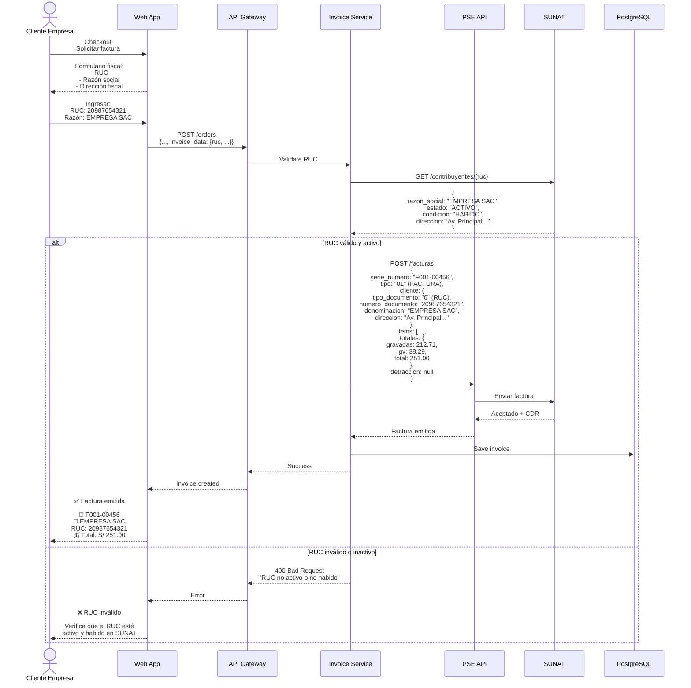
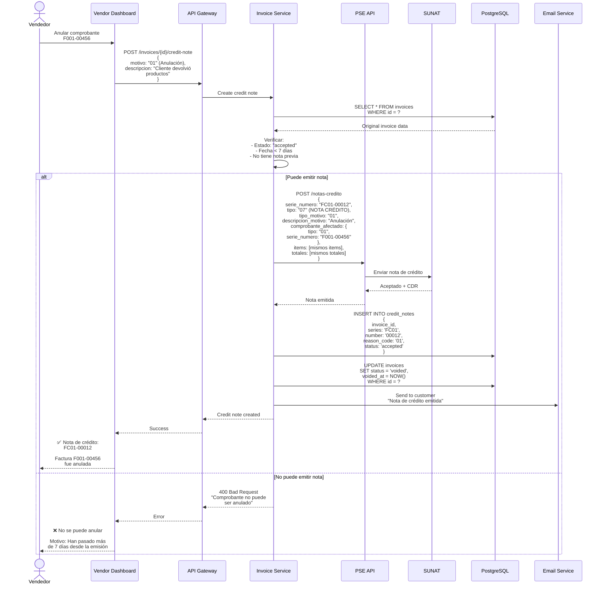
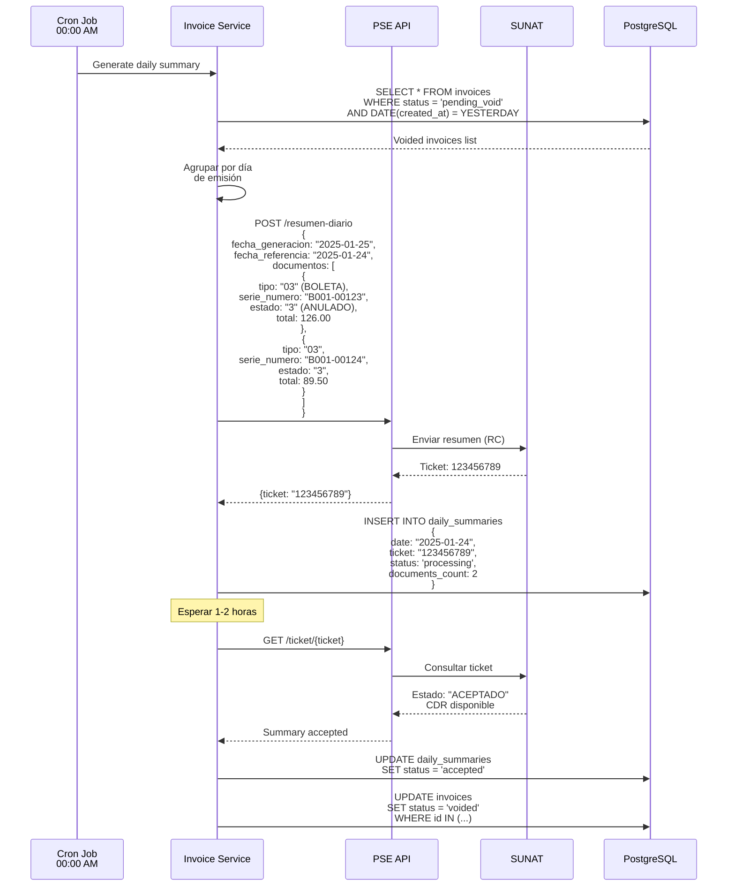

# Diagramas de Secuencia - Facturación Electrónica (SUNAT) - Sistema Tiendi

Sistema de emisión de comprobantes electrónicos para cumplir con regulaciones peruanas.

---

## 1. Emisión de Boleta Electrónica



---

## 2. Emisión de Factura Electrónica (con RUC)



---

## 3. Nota de Crédito (Anulación)



---

## 4. Resumen Diario (RC - Bajas)



---

## Tablas de Base de Datos

```sql
-- Tabla de comprobantes electrónicos
CREATE TABLE invoices (
  id UUID PRIMARY KEY DEFAULT uuid_generate_v4(),
  order_id UUID REFERENCES orders(id),

  -- Emisor
  ruc_issuer VARCHAR(11) NOT NULL,
  business_name_issuer VARCHAR(255) NOT NULL,

  -- Tipo de comprobante
  document_type VARCHAR(2) NOT NULL, -- '01': Factura, '03': Boleta, '07': Nota Crédito, '08': Nota Débito
  series VARCHAR(4) NOT NULL,
  number VARCHAR(8) NOT NULL,
  full_number VARCHAR(13) UNIQUE NOT NULL, -- 'F001-00000123'

  -- Cliente
  customer_document_type VARCHAR(1), -- '1': DNI, '6': RUC
  customer_document_number VARCHAR(11),
  customer_name VARCHAR(255),
  customer_address TEXT,

  -- Montos
  subtotal DECIMAL(10,2) NOT NULL,
  igv DECIMAL(10,2) NOT NULL,
  total DECIMAL(10,2) NOT NULL,

  -- Detracción (si aplica)
  detraccion_percentage DECIMAL(5,2),
  detraccion_amount DECIMAL(10,2),

  -- Items
  items JSONB NOT NULL,

  -- Estado SUNAT
  status VARCHAR(20) DEFAULT 'pending',
  -- 'pending', 'sent', 'accepted', 'rejected', 'voided'

  cdr_hash VARCHAR(255),
  cdr_notes TEXT,

  -- URLs de archivos
  xml_url TEXT,
  pdf_url TEXT,
  cdr_url TEXT,

  -- Fechas
  issue_date DATE NOT NULL,
  sent_to_sunat_at TIMESTAMP,
  accepted_at TIMESTAMP,
  voided_at TIMESTAMP,

  -- Error info
  error_code VARCHAR(10),
  error_message TEXT,

  created_at TIMESTAMP DEFAULT NOW(),
  updated_at TIMESTAMP DEFAULT NOW()
);

CREATE INDEX idx_invoices_order ON invoices(order_id);
CREATE INDEX idx_invoices_full_number ON invoices(full_number);
CREATE INDEX idx_invoices_ruc_date ON invoices(ruc_issuer, issue_date DESC);
CREATE INDEX idx_invoices_status ON invoices(status, created_at DESC);

-- Tabla de notas de crédito/débito
CREATE TABLE credit_notes (
  id UUID PRIMARY KEY DEFAULT uuid_generate_v4(),
  invoice_id UUID NOT NULL REFERENCES invoices(id),

  document_type VARCHAR(2) NOT NULL, -- '07': Nota Crédito, '08': Nota Débito
  series VARCHAR(4) NOT NULL,
  number VARCHAR(8) NOT NULL,
  full_number VARCHAR(13) UNIQUE NOT NULL,

  reason_code VARCHAR(2) NOT NULL,
  -- '01': Anulación, '02': Anulación por error en RUC,
  -- '03': Corrección por error en descripción, etc.
  reason_description TEXT,

  affected_document_type VARCHAR(2),
  affected_document_number VARCHAR(13),

  total DECIMAL(10,2) NOT NULL,

  status VARCHAR(20) DEFAULT 'pending',
  cdr_hash VARCHAR(255),

  xml_url TEXT,
  pdf_url TEXT,

  issue_date DATE NOT NULL,
  created_at TIMESTAMP DEFAULT NOW()
);

CREATE INDEX idx_credit_notes_invoice ON credit_notes(invoice_id);

-- Tabla de resúmenes diarios
CREATE TABLE daily_summaries (
  id UUID PRIMARY KEY DEFAULT uuid_generate_v4(),
  ruc_issuer VARCHAR(11) NOT NULL,

  summary_date DATE NOT NULL, -- Fecha de los documentos
  generation_date DATE NOT NULL, -- Fecha de generación del resumen

  ticket VARCHAR(20), -- Ticket de SUNAT
  documents_count INTEGER NOT NULL,

  status VARCHAR(20) DEFAULT 'processing',
  -- 'processing', 'accepted', 'rejected'

  xml_url TEXT,
  cdr_url TEXT,

  created_at TIMESTAMP DEFAULT NOW(),
  processed_at TIMESTAMP
);

CREATE INDEX idx_daily_summaries_ruc_date ON daily_summaries(ruc_issuer, summary_date DESC);

-- Tabla de secuencias de numeración
CREATE TABLE invoice_sequences (
  id UUID PRIMARY KEY DEFAULT uuid_generate_v4(),
  store_id UUID NOT NULL REFERENCES stores(id),

  document_type VARCHAR(2) NOT NULL,
  series VARCHAR(4) NOT NULL,
  current_number INTEGER DEFAULT 0,

  UNIQUE(store_id, document_type, series)
);
```

---

## Configuración de PSE

```typescript
// Proveedores de Servicios Electrónicos disponibles
const PSE_PROVIDERS = {
  nubefact: {
    apiUrl: 'https://api.nubefact.com/v1',
    apiToken: process.env.NUBEFACT_TOKEN,
    ruc: '20123456789'
  },
  factusol: {
    apiUrl: 'https://api.factusol.pe/v2',
    apiKey: process.env.FACTUSOL_KEY,
    ruc: '20123456789'
  },
  sunat_sol: {
    // Conexión directa a SUNAT (requiere certificado digital)
    soapUrl: 'https://e-factura.sunat.gob.pe/ol-ti-itcpfegem/billService',
    username: '20123456789MODDATOS',
    password: process.env.SUNAT_SOL_PASSWORD,
    certificate: './certs/certificate.pfx',
    certificatePassword: process.env.CERT_PASSWORD
  }
};

// Tipos de documentos SUNAT
const DOCUMENT_TYPES = {
  FACTURA: '01',
  BOLETA: '03',
  NOTA_CREDITO: '07',
  NOTA_DEBITO: '08',
  RETENCION: '20',
  PERCEPCION: '40'
};

// Tipos de documento de identidad
const IDENTITY_TYPES = {
  DNI: '1',
  RUC: '6',
  CARNET_EXTRANJERIA: '4',
  PASAPORTE: '7'
};
```

---

## Servicio de Facturación

```typescript
class InvoiceService {
  async generateInvoice(order: Order): Promise<Invoice> {
    // 1. Obtener siguiente número
    const sequence = await this.getNextNumber(
      order.storeId,
      order.needsRuc ? 'F001' : 'B001'
    );

    // 2. Preparar datos
    const invoiceData = {
      documentType: order.needsRuc ? DOCUMENT_TYPES.FACTURA : DOCUMENT_TYPES.BOLETA,
      series: order.needsRuc ? 'F001' : 'B001',
      number: sequence.toString().padStart(8, '0'),
      issueDate: new Date(),
      customer: {
        documentType: order.customer.documentType,
        documentNumber: order.customer.documentNumber,
        name: order.customer.name,
        address: order.customer.address
      },
      items: order.items.map(item => ({
        description: item.product.name,
        quantity: item.quantity,
        unitPrice: this.calculateBasePrice(item.price),
        igv: this.calculateIGV(item.price),
        total: item.subtotal
      })),
      totals: {
        subtotal: this.calculateSubtotal(order.total),
        igv: this.calculateIGV(order.total),
        total: order.total
      }
    };

    // 3. Enviar a PSE
    const response = await this.pse.sendInvoice(invoiceData);

    // 4. Guardar en base de datos
    const invoice = await db.query(`
      INSERT INTO invoices (
        order_id, document_type, series, number, full_number,
        ruc_issuer, customer_document_number, total, igv,
        status, cdr_hash, xml_url, pdf_url
      ) VALUES ($1, $2, $3, $4, $5, $6, $7, $8, $9, $10, $11, $12, $13)
      RETURNING *
    `, [
      order.id,
      invoiceData.documentType,
      invoiceData.series,
      invoiceData.number,
      `${invoiceData.series}-${invoiceData.number}`,
      order.store.ruc,
      invoiceData.customer.documentNumber,
      invoiceData.totals.total,
      invoiceData.totals.igv,
      response.status,
      response.cdrHash,
      response.xmlUrl,
      response.pdfUrl
    ]);

    return invoice;
  }

  private calculateIGV(total: number): number {
    // IGV en Perú es 18%
    return parseFloat((total * 0.18 / 1.18).toFixed(2));
  }

  private calculateBasePrice(priceWithIGV: number): number {
    return parseFloat((priceWithIGV / 1.18).toFixed(2));
  }

  private calculateSubtotal(total: number): number {
    return total - this.calculateIGV(total);
  }
}
```

---

**Fecha de creación:** 2025-01-24
**Versión:** 1.0
