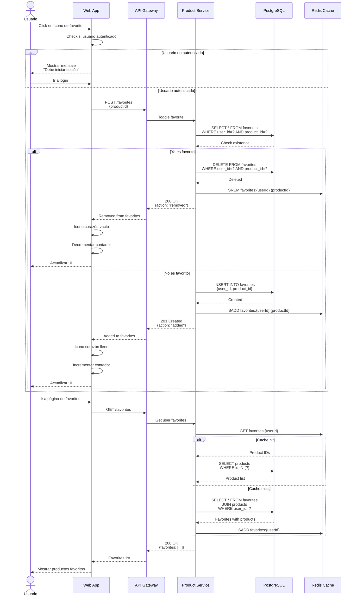
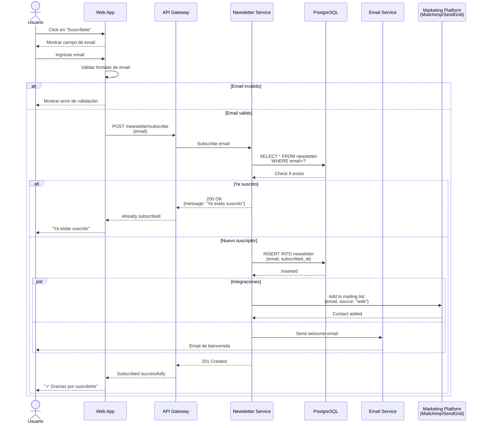
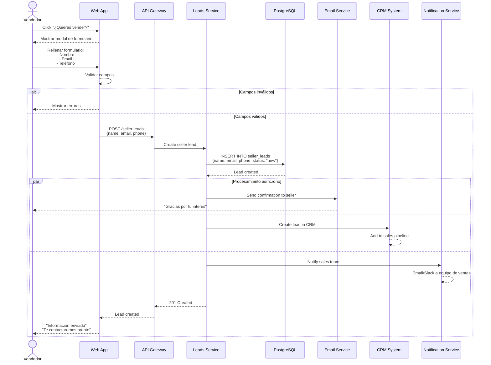
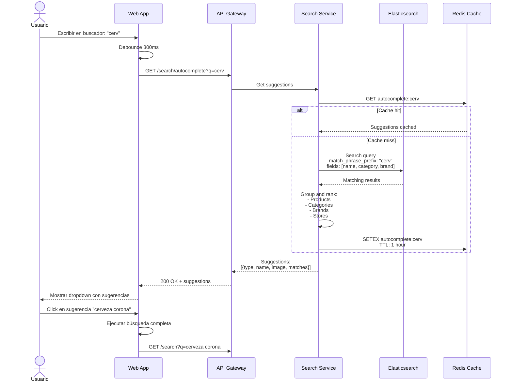
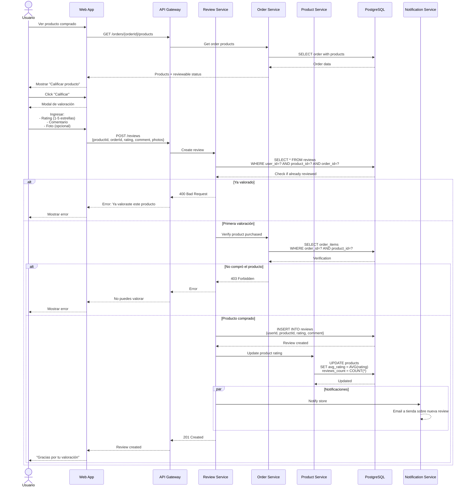
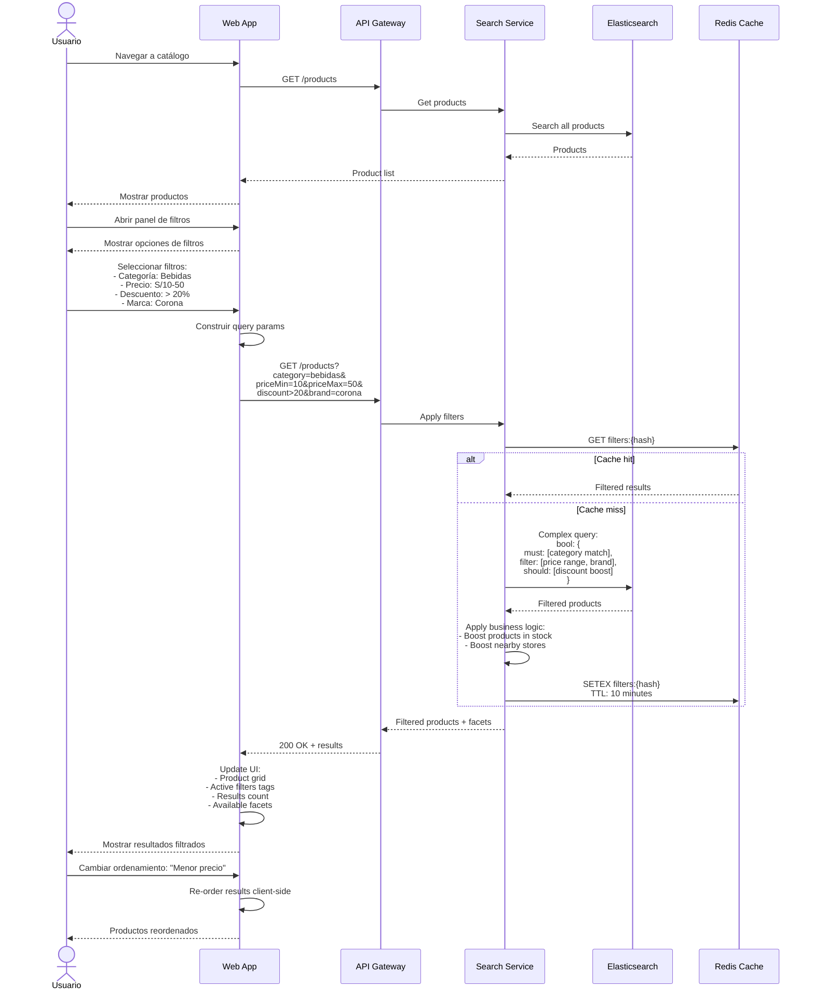
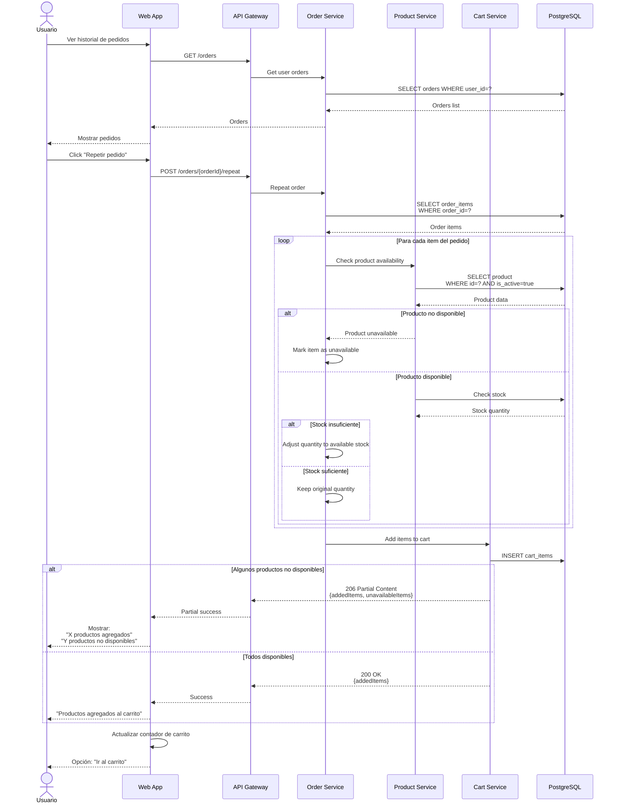
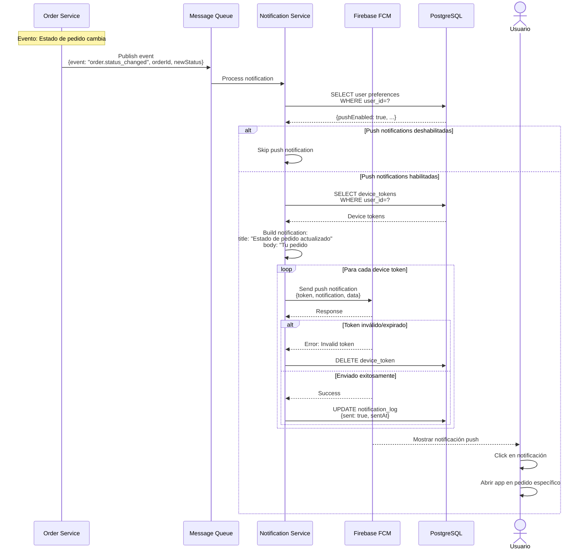
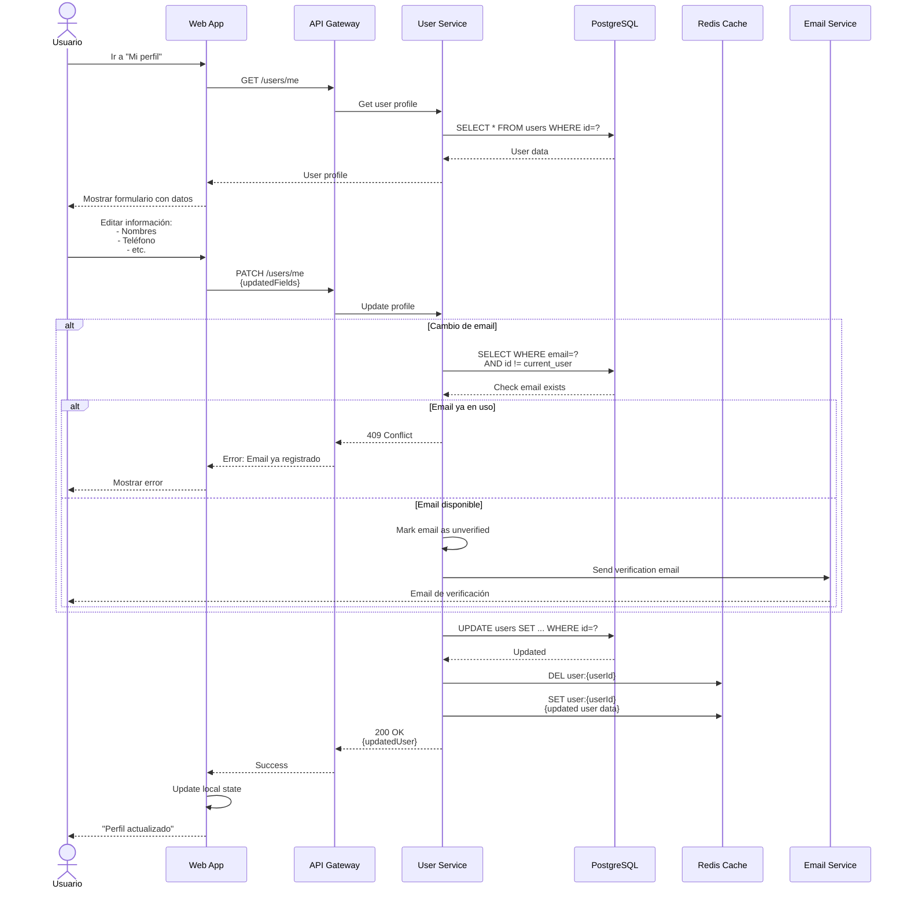
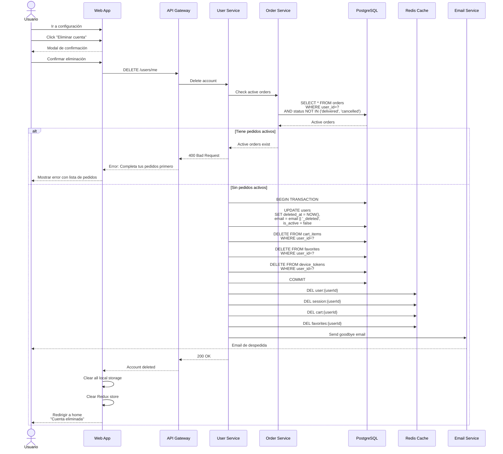

# Diagramas de Secuencia - Operaciones Varias - Sistema Tiendi

Este documento contiene diagramas de secuencia para operaciones adicionales del sistema.

---

## 1. Secuencia de Gestión de Favoritos

---

## 2. Secuencia de Suscripción a Newsletter

---

## 3. Secuencia de Registro de Lead de Vendedor

---

## 4. Secuencia de Búsqueda con Autocompletado

---

## 5. Secuencia de Valoración de Producto

---

## 6. Secuencia de Aplicación de Filtros

---

## 7. Secuencia de Repetir Pedido

---

## 8. Secuencia de Notificaciones Push

---

## 9. Secuencia de Actualización de Perfil

---

## 10. Secuencia de Eliminación de Cuenta

---

**Fecha de creación:** 2025-11-24
**Versión:** 1.0
