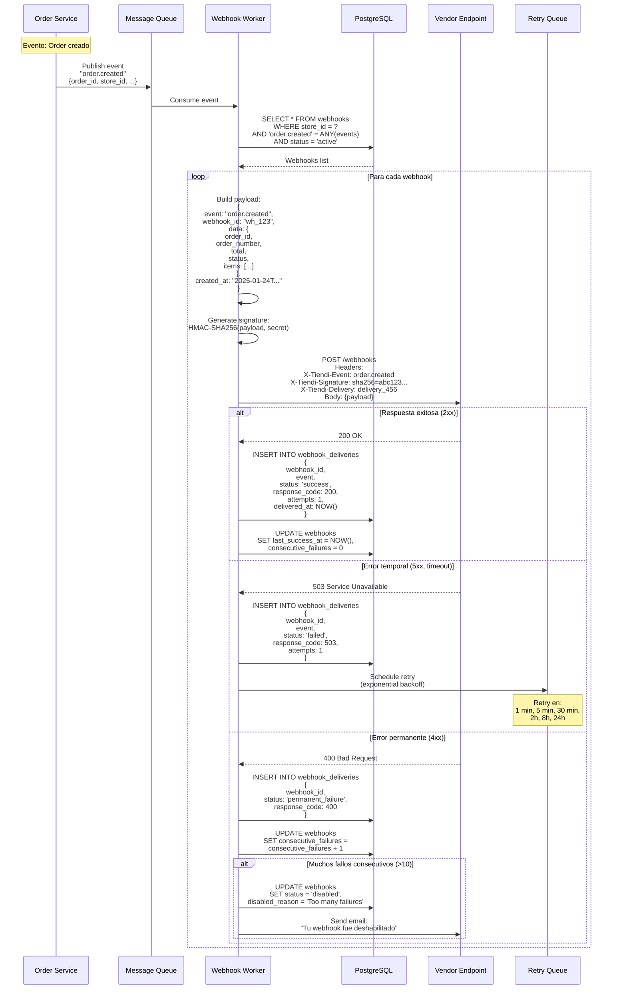

# Diagramas de Secuencia - API Pública y Webhooks - Sistema Tiendi

Sistema de webhooks y API pública para integraciones de terceros.

---

## 1. Vendor Configura Webhook

```mermaid
sequenceDiagram
    actor Vendor as Vendedor
    participant Dashboard as Vendor Dashboard
    participant Gateway as API Gateway
    participant Webhook as Webhook Service
    participant DB as PostgreSQL
    participant Validator as URL Validator

    Vendor->>Dashboard: Ir a "Integraciones"<br/>→ "Webhooks"

    Dashboard-->>Vendor: Formulario:<br/>- URL del endpoint<br/>- Eventos a suscribir<br/>- Secret (opcional)

    Vendor->>Dashboard: Configurar webhook:<br/>URL: https://mi-sistema.com/webhooks<br/>Eventos:<br/>☑ order.created<br/>☑ order.updated<br/>☐ product.updated

    Dashboard->>Gateway: POST /webhooks<br/>{<br/>  url: "https://mi-sistema.com/webhooks",<br/>  events: ["order.created", "order.updated"],<br/>  secret: "my_secret_key"<br/>}

    Gateway->>Webhook: Create webhook

    Webhook->>Validator: Validate URL

    Validator->>Validator: Check:<br/>- HTTPS required<br/>- Valid domain<br/>- Not localhost<br/>- Reachable

    alt URL válida
        Validator-->>Webhook: URL OK

        Webhook->>DB: INSERT INTO webhooks<br/>{<br/>  store_id,<br/>  url,<br/>  events,<br/>  secret_hash,<br/>  status: 'active'<br/>}

        DB-->>Webhook: Webhook ID: wh_123

        Note over Webhook: Enviar ping de prueba

        Webhook->>Webhook: POST https://mi-sistema.com/webhooks<br/>{<br/>  event: "webhook.test",<br/>  webhook_id: "wh_123",<br/>  timestamp: "2025-01-24T10:00:00Z"<br/>}<br/>Headers:<br/>  X-Tiendi-Signature: sha256=...

        alt Endpoint responde 200
            Webhook->>DB: UPDATE webhooks<br/>SET status = 'verified'

            Webhook-->>Gateway: Webhook created

            Gateway-->>Dashboard: Success

            Dashboard-->>Vendor: ✅ Webhook configurado<br/><br/>🔗 wh_123<br/>📡 URL: https://mi-sistema.com/webhooks<br/>✓ Verificado
        else Endpoint no responde
            Webhook->>DB: UPDATE webhooks<br/>SET status = 'unverified'

            Webhook-->>Gateway: Warning

            Gateway-->>Dashboard: Created but unverified

            Dashboard-->>Vendor: ⚠️ Webhook creado<br/>pero no verificado<br/><br/>Tu endpoint no respondió<br/>al ping de prueba
        end
    else URL inválida
        Validator-->>Webhook: Error: No HTTPS

        Webhook-->>Gateway: 400 Bad Request

        Gateway-->>Dashboard: Error

        Dashboard-->>Vendor: ❌ URL inválida<br/><br/>Debe usar HTTPS
    end
```



---

## 2. Trigger de Webhook (Evento de Pedido)



---

## 3. Retry con Exponential Backoff

```mermaid
sequenceDiagram
    participant Retry as Retry Queue
    participant Worker as Webhook Worker
    participant Vendor as Vendor Endpoint
    participant DB as PostgreSQL

    Note over Retry: Delivery falló<br/>Primer intento

    Retry->>Retry: Wait 1 minute

    Retry->>Worker: Retry delivery

    Worker->>Vendor: POST /webhooks<br/>(attempt 2)

    alt Falla de nuevo
        Vendor-->>Worker: 503 Error

        Worker->>DB: UPDATE webhook_deliveries<br/>SET attempts = 2

        Worker->>Retry: Schedule next retry

        Retry->>Retry: Wait 5 minutes

        Retry->>Worker: Retry delivery

        Worker->>Vendor: POST /webhooks<br/>(attempt 3)

        alt Sigue fallando
            Vendor-->>Worker: 503 Error

            Worker->>Retry: Schedule next retry

            Note over Retry: Backoff schedule:<br/>Attempt 1: 1 min<br/>Attempt 2: 5 min<br/>Attempt 3: 30 min<br/>Attempt 4: 2 hours<br/>Attempt 5: 8 hours<br/>Attempt 6: 24 hours<br/><br/>Max 6 attempts
        else Éxito
            Vendor-->>Worker: 200 OK

            Worker->>DB: UPDATE webhook_deliveries<br/>SET status = 'success',<br/>    attempts = 3,<br/>    delivered_at = NOW()
        end
    else Éxito en segundo intento
        Vendor-->>Worker: 200 OK

        Worker->>DB: UPDATE webhook_deliveries<br/>SET status = 'success',<br/>    attempts = 2,<br/>    delivered_at = NOW()
    end
```



---

## 4. Vendor Consulta Historial de Webhooks

```mermaid
sequenceDiagram
    actor Vendor as Vendedor
    participant Dashboard as Vendor Dashboard
    participant Gateway as API Gateway
    participant Webhook as Webhook Service
    participant DB as PostgreSQL

    Vendor->>Dashboard: Ver "Historial de entregas"

    Dashboard->>Gateway: GET /webhooks/{id}/deliveries?<br/>limit=50&status=all

    Gateway->>Webhook: Get delivery history

    Webhook->>DB: SELECT * FROM webhook_deliveries<br/>WHERE webhook_id = ?<br/>ORDER BY created_at DESC<br/>LIMIT 50

    DB-->>Webhook: Delivery records

    Webhook-->>Gateway: [<br/>  {<br/>    id: "del_123",<br/>    event: "order.created",<br/>    status: "success",<br/>    attempts: 1,<br/>    response_code: 200,<br/>    created_at: "2025-01-24T10:00:00Z",<br/>    delivered_at: "2025-01-24T10:00:01Z"<br/>  },<br/>  {<br/>    id: "del_124",<br/>    event: "order.updated",<br/>    status: "failed",<br/>    attempts: 3,<br/>    response_code: 503,<br/>    created_at: "2025-01-24T11:00:00Z",<br/>    next_retry_at: "2025-01-24T11:30:00Z"<br/>  }<br/>]

    Gateway-->>Dashboard: Delivery history

    Dashboard-->>Vendor: Historial de entregas:<br/><br/>✅ del_123 | order.created<br/>   200 OK | 1 intento<br/>   24/01 10:00<br/><br/>❌ del_124 | order.updated<br/>   503 Error | 3 intentos<br/>   Próximo reintento: 11:30<br/><br/>✅ del_125 | order.updated<br/>   200 OK | 2 intentos<br/>   24/01 09:00

    Vendor->>Dashboard: Click en delivery<br/>para ver detalles

    Dashboard->>Gateway: GET /webhooks/deliveries/{id}

    Gateway->>Webhook: Get delivery details

    Webhook->>DB: SELECT * FROM webhook_deliveries<br/>WHERE id = ?

    DB-->>Webhook: Full delivery record

    Webhook-->>Gateway: {<br/>  ...all fields,<br/>  request_payload: {...},<br/>  request_headers: {...},<br/>  response_body: "...",<br/>  response_headers: {...},<br/>  error_message: "..."<br/>}

    Gateway-->>Dashboard: Details

    Dashboard-->>Vendor: Detalle completo:<br/><br/>Request:<br/>{payload JSON}<br/><br/>Response:<br/>"Service unavailable"<br/><br/>Headers:<br/>X-Tiendi-Signature: sha256=...
```



---

## 5. Reenvío Manual de Webhook

```mermaid
sequenceDiagram
    actor Vendor as Vendedor
    participant Dashboard as Vendor Dashboard
    participant Gateway as API Gateway
    participant Webhook as Webhook Service
    participant DB as PostgreSQL
    participant VendorEndpoint as Vendor Endpoint

    Vendor->>Dashboard: Ver delivery fallido<br/>Click "Reenviar"

    Dashboard->>Gateway: POST /webhooks/deliveries/{id}/resend

    Gateway->>Webhook: Resend delivery

    Webhook->>DB: SELECT * FROM webhook_deliveries<br/>WHERE id = ?

    DB-->>Webhook: Delivery data

    Webhook->>Webhook: Rebuild payload<br/>con mismo evento

    Webhook->>VendorEndpoint: POST /webhooks<br/>(manual retry)

    alt Éxito
        VendorEndpoint-->>Webhook: 200 OK

        Webhook->>DB: INSERT INTO webhook_deliveries<br/>{<br/>  webhook_id,<br/>  event,<br/>  status: 'success',<br/>  is_manual_resend: true,<br/>  parent_delivery_id: old_id<br/>}

        Webhook-->>Gateway: Success

        Gateway-->>Dashboard: Reenviado

        Dashboard-->>Vendor: ✅ Webhook reenviado<br/>exitosamente
    else Falla
        VendorEndpoint-->>Webhook: 500 Error

        Webhook->>DB: INSERT INTO webhook_deliveries<br/>{..., status: 'failed'}

        Webhook-->>Gateway: Failed

        Gateway-->>Dashboard: Error

        Dashboard-->>Vendor: ❌ Reenvío falló<br/><br/>Error: 500 Internal Server Error
    end
```



---

## Tablas de Base de Datos

```sql
-- Tabla de webhooks configurados
CREATE TABLE webhooks (
  id UUID PRIMARY KEY DEFAULT uuid_generate_v4(),
  store_id UUID NOT NULL REFERENCES stores(id),

  url TEXT NOT NULL,
  events VARCHAR(50)[] NOT NULL, -- array de eventos suscritos

  secret_hash VARCHAR(255), -- HMAC secret (hashed)

  status VARCHAR(20) DEFAULT 'active',
  -- 'active', 'disabled', 'unverified'

  -- Statistics
  consecutive_failures INTEGER DEFAULT 0,
  last_success_at TIMESTAMP,
  last_failure_at TIMESTAMP,

  disabled_reason TEXT,

  created_at TIMESTAMP DEFAULT NOW(),
  updated_at TIMESTAMP DEFAULT NOW()
);

CREATE INDEX idx_webhooks_store ON webhooks(store_id);
CREATE INDEX idx_webhooks_status ON webhooks(status) WHERE status = 'active';

-- Tabla de entregas de webhooks
CREATE TABLE webhook_deliveries (
  id UUID PRIMARY KEY DEFAULT uuid_generate_v4(),
  webhook_id UUID NOT NULL REFERENCES webhooks(id),

  event VARCHAR(50) NOT NULL,
  payload JSONB NOT NULL,

  -- Request
  request_url TEXT NOT NULL,
  request_headers JSONB,
  request_body TEXT,

  -- Response
  response_code INTEGER,
  response_headers JSONB,
  response_body TEXT,

  -- Status
  status VARCHAR(30) NOT NULL,
  -- 'pending', 'success', 'failed', 'permanent_failure'

  attempts INTEGER DEFAULT 1,
  max_attempts INTEGER DEFAULT 6,

  error_message TEXT,

  is_manual_resend BOOLEAN DEFAULT FALSE,
  parent_delivery_id UUID REFERENCES webhook_deliveries(id),

  -- Timing
  created_at TIMESTAMP DEFAULT NOW(),
  delivered_at TIMESTAMP,
  next_retry_at TIMESTAMP
);

CREATE INDEX idx_deliveries_webhook ON webhook_deliveries(webhook_id, created_at DESC);
CREATE INDEX idx_deliveries_status ON webhook_deliveries(status);
CREATE INDEX idx_deliveries_retry ON webhook_deliveries(next_retry_at)
  WHERE status = 'failed' AND next_retry_at IS NOT NULL;
```

---

## Eventos Disponibles

```typescript
enum WebhookEvent {
  // Orders
  ORDER_CREATED = 'order.created',
  ORDER_UPDATED = 'order.updated',
  ORDER_CANCELLED = 'order.cancelled',
  ORDER_COMPLETED = 'order.completed',

  // Products
  PRODUCT_CREATED = 'product.created',
  PRODUCT_UPDATED = 'product.updated',
  PRODUCT_DELETED = 'product.deleted',
  PRODUCT_OUT_OF_STOCK = 'product.out_of_stock',

  // Inventory
  INVENTORY_UPDATED = 'inventory.updated',
  INVENTORY_LOW_STOCK = 'inventory.low_stock',

  // Payments
  PAYMENT_RECEIVED = 'payment.received',
  PAYMENT_FAILED = 'payment.failed',
  REFUND_PROCESSED = 'refund.processed',

  // Shipping
  SHIPMENT_CREATED = 'shipment.created',
  SHIPMENT_DELIVERED = 'shipment.delivered',

  // Reviews
  REVIEW_CREATED = 'review.created',

  // System
  WEBHOOK_TEST = 'webhook.test'
}
```

---

## Payload de Ejemplo

```json
{
  "event": "order.created",
  "webhook_id": "wh_abc123",
  "delivery_id": "del_xyz789",
  "created_at": "2025-01-24T10:30:00Z",
  "data": {
    "id": "order_456",
    "order_number": "OBI-00123",
    "status": "POR_ENVIAR",
    "customer": {
      "id": "user_789",
      "name": "Juan Pérez",
      "email": "juan@example.com",
      "phone": "+51987654321"
    },
    "items": [
      {
        "product_id": "prod_111",
        "name": "Cerveza Pilsen 6-pack",
        "quantity": 2,
        "unit_price": 15.00,
        "subtotal": 30.00
      }
    ],
    "totals": {
      "subtotal": 30.00,
      "delivery_fee": 5.00,
      "total": 35.00
    },
    "delivery": {
      "type": "delivery",
      "address": "Av. Principal 123, Lima",
      "estimated_date": "2025-01-26"
    },
    "payment": {
      "method": "card",
      "status": "paid"
    }
  }
}
```

---

## Implementación de Webhook Service

```typescript
class WebhookService {
  async trigger(event: WebhookEvent, storeId: string, data: any) {
    // 1. Obtener webhooks activos para este evento
    const webhooks = await db.query(`
      SELECT * FROM webhooks
      WHERE store_id = $1
        AND $2 = ANY(events)
        AND status = 'active'
    `, [storeId, event]);

    // 2. Publicar en cola para procesamiento asíncrono
    for (const webhook of webhooks) {
      await queue.publish('webhook.deliver', {
        webhookId: webhook.id,
        event,
        data
      });
    }
  }

  async deliver(webhookId: string, event: string, data: any) {
    const webhook = await this.getWebhook(webhookId);

    const payload = {
      event,
      webhook_id: webhookId,
      delivery_id: uuidv4(),
      created_at: new Date().toISOString(),
      data
    };

    const signature = this.generateSignature(payload, webhook.secret);

    try {
      const response = await axios.post(webhook.url, payload, {
        headers: {
          'Content-Type': 'application/json',
          'X-Tiendi-Event': event,
          'X-Tiendi-Signature': signature,
          'X-Tiendi-Delivery': payload.delivery_id
        },
        timeout: 30000 // 30 seconds
      });

      await this.logDelivery({
        webhookId,
        event,
        payload,
        status: 'success',
        responseCode: response.status,
        responseBody: response.data
      });

      await this.resetFailureCount(webhookId);

      return { success: true };
    } catch (error) {
      await this.logDelivery({
        webhookId,
        event,
        payload,
        status: 'failed',
        errorMessage: error.message
      });

      await this.scheduleRetry(webhookId, payload, 1);

      return { success: false, error: error.message };
    }
  }

  private generateSignature(payload: any, secret: string): string {
    const data = JSON.stringify(payload);
    return 'sha256=' + crypto
      .createHmac('sha256', secret)
      .update(data)
      .digest('hex');
  }

  private async scheduleRetry(
    webhookId: string,
    payload: any,
    attempt: number
  ) {
    if (attempt > 6) {
      // Max attempts reached
      await this.disableWebhook(webhookId, 'Max retry attempts exceeded');
      return;
    }

    const delays = [60, 300, 1800, 7200, 28800, 86400]; // seconds
    const delay = delays[attempt - 1];
    const nextRetryAt = new Date(Date.now() + delay * 1000);

    await db.query(`
      UPDATE webhook_deliveries
      SET next_retry_at = $1,
          attempts = $2
      WHERE webhook_id = $3
        AND event = $4
        AND status = 'failed'
    `, [nextRetryAt, attempt, webhookId, payload.event]);
  }
}
```

---

**Fecha de creación:** 2025-01-24
**Versión:** 1.0
