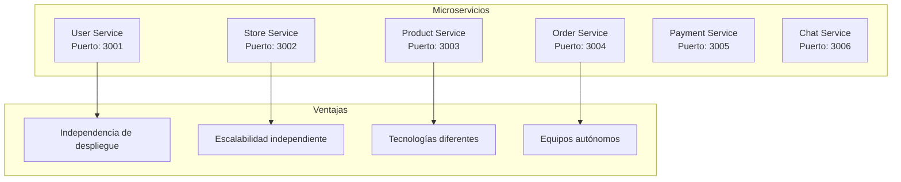
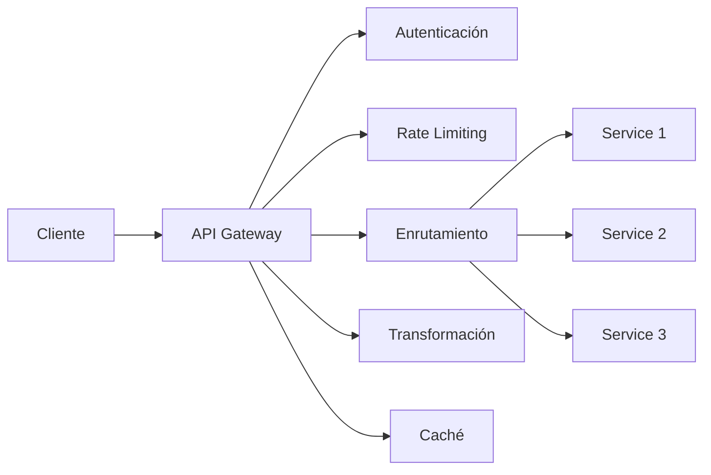
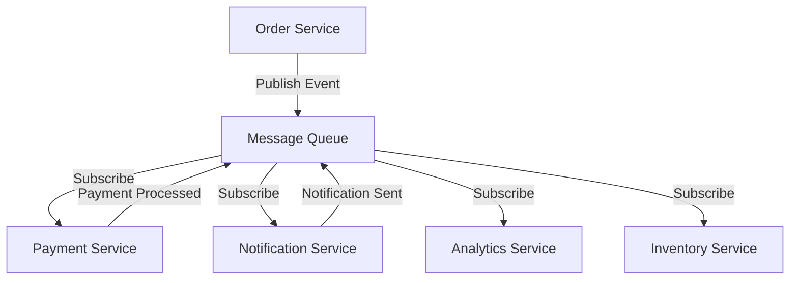
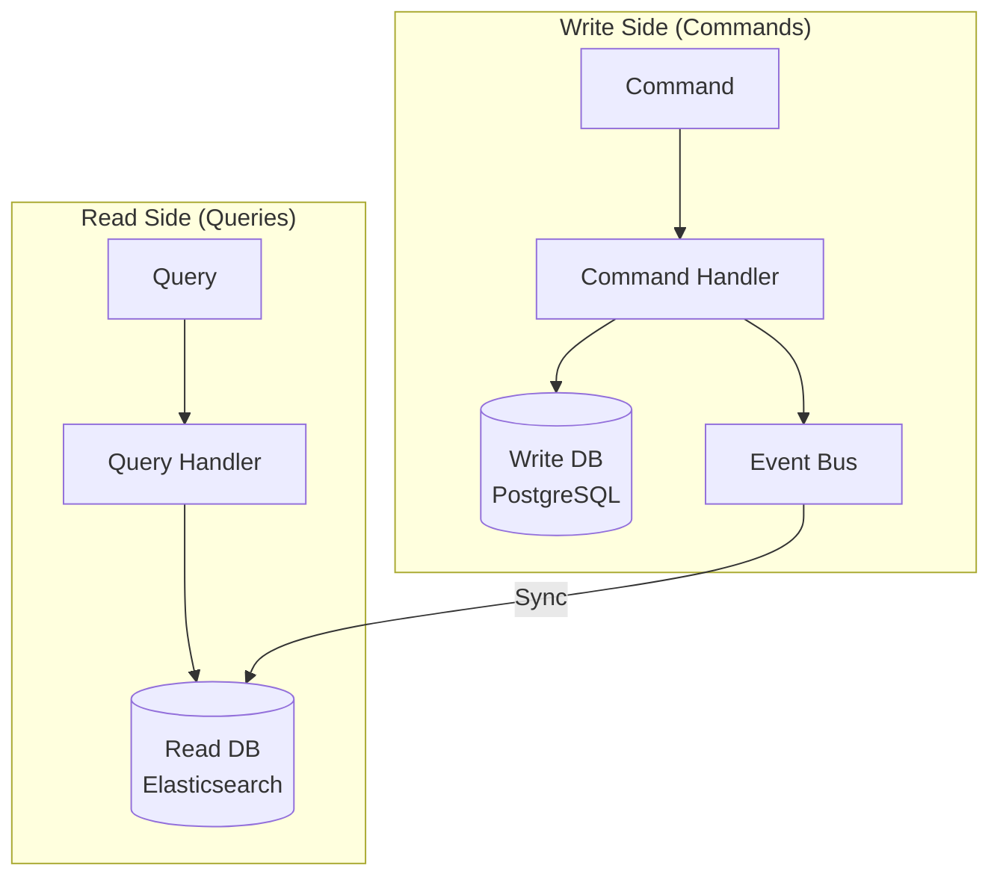
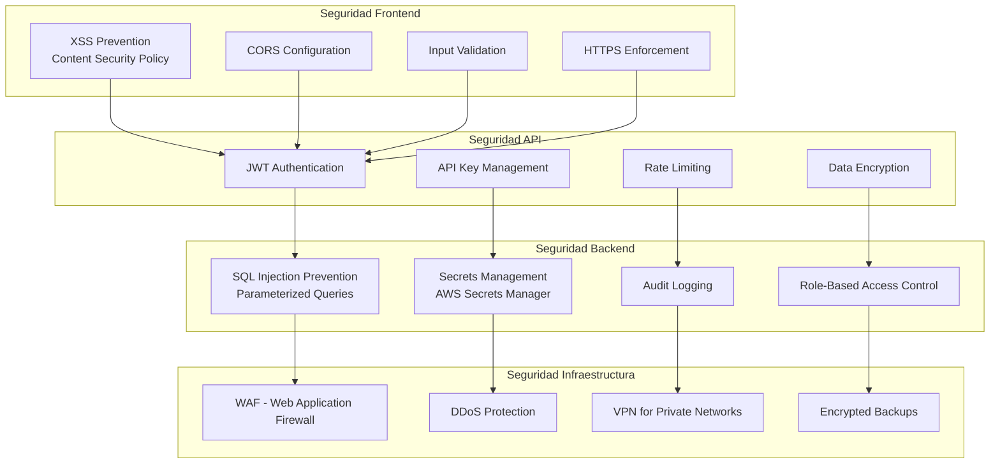
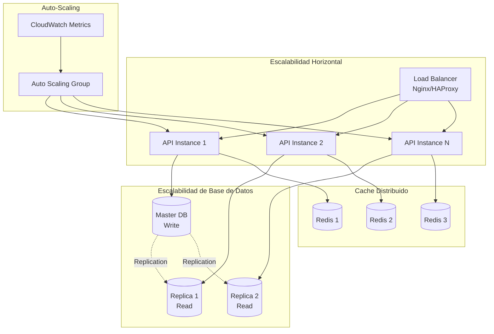
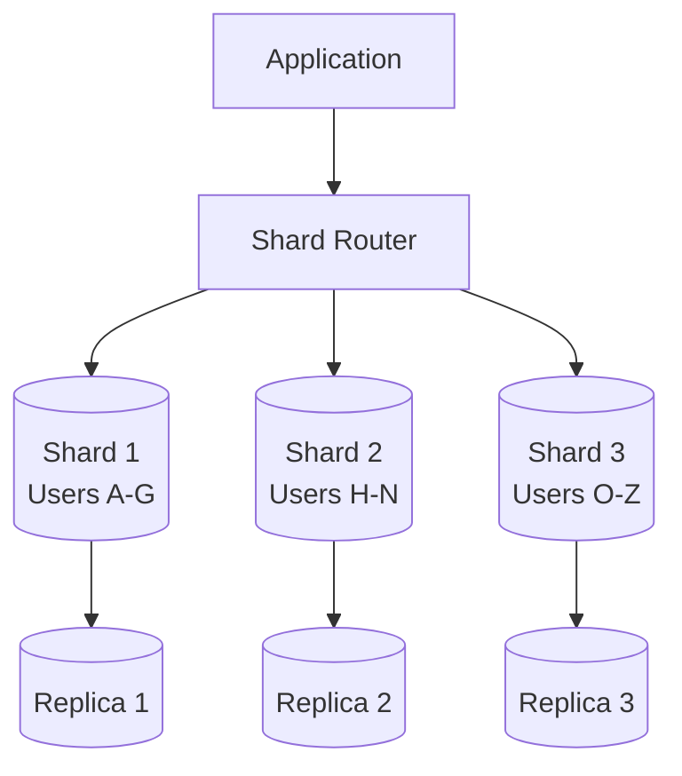

# Patrones de Arquitectura, Seguridad y Escalabilidad - Sistema Tiendi

Este documento describe los patrones de arquitectura, estrategias de seguridad y escalabilidad del sistema.

---

## 1. Patrones de Arquitectura

### 1.1 Patrones de Backend

#### Microservicios


#### API Gateway Pattern


#### Event-Driven Architecture


#### Repository Pattern
```typescript
// Interface del repositorio
interface IUserRepository {
  findById(id: string): Promise<User>;
  findByEmail(email: string): Promise<User>;
  create(user: CreateUserDto): Promise<User>;
  update(id: string, data: UpdateUserDto): Promise<User>;
  delete(id: string): Promise<void>;
}

// Implementación
class UserRepository implements IUserRepository {
  constructor(private db: Database) {}

  async findById(id: string): Promise<User> {
    return this.db.users.findOne({ where: { id } });
  }

  // ... otras implementaciones
}

// Service usa el repositorio
class UserService {
  constructor(private userRepository: IUserRepository) {}

  async getUser(id: string): Promise<User> {
    return this.userRepository.findById(id);
  }
}
```

#### CQRS (Command Query Responsibility Segregation)


#### Circuit Breaker Pattern
```typescript
class CircuitBreaker {
  private state: 'CLOSED' | 'OPEN' | 'HALF_OPEN' = 'CLOSED';
  private failureCount = 0;
  private readonly threshold = 5;
  private readonly timeout = 60000; // 60 seconds

  async execute<T>(fn: () => Promise<T>): Promise<T> {
    if (this.state === 'OPEN') {
      if (this.shouldAttemptReset()) {
        this.state = 'HALF_OPEN';
      } else {
        throw new Error('Circuit breaker is OPEN');
      }
    }

    try {
      const result = await fn();
      this.onSuccess();
      return result;
    } catch (error) {
      this.onFailure();
      throw error;
    }
  }

  private onSuccess() {
    this.failureCount = 0;
    this.state = 'CLOSED';
  }

  private onFailure() {
    this.failureCount++;
    if (this.failureCount >= this.threshold) {
      this.state = 'OPEN';
      this.startResetTimer();
    }
  }
}

// Uso
const breaker = new CircuitBreaker();
const result = await breaker.execute(() =>
  externalService.call()
);
```

---

### 1.2 Patrones de Frontend

#### Container/Presenter Pattern
```typescript
// Container (lógica)
const ProductListContainer = () => {
  const { data, isLoading } = useQuery('products', fetchProducts);
  const navigate = useNavigate();

  const handleProductClick = (id: string) => {
    navigate(`/product/${id}`);
  };

  return (
    <ProductListPresenter
      products={data}
      loading={isLoading}
      onProductClick={handleProductClick}
    />
  );
};

// Presenter (UI)
const ProductListPresenter = ({ products, loading, onProductClick }) => {
  if (loading) return <Spinner />;

  return (
    <div className="grid">
      {products.map(product => (
        <ProductCard
          key={product.id}
          product={product}
          onClick={() => onProductClick(product.id)}
        />
      ))}
    </div>
  );
};
```

#### Custom Hooks Pattern
```typescript
// useCart hook
function useCart() {
  const dispatch = useDispatch();
  const items = useSelector(state => state.cart.items);

  const addItem = useCallback((product, quantity) => {
    dispatch(cartActions.addItem({ product, quantity }));
  }, [dispatch]);

  const removeItem = useCallback((productId) => {
    dispatch(cartActions.removeItem(productId));
  }, [dispatch]);

  const total = useMemo(() =>
    items.reduce((sum, item) => sum + item.price * item.quantity, 0),
    [items]
  );

  return { items, addItem, removeItem, total };
}

// Uso
function CartPage() {
  const { items, removeItem, total } = useCart();
  // ...
}
```

---

## 2. Seguridad

### 2.1 Capas de Seguridad



### 2.2 Implementaciones de Seguridad

#### Content Security Policy (CSP)
```typescript
// Next.js middleware
export function middleware(request: NextRequest) {
  const response = NextResponse.next();

  response.headers.set(
    'Content-Security-Policy',
    `
      default-src 'self';
      script-src 'self' 'unsafe-eval' 'unsafe-inline' https://maps.googleapis.com;
      style-src 'self' 'unsafe-inline' https://fonts.googleapis.com;
      img-src 'self' data: https: blob:;
      font-src 'self' https://fonts.gstatic.com;
      connect-src 'self' https://api.tiendi.com wss://api.tiendi.com;
      frame-src 'self' https://www.google.com;
    `.replace(/\s+/g, ' ').trim()
  );

  return response;
}
```

#### Input Validation y Sanitización
```typescript
import { z } from 'zod';
import DOMPurify from 'isomorphic-dompurify';

// Schema de validación
const createOrderSchema = z.object({
  items: z.array(z.object({
    productId: z.string().uuid(),
    quantity: z.number().int().min(1).max(100)
  })),
  deliveryAddress: z.string().max(500),
  paymentMethod: z.enum(['cash', 'card', 'transfer']),
  notes: z.string().max(1000).optional()
});

// Validación y sanitización
function createOrder(data: unknown) {
  // Validar estructura
  const validated = createOrderSchema.parse(data);

  // Sanitizar campos de texto
  if (validated.notes) {
    validated.notes = DOMPurify.sanitize(validated.notes);
  }

  validated.deliveryAddress = DOMPurify.sanitize(validated.deliveryAddress);

  return validated;
}
```

#### SQL Injection Prevention
```typescript
// ❌ MAL - Vulnerable a SQL Injection
const userId = req.params.id;
const query = `SELECT * FROM users WHERE id = '${userId}'`;
await db.query(query);

// ✅ BIEN - Usando prepared statements
const userId = req.params.id;
const query = 'SELECT * FROM users WHERE id = $1';
await db.query(query, [userId]);

// ✅ BIEN - Usando ORM (TypeORM)
const user = await userRepository.findOne({
  where: { id: userId }
});
```

#### Rate Limiting
```typescript
import rateLimit from 'express-rate-limit';
import RedisStore from 'rate-limit-redis';
import Redis from 'ioredis';

const redis = new Redis(process.env.REDIS_URL);

// Rate limiter para login
const loginLimiter = rateLimit({
  store: new RedisStore({
    client: redis,
    prefix: 'rl:login:'
  }),
  windowMs: 15 * 60 * 1000, // 15 minutos
  max: 5, // 5 intentos
  message: 'Demasiados intentos de login, intenta en 15 minutos',
  standardHeaders: true,
  legacyHeaders: false
});

// Rate limiter para API general
const apiLimiter = rateLimit({
  store: new RedisStore({
    client: redis,
    prefix: 'rl:api:'
  }),
  windowMs: 1 * 60 * 1000, // 1 minuto
  max: 100, // 100 requests
  message: 'Demasiadas peticiones, intenta más tarde'
});

// Uso
app.post('/auth/login', loginLimiter, loginController);
app.use('/api', apiLimiter);
```

#### Secrets Management
```typescript
// ❌ MAL - Hardcoded secrets
const apiKey = 'sk_live_abc123xyz';

// ❌ MAL - En .env sin encriptar en producción
// API_KEY=sk_live_abc123xyz

// ✅ BIEN - Usando AWS Secrets Manager
import { SecretsManager } from '@aws-sdk/client-secrets-manager';

const client = new SecretsManager({ region: 'us-east-1' });

async function getSecret(secretName: string) {
  const response = await client.getSecretValue({
    SecretId: secretName
  });

  return JSON.parse(response.SecretString);
}

// Uso
const secrets = await getSecret('tiendi/production/api-keys');
const paymentApiKey = secrets.PAYMENT_GATEWAY_API_KEY;
```

#### Encryption at Rest
```typescript
import * as crypto from 'crypto';

class EncryptionService {
  private algorithm = 'aes-256-gcm';
  private key: Buffer;

  constructor(secretKey: string) {
    this.key = crypto.scryptSync(secretKey, 'salt', 32);
  }

  encrypt(text: string): string {
    const iv = crypto.randomBytes(16);
    const cipher = crypto.createCipheriv(this.algorithm, this.key, iv);

    let encrypted = cipher.update(text, 'utf8', 'hex');
    encrypted += cipher.final('hex');

    const authTag = cipher.getAuthTag();

    return `${iv.toString('hex')}:${authTag.toString('hex')}:${encrypted}`;
  }

  decrypt(encryptedText: string): string {
    const [ivHex, authTagHex, encrypted] = encryptedText.split(':');

    const iv = Buffer.from(ivHex, 'hex');
    const authTag = Buffer.from(authTagHex, 'hex');
    const decipher = crypto.createDecipheriv(this.algorithm, this.key, iv);

    decipher.setAuthTag(authTag);

    let decrypted = decipher.update(encrypted, 'hex', 'utf8');
    decrypted += decipher.final('utf8');

    return decrypted;
  }
}

// Uso para datos sensibles
const encryption = new EncryptionService(process.env.ENCRYPTION_KEY);

// Encriptar tarjeta antes de guardar
const encryptedCard = encryption.encrypt(cardNumber);
await db.query('INSERT INTO payment_methods (user_id, card_encrypted) VALUES ($1, $2)',
  [userId, encryptedCard]
);

// Desencriptar para usar
const { card_encrypted } = await db.query('SELECT card_encrypted FROM payment_methods WHERE id = $1', [id]);
const cardNumber = encryption.decrypt(card_encrypted);
```

#### RBAC (Role-Based Access Control)
```typescript
enum Role {
  CUSTOMER = 'customer',
  STORE_OWNER = 'store_owner',
  ADMIN = 'admin',
  SUPER_ADMIN = 'super_admin'
}

enum Permission {
  READ_PRODUCTS = 'read:products',
  WRITE_PRODUCTS = 'write:products',
  READ_ORDERS = 'read:orders',
  WRITE_ORDERS = 'write:orders',
  MANAGE_USERS = 'manage:users',
  MANAGE_STORES = 'manage:stores'
}

const rolePermissions: Record<Role, Permission[]> = {
  [Role.CUSTOMER]: [
    Permission.READ_PRODUCTS,
    Permission.READ_ORDERS
  ],
  [Role.STORE_OWNER]: [
    Permission.READ_PRODUCTS,
    Permission.WRITE_PRODUCTS,
    Permission.READ_ORDERS,
    Permission.WRITE_ORDERS
  ],
  [Role.ADMIN]: [
    Permission.READ_PRODUCTS,
    Permission.WRITE_PRODUCTS,
    Permission.READ_ORDERS,
    Permission.WRITE_ORDERS,
    Permission.MANAGE_USERS
  ],
  [Role.SUPER_ADMIN]: Object.values(Permission)
};

// Middleware
function requirePermission(permission: Permission) {
  return (req: Request, res: Response, next: NextFunction) => {
    const userRole = req.user.role;
    const permissions = rolePermissions[userRole];

    if (!permissions.includes(permission)) {
      return res.status(403).json({ error: 'Forbidden' });
    }

    next();
  };
}

// Uso
app.post('/products',
  authenticate,
  requirePermission(Permission.WRITE_PRODUCTS),
  createProductController
);
```

---

## 3. Escalabilidad

### 3.1 Estrategias de Escalabilidad Horizontal



### 3.2 Database Sharding


### 3.3 Caching Strategy
```typescript
// Multi-level caching
class CacheService {
  constructor(
    private l1Cache: NodeCache,    // In-memory (local)
    private l2Cache: Redis,         // Distributed
    private ttl = 3600              // 1 hour
  ) {}

  async get<T>(key: string): Promise<T | null> {
    // L1: Check local cache
    let value = this.l1Cache.get<T>(key);
    if (value) {
      return value;
    }

    // L2: Check Redis
    const redisValue = await this.l2Cache.get(key);
    if (redisValue) {
      value = JSON.parse(redisValue);
      this.l1Cache.set(key, value, this.ttl);
      return value;
    }

    return null;
  }

  async set<T>(key: string, value: T, ttl?: number): Promise<void> {
    const cacheTtl = ttl || this.ttl;

    // Set in both caches
    this.l1Cache.set(key, value, cacheTtl);
    await this.l2Cache.setex(key, cacheTtl, JSON.stringify(value));
  }

  async invalidate(key: string): Promise<void> {
    this.l1Cache.del(key);
    await this.l2Cache.del(key);
  }
}

// Usage
const cache = new CacheService(nodeCache, redis);

// Get with fallback to database
async function getProduct(id: string) {
  const cacheKey = `product:${id}`;

  // Try cache first
  let product = await cache.get<Product>(cacheKey);
  if (product) {
    return product;
  }

  // Fallback to database
  product = await db.products.findById(id);

  // Store in cache
  await cache.set(cacheKey, product, 3600);

  return product;
}
```

### 3.4 Message Queue para Procesamiento Asíncrono
```typescript
import Bull from 'bull';

// Definir queues
const emailQueue = new Bull('email', process.env.REDIS_URL);
const orderQueue = new Bull('order-processing', process.env.REDIS_URL);

// Producer: Agregar trabajo a la cola
async function sendOrderConfirmation(orderId: string) {
  await emailQueue.add('order-confirmation', {
    orderId,
    type: 'order-confirmation'
  }, {
    attempts: 3,
    backoff: {
      type: 'exponential',
      delay: 2000
    }
  });
}

// Consumer: Procesar trabajos
emailQueue.process('order-confirmation', async (job) => {
  const { orderId } = job.data;

  const order = await getOrder(orderId);
  await sendEmail({
    to: order.user.email,
    template: 'order-confirmation',
    data: order
  });
});

// Error handling
emailQueue.on('failed', (job, err) => {
  console.error(`Job ${job.id} failed:`, err);
  // Log to monitoring system
});

// Métricas
emailQueue.on('completed', (job) => {
  console.log(`Job ${job.id} completed`);
  // Send metrics to monitoring
});
```

### 3.5 CDN Configuration
```typescript
// Next.js configuration para CDN
// next.config.js
module.exports = {
  images: {
    domains: ['cdn.tiendi.com'],
    loader: 'custom',
    loaderFile: './imageLoader.js',
  },
  assetPrefix: process.env.CDN_URL,
};

// imageLoader.js
export default function cloudflareLoader({ src, width, quality }) {
  const params = [`width=${width}`];
  if (quality) {
    params.push(`quality=${quality}`);
  }
  const paramsString = params.join(',');
  return `https://cdn.tiendi.com/cdn-cgi/image/${paramsString}/${src}`;
}
```

---

## 4. Monitoreo y Observabilidad

### 4.1 Métricas Clave (RED Method)
- **Rate**: Requests per second
- **Errors**: Error rate
- **Duration**: Response time

```typescript
import { Counter, Histogram, register } from 'prom-client';

// Métricas
const httpRequestsTotal = new Counter({
  name: 'http_requests_total',
  help: 'Total HTTP requests',
  labelNames: ['method', 'route', 'status']
});

const httpRequestDuration = new Histogram({
  name: 'http_request_duration_seconds',
  help: 'HTTP request duration',
  labelNames: ['method', 'route', 'status'],
  buckets: [0.1, 0.3, 0.5, 0.7, 1, 3, 5, 7, 10]
});

// Middleware
app.use((req, res, next) => {
  const start = Date.now();

  res.on('finish', () => {
    const duration = (Date.now() - start) / 1000;

    httpRequestsTotal.inc({
      method: req.method,
      route: req.route?.path || req.path,
      status: res.statusCode
    });

    httpRequestDuration.observe({
      method: req.method,
      route: req.route?.path || req.path,
      status: res.statusCode
    }, duration);
  });

  next();
});

// Endpoint de métricas
app.get('/metrics', async (req, res) => {
  res.set('Content-Type', register.contentType);
  res.end(await register.metrics());
});
```

### 4.2 Distributed Tracing
```typescript
import { trace, context } from '@opentelemetry/api';
import { JaegerExporter } from '@opentelemetry/exporter-jaeger';

const tracer = trace.getTracer('tiendi-api');

// Wrapper para funciones con tracing
function traced<T>(name: string, fn: () => Promise<T>): Promise<T> {
  return tracer.startActiveSpan(name, async (span) => {
    try {
      const result = await fn();
      span.setStatus({ code: SpanStatusCode.OK });
      return result;
    } catch (error) {
      span.recordException(error);
      span.setStatus({ code: SpanStatusCode.ERROR });
      throw error;
    } finally {
      span.end();
    }
  });
}

// Uso
async function getProduct(id: string) {
  return traced('getProduct', async () => {
    const product = await db.products.findById(id);
    return product;
  });
}
```

---

**Fecha de creación:** 2025-11-24
**Versión:** 1.0
