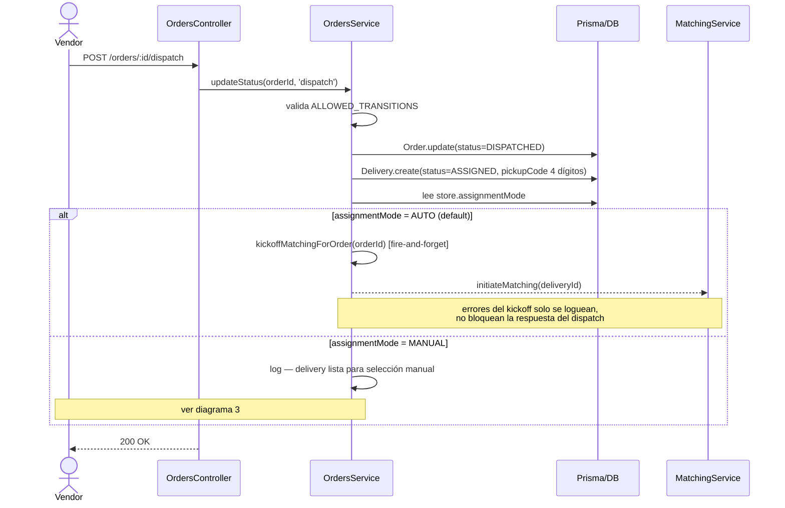
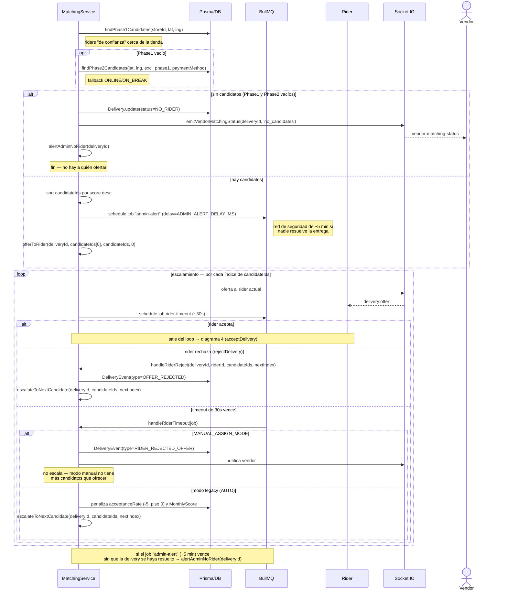
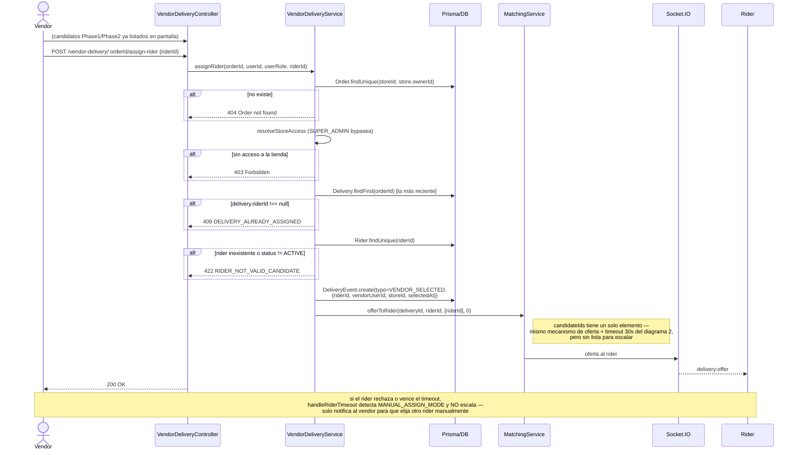
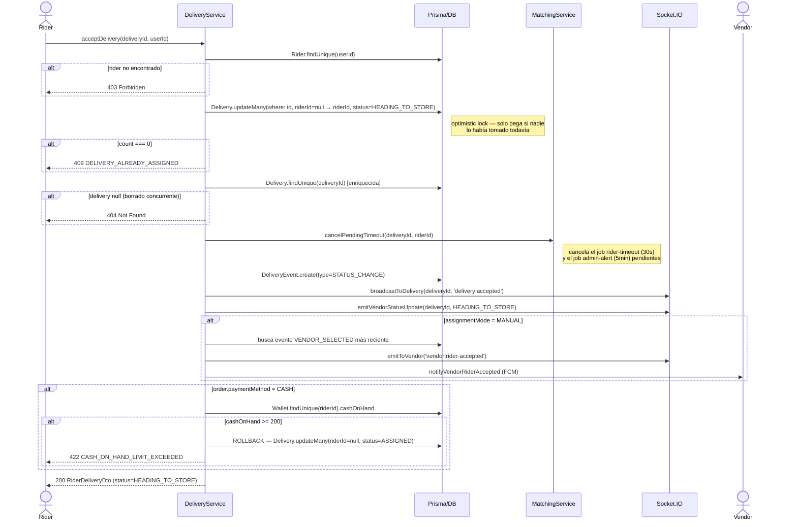

# Diagramas de Secuencia — Matching de Riders

Mapeo del flujo real de asignación de riders a partir de la lectura directa del código (`tiendi-api`), desde el `dispatch` del pedido hasta que el rider acepta la entrega. Incluye la rama automática (matching por score) y la rama manual (selección directa por el vendor).

Última actualización: 2026-09-08.

## Índice

- [1. Dispatch del pedido → creación de la Delivery](#1-dispatch-del-pedido--creación-de-la-delivery)
- [2. Matching automático (AUTO) con escalamiento](#2-matching-automático-auto-con-escalamiento)
- [3. Asignación manual (MANUAL) por el vendor](#3-asignación-manual-manual-por-el-vendor)
- [4. Aceptación del rider (`acceptDelivery`)](#4-aceptación-del-rider-acceptdelivery)
- [Fuera de alcance](#fuera-de-alcance)

---

## 1. Dispatch del pedido → creación de la Delivery

Fuente: `tiendi-api/src/modules/orders/orders.controller.ts` (`dispatch`), `tiendi-api/src/modules/orders/orders.service.ts` (`updateStatus`, `kickoffMatchingForOrder`).

---

## 2. Matching automático (AUTO) con escalamiento

Fuente: `tiendi-api/src/modules/matching/matching.service.ts` — `initiateMatching`, `offerToRider`, `handleRiderTimeout`, `handleRiderReject`, `escalateToNextCandidate`, `emitVendorMatchingStatus`.

---

## 3. Asignación manual (MANUAL) por el vendor

Fuente: `tiendi-api/src/modules/vendor-delivery/vendor-delivery.controller.ts` (`assignRider`), `tiendi-api/src/modules/vendor-delivery/vendor-delivery.service.ts` (`assignRider`, líneas 212-289).

---

## 4. Aceptación del rider (`acceptDelivery`)

Fuente: `tiendi-api/src/modules/delivery/delivery.service.ts` (`acceptDelivery`, líneas 200-319).

---

## Fuera de alcance

El ciclo de vida posterior a `HEADING_TO_STORE` (llegada a la tienda, recogida, en camino al cliente, entrega/POD) no fue relevado en esta sesión — no está incluido para evitar documentar nombres de métodos sin verificar contra el código real.
