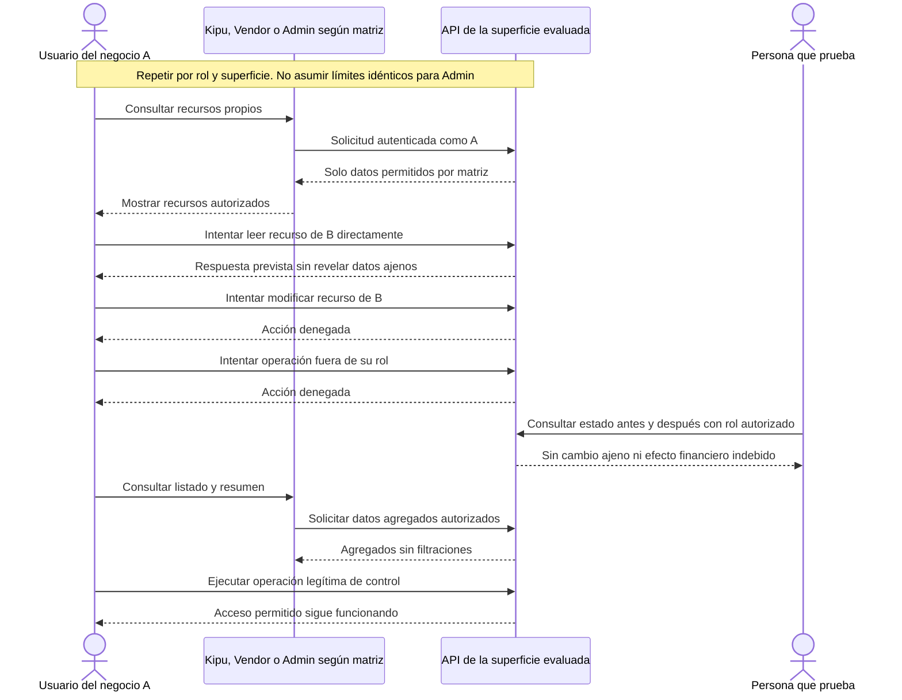

# ACCESS-TENANT-001 — Aislar datos por negocio y rol

[Volver al plan general](../../PLAN-PRUEBAS-E2E.md)

> Estado: borrador de caso por completar y revalidar. Sin ejecutar. Basado en la revisión del 2026-09-19, organizado el 2026-09-20. Los resultados siguientes son criterios propuestos, no evidencia de implementación ni aprobación.

## Objetivo y alcance

Verificar aislamiento de datos y autorización de operaciones en backend, además de interfaz.

- Actores y superficies: Usuarios de dos negocios/tiendas distintos y roles Kipu, Vendor y Admin aplicables.
- Alcance previsto: recorrido integrado de las superficies indicadas. Registrar el alcance real y todos los mocks en la ejecución.
- Prioridad: Alta.

## Preparación y datos

Preparar entidades propias para A y B y matriz explícita rol–acción–recurso por superficie. Registrar credenciales separadas sin incluir secretos en evidencias.

Preparar datos propios de este caso, aunque se reutilice el procedimiento de otro. Registrar entorno, versiones, IDs y valores iniciales. No depender de ejecuciones previas. Definir plazos y condición de espera para procesos asíncronos.

## Pasos y resultados esperados

| Paso | Acción | Resultado esperado |
|---|---|---|
| 1 | Consultar recursos propios con actor autorizado | Obtiene únicamente datos permitidos. |
| 2 | Intentar leer recurso B autenticado como A mediante API | No se revela dato ajeno, con respuesta prevista por contrato. |
| 3 | Intentar modificar recurso ajeno o usar operación fuera de rol | Acción denegada sin cambio de datos ni efecto financiero. |
| 4 | Verificar listado, resumen y operación legítima posterior | No hay filtraciones agregadas y el acceso permitido sigue funcionando. |

## Diagrama de secuencia

Flujo conceptual propuesto a partir de los pasos del caso, pendiente de validar contra la implementación vigente. No representa todas las llamadas internas ni evidencia una ejecución aprobada.

## Verificaciones y evidencias

Registrar IDs sanitizados, respuestas y estado antes/después. Un menú oculto o guard frontend no basta como prueba. Usar registros aislados y no datos de clientes reales.

Usar [el registro de ejecución](../PLANTILLAS.md#registro-de-ejecución) para separar esperado y obtenido, con evidencias sanitizadas, controles omitidos y resultado por comprobación.

## Limpieza

Restablecer únicamente los datos de prueba mediante el mecanismo autorizado del entorno. Conservar evidencia antes de limpiar. En movimientos financieros, usar el restablecimiento o compensación permitido, nunca borrar asientos para forzar saldos. Registrar los IDs afectados.

## Pendientes y bloqueos

Resolver matriz de permisos, endpoints y códigos exactos por API. No asumir que el administrador tiene los mismos límites que el comerciante. Ampliar casos por operación sensible.

Si falta una regla o capacidad necesaria, registrar el bloqueo y su motivo. No aprobar el caso por la existencia de tests o por una pantalla exitosa.

## Referencias

- [Modelo Kipu](../../../FUENTES/tiendi-kipu/api/prisma/schema.prisma); [Controlador Admin](../../../FUENTES/tiendi-api/src/modules/admin/admin.controller.ts); [Reglas de negocio](../../MULTI-TENANCY-KIPU.md).
- [Criterios compartidos y límites de implementación](../REFERENCIAS-Y-CRITERIOS.md).
