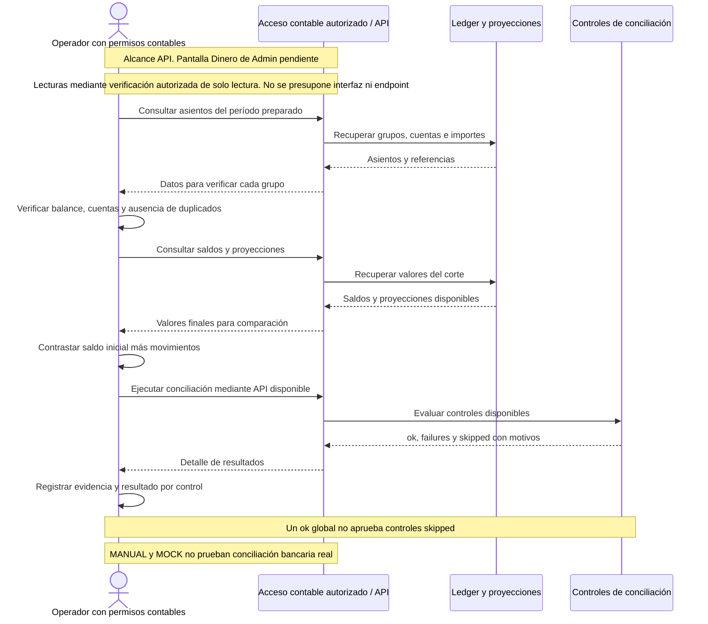

# ACCOUNTING-CLOSE-001 — Ejecutar controles de cierre

[Volver al plan general](../../PLAN-PRUEBAS-E2E.md)

> Estado: borrador de caso por completar y revalidar. Sin ejecutar. Basado en la revisión del 2026-09-19, organizado el 2026-09-20. Los resultados siguientes son criterios propuestos, no evidencia de implementación ni aprobación.

## Objetivo y alcance

Comprobar asientos, proyecciones y conciliación con controles omitidos explícitos.

- Actores y superficies: Operador con permisos contables y API Tiendi. UI Admin futura fuera del recorrido disponible revisado.
- Alcance previsto: API contable, no E2E de interfaz Admin. Registrar el alcance real y todos los mocks en la ejecución.
- Prioridad: Alta.

## Preparación y datos

Preparar período y conjunto aislado de operaciones con saldos iniciales y expectativas por canal. Definir corte/zona horaria, cuentas, reglas y acceso administrativo. Declarar banco/pasarela simulados.

Preparar datos propios de este caso, aunque se reutilice el procedimiento de otro. Registrar entorno, versiones, IDs y valores iniciales. No depender de ejecuciones previas. Definir plazos y condición de espera para procesos asíncronos.

## Pasos y resultados esperados

| Paso | Acción | Resultado esperado |
|---|---|---|
| 1 | Consultar asientos y proyecciones del período | Cuentas, importes y referencias corresponden a operaciones preparadas. |
| 2 | Comprobar cada grupo de asientos | Balance y mapeo de cuentas correctos, sin duplicados. |
| 3 | Contrastar saldos iniciales y finales | Saldo inicial más movimientos coincide con saldo/proyección donde aplique. |
| 4 | Ejecutar conciliación disponible | Se registran ok, failures y skipped junto con evidencia y motivos. |
| 5 | Evaluar cobertura del cierre | Controles ausentes permanecen omitidos o bloqueados, nunca aprobados por un ok global. |

## Diagrama de secuencia

Flujo conceptual propuesto a partir de los pasos del caso, pendiente de validar contra la implementación vigente. No representa todas las llamadas internas ni evidencia una ejecución aprobada.

## Verificaciones y evidencias

Conservar período, consultas de lectura, grupos, diferencias y detalle de cada control. Exigir evidencia del proveedor para afirmar conciliación bancaria real.

Usar [el registro de ejecución](../PLANTILLAS.md#registro-de-ejecución) para separar esperado y obtenido, con evidencias sanitizadas, controles omitidos y resultado por comprobación.

## Limpieza

Restablecer únicamente los datos de prueba mediante el mecanismo autorizado del entorno. Conservar evidencia antes de limpiar. En movimientos financieros, usar el restablecimiento o compensación permitido, nunca borrar asientos para forzar saldos. Registrar los IDs afectados.

## Pendientes y bloqueos

Dinero Admin tiene route null y ready false. Adaptador MANUAL-*/MOCK-* no acredita banco real. Definir criterios de corte, tolerancias y controles obligatorios antes de ejecución.

Si falta una regla o capacidad necesaria, registrar el bloqueo y su motivo. No aprobar el caso por la existencia de tests o por una pantalla exitosa.

## Referencias

- [Dashboard Admin](../../../FUENTES/tiendi-admin/src/app/admin/pages/dashboard/dashboard.page.ts); [Controlador Admin](../../../FUENTES/tiendi-api/src/modules/admin/admin.controller.ts); [Ledger](../../../FUENTES/tiendi-api/src/modules/ledger/ledger.service.ts); [Conciliación](../../../FUENTES/tiendi-api/src/modules/ledger/reconciliation.service.ts); [Liquidaciones](../../../FUENTES/tiendi-api/src/modules/settlement/settlement.service.ts); [Reglas de negocio](../../FLUJO_DINERO.md).
- [Criterios compartidos y límites de implementación](../REFERENCIAS-Y-CRITERIOS.md).
