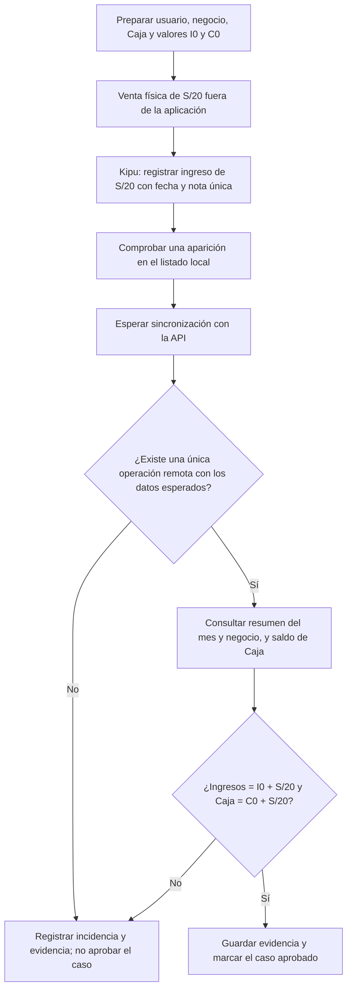
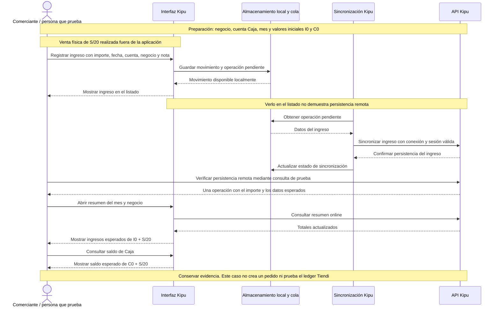
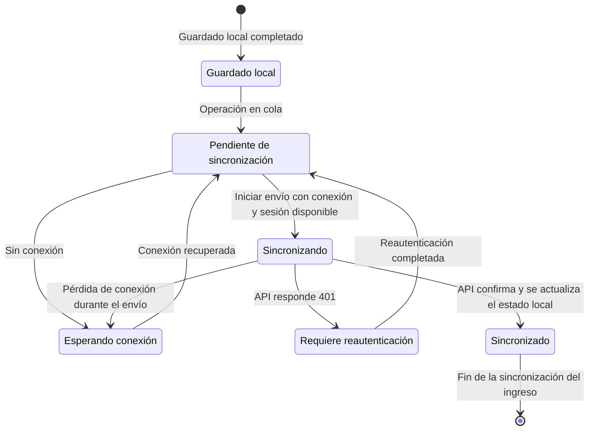

# KIPU-LOCAL-001 — Registrar ingreso de venta presencial

[Volver al plan general](../../PLAN-PRUEBAS-E2E.md)

**Objetivo:** registrar correctamente el ingreso de una venta presencial de S/20.

**Alcance:** Kipu → almacenamiento local → sincronización → API → consulta del resumen. La entrega física del producto es una acción externa; no se está probando un POS.

**Estado:** implementación revisada; ejecución pendiente.

### Preparación

- Usuario de pruebas autenticado.
- Negocio de pruebas seleccionado.
- Cuenta `Caja` en PEN, perteneciente al ámbito correcto.
- Fecha dentro del mes que se consultará, con zona horaria acordada.
- Registrar ingreso mensual inicial `I0` y saldo inicial de Caja `C0`.
- Ausencia de movimientos concurrentes sobre esos datos durante la prueba.
- Nota única, por ejemplo `KIPU-LOCAL-001-<id-ejecucion>`.

### Pasos

| Paso | Acción | Resultado esperado |
|---|---|---|
| 1 | Realizar/simular externamente una venta física de S/20 | Existe el hecho de negocio que se registrará, sin crear un pedido Tiendi |
| 2 | Abrir Registrar y seleccionar Ingreso | Formulario de ingreso disponible |
| 3 | Completar importe 20, fecha, cuenta Caja, negocio y nota única | Los datos corresponden al caso preparado |
| 4 | Guardar | El movimiento aparece una sola vez en el listado local |
| 5 | Esperar sincronización y recuperar el movimiento desde servidor | Persiste exactamente una operación con los datos esperados |
| 6 | Consultar el resumen del mismo mes y negocio con conexión | Ingresos finales = `I0 + S/20` |
| 7 | Consultar el saldo de Caja | Saldo final = `C0 + S/20`, sin otros movimientos concurrentes |
| 8 | Comprobar alcance de la operación | No se exige ni se atribuye creación de pedido, descuento de stock o asiento en el ledger Tiendi |

### Diagrama de flujo del caso

Este gráfico representa el recorrido de la prueba, no un algoritmo interno de la aplicación. El caso principal requiere conexión para completar la sincronización y consultar el resumen.

Si no se puede completar una comprobación por un problema del entorno, registrar el resultado como bloqueado; si se observa un resultado incorrecto, registrarlo como fallido. El plazo de espera de sincronización debe definirse antes de ejecutar el caso.

### Diagrama de secuencia del caso

Vista funcional simplificada del recorrido esperado, basada en el guardado local-first y la consulta online del resumen. No representa todas las llamadas internas ni sustituye la evidencia de ejecución.

La consulta directa de persistencia remota es una comprobación de la persona que ejecuta la prueba, no una pantalla adicional de Kipu. Las variantes sin conexión, con sesión vencida y sin cuenta se documentan por separado abajo.

### Diagrama de estados de sincronización

Estados **conceptuales para entender y probar el recorrido**, no nombres exactos de enums o etiquetas de la interfaz. El camino principal pertenece a `KIPU-LOCAL-001`. Las ramas sin conexión y con sesión vencida corresponden a las variantes indicadas abajo.

- **Guardado local no significa sincronizado:** el movimiento puede verse en el listado mientras sigue pendiente de envío.
- **Sin conexión o con sesión vencida:** comprobar que la operación se conserva y se retoma al recuperar la condición necesaria. No volver a registrar manualmente la misma venta.
- **Respuesta perdida:** si el servidor guardó el ingreso pero no llegó la confirmación, verificar que el reintento no cree otra operación.
- **Sincronizado no significa caso aprobado:** aún falta verificar una única operación remota, los ingresos del mes y el saldo de Caja. El resumen requiere conexión.

Este esquema no cubre todos los errores posibles de validación, permisos o servidor. Sus reglas de recuperación deben definirse en casos separados.

### Evidencias y cierre

- ID del movimiento, negocio y cuenta; nota única.
- Estado inicial y final de ingresos y saldo.
- Evidencia de persistencia remota, no solo de presencia en el almacenamiento local.
- Registrar el mecanismo de limpieza permitido en el entorno aislado. No borrar evidencia de una ejecución fallida antes de analizarla.

### Variantes separadas

- [KIPU-SYNC-001](KIPU-SYNC-001.md): guardar sin red, comprobar listado local, reconectar y verificar una única operación remota. **No exigir resumen offline**, porque depende de la API.
- Nueva variante de sesión: recibir `401` durante sincronización, reautenticar y comprobar conservación y posterior procesamiento de operaciones.
- Nueva variante sin cuenta: comprobar listado/resumen sin atribuir variación a Caja.

### Pendientes y referencias

- Confirmar versiones, plazo de sincronización, preparación repetible y mecanismo autorizado de limpieza antes de ejecutar.
- Revisión de fuentes: 2026-09-19. Reorganización documental: 2026-09-20, sin revalidación funcional ni ejecución.
- [Registro Kipu](../../../FUENTES/tiendi-kipu/web/src/app/features/expenses/register.page.ts), [sincronización](../../../FUENTES/tiendi-kipu/web/src/app/core/sync.store.ts), [resumen](../../../FUENTES/tiendi-kipu/web/src/app/features/summary/summary.store.ts) y [modelo](../../../FUENTES/tiendi-kipu/api/prisma/schema.prisma).
- [Criterios comunes](../REFERENCIAS-Y-CRITERIOS.md) y [plantilla de ejecución](../PLANTILLAS.md#registro-de-ejecución).
