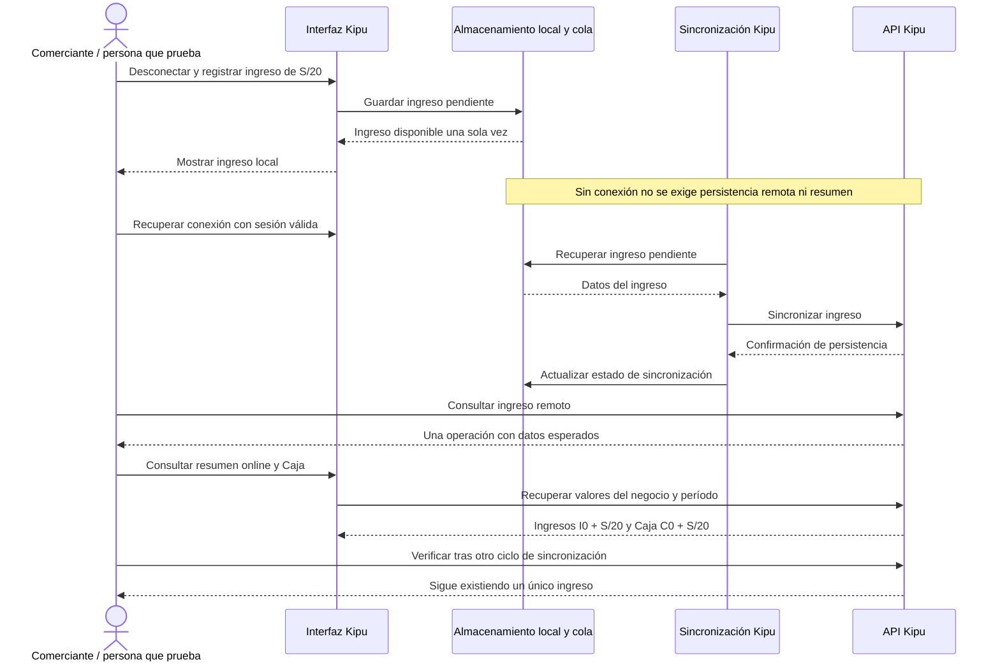

# KIPU-SYNC-001 — Registrar sin conexión y reconectar

[Volver al plan general](../../PLAN-PRUEBAS-E2E.md)

> Estado: borrador de caso por completar y revalidar. Sin ejecutar. Basado en la revisión del 2026-09-19, organizado el 2026-09-20. Los resultados siguientes son criterios propuestos, no evidencia de implementación ni aprobación.

## Objetivo y alcance

Conservar un ingreso local y sincronizarlo una sola vez al recuperar conexión.

- Actores y superficies: Kipu, API Kipu y persona que registra.
- Alcance previsto: recorrido integrado de las superficies indicadas. Registrar el alcance real y todos los mocks en la ejecución.
- Prioridad: Alta.

## Preparación y datos

Preparar usuario, negocio, cuenta Caja, fecha, nota única, I0 y C0 como en KIPU-LOCAL-001. Definir cómo cortar/restablecer red y consultar persistencia remota sin alterar la cola.

Preparar datos propios de este caso, aunque se reutilice el procedimiento de otro. Registrar entorno, versiones, IDs y valores iniciales. No depender de ejecuciones previas. Definir plazos y condición de espera para procesos asíncronos.

## Pasos y resultados esperados

| Paso | Acción | Resultado esperado |
|---|---|---|
| 1 | Desconectar antes de guardar | La falta de red queda comprobada. |
| 2 | Registrar ingreso de S/20 | El ingreso aparece una vez localmente y queda pendiente de sincronización. |
| 3 | Reconectar con sesión válida y esperar el plazo acordado | Existe una única operación remota con importe, negocio y cuenta esperados. |
| 4 | Consultar resumen online y Caja | Ingresos = I0 + S/20 y Caja = C0 + S/20 sin otros movimientos. |

## Diagrama de secuencia

Flujo conceptual propuesto a partir de los pasos del caso, pendiente de validar contra la implementación vigente. No representa todas las llamadas internas ni evidencia una ejecución aprobada.

## Verificaciones y evidencias

Conservar ID local/remoto y evidencia antes/después de reconectar. No exigir resumen offline. Comprobar ausencia de duplicados también después de un nuevo ciclo de sincronización.

Usar [el registro de ejecución](../PLANTILLAS.md#registro-de-ejecución) para separar esperado y obtenido, con evidencias sanitizadas, controles omitidos y resultado por comprobación.

## Limpieza

Restablecer únicamente los datos de prueba mediante el mecanismo autorizado del entorno. Conservar evidencia antes de limpiar. En movimientos financieros, usar el restablecimiento o compensación permitido, nunca borrar asientos para forzar saldos. Registrar los IDs afectados.

## Pendientes y bloqueos

Definir plazo de sincronización y mecanismo de consulta. Sesión vencida (401), respuesta perdida y recuperación tras reinicio son variantes por detallar, no resultados ya comprobados.

Si falta una regla o capacidad necesaria, registrar el bloqueo y su motivo. No aprobar el caso por la existencia de tests o por una pantalla exitosa.

## Referencias

- [Modelo Kipu](../../../FUENTES/tiendi-kipu/api/prisma/schema.prisma); [Sincronización Kipu](../../../FUENTES/tiendi-kipu/web/src/app/core/sync.store.ts); [Resumen Kipu](../../../FUENTES/tiendi-kipu/web/src/app/features/summary/summary.store.ts); [Reglas de negocio](../../INTEGRACION-TIENDI.md).
- [Criterios compartidos y límites de implementación](../REFERENCIAS-Y-CRITERIOS.md).
