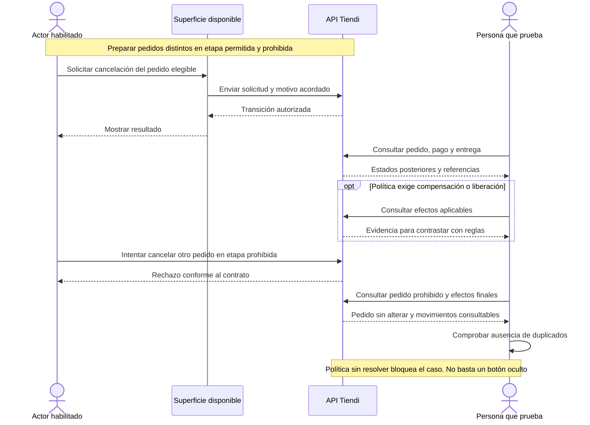

# ORDER-CANCEL-001 — Cancelar según etapa permitida

[Volver al plan general](../../PLAN-PRUEBAS-E2E.md)

> Estado: borrador de caso por completar y revalidar. Sin ejecutar. Basado en la revisión del 2026-09-19, organizado el 2026-09-20. Los resultados siguientes son criterios propuestos, no evidencia de implementación ni aprobación.

## Objetivo y alcance

Validar cancelación autorizada y restricciones de etapa con efectos compensatorios cuando correspondan.

- Actores y superficies: Actor habilitado según política, aplicaciones participantes y API.
- Alcance previsto: recorrido integrado de las superficies indicadas. Registrar el alcance real y todos los mocks en la ejecución.
- Prioridad: Media.

## Preparación y datos

Preparar pedidos independientes para etapa permitida y no permitida. Registrar actor/rol, pago, entrega y saldos iniciales. Resolver política antes de ejecutar.

Preparar datos propios de este caso, aunque se reutilice el procedimiento de otro. Registrar entorno, versiones, IDs y valores iniciales. No depender de ejecuciones previas. Definir plazos y condición de espera para procesos asíncronos.

## Pasos y resultados esperados

| Paso | Acción | Resultado esperado |
|---|---|---|
| 1 | Solicitar cancelación en etapa permitida | Transición autorizada y motivo trazable según contrato. |
| 2 | Consultar pedido, pago y entrega | Estados y compensaciones coinciden con reglas acordadas. |
| 3 | Intentar cancelar otro pedido en etapa prohibida | La API rechaza la acción conforme al contrato y no altera el pedido. |
| 4 | Revisar efectos finales | No hay devolución, liberación o asiento duplicado. |

## Diagrama de secuencia

Flujo conceptual propuesto a partir de los pasos del caso, pendiente de validar contra la implementación vigente. No representa todas las llamadas internas ni evidencia una ejecución aprobada.

## Verificaciones y evidencias

Conservar solicitudes sanitizadas, estados e IDs correlacionados. Verificar restricción en backend, no solo botón oculto.

Usar [el registro de ejecución](../PLANTILLAS.md#registro-de-ejecución) para separar esperado y obtenido, con evidencias sanitizadas, controles omitidos y resultado por comprobación.

## Limpieza

Restablecer únicamente los datos de prueba mediante el mecanismo autorizado del entorno. Conservar evidencia antes de limpiar. En movimientos financieros, usar el restablecimiento o compensación permitido, nunca borrar asientos para forzar saldos. Registrar los IDs afectados.

## Pendientes y bloqueos

Definir actores, etapas, códigos de error, política de entrega y reembolso. Si la política no está resuelta, registrar bloqueo en lugar de inventar expectativas.

Si falta una regla o capacidad necesaria, registrar el bloqueo y su motivo. No aprobar el caso por la existencia de tests o por una pantalla exitosa.

## Referencias

- [Controlador Admin](../../../FUENTES/tiendi-api/src/modules/admin/admin.controller.ts); [Servicio de entregas Go](../../../FUENTES/tiendi-go/src/services/delivery.service.ts); [Ledger](../../../FUENTES/tiendi-api/src/modules/ledger/ledger.service.ts); [Reglas de negocio](../../FLUJO_DINERO.md).
- [Criterios compartidos y límites de implementación](../REFERENCIAS-Y-CRITERIOS.md).
