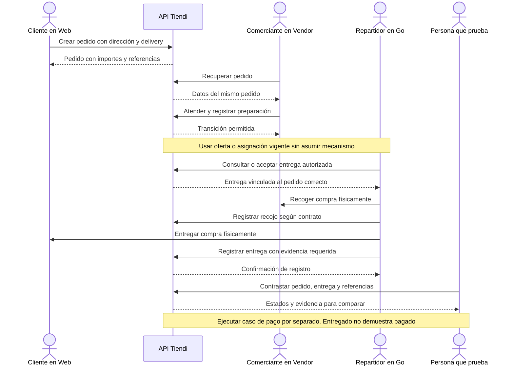

# ORDER-DELIVERY-001 — Comprar con entrega a domicilio

[Volver al plan general](../../PLAN-PRUEBAS-E2E.md)

> Estado: borrador de caso por completar y revalidar. Sin ejecutar. Basado en la revisión del 2026-09-19, organizado el 2026-09-20. Los resultados siguientes son criterios propuestos, no evidencia de implementación ni aprobación.

## Objetivo y alcance

Verificar creación, atención, recojo y entrega de un pedido entre Web, Vendor y Go.

- Actores y superficies: Cliente, comerciante, repartidor de pruebas y API Tiendi.
- Alcance previsto: recorrido integrado de las superficies indicadas. Registrar el alcance real y todos los mocks en la ejecución.
- Prioridad: Alta.

## Preparación y datos

Tienda con delivery, producto disponible, dirección y cobertura de pruebas, repartidor elegible y mecanismo de asignación preparado. Definir canal de pago, total y costo de entrega.

Preparar datos propios de este caso, aunque se reutilice el procedimiento de otro. Registrar entorno, versiones, IDs y valores iniciales. No depender de ejecuciones previas. Definir plazos y condición de espera para procesos asíncronos.

## Pasos y resultados esperados

| Paso | Acción | Resultado esperado |
|---|---|---|
| 1 | Crear compra con delivery en Web | Pedido con dirección, tienda, productos e importes esperados. |
| 2 | Atender y preparar en Vendor | El mismo pedido avanza por las transiciones permitidas. |
| 3 | Asignar o aceptar entrega mediante mecanismo vigente | El repartidor autorizado recibe la entrega vinculada al pedido correcto. |
| 4 | Registrar recojo y completar entrega con evidencia requerida | Las referencias y estados son coherentes en las superficies participantes. |
| 5 | Verificar pago por separado | La prueba del canal elegido acredita cobro y efectos financieros, sin deducirlos del estado entregado. |

## Diagrama de secuencia

Flujo conceptual propuesto a partir de los pasos del caso, pendiente de validar contra la implementación vigente. No representa todas las llamadas internas ni evidencia una ejecución aprobada.

## Verificaciones y evidencias

Guardar IDs de pedido/entrega, eventos, tiempos y prueba sanitizada de entrega. Confirmar que una confirmación Web no se confunde con entrega realizada.

Usar [el registro de ejecución](../PLANTILLAS.md#registro-de-ejecución) para separar esperado y obtenido, con evidencias sanitizadas, controles omitidos y resultado por comprobación.

## Limpieza

Restablecer únicamente los datos de prueba mediante el mecanismo autorizado del entorno. Conservar evidencia antes de limpiar. En movimientos financieros, usar el restablecimiento o compensación permitido, nunca borrar asientos para forzar saldos. Registrar los IDs afectados.

## Pendientes y bloqueos

Confirmar oferta/asignación, códigos de recojo/entrega, instrumentación Go y estados exactos. El happy path Go depende de backend y datos preparados.

Si falta una regla o capacidad necesaria, registrar el bloqueo y su motivo. No aprobar el caso por la existencia de tests o por una pantalla exitosa.

## Referencias

- [Creación de pedido Web](../../../FUENTES/tiendi-web/src/app/features/cart/components/bag/bag.ts); [Operación diaria Vendor](../../../FUENTES/tiendi-vendor/e2e/flujo2-operacion-diaria.spec.ts); [Servicio de entregas Go](../../../FUENTES/tiendi-go/src/services/delivery.service.ts); [Happy path Go](../../../FUENTES/tiendi-go/e2e/happy-path.test.ts); [preparación E2E Go](../../../FUENTES/tiendi-go/e2e/README.md); [Reglas de negocio](../../FLUJO_DINERO.md).
- [Criterios compartidos y límites de implementación](../REFERENCIAS-Y-CRITERIOS.md).
