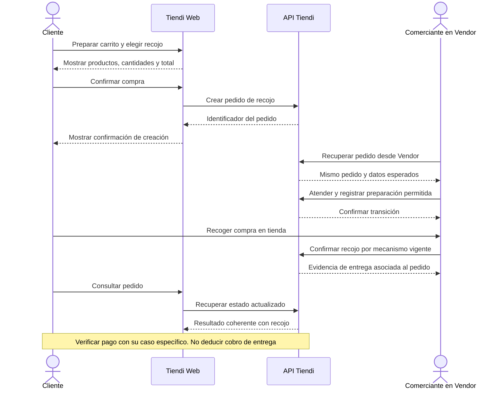

# ORDER-PICKUP-001 — Comprar con recojo en tienda

[Volver al plan general](../../PLAN-PRUEBAS-E2E.md)

> Estado: borrador de caso por completar y revalidar. Sin ejecutar. Basado en la revisión del 2026-09-19, organizado el 2026-09-20. Los resultados siguientes son criterios propuestos, no evidencia de implementación ni aprobación.

## Objetivo y alcance

Seguir un pedido de recojo desde su creación hasta la entrega, comprobando el pago por separado.

- Actores y superficies: Cliente Web, comerciante Vendor y API Tiendi.
- Alcance previsto: recorrido integrado de las superficies indicadas. Registrar el alcance real y todos los mocks en la ejecución.
- Prioridad: Alta.

## Preparación y datos

Tienda habilitada para recojo, producto y disponibilidad conocidos, cliente y vendedor de pruebas. Acordar canal de pago, importes y reglas de disponibilidad antes de ejecutar.

Preparar datos propios de este caso, aunque se reutilice el procedimiento de otro. Registrar entorno, versiones, IDs y valores iniciales. No depender de ejecuciones previas. Definir plazos y condición de espera para procesos asíncronos.

## Pasos y resultados esperados

| Paso | Acción | Resultado esperado |
|---|---|---|
| 1 | Preparar carrito y seleccionar recojo | Productos, cantidades, modalidad e importes corresponden a los datos preparados. |
| 2 | Confirmar compra | Se obtiene un identificador de pedido recuperable en Web y Vendor. |
| 3 | Atender y preparar desde Vendor | Las transiciones permitidas y datos del mismo pedido son coherentes entre actores. |
| 4 | Confirmar recojo por el mecanismo vigente | Existe evidencia de entrega al cliente. El pago se verifica mediante el caso del canal elegido. |

## Diagrama de secuencia

Flujo conceptual propuesto a partir de los pasos del caso, pendiente de validar contra la implementación vigente. No representa todas las llamadas internas ni evidencia una ejecución aprobada.

## Verificaciones y evidencias

Correlacionar ID del pedido, usuario y tienda. Comparar cantidades, total y eventos. Verificar disponibilidad/stock solo contra la regla vigente documentada, no asumir un momento de descuento.

Usar [el registro de ejecución](../PLANTILLAS.md#registro-de-ejecución) para separar esperado y obtenido, con evidencias sanitizadas, controles omitidos y resultado por comprobación.

## Limpieza

Restablecer únicamente los datos de prueba mediante el mecanismo autorizado del entorno. Conservar evidencia antes de limpiar. En movimientos financieros, usar el restablecimiento o compensación permitido, nunca borrar asientos para forzar saldos. Registrar los IDs afectados.

## Pendientes y bloqueos

Confirmar transiciones exactas, mecanismo de entrega, plazos de propagación y políticas de stock/pago. Las pruebas Vendor revisadas no acreditan este recorrido.

Si falta una regla o capacidad necesaria, registrar el bloqueo y su motivo. No aprobar el caso por la existencia de tests o por una pantalla exitosa.

## Referencias

- [Creación de pedido Web](../../../FUENTES/tiendi-web/src/app/features/cart/components/bag/bag.ts); [Operación diaria Vendor](../../../FUENTES/tiendi-vendor/e2e/flujo2-operacion-diaria.spec.ts); [Reglas de negocio](../../FLUJO_DINERO.md).
- [Criterios compartidos y límites de implementación](../REFERENCIAS-Y-CRITERIOS.md).
